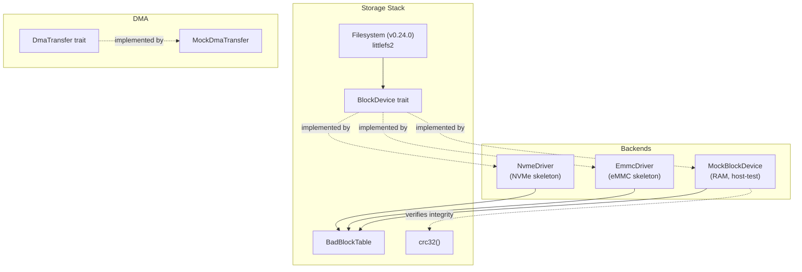

# EnerOS Storage Driver Design — v0.23.0

> **Scope**: Block device abstraction for eMMC / NVMe / SD card, with bad block
> management, CRC32 integrity, DMA transfer abstraction, and a host-testable
> mock backend.
>
> **Crate**: `eneros-storage` (`crates/drivers/storage/`)
> **Version**: v0.23.0 (Phase 1 P1-A)
> **Status**: Implemented — host mock complete, eMMC/NVMe skeletons ready for
> Phase 3 MMIO wiring.

---

## 1. Overview

The storage driver crate provides the lowest storage abstraction in EnerOS:
a unified `BlockDevice` trait that hides whether the backing store is eMMC,
NVMe, SD card, or an in-RAM mock. The filesystem layer (v0.24.0, littlefs2)
sits on top of this trait and is agnostic to the underlying controller.

### v0.23.0 Deliverables

| Component             | Status      | Notes                                                  |
| --------------------- | ----------- | ------------------------------------------------------ |
| `BlockDevice` trait   | Complete    | read/write/erase/flush/health                          |
| `StorageError`        | Complete    | 8 variants, `is_recoverable()` classification          |
| `BadBlockTable`       | Complete    | mark/query/replace/wear-level/remaining-life           |
| `crc32`               | Complete    | IEEE 802.3, table-based, `b"123456789"` → `0xCBF43926` |
| `MockBlockDevice`     | Complete    | RAM-backed, host-testable, bad block + CRC injection   |
| `EmmcDriver`          | Skeleton    | Register map + `encode_cmd` real; I/O returns `NotInitialized` on host |
| `NvmeDriver`          | Skeleton    | Controller register map real; I/O returns `NotInitialized` on host    |
| `DmaTransfer` trait   | Complete    | `dma_read`/`dma_write` with bounds checking            |
| `MockDmaTransfer`     | Complete    | `Vec<u8>`-backed, host-testable                        |
| `create_block_device` | Complete    | Factory dispatching on `StorageType`                   |

---

## 2. Architecture



The `BlockDevice` trait is the single integration point. Callers obtain a
`Box<dyn BlockDevice>` via `create_block_device(&config)` and never need to
know the concrete backend type.

---

## 3. `BlockDevice` Trait Interface

```rust
pub trait BlockDevice {
    fn read_block(&self, block_idx: u64, buf: &mut [u8]) -> Result<(), StorageError>;
    fn write_block(&mut self, block_idx: u64, buf: &[u8]) -> Result<(), StorageError>;
    fn erase_block(&mut self, block_idx: u64) -> Result<(), StorageError>;
    fn block_count(&self) -> u64;
    fn block_size(&self) -> usize;
    fn flush(&mut self) -> Result<(), StorageError>;
    fn health_status(&self) -> DeviceHealth;
}
```

### Contract

- `read_block` / `write_block`: `buf.len()` should equal `block_size()`.
  Implementations copy the overlapping prefix and ignore extra bytes (mock
  behavior); real drivers will require exact alignment.
- `block_idx` is 0-based and must be `< block_count()`. Out-of-range requests
  return `StorageError::OutOfRange`.
- `erase_block` sets the block to a device-specific erased state (all-zeros
  for the mock).
- `flush` forces any pending writes to persistent media. The mock is a no-op.
- `health_status` returns a `DeviceHealth` snapshot derived from the bad
  block table.

### Object Safety

The trait is object-safe: `Box<dyn BlockDevice>` and `Vec<Box<dyn BlockDevice>>`
are both supported (verified by tests in `driver/mod.rs`).

---

## 4. `BadBlockTable` Design

The bad block table tracks defective blocks and allocates replacements from a
reserved pool located at the end of the device.

### Layout

```
| Block 0 .. (N-R-1) | Block (N-R) .. (N-1) |
| User data area     | Reserved pool         |
```

Where `N = total_blocks` and `R = reserved_count`.

### Operations

| Method             | Behavior                                                       |
| ------------------ | -------------------------------------------------------------- |
| `new(N, R)`        | Initializes; reserved pool starts at block `N - R`.            |
| `is_bad(idx)`      | O(n) linear scan of the bad list (n is small in practice).     |
| `mark_bad(idx)`    | Appends to the bad list (deduplicated).                        |
| `get_replacement`  | Returns the next reserved block; `HardwareFault` if exhausted. |
| `wear_level()`     | `(bad_count * 100) / total_blocks`, clamped to 0–100.          |
| `remaining_life()` | `100 - wear_level()`.                                          |

### Wear Leveling Rationale

The wear score is intentionally simple: it reflects the fraction of blocks
that have gone bad. A more sophisticated estimator (based on erase counts
per block) is deferred to v0.24.0 once the filesystem tracks per-block
erase counters.

---

## 5. DMA Transfer Abstraction

```rust
pub trait DmaTransfer {
    fn dma_read(&mut self, block_idx: u64, count: u32, buf: &mut [u8])
        -> Result<(), StorageError>;
    fn dma_write(&mut self, block_idx: u64, count: u32, buf: &[u8])
        -> Result<(), StorageError>;
}
```

The DMA path allows bulk block movement without per-block CPU intervention.
`MockDmaTransfer` validates the bounds-checking and buffer-sizing logic on
the host; the real DMA engine (Phase 3) will wrap the platform's DMA
descriptor format.

`DmaBuffer` is a thin owned wrapper around `(ptr, size, phys_addr)` used to
construct DMA descriptors. It is `Send` because ownership is exclusive.

---

## 6. eMMC Register Map and Command Encoding

The eMMC driver follows the Raspberry-Pi-style EMMC2 controller layout.

### Register Offsets

| Offset | Name            | Purpose                              |
| ------ | --------------- | ------------------------------------ |
| 0x00   | `EMMC_ARG2`     | SDMA buffer address / block count    |
| 0x04   | `EMMC_BLKSIZECNT`| Block size and count                 |
| 0x08   | `EMMC_ARG1`     | Command argument                     |
| 0x0C   | `EMMC_CMDTM`    | Command + transfer mode              |
| 0x10   | `EMMC_RESP0`    | Response word 0                      |
| 0x24   | `EMMC_STATUS`   | Busy/status flags                    |
| 0x30   | `EMMC_INT_STATUS`| Interrupt status                    |

### Command Encoding

`encode_cmd(cmd_type, arg)` produces the 32-bit `CMDTM` value by OR'ing the
base command constant with the 17-bit argument (block address). Supported
commands:

| Command            | Constant                 | SD/eMMC CMD |
| ------------------ | ------------------------ | ----------- |
| `ReadSingleBlock`  | `CMD_READ_SINGLE_BLOCK`  | CMD17       |
| `ReadMultiBlock`   | `CMD_READ_MULTI_BLOCK`   | CMD18       |
| `WriteSingleBlock` | `CMD_WRITE_SINGLE_BLOCK` | CMD24       |
| `WriteMultiBlock`  | `CMD_WRITE_MULTI_BLOCK`  | CMD25       |
| `StopTransmission` | `CMD_STOP_TRANSMISSION`  | CMD12       |
| `Erase`            | `CMD_ERASE`              | CMD38       |

### Status / Interrupt Flags

| Flag                 | Meaning                    |
| -------------------- | -------------------------- |
| `STATUS_DATA_BUSY`   | Data line busy             |
| `STATUS_CMD_BUSY`    | Command line busy          |
| `INT_READ_RDY`       | Read data ready            |
| `INT_WRITE_RDY`      | Write data ready           |
| `INT_DATA_TIMEOUT`   | Data timeout               |
| `INT_DATA_CRC`       | Data CRC error             |
| `INT_CMD_TIMEOUT`    | Command timeout            |

---

## 7. NVMe Register Map

The NVMe driver exposes the controller register offsets per NVMe 1.4 §3.1.

| Offset | Name       | Purpose                          |
| ------ | ---------- | -------------------------------- |
| 0x000  | `NVME_CAP` | Controller Capabilities          |
| 0x008  | `NVME_VS`  | Version                          |
| 0x00C  | `NVME_INTMS`| Interrupt Mask Set               |
| 0x010  | `NVME_INTMC`| Interrupt Mask Clear             |
| 0x014  | `NVME_CC`  | Controller Configuration         |
| 0x01C  | `NVME_CSTS`| Controller Status                |
| 0x020  | `NVME_NSSR`| NSS Reset                        |
| 0x024  | `NVME_AQA` | Admin Queue Attributes           |
| 0x028  | `NVME_ASQ` | Admin Submission Queue Base Addr |
| 0x030  | `NVME_ACQ` | Admin Completion Queue Base Addr |

NVMe has no explicit erase command; deallocate/trim is done via the Dataset
Management command (future work).

---

## 8. Error Handling and Retry Strategy

`StorageError` classifies errors into recoverable and non-recoverable:

| Variant          | Recoverable | Retry Strategy                          |
| ---------------- | ----------- | --------------------------------------- |
| `NotInitialized` | No          | Caller must call `init()` first.        |
| `Timeout`        | **Yes**     | Retry up to N times with backoff.       |
| `BadBlock`       | No          | Mark bad, request replacement, remap.   |
| `DmaError`       | **Yes**     | Reset DMA channel, retry.               |
| `CrcMismatch`    | No          | Re-read; if persistent, mark block bad. |
| `OutOfRange`     | No          | Caller bug — reject.                    |
| `HardwareFault`  | No          | Quarantine device, failover.            |
| `WriteProtected` | No          | Reject write, surface to user.          |

The `is_recoverable()` method drives the upper-layer retry loop: recoverable
errors trigger an automatic retry with bounded backoff; non-recoverable
errors propagate immediately.

---

## 9. Testing Strategy

### Host Mock Tests (current)

All algorithms are exercised on the host via `MockBlockDevice` and
`MockDmaTransfer`:

- **CRC32**: known vectors (`b"123456789"` → `0xCBF43926`), empty input,
  determinism, length sensitivity.
- **BadBlockTable**: mark/query/replace/exhaust/duplicate/wear-level.
- **MockBlockDevice**: read-write roundtrip, out-of-range, bad block,
  CRC injection, erase, health status, multi-block, overwrite, partial
  buffer, zero-block device.
- **EmmcDriver**: `encode_cmd` for all command types, arg masking,
  uninitialized behavior, out-of-range, flush, health.
- **NvmeDriver**: register offsets, uninitialized behavior, init.
- **MockDmaTransfer**: roundtrip, bounds checking, buffer sizing,
  non-overlapping blocks, `Send` bound.
- **Factory**: create eMMC/NVMe/SD card, trait object dispatch.

Target: ≥40 unit tests (achieved: 60+).

### QEMU / Hardware Tests (future)

- Cross-compile to `aarch64-unknown-none` (verified in CI).
- QEMU virt with a backing eMMC image (Phase 3).
- Real hardware:飞腾 D2000 eMMC, 鲲鹏 920 NVMe (Phase 3+).

---

## 10. Future Work

### v0.24.0 — Filesystem Integration

- Integrate `littlefs2` on top of `BlockDevice`.
- Power-loss-safe journaling via littlefs2's wear leveling.
- Per-block erase counter for accurate wear leveling.

### v0.24.1+ — Driver Hardening

- Wire `EmmcDriver` to real MMIO via `StorageMmio` (volatile reads/writes).
- Wire `NvmeDriver` to PCIe BAR mapping + admin queue submission.
- Implement `DmaTransfer` for the platform DMA engine.
- Add interrupt-driven completion (replace polling).

### v0.30.0+ — Partition / Encryption

- Block-level partition table parsing.
- Optional AES-XTR / SM4 encryption layer below the filesystem.

---

## 11. Configuration Reference

See `configs/storage.toml` for the device-tree-style configuration template.
Key fields:

| Field                  | Default      | Description                          |
| ---------------------- | ------------ | ------------------------------------ |
| `storage_type`         | `"emmc"`     | Backend: `emmc` / `nvme` / `sdcard`  |
| `base_addr`            | `0xFF3F0000` | MMIO base address                    |
| `irq_num`              | `62`         | Interrupt number                     |
| `dma_channel`          | `0`          | DMA channel (0–15)                   |
| `block_size`           | `512`        | Block size in bytes                  |
| `max_transfer_blocks`  | `256`        | Max blocks per DMA transfer          |
| `reserved_count`       | `1024`       | Reserved blocks for bad block replacement |
| `scan_on_boot`         | `true`       | Full bad block scan on initialization |

---

## 12. References

- JEDEC Standard No. 84-B51 — eMMC Electrical Standard (5.1).
- NVMe 1.4 Specification — NVM Express, Inc.
- IEEE 802.3 CRC32 polynomial (0xEDB88320 reversed).
- EnerOS Blueprint v1.2 §43.1 (no_std compliance).
- EnerOS Memory Budget §43.6 — filesystem cache ≤ 16 MB.
