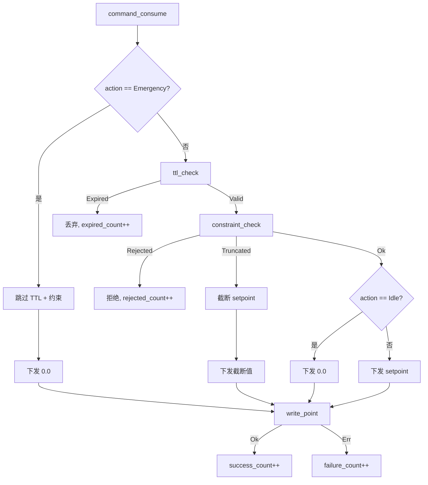
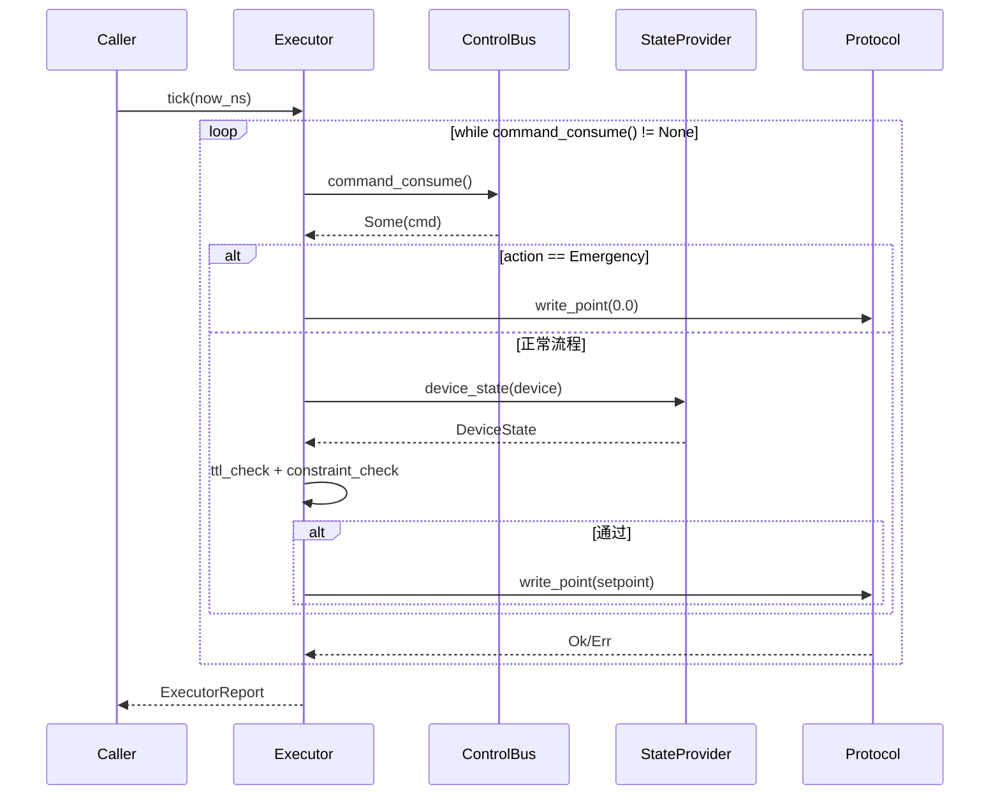

# EnerOS 命令消费与执行器设计 — Control Bus → TTL → 约束 → 协议下发完整链路

> **版本**：v0.56.0（P1-H RTOS 组件第三层）
> **crate**：`eneros-rtos-cmd-exec`（`crates/kernel/rtos-cmd-exec/`）
> **蓝图依据**：`蓝图/phase1.md` §v0.56.0
> **最后更新**：2026-07-15

---

## 1. 版本目标

### 1.1 一句话目标

实现命令消费与执行器（Command Executor），将 Agent 平面下发的 `ControlCommand` 经 TTL 校验、约束检查后，通过 `PointAccess` 下发到设备协议层，完成"Control Bus → TTL → 约束 → 协议下发"完整链路。

### 1.2 详细描述

v0.22.0 Control Bus 定义了命令的承载与传输（`command_send` / `command_consume`）以及 TTL/约束的**判定函数**（`ttl_check` / `constraint_check`），但并未定义命令的**执行器**——即"取出命令后如何安全下发到设备"这一环。v0.54.0 控制闭环引擎（`ControlLoopEngine`）关注的是 10ms 周期的 PID 反馈控制，其读取命令是为了驱动控制律，而非负责命令本身的下发策略。本版本填补这一空缺：实现一个独立的命令执行器，专门负责命令的消费、校验、下发与统计。

执行器以"单步驱动（`tick(now_ns)`）"方式由分区调度器周期性调用。每个 tick 内，执行器循环消费 Control Bus 上的全部待执行命令，对每条命令依次完成：

1. **Emergency 旁路判定**——若 `action == Emergency`，跳过 TTL 与约束检查，直接下发 `0.0`（安全优先，紧急停机必须立即执行）。
2. **TTL 校验**——复用 v0.22.0 `ttl_check()`，过期命令丢弃并计数。
3. **约束检查**——复用 v0.22.0 `constraint_check()`，需注入当前 `DeviceState`；硬限越限拒绝，功率越限截断。
4. **Idle 特殊处理**——`action == Idle` 时下发 `0.0`（空闲动作将设备置零）。
5. **协议下发**——通过 `DevicePointMap` 将 `DeviceId` 映射为 `PointId`，调用 `PointAccess::write_point()` 下发 `PointValue::Float(setpoint)`。

整个过程必须在调度周期（典型 10ms）内完成，单 tick 处理的命令数受 Control Bus 环形缓冲容量（16 槽）限制。执行器不持有命令队列，每个 tick 清空 Control Bus，确保命令不积压。

### 1.3 架构定位

| 维度 | 定位 |
|------|------|
| Phase | Phase 1 单机 MVP |
| 子系统 | P1-H RTOS 组件第三层，命令执行层 |
| 平面 | 快平面（RTOS 分区，Core 0） |
| 角色 | 快平面命令消费与安全下发核心 |
| 上游版本 | v0.22.0 Control Bus（命令源）、v0.51.0 PointAccess（下发通道）、v0.55.0 SamplingService（设备状态来源） |
| 同层版本 | v0.54.0 ControlLoopEngine（控制闭环）、v0.55.0 SamplingService（高频采样） |
| 下游版本 | v0.57.0 降级规则引擎（依赖本执行器的统计与下发能力） |
| 后续版本 | Phase 3 seL4 集成时，`PointAccess` 下发通道替换为 seL4 notification/endpoint |

### 1.4 设计原则关联

| 原则 | 体现 |
|------|------|
| 安全优先 | Emergency 动作旁路全部检查，直接下发 0.0，确保紧急停机零延迟（D8） |
| 复用优先 | TTL/约束检查复用 v0.22.0 既有函数，不重复造轮子（D1，记忆文件 §5.5） |
| 确定性 | 单步 `tick(now_ns)` 由 v0.19.0 分区调度器严格时间触发，非事件驱动（D5） |
| 故障隔离 | 未映射设备跳过、单点写入失败计数后继续，不中断整批执行（§9） |
| 可观测 | 7 个 `u64` 计数器覆盖消费/过期/拒绝/截断/成功/失败/紧急 全路径（§10） |
| no_std 合规 | 全 crate 仅使用 `core::*` / `alloc::*`，无 `std::*`（蓝图 §43.1） |

---

## 2. 架构定位

### 2.1 P1-H RTOS 组件分层

P1-H RTOS 组件按"数据采集 → 控制计算 → 命令执行"三层层级组织，本版本位于第三层：

| 层级 | 版本 | crate | 职责 |
|------|------|-------|------|
| 第一层（控制闭环） | v0.54.0 | `eneros-rtos-control` | 10ms 周期 PID 控制律计算，设定值跟踪 |
| 第二层（高频采样） | v0.55.0 | `eneros-rtos-sampling` | 100ms 周期设备状态采集，共享内存快照 |
| **第三层（命令执行）** | **v0.56.0** | **`eneros-rtos-cmd-exec`** | **命令消费 → TTL → 约束 → 协议下发** |

三层关系：采样层提供设备状态快照（供约束检查读取 `DeviceState`）；控制闭环层计算控制律产出设定值（通过 Agent 写入 Control Bus）；命令执行层消费 Control Bus 命令并安全下发到设备。三者均以单步 `tick` 方式由 v0.19.0 分区调度器驱动，同处 Core 0 快平面。

### 2.2 与同层组件的职责边界

| 组件 | 输入 | 输出 | 与本执行器关系 |
|------|------|------|---------------|
| `ControlLoopEngine`（v0.54.0） | 反馈点（`PointAccess::read_point`）+ 设定值 | PID 输出（控制量） | 控制闭环的输出经 Agent 决策后写入 Control Bus，由本执行器下发；二者不直接耦合 |
| `SamplingService`（v0.55.0） | `PointAccess::read_point` | `SharedMemorySnapshot` | 采样服务是 `DeviceStateProvider` 的生产环境实现来源（§5），为本执行器的约束检查提供 `DeviceState` |
| `CommandExecutor`（v0.56.0） | `command_consume()` + `DeviceState` | `PointAccess::write_point()` | 消费 Control Bus 命令，校验后下发 |

### 2.3 上下游依赖图

```
v0.22.0 Control Bus ──► command_consume() ──► v0.56.0 CommandExecutor
                                                    │
v0.51.0 PointAccess ◄──── write_point() ◄──────────┤
                                                    │
v0.55.0 SamplingService ──► DeviceState ───────────┤
                                                    │
v0.50.0 UPA Model ──► PointId / PointValue ────────┤
                                                    ▼
                                            v0.57.0 降级规则引擎
```

### 2.4 不做的事（职责边界）

本执行器**不负责**以下职责，避免与上下游重叠：

| 不做的事 | 归属版本 | 理由 |
|---------|---------|------|
| 命令的生成与下发到 Control Bus | Agent 平面（v0.39.0 能力 Token 签发） | 执行器只消费，不生产命令 |
| 双平面降级决策（Normal/WaitForCommand/SafeDefault） | v0.22.0 `execute_or_fallback` | 降级模式判定已由 Control Bus 提供 |
| PID 控制律计算 | v0.54.0 `ControlLoopEngine` | 控制算法与命令下发解耦 |
| 设备状态采集 | v0.55.0 `SamplingService` | 执行器通过 `DeviceStateProvider` trait 抽象状态来源 |
| 降级规则引擎 | v0.57.0 | 本版本仅提供统计供降级决策，不实现降级逻辑 |

---

## 3. 核心类型

### 3.1 核心类型总表

| 类型 | 类别 | 说明 | 章节 |
|------|------|------|------|
| `CommandExecutor<P, S>` | struct（泛型） | 命令执行器主体 | §4 |
| `DeviceStateProvider` | trait | 设备状态来源抽象 | §5 |
| `DevicePointMap` | struct | DeviceId → PointId 映射 | §6 |
| `ExecutorStats` | struct | 累计统计（7 个 u64 计数器） | §10 |
| `ExecutorReport` | struct | 单次 tick 汇总报告 | §10 |
| `ExecutorError` | enum | 错误枚举（4 变体） | §9 |
| `MockDeviceStateProvider` | struct（测试） | 测试用状态提供者 | §5 |

### 3.2 类型依赖关系

```
CommandExecutor<P: PointAccess, S: DeviceStateProvider>
    ├── point_access: P              (v0.51.0 PointAccess)
    ├── state_provider: S            (本 crate DeviceStateProvider trait)
    ├── point_map: DevicePointMap    (本 crate)
    └── stats: ExecutorStats         (本 crate)

DeviceStateProvider
    └── fn device_state(&self, device: DeviceId) -> Option<DeviceState>
                                            └── v0.22.0 controlbus::DeviceState

DevicePointMap
    └── fn get(&self, device: DeviceId) -> Option<PointId>
                                    └── v0.50.0 upa_model::PointId (u32)
```

### 3.3 与既有类型的复用关系

| 既有类型 | 来源版本 | 复用方式 |
|---------|---------|---------|
| `ControlCommand` | v0.22.0 `controlbus::command` | `command_consume()` 返回值，直接读取字段 |
| `ControlAction` | v0.22.0 `controlbus::command` | `Charge`/`Discharge`/`Idle`/`Emergency` 分支判定 |
| `DeviceId(pub u32)` | v0.22.0 `controlbus::command` | 命令目标设备标识 |
| `DeviceState` | v0.22.0 `controlbus::constraint` | 约束检查输入（soc/voltage/frequency/current_power） |
| `ttl_check()` / `TtlStatus` | v0.22.0 `controlbus::ttl` | TTL 校验直接调用（D1） |
| `constraint_check()` / `ConstraintResult` | v0.22.0 `controlbus::constraint` | 约束检查直接调用（D1） |
| `PointAccess` | v0.51.0 `protocol_abstract::access` | 协议下发通道（`write_point`） |
| `PointId` (`u32`) | v0.50.0 `upa_model::point` | 设备点标识 |
| `PointValue` | v0.50.0 `upa_model::point` | 下发值类型（`Float(f64)`） |

> **注意**：`controlbus::DeviceId` 是 `u32`，而 `upa_model::DeviceId` 是 `u16`。本执行器使用的 `DeviceId` 一律指 `controlbus::DeviceId`（u32），因为命令的 `target_device` 字段类型为 `controlbus::DeviceId`。`DevicePointMap` 的 key 也是 `controlbus::DeviceId`（u32）。

---

## 4. CommandExecutor

### 4.1 结构定义

```rust
use eneros_controlbus::{DeviceId, DeviceState};
use eneros_protocol_abstract::access::PointAccess;
use eneros_upa_model::{PointId, PointValue};

use crate::device_point_map::DevicePointMap;
use crate::device_state_provider::DeviceStateProvider;
use crate::stats::{ExecutorStats, ExecutorReport};

/// 命令执行器（泛型 `<P: PointAccess, S: DeviceStateProvider>`，D6）。
///
/// 消费 Control Bus 命令，经 TTL 校验与约束检查后，通过 `PointAccess`
/// 下发到设备协议层。以单步 `tick(now_ns)` 方式驱动（D5）。
pub struct CommandExecutor<P: PointAccess, S: DeviceStateProvider> {
    /// 协议下发通道（泛型，D6：避免 `Box<dyn>` 堆分配）
    point_access: P,
    /// 设备状态来源（泛型，D3：抽象状态提供者）
    state_provider: S,
    /// DeviceId → PointId 映射（D4）
    point_map: DevicePointMap,
    /// 累计统计（普通 u64，D7）
    stats: ExecutorStats,
}
```

### 4.2 字段说明

| # | 字段 | 类型 | 说明 |
|---|------|------|------|
| 1 | `point_access` | `P`（泛型，`P: PointAccess`） | 协议下发通道，调用 `write_point(point_id, value)` 下发命令设定值。泛型而非 `Box<dyn PointAccess>`（D6），避免堆分配与动态分发开销，与 v0.54.0 D6、v0.55.0 D6 一致 |
| 2 | `state_provider` | `S`（泛型，`S: DeviceStateProvider`） | 设备状态来源，调用 `device_state(device_id)` 获取 `DeviceState` 供约束检查。生产环境由 `SamplingService` 适配实现，测试用 `MockDeviceStateProvider`（D3） |
| 3 | `point_map` | `DevicePointMap` | `controlbus::DeviceId(u32)` → `upa_model::PointId(u32)` 映射表。`ControlCommand` 仅携带 `target_device: DeviceId`，而 `PointAccess::write_point` 需要 `PointId`，二者通过本映射转换（D4） |
| 4 | `stats` | `ExecutorStats` | 累计统计，7 个 `u64` 计数器（D7：普通 u64，非 AtomicU64）。单线程读写，无并发，与 v0.54.0 D8、v0.55.0 D7 一致 |

### 4.3 构造函数

```rust
impl<P: PointAccess, S: DeviceStateProvider> CommandExecutor<P, S> {
    /// 构造执行器。
    ///
    /// - `point_access`：协议下发通道
    /// - `state_provider`：设备状态来源
    /// - `point_map`：DeviceId → PointId 映射
    pub fn new(point_access: P, state_provider: S, point_map: DevicePointMap) -> Self {
        Self {
            point_access,
            state_provider,
            point_map,
            stats: ExecutorStats::default(),
        }
    }
}
```

### 4.4 tick 单步驱动（D5）

```rust
impl<P: PointAccess, S: DeviceStateProvider> CommandExecutor<P, S> {
    /// 单步驱动（D5：替代阻塞式 process_commands() 循环）。
    ///
    /// 由 v0.19.0 分区调度器周期性调用。`now_ns` 为当前单调时间戳
    /// （纳秒，D12 注入），与 `ControlCommand.timestamp` 单位一致。
    ///
    /// 每个 tick 循环消费 Control Bus 上的全部待执行命令，直到
    /// `command_consume()` 返回 `None`（队列为空）。
    pub fn tick(&mut self, now_ns: u64) -> ExecutorReport {
        let mut report = ExecutorReport::default();

        while let Some(cmd) = eneros_controlbus::command_consume() {
            report.consumed += 1;
            self.execute_command(&cmd, now_ns, &mut report);
        }

        self.stats.merge_report(&report);
        report
    }
}
```

**设计说明**：

- **单步而非阻塞循环**（D5）：蓝图原文描述为 `process_commands()` 阻塞循环，本设计改为 `tick(now_ns) -> ExecutorReport` 单步接口，与 v0.54.0 D3、v0.55.0 D5 一致。阻塞循环在 no_std 单线程下无法单元测试，且与分区调度器的时间触发模型冲突。
- **now_ns 单位**（D12）：`ControlCommand.timestamp` 为纳秒（v0.22.0 实际实现），`ttl_check()` 接受 `now_ns: u64` 纳秒参数。本执行器统一使用纳秒，与 controlbus 一致。注意 v0.55.0 采样服务使用微秒（`now_us`），二者时间单位不同，因各自对接的底层 API 不同。
- **清空队列**：每个 tick 循环消费直到队列空，确保命令不积压。Control Bus 环形缓冲容量 16 槽（v0.22.0），单 tick 最多处理 16 条命令。

### 4.5 execute_command 内部分发

```rust
impl<P: PointAccess, S: DeviceStateProvider> CommandExecutor<P, S> {
    /// 执行单条命令的内部分发逻辑。
    fn execute_command(&mut self, cmd: &ControlCommand, now_ns: u64, report: &mut ExecutorReport) {
        use eneros_controlbus::ControlAction;

        // 1. Emergency 旁路（D8：跳过 TTL + 约束，直接下发 0.0）
        if cmd.action == ControlAction::Emergency {
            self.write_zero(cmd, report);
            report.emergency += 1;
            return;
        }

        // 2. TTL 校验（D1：复用 v0.22.0 ttl_check）
        if eneros_controlbus::ttl_check(cmd, now_ns) == TtlStatus::Expired {
            report.expired += 1;
            return;
        }

        // 3. 约束检查（D1：复用 v0.22.0 constraint_check，需 DeviceState）
        let setpoint = match self.resolve_setpoint(cmd) {
            Ok(sp) => sp,
            Err(()) => {
                report.rejected += 1;
                return;
            }
        };

        // 4. 下发（Idle → 0.0，其他 → setpoint）
        if cmd.action == ControlAction::Idle {
            self.write_value(cmd, 0.0, report);  // D9：Idle 下发 0.0
        } else {
            self.write_value(cmd, setpoint, report);
        }
    }
}
```

---

## 5. DeviceStateProvider

### 5.1 trait 定义

`constraint_check()` 需要 `&DeviceState` 作为输入（v0.22.0 实际签名：`fn constraint_check(cmd: &ControlCommand, state: &DeviceState) -> ConstraintResult`）。蓝图原文未定义 `DeviceState` 的来源，本设计引入 `DeviceStateProvider` trait 抽象状态来源（D3）。

```rust
use eneros_controlbus::{DeviceId, DeviceState};

/// 设备状态来源抽象（D3）。
///
/// `constraint_check()` 需要当前 `DeviceState`（SOC/电压/频率/功率），
/// 本 trait 抽象状态来源，解耦执行器与具体状态采集实现。
///
/// - **生产环境**：由 `SamplingService`（v0.55.0）适配实现，
///   从 `SharedMemorySnapshot` 读取最新采样快照转换得到。
/// - **测试环境**：由 `MockDeviceStateProvider` 提供（§5.3）。
pub trait DeviceStateProvider {
    /// 获取指定设备的当前状态。
    ///
    /// 返回 `None` 表示该设备状态不可用（如未采样到、设备离线）。
    /// 调用方（执行器）应将 `None` 视为约束检查无法通过，跳过该命令。
    fn device_state(&self, device: DeviceId) -> Option<DeviceState>;
}
```

### 5.2 设计说明

| 维度 | 说明 |
|------|------|
| 为什么需要 trait | `constraint_check` 签名要求 `&DeviceState`，而 `DeviceState` 的来源（采样服务/测试 mock/直接读取）不应硬编码进执行器。trait 提供依赖反转，使执行器可测试 |
| 为什么返回 `Option` | 设备可能尚未采样到、已离线、或不在采样列表中。返回 `None` 让执行器决策（跳过+计数），而非 panic |
| 不要求 `Send + Sync` | 与 v0.51.0 `PointAccess` 一致，no_std 单线程无需该约束 |
| `DeviceState` 来源 | v0.22.0 `controlbus::constraint::DeviceState`，4 个 `f32` 字段（soc/voltage/frequency/current_power） |

### 5.3 MockDeviceStateProvider（测试用）

```rust
/// 测试用设备状态提供者。
///
/// 内部维护 `DeviceId → DeviceState` 映射，`device_state()` 查表返回。
#[cfg(test)]
pub struct MockDeviceStateProvider {
    states: alloc::collections::BTreeMap<u32, DeviceState>,
}

#[cfg(test)]
impl MockDeviceStateProvider {
    pub fn new() -> Self {
        Self { states: alloc::collections::BTreeMap::new() }
    }

    /// 设置指定设备的状态。
    pub fn set_state(&mut self, device: u32, state: DeviceState) {
        self.states.insert(device, state);
    }
}

#[cfg(test)]
impl DeviceStateProvider for MockDeviceStateProvider {
    fn device_state(&self, device: DeviceId) -> Option<DeviceState> {
        self.states.get(&device.0).copied()
    }
}
```

### 5.4 生产环境适配（SamplingService 适配）

生产环境中，`DeviceStateProvider` 由 v0.55.0 `SamplingService` 的快照适配实现。适配逻辑将 `SharedMemorySnapshot` 中的 `SampledPoint` 转换为 `controlbus::DeviceState`：

| `DeviceState` 字段 | 快照来源 | 转换 |
|---------------------|---------|------|
| `soc` | `SampledPoint{ point_id = SOC 点, value }` | `value as f32` |
| `voltage` | `SampledPoint{ point_id = 电压点, value }` | `value as f32` |
| `frequency` | `SampledPoint{ point_id = 频率点, value }` | `value as f32` |
| `current_power` | `SampledPoint{ point_id = 功率点, value }` | `value as f32` |

> **注意**：本版本不实现该适配器（属集成层职责），仅定义 trait 契约。适配器在系统集成阶段实现，通过泛型注入 `CommandExecutor`。

---

## 6. DevicePointMap

### 6.1 结构定义

`ControlCommand` 仅携带 `target_device: controlbus::DeviceId(u32)`，而 `PointAccess::write_point()` 需要 `upa_model::PointId(u32)`。蓝图原文假设 `ControlCommand` 有 `to_point_writes()` 方法直接产出点写入列表，但 v0.22.0 实际实现无此方法（D4）。本设计引入 `DevicePointMap` 完成映射。

```rust
use alloc::collections::BTreeMap;
use eneros_controlbus::DeviceId;
use eneros_upa_model::PointId;

/// DeviceId → PointId 映射表（D4）。
///
/// `ControlCommand.target_device` 类型为 `controlbus::DeviceId(u32)`，
/// 而 `PointAccess::write_point()` 需要 `PointId(u32)`。本映射表
/// 完成二者转换。
///
/// 使用 `BTreeMap<u32, u32>`：
/// - key：`DeviceId.0`（u32）
/// - value：`PointId`（u32）
///
/// 选 BTreeMap 而非 HashMap：no_std 下 `BTreeMap` 无需哈希函数，
/// 且设备数通常 ≤ 64，O(log n) 查找足够快。
pub struct DevicePointMap {
    map: BTreeMap<u32, u32>,
}
```

### 6.2 字段与方法

| # | 字段 | 类型 | 说明 |
|---|------|------|------|
| 1 | `map` | `BTreeMap<u32, u32>` | DeviceId → PointId 映射，key 为 `DeviceId.0`，value 为 `PointId` |

```rust
impl DevicePointMap {
    /// 构造空映射表。
    pub fn new() -> Self {
        Self { map: BTreeMap::new() }
    }

    /// 从 `(device_id, point_id)` 对列表构造。
    pub fn from_pairs(pairs: &[(u32, u32)]) -> Self {
        let mut map = BTreeMap::new();
        for &(dev, pid) in pairs {
            map.insert(dev, pid);
        }
        Self { map }
    }

    /// 查询 DeviceId 对应的 PointId。
    ///
    /// 返回 `None` 表示该设备未配置点映射（执行器应跳过该命令，§9）。
    pub fn get(&self, device: DeviceId) -> Option<PointId> {
        self.map.get(&device.0).copied()
    }

    /// 添加映射。
    pub fn insert(&mut self, device: u32, point_id: u32) {
        self.map.insert(device, point_id);
    }
}
```

### 6.3 设计说明

| 维度 | 说明 |
|------|------|
| 为什么需要映射 | `ControlCommand` 在 Control Bus 层用 `DeviceId` 寻址设备，而协议下发层 `PointAccess` 用 `PointId` 寻址点。二者命名空间不同，需映射表转换（D4） |
| 为什么用 `BTreeMap` | no_std 下 `alloc::collections::BTreeMap` 可用且无需哈希函数；`HashMap` 需 `hashbrown` 额外依赖。设备数 ≤ 64，`BTreeMap` 的 O(log n) 查找（约 6 次比较）完全满足实时性 |
| 映射粒度 | 本版本为**设备级映射**（一个 DeviceId 对应一个下发点）。若未来需多点下发（一个设备多个设定值点），可扩展为 `BTreeMap<u32, Vec<u32>>` |
| 配置来源 | 映射表在系统初始化阶段由配置文件/设备树加载，构造 `DevicePointMap` 后注入 `CommandExecutor`。运行时只读 |

### 6.4 未映射设备处理

当 `point_map.get(cmd.target_device)` 返回 `None` 时，表示该设备未配置点映射。执行器采用**跳过+计数**策略（§9），不报错、不 panic：

```rust
match self.point_map.get(cmd.target_device) {
    Some(point_id) => { /* 正常下发 */ }
    None => {
        report.skipped += 1;  // 未映射设备跳过
        return;
    }
}
```

---

## 7. 执行流程

### 7.1 执行链路流程图



### 7.2 流程步骤详解

| 步骤 | 操作 | 调用 | 结果分支 |
|------|------|------|---------|
| 1 | 消费命令 | `command_consume()` | `None` → 结束 tick；`Some(cmd)` → 步骤 2 |
| 2 | Emergency 判定 | `cmd.action == Emergency` | 是 → 步骤 3a；否 → 步骤 4 |
| 3a | Emergency 旁路 | 跳过 TTL + 约束 | → 步骤 7（下发 0.0） |
| 4 | TTL 校验 | `ttl_check(&cmd, now_ns)` | `Expired` → 丢弃（expired++）；`Valid` → 步骤 5 |
| 5 | 约束检查 | `constraint_check(&cmd, &state)` | `Rejected` → 拒绝（rejected++）；`Truncated(sp)` → 截断；`Ok` → 步骤 6 |
| 6 | Idle 判定 | `cmd.action == Idle` | 是 → 步骤 7（下发 0.0）；否 → 步骤 7（下发 setpoint/截断值） |
| 7 | 协议下发 | `write_point(point_id, value)` | `Ok` → 成功（success++）；`Err` → 失败（failure++） |

### 7.3 resolve_setpoint 约束解析

约束检查需要 `DeviceState`，且 `ConstraintResult::Truncated` 会修改 setpoint。本方法封装"获取状态 + 约束检查 + 解析最终 setpoint"三步：

```rust
impl<P: PointAccess, S: DeviceStateProvider> CommandExecutor<P, S> {
    /// 解析命令的最终下发设定值（含约束检查与截断）。
    ///
    /// 返回 `Ok(f32)` 为最终 setpoint，`Err(())` 表示约束检查拒绝或
    /// 设备状态不可用。
    fn resolve_setpoint(&self, cmd: &ControlCommand) -> Result<f32, ()> {
        // 获取设备状态（D3：通过 DeviceStateProvider trait）
        let state = match self.state_provider.device_state(cmd.target_device) {
            Some(s) => s,
            None => return Err(()),  // 状态不可用，视为约束不通过
        };

        // 约束检查（D1：复用 v0.22.0 constraint_check）
        match eneros_controlbus::constraint_check(cmd, &state) {
            ConstraintResult::Ok => Ok(cmd.setpoint),
            ConstraintResult::Truncated(sp) => Ok(sp),  // 截断后的 setpoint
            ConstraintResult::Rejected => Err(()),       // 硬限越限
        }
    }
}
```

### 7.4 write_value 下发与类型转换

下发时需将 `f32` setpoint 转换为 `PointValue::Float(f64)`（D10），因为 `upa_model::PointValue::Float` 是 `f64` 而非 `f32`：

```rust
impl<P: PointAccess, S: DeviceStateProvider> CommandExecutor<P, S> {
    /// 下发设定值到设备协议层。
    ///
    /// D10：setpoint(f32) → f64 → PointValue::Float(f64)。
    fn write_value(&mut self, cmd: &ControlCommand, setpoint: f32, report: &mut ExecutorReport) {
        let point_id = match self.point_map.get(cmd.target_device) {
            Some(pid) => pid,
            None => {
                report.skipped += 1;  // 未映射设备跳过（§6.4）
                return;
            }
        };

        // D10：f32 → f64 → PointValue::Float
        let value = PointValue::Float(setpoint as f64);

        match self.point_access.write_point(point_id, value) {
            Ok(()) => report.success += 1,
            Err(_) => report.failure += 1,
        }
    }

    /// Emergency 旁路的 0.0 下发（D8：复用 write_value，setpoint=0.0）。
    fn write_zero(&mut self, cmd: &ControlCommand, report: &mut ExecutorReport) {
        self.write_value(cmd, 0.0, report);
    }
}
```

### 7.5 setpoint 类型转换说明（D10）

| 维度 | 说明 |
|------|------|
| `ControlCommand.setpoint` 类型 | `f32`（v0.22.0 实际实现） |
| `PointValue::Float` 类型 | `f64`（v0.50.0 `upa_model` 实际实现） |
| 转换 | `setpoint as f64`，f32 → f64 为无损扩展，无精度损失 |
| 为什么不直接用 f32 | `PointValue` 是统一值类型，覆盖遥测/遥信/遥调等多种场景，f64 是通用选择。执行器仅做单向 f32→f64 转换 |
| 反向（读取）不涉及 | 执行器只写不读，无需 f64→f32 转换 |

---

## 8. Emergency 旁路

### 8.1 设计动机

`ControlAction::Emergency` 表示紧急停机命令，要求**立即执行、零延迟**。若 Emergency 命令仍需经过 TTL 校验与约束检查，可能出现以下危险场景：

| 场景 | 不旁路的后果 | 旁路后的行为 |
|------|------------|------------|
| Emergency 命令 TTL 已过期 | 命令被丢弃，设备继续运行 | 立即下发 0.0，设备停机 |
| Emergency 命令约束检查越限（如电压已超限） | 命令被拒绝，设备继续运行 | 立即下发 0.0，设备停机 |
| 设备状态不可用 | 约束检查无法通过，命令跳过 | 立即下发 0.0，设备停机 |

**安全优先原则**：紧急停机的代价（误停机）远低于未停机的代价（设备损坏/安全事故）。因此 Emergency 命令旁路全部检查，直接下发 0.0（D8）。

### 8.2 旁路逻辑

```rust
// execute_command 内部（§4.5）
if cmd.action == ControlAction::Emergency {
    self.write_zero(cmd, report);   // 直接下发 0.0，跳过 TTL + 约束
    report.emergency += 1;          // 统计 Emergency 执行次数
    return;                         // 不进入正常流程
}
```

### 8.3 旁路范围

| 检查项 | 正常命令 | Emergency 命令 | 理由 |
|--------|---------|---------------|------|
| TTL 校验 | ✅ 执行 | ❌ 跳过 | 紧急命令不应因过期被丢弃 |
| 约束检查 | ✅ 执行 | ❌ 跳过 | 紧急停机本身就是脱离约束的安全动作 |
| DeviceState 获取 | ✅ 需要 | ❌ 不需要 | 旁路约束检查则无需状态 |
| DevicePointMap 映射 | ✅ 查询 | ✅ 查询 | 仍需知道下发到哪个点 |
| write_point 下发 | ✅ 执行 | ✅ 执行 | 值为 0.0 |

### 8.4 Emergency 下发值

Emergency 下发值为 `0.0`，语义为"功率归零/输出切断"：

| 动作类型 | 下发值 | 语义 |
|---------|--------|------|
| `Emergency` | `0.0` | 紧急停机，功率归零 |
| `Idle` | `0.0` | 空闲，设备置零（D9） |
| `Charge` | `setpoint`（或截断值） | 充电，按设定值 |
| `Discharge` | `setpoint`（或截断值） | 放电，按设定值 |

> **注意**：Emergency 与 Idle 都下发 0.0，但语义不同。Emergency 是**安全动作**（旁路检查），Idle 是**正常动作**（仍需 TTL + 约束检查通过后才下发 0.0）。统计上分别计入 `emergency_count` 和 `success_count`。

### 8.5 Idle 特殊处理（D9）

`ControlAction::Idle` 表示"无主动功率命令，保持当前状态"。蓝图原文未定义 Idle 的特殊处理，本设计规定 Idle 在通过 TTL + 约束检查后下发 `0.0`（D9）：

| 理由 | 说明 |
|------|------|
| 设备置零 | "保持当前状态"在功率控制语境下意味着输出归零，避免设备维持上次的非零设定值 |
| 与 Emergency 区分 | Idle 经正常校验流程，Emergency 旁路校验；二者下发值相同（0.0）但路径不同 |
| 安全性 | 即使 Idle 命令，也需确认 TTL 未过期、约束未越限，避免过期 Idle 导致设备异常 |

---

## 9. 错误处理

### 9.1 ExecutorError 枚举

```rust
/// 执行器错误枚举（4 变体）。
#[derive(Debug, Clone, Copy, PartialEq, Eq)]
pub enum ExecutorError {
    /// 设备未在 DevicePointMap 中映射（跳过，不报错）
    DeviceNotMapped,
    /// 设备状态不可用（DeviceStateProvider 返回 None）
    StateUnavailable,
    /// 命令 TTL 已过期（丢弃）
    TtlExpired,
    /// 约束检查拒绝（硬限越限）
    ConstraintRejected,
}
```

### 9.2 错误变体与处理策略

| 变体 | 触发场景 | 处理策略 | 统计计数器 | 是否可恢复 |
|------|---------|---------|-----------|-----------|
| `DeviceNotMapped` | `point_map.get(device)` 返回 `None` | 跳过该命令，继续下一条 | `skipped++` | ✅ 配置映射后恢复 |
| `StateUnavailable` | `state_provider.device_state()` 返回 `None` | 视为约束不通过，拒绝该命令 | `rejected++` | ✅ 采样恢复后可用 |
| `TtlExpired` | `ttl_check()` 返回 `Expired` | 丢弃该命令 | `expired++` | ❌ 命令已过期，不可恢复 |
| `ConstraintRejected` | `constraint_check()` 返回 `Rejected` | 拒绝该命令 | `rejected++` | ✅ 设备状态回归正常后 |
| —（写入失败） | `write_point()` 返回 `Err` | 计数，继续下一条 | `failure++` | ✅ 通信恢复后 |

### 9.3 错误隔离原则

执行器对单条命令的错误采用**跳过+计数**策略，绝不中断整批执行：

| 场景 | 处理 | 理由 |
|------|------|------|
| 单条命令 TTL 过期 | 丢弃，`expired++`，继续下一条 | 过期命令不应阻塞后续有效命令 |
| 单条命令约束越限 | 拒绝，`rejected++`，继续下一条 | 越限命令不下发，但不影响其他设备 |
| 设备未映射 | 跳过，`skipped++`，继续下一条 | 配置缺失不应导致执行器停机 |
| 设备状态不可用 | 拒绝，`rejected++`，继续下一条 | 无法校验约束时保守拒绝 |
| `write_point` 失败 | 计数，`failure++`，继续下一条 | 通信故障不应阻塞其他设备下发 |
| `command_consume` 返回 `None` | 结束 tick | 队列空，正常退出 |

### 9.4 不 panic 原则

执行器在任何错误路径下均不 `panic!` / `todo!` / `unimplemented!`（蓝图 §43.1 no_std 合规）。所有错误通过计数器记录，由调用方（调度器/降级流程）根据统计决策。这确保单条命令的异常不会导致整个 RTOS 分区崩溃。

### 9.5 降级衔接（v0.57.0）

本版本的统计计数器（§10）为 v0.57.0 降级规则引擎提供输入：

| 统计信号 | 降级触发条件（v0.57.0 实现） |
|---------|---------------------------|
| `failure_count` 持续上升 | 通信故障率超阈值 → 触发通信告警降级 |
| `rejected_count` 持续上升 | 设备状态持续越限 → 触发设备异常降级 |
| `expired_count` 持续上升 | Agent 命令持续过期 → 触发 Agent 心跳丢失降级 |
| `emergency_count > 0` | 紧急停机已执行 → 触发安全锁定降级 |

> 本版本仅提供统计，不实现降级判定逻辑（属 v0.57.0 职责，§2.4）。

---

## 10. 统计与可观测

### 10.1 ExecutorStats 结构

```rust
/// 执行器累计统计（7 个 u64 计数器，D7：普通 u64，非 AtomicU64）。
///
/// 单线程读写（CommandExecutor 所在 Core 0 单线程），无并发，
/// 无需原子操作。与 v0.54.0 D8、v0.55.0 D7 一致。
#[derive(Debug, Clone, Copy, Default)]
pub struct ExecutorStats {
    /// 累计消费命令数（command_consume 返回 Some 的次数）
    pub consumed: u64,
    /// 累计过期命令数（TTL 校验未通过）
    pub expired: u64,
    /// 累计拒绝命令数（约束检查 Rejected 或状态不可用）
    pub rejected: u64,
    /// 累计截断命令数（约束检查 Truncated）
    pub truncated: u64,
    /// 累计成功下发数（write_point 返回 Ok）
    pub success: u64,
    /// 累计失败下发数（write_point 返回 Err）
    pub failure: u64,
    /// 累计 Emergency 执行数（旁路下发 0.0 的次数）
    pub emergency: u64,
}
```

### 10.2 计数器说明

| # | 计数器 | 类型 | 触发条件 | 用途 |
|---|--------|------|---------|------|
| 1 | `consumed` | `u64` | `command_consume()` 返回 `Some` | 命令吞吐量监控 |
| 2 | `expired` | `u64` | `ttl_check()` 返回 `Expired` | Agent 命令新鲜度监控；持续上升提示 Agent 处理延迟过大 |
| 3 | `rejected` | `u64` | `constraint_check()` 返回 `Rejected` 或 `device_state()` 返回 `None` | 设备状态健康度监控；持续上升提示设备越限或采样异常 |
| 4 | `truncated` | `u64` | `constraint_check()` 返回 `Truncated` | 设定值精度监控；持续上升提示 Agent 设定值不合理 |
| 5 | `success` | `u64` | `write_point()` 返回 `Ok` | 下发成功率监控 |
| 6 | `failure` | `u64` | `write_point()` 返回 `Err` | 通信故障率监控；持续上升触发降级（v0.57.0） |
| 7 | `emergency` | `u64` | `action == Emergency` 且已下发 0.0 | 紧急停机次数监控；> 0 触发安全锁定（v0.57.0） |

### 10.3 ExecutorReport 结构

```rust
/// 单次 tick 汇总报告（tick() 返回值）。
///
/// 与 ExecutorStats 字段一致，但仅记录本次 tick 的增量。
/// 调用方可用于即时监控；累计值由 ExecutorStats 维护。
#[derive(Debug, Clone, Copy, Default)]
pub struct ExecutorReport {
    pub consumed: u64,
    pub expired: u64,
    pub rejected: u64,
    pub truncated: u64,
    pub success: u64,
    pub failure: u64,
    pub emergency: u64,
    /// 未映射设备跳过数（不计入 ExecutorStats，仅报告）
    pub skipped: u64,
}
```

> **注意**：`ExecutorReport` 比 `ExecutorStats` 多一个 `skipped` 字段（未映射设备跳过数）。`skipped` 是配置问题而非运行时异常，不计入累计统计，仅在单次报告中暴露便于排查配置。

### 10.4 merge_report 方法

```rust
impl ExecutorStats {
    /// 将单次 tick 报告合并到累计统计。
    pub fn merge_report(&mut self, report: &ExecutorReport) {
        self.consumed += report.consumed;
        self.expired += report.expired;
        self.rejected += report.rejected;
        self.truncated += report.truncated;
        self.success += report.success;
        self.failure += report.failure;
        self.emergency += report.emergency;
        // skipped 不计入累计（配置问题，非运行时异常）
    }

    /// 计算成功率（0.0 ~ 1.0）。
    pub fn success_rate(&self) -> f64 {
        if self.consumed == 0 {
            return 0.0;
        }
        self.success as f64 / self.consumed as f64
    }
}
```

### 10.5 不使用 AtomicU64（D7）

| 维度 | 说明 |
|------|------|
| 访问模型 | `ExecutorStats` 仅由 `CommandExecutor` 在 Core 0 单线程读写 |
| 读者 | 调度器 / 降级流程通过 `&self` 读取快照，无并发写入 |
| 原子开销 | `AtomicU64` 的 `fetch_add` 在 ARM64 需 `LDXR`/`STXR` 循环，比普通 `+=` 慢 |
| 一致性 | 单线程下普通 `u64` 读写天然原子（64 位对齐访问无撕裂） |
| 一致性 | 与 v0.54.0 D8（`EngineStats` 用普通 `u64`）、v0.55.0 D7（`SamplingStats` 用普通 `u64`）一致 |

### 10.6 不使用日志（D7）

蓝图原文提及 `log_warn!` / `log_error!` 宏记录错误，但 no_std 环境无日志系统（记忆文件 §4.3）。本设计用统计计数器替代日志：

| 蓝图原文 | 本设计替代 | 理由 |
|---------|-----------|------|
| `log_warn!("TTL expired")` | `expired += 1` | no_std 无 log 宏；计数器可被调度器/降级流程读取 |
| `log_error!("Constraint rejected")` | `rejected += 1` | 同上 |
| `log_error!("Write failed")` | `failure += 1` | 同上 |

计数器的优势：可量化、可聚合、可被程序读取（而非仅人类阅读），更适合实时系统的自动化降级决策。

---

## 11. 与上下游关系

### 11.1 依赖版本表

| 依赖版本 | 依赖产出 | 用途 | 使用方式 |
|---------|---------|------|---------|
| v0.22.0 | Control Bus（`command_consume` / `ttl_check` / `constraint_check` / `ControlCommand` / `ControlAction` / `DeviceId` / `DeviceState` / `TtlStatus` / `ConstraintResult`） | 命令源 + TTL/约束校验函数 | 调用 `command_consume()` 消费命令；调用 `ttl_check()` / `constraint_check()` 复用校验逻辑（D1） |
| v0.51.0 | `PointAccess` trait | 协议下发通道 | 泛型 `<P: PointAccess>`，调用 `write_point(point_id, value)` 下发（D6） |
| v0.50.0 | UPA Model（`PointId` / `PointValue`） | 点类型定义 | `PointId = u32`；`PointValue::Float(f64)` 作为下发值类型（D10） |
| v0.55.0 | `SamplingService` / `SharedMemorySnapshot` | 设备状态来源 | 生产环境 `DeviceStateProvider` 由采样服务适配实现（§5.4） |
| v0.19.0 | 分区调度器（`eneros-sched`） | 周期调度 | 分区调度器以周期调用 `CommandExecutor::tick(now_ns)` |

### 11.2 依赖关系图

```
v0.50.0 UPA Model ──► v0.51.0 PointAccess ──┐
                                             ├──► v0.56.0 CommandExecutor
v0.22.0 Control Bus ────────────────────────┤
                                             │
v0.55.0 SamplingService ──► DeviceState ────┤
                                             │
v0.19.0 分区调度器 ──► tick(now_ns) ────────┘
                                             │
                                             ▼
                                     v0.57.0 降级规则引擎
```

### 11.3 解锁下游版本

| 下游版本 | 依赖本执行器的产出 | 说明 |
|---------|------------------|------|
| v0.57.0 降级规则引擎 | `ExecutorStats` 统计计数器 | 降级规则根据 `failure`/`rejected`/`expired`/`emergency` 计数器决策降级级别 |
| v0.57.0 降级规则引擎 | 命令下发能力 | 降级时可能需要执行器下发安全默认值（如 0.0） |

### 11.4 与 v0.22.0 Control Bus 的接口契约

本执行器调用的 v0.22.0 全局函数与类型（实际实现，非蓝图假设）：

| 函数/类型 | 签名 | 用途 |
|----------|------|------|
| `command_consume()` | `fn() -> Option<ControlCommand>` | 消费一条命令（D2：全局函数，无 Reader 结构） |
| `ttl_check(cmd, now_ns)` | `fn(&ControlCommand, u64) -> TtlStatus` | TTL 校验（D1：复用） |
| `constraint_check(cmd, state)` | `fn(&ControlCommand, &DeviceState) -> ConstraintResult` | 约束检查（D1：复用） |
| `ControlCommand` | struct（`target_device`/`action`/`setpoint`/`constraints`/`timestamp`/`ttl_ms`） | 命令载体 |
| `ControlAction` | enum（`Charge`/`Discharge`/`Idle`/`Emergency`） | 动作类型 |
| `DeviceId(pub u32)` | newtype | 设备标识 |
| `DeviceState` | struct（`soc`/`voltage`/`frequency`/`current_power`，全 `f32`） | 设备状态 |
| `TtlStatus` | enum（`Valid`/`Expired`） | TTL 校验结果 |
| `ConstraintResult` | enum（`Ok`/`Truncated(f32)`/`Rejected`） | 约束检查结果 |

> **注意**（D2）：蓝图原文假设存在 `ControlBusReader cmd_bus` 字段，但 v0.22.0 实际 API 是全局函数 `command_consume()`，无 Reader 结构。本执行器直接调用全局函数，不持有 Reader 字段。

### 11.5 与 v0.51.0 PointAccess 的接口契约

本执行器调用的 v0.51.0 `PointAccess` 方法：

| 方法 | 签名 | 用途 |
|------|------|------|
| `write_point` | `fn(&mut self, point_id: PointId, value: PointValue) -> Result<(), ProtocolError>` | 下发设定值到设备 |

> 本执行器仅调用 `write_point`，不调用 `read_point`（读取由 v0.55.0 采样服务负责）。`PointAccess` 作为泛型约束 `P: PointAccess` 注入（D6）。

### 11.6 tick 时序图



### 11.7 时间单位一致性

本执行器使用纳秒（`now_ns: u64`），与 controlbus 一致：

| 组件 | 时间单位 | 理由 |
|------|---------|------|
| `ControlCommand.timestamp` | 纳秒（u64） | v0.22.0 实际实现 |
| `ttl_check(cmd, now_ns)` | 纳秒（u64） | v0.22.0 实际签名 |
| **本执行器 `tick(now_ns)`** | **纳秒（u64）** | **与 controlbus 一致，D12** |
| v0.55.0 `sample(now_us)` | 微秒（u64） | 采样服务对接 v0.19.0 调度器的微秒时钟 |
| v0.54.0 `tick(now_us)` | 微秒（u64） | 控制闭环对接调度器微秒时钟 |

> **注意**：本执行器使用纳秒而 v0.54.0/v0.55.0 使用微秒，因本执行器直接调用 controlbus 的 `ttl_check()`（纳秒签名），而 v0.54.0/v0.55.0 不直接调用 controlbus 的 TTL 函数。调度器需分别提供纳秒与微秒时钟，或执行器内部做 μs→ns 转换。本版本采用直接接受 `now_ns` 参数，由调度器负责时间单位换算。

---

## 12. 偏差声明（D1~D12）

本设计文档相对蓝图原文（`蓝图/phase1.md` §v0.56.0）的偏差声明如下。所有偏差均出于 no_std 合规性、可测试性、与既有版本一致性或安全优先考虑。

| 偏差 | 蓝图原文 | 实际实现 | 理由 |
|------|---------|---------|------|
| **D1** | `TtlChecker` / `ConstraintChecker` 结构体 + `BTreeMap` 约束表 | 复用 v0.22.0 `ttl_check()` / `constraint_check()` 函数 | v0.22.0 已实现 TTL 与约束检查，`ConstraintPack` 内嵌于 `ControlCommand`；重复造轮子违反记忆文件 §5.5 默认集成清单 |
| **D2** | `ControlBusReader cmd_bus` 字段 | 全局函数 `command_consume()` | v0.22.0 实际 API 是全局函数，无 Reader 结构（v0.22.0 实际实现）；与 v0.54.0 D7 一致 |
| **D3** | （未定义设备状态来源） | `DeviceStateProvider` trait | `constraint_check()` 需要 `&DeviceState` 输入，蓝图未定义状态来源；本设计抽象为 trait，生产环境由 v0.55.0 采样服务适配，测试用 `MockDeviceStateProvider` |
| **D4** | `cmd.to_point_writes()` 方法 | `DevicePointMap` 映射 | `ControlCommand`（v0.22.0 实际实现）无 `to_point_writes()` 方法；`target_device: DeviceId` 与 `PointAccess::write_point(point_id)` 需映射表转换 |
| **D5** | `process_commands()` 阻塞循环 | `tick(now_ns) -> ExecutorReport` 单步 | 阻塞循环在 no_std 单线程下无法测试；单步驱动便于单元测试与调度器解耦 — 与 v0.54.0 D3、v0.55.0 D5 一致 |
| **D6** | `Box<dyn PointAccess>` | 泛型 `<P: PointAccess, S: DeviceStateProvider>` | `Box<dyn>` 在 no_std 无 alloc 时复杂且引入动态分发开销；泛型零成本抽象更适合硬实时 — 与 v0.54.0 D6、v0.55.0 D6 一致 |
| **D7** | `log_warn!` / `log_error!` 宏 | 统计计数器（`ExecutorStats`） | no_std 无日志系统（记忆文件 §4.3）；计数器可量化、可聚合、可被降级流程程序化读取，优于日志 |
| **D8** | （未定义 Emergency 特殊处理） | Emergency 旁路 TTL + 约束，直接下发 0.0 | 安全优先；紧急停机零延迟，过期/越限不应阻止 Emergency 执行（§8） |
| **D9** | （未定义 Idle 特殊处理） | Idle 经正常校验后下发 0.0 | 空闲动作应将设备置零，避免维持上次非零设定值；与 Emergency 区分（Idle 经校验，Emergency 旁路） |
| **D10** | `setpoint` 直接下发 | `f32` → `f64` → `PointValue::Float(f64)` | `ControlCommand.setpoint` 是 `f32`（v0.22.0），`PointValue::Float` 是 `f64`（v0.50.0）；f32→f64 无损扩展 |
| **D11** | （未指定 crate 位置） | `crates/kernel/rtos-cmd-exec/` | P1-H RTOS 组件第三层，归 kernel 子系统（记忆文件 §2.3.2）；与 v0.54.0 D2、v0.55.0 D2 一致 |
| **D12** | `MonotonicTime::now()` | `now_ns: u64` 参数注入 | `MonotonicTime` 在 no_std 不存在；与 controlbus `ttl_check()` 的纳秒签名一致 — 与 v0.54.0 D1、v0.55.0 D1 一致（注：时间单位为纳秒而非微秒，因直接对接 controlbus） |

### 12.1 偏差一致性说明

本版本偏差与既有版本偏差的一致性：

| 偏差 | 一致版本 | 一致点 |
|------|---------|--------|
| D1（复用 v0.22.0 校验函数） | — | 不重复造轮子（记忆文件 §5.5） |
| D2（全局函数 `command_consume`） | v0.54.0 D7 | controlbus 实际 API 为全局函数 |
| D5（单步 `tick` 而非阻塞循环） | v0.54.0 D3、v0.55.0 D5 | 单步驱动便于测试与调度器解耦 |
| D6（泛型替代 `Box<dyn>`） | v0.54.0 D6、v0.55.0 D6 | 硬实时路径优先泛型零成本抽象 |
| D7（统计用普通 u64 + 计数器替代日志） | v0.54.0 D8、v0.55.0 D7 | 单线程 no_std 无需原子；无日志系统用计数器 |
| D11（crate 放 `crates/kernel/`） | v0.54.0 D2、v0.55.0 D2 | P1-H RTOS 组件归入 kernel 子系统 |
| D12（时间用 u64 注入） | v0.54.0 D1、v0.55.0 D1 | no_std 下时间戳统一用 u64 参数注入 |

### 12.2 偏差可追溯性

所有偏差均可在实现阶段的 `src/lib.rs` 文件头部注释中找到对应说明（参考 `crates/kernel/controlbus/src/lib.rs` 的 `# Design Decisions` 段落风格、`crates/kernel/rtos-sampling/src/lib.rs` 的偏差声明表风格），确保代码与文档一致。

---

## 附录 A. 文件布局

```
crates/kernel/rtos-cmd-exec/
├── Cargo.toml
└── src/
    ├── lib.rs                      # 模块导出 + CommandExecutor + ExecutorError
    ├── device_state_provider.rs    # DeviceStateProvider trait + MockDeviceStateProvider
    ├── device_point_map.rs         # DevicePointMap
    ├── executor.rs                 # CommandExecutor<P, S> 实现（tick / execute_command / resolve_setpoint / write_value）
    ├── stats.rs                    # ExecutorStats + ExecutorReport
    └── tests.rs                    # 单元测试（host 侧）
```

## 附录 B. 测试计划摘要

| 测试类型 | 覆盖项 | 目标 |
|---------|--------|------|
| 单元测试 | `CommandExecutor::tick()` 正常流程（Charge/Discharge 下发 setpoint） | 覆盖率 ≥85% |
| 单元测试 | Emergency 旁路（跳过 TTL + 约束，下发 0.0） | D8 验证 |
| 单元测试 | Idle 下发 0.0（经 TTL + 约束检查） | D9 验证 |
| 单元测试 | TTL 过期丢弃（`expired++`） | D1/D5 验证 |
| 单元测试 | 约束拒绝（`rejected++`）与截断（`truncated++`） | D1 验证 |
| 单元测试 | 未映射设备跳过（`skipped++`） | D4 验证 |
| 单元测试 | 设备状态不可用拒绝（`rejected++`） | D3 验证 |
| 单元测试 | `write_point` 失败计数（`failure++`） | 错误隔离验证 |
| 单元测试 | `DevicePointMap` 映射查询（命中/未命中） | D4 验证 |
| 单元测试 | `ExecutorStats` 累计与 `ExecutorReport` 增量一致性 | §10 验证 |
| 单元测试 | 多命令批量消费（队列清空） | §4.4 验证 |
| 集成测试 | tick 周期驱动 + Control Bus 注入命令 + MockPointAccess 验证下发值 | 端到端链路 |
| 边界测试 | 空队列、全 Emergency、全过期、全拒绝、全失败 | 错误隔离生效 |

## 附录 C. 验收标准对照

| 蓝图验收项 | 本设计对应章节 | 状态 |
|-----------|--------------|------|
| Control Bus → TTL → 约束 → 协议下发完整链路 | §7 执行流程、图 1 执行链路流程图 | ✅ 设计支持 |
| 复用 v0.22.0 TTL/约束检查 | §3.3 复用关系、§7.3 resolve_setpoint、D1 | ✅ 复用既有函数 |
| Emergency 安全优先 | §8 Emergency 旁路、D8 | ✅ 旁路 TTL + 约束 |
| 命令下发到设备协议 | §7.4 write_value、§11.5 PointAccess 契约 | ✅ 通过 PointAccess::write_point |
| 统计与可观测 | §10 统计与可观测、D7 | ✅ 7 个 u64 计数器 |
| no_std 合规 | §1.4、D5/D6/D7/D12 | ✅ 仅 core::*/alloc::* |
| 解锁 v0.57.0 降级规则引擎 | §11.3、§9.5 | ✅ 提供统计供降级决策 |

---

> **参考**：
> - `蓝图/phase1.md` §v0.56.0 — 蓝图原文
> - `crates/kernel/controlbus/src/lib.rs` — Control Bus 模块导出（v0.22.0 实际 API）
> - `crates/kernel/controlbus/src/command.rs` — `ControlCommand` / `ControlAction` / `DeviceId` / `command_consume()` 实际定义
> - `crates/kernel/controlbus/src/constraint.rs` — `constraint_check()` / `DeviceState` / `ConstraintResult` 实际定义
> - `crates/kernel/controlbus/src/ttl.rs` — `ttl_check()` / `TtlStatus` 实际定义
> - `crates/protocols/protocol-abstract/src/access.rs` — `PointAccess` trait 实际定义（v0.51.0）
> - `crates/protocols/upa-model/src/point.rs` — `PointId` / `PointValue` 实际定义（v0.50.0）
> - `docs/kernel/rtos-control-loop-design.md` — v0.54.0 RTOS 控制闭环设计（首层，偏差一致性参考）
> - `docs/kernel/rtos-sampling-design.md` — v0.55.0 高频采样服务设计（第二层，文档结构参考）
> - `docs/kernel/control-bus-design.md` — v0.22.0 Control Bus 设计
> - 记忆文件 §2.3.2 — 子系统归属判定规则；§5.5 — 默认集成清单（不重复造轮子）
