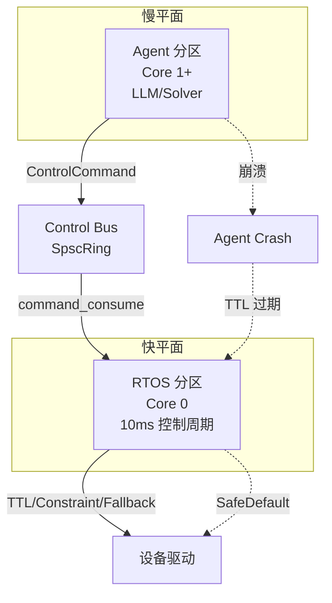
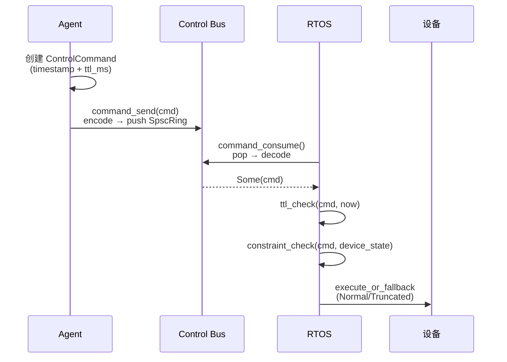
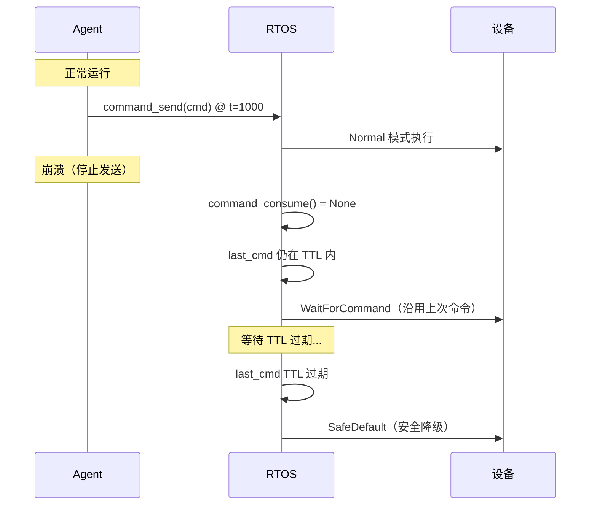

# EnerOS Control Bus 设计 — 双平面命令通道与安全降级

> **版本**：v0.22.0（★ 瓶颈版本，Phase 0 收尾）
> **crate**：`eneros-controlbus`（`crates/kernel/controlbus/`）
> **蓝图依据**：`蓝图/phase0.md` §v0.22.0（P0-J）
> **最后更新**：2026-07-13

---

## 1. 架构概述

EnerOS Control Bus 是连接**快平面（RTOS）**与**慢平面（Agent）**的命令通道，承担 Agent 向 RTOS 下发控制命令、并在 Agent 故障时驱动 RTOS 安全降级的职责。它是 Phase 0 的收尾版本（★ 瓶颈版本），其代码必须"骨架可用"——算法完整，无 `todo!()`/`unimplemented!()` 桩。

### 1.1 双平面架构



| 平面 | 分区 | 核绑定 | 周期 | 职责 |
|------|------|--------|------|------|
| 快平面 | RTOS | Core 0 | 10 ms | 实时控制、保护逻辑、设备驱动 |
| 慢平面 | Agent | Core 1+ | 秒级 | LLM 推理、Solver 优化、策略生成 |

### 1.2 Control Bus 的角色

Control Bus 是**单向命令通道**：

- **方向**：Agent → RTOS（命令下发）
- **载体**：SPSC Ring（v0.21.0 提供）
- **安全机制**：TTL 时效性 + ConstraintPack 约束 + Fallback 降级
- **故障应对**：Agent 崩溃 → TTL 过期 → RTOS 自动降级到 SafeDefault

### 1.3 设计目标

| 指标 | 目标 | 说明 |
|------|------|------|
| 命令往返延迟 | < 50 μs | encode + push + pop + decode |
| TTL 检查延迟 | < 1 μs | 一次减法 + 一次比较 |
| 约束检查延迟 | < 5 μs | 4 项边界比较 + 截断 |
| 降级决策延迟 | < 10 μs | TTL + last_cmd 查询 |
| Agent 崩溃响应 | < TTL | TTL 过期即降级 |
| no_std 合规 | 全 crate | 仅 `core::*` |

---

## 2. ControlCommand 数据结构

### 2.1 命令结构

```rust
#[derive(Clone, Copy)]
pub struct ControlCommand {
    pub cmd_id: [u8; 16],           // 128-bit UUID-like，用于去重
    pub timestamp: u64,             // 纳秒时间戳（v0.12.0 单调时钟）
    pub ttl_ms: u32,                // TTL（毫秒）
    pub target_device: DeviceId,    // 目标设备
    pub action: ControlAction,      // 动作类型
    pub setpoint: f32,              // 功率设定值（kW）
    pub constraints: ConstraintPack,// 约束包
    pub signature: [u8; 64],        // 512-bit 签名（未来 SM2）
}
```

### 2.2 ControlAction 动作枚举

```rust
#[derive(Clone, Copy, Debug, PartialEq, Eq)]
pub enum ControlAction {
    Charge,      // 充电
    Discharge,   // 放电
    Idle,        // 空闲（保持当前状态）
    Emergency,   // 紧急停机
}
```

### 2.3 ConstraintPack 约束包

```rust
#[derive(Clone, Copy, Debug, Default)]
pub struct ConstraintPack {
    pub max_power: f32,              // 最大功率（kW）
    pub min_power: f32,              // 最小功率（kW）
    pub soc_limit: (f32, f32),       // SOC 范围（0-100%）
    pub voltage_limit: (f32, f32),   // 电压范围（V）
    pub frequency_limit: (f32, f32), // 频率范围（Hz）
}
```

| 约束维度 | 单位 | 检查方式 | 违反后果 |
|---------|------|---------|---------|
| 功率 | kW | 截断到 [min, max] | Truncated（仍执行） |
| SOC | % | 范围外拒绝 | Rejected（不执行） |
| 电压 | V | 范围外拒绝 | Rejected（不执行） |
| 频率 | Hz | 范围外拒绝 | Rejected（不执行） |

### 2.4 DeviceId

```rust
#[derive(Clone, Copy, Debug, PartialEq, Eq)]
pub struct DeviceId(pub u32);
```

设备 ID 由设备管理层分配，0 通常保留为"无效"。

---

## 3. 命令生命周期



### 3.1 命令发送

```rust
pub fn command_send(cmd: &ControlCommand) -> Result<(), CbError> {
    CMD_RING.lock.lock();
    let result = {
        let ring_opt = unsafe { &*CMD_RING.ring.get() };
        match ring_opt {
            None => Err(CbError::NotInitialized),
            Some(ring) => {
                let mut buf = [0u8; 256];
                let len = encode_command(cmd, &mut buf);
                match ring.push(&buf[..len]) {
                    Ok(()) => Ok(()),
                    Err(_) => Err(CbError::RingFull),
                }
            }
        }
    };
    CMD_RING.lock.unlock();
    result
}
```

**编码方式**：`copy_nonoverlapping` 裸字节拷贝，`ControlCommand` 是 `Copy` 且不含指针，序列化对称。

### 3.2 命令消费

```rust
pub fn command_consume() -> Option<ControlCommand> {
    CMD_RING.lock.lock();
    let result = {
        let ring_opt = unsafe { &*CMD_RING.ring.get() };
        match ring_opt {
            None => None,
            Some(ring) => {
                let mut buf = [0u8; 256];
                match ring.pop(&mut buf) {
                    Ok(len) => Some(decode_command(&buf[..len])),
                    Err(_) => None,
                }
            }
        }
    };
    CMD_RING.lock.unlock();

    if let Some(cmd) = result {
        set_last_cmd(cmd);  // 更新最近命令缓存
    }
    result
}
```

**关键点**：消费后立即更新 `LAST_CMD` 缓存，供 fallback 模块使用。

### 3.3 命令执行决策

```rust
pub fn execute_or_fallback(cmd: Option<&ControlCommand>, now_ns: u64) -> FallbackMode {
    match cmd {
        Some(c) => {
            if ttl_check(c, now_ns) == TtlStatus::Expired {
                FallbackMode::SafeDefault
            } else {
                FallbackMode::Normal
            }
        }
        None => {
            if let Some(last) = get_last_cmd() {
                if ttl_check(&last, now_ns) == TtlStatus::Valid {
                    FallbackMode::WaitForCommand
                } else {
                    FallbackMode::SafeDefault
                }
            } else {
                FallbackMode::SafeDefault
            }
        }
    }
}
```

---

## 4. TTL 安全机制

### 4.1 TTL 算法

```rust
pub fn ttl_check(cmd: &ControlCommand, now_ns: u64) -> TtlStatus {
    let elapsed_ns = now_ns.saturating_sub(cmd.timestamp);  // 防下溢
    let elapsed_ms = elapsed_ns / 1_000_000;
    if elapsed_ms >= cmd.ttl_ms as u64 {
        TtlStatus::Expired
    } else {
        TtlStatus::Valid
    }
}
```

### 4.2 TTL 设计原则

| 原则 | 说明 |
|------|------|
| 命令级粒度 | 每条命令独立 TTL，不是心跳级 |
| 单调时钟依赖 | 基于 v0.12.0 `get_monotonic_ns()`，时钟不可回退 |
| 防下溢 | `saturating_sub` 处理 `now < timestamp`（时钟跳变） |
| 边界语义 | `elapsed_ms >= ttl_ms` 即过期（含等号） |

### 4.3 默认 TTL 配置

| 命令类型 | TTL | 理由 |
|---------|-----|------|
| 普通控制命令 | 100 ms | 10 个控制周期（10ms × 10） |
| 紧急停机 | 0 | 立即执行，不过期检查（特殊处理） |
| 推荐范围 | 20-30 ms | 2-3 倍控制周期 |

详见 `docs/kernel/ttl-safety-mechanism.md`。

---

## 5. ConstraintPack 约束检查

### 5.1 检查顺序

```rust
pub fn constraint_check(cmd: &ControlCommand, state: &DeviceState) -> ConstraintResult {
    // 1. SOC 检查（硬限制）
    if state.soc < cmd.constraints.soc_limit.0 || state.soc > cmd.constraints.soc_limit.1 {
        return ConstraintResult::Rejected;
    }

    // 2. 电压检查（硬限制）
    if state.voltage < cmd.constraints.voltage_limit.0
        || state.voltage > cmd.constraints.voltage_limit.1
    {
        return ConstraintResult::Rejected;
    }

    // 3. 频率检查（硬限制）
    if state.frequency < cmd.constraints.frequency_limit.0
        || state.frequency > cmd.constraints.frequency_limit.1
    {
        return ConstraintResult::Rejected;
    }

    // 4. 功率截断（软限制）
    let mut setpoint = cmd.setpoint;
    if setpoint > cmd.constraints.max_power {
        setpoint = cmd.constraints.max_power;
    }
    if setpoint < cmd.constraints.min_power {
        setpoint = cmd.constraints.min_power;
    }
    if setpoint != cmd.setpoint {
        return ConstraintResult::Truncated(setpoint);
    }

    ConstraintResult::Ok
}
```

### 5.2 硬限制 vs 软限制

| 类型 | 维度 | 违反后果 | 设计理由 |
|------|------|---------|---------|
| 硬限制 | SOC/电压/频率 | Rejected（不执行） | 越界会损坏设备或违反电网规范 |
| 软限制 | 功率 | Truncated（截断后执行） | 保证控制连续性，避免抖动 |

### 5.3 ConstraintResult

```rust
#[derive(Debug, Clone, Copy, PartialEq)]
pub enum ConstraintResult {
    Ok,                 // 全部约束满足
    Truncated(f32),     // setpoint 被截断到安全范围
    Rejected,           // 硬限制违反，拒绝执行
}
```

### 5.4 DeviceState

```rust
#[derive(Debug, Clone, Copy, Default)]
pub struct DeviceState {
    pub soc: f32,            // 当前 SOC（0-100%）
    pub voltage: f32,        // 端电压（V）
    pub frequency: f32,      // 电网频率（Hz）
    pub current_power: f32,  // 当前功率（kW）
}
```

设备状态由驱动层上报，RTOS 每周期采集一次。

---

## 6. Fallback 降级策略

### 6.1 四种降级模式

```rust
#[derive(Debug, Clone, Copy, PartialEq, Eq)]
pub enum FallbackMode {
    Normal,           // Agent 在线，执行新命令
    WaitForCommand,   // Agent 暂无新命令，沿用上一条（TTL 内）
    SafeDefault,      // 无有效命令，降级到安全默认
    Emergency,        // 紧急停机（显式触发）
}
```

### 6.2 降级决策矩阵

| 输入 cmd | TTL 状态 | last_cmd | 模式 |
|---------|---------|----------|------|
| Some(c) | Valid | — | Normal |
| Some(c) | Expired | — | SafeDefault |
| None | — | Valid | WaitForCommand |
| None | — | Expired/None | SafeDefault |

### 6.3 Agent 崩溃场景



### 6.4 SafeDefault 的具体行为

SafeDefault 模式下 RTOS 执行的安全策略（由上层定义）：

| 设备类型 | SafeDefault 行为 |
|---------|----------------|
| 储能变流器 | 切换到 Idle，功率设为 0 |
| 光伏逆变器 | 保持当前输出，禁止增加 |
| 风机 | 桨距角调整到顺桨位置 |

具体策略在 v0.23.0+ 的设备驱动层实现。

---

## 7. 全局状态管理

### 7.1 CMD_RING 全局命令环

```rust
struct CmdRingState {
    lock: Spinlock,
    ring: UnsafeCell<Option<SpscRing>>,
}

// SAFETY: 访问 ring 由 lock 串行化
unsafe impl Sync for CmdRingState {}

static CMD_RING: CmdRingState = CmdRingState {
    lock: Spinlock::new(),
    ring: UnsafeCell::new(None),
};
```

- 初始化前为 `None`，`control_bus_init` 后为 `Some(ring)`
- 调用者拥有缓冲区，Ring 仅持有裸指针

### 7.2 LAST_CMD 最近命令缓存

```rust
struct LastCmdState {
    lock: Spinlock,
    cmd: UnsafeCell<Option<ControlCommand>>,
}

unsafe impl Sync for LastCmdState {}

static LAST_CMD: LastCmdState = LastCmdState {
    lock: Spinlock::new(),
    cmd: UnsafeCell::new(None),
};
```

- 每次 `command_consume` 成功后更新
- Fallback 模块通过 `get_last_cmd()` 读取

### 7.3 初始化接口

```rust
pub fn control_bus_init(ring: SpscRing) {
    CMD_RING.lock.lock();
    unsafe { *CMD_RING.ring.get() = Some(ring); }
    CMD_RING.lock.unlock();
}
```

**典型初始化**：

```rust
static mut RING_BUF: [u8; 4096] = [0; 4096];  // 16 slots × 256 bytes
let ring = unsafe { SpscRing::new(&mut RING_BUF, 256, 16) };
control_bus_init(ring);
```

---

## 8. 集成仿真（Phase 0 出口验证）

### 8.1 IntegrationState

```rust
#[derive(Debug, Clone)]
pub struct IntegrationState {
    pub agent_alive: bool,        // Agent 是否在线
    pub last_cmd_time: u64,       // 最近命令时间戳
    pub current_mode: FallbackMode, // 当前模式
    pub ttl_ms: u32,              // TTL 窗口
}
```

### 8.2 仿真生命周期

```rust
pub fn integration_step(state: &mut IntegrationState, now_ns: u64) -> FallbackMode {
    if state.agent_alive {
        // Agent 在线：模拟发送新命令
        state.last_cmd_time = now_ns;
        let cmd = ControlCommand {
            timestamp: now_ns,
            ttl_ms: state.ttl_ms,
            ..Default::default()
        };
        set_last_cmd(cmd);
        state.current_mode = FallbackMode::Normal;
    } else {
        // Agent 崩溃：依赖 fallback 逻辑
        state.current_mode = execute_or_fallback(None, now_ns);
    }
    state.current_mode
}
```

### 8.3 仿真测试场景

| 测试 | 步骤 | 期望 |
|------|------|------|
| 正常运行 | agent_alive=true | Normal |
| 崩溃后 TTL 内 | crash → 50ms 后 step | WaitForCommand |
| 崩溃后 TTL 过期 | crash → 150ms 后 step | SafeDefault |
| 恢复 | crash → recover → step | Normal |

---

## 9. CbError 错误枚举

```rust
#[derive(Debug, Clone, Copy, PartialEq, Eq)]
pub enum CbError {
    NotInitialized,   // 命令环未初始化
    RingFull,         // 环满，push 失败
    RingEmpty,        // 环空，pop 失败
    InvalidCommand,   // 命令结构校验失败
    SignatureFailed,  // 签名验证失败（未来）
}
```

---

## 10. 安全性分析

### 10.1 Agent 崩溃的端到端保障

| 阶段 | 机制 | 时延 |
|------|------|------|
| 检测 | command_consume 返回 None | < 1 μs |
| 过渡 | last_cmd 仍在 TTL 内 → WaitForCommand | TTL 内 |
| 降级 | last_cmd TTL 过期 → SafeDefault | TTL 到期 |
| 恢复 | Agent 恢复 → 新命令到达 → Normal | 下一周期 |

### 10.2 命令重放防护

- `cmd_id`（128-bit UUID）用于去重
- `timestamp` 防止旧命令重放（TTL 过期即拒绝）
- 未来 v0.31.0+ 引入 SM2 签名验证

### 10.3 时钟跳变处理

`ttl_check` 使用 `saturating_sub`：

- `now_ns < timestamp`（时钟回退）→ `elapsed_ns = 0` → Valid
- 这避免了误判过期，但可能延迟降级
- **设计选择**：宁可延迟降级也不误降级（fail-safe 倾向）

---

## 11. 性能分析

### 11.1 命令往返延迟分解

| 阶段 | 操作 | 估计耗时 |
|------|------|---------|
| Agent encode | `copy_nonoverlapping` 256 字节 | ~50 ns |
| Agent push | SpscRing::push | ~100 ns |
| RTOS pop | SpscRing::pop | ~100 ns |
| RTOS decode | `copy_nonoverlapping` 256 字节 | ~50 ns |
| TTL check | 减法 + 比较 | < 10 ns |
| Constraint check | 4 项比较 + 截断 | < 100 ns |
| Fallback 决策 | match + get_last_cmd | < 500 ns |
| **总计** | — | **< 1 μs** |

实际目标 < 50 μs（含调度开销），主机测试通过。

### 11.2 与 10ms 控制周期的关系

- 控制周期：10 ms = 10,000 μs
- 命令往返：< 50 μs（占 0.5%）
- TTL 默认：100 ms（10 个周期）
- 余量充足，不会成为瓶颈

---

## 12. 文件结构

```
crates/kernel/controlbus/
├── Cargo.toml              # 依赖 eneros-ipc, eneros-sched
└── src/
    ├── lib.rs              # 模块导出与 crate 文档
    ├── command.rs          # ControlCommand + CMD_RING + LAST_CMD
    ├── ttl.rs              # ttl_check + TtlStatus
    ├── constraint.rs       # constraint_check + ConstraintResult + DeviceState
    ├── fallback.rs         # execute_or_fallback + FallbackMode
    └── integration.rs      # integration_step + IntegrationState（Phase 0 出口验证）
```

---

## 13. 与其他版本的关系

| 方向 | 版本 | 关系 |
|------|------|------|
| 依赖 | v0.12.0（RTC/时钟） | TTL 依赖 `get_monotonic_ns()` |
| 依赖 | v0.13.0（看门狗） | 系统级看门狗与命令级 TTL 互补 |
| 依赖 | v0.20.0（IPC） | 共享 `eneros-ipc` crate |
| 依赖 | v0.21.0（SPSC Ring） | `CMD_RING` 使用 `SpscRing` |
| 下游 | Phase 1（设备驱动） | SafeDefault 策略由驱动层实现 |
| 未来 | v0.31.0（国密） | `signature` 字段启用 SM2 验签 |
| 未来 | Phase 2（多机联邦） | ControlCommand 跨节点传播 |

---

## 14. Phase 0 出口验证角色

v0.22.0 是 Phase 0 的**收尾验证版本**，集成仿真（`integration.rs`）验证了：

1. **双平面协调**：Agent 在线 → Normal，崩溃 → 降级
2. **TTL 有效性**：命令有时效，过期即降级
3. **约束检查**：硬限制拒绝，软限制截断
4. **Fallback 链路**：Normal → WaitForCommand → SafeDefault 完整覆盖
5. **无锁通道**：SpscRing 在双平面间无锁传递命令

详见 `docs/kernel/phase0-exit-verification.md`。

---

## 15. 已知限制与未来扩展

| 限制 | 说明 | 计划 |
|------|------|------|
| 签名未启用 | `signature` 字段为占位 | v0.31.0 SM2 验签 |
| SafeDefault 策略未实现 | 仅返回模式，不执行具体动作 | Phase 1 设备驱动层 |
| 共享内存为桩 | 物理地址固定 | Phase 1 接入 mm 映射 |
| 单向通道 | 仅 Agent → RTOS | Phase 1 增加 RTOS → Agent 反馈通道 |
| 无批量命令 | 一次一条 | Phase 1 支持 batch（如需） |

---

> **参考**：
> - `蓝图/phase0.md` §v0.22.0 — Control Bus 交付物清单（★ 瓶颈版本）
> - `crates/kernel/controlbus/src/` — 实现源码
> - `docs/kernel/ipc-design.md` — IPC 端点机制
> - `docs/kernel/spsc-ring-design.md` — SPSC Ring 无锁通道
> - `docs/kernel/ttl-safety-mechanism.md` — TTL 安全机制详解
> - `docs/kernel/phase0-exit-verification.md` — Phase 0 出口验证报告
