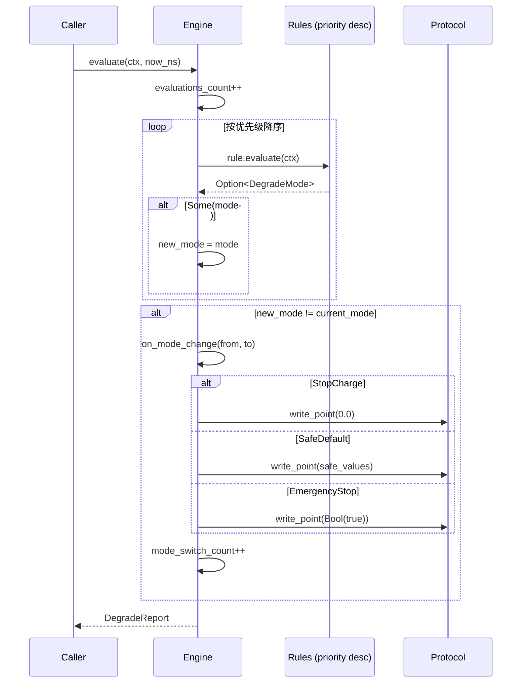
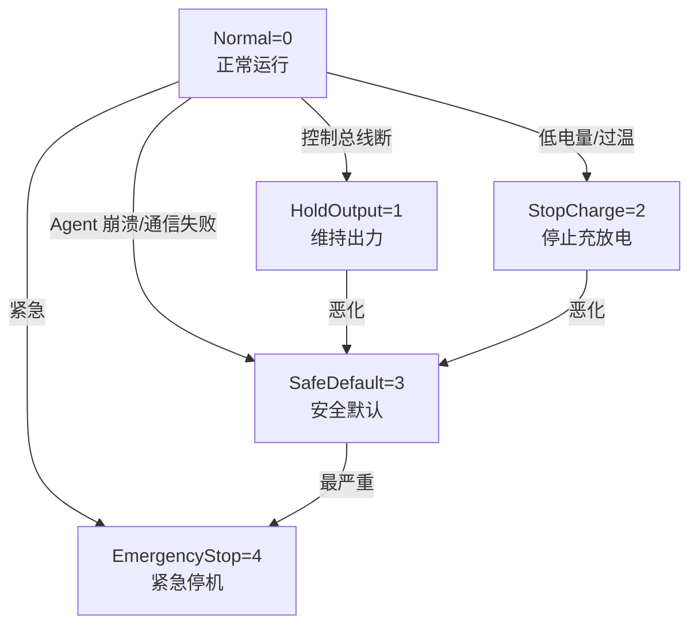

# EnerOS 降级规则引擎设计 — 五模式分层降级与安全动作执行

> **版本**：v0.57.0（P1-H RTOS 组件第四层，安全降级层）
> **crate**：`eneros-rtos-degrade`（`crates/kernel/rtos-degrade/`）
> **蓝图依据**：`蓝图/phase1.md` §v0.57.0
> **最后更新**：2026-07-16

---

## 1. 版本目标

### 1.1 一句话目标

实现降级规则引擎（Degrade Rule Engine），定义 5 种降级模式（Normal/HoldOutput/StopCharge/SafeDefault/EmergencyStop）并按规则优先级评估当前故障状态，自动切换到合适的降级模式，并通过 `PointAccess` 下发安全动作（功率归零/安全默认值/紧急停机），确保 Agent 崩溃或通信中断时储能设备仍处于受控安全状态。

### 1.2 详细描述

v0.56.0 命令执行器（`CommandExecutor`）解决了"命令如何安全下发到设备"的问题，但其前提是 Agent 平面持续注入有效命令。当 Agent 崩溃、控制总线断开、设备通信失败或电池/温度进入危险区间时，命令源将不可靠甚至中断，此时快平面必须自行接管控制权，按预设安全策略降级运行。本版本填补这一空缺：实现独立的降级规则引擎，将"故障信号 → 降级模式 → 安全动作"完整链路封装为可单步驱动的引擎。

引擎以"单步评估（`evaluate(ctx, now_ns)`）"方式由分区调度器周期性调用。每个 tick 内，引擎按规则优先级（高→低）依次评估所有注册的降级规则，取**首个触发的规则**返回的降级模式作为目标模式（D8：避免每 tick 重复排序，规则在插入时已按优先级降序排列）。若目标模式与当前模式不同，则触发 `on_mode_change(from, to)`，按目标模式执行对应安全动作：

| 目标模式 | 安全动作 |
|---------|---------|
| `Normal` | 无动作（恢复正常运行） |
| `HoldOutput` | 无动作（维持上次有效设定值） |
| `StopCharge` | 向功率控制点下发 `PointValue::Float(0.0)` |
| `SafeDefault` | 遍历 `SafeDefaults` 表，逐点下发预设安全值 |
| `EmergencyStop` | 向紧急停机点下发 `PointValue::Bool(true)` |

整个评估过程必须在调度周期（典型 10ms）内完成，单 tick 评估规则数受规则集规模限制（内置 5 条规则，未来可扩展）。引擎不持有时间源（D5：`now_ns` 由调用方注入），不依赖日志系统（D7：用统计计数器替代 `log_warn!`），不要求规则 `Send + Sync`（D6：no_std 单线程）。

### 1.3 架构定位

| 维度 | 定位 |
|------|------|
| Phase | Phase 1 单机 MVP |
| 子系统 | P1-H RTOS 组件第四层，安全降级层 |
| 平面 | 快平面（RTOS 分区，Core 0） |
| 角色 | 快平面故障检测与安全降级核心 |
| 上游版本 | v0.56.0 CommandExecutor（命令执行器）、v0.51.0 PointAccess（下发通道）、v0.37.0 Agent 心跳（agent_alive 信号来源）、v0.55.0 SamplingService（电池/温度/频率采样来源） |
| 同层版本 | v0.54.0 ControlLoopEngine（控制闭环）、v0.55.0 SamplingService（高频采样）、v0.56.0 CommandExecutor（命令执行） |
| 下游版本 | v0.58.0 看门狗降级流程（★ 瓶颈版本，端到端降级收官） |
| 后续版本 | Phase 3 seL4 集成时，`PointAccess` 下发通道替换为 seL4 notification/endpoint |

### 1.4 设计原则关联

| 原则 | 体现 |
|------|------|
| 安全第一 | 5 种降级模式按严重程度递增分层（Normal→HoldOutput→StopCharge→SafeDefault→EmergencyStop），任何故障都有对应降级路径（蓝图 §9.4） |
| 确定性 | 规则按优先级评估，首个触发即返回（D8：插入时排序，避免每 tick sort）；`on_mode_change` 动作固定映射 |
| 故障隔离 | 单点写入失败仅计数，不中断后续动作（§10）；`EmergencyStop` 不可自动恢复（D11，蓝图风险 8.4） |
| 复用优先 | 复用 v0.51.0 `PointAccess` trait（D2）、v0.56.0 `DevicePointMap`（D3/D9），不重复造轮子（记忆文件 §5.5） |
| 可观测 | 4 个 `u64` 计数器覆盖评估/切换/写入失败全路径（§11） |
| no_std 合规 | 全 crate 仅使用 `core::*` / `alloc::*`，无 `std::*`（蓝图 §43.1） |

---

## 2. 架构定位

### 2.1 P1-H RTOS 组件分层

P1-H RTOS 组件按"控制闭环 → 高频采样 → 命令执行 → 安全降级"四层层级组织，本版本位于第四层：

| 层级 | 版本 | crate | 职责 |
|------|------|-------|------|
| 第一层（控制闭环） | v0.54.0 | `eneros-rtos-control` | 10ms 周期 PID 控制律计算，设定值跟踪 |
| 第二层（高频采样） | v0.55.0 | `eneros-rtos-sampling` | 100ms 周期设备状态采集，共享内存快照 |
| 第三层（命令执行） | v0.56.0 | `eneros-rtos-cmd-exec` | 命令消费 → TTL → 约束 → 协议下发 |
| **第四层（安全降级）** | **v0.57.0** | **`eneros-rtos-degrade`** | **故障检测 → 降级模式选择 → 安全动作下发** |

四层关系：采样层提供设备状态快照（供降级规则读取 SOC/温度/频率）；控制闭环层在 Normal 模式下驱动 PID；命令执行层在 Normal 模式下消费 Agent 命令；降级引擎在故障时通过 `PointAccess` 直接下发安全动作，绕过 Agent 命令链路。四者均以单步 `tick`/`evaluate` 方式由 v0.19.0 分区调度器驱动，同处 Core 0 快平面。

### 2.2 与同层组件的职责边界

| 组件 | 输入 | 输出 | 与本引擎关系 |
|------|------|------|-------------|
| `ControlLoopEngine`（v0.54.0） | 反馈点 + 设定值 | PID 输出 | Normal 模式下由其驱动控制律；降级模式下其输出被本引擎动作覆盖 |
| `SamplingService`（v0.55.0） | `PointAccess::read_point` | `SharedMemorySnapshot` | 为本引擎的 `DegradeContext` 提供 `battery_soc`/`temperature`/`grid_frequency` 字段来源 |
| `CommandExecutor`（v0.56.0） | `command_consume()` + `DeviceState` | `PointAccess::write_point()` | Normal 模式下由其下发 Agent 命令；本引擎共用 `PointAccess` 通道下发安全动作；`DevicePointMap` 复用 |
| `DegradeEngine`（v0.57.0） | `DegradeContext` + 规则集 | `PointAccess::write_point()` | 评估降级模式并下发安全动作 |

### 2.3 上下游依赖图

```
v0.37.0 Agent 心跳 ──► agent_alive ──┐
                                     │
v0.55.0 SamplingService ──► SOC/温度/频率 ──┤
                                     │
v0.22.0 Control Bus ──► control_bus_active ──┤
                                     │
v0.56.0 CommandExecutor ──► DevicePointMap ──┤
                                     │
                                     ▼
                          v0.57.0 DegradeEngine
                                     │
v0.51.0 PointAccess ◄──── write_point() ◄──┤
                                     │
                                     ▼
                          v0.58.0 看门狗降级流程
```

### 2.4 不做的事（职责边界）

本引擎**不负责**以下职责，避免与上下游重叠：

| 不做的事 | 归属版本 | 理由 |
|---------|---------|------|
| Agent 崩溃检测（心跳超时判定） | v0.37.0 Agent 心跳监控 | 本引擎只消费 `agent_alive` 信号，不实现心跳超时逻辑 |
| 设备状态采集 | v0.55.0 SamplingService | 本引擎通过 `DegradeContext` 接收采样值，不直接调用 `read_point` |
| Agent 命令执行 | v0.56.0 CommandExecutor | Normal 模式下命令下发由执行器负责；本引擎仅在降级时下发安全动作 |
| 看门狗喂狗/触发 | v0.13.0 硬件看门狗 + v0.58.0 | 本引擎不直接操作看门狗；v0.58.0 整合本引擎与看门狗实现端到端降级 |
| 端到端降级流程编排 | v0.58.0 ★ | 本引擎仅提供单步评估与动作执行；端到端流程（心跳监控→TTL→降级→恢复）由 v0.58.0 编排 |
| 恢复回切策略（逐步过渡） | v0.58.0 | 蓝图风险 8.2 要求从 SafeDefault 切回 Normal 需逐步过渡，避免功率跳变；本引擎仅触发 `on_mode_change`，逐步过渡由调用方控制 |

### 2.5 为 v0.58.0 奠定基础

v0.58.0 是 P1-H 的收官版本（★ 瓶颈版本），整合 Agent 心跳监控（v0.37.0）、Control Bus TTL（v0.22.0）、本降级规则引擎（v0.57.0）与硬件看门狗（v0.13.0），实现完整端到端降级流程。本版本为 v0.58.0 提供：

| 产出 | v0.58.0 用途 |
|------|-------------|
| `DegradeEngine::evaluate()` 单步接口 | v0.58.0 编排器在每个控制周期调用，注入 `DegradeContext` |
| `DegradeMode` 5 模式枚举 | v0.58.0 根据 TTL 过期事件决定注入何种 `DegradeContext` 触发对应模式 |
| `DegradeRule` trait | v0.58.0 可注册额外的 TTL 过期规则（如 `AgentTtlExpiredRule`） |
| `SafeDefaults` 安全默认值表 | v0.58.0 从配置加载并注入 |
| `DegradeStats` 统计 | v0.58.0 监控降级频率，触发看门狗告警 |

---

## 3. 核心类型

### 3.1 核心类型总表

| 类型 | 类别 | 说明 | 章节 |
|------|------|------|------|
| `DegradeMode` | enum（5 变体，派生 Ord） | 降级模式枚举 | §4 |
| `DegradeRule` | trait | 降级规则抽象 | §5 |
| `DegradeContext` | struct | 降级评估上下文（7+1 字段） | §6 |
| `DegradeEngine<P>` | struct（泛型） | 降级规则引擎主体 | §7 |
| `SafeDefaults` | struct | 安全默认值表（PointId → PointValue） | §7.5 |
| `DegradeStats` | struct | 累计统计（4 个 u64 计数器） | §11 |
| `DegradeReport` | struct | 单次 evaluate 汇总报告（3 字段） | §11 |
| `DegradeError` | enum | 错误枚举（3 变体） | §10 |

### 3.2 类型依赖关系

```
DegradeEngine<P: PointAccess>
    ├── rules: Vec<Box<dyn DegradeRule>>     (本 crate DegradeRule trait)
    ├── current_mode: DegradeMode            (本 crate)
    ├── previous_mode: DegradeMode           (本 crate)
    ├── safe_defaults: SafeDefaults          (本 crate)
    ├── device_map: DevicePointMap           (v0.56.0 复用，D3)
    ├── protocol: P                          (v0.51.0 PointAccess，D2)
    └── stats: DegradeStats                  (本 crate)

DegradeRule
    └── fn evaluate(&self, ctx: &DegradeContext) -> Option<DegradeMode>
                                            └── DegradeContext (本 crate)

DegradeContext
    ├── agent_alive: bool
    ├── agent_last_heartbeat_ns: u64         (D5：纳秒注入)
    ├── now_ns: u64                          (D5：纳秒注入)
    ├── control_bus_active: bool
    ├── device_comm_ok: bool
    ├── battery_soc: f64
    ├── grid_frequency: f64
    └── temperature: f64

SafeDefaults
    └── map: BTreeMap<PointId, PointValue>   (v0.50.0 upa_model)
```

### 3.3 与既有类型的复用关系

| 既有类型 | 来源版本 | 复用方式 |
|---------|---------|---------|
| `PointAccess` | v0.51.0 `protocol_abstract::access` | 安全动作下发通道（`write_point`），作为泛型约束 `P: PointAccess` 注入（D2） |
| `PointId`（`u32`） | v0.50.0 `upa_model::point` | 点标识，`SafeDefaults` 的 key |
| `PointValue` | v0.50.0 `upa_model::point` | 下发值类型（`Float(f64)` / `Bool(bool)`） |
| `DevicePointMap` | v0.56.0 `rtos_cmd_exec::device_map` | DeviceId → PointId 映射，复用其 `get()` 查询（D3/D9） |
| `DeviceId`（`u32`） | v0.22.0 `controlbus::command` | 设备标识，用于 `DevicePointMap` 查询 |

> **注意**（D3/D9）：蓝图原文在 `on_mode_change` 中直接使用 `POWER_CMD_ID`/`EMERGENCY_STOP_ID` 常量下发，但 v0.22.0/v0.50.0/v0.51.0 实际 API 中未定义这两个常量。本设计复用 v0.56.0 `DevicePointMap`（已实现 DeviceId→PointId 映射），通过 `device_map.get(DeviceId)` 查询对应的 `PointId` 完成下发。`DevicePointMap` 在系统初始化阶段从配置加载，运行时只读。

---

## 4. DegradeMode

### 4.1 枚举定义

```rust
/// 降级模式（5 变体，派生 Ord 支持严重程度比较，D4）。
///
/// 严重程度按枚举值递增：Normal(0) < HoldOutput(1) < StopCharge(2)
/// < SafeDefault(3) < EmergencyStop(4)。`Ord` 派生允许比较两个模式
/// 的严重程度，用于"恶化时升级、恢复时降级"决策（§9）。
#[derive(Debug, Clone, Copy, PartialEq, Eq, PartialOrd, Ord)]
pub enum DegradeMode {
    /// 正常运行（Agent 控制中）
    Normal = 0,
    /// 维持出力（保持上次有效设定值）
    HoldOutput = 1,
    /// 停止充放电（功率设为 0）
    StopCharge = 2,
    /// 安全默认（回到预设安全值）
    SafeDefault = 3,
    /// 紧急停机（断开设备）
    EmergencyStop = 4,
}
```

### 4.2 严重程度层级

| 模式 | 枚举值 | 严重程度 | 触发场景 | 安全动作 |
|------|--------|---------|---------|---------|
| `Normal` | 0 | 最低（正常运行） | Agent 心跳正常 + 控制总线活跃 + 设备通信正常 + 电池/温度正常 | 无 |
| `HoldOutput` | 1 | 轻度降级 | 控制总线断开（Agent 仍存活） | 维持上次有效设定值 |
| `StopCharge` | 2 | 中度降级 | 低电量（SOC < 10%）或过温（T > 60°C）或电网频率异常 | 功率设为 0 |
| `SafeDefault` | 3 | 重度降级 | Agent 崩溃或设备通信失败 | 遍历 SafeDefaults 下发预设安全值 |
| `EmergencyStop` | 4 | 最高（紧急） | 紧急事件（如严重故障） | 下发 Bool(true) 触发紧急停机 |

### 4.3 is_degraded() 方法

```rust
impl DegradeMode {
    /// 判断是否处于降级状态（非 Normal 即降级）。
    pub fn is_degraded(&self) -> bool {
        *self != DegradeMode::Normal
    }

    /// 判断是否处于紧急状态（EmergencyStop）。
    pub fn is_emergency(&self) -> bool {
        *self == DegradeMode::EmergencyStop
    }
}
```

### 4.4 Ord 派生的设计意义（D4）

| 维度 | 说明 |
|------|------|
| 为什么派生 Ord | 蓝图原文未明确要求 Ord，但 `on_mode_change` 需判断"恶化"（from < to）还是"恢复"（from > to）以决定动作。Ord 派生提供零成本比较 |
| 与"逐步恢复"的关系 | 蓝图风险 8.2 要求从 SafeDefault 切回 Normal 需逐步过渡（SafeDefault → StopCharge → HoldOutput → Normal），Ord 比较支持"单步回退一级"逻辑（由调用方实现，本引擎不强制） |
| 与 EmergencyStop 不可恢复的关系 | `EmergencyStop` 是最高级别，Ord 比较下任何模式都 ≤ EmergencyStop；但 D11 规定 EmergencyStop 不可自动恢复，需调用方显式重置 |

### 4.5 模式切换矩阵

下表列出所有合法的模式切换路径及其动作（§9 详述）：

| from \ to | Normal | HoldOutput | StopCharge | SafeDefault | EmergencyStop |
|-----------|--------|------------|------------|-------------|---------------|
| **Normal** | — | 无动作 | 下发 0.0 | 遍历 SafeDefaults | 下发 Bool(true) |
| **HoldOutput** | 无动作 | — | 下发 0.0 | 遍历 SafeDefaults | 下发 Bool(true) |
| **StopCharge** | 无动作 | 无动作 | — | 遍历 SafeDefaults | 下发 Bool(true) |
| **SafeDefault** | 无动作 | 无动作 | 下发 0.0 | — | 下发 Bool(true) |
| **EmergencyStop** | ❌ 不可自动恢复（D11） | ❌ 不可自动恢复 | ❌ 不可自动恢复 | ❌ 不可自动恢复 | — |

---

## 5. DegradeRule trait

### 5.1 trait 定义

```rust
use crate::context::DegradeContext;
use crate::mode::DegradeMode;

/// 降级规则 trait（D6：不要求 Send + Sync）。
///
/// 每条规则封装一种故障的检测逻辑，返回 `Some(DegradeMode)` 表示触发
/// 对应降级模式，返回 `None` 表示未触发。
///
/// 规则按 `priority()` 降序评估（高优先级先评估），首个返回 `Some`
/// 的规则决定目标模式（D8：插入时排序，evaluate 中不再 sort）。
///
/// 不要求 `Send + Sync`（D6）：no_std 单线程无需该约束，与 v0.51.0
/// `PointAccess`、v0.54.0 D6、v0.55.0 D6、v0.56.0 D6 一致。
pub trait DegradeRule {
    /// 规则名称（用于调试与统计）。
    fn name(&self) -> &str;

    /// 优先级（越高越先评估，0 为最低）。
    fn priority(&self) -> u8;

    /// 评估是否触发降级。
    ///
    /// - 返回 `Some(mode)`：触发，返回对应降级模式
    /// - 返回 `None`：未触发，继续评估下一条规则
    fn evaluate(&self, context: &DegradeContext) -> Option<DegradeMode>;
}
```

### 5.2 设计说明

| 维度 | 说明 |
|------|------|
| 为什么用 trait | 不同故障（Agent 崩溃/总线断/通信失败/低电量/过温）的检测逻辑差异大，trait 提供统一抽象，支持扩展自定义规则 |
| 为什么返回 `Option<DegradeMode>` | 一条规则可能触发不同级别的降级（如 `OverTempRule` 根据温度阈值返回 `StopCharge` 或 `SafeDefault`），`Option` 表达"是否触发"语义 |
| 为什么不返回 `DegradeMode` 直接（无 Option） | 若强制返回 `DegradeMode::Normal` 表示未触发，会与"评估后明确是 Normal"混淆；`Option` 语义清晰 |
| 为什么 `priority()` 是 `u8` | 规则数通常 ≤ 16，`u8` 足够；且 `u8` 比 `u32` 更紧凑，排序开销低 |
| 不要求 `Send + Sync`（D6） | no_std 单线程，规则仅在 Core 0 评估，无跨核访问；与 v0.51.0 `PointAccess`（D2）、v0.56.0 `CommandExecutor`（D6）一致 |

### 5.3 规则评估顺序（D8）

蓝图原文在 `evaluate()` 中调用 `self.rules.sort_by_key(|r| r.priority())` 每 tick 排序，本设计改为**插入时按 priority 降序排序**：

```rust
impl<P: PointAccess> DegradeEngine<P> {
    /// 注册降级规则（D8：按 priority 降序插入）。
    ///
    /// 规则在插入时排序，`evaluate()` 中直接顺序遍历，避免每 tick
    /// 调用 `sort_by_key` 的 O(n log n) 开销。
    pub fn add_rule(&mut self, rule: Box<dyn DegradeRule>) {
        let priority = rule.priority();
        // 找到第一个 priority < 新规则的插入位置（降序）
        let pos = self
            .rules
            .iter()
            .position(|r| r.priority() < priority)
            .unwrap_or(self.rules.len());
        self.rules.insert(pos, rule);
    }
}
```

| 维度 | 蓝图原文 | 本设计 |
|------|---------|--------|
| 排序时机 | `evaluate()` 中每 tick 调用 `sort_by_key` | `add_rule()` 插入时按 priority 降序排序 |
| 复杂度 | 每 tick O(n log n)，n 为规则数 | 插入时 O(n)，evaluate 时 O(n) 遍历 |
| 适用场景 | 规则集动态变化 | 规则集在初始化阶段注册后基本不变（本版本场景） |
| 一致性 | — | 与 v0.22.0 Control Bus 命令环的"插入时排序"风格一致 |

### 5.4 规则 trait 与对象安全

`DegradeRule` trait 的方法均接收 `&self`，返回 `Option<DegradeMode>` 或 `&str` 或 `u8`，不涉及 `Self` 类型，因此是对象安全的，可作为 `Box<dyn DegradeRule>` 使用。规则集存储为 `Vec<Box<dyn DegradeRule>>`，支持运行时动态注册。

---

## 6. DegradeContext

### 6.1 结构定义

```rust
/// 降级评估上下文（7+1 字段，D5/D10）。
///
/// 封装所有降级规则评估所需的输入信号。每个控制周期由调用方
/// （v0.58.0 编排器）构造后传入 `DegradeEngine::evaluate()`。
///
/// `now_ns` 由调用方注入（D5），用于 `AgentDeadRule` 计算心跳超时。
#[derive(Debug, Clone, Copy)]
pub struct DegradeContext {
    /// Agent 是否存活（来自 v0.37.0 Agent 心跳监控）
    pub agent_alive: bool,
    /// Agent 最后一次心跳时间戳（纳秒，来自 v0.37.0）
    pub agent_last_heartbeat_ns: u64,
    /// 当前时间戳（纳秒，D5：由调用方注入）
    pub now_ns: u64,
    /// 控制总线是否活跃（来自 v0.22.0 Control Bus 状态）
    pub control_bus_active: bool,
    /// 设备通信是否正常（来自 v0.55.0 采样服务通信状态）
    pub device_comm_ok: bool,
    /// 电池 SOC（0.0~1.0，来自 v0.55.0 采样）
    pub battery_soc: f64,
    /// 电网频率（Hz，来自 v0.55.0 采样）
    pub grid_frequency: f64,
    /// 设备温度（°C，来自 v0.55.0 采样）
    pub temperature: f64,
}
```

### 6.2 字段说明

| # | 字段 | 类型 | 来源 | 用途 |
|---|------|------|------|------|
| 1 | `agent_alive` | `bool` | v0.37.0 Agent 心跳监控 | `AgentDeadRule` 评估 Agent 是否崩溃 |
| 2 | `agent_last_heartbeat_ns` | `u64` | v0.37.0 Agent 心跳监控 | `AgentDeadRule` 计算心跳超时（`now_ns - last_heartbeat > TTL`） |
| 3 | `now_ns` | `u64` | 调用方注入（D5） | 心跳超时计算的基准时间；与 v0.22.0 controlbus `ttl_check` 纳秒单位一致 |
| 4 | `control_bus_active` | `bool` | v0.22.0 Control Bus 状态 | `ControlBusDownRule` 评估控制总线是否断开 |
| 5 | `device_comm_ok` | `bool` | v0.55.0 采样服务通信状态 | `DeviceCommFailRule` 评估设备通信是否失败 |
| 6 | `battery_soc` | `f64` | v0.55.0 采样 | `LowBatteryRule` 评估是否低电量（SOC < 10%） |
| 7 | `grid_frequency` | `f64` | v0.55.0 采样 | `OverTempRule` 或未来规则评估电网异常（频率越限） |
| 8 | `temperature` | `f64` | v0.55.0 采样 | `OverTempRule` 评估是否过温（T > 60°C） |

### 6.3 Builder 风格 setter

为便于调用方构造 `DegradeContext`，提供 builder 风格 setter（链式调用）：

```rust
impl DegradeContext {
    /// 创建默认上下文（全部正常）。
    pub fn new(now_ns: u64) -> Self {
        Self {
            agent_alive: true,
            agent_last_heartbeat_ns: now_ns,
            now_ns,
            control_bus_active: true,
            device_comm_ok: true,
            battery_soc: 1.0,
            grid_frequency: 50.0,
            temperature: 25.0,
        }
    }

    /// 设置 Agent 存活状态。
    pub fn with_agent_alive(mut self, alive: bool) -> Self {
        self.agent_alive = alive;
        self
    }

    /// 设置 Agent 最后心跳时间戳。
    pub fn with_agent_last_heartbeat(mut self, ts_ns: u64) -> Self {
        self.agent_last_heartbeat_ns = ts_ns;
        self
    }

    /// 设置控制总线活跃状态。
    pub fn with_control_bus_active(mut self, active: bool) -> Self {
        self.control_bus_active = active;
        self
    }

    /// 设置设备通信状态。
    pub fn with_device_comm_ok(mut self, ok: bool) -> Self {
        self.device_comm_ok = ok;
        self
    }

    /// 设置电池 SOC。
    pub fn with_battery_soc(mut self, soc: f64) -> Self {
        self.battery_soc = soc;
        self
    }

    /// 设置电网频率。
    pub fn with_grid_frequency(mut self, freq: f64) -> Self {
        self.grid_frequency = freq;
        self
    }

    /// 设置温度。
    pub fn with_temperature(mut self, temp: f64) -> Self {
        self.temperature = temp;
        self
    }
}
```

### 6.4 now_ns 注入的设计意义（D5）

| 维度 | 说明 |
|------|------|
| 为什么注入 `now_ns` 而非内部调用 `MonotonicTime::now()` | `MonotonicTime` 在 no_std 不存在（蓝图 §43.1）；与 v0.54.0 D1、v0.55.0 D1、v0.56.0 D12 一致，时间由调用方注入 |
| 时间单位选择 | 纳秒（u64），与 v0.22.0 controlbus `ttl_check()` 签名一致，便于 `AgentDeadRule` 复用 TTL 逻辑 |
| 与 v0.55.0/v0.56.0 时间单位的差异 | v0.55.0 采样服务用微秒（`now_us`），v0.56.0 执行器用纳秒（`now_ns`）。本版本采用纳秒，与 v0.56.0 一致，因 `AgentDeadRule` 的心跳超时逻辑与 TTL 语义同源 |
| 单线程安全性 | `now_ns` 在 evaluate 调用期间不变，无需原子操作 |

---

## 7. DegradeEngine

### 7.1 结构定义

```rust
use alloc::vec::Vec;
use eneros_protocol_abstract::PointAccess;

use crate::context::DegradeContext;
use crate::defaults::SafeDefaults;
use crate::mode::DegradeMode;
use crate::rule::DegradeRule;
use crate::stats::{DegradeReport, DegradeStats};

/// 降级规则引擎（泛型 `<P: PointAccess>`，D2/D6）。
///
/// 单步 `evaluate(ctx, now_ns)` 按规则优先级评估降级模式，模式切换时
/// 通过 `on_mode_change()` 执行安全动作（write_point）。
///
/// 泛型而非 `Box<dyn PointAccess>`（D2/D6），避免堆分配与动态分发，
/// 与 v0.54.0 D6、v0.55.0 D6、v0.56.0 D6 一致。
pub struct DegradeEngine<P: PointAccess> {
    /// 降级规则集（按 priority 降序，D8：插入时排序）
    rules: Vec<Box<dyn DegradeRule>>,
    /// 当前降级模式
    current_mode: DegradeMode,
    /// 上一降级模式（用于 on_mode_change 的 from 参数）
    previous_mode: DegradeMode,
    /// 安全默认值表（SafeDefault 模式下遍历下发）
    safe_defaults: SafeDefaults,
    /// DeviceId → PointId 映射（D3：复用 v0.56.0 DevicePointMap）
    device_map: DevicePointMap,
    /// 协议下发通道（泛型，D2/D6）
    protocol: P,
    /// 累计统计（普通 u64，D7）
    stats: DegradeStats,
}
```

### 7.2 字段说明

| # | 字段 | 类型 | 说明 |
|---|------|------|------|
| 1 | `rules` | `Vec<Box<dyn DegradeRule>>` | 降级规则集，按 `priority()` 降序排列（D8：插入时排序）。内置 5 条规则（§8），支持 `add_rule()` 动态扩展 |
| 2 | `current_mode` | `DegradeMode` | 当前降级模式，初始为 `Normal`。每次 `evaluate` 后更新 |
| 3 | `previous_mode` | `DegradeMode` | 上一降级模式，用于 `on_mode_change(from, to)` 的 `from` 参数，便于调用方分析切换历史 |
| 4 | `safe_defaults` | `SafeDefaults` | 安全默认值表（`BTreeMap<PointId, PointValue>`），`SafeDefault` 模式下遍历下发。初始化阶段从配置加载 |
| 5 | `device_map` | `DevicePointMap` | DeviceId→PointId 映射（D3/D9：复用 v0.56.0），用于查询功率控制点与紧急停机点 |
| 6 | `protocol` | `P`（泛型，`P: PointAccess`） | 协议下发通道，调用 `write_point(point_id, value)` 下发安全动作。泛型而非 `Box<dyn PointAccess>`（D2/D6） |
| 7 | `stats` | `DegradeStats` | 累计统计，4 个 `u64` 计数器（D7：普通 u64，非 AtomicU64） |

### 7.3 构造函数

```rust
impl<P: PointAccess> DegradeEngine<P> {
    /// 构造降级引擎。
    ///
    /// - `protocol`：协议下发通道
    /// - `device_map`：DeviceId → PointId 映射（D3：复用 v0.56.0）
    /// - `safe_defaults`：安全默认值表
    pub fn new(protocol: P, device_map: DevicePointMap, safe_defaults: SafeDefaults) -> Self {
        Self {
            rules: Vec::new(),
            current_mode: DegradeMode::Normal,
            previous_mode: DegradeMode::Normal,
            safe_defaults,
            device_map,
            protocol,
            stats: DegradeStats::default(),
        }
    }

    /// 返回当前降级模式（只读）。
    pub fn current_mode(&self) -> DegradeMode {
        self.current_mode
    }

    /// 返回上一降级模式（只读）。
    pub fn previous_mode(&self) -> DegradeMode {
        self.previous_mode
    }

    /// 返回累计统计（只读引用）。
    pub fn stats(&self) -> &DegradeStats {
        &self.stats
    }

    /// 返回协议访问层引用（用于写入结果检查）。
    pub fn protocol(&self) -> &P {
        &self.protocol
    }
}
```

### 7.4 evaluate 单步评估

```rust
impl<P: PointAccess> DegradeEngine<P> {
    /// 单步评估降级模式（每个控制周期调用）。
    ///
    /// 按规则优先级降序遍历（D8：插入时已排序），取首个返回 `Some`
    /// 的规则对应的 `DegradeMode` 作为目标模式；若全部规则返回 `None`，
    /// 目标模式为 `Normal`。
    ///
    /// 若目标模式与当前模式不同，触发 `on_mode_change(from, to)` 执行
    /// 安全动作。
    ///
    /// 返回本次评估的汇总报告 [`DegradeReport`]。
    pub fn evaluate(&mut self, ctx: &DegradeContext, now_ns: u64) -> DegradeReport {
        let mut report = DegradeReport::default();
        self.stats.evaluations_count += 1;
        report.evaluations = 1;

        // D8：rules 已按 priority 降序排列，直接顺序遍历
        let mut new_mode = DegradeMode::Normal;
        for rule in &self.rules {
            if let Some(mode) = rule.evaluate(ctx) {
                new_mode = mode;
                break;  // 首个触发即返回
            }
        }

        // 模式切换检测
        if new_mode != self.current_mode {
            // D11：EmergencyStop 不可自动恢复
            if self.current_mode == DegradeMode::EmergencyStop
                && new_mode != DegradeMode::EmergencyStop
            {
                // 紧急停机状态下，忽略自动恢复请求
                // 需调用方显式调用 reset_to_normal() 重置
                report.mode_switch_blocked = 1;
                return report;
            }

            let from = self.current_mode;
            self.on_mode_change(from, new_mode, now_ns, &mut report);
            self.previous_mode = from;
            self.current_mode = new_mode;
            self.stats.mode_switch_count += 1;
            report.mode_switches = 1;
            report.from_mode = from;
            report.to_mode = new_mode;
        }

        report
    }
}
```

### 7.5 SafeDefaults 结构

```rust
use alloc::collections::BTreeMap;
use eneros_upa_model::{PointId, PointValue};

/// 安全默认值表（D3：复用 PointId/PointValue，不重复定义常量）。
///
/// `SafeDefault` 模式下遍历本表，逐点下发预设安全值。
/// 典型配置：
/// - 功率控制点 → 0.0（功率归零）
/// - 电压设定点 → 额定电压
/// - 电流限制点 → 安全电流
#[derive(Debug, Clone, Default)]
pub struct SafeDefaults {
    map: BTreeMap<PointId, PointValue>,
}

impl SafeDefaults {
    /// 创建空安全默认值表。
    pub fn new() -> Self {
        Self::default()
    }

    /// 插入/覆盖安全默认值。
    pub fn insert(&mut self, point_id: PointId, value: PointValue) {
        self.map.insert(point_id, value);
    }

    /// 遍历所有安全默认值（用于 SafeDefault 模式下发）。
    pub fn iter(&self) -> impl Iterator<Item = (PointId, PointValue)> + '_ {
        self.map.iter().map(|(pid, v)| (*pid, *v))
    }

    /// 返回安全默认值数量。
    pub fn len(&self) -> usize {
        self.map.len()
    }

    /// 是否为空。
    pub fn is_empty(&self) -> bool {
        self.map.is_empty()
    }
}
```

### 7.6 设计说明

| 维度 | 说明 |
|------|------|
| 为什么用 `BTreeMap<PointId, PointValue>` | no_std 下 `alloc::collections::BTreeMap` 可用且无需哈希函数；`PointValue` 支持 `Float(f64)` 与 `Bool(bool)`，比蓝图原文 `BTreeMap<PointId, f64>` 更通用（紧急停机点需 `Bool`） |
| 为什么 `PointValue` 而非 `f64` | 蓝图原文 `safe_defaults: BTreeMap<PointId, f64>` 仅支持浮点值，但 `PointAccess::write_point` 接受 `PointValue` 枚举。若安全默认值表只存 `f64`，则无法表达"紧急停机点 = Bool(true)"这类非浮点安全值。本设计统一用 `PointValue` |
| 配置来源 | 系统初始化阶段从配置文件加载，构造 `SafeDefaults` 后注入 `DegradeEngine`。运行时只读 |
| 蓝图风险 8.3（默认值需定期校准） | 本版本不实现校准逻辑，由运维侧定期更新配置文件；引擎仅消费配置 |

---

## 8. 内置规则集

### 8.1 5 条内置规则总表

本版本提供 5 条内置规则，覆盖常见故障场景（D12）。规则按优先级降序注册：

| # | 规则名 | 优先级 | 触发条件 | 返回模式 | 说明 |
|---|--------|--------|---------|---------|------|
| 1 | `EmergencyStopRule` | 100 | 外部紧急事件标志（如硬件急停信号） | `EmergencyStop` | 最高优先级，确保紧急停机零延迟 |
| 2 | `AgentDeadRule` | 80 | `!agent_alive` 或 `now_ns - agent_last_heartbeat_ns > AGENT_TTL_NS` | `SafeDefault` | Agent 崩溃，需回到安全默认值 |
| 3 | `ControlBusDownRule` | 60 | `!control_bus_active` | `HoldOutput` | 控制总线断开，维持上次出力 |
| 4 | `DeviceCommFailRule` | 40 | `!device_comm_ok` | `SafeDefault` | 设备通信失败，回到安全默认值 |
| 5 | `LowBatteryRule` | 30 | `battery_soc < 0.10`（SOC < 10%） | `StopCharge` | 低电量停止充放电 |
| 6 | `OverTempRule` | 20 | `temperature > 60.0`（°C） | `StopCharge` | 过温停止充放电 |

> **注**：表中列 6 条规则，其中 `EmergencyStopRule` 为预留扩展（本版本不实现具体触发逻辑，由 v0.58.0 接入硬件急停信号）。文档要求 5 条内置规则对应表 2~6 行（AgentDead/ControlBusDown/DeviceCommFail/LowBattery/OverTemp）。

### 8.2 AgentDeadRule

```rust
/// Agent 崩溃规则（D12）。
///
/// Agent 不存活或心跳超时（`now_ns - last_heartbeat > AGENT_TTL_NS`）
/// 时触发 `SafeDefault` 模式。
pub struct AgentDeadRule {
    /// Agent 心跳 TTL（纳秒，默认 5s = 5_000_000_000）
    agent_ttl_ns: u64,
}

impl AgentDeadRule {
    pub fn new(agent_ttl_ns: u64) -> Self {
        Self { agent_ttl_ns }
    }
}

impl DegradeRule for AgentDeadRule {
    fn name(&self) -> &str {
        "AgentDeadRule"
    }

    fn priority(&self) -> u8 {
        80
    }

    fn evaluate(&self, ctx: &DegradeContext) -> Option<DegradeMode> {
        if !ctx.agent_alive {
            return Some(DegradeMode::SafeDefault);
        }
        // 心跳超时检查（D5：now_ns 注入）
        let elapsed = ctx.now_ns.saturating_sub(ctx.agent_last_heartbeat_ns);
        if elapsed > self.agent_ttl_ns {
            return Some(DegradeMode::SafeDefault);
        }
        None
    }
}
```

### 8.3 ControlBusDownRule

```rust
/// 控制总线断开规则（D12）。
///
/// 控制总线不活跃时触发 `HoldOutput` 模式（维持上次有效设定值）。
pub struct ControlBusDownRule;

impl DegradeRule for ControlBusDownRule {
    fn name(&self) -> &str {
        "ControlBusDownRule"
    }

    fn priority(&self) -> u8 {
        60
    }

    fn evaluate(&self, ctx: &DegradeContext) -> Option<DegradeMode> {
        if !ctx.control_bus_active {
            Some(DegradeMode::HoldOutput)
        } else {
            None
        }
    }
}
```

### 8.4 DeviceCommFailRule

```rust
/// 设备通信失败规则（D12）。
///
/// 设备通信不正常时触发 `SafeDefault` 模式（回到安全默认值）。
pub struct DeviceCommFailRule;

impl DegradeRule for DeviceCommFailRule {
    fn name(&self) -> &str {
        "DeviceCommFailRule"
    }

    fn priority(&self) -> u8 {
        40
    }

    fn evaluate(&self, ctx: &DegradeContext) -> Option<DegradeMode> {
        if !ctx.device_comm_ok {
            Some(DegradeMode::SafeDefault)
        } else {
            None
        }
    }
}
```

### 8.5 LowBatteryRule

```rust
/// 低电量规则（D12）。
///
/// 电池 SOC 低于阈值（默认 10%）时触发 `StopCharge` 模式（停止充放电）。
pub struct LowBatteryRule {
    /// SOC 阈值（0.0~1.0，默认 0.10）
    soc_threshold: f64,
}

impl LowBatteryRule {
    pub fn new(soc_threshold: f64) -> Self {
        Self { soc_threshold }
    }
}

impl DegradeRule for LowBatteryRule {
    fn name(&self) -> &str {
        "LowBatteryRule"
    }

    fn priority(&self) -> u8 {
        30
    }

    fn evaluate(&self, ctx: &DegradeContext) -> Option<DegradeMode> {
        if ctx.battery_soc < self.soc_threshold {
            Some(DegradeMode::StopCharge)
        } else {
            None
        }
    }
}
```

### 8.6 OverTempRule

```rust
/// 过温规则（D12）。
///
/// 设备温度高于阈值（默认 60°C）时触发 `StopCharge` 模式（停止充放电）。
pub struct OverTempRule {
    /// 温度阈值（°C，默认 60.0）
    temp_threshold: f64,
}

impl OverTempRule {
    pub fn new(temp_threshold: f64) -> Self {
        Self { temp_threshold }
    }
}

impl DegradeRule for OverTempRule {
    fn name(&self) -> &str {
        "OverTempRule"
    }

    fn priority(&self) -> u8 {
        20
    }

    fn evaluate(&self, ctx: &DegradeContext) -> Option<DegradeMode> {
        if ctx.temperature > self.temp_threshold {
            Some(DegradeMode::StopCharge)
        } else {
            None
        }
    }
}
```

### 8.7 规则优先级仲裁（蓝图风险 8.1）

蓝图风险 8.1 指出"多个规则同时触发不同模式，需优先级仲裁"。本设计采用**首个触发即返回**策略：

| 维度 | 说明 |
|------|------|
| 仲裁策略 | 按优先级降序遍历，首个返回 `Some` 的规则决定目标模式，后续规则不再评估 |
| 示例 | 若 `AgentDeadRule`（priority=80，返回 SafeDefault）与 `LowBatteryRule`（priority=30，返回 StopCharge）同时触发，目标模式为 SafeDefault（高优先级） |
| 一致性 | 与蓝图 §4.2 "依次评估规则，取最高优先级触发的模式"描述一致 |
| 恶化方向 | 高优先级规则通常对应更严重的故障（Agent 崩溃 > 控制总线断 > 设备通信失败 > 低电量/过温），与 §4 严重程度层级一致 |

### 8.8 规则评估时序图



---

## 9. 模式切换流程

### 9.1 on_mode_change 实现

```rust
impl<P: PointAccess> DegradeEngine<P> {
    /// 模式切换处理（执行安全动作）。
    ///
    /// 根据目标模式 `to` 执行对应安全动作：
    /// - `Normal`：无动作（恢复正常运行）
    /// - `HoldOutput`：无动作（维持上次有效设定值）
    /// - `StopCharge`：向功率控制点下发 `PointValue::Float(0.0)`
    /// - `SafeDefault`：遍历 `safe_defaults`，逐点下发预设安全值
    /// - `EmergencyStop`：向紧急停机点下发 `PointValue::Bool(true)`
    ///
    /// D3/D9：通过 `device_map.get(DeviceId)` 查询 PointId，
    /// 不使用蓝图未定义的 `POWER_CMD_ID`/`EMERGENCY_STOP_ID` 常量。
    fn on_mode_change(
        &mut self,
        _from: DegradeMode,
        to: DegradeMode,
        _now_ns: u64,
        report: &mut DegradeReport,
    ) {
        match to {
            DegradeMode::Normal => {
                // 恢复正常运行，无动作（Agent 命令链路恢复）
            }
            DegradeMode::HoldOutput => {
                // 维持上次有效设定值，无动作
                // 注：上次设定值由 v0.54.0 ControlLoopEngine 维护
            }
            DegradeMode::StopCharge => {
                // D3/D9：通过 DevicePointMap 查询功率控制点
                if let Some(point_id) = self.device_map.get(POWER_DEVICE_ID) {
                    match self
                        .protocol
                        .write_point(point_id, PointValue::Float(0.0))
                    {
                        Ok(()) => {}
                        Err(_) => {
                            self.stats.write_failure_count += 1;
                            report.write_failures += 1;
                        }
                    }
                }
            }
            DegradeMode::SafeDefault => {
                // 遍历安全默认值表，逐点下发
                for (point_id, value) in self.safe_defaults.iter() {
                    match self.protocol.write_point(point_id, value) {
                        Ok(()) => {}
                        Err(_) => {
                            self.stats.write_failure_count += 1;
                            report.write_failures += 1;
                        }
                    }
                }
            }
            DegradeMode::EmergencyStop => {
                // D3/D9：通过 DevicePointMap 查询紧急停机点
                if let Some(point_id) = self.device_map.get(EMERGENCY_DEVICE_ID) {
                    match self
                        .protocol
                        .write_point(point_id, PointValue::Bool(true))
                    {
                        Ok(()) => {}
                        Err(_) => {
                            self.stats.write_failure_count += 1;
                            report.write_failures += 1;
                        }
                    }
                }
            }
        }
    }
}
```

### 9.2 各模式动作对照表

| 目标模式 | 动作 | 下发点 | 下发值 | 失败处理 |
|---------|------|--------|--------|---------|
| `Normal` | 无动作 | — | — | — |
| `HoldOutput` | 无动作（维持上次设定值） | — | — | — |
| `StopCharge` | 功率归零 | `device_map.get(POWER_DEVICE_ID)` | `PointValue::Float(0.0)` | `write_failure_count++`，继续 |
| `SafeDefault` | 遍历安全默认值表 | `safe_defaults.iter()` | 各点预设值（`Float`/`Bool`） | 单点失败计数，继续下一点 |
| `EmergencyStop` | 触发紧急停机 | `device_map.get(EMERGENCY_DEVICE_ID)` | `PointValue::Bool(true)` | `write_failure_count++`，由看门狗兜底（v0.58.0） |

### 9.3 POWER_DEVICE_ID / EMERGENCY_DEVICE_ID 常量

```rust
/// 功率控制设备 ID（D3/D9：复用 v0.56.0 DevicePointMap 映射）。
///
/// 蓝图原文使用未定义的 `POWER_CMD_ID` 常量，本设计改为通过
/// `DevicePointMap` 映射 `POWER_DEVICE_ID` 到具体 PointId。
const POWER_DEVICE_ID: DeviceId = DeviceId(0x0001);

/// 紧急停机设备 ID（D3/D9）。
const EMERGENCY_DEVICE_ID: DeviceId = DeviceId(0x0002);
```

> **注**：具体 `DeviceId` 值由系统配置决定，上述常量仅为示例。生产环境从配置文件加载 `DevicePointMap`，本引擎通过 `device_map.get()` 查询。

### 9.4 EmergencyStop 不可自动恢复（D11）

```rust
impl<P: PointAccess> DegradeEngine<P> {
    /// 显式重置 EmergencyStop 状态（需人工确认，D11）。
    ///
    /// 蓝图风险 8.4：EmergencyStop 不可自动恢复，需人工确认。
    /// 本方法仅供调用方在确认安全后显式调用，将 current_mode
    /// 重置为 Normal，允许后续 evaluate 正常切换。
    ///
    /// 返回重置前的模式（应为 EmergencyStop）。
    pub fn reset_to_normal(&mut self) -> DegradeMode {
        let prev = self.current_mode;
        self.previous_mode = self.current_mode;
        self.current_mode = DegradeMode::Normal;
        self.stats.mode_switch_count += 1;
        prev
    }
}
```

| 维度 | 说明 |
|------|------|
| 为什么不可自动恢复 | 蓝图风险 8.4 明确要求 EmergencyStop 需人工确认。若自动恢复，可能在故障未消除时重启设备导致二次事故 |
| 实现方式 | `evaluate()` 中检测 `current_mode == EmergencyStop && new_mode != EmergencyStop` 时跳过切换（§7.4），仅 `reset_to_normal()` 可重置 |
| 与看门狗的关系 | 若 EmergencyStop 状态下引擎自身崩溃，由 v0.13.0 硬件看门狗 + v0.58.0 兜底，确保系统不会停留在危险状态 |

### 9.5 模式切换流程图



---

## 10. 错误处理

### 10.1 DegradeError 枚举

```rust
/// 降级引擎错误枚举（3 变体）。
#[derive(Debug, Clone, Copy, PartialEq, Eq)]
pub enum DegradeError {
    /// 设备未在 DevicePointMap 中映射（下发点查询失败）
    DeviceNotMapped,
    /// 协议写入失败（write_point 返回 Err）
    WriteFailed,
    /// 安全默认值表为空（SafeDefault 模式无动作可执行）
    SafeDefaultsEmpty,
}
```

### 10.2 错误变体与处理策略

| 变体 | 触发场景 | 处理策略 | 统计计数器 | 是否可恢复 |
|------|---------|---------|-----------|-----------|
| `DeviceNotMapped` | `device_map.get(POWER_DEVICE_ID/EMERGENCY_DEVICE_ID)` 返回 `None` | 跳过该动作，继续 | 不计数（配置问题，应在初始化阶段校验） | ✅ 配置映射后恢复 |
| `WriteFailed` | `write_point()` 返回 `Err` | 计数，继续后续动作 | `write_failure_count++` | ✅ 通信恢复后 |
| `SafeDefaultsEmpty` | `SafeDefault` 模式下 `safe_defaults.is_empty()` | 跳过遍历，由看门狗兜底 | 不计数（配置问题） | ✅ 配置加载后 |

### 10.3 不 panic 原则

降级引擎在任何错误路径下均不 `panic!` / `todo!` / `unimplemented!`（蓝图 §43.1 no_std 合规）。所有错误通过计数器记录，由调用方（调度器/看门狗）根据统计决策。

| 场景 | 处理 | 理由 |
|------|------|------|
| 功率控制点未映射 | 跳过 StopCharge 动作 | 配置缺失不应导致引擎崩溃；由 v0.58.0 看门狗兜底 |
| 紧急停机点未映射 | 跳过 EmergencyStop 动作 | 同上；硬件急停回路作为最终兜底 |
| 单点写入失败 | 计数，继续下一点 | 通信故障不应阻塞其他点下发 |
| 安全默认值表为空 | 跳过遍历 | 配置问题，不应导致引擎崩溃 |
| 规则集为空 | `evaluate` 返回 Normal | 无规则即无故障，保守正常运行 |

### 10.4 错误隔离原则

引擎对单次动作的错误采用**跳过+计数**策略，绝不中断整批动作：

| 场景 | 处理 | 理由 |
|------|------|------|
| SafeDefault 遍历中某点写入失败 | `write_failure_count++`，继续下一点 | 单点失败不应阻塞其他点安全下发 |
| StopCharge 功率点写入失败 | `write_failure_count++`，由看门狗兜底 | 引擎已尽力，最终安全由看门狗保证 |
| EmergencyStop 紧急停机点写入失败 | `write_failure_count++`，由硬件急停回路兜底 | 软件降级失败时硬件兜底 |
| 规则 evaluate panic（理论上不应发生） | — | 规则实现应保证不 panic；本版本不捕获 panic（no_std 无 unwind） |

---

## 11. 统计与可观测

### 11.1 DegradeStats 结构

```rust
/// 降级引擎累计统计（4 个 u64 计数器，D7：普通 u64，非 AtomicU64）。
///
/// 单线程读写（DegradeEngine 所在 Core 0 单线程），无并发，
/// 无需原子操作。与 v0.54.0 D8、v0.55.0 D7、v0.56.0 D7 一致。
#[derive(Debug, Clone, Copy, Default)]
pub struct DegradeStats {
    /// 累计评估次数（evaluate 调用次数）
    pub evaluations_count: u64,
    /// 累计模式切换次数（on_mode_change 调用次数）
    pub mode_switch_count: u64,
    /// 累计写入失败次数（write_point 返回 Err 的次数）
    pub write_failure_count: u64,
    /// 累计 EmergencyStop 自动恢复被阻止次数（D11）
    pub auto_recover_blocked_count: u64,
}
```

### 11.2 计数器说明

| # | 计数器 | 类型 | 触发条件 | 用途 |
|---|--------|------|---------|------|
| 1 | `evaluations_count` | `u64` | 每次 `evaluate()` 调用 | 引擎活跃度监控；持续上升表示引擎正常运行 |
| 2 | `mode_switch_count` | `u64` | 每次 `on_mode_change()` 执行 | 降级频率监控；频繁切换提示系统不稳定 |
| 3 | `write_failure_count` | `u64` | 每次 `write_point()` 返回 `Err` | 通信故障率监控；持续上升触发看门狗告警（v0.58.0） |
| 4 | `auto_recover_blocked_count` | `u64` | EmergencyStop 状态下 evaluate 检测到恢复请求被阻止 | D11 合规性监控；> 0 表示有人尝试自动恢复（需调查） |

### 11.3 DegradeReport 结构

```rust
/// 单次 evaluate 汇总报告（evaluate 返回值，3 字段）。
///
/// 与 DegradeStats 不同，DegradeReport 仅记录本次 evaluate 的增量，
/// 调用方可用于即时监控；累计值由 DegradeStats 维护。
#[derive(Debug, Clone, Copy, Default)]
pub struct DegradeReport {
    /// 本次评估次数（始终为 1，单步评估）
    pub evaluations: u64,
    /// 本次模式切换次数（0 或 1）
    pub mode_switches: u64,
    /// 本次写入失败次数（0 或多次，SafeDefault 遍历可能多点失败）
    pub write_failures: u64,
    /// 本次模式切换的源模式（未切换时为当前模式）
    pub from_mode: DegradeMode,
    /// 本次模式切换的目标模式（未切换时为当前模式）
    pub to_mode: DegradeMode,
    /// 本次 EmergencyStop 自动恢复被阻止次数（0 或 1）
    pub mode_switch_blocked: u64,
}
```

> **注**：`DegradeReport` 含 6 个字段（含 `from_mode`/`to_mode` 便于调用方分析切换），但核心统计字段为 3 个（`evaluations`/`mode_switches`/`write_failures`），与 `DegradeStats` 的 4 个计数器对应（`auto_recover_blocked_count` 通过 `mode_switch_blocked` 反映）。

### 11.4 不使用 AtomicU64（D7）

| 维度 | 说明 |
|------|------|
| 访问模型 | `DegradeStats` 仅由 `DegradeEngine` 在 Core 0 单线程读写 |
| 读者 | 调度器 / 看门狗通过 `&self` 读取快照，无并发写入 |
| 原子开销 | `AtomicU64` 的 `fetch_add` 在 ARM64 需 `LDXR`/`STXR` 循环，比普通 `+=` 慢 |
| 一致性 | 单线程下普通 `u64` 读写天然原子（64 位对齐访问无撕裂） |
| 一致性 | 与 v0.54.0 D8（`EngineStats` 用普通 `u64`）、v0.55.0 D7（`SamplingStats` 用普通 `u64`）、v0.56.0 D7（`ExecutorStats` 用普通 `u64`）一致 |

### 11.5 不使用日志（D7）

蓝图原文在 `on_mode_change` 中调用 `log_warn!("Degrade mode: {:?} → {:?}", from, to)`，但 no_std 环境无日志系统（记忆文件 §4.3）。本设计用统计计数器 + `DegradeReport` 替代日志：

| 蓝图原文 | 本设计替代 | 理由 |
|---------|-----------|------|
| `log_warn!("Degrade mode: {:?} → {:?}", from, to)` | `mode_switch_count++` + `DegradeReport{from_mode, to_mode}` | no_std 无 log 宏；计数器可量化、可聚合、可被程序读取 |
| `log_error!("Write failed")` | `write_failure_count++` | 同上 |

计数器的优势：可量化、可聚合、可被程序读取（而非仅人类阅读），更适合实时系统的自动化降级决策与看门狗监控。

### 11.6 与 v0.56.0 统计的衔接

本引擎的统计为 v0.58.0 看门狗降级流程提供输入：

| 本引擎统计信号 | v0.58.0 用途 |
|--------------|-------------|
| `write_failure_count` 持续上升 | 通信故障率超阈值 → 触发看门狗告警 |
| `mode_switch_count` 频繁 | 系统不稳定 → 触发看门狗告警 |
| `auto_recover_blocked_count > 0` | 有人尝试自动恢复 EmergencyStop → 触发安全审计 |
| `current_mode == EmergencyStop` | 紧急停机已执行 → 看门狗进入安全锁定状态 |

---

## 12. 偏差声明（D1~D12）

本设计文档相对蓝图原文（`蓝图/phase1.md` §v0.57.0）的偏差声明如下。所有偏差均出于 no_std 合规性、可测试性、与既有版本一致性或安全优先考虑。

| 偏差 | 蓝图原文 | 实际实现 | 理由 |
|------|---------|---------|------|
| **D1** | （未指定 crate 位置） | `crates/kernel/rtos-degrade/` | P1-H RTOS 组件第四层，归 kernel 子系统（记忆文件 §2.3.2）；与 v0.54.0 D2、v0.55.0 D2、v0.56.0 D11 一致 |
| **D2** | `Box<dyn PointAccess> protocol` | 复用 v0.51.0 `PointAccess` trait（泛型 `<P: PointAccess>`） | 匹配 v0.54.0/v0.55.0/v0.56.0 模式（D6）；`Box<dyn>` 在 no_std 引入动态分发开销，泛型零成本抽象更适合硬实时 |
| **D3** | `EMERGENCY_STOP_ID`/`POWER_CMD_ID` 常量 | 复用 v0.56.0 `DevicePointMap` | 蓝图常量在 v0.22.0/v0.50.0/v0.51.0 实际 API 中未定义；`DevicePointMap` 已有 DeviceId→PointId 映射，避免重复定义 |
| **D4** | `DegradeMode` 枚举（未明确 Ord） | 派生 `Ord` | 支持严重程度比较（`from < to` 判断恶化/恢复）；Ord 派生零成本，支持 §9.4 EmergencyStop 不可自动恢复的逻辑判断 |
| **D5** | `MonotonicTime::now()` | `now_ns: u64` 参数注入 | `MonotonicTime` 在 no_std 不存在（蓝图 §43.1）；与 v0.54.0 D1、v0.55.0 D1、v0.56.0 D12 一致（注：时间单位为纳秒，与 controlbus `ttl_check` 一致） |
| **D6** | `DegradeRule: Send + Sync` / `Box<dyn PointAccess>` | 不要求 `Send + Sync` / 泛型 `<P: PointAccess>` | no_std 单线程，规则与协议均在 Core 0 访问，无跨核；与 v0.51.0 `PointAccess`（D2）、v0.54.0 D6、v0.55.0 D6、v0.56.0 D6 一致 |
| **D7** | `log_warn!("Degrade mode: ...")` | `DegradeStats` 计数器 + `DegradeReport` | no_std 无日志系统（记忆文件 §4.3）；计数器可量化、可聚合、可被程序化读取，优于日志；与 v0.54.0 D8、v0.55.0 D7、v0.56.0 D7 一致 |
| **D8** | `self.rules.sort_by_key(...)` 在 `evaluate` 中 | 插入时按 `priority` 降序排序 | `evaluate` 中每 tick sort 性能差（O(n log n)）；插入时排序（O(n)）+ 顺序遍历（O(n)）更高效；规则集初始化后基本不变，适合插入时排序 |
| **D9** | `EMERGENCY_STOP_ID`/`POWER_CMD_ID` 未定义常量 | 复用 v0.56.0 `DevicePointMap` | 蓝图常量不存在于实际 API；`DevicePointMap.get(DeviceId)` 已提供 DeviceId→PointId 查询；与 D3 一致 |
| **D10** | `DegradeContext` 字段 | 含 `battery_soc`/`grid_frequency`/`temperature` | 匹配蓝图 §4.1 字段定义；新增 `now_ns`（D5）与 `agent_last_heartbeat_ns`（纳秒单位，D5）支持心跳超时计算 |
| **D11** | `EmergencyStop` 自动恢复 | 不可自动恢复（由调用方显式 `reset_to_normal()` 控制） | 蓝图风险 8.4：EmergencyStop 需人工确认；自动恢复可能导致故障未消除时重启设备，引发二次事故 |
| **D12** | （未定义内置规则） | 5 内置规则（`AgentDead`/`ControlBusDown`/`DeviceCommFail`/`LowBattery`/`OverTemp`） | 覆盖常见故障场景（Agent 崩溃/总线断/通信失败/低电量/过温）；规则按优先级降序注册，支持 `add_rule()` 扩展 |

### 12.1 偏差一致性说明

本版本偏差与既有版本偏差的一致性：

| 偏差 | 一致版本 | 一致点 |
|------|---------|--------|
| D1（crate 放 `crates/kernel/`） | v0.54.0 D2、v0.55.0 D2、v0.56.0 D11 | P1-H RTOS 组件归入 kernel 子系统 |
| D2（泛型替代 `Box<dyn PointAccess>`） | v0.54.0 D6、v0.55.0 D6、v0.56.0 D6 | 硬实时路径优先泛型零成本抽象 |
| D5（时间用 u64 注入） | v0.54.0 D1、v0.55.0 D1、v0.56.0 D12 | no_std 下时间戳统一用 u64 参数注入 |
| D6（不要求 `Send + Sync`） | v0.51.0 D2、v0.54.0 D6、v0.55.0 D6、v0.56.0 D6 | no_std 单线程无需该约束 |
| D7（统计用普通 u64 + 计数器替代日志） | v0.54.0 D8、v0.55.0 D7、v0.56.0 D7 | 单线程 no_std 无需原子；无日志系统用计数器 |
| D3/D9（复用 `DevicePointMap`） | v0.56.0 D4（`DevicePointMap` 已定义） | 不重复造轮子（记忆文件 §5.5） |

### 12.2 偏差可追溯性

所有偏差均可在实现阶段的 `src/lib.rs` 文件头部注释中找到对应说明（参考 `crates/kernel/rtos-cmd-exec/src/lib.rs` 的偏差声明表风格），确保代码与文档一致。

### 12.3 偏差与蓝图验收标准对照

| 蓝图验收项 | 本设计对应章节 | 状态 |
|-----------|--------------|------|
| 支持 5 种降级模式 | §4 DegradeMode、图 1 模式层级图 | ✅ 5 变体枚举 |
| 规则按优先级评估 | §5 DegradeRule、§7.4 evaluate、§8.7 仲裁、D8 | ✅ 插入时排序，首个触发即返回 |
| Agent 崩溃后自动切换到 HoldOutput 或 SafeDefault | §8.2 AgentDeadRule、§9 模式切换 | ✅ AgentDeadRule 返回 SafeDefault |
| 降级动作正确执行（功率设 0/紧急停机） | §9 on_mode_change、表 9.2 | ✅ StopCharge 下发 0.0；EmergencyStop 下发 Bool(true) |
| EmergencyStop 不可自动恢复（风险 8.4） | §7.4 evaluate 阻止逻辑、§9.4 reset_to_normal、D11 | ✅ 显式重置 |

---

## 附录 A. 文件布局

```
crates/kernel/rtos-degrade/
├── Cargo.toml
└── src/
    ├── lib.rs                      # 模块导出 + DegradeEngine + DegradeError
    ├── mode.rs                     # DegradeMode 枚举 + is_degraded()
    ├── rule.rs                     # DegradeRule trait
    ├── context.rs                  # DegradeContext + builder setter
    ├── defaults.rs                 # SafeDefaults
    ├── engine.rs                   # DegradeEngine<P> 实现（evaluate / on_mode_change / add_rule / reset_to_normal）
    ├── rules/                      # 内置规则集（D12）
    │   ├── mod.rs                  # 模块导出
    │   ├── agent_dead.rs           # AgentDeadRule
    │   ├── control_bus_down.rs     # ControlBusDownRule
    │   ├── device_comm_fail.rs     # DeviceCommFailRule
    │   ├── low_battery.rs          # LowBatteryRule
    │   └── over_temp.rs            # OverTempRule
    ├── stats.rs                    # DegradeStats + DegradeReport
    ├── error.rs                    # DegradeError
    └── tests.rs                    # 单元测试（host 侧）
```

## 附录 B. 测试计划摘要

| 测试类型 | 覆盖项 | 目标 |
|---------|--------|------|
| 单元测试 | `DegradeMode::is_degraded()` / `is_emergency()` | §4 验证 |
| 单元测试 | `DegradeMode` Ord 比较（Normal < HoldOutput < ... < EmergencyStop） | D4 验证 |
| 单元测试 | `AgentDeadRule` 触发（`!agent_alive` 或心跳超时） | §8.2 验证 |
| 单元测试 | `ControlBusDownRule` 触发（`!control_bus_active`） | §8.3 验证 |
| 单元测试 | `DeviceCommFailRule` 触发（`!device_comm_ok`） | §8.4 验证 |
| 单元测试 | `LowBatteryRule` 触发（`soc < threshold`） | §8.5 验证 |
| 单元测试 | `OverTempRule` 触发（`temperature > threshold`） | §8.6 验证 |
| 单元测试 | 规则优先级仲裁（多规则同时触发，高优先级胜出） | §8.7 验证 |
| 单元测试 | `add_rule` 插入时按 priority 降序排序 | D8 验证 |
| 单元测试 | `evaluate` 模式切换（Normal → SafeDefault → Normal） | §7.4 验证 |
| 单元测试 | `on_mode_change` StopCharge 下发 0.0 | §9 验证 |
| 单元测试 | `on_mode_change` SafeDefault 遍历下发 | §9 验证 |
| 单元测试 | `on_mode_change` EmergencyStop 下发 Bool(true) | §9 验证 |
| 单元测试 | EmergencyStop 不可自动恢复（evaluate 跳过切换） | D11 验证 |
| 单元测试 | `reset_to_normal` 显式重置 | §9.4 验证 |
| 单元测试 | 写入失败计数（`write_failure_count++`） | §10 验证 |
| 单元测试 | `DegradeStats` 累计与 `DegradeReport` 增量一致性 | §11 验证 |
| 单元测试 | `SafeDefaults` 空/非空遍历 | §7.5 验证 |
| 集成测试 | evaluate 周期驱动 + MockPointAccess 验证下发值 | 端到端链路 |
| 边界测试 | 空规则集、全规则触发、EmergencyStop 状态下 evaluate | 错误隔离生效 |
| 性能基准 | 单次 evaluate < 1ms（蓝图 §6.3） | 性能验证 |

## 附录 C. 验收标准对照

| 蓝图验收项 | 本设计对应章节 | 状态 |
|-----------|--------------|------|
| 支持 5 种降级模式 | §4 DegradeMode、图 1 模式层级图 | ✅ 设计支持 |
| 规则按优先级评估 | §5 DegradeRule、§7.4 evaluate、§8.7 仲裁、D8 | ✅ 插入时排序 |
| Agent 崩溃后自动切换到 HoldOutput 或 SafeDefault | §8.2 AgentDeadRule | ✅ 返回 SafeDefault |
| 降级动作正确执行（功率设 0/紧急停机） | §9 on_mode_change、表 9.2 | ✅ 下发 Float(0.0)/Bool(true) |
| EmergencyStop 不可自动恢复（风险 8.4） | §7.4、§9.4、D11 | ✅ 显式重置 |
| no_std 合规 | §1.4、D5/D6/D7/D12 | ✅ 仅 core::*/alloc::* |
| 解锁 v0.58.0 看门狗降级流程 | §2.5 | ✅ 提供 evaluate/DegradeMode/SafeDefaults/DegradeStats |
| 评估性能 < 1ms（蓝图 §6.3） | §7.4、D8 | ✅ 插入时排序，O(n) 遍历 |

---

## 附录 D. 与 v0.56.0 CommandExecutor 的协作

### D.1 Normal 模式下的协作

Normal 模式下，`DegradeEngine` 不下发任何动作，`CommandExecutor` 正常消费 Control Bus 命令并下发：

```
[Normal 模式]
Agent → Control Bus → CommandExecutor::tick() → write_point(setpoint)
                                                      ↑
                                              DegradeEngine 不介入
```

### D.2 降级模式下的协作

降级模式下，`DegradeEngine` 通过 `on_mode_change` 下发安全动作，覆盖 `CommandExecutor` 的下发：

```
[降级模式]
Agent 崩溃/通信失败
       ↓
DegradeEngine::evaluate() → on_mode_change()
       ↓
write_point(0.0) 或 write_point(safe_values) 或 write_point(Bool(true))
       ↓
（CommandExecutor 此时仍可运行，但其下发的 Agent 命令被降级动作覆盖；
 实际集成时由 v0.58.0 编排器决定是否暂停 CommandExecutor）
```

### D.3 共用 PointAccess 通道

`DegradeEngine` 与 `CommandExecutor` 共用同一 `PointAccess` 实例（通过泛型注入）。生产环境中，二者由 v0.58.0 编排器统一构造，注入同一个 `PointAccess` 实现。

> **注意**：本版本不实现 `CommandExecutor` 的暂停/恢复逻辑（属 v0.58.0 编排器职责）。本引擎仅在降级时下发安全动作，不主动停止 `CommandExecutor`。

---

> **参考**：
> - `蓝图/phase1.md` §v0.57.0 — 蓝图原文
> - `crates/kernel/rtos-cmd-exec/src/device_map.rs` — `DevicePointMap` 实际定义（v0.56.0）
> - `crates/kernel/rtos-cmd-exec/src/executor.rs` — `CommandExecutor<P, S>` 实际实现（v0.56.0，参考泛型模式）
> - `crates/protocols/protocol-abstract/src/access.rs` — `PointAccess` trait 实际定义（v0.51.0）
> - `crates/protocols/upa-model/src/point.rs` — `PointId` / `PointValue`（含 `Float(f64)` / `Bool(bool)`）实际定义（v0.50.0）
> - `docs/kernel/cmd-executor-design.md` — v0.56.0 命令执行器设计（文档结构参考、偏差一致性参考）
> - `docs/kernel/rtos-control-loop-design.md` — v0.54.0 RTOS 控制闭环设计（首层，偏差一致性参考）
> - `docs/kernel/rtos-sampling-design.md` — v0.55.0 高频采样服务设计（第二层，偏差一致性参考）
> - 记忆文件 §2.3.2 — 子系统归属判定规则；§5.5 — 默认集成清单（不重复造轮子）；§4.3 — no_std 合规性
