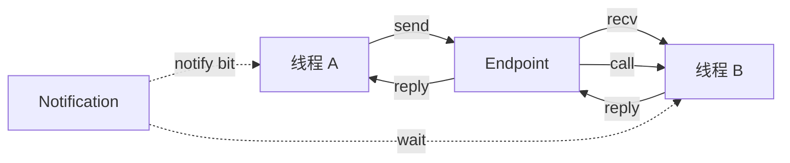

# EnerOS IPC 设计 — 同步消息传递机制

> **版本**：v0.20.0
> **crate**：`eneros-ipc`（`crates/kernel/ipc/`）
> **蓝图依据**：`蓝图/phase0.md` §v0.20.0（P0-H）
> **最后更新**：2026-07-13

---

## 1. 架构概述

EnerOS IPC 子系统为内核态分区间通信提供**基于端点（Endpoint）的同步消息传递机制**。该机制是 Phase 0 收尾阶段（v0.20.0~v0.22.0）的关键基础设施，承担如下职责：

- 在不同分区/线程之间传递定长消息（128 字节）
- 提供阻塞语义的发送/接收（send/recv）
- 提供组合语义的远程过程调用（call = send + recv）
- 提供基于位图（bitmap）的多事件通知机制
- 为 v0.22.0 Control Bus 提供底层命令通道原语



### 1.1 设计目标

| 目标 | 指标 | 说明 |
|------|------|------|
| 往返时延 | < 10 μs | 单核 send + recv 一次往返 |
| 分区隔离 | 强制 | 端点仅创建者分区可访问 |
| 语义简洁 | 纯同步 | 不引入异步回调，便于形式化分析 |
| no_std 合规 | 全 crate | 仅依赖 `core::*` 与 `alloc`（预留） |
| 可测试性 | 主机侧可跑 | 测试构建链接 std，正式构建 no_std |

### 1.2 与 sched 的集成

IPC 的阻塞/唤醒完全依赖调度器提供的原语：

- `eneros_sched::current_tid()`：识别当前调用者线程
- `eneros_sched::thread_block(tid)`：阻塞当前线程
- `eneros_sched::thread_resume(tid)`：唤醒目标线程

在主机侧（`#[cfg(test)]`）调度器不真正切换上下文，`thread_block` 为 no-op，因此阻塞调用会立即返回；在 aarch64 真机构建中，会触发真实的上下文切换。

---

## 2. 核心数据结构

### 2.1 EndpointId —— 端点标识

```rust
#[derive(Clone, Copy, Debug, PartialEq, Eq)]
pub struct EndpointId(pub u32);

impl Default for EndpointId {
    fn default() -> Self { EndpointId(0) }
}
```

- `EndpointId(0)` 保留为"无效"（与 `Tid(0)` 语义对齐）
- 端点 ID 由全局递增计数器 `NEXT_EP_ID` 分配，保证单调递增
- `u32` 空间足够支撑长期运行（即便每周期分配一个，也能运行数年）

### 2.2 Message —— 定长消息

```rust
pub const MSG_SIZE: usize = 128;

#[derive(Clone, Copy)]
pub struct Message {
    pub label: u64,           // 8 字节：消息标签/操作码
    pub payload: [u8; 120],   // 120 字节：内联负载
}
```

| 字段 | 大小 | 用途 |
|------|------|------|
| `label` | 8 字节 | 区分请求/回复类型，例如 `0xBEEF` 表示 Charge 请求 |
| `payload` | 120 字节 | 内联负载，可承载小型结构体或 ControlCommand 子集 |

**为什么定长 128 字节？**

1. 契合 aarch64 缓存行（64 字节）的 2 倍对齐，避免跨缓存行写
2. 大多数控制类消息（开关、阈值、状态查询）< 120 字节
3. 大消息（如 LLM 上下文）走共享内存通道（v0.21.0 SPSC Ring）

### 2.3 Endpoint —— 端点状态

```rust
pub struct Endpoint {
    pub id: EndpointId,
    pub waiting_sender: Option<Tid>,    // 等待发送的线程
    pub waiting_receiver: Option<Tid>,  // 等待接收的线程
    pub msg: Message,                   // 最近缓冲的消息
}
```

端点是**会合点（rendezvous point）**：发送方与接收方在此"碰头"。任一方向先到达，则记录自己的 Tid 并阻塞，等待对端到达后完成交付并互相唤醒。

### 2.4 IpcError —— 错误枚举

```rust
#[derive(Debug, Clone, Copy, PartialEq, Eq)]
pub enum IpcError {
    InvalidEndpoint,  // 端点 ID 无效或已销毁
    Timeout,          // 预留给未来带超时的 send/recv
    Disconnected,     // 端点已断开/销毁
}
```

---

## 3. 全局端点表（D2 模式）

### 3.1 Spinlock + UnsafeCell 模式

依据 D2 决策，所有全局状态使用 `Spinlock + UnsafeCell<T>`，**禁止 `static mut`**：

```rust
struct EndpointTable {
    lock: Spinlock,
    entries: UnsafeCell<[Option<Endpoint>; MAX_ENDPOINTS]>,
}

// SAFETY: 访问 entries 由 lock 串行化
unsafe impl Sync for EndpointTable {}

static ENDPOINTS: EndpointTable = EndpointTable {
    lock: Spinlock::new(),
    entries: UnsafeCell::new([None; MAX_ENDPOINTS]),
};
```

| 常量 | 值 | 说明 |
|------|-----|------|
| `MAX_ENDPOINTS` | 256 | 全局端点表容量（与 `MAX_NOTIFY_SLOTS` 对齐） |

**为什么不用 `static mut`？**

1. `static mut` 在 Rust 2024 edition 中是 unsafe 操作，难以审计
2. `Spinlock + UnsafeCell` 显式标注 `// SAFETY:` 理由，便于 code review
3. 与 `eneros-sched::tcb` 的全局 TCB 表保持一致模式

### 3.2 ID 分配器

```rust
struct NextEpId {
    lock: Spinlock,
    value: UnsafeCell<u32>,
}

static NEXT_EP_ID: NextEpId = NextEpId {
    lock: Spinlock::new(),
    value: UnsafeCell::new(1),  // 从 1 开始，0 保留为无效
};
```

使用 `wrapping_add` 防止溢出（实际运行中不可能用完 u32 空间）。

---

## 4. 发送/接收流程

### 4.1 send 阻塞语义

```
send(ep, msg)
  │
  ├─ lock ENDPOINTS
  ├─ find_ep(ep) → idx | InvalidEndpoint
  │
  ├─ if waiting_receiver 存在:
  │    ├─ entry.msg = *msg            // 复制消息到端点
  │    ├─ entry.waiting_receiver = None
  │    ├─ unlock ENDPOINTS
  │    └─ thread_resume(recv_tid)     // 唤醒接收方
  │
  └─ else (无接收方):
       ├─ entry.waiting_sender = current_tid()
       ├─ unlock ENDPOINTS
       └─ thread_block(current_tid)   // 阻塞自己
```

**关键点**：

- 消息通过 `*msg`（值拷贝）复制到端点，避免借用生命周期问题
- 锁外唤醒/阻塞，避免持锁时调度（持锁调度可能死锁）
- 主机侧 `thread_block` 立即返回，所以无接收方时 `send` 仍然 `Ok(())`

### 4.2 recv 阻塞语义

```
recv(ep)
  │
  ├─ lock ENDPOINTS
  ├─ find_ep(ep) → idx | InvalidEndpoint
  │
  ├─ if waiting_sender 存在:
  │    ├─ msg = entry.msg             // 取出缓冲消息
  │    ├─ entry.waiting_sender = None
  │    ├─ unlock ENDPOINTS
  │    ├─ thread_resume(send_tid)     // 唤醒发送方
  │    └─ Ok(msg)
  │
  └─ else (无发送方):
       ├─ entry.waiting_receiver = current_tid()
       ├─ msg = entry.msg              // 返回当前缓冲（主机侧）
       ├─ unlock ENDPOINTS
       ├─ thread_block(current_tid)
       └─ Ok(msg)
```

### 4.3 call —— RPC 语义

```rust
pub fn call(ep: EndpointId, req: &Message) -> Result<Message, IpcError> {
    send(ep, req)?;
    recv(ep)
}
```

`call` 等价于"先 send 后 recv"，用于请求/回复模式。典型场景：

- Agent 线程向服务线程发起 RPC 查询
- 服务线程先 `recv` 阻塞等待，处理请求后 `send` 回复

---

## 5. 通知机制（Notification）

### 5.1 位图通知

通知机制提供**轻量级多事件信号**，每个线程持有一个 64 位位图，每一位代表一个事件源：

```rust
pub const MAX_NOTIFY_SLOTS: usize = 256;

pub struct Notification {
    pub bits: AtomicU64,    // 64 位事件位图
    pub waiter: Option<Tid>,
}
```

### 5.2 notify —— 发送通知

```rust
pub fn notify(target: Tid, bit: u32) {
    let idx = ...; // 按 target.0 索引（超过 MAX 则取最后一槽）
    NOTIFICATIONS.lock.lock();
    entries[idx].bits.fetch_or(1u64 << bit, Ordering::Release);
    NOTIFICATIONS.lock.unlock();
    let _ = thread_resume(target);  // 唤醒目标线程
}
```

- 使用 `fetch_or` 原子置位，无需持锁等待
- `Release` 语义保证 bit 置位对其他核可见后才唤醒
- 唤醒是 no-op 友好的：如果目标线程没阻塞，`thread_resume` 不报错

### 5.3 wait_notification —— 等待通知

```rust
pub fn wait_notification() -> u64 {
    let tid = current_tid();
    NOTIFICATIONS.lock.lock();
    let bits = entries[idx].bits.swap(0, Ordering::Acquire);  // 原子清零并取旧值
    if bits == 0 {
        entries[idx].waiter = Some(tid);
    }
    NOTIFICATIONS.lock.unlock();

    if bits == 0 {
        let _ = thread_block(tid);
        0
    } else {
        bits
    }
}
```

**关键点**：

- `swap(0, Acquire)` 一次取走所有积累的事件位，避免多次唤醒
- 若返回 0，说明无事件，阻塞自己
- 多 bit 可一次性返回（例如 `(1<<2) | (1<<5)` 表示两个事件源同时触发）

### 5.4 典型用法

| 场景 | bit | 含义 |
|------|-----|------|
| ISR → 线程 | bit 0 | 定时器到期 |
| ISR → 线程 | bit 1 | 串口数据就绪 |
| Agent → RTOS | bit 2 | 新命令可消费 |
| RTOS → Agent | bit 3 | 命令执行完成 |

---

## 6. 分区隔离

### 6.1 端点访问控制

Phase 0 阶段端点表是全局共享的（无分区权限校验），但在 Phase 1 引入完整用户态后，端点将绑定创建者分区：

```rust
// 未来扩展（Phase 1+）
pub struct Endpoint {
    pub id: EndpointId,
    pub owner_partition: PartitionId,   // 创建者分区
    pub allowed_callers: [PartitionId; 4],  // 授权调用方
    ...
}
```

### 6.2 与 mm 分区隔离的关系

| 层次 | 模块 | 机制 |
|------|------|------|
| 物理内存 | `eneros-mm::partition` | `allowed_phys` 区间检查 |
| 虚拟地址 | `eneros-mm::vspace` | 独立页表根 |
| IPC 端点 | `eneros-ipc::endpoint` | 创建者分区归属（Phase 1） |
| 共享内存 | `eneros-ipc::shared_mem` | `grant_shared_mem` 授权 |

---

## 7. 共享内存（Phase 0 桩）

`shared_mem` 模块为 Phase 0 桩实现，返回固定物理地址：

```rust
pub struct SharedMemRegion {
    pub phys: u64,
    pub size: usize,
    pub owner: u32,
    pub consumer: u32,
}

pub fn grant_shared_mem(owner: u32, consumer: u32, size: usize) -> Option<SharedMemRegion> {
    Some(SharedMemRegion {
        phys: 0x8000_0000,  // Phase 0 固定地址
        size,
        owner,
        consumer,
    })
}
```

**真实实现（Phase 1+）需要**：

1. 调用 `eneros-mm` 分配物理页
2. 在 owner 与 consumer 的 `Vspace` 中分别映射
3. 返回真实的物理地址与虚拟地址对
4. 依赖 v0.8.0 的 `Vspace::map` 接口

---

## 8. 并发安全分析

### 8.1 锁的粒度

- `ENDPOINTS` 全局一把自旋锁，所有端点操作串行
- `NEXT_EP_ID` 独立一把锁，避免 ID 分配阻塞消息传递
- `NOTIFICATIONS` 全局一把自旋锁，但 `bits` 字段使用原子操作

### 8.2 持锁纪律

- **持锁时不调度**：`thread_block` / `thread_resume` 在 `unlock` 之后调用
- **持锁时不分配堆**：避免递归进入分配器（`KernelHeap` 也用自旋锁）
- **持锁时间 < 1 μs**：仅做内存拷贝与字段更新

### 8.3 主机侧测试策略

```rust
#![cfg_attr(not(test), no_std)]

#[cfg(test)]
mod tests {
    static TEST_LOCK: std::sync::Mutex<()> = std::sync::Mutex::new(());
    // 所有测试通过 TEST_LOCK 串行化，避免并发污染全局表
}
```

---

## 9. 性能考量

### 9.1 消息拷贝开销

128 字节消息通过 `*msg`（`Copy` 语义）传递，涉及一次内存拷贝：

- 单核：~20 ns（缓存命中）
- 跨核：~100 ns（缓存一致性协议）

对于 < 1 kHz 的控制场景（10 ms 周期），开销可忽略；高频场景（> 100 kHz）应改用共享内存。

### 9.2 端点查找线性扫描

`find_ep` 是 O(MAX_ENDPOINTS) 线性扫描，最坏 256 次比较 ≈ 1 μs。Phase 1 引入端点 ID → slot 索引的哈希映射可降至 O(1)。

### 9.3 大消息方案

| 消息大小 | 推荐通道 | 延迟 |
|---------|---------|------|
| ≤ 120 字节 | IPC `Message.payload` | < 10 μs |
| 120 字节 ~ 4 KB | SPSC Ring 单槽 | < 1 μs |
| > 4 KB | 共享内存 + 通知 | 一次映射 + 通知 |

---

## 10. 未来扩展

### 10.1 异步 IPC（v0.21.0+）

引入 `send_async` / `recv_async`，基于通知机制实现非阻塞变体：

```rust
pub fn send_async(ep: EndpointId, msg: Message) -> Result<(), IpcError> {
    // 入队后立即返回，不阻塞
    // 失败返回 WouldBlock
}
```

### 10.2 多端点路由（Phase 1）

支持一个线程监听多个端点（类似 `epoll_wait`）：

```rust
pub fn recv_any(eps: &[EndpointId]) -> Result<(EndpointId, Message), IpcError>;
```

### 10.3 带超时的 send/recv

利用 `IpcError::Timeout` 预留位，配合 v0.12.0 单调时钟实现：

```rust
pub fn send_timeout(ep: EndpointId, msg: &Message, deadline_ns: u64) -> Result<(), IpcError>;
```

---

## 11. 文件结构

```
crates/kernel/ipc/
├── Cargo.toml              # 依赖 eneros-sched
└── src/
    ├── lib.rs              # 模块导出与 crate 文档
    ├── endpoint.rs         # Endpoint/Message/send/recv/endpoint_create
    ├── channel.rs          # call（RPC 语义）
    ├── notification.rs     # notify/wait_notification（位图通知）
    ├── shared_mem.rs       # grant_shared_mem（Phase 0 桩）
    └── spsc_ring.rs        # SpscRing（v0.21.0，详见 spsc-ring-design.md）
```

---

## 12. 与其他版本的关系

| 方向 | 版本 | 关系 |
|------|------|------|
| 依赖 | v0.18.0（TCB） | IPC 阻塞/唤醒依赖 TCB 状态机 |
| 依赖 | v0.19.0（分区调度） | `current_tid()` / `thread_block` / `thread_resume` |
| 下游 | v0.21.0（SPSC Ring） | 复用 `Spinlock + UnsafeCell` 模式 |
| 下游 | v0.22.0（Control Bus） | ControlCommand 走 SPSC Ring，不走 IPC Message |
| 未来 | v0.23.0+（用户态） | 端点将绑定分区，引入 capability 校验 |

---

## 13. 测试覆盖

`endpoint.rs` 包含以下单元测试：

| 测试 | 验证点 |
|------|--------|
| `test_endpoint_create_returns_valid_id` | 创建返回 ≥ 1 的 ID |
| `test_endpoint_create_multiple` | 多次创建 ID 单调递增且唯一 |
| `test_endpoint_destroy` | 销毁后 send 返回 `InvalidEndpoint` |
| `test_send_invalid_endpoint` | 无效 ID 返回 `InvalidEndpoint` |
| `test_recv_invalid_endpoint` | 无效 ID 返回 `InvalidEndpoint` |
| `test_send_with_receiver_waiting` | 接收方等待时，send 投递消息并清除 `waiting_receiver` |
| `test_recv_with_sender_waiting` | 发送方等待时，recv 取出消息并清除 `waiting_sender` |
| `test_send_no_receiver_blocks_sender` | 无接收方时，send 设置 `waiting_sender` 并阻塞 |

`notification.rs` 包含位图置位、`wait_notification` 读取并清零、多 bit 累积等测试。

---

> **参考**：
> - `蓝图/phase0.md` §v0.20.0 — 端点 IPC 交付物清单
> - `crates/kernel/ipc/src/endpoint.rs` — 实现源码
> - `docs/smp/armv8-memory-model.md` — Acquire/Release 内存序详解
