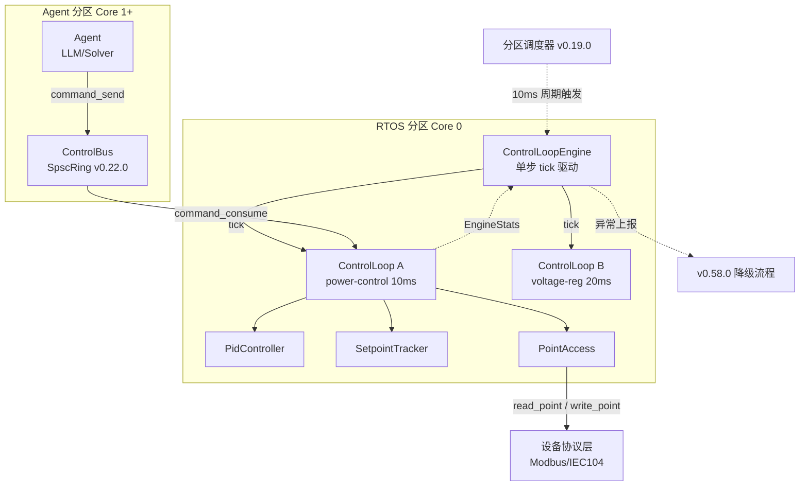

# EnerOS RTOS 控制闭环引擎设计 — 10ms 周期硬实时控制核心

> **版本**：v0.54.0（P1-H RTOS 组件首层）
> **crate**：`eneros-rtos-control`（`crates/kernel/rtos-control/`）
> **蓝图依据**：`蓝图/phase1.md` §v0.54.0（行 10717–10946）
> **最后更新**：2026-07-15

---

## 1. 版本目标

### 1.1 一句话目标

实现 RTOS 控制闭环引擎，支持 10ms 周期性控制循环、PID 基础算法与设定值跟踪（Setpoint Tracking）。

### 1.2 详细描述

控制闭环是储能系统的核心实时功能，涵盖功率控制、电压调节、频率响应等场景。本版本在 RTOS 快平面实现 10ms 周期的控制循环引擎，提供 PID 算法与设定值跟踪能力，确保控制命令在严格的时间约束内执行。

引擎以"单步驱动（tick）"方式由分区调度器周期性调用，每个 tick 内完成：从 Control Bus 读取 Agent 下发的设定值 → 采集过程变量（反馈） → PID 计算 → 下发控制指令到设备协议。整个过程必须在 10ms 周期内完成，抖动控制在 1ms 以内。

### 1.3 架构定位

| 维度 | 定位 |
|------|------|
| Phase | Phase 1 单机 MVP |
| 子系统 | P1-H RTOS 组件首层 |
| 平面 | 快平面（RTOS 分区，Core 0） |
| 角色 | 快平面实时控制核心 |
| 后续版本 | v0.55.0+ 在此基础上扩展更复杂的控制算法（模糊控制、模型预测等） |

### 1.4 设计原则关联

| 原则 | 体现 |
|------|------|
| 硬实时性 | 10ms 周期，抖动 < 1ms（10%）；控制路径无堆分配、无锁竞争 |
| 确定性 | 控制周期由 v0.19.0 分区调度器严格时间触发，非事件驱动 |
| 故障隔离 | 单个控制循环的异常不影响其他循环；错误上报但不阻塞周期 |
| 可降级 | 与 v0.58.0 降级流程衔接，控制异常可触发分区级降级 |
| no_std 合规 | 全 crate 仅使用 `core::*` / `alloc::*`，无 `std::*`（蓝图 §43.1） |

---

## 2. 前置依赖

### 2.1 依赖版本表

| 依赖版本 | 依赖产出 | 用途 | 使用方式 |
|---------|---------|------|---------|
| v0.19.0 | 分区调度器（`eneros-sched`） | 时间触发调度 | 分区调度器以 10ms 周期调用 `ControlLoopEngine::tick(now_us, elapsed_us)` |
| v0.22.0 | Control Bus + `ControlCommand` | 接收 Agent 下发的设定值 | 调用 `eneros_controlbus::command_consume()` 读取命令，提取 `setpoint` 字段 |
| v0.12.0 | 高精度定时器 hrtimer | 10ms 周期定时 | 由 v0.19.0 调度器内部使用，本 crate 不直接依赖（见 D4） |

### 2.2 依赖关系说明

```
v0.12.0 hrtimer ──► v0.19.0 分区调度器 ──► v0.54.0 RTOS 控制闭环
                                              ▲
v0.22.0 Control Bus ──────────────────────────┘
```

**关键约束**：本 crate 不直接依赖 `eneros-time` 的 `Hrtimer` / `MonotonicClock`（D4）。时间触发由 v0.19.0 分区调度器负责，本 crate 通过 `tick(now_us)` 接收当前时间戳，保持与调度器的单向依赖，避免循环引用。

### 2.3 与 controlbus 的接口契约

v0.22.0 Control Bus 提供的全局函数（非 reader 对象，见 D7）：

| 函数 | 签名 | 用途 |
|------|------|------|
| `command_consume()` | `fn() -> Option<ControlCommand>` | RTOS 侧消费一条命令 |
| `command_send(cmd)` | `fn(ControlCommand) -> Result<(), CbError>` | Agent 侧下发命令（本 crate 不调用） |

`ControlCommand` 关键字段（v0.22.0 实际实现）：

```rust
pub struct ControlCommand {
    pub cmd_id: [u8; 16],
    pub timestamp: u64,       // 纳秒时间戳
    pub ttl_ms: u32,
    pub target_device: DeviceId,
    pub action: ControlAction,  // Charge / Discharge / Idle / Emergency
    pub setpoint: f32,          // 功率设定值（kW）—— 直接字段，非 getter
    pub constraints: ConstraintPack,
    pub signature: [u8; 64],
}
```

> **注意**：蓝图原文使用 `cmd.get_setpoint("power")` 形式的 getter，但 v0.22.0 实际实现为 `setpoint: f32` 直接字段。本文档以实际实现为准。

---

## 3. 交付物清单

### 3.1 交付物总表

| 类型 | 交付物 | 描述 | 验收点 |
|------|--------|------|--------|
| 代码模块 | `eneros-rtos-control` crate | 控制闭环引擎 | 位于 `crates/kernel/rtos-control/`，no_std 合规 |
| trait | `ControlLoop` | 控制循环 trait | 5 方法，不要求 `Send + Sync`（D5） |
| struct | `PidController` | PID 控制器 | 9 字段，含积分/输出限幅 |
| struct | `SetpointTracker` | 设定值跟踪器 | 斜率限制 + 收敛判据 + 无限制模式 |
| struct | `ControlLoopEngine` | 控制循环引擎 | 多循环调度 + 抖动统计 + 错误隔离 |
| struct | `EngineStats` / `JitterStats` | 引擎统计 | 普通 `u64`（D8），`Vec<(String, JitterStats)>`（D9） |
| trait | `PointAccess` | 设备点访问抽象 | `read_point` / `write_point` |
| enum | `ControlError` | 错误枚举 | 7 变体 |
| 示例 | `PowerControlLoop<P>` | 功率控制循环示例 | 泛型 `<P: PointAccess>`（D6） |
| 测试 | 控制周期/抖动/PID | 单元 + 集成测试 | 10ms 周期 + 抖动 <1ms，覆盖率 ≥90% |
| 文档 | 本设计文档 | 控制闭环配置说明 | PID 参数 / 周期 / 设定值来源 |

### 3.2 文件布局

```
crates/kernel/rtos-control/
├── Cargo.toml
└── src/
    ├── lib.rs              # 模块导出 + ControlError + PointAccess
    ├── pid.rs              # PidController
    ├── setpoint.rs         # SetpointTracker
    ├── loop_trait.rs       # ControlLoop trait
    ├── engine.rs           # ControlLoopEngine + EngineStats + JitterStats
    ├── power_loop.rs       # PowerControlLoop<P> 示例
    └── tests.rs            # 单元测试（host 侧）
```

---

## 4. 架构设计

### 4.1 架构图



### 4.2 组件关系

| 组件 | 职责 | 上游 | 下游 |
|------|------|------|------|
| `ControlLoopEngine` | 管理多个 `ControlLoop`，按周期调度 | 分区调度器 v0.19.0 | 各 `ControlLoop` 实现 |
| `ControlLoop`（trait） | 单个控制循环的抽象 | Engine | `PidController` / `SetpointTracker` / `PointAccess` |
| `PidController` | PID 算法计算 | `ControlLoop::execute` | 无 |
| `SetpointTracker` | 设定值斜率限制与跟踪 | `ControlLoop::execute` | `PidController`（输出实际设定值） |
| `PointAccess`（trait） | 设备点读写抽象 | `ControlLoop::execute` | 设备协议层（Modbus/IEC104） |
| `ControlBus` | 接收 Agent 命令 | Agent | `ControlLoop::execute` |

### 4.3 数据流（单次 tick）

```
分区调度器 → Engine::tick(now_us, elapsed_us)
   → 遍历 loops，检查 period_us 是否到期
      → 到期 loop.execute(elapsed_us)
         → command_consume() 读取设定值
         → SetpointTracker.update(target, dt) 斜率限制
         → PidController.set_setpoint(sp) / set_process_variable(pv)
         → PidController.compute(dt) 得到控制输出
         → PointAccess.write_point(id, output) 下发
      → 返回 Ok / Err
   → Engine 更新 JitterStats，返回 EngineTickReport
```

### 4.4 关键设计决策

| 决策 | 选择 | 理由 |
|------|------|------|
| 驱动模型 | 单步 `tick()`（D3） | `run() -> !` 在 no_std 单线程下无法测试；由外部调度器循环调用 |
| 时间传递 | `now_us: u64` 参数注入（D1） | `MonotonicTime`/`Duration` 在 no_std 不存在 |
| 点访问 | 泛型 `<P: PointAccess>`（D6） | 避免 `Box<dyn>` 的堆分配与动态分发开销 |
| 命令读取 | 全局 `command_consume()`（D7） | controlbus 实际 API 即全局函数，非 reader 对象 |

---

## 5. PidController 详细设计

### 5.1 字段定义（9 字段）

| # | 字段 | 类型 | 单位 | 说明 |
|---|------|------|------|------|
| 1 | `kp` | `f64` | — | 比例系数 |
| 2 | `ki` | `f64` | — | 积分系数 |
| 3 | `kd` | `f64` | — | 微分系数 |
| 4 | `integral` | `f64` | — | 积分项累加值（带限幅） |
| 5 | `last_error` | `f64` | — | 上次误差（用于微分计算） |
| 6 | `integral_limit` | `f64` | 与输出同量纲 | 积分项限幅上限（绝对值） |
| 7 | `output_limit` | `f64` | 与输出同量纲 | 输出限幅上限（绝对值） |
| 8 | `setpoint` | `f64` | 过程变量量纲 | 设定值（目标值） |
| 9 | `process_variable` | `f64` | 过程变量量纲 | 过程变量（当前实测值） |

### 5.2 构造与配置

```rust
pub struct PidController {
    kp: f64,
    ki: f64,
    kd: f64,
    integral: f64,
    last_error: f64,
    integral_limit: f64,
    output_limit: f64,
    setpoint: f64,
    process_variable: f64,
}

impl PidController {
    pub fn new(kp: f64, ki: f64, kd: f64) -> Self {
        Self {
            kp, ki, kd,
            integral: 0.0,
            last_error: 0.0,
            integral_limit: f64::MAX,   // 默认不限幅
            output_limit: f64::MAX,     // 默认不限幅
            setpoint: 0.0,
            process_variable: 0.0,
        }
    }

    pub fn set_integral_limit(&mut self, limit: f64) { self.integral_limit = limit; }
    pub fn set_output_limit(&mut self, limit: f64) { self.output_limit = limit; }
    pub fn set_setpoint(&mut self, sp: f64) { self.setpoint = sp; }
    pub fn set_process_variable(&mut self, pv: f64) { self.process_variable = pv; }

    pub fn reset(&mut self) {
        self.integral = 0.0;
        self.last_error = 0.0;
    }
}
```

### 5.3 compute 算法（伪代码）

```
fn compute(&mut self, dt: f64) -> f64:
    error = setpoint - process_variable

    // 积分项累加（带限幅）
    integral = integral + error * dt
    integral = clamp(integral, -integral_limit, +integral_limit)   // D10: 手写 clamp

    // 微分项（dt > 0 时计算，避免除零）
    if dt > 0.0:
        derivative = (error - last_error) / dt
    else:
        derivative = 0.0
    last_error = error

    // PID 输出
    output = kp * error + ki * integral + kd * derivative
    output = clamp(output, -output_limit, +output_limit)           // D10: 手写 clamp
    return output
```

### 5.4 积分限幅（Anti-Windup）

**问题**：当输出长期饱和（达到 `output_limit`）时，积分项会持续累加误差，导致超调严重、响应迟滞。

**对策**：`integral_limit` 限制积分项的绝对值。一旦积分项达到 ±`integral_limit`，不再继续累加，防止"积分饱和（Windup）"。

**整定建议**：`integral_limit` 通常设为 `output_limit / ki`，使积分项对输出的贡献不超过输出限幅。

### 5.5 输出限幅

**目的**：防止 PID 输出超出执行机构（如功率变换器）的物理能力。

**实现**：`output = clamp(output, -output_limit, +output_limit)`（D10 手写实现）。

**注意**：输出限幅与积分限幅配合使用——仅输出限幅而无积分限幅会导致 Windup。

### 5.6 抗饱和策略对比

| 策略 | 实现 | 优点 | 缺点 | 本版本采用 |
|------|------|------|------|-----------|
| 积分限幅（Clamping） | 限制 `integral` 绝对值 | 简单、稳定 | 限幅值需人工整定 | ✅ |
| 反算抗饱和（Back-calculation） | 饱和时按比例回扣积分 | 自适应 | 需额外参数 | ❌（后续版本） |
| 条件积分（Conditional integration） | 饱和时停止积分 | 直观 | 阈值难定 | ❌（后续版本） |

### 5.7 手写 clamp（D10）

```rust
fn clamp_f64(v: f64, lo: f64, hi: f64) -> f64 {
    if v < lo { lo } else if v > hi { hi } else { v }
}
```

**理由**：`f64::clamp` 在某些 `no_std` target（如 `aarch64-unknown-none`）上可能因 `compiler-builtins` 缺失而不可用，手写 `core::cmp::min/max` 风格实现保证可移植性。

---

## 6. SetpointTracker 详细设计

### 6.1 设计动机

蓝图 §8.3 指出："设定值跳变——Agent 突变设定值可能导致输出超调，需斜率限制"。`SetpointTracker` 负责将 Agent 下发的目标设定值平滑过渡到实际设定值，避免阶跃激励引发 PID 超调。

### 6.2 字段定义

```rust
pub struct SetpointTracker {
    current: f64,         // 当前实际设定值（已平滑）
    target: f64,          // 目标设定值（Agent 下发）
    max_slope: f64,       // 最大变化率（单位/秒）；f64::MAX 表示无限制
    tolerance: f64,       // 收敛判据（|current - target| < tolerance 视为收敛）
}
```

### 6.3 斜率限制算法

```
fn update(&mut self, target: f64, dt: f64) -> f64:
    self.target = target
    if dt <= 0.0:
        return self.current                    // 时间未推进，保持当前值

    delta = self.target - self.current
    max_step = self.max_slope * dt             // 本周期允许的最大变化量

    if |delta| <= max_step:
        self.current = self.target             // 可一步到达
    else:
        self.current += sign(delta) * max_step // 限速逼近

    return self.current
```

### 6.4 收敛判据

| 条件 | 判定 |
|------|------|
| `|current - target| < tolerance` | 已收敛（`is_settled() -> true`） |
| `|current - target| >= tolerance` | 过渡中（`is_settled() -> false`） |

`tolerance` 默认设为量程的 0.1%（如功率量程 100kW → tolerance = 0.1kW）。

### 6.5 无限制模式

当 `max_slope = f64::MAX` 时，`max_step` 趋近无穷，`|delta| <= max_step` 恒成立，`current` 立即跳变到 `target`——即不进行斜率限制。此模式用于：
- 测试场景（验证无斜率限制下的 PID 响应）
- 对超调不敏感的快速响应回路

### 6.6 update 接口设计（D11）

蓝图原文 `set_setpoint(sp)` 仅设置目标，未考虑斜率限制所需的 `dt`。本设计改为 `update(target, dt)` 两参数：

| 接口 | 签名 | 说明 |
|------|------|------|
| `set_target` | `fn(&mut self, target: f64)` | 仅设置目标值，不推进 current |
| `update` | `fn(&mut self, target: f64, dt: f64) -> f64` | 设置目标并按 dt 推进 current，返回当前设定值 |
| `is_settled` | `fn(&self) -> bool` | 是否已收敛 |
| `current` | `fn(&self) -> f64` | 获取当前实际设定值 |

**理由**：斜率限制本质上是时间相关的积分过程，必须知道 `dt` 才能计算本周期允许的变化量。`set_setpoint(sp)` 无法表达这一语义。

### 6.7 使用示例

```rust
let mut tracker = SetpointTracker::new(0.0);       // current = 0
tracker.set_max_slope(10.0);                        // 10 kW/s
tracker.set_tolerance(0.1);

// 第 1 个 tick：target=50, dt=0.01s, max_step=0.1kW
let sp1 = tracker.update(50.0, 0.01);               // sp1 ≈ 0.1 kW
assert!(!tracker.is_settled());

// 经过约 5s（500 个 tick）后收敛
let sp_n = tracker.update(50.0, 0.01);              // sp_n ≈ 50.0 kW
assert!(tracker.is_settled());
```

---

## 7. ControlLoop trait

### 7.1 trait 定义

```rust
pub trait ControlLoop {
    /// 循环名称（用于统计与日志）
    fn name(&self) -> &str;
    /// 控制周期（μs）
    fn period_us(&self) -> u64;
    /// 循环初始化
    fn init(&mut self) -> Result<(), ControlError>;
    /// 单次控制周期执行
    fn execute(&mut self, elapsed_us: u64) -> Result<(), ControlError>;
    /// 循环停止清理
    fn shutdown(&mut self);
}
```

### 7.2 方法表（5 方法）

| # | 方法 | 签名 | 调用时机 | 说明 |
|---|------|------|---------|------|
| 1 | `name` | `fn(&self) -> &str` | 统计/日志 | 返回循环标识，如 `"power-control"` |
| 2 | `period_us` | `fn(&self) -> u64` | Engine 调度判断 | 控制周期（微秒），10ms = 10_000 |
| 3 | `init` | `fn(&mut self) -> Result<(), ControlError>` | 注册后首次 tick 前 | 初始化设备、PID 参数等 |
| 4 | `execute` | `fn(&mut self, elapsed_us: u64) -> Result<(), ControlError>` | 每个到期周期 | 核心控制逻辑；`elapsed_us` 为实际流逝时间 |
| 5 | `shutdown` | `fn(&mut self)` | 引擎停止时 | 释放资源、重置 PID |

### 7.3 不要求 Send + Sync（D5）

蓝图原文声明 `pub trait ControlLoop: Send + Sync`，本设计移除该约束。

**理由**：

| 维度 | 说明 |
|------|------|
| 运行模型 | no_std 单线程 RTOS 分区，`ControlLoopEngine` 与所有 `ControlLoop` 均在 Core 0 单线程运行 |
| 跨核访问 | Agent 分区（Core 1+）不直接访问 `ControlLoop`，仅通过 ControlBus 传递命令 |
| 一致性 | 与 v0.51.0 D2、v0.53.0 D7 保持一致——单线程 no_std 场景无需 `Send + Sync` |
| 测试便利 | 移除 `Send + Sync` 后，`Rc<ControlLoop>` 等非线程安全类型可用于测试桩 |

### 7.4 elapsed_us 参数说明

`execute(elapsed_us)` 的 `elapsed_us` 为**实际流逝时间**（微秒），由 Engine 根据两次 tick 的时间差计算传入，而非固定周期值。

**坑点（蓝图 §8.4）**：PID 的 `dt` 必须用实际执行间隔，不能用固定值。若用固定 10000μs 而实际因抖动为 10500μs，会导致积分项计算偏差。

```rust
fn execute(&mut self, elapsed_us: u64) -> Result<(), ControlError> {
    let dt = elapsed_us as f64 / 1_000_000.0;   // μs → s
    // ...
    let output = self.pid.compute(dt);
    // ...
}
```

---

## 8. ControlLoopEngine 详细设计

### 8.1 tick 时序图

```mermaid
sequenceDiagram
    participant Sched as 分区调度器 v0.19.0
    participant Engine as ControlLoopEngine
    participant Loop as ControlLoop

    Sched->>Engine: tick(now_us=10000, elapsed_us=10000)
    Engine->>Engine: 检查每个 loop 是否到期
    Engine->>Loop: execute(elapsed_us=10000)
    Loop->>Loop: 读 ControlBus / PID 计算 / 写下发
    Loop-->>Engine: Ok / Err
    Engine->>Engine: 更新 JitterStats + EngineStats
    Engine-->>Sched: EngineTickReport
    Note over Sched,Engine: 下一周期（10ms 后）重复
```

### 8.2 字段定义

```rust
pub struct ControlLoopEngine {
    loops: Vec<Box<dyn ControlLoop>>,           // 已注册的控制循环
    last_execute_us: Vec<(String, u64)>,        // 每个循环上次执行时间戳（D9: Vec 而非 BTreeMap）
    stats: EngineStats,
    initialized: bool,
}

pub struct EngineStats {
    pub total_ticks: u64,                       // D8: 普通 u64，非 AtomicU64
    pub total_errors: u64,
    pub jitter: Vec<(String, JitterStats)>,     // D9: Vec<(String, JitterStats)>
}

pub struct JitterStats {
    pub exec_count: u64,
    pub max_jitter_us: u64,                     // 最大抖动
    pub max_exec_us: u64,                       // 最大单次执行耗时
    pub last_error: Option<ControlError>,       // 最近一次错误
}

pub struct EngineTickReport {
    pub executed: u32,                          // 本 tick 执行的循环数
    pub errors: u32,                            // 本 tick 错误数
    pub max_jitter_us: u64,                     // 本 tick 最大抖动
}
```

### 8.3 核心接口

```rust
impl ControlLoopEngine {
    pub fn new() -> Self { /* ... */ }

    /// 注册控制循环
    pub fn register(&mut self, ctrl: Box<dyn ControlLoop>) {
        let name = ctrl.name().to_string();
        self.loops.push(ctrl);
        self.last_execute_us.push((name, 0));
        self.stats.jitter.push((name, JitterStats::default()));
    }

    /// 单步驱动（D3：替代阻塞式 run() -> !）
    pub fn tick(&mut self, now_us: u64, elapsed_us: u64) -> EngineTickReport {
        if !self.initialized {
            for ctrl in &mut self.loops {
                let _ = ctrl.init();   // 初始化错误不阻塞，记录后继续
            }
            self.initialized = true;
        }

        let mut executed = 0u32;
        let mut errors = 0u32;
        let mut max_jitter = 0u64;

        for (i, ctrl) in self.loops.iter_mut().enumerate() {
            let period = ctrl.period_us();
            let last = self.last_execute_us[i].1;
            // 判断是否到期
            if now_us.wrapping_sub(last) >= period {
                let start = now_us;
                let result = ctrl.execute(elapsed_us);
                let exec_time = now_us;   // 实际实现用调度器时间戳差值

                // 抖动统计：实际执行时刻与理想到期时刻的偏差
                let ideal_deadline = last.wrapping_add(period);
                let jitter = now_us.wrapping_sub(ideal_deadline);
                self.update_jitter(i, jitter, exec_time, result.as_err());

                executed += 1;
                if result.is_err() { errors += 1; }
                if jitter > max_jitter { max_jitter = jitter; }

                self.last_execute_us[i].1 = now_us;
            }
        }

        self.stats.total_ticks += 1;
        self.stats.total_errors += errors as u64;

        EngineTickReport { executed, errors, max_jitter_us: max_jitter }
    }

    /// 停止所有循环
    pub fn shutdown(&mut self) {
        for ctrl in &mut self.loops {
            ctrl.shutdown();
        }
    }

    /// 获取统计快照
    pub fn stats(&self) -> &EngineStats { &self.stats }
}
```

### 8.4 多循环调度策略

| 策略 | 说明 |
|------|------|
| 基准周期 | Engine 不设固定基准周期；每个循环按自身 `period_us` 独立判断到期 |
| 到期判断 | `now_us - last_execute >= period_us` 即到期，执行一次 |
| 执行顺序 | 按 `register()` 注册顺序依次执行（确定性优先） |
| 周期公倍数 | 10ms + 20ms 循环在第 0/20/40ms... 同时到期，按顺序执行 |
| 超期处理 | 若某循环执行超时导致后续循环超期，后续循环在本 tick 内仍执行一次（不补偿） |

### 8.5 抖动统计

**抖动定义**：实际执行时刻 `now_us` 与理想到期时刻 `last_execute + period_us` 的差值。

| 字段 | 含义 |
|------|------|
| `max_jitter_us` | 历史最大抖动（μs） |
| `max_exec_us` | 历史最大单次执行耗时（μs） |
| `exec_count` | 累计执行次数 |
| `last_error` | 最近一次错误（用于诊断） |

**验收阈值**：`max_jitter_us < 1000`（1ms）即满足蓝图 §7 验收标准。

### 8.6 错误隔离策略

| 场景 | 处理 |
|------|------|
| 单个 `execute()` 返回 `Err` | 记录到 `JitterStats.last_error`，`total_errors += 1`，继续执行下一个循环 |
| 单个 `init()` 失败 | 记录错误，该循环仍参与调度（`execute` 可能再失败，但不阻塞其他循环） |
| `execute()` panic | 由 v0.16.0 panic 框架隔离到当前分区，不影响其他分区；Engine 本身不 catch panic |
| 多次连续错误 | Engine 不主动停用循环（避免误判）；由 v0.58.0 降级流程根据错误率决策 |

**设计原则**：错误隔离的目标是"单点故障不扩散"，而非"自动恢复"。恢复决策交由 v0.58.0 降级流程。

---

## 9. PowerControlLoop 示例

### 9.1 完整链路说明

`PowerControlLoop` 演示一个完整的功率控制循环，链路如下：

```
1. 设定值来源：Agent 通过 ControlBus.command_send() 下发 ControlCommand
                     ↓
2. 设定值读取：execute() 调用 command_consume() 取命令，提取 setpoint 字段
                     ↓
3. 斜率限制：SetpointTracker.update(target, dt) 平滑过渡，输出 current setpoint
                     ↓
4. 反馈采集：PointAccess.read_point(POWER_FB_POINT_ID) 读取实际功率
                     ↓
5. PID 计算：PidController.set_setpoint(sp) / set_process_variable(pv) / compute(dt)
                     ↓
6. 输出下发：PointAccess.write_point(POWER_CMD_POINT_ID, output) 下发功率指令
                     ↓
7. 错误处理：任一步失败返回 ControlError，由 Engine 隔离
```

### 9.2 泛型设计（D6）

```rust
pub struct PowerControlLoop<P: PointAccess> {
    pid: PidController,
    tracker: SetpointTracker,
    protocol: P,                // D6: 泛型，非 Box<dyn PointAccess>
    feedback: f64,              // 实际功率
    output: f64,                // 控制输出（功率指令）
    target_power: f64,          // 目标功率（最近一次 Agent 命令）
}

impl<P: PointAccess> PowerControlLoop<P> {
    pub fn new(pid: PidController, tracker: SetpointTracker, protocol: P) -> Self {
        Self {
            pid, tracker, protocol,
            feedback: 0.0,
            output: 0.0,
            target_power: 0.0,
        }
    }
}
```

**泛型优于 `Box<dyn>` 的理由**：

| 维度 | 泛型 `<P: PointAccess>` | `Box<dyn PointAccess>` |
|------|------------------------|------------------------|
| 堆分配 | 无（静态分发） | 需要 alloc 堆分配 |
| 分发开销 | 零（编译期单态化） | 动态分发（vtable 查找） |
| no_std 兼容 | 无需 alloc | 依赖 alloc |
| 实时性 | ✅ 适合 10ms 硬实时 | ⚠️ 堆分配引入不确定性 |
| 测试 | 可注入 mock 类型 | 需构造 trait 对象 |

### 9.3 ControlLoop 实现

```rust
const POWER_FB_POINT_ID: u32 = 0x1001;
const POWER_CMD_POINT_ID: u32 = 0x2001;

impl<P: PointAccess> ControlLoop for PowerControlLoop<P> {
    fn name(&self) -> &str { "power-control" }
    fn period_us(&self) -> u64 { 10_000 }   // 10ms

    fn init(&mut self) -> Result<(), ControlError> {
        self.pid.reset();
        self.tracker.reset();
        Ok(())
    }

    fn execute(&mut self, elapsed_us: u64) -> Result<(), ControlError> {
        let dt = elapsed_us as f64 / 1_000_000.0;

        // 1. 从 Control Bus 读取设定值（D7: 全局函数，非 reader 对象）
        if let Some(cmd) = command_consume() {
            self.target_power = cmd.setpoint as f64;
        }

        // 2. 斜率限制（D11: update(target, dt) 两参数）
        let sp = self.tracker.update(self.target_power, dt);
        self.pid.set_setpoint(sp);

        // 3. 读取实际功率
        let pv = self.protocol.read_point(POWER_FB_POINT_ID)?;
        if let PointValue::Float(v) = pv {
            self.feedback = v;
            self.pid.set_process_variable(v);
        } else {
            return Err(ControlError::PointTypeMismatch);
        }

        // 4. PID 计算
        self.output = self.pid.compute(dt);

        // 5. 下发控制指令
        self.protocol.write_point(POWER_CMD_POINT_ID, PointValue::Float(self.output))?;
        Ok(())
    }

    fn shutdown(&mut self) {
        // D12: 仅重置 PID，不做复杂清理
        self.pid.reset();
    }
}
```

### 9.4 设定点来源说明

| 来源 | 接口 | 频率 | 说明 |
|------|------|------|------|
| Agent 命令 | `command_consume()` | 秒级 | Agent 通过 LLM/Solver 决策后下发，频率远低于 10ms |
| 本地默认 | `target_power` 保持 | — | 无新命令时保持上次目标值（TTL 由 controlbus 管理） |

**关键**：RTOS 不直接计算设定值，设定值由 Agent 决策。RTOS 仅负责"按设定值执行实时控制"。

---

## 10. 错误处理与降级

### 10.1 ControlError 枚举

```rust
#[derive(Debug, Clone, Copy, PartialEq, Eq)]
pub enum ControlError {
    /// 设备点读取失败（通信故障、设备离线）
    PointReadFailed,
    /// 设备点写入失败（通信故障、设备拒收）
    PointWriteFailed,
    /// 设备点类型不匹配（期望 Float，实际 Int）
    PointTypeMismatch,
    /// 设定值超出约束范围（被 ConstraintPack 拒绝）
    ConstraintViolation,
    /// 设备响应超时
    DeviceTimeout,
    /// PID 计算异常（NaN、无穷大）
    PidComputationFailed,
    /// 循环未初始化
    NotInitialized,
}
```

### 10.2 错误变体说明

| 变体 | 触发场景 | 处理策略 | 是否可恢复 |
|------|---------|---------|-----------|
| `PointReadFailed` | Modbus/IEC104 通信失败 | 保持上次输出，记录错误 | ✅ 通信恢复即可 |
| `PointWriteFailed` | 下发指令失败 | 记录错误，下周期重试 | ✅ 通信恢复即可 |
| `PointTypeMismatch` | 协议点类型配置错误 | 记录错误，持续报错 | ❌ 需修正配置 |
| `ConstraintViolation` | setpoint 越界 | controlbus 层已截断，本层不应触发 | — |
| `DeviceTimeout` | 读取超时 | 保持上次输出，记录错误 | ✅ 设备恢复即可 |
| `PidComputationFailed` | dt=0 或输入 NaN | 重置 PID，记录错误 | ✅ 重置后可恢复 |
| `NotInitialized` | 未调用 init 即 execute | 自动补调 init | ✅ 自动恢复 |

### 10.3 错误隔离策略

```
单次 execute() 返回 Err
   ↓
Engine 记录到 JitterStats.last_error
   ↓
total_errors += 1
   ↓
继续执行下一个 ControlLoop（不阻塞）
   ↓
本周期结束，返回 EngineTickReport
   ↓
（持续错误）v0.58.0 降级流程监控错误率
   ↓
错误率超阈值 → 触发分区降级
```

### 10.4 与 v0.58.0 降级流程的关系

| 维度 | v0.54.0 本 crate | v0.58.0 降级流程 |
|------|-----------------|-----------------|
| 职责 | 单周期错误检测与隔离 | 跨周期错误率监控与降级决策 |
| 时间尺度 | 单次 tick（10ms） | 秒级（滑动窗口） |
| 输入 | `ControlError` | `EngineStats.total_errors` / 错误率 |
| 输出 | `EngineTickReport` | 降级指令（切换到 SafeDefault） |
| 触发条件 | 任一 `execute()` 失败 | 错误率 > 阈值（如 10%） |

**接口契约**：本 crate 通过 `Engine::stats()` 暴露 `EngineStats`，v0.58.0 降级流程定期读取统计，基于错误率决策是否触发降级。本 crate 不主动触发降级，仅提供数据。

---

## 11. 性能与抖动控制

### 11.1 性能指标

| 指标 | 目标 | 验收方法 |
|------|------|---------|
| 控制周期 | 10ms | 分区调度器时间触发 |
| 周期抖动 | < 1ms（10%） | `JitterStats.max_jitter_us < 1000` |
| PID 计算耗时 | < 100μs | 单次 `compute()` 计时 |
| 单循环执行耗时 | < 1ms | `JitterStats.max_exec_us < 1000` |
| Engine.tick 耗时 | < 2ms | 所有到期循环执行总和 |
| 连续运行 | 24h 无超时 | 回归测试 |

### 11.2 WCET 分析

| 操作 | 估算 WCET | 说明 |
|------|----------|------|
| `command_consume()` | < 5μs | SPSC Ring pop + 256 字节拷贝 |
| `SetpointTracker.update()` | < 1μs | 2 次比较 + 1 次加减 |
| `PointAccess.read_point()` | 100–500μs | 取决于协议（Modbus RTU 较慢） |
| `PidController.compute()` | < 100μs | 3 次乘法 + 2 次加减 + 2 次 clamp |
| `PointAccess.write_point()` | 100–500μs | 取决于协议 |
| **单循环总计** | **< 1.2ms** | 满足 10ms 周期 |

**风险**：`PointAccess` 的 WCET 取决于设备协议。Modbus RTU 在 9600bps 下单次读写可达 10–50ms，会突破 10ms 周期。**对策**：
- 快平面控制点必须走高速协议（Modbus TCP / IEC104 / 本地 GPIO）
- 慢速协议点由慢平面 Agent 读取，通过共享内存传递

### 11.3 抖动来源与抑制

| 抖动来源 | 影响程度 | 抑制措施 |
|---------|---------|---------|
| 中断处理时间过长 | 高 | v0.19.0 分区调度器在控制周期内禁用非关键中断 |
| 锁竞争 | 中 | 控制路径无锁（SPSC Ring 无锁） |
| 缓存未命中 | 中 | 关键代码段锁定在 L1（v0.16.0 核绑定） |
| 内存分配 | 高 | 控制路径零堆分配（泛型 + 静态缓冲） |
| FPU 上下文切换 | 中 | Core 0 始终启用 FPU，无切换 |

### 11.4 FPU 注意事项（蓝图 §8.5）

| 维度 | 要求 |
|------|------|
| FPU 启用 | Core 0（RTOS 分区）必须在启动时启用 FPU（`CPACR_EL1.FPEN`） |
| FPU 上下文 | 单线程 RTOS 分区无需保存/恢复 FPU 上下文 |
| 软浮点回退 | 禁止——软浮点会使 PID 计算耗时增加 10× 以上，无法满足 100μs 预算 |
| 验证 | 启动时执行一次 `1.0 + 1.0` 浮点运算，若异常则 panic |

### 11.5 no_std 与零分配保证

| 组件 | 分配行为 | 保证 |
|------|---------|------|
| `PidController` | 栈上结构 | 零堆分配 |
| `SetpointTracker` | 栈上结构 | 零堆分配 |
| `ControlLoopEngine::tick()` | 无 `Vec::push` / `String::new` | 零堆分配（`loops` 在 register 阶段预分配） |
| `command_consume()` | SPSC Ring 静态缓冲 | 零堆分配 |
| `EngineTickReport` | 值返回 | 零堆分配 |

**关键**：`tick()` 内部绝不调用任何 alloc 函数。`Vec<Box<dyn ControlLoop>>` 的内存仅在 `register()` 阶段分配，运行时只读访问。

---

## 12. 偏差声明（D1~D12）

本设计文档相对蓝图原文（`蓝图/phase1.md` §v0.54.0，行 10717–10946）的偏差声明如下。所有偏差均出于 no_std 合规性、可测试性或与既有版本一致性考虑。

| 偏差 | 蓝图原文 | 本设计 | 理由 |
|------|---------|--------|------|
| **D1** | `MonotonicTime` / `Duration` 时间类型 | 时间戳用 `u64` 微秒参数注入（`now_us: u64`） | `MonotonicTime` / `Duration` 在 no_std 不存在；与 v0.50.0 D1、v0.53.0 D1 一致 |
| **D2** | 未明确 crate 位置 | crate 放入 `crates/kernel/rtos-control/` | P1-H RTOS 组件，控制循环在内核态 RTOS 分区运行，与 controlbus/sched 同属 kernel 子系统（记忆文件 §2.3.2） |
| **D3** | `run() -> !` 阻塞式驱动 | 改为 `tick(now_us, elapsed_us) -> EngineTickReport` 单步驱动，由外部调度器循环调用 | `run() -> !` 在 no_std 单线程下无法测试；单步驱动便于单元测试与调度器解耦 |
| **D4** | 直接依赖 `eneros-time` 的 `Hrtimer` / `MonotonicClock` | 不直接依赖；通过 `tick(now_us)` 接收当前时间 | 时间触发由 v0.19.0 分区调度器负责；避免循环依赖，保持单向引用 |
| **D5** | `pub trait ControlLoop: Send + Sync` | 移除 `Send + Sync` 约束 | no_std 单线程无需该约束；与 v0.51.0 D2、v0.53.0 D7 一致 |
| **D6** | `protocol: Box<dyn PointAccess>` | 改为泛型 `<P: PointAccess>` | `Box<dyn>` 在 no_std 无 alloc 时复杂且引入动态分发开销；泛型零成本抽象更适合硬实时 |
| **D7** | `cmd_bus: ControlBusReader` + `try_read()` | 直接调用全局 `command_consume() -> Option<ControlCommand>` | controlbus crate（v0.22.0）提供的是全局函数，非 reader 对象；与实际 API 一致 |
| **D8** | `EngineStats` 使用 `AtomicU64` | 改用普通 `u64` | no_std 单线程无需原子操作；避免不必要的同步开销 |
| **D9** | `JitterRecord` 使用 `BTreeMap<&str, u64>` | 改用 `Vec<(String, JitterStats)>` | no_std 下 `&str` 作为 BTreeMap key 存在生命周期问题；`Vec<(String, _)>` 更简单且足够（循环数 < 10） |
| **D10** | `f64::clamp(...)` | 用 `core::cmp::min/max` 手写 `clamp_f64` | `f64::clamp` 在某些 no_std target（如 `aarch64-unknown-none`）因 compiler-builtins 缺失不可用；手写保证可移植 |
| **D11** | `set_setpoint(sp)` 仅设置目标 | 改为 `update(target, dt) -> f64` 两参数 | 斜率限制本质是时间相关积分过程，必须知道 `dt` 才能计算本周期变化量；`set_setpoint` 语义不足 |
| **D12** | `shutdown` 复杂清理逻辑 | 示例实现仅重置 PID | `PowerControlLoop` 为示例实现，具体设备的清理逻辑（如关闭阀门、归零输出）由具体设备实现层负责 |

### 12.1 偏差一致性说明

本版本偏差与既有版本偏差的一致性：

| 偏差 | 一致版本 | 一致点 |
|------|---------|--------|
| D1（时间用 `u64`） | v0.50.0 D1、v0.53.0 D1 | no_std 下时间戳统一用 `u64` 微秒 |
| D5（不要求 Send+Sync） | v0.51.0 D2、v0.53.0 D7 | no_std 单线程下 trait 不加 Send+Sync 约束 |
| D6（泛型替代 Box<dyn>） | v0.53.0 D4 | 硬实时路径优先泛型零成本抽象 |

### 12.2 偏差可追溯性

所有偏差均可在实现阶段的 `src/lib.rs` 文件头部注释中找到对应说明（参考 `crates/kernel/controlbus/src/lib.rs` 的 `# Design Decisions` 段落风格），确保代码与文档一致。

---

## 附录 A. 测试计划摘要

| 测试类型 | 覆盖项 | 目标 |
|---------|--------|------|
| 单元测试 | `PidController`（P/I/D 各项、限幅、抗饱和、reset） | 覆盖率 ≥90% |
| 单元测试 | `SetpointTracker`（斜率限制、收敛、无限制模式） | 覆盖率 ≥90% |
| 单元测试 | `ControlLoopEngine`（多循环调度、抖动统计、错误隔离） | 覆盖率 ≥85% |
| 集成测试 | 10ms 周期循环 + 抖动测量（host 侧模拟调度器） | 抖动 <1ms |
| 性能基准 | `compute()` 单次耗时 | <100μs |
| 回归测试 | 24h 连续运行（模拟 8.64M 次 tick） | 无超时、无内存增长 |
| 边界测试 | 设定值跳变、传感器故障（read 失败）、输出限幅触发 | 错误隔离生效 |

## 附录 B. 验收标准对照

| 蓝图验收项 | 本设计对应章节 | 状态 |
|-----------|--------------|------|
| 10ms 控制周期抖动 <1ms | §8.5 抖动统计、§11 性能指标 | ✅ 设计支持 |
| PID 控制器支持 P/I/D 参数配置和限幅 | §5 PidController | ✅ 9 字段 + 双限幅 |
| 设定值从 Control Bus 读取 | §9.3 PowerControlLoop::execute | ✅ command_consume |
| 功率控制循环完整（设定值→PID→输出→设备） | §9 PowerControlLoop 示例 | ✅ 完整链路 |

---

> **参考**：
> - `蓝图/phase1.md` §v0.54.0（行 10717–10946）— 蓝图原文
> - `crates/kernel/controlbus/src/command.rs` — ControlCommand 实际定义
> - `crates/kernel/controlbus/src/lib.rs` — command_consume 全局函数
> - `docs/kernel/control-bus-design.md` — v0.22.0 Control Bus 设计
> - `docs/smp/partition-scheduler-design.md` — v0.19.0 分区调度器
> - `docs/kernel/ipc-design.md` — SPSC Ring 无锁通道
> - 记忆文件 §2.3.2 — 子系统归属判定规则
