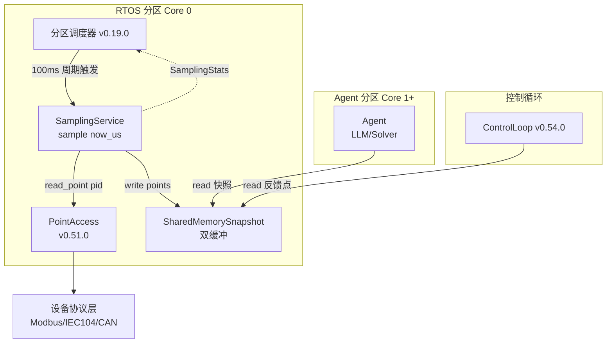
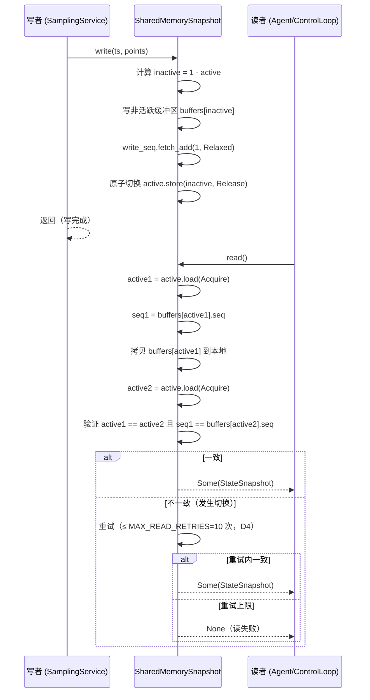

# EnerOS 高频采样服务设计 — 100ms 周期设备状态采集与共享内存快照

> **版本**：v0.55.0（P1-H RTOS 组件第二层）
> **crate**：`eneros-rtos-sampling`（`crates/kernel/rtos-sampling/`）
> **蓝图依据**：`蓝图/phase1.md` §v0.55.0（行 10949–11116）
> **最后更新**：2026-07-15

---

## 1. 版本目标

### 1.1 一句话目标

实现高频采样服务，支持设备状态采集、状态快照写入共享内存，供 Agent 与控制循环读取。

### 1.2 详细描述

高频采样是实时控制与状态监测的基础数据源。本版本在 RTOS 快平面实现高频（100ms 或更高）设备状态采样，将采集的状态数据写入共享内存快照，供 Agent 和控制循环读取。快照机制避免了高频采样对 Agent 的频繁唤醒——Agent 按自身节奏（秒级）从共享内存读取最新快照即可，与采样频率完全解耦。

服务以"单步驱动（`sample(now_us)`）"方式由分区调度器周期性调用，每个采样周期内完成：遍历采样点列表 → 通过 `PointAccess` 逐点读取 → 类型归一化为 `SampledPoint` → 写入 `SharedMemorySnapshot` 双缓冲 → 更新统计。整个过程必须在 100ms 采样周期内完成，256 点采样耗时目标 < 1ms。

### 1.3 架构定位

| 维度 | 定位 |
|------|------|
| Phase | Phase 1 单机 MVP |
| 子系统 | P1-H RTOS 组件第二层，数据采集层 |
| 平面 | 快平面（RTOS 分区，Core 0） |
| 角色 | 快平面状态采集与快照发布核心 |
| 上游版本 | v0.54.0 RTOS 控制闭环（首层），共享 `PointAccess` 抽象 |
| 下游消费者 | Agent 分区（慢平面）、`ControlLoop`（控制反馈） |
| 后续版本 | Phase 3 seL4 集成时替换为 seL4 SharedMemory 对象（D3） |

### 1.4 设计原则关联

| 原则 | 体现 |
|------|------|
| 数据局部性 | 快照数据驻留共享内存，消费者就近读取，避免跨分区拷贝 |
| 解耦 | 采样频率（100ms）与消费者频率（Agent 秒级、控制 10ms）完全解耦，通过快照序列号同步 |
| 确定性 | 采样周期由 v0.19.0 分区调度器严格时间触发，非事件驱动 |
| 无锁并发 | 双缓冲 + 原子序列号实现写者-读者无锁同步，无阻塞 |
| no_std 合规 | 全 crate 仅使用 `core::*` / `alloc::*`，无 `std::*`（蓝图 §43.1） |

---

## 2. 前置依赖

### 2.1 依赖版本表

| 依赖版本 | 依赖产出 | 用途 | 使用方式 |
|---------|---------|------|---------|
| v0.51.0 | `PointAccess` trait / `DataPoint` / `PointValue` / `PointQuality` | 设备点读取 | 泛型 `<P: PointAccess>`，调用 `read_point(pid)` 获取 `DataPoint`，提取 `value` / `quality` 字段 |
| v0.19.0 | 分区调度器（`eneros-sched`） | 采样周期调度 | 分区调度器以 100ms 周期调用 `SamplingService::sample(now_us)` |
| v0.50.0 | UPA Model（`eneros-upa-model`） | 点类型定义 | `PointValue`（Float/Int/Bool/Enum/String/Null）、`PointQuality`（7 标志位）、`PointId`/`DeviceId` |

### 2.2 依赖关系说明

```
v0.50.0 UPA Model ──► v0.51.0 PointAccess ──► v0.55.0 高频采样服务
                                                   ▲
v0.19.0 分区调度器 ─────────────────────────────────┘
                                                   ▲
v0.54.0 RTOS 控制闭环（共享 PointAccess 抽象） ────┘
```

**关键约束**：本 crate 不直接依赖 `eneros-time` 的 `MonotonicClock`（D1）。时间戳由外部调度器通过 `sample(now_us)` 参数注入，保持与 v0.54.0 D1、v0.50.0 D1 一致，避免循环引用。

### 2.3 与 PointAccess 的接口契约

v0.51.0 `PointAccess` trait 关键方法（来自 `crates/protocols/protocol-abstract/src/access.rs`）：

| 方法 | 签名 | 用途 |
|------|------|------|
| `read_point` | `fn(&mut self, point_id: PointId) -> Result<DataPoint, ProtocolError>` | 读取单点当前值 |
| `read_points` | `fn(&mut self, point_ids: &[PointId]) -> Vec<Result<DataPoint, ProtocolError>>` | 批量读取多点 |
| `write_point` | `fn(&mut self, point_id: PointId, value: PointValue) -> Result<(), ProtocolError>` | 写入单点（本 crate 不调用） |

`DataPoint` 关键字段（v0.50.0 实际定义）：

```rust
pub struct DataPoint {
    pub point_id: PointId,         // u32
    pub device_id: DeviceId,       // u16
    pub value: PointValue,         // Float/Int/Bool/Enum/String/Null
    pub quality: PointQuality,     // 7 bool 标志位
    pub timestamp_ms: u64,         // 数据采集时间（毫秒）
    // ... name/description/source/unit 等本 crate 不使用
}
```

`PointValue` 枚举变体（v0.50.0）：

```rust
pub enum PointValue {
    Float(f64),       // 遥测模拟量
    Int(i64),         // 整数值
    Bool(bool),       // 遥信状态
    Enum(u16),        // 状态机
    String(String),   // 字符串（本 crate 跳过，见 §7.3）
    Null,              // 未初始化或数据丢失
}
```

> **注意**：蓝图原文使用 `Box<dyn PointAccess>` 字段，本设计改为泛型 `<P: PointAccess>`（D6），与 v0.54.0 D6 一致。

---

## 3. 交付物清单

### 3.1 交付物总表

| 类型 | 交付物 | 描述 | 验收点 |
|------|--------|------|--------|
| 代码模块 | `eneros-rtos-sampling` crate | 高频采样服务 | 位于 `crates/kernel/rtos-sampling/`，no_std 合规 |
| trait | `PointAccess`（复用 v0.51.0） | 设备点访问抽象 | 不重新定义，依赖 v0.51.0 |
| struct | `SampledPoint` | 采样点（point_id + value + quality） | 3 字段，`#[repr(C)]` + `Copy` |
| struct | `StateSnapshot` | 状态快照（原子写入共享内存） | 4 字段，`#[repr(C)]` + `MAX_POINTS=256` |
| struct | `SharedMemorySnapshot` | 共享内存快照（双缓冲） | 3 字段，`AtomicU8`/`AtomicU64`（D8） |
| struct | `SamplingService<P>` | 采样服务对象 | 泛型 `<P: PointAccess>`（D6），`sample(now_us)` 单步驱动（D5） |
| struct | `SamplingStats` | 采样统计 | 普通 `u64`（D7），非 `AtomicU64` |
| struct | `SampleReport` | 单次采样报告 | 采样点数 / 失败数 / 序列号 |
| enum | `SamplingError` | 错误枚举 | 4 变体 |
| const | `MAX_POINTS = 256` / `MAX_READ_RETRIES = 10` | 容量与重试上限 | D9 / D4 |
| 测试 | 双缓冲/快照一致性/采样频率 | 单元 + 集成测试 | 100ms 采样 + 256 点 < 1ms，覆盖率 ≥85% |
| 文档 | 本设计文档 | 采样配置说明 | 采样点列表 / 频率 / 快照格式 |

### 3.2 文件布局

```
crates/kernel/rtos-sampling/
├── Cargo.toml
└── src/
    ├── lib.rs              # 模块导出 + SampledPoint + StateSnapshot + SamplingError
    ├── snapshot.rs         # SharedMemorySnapshot 双缓冲
    ├── service.rs          # SamplingService<P> + SamplingStats + SampleReport
    └── tests.rs            # 单元测试（host 侧）
```

---

## 4. 架构设计

### 4.1 架构图



### 4.2 组件关系

| 组件 | 职责 | 上游 | 下游 |
|------|------|------|------|
| `SamplingService<P>` | 周期性采集设备点，归一化为 `SampledPoint`，写入快照 | 分区调度器 v0.19.0 | `SharedMemorySnapshot` / `PointAccess` |
| `PointAccess`（trait，复用 v0.51.0） | 设备点读取抽象 | `SamplingService` | 设备协议层（Modbus/IEC104/CAN） |
| `SharedMemorySnapshot` | 双缓冲无锁快照存储，原子切换 | `SamplingService`（写者） | Agent / ControlLoop（读者） |
| `StateSnapshot` | 单次快照数据载体 | `SharedMemorySnapshot` 内部缓冲 | 消费者读取后拷贝 |
| `SamplingStats` | 采样统计（次数/失败/时间戳） | `SamplingService` | 调度器 / 降级流程（v0.58.0） |
| `ControlLoop` v0.54.0 | 控制循环，读取快照作为反馈 | `SharedMemorySnapshot`（读者） | 设备协议层 |
| Agent | 慢平面消费者，秒级读取快照 | `SharedMemorySnapshot`（读者） | LLM/Solver 决策 |

### 4.3 数据流（单次采样）

```
分区调度器 → SamplingService::sample(now_us)
   → 遍历 point_ids
      → PointAccess.read_point(pid) → DataPoint
      → PointValue 类型转换（Float/Int/Bool/Enum → f64；Null/String → 跳过）
      → quality.valid as u8（D10）
      → 构建 SampledPoint，push 到本地缓冲
   → SharedMemorySnapshot.write(now_us, &points)
      → 写非活跃缓冲区
      → fetch_add write_seq
      → 原子切换 active 指针
   → SamplingStats.record_sample(...)
   → 返回 SampleReport
```

### 4.4 关键设计决策

| 决策 | 选择 | 理由 |
|------|------|------|
| 驱动模型 | 单步 `sample(now_us)`（D5） | `run()` 循环在 no_std 单线程下无法测试；由 v0.19.0 调度器周期调用 |
| 时间传递 | `now_us: u64` 参数注入（D1） | `MonotonicTime`/`Duration` 在 no_std 不存在；与 v0.54.0 D1 一致 |
| 点访问 | 泛型 `<P: PointAccess>`（D6） | 避免 `Box<dyn>` 堆分配与动态分发开销；与 v0.54.0 D6 一致 |
| 共享内存 | in-memory 双缓冲（D3） | seL4 SharedMemory 属 Phase 3；本版本用相同接口，后续替换 |
| 双缓冲同步 | `AtomicU8`/`AtomicU64`（D8） | no_std 可用；无锁读写必须原子操作 |
| 读取重试 | `MAX_READ_RETRIES=10`（D4） | 避免高并发切换时读者无限重试 |
| 快照存储 | 固定数组 `[SampledPoint; 256]`（D9） | `#[repr(C)]` 固定大小便于页对齐共享内存 |
| 统计字段 | 普通 `u64`（D7） | no_std 单线程采样，无需原子 |

---

## 5. StateSnapshot 详细设计

### 5.1 SampledPoint（3 字段）

| # | 字段 | 类型 | 说明 |
|---|------|------|------|
| 1 | `point_id` | `u32` | 点唯一标识（与 v0.50.0 `PointId = u32` 一致） |
| 2 | `value` | `f64` | 点值（已归一化为浮点；见 §7.3 类型转换表） |
| 3 | `quality` | `u8` | 品质标志（`PointQuality.valid as u8`，D10；0=无效，1=有效） |

```rust
/// 单个采样点（归一化后的快照条目）。
#[repr(C)]
#[derive(Debug, Clone, Copy, Default)]
pub struct SampledPoint {
    pub point_id: u32,
    pub value: f64,
    pub quality: u8,
}
```

**设计说明**：

- `#[repr(C)]`：保证内存布局可预测，便于跨进程共享内存直接按字节读取（D9）。
- `Copy`：`StateSnapshot::read()` 返回 `Option<StateSnapshot>` 时需整体拷贝，`SampledPoint` 必须 `Copy`。
- `Default`：`StateSnapshot.points` 数组初始化为零值（point_id=0, value=0.0, quality=0）。
- `quality` 字段为 `u8` 而非 `bool`：保留扩展性，未来可编码 IEC 104 的完整品质描述符（D10 简化为 valid 位）。

### 5.2 StateSnapshot（4 字段）

| # | 字段 | 类型 | 说明 |
|---|------|------|------|
| 1 | `timestamp` | `u64` | 快照时间戳（微秒，由 `sample(now_us)` 注入，D1） |
| 2 | `seq` | `u64` | 序列号（每次更新递增，用于一致性检查） |
| 3 | `point_count` | `u32` | 有效采样点数量（≤ `MAX_POINTS`） |
| 4 | `points` | `[SampledPoint; MAX_POINTS]` | 采样数据数组（固定大小，D9） |

```rust
/// 状态快照（原子性写入共享内存）。
///
/// `#[repr(C)]` + 固定大小，便于页对齐共享内存（蓝图 §8.4）。
#[repr(C)]
#[derive(Debug, Clone, Copy)]
pub struct StateSnapshot {
    pub timestamp: u64,
    pub seq: u64,
    pub point_count: u32,
    pub points: [SampledPoint; MAX_POINTS],
}

/// 单个快照最大采样点数。
///
/// 蓝图 §8.4 要求快照大小需页对齐（4KB）。
/// `SampledPoint` = 4 + 8 + 1 = 13 字节（padding 后约 16 字节），
/// 256 点 ≈ 4KB，与页大小对齐。
pub const MAX_POINTS: usize = 256;
```

### 5.3 #[repr(C)] 与页对齐说明

| 维度 | 说明 |
|------|------|
| `#[repr(C)]` 作用 | 字段按声明顺序排列，无重排；跨进程共享内存读取时布局可预测 |
| `SampledPoint` 大小 | `u32`(4) + `f64`(8) + `u8`(1) + padding(3) = 16 字节（C ABI 对齐到 8） |
| `StateSnapshot` 大小 | `u64`(8) + `u64`(8) + `u32`(4) + padding(4) + `[SampledPoint; 256]`(4096) = 4120 字节 ≈ 4KB |
| 页对齐（蓝图 §8.4） | 4120 字节略超 4KB，建议在 Phase 3 seL4 集成时分配 2 页（8KB）共享内存 |
| `MAX_POINTS` 调整 | 若需严格 ≤ 4KB，可减为 252 点（252 × 16 + 24 = 4056 字节）；本版本保持 256 兼容蓝图 |

### 5.4 get_points 切片访问

```rust
impl StateSnapshot {
    /// 获取有效采样点切片（仅前 `point_count` 个）。
    pub fn get_points(&self) -> &[SampledPoint] {
        // 防御：point_count 上限保护
        let count = core::cmp::min(self.point_count as usize, MAX_POINTS);
        &self.points[..count]
    }

    /// 按点 ID 查找（线性扫描；点数 ≤ 256，O(n) 可接受）。
    pub fn find(&self, point_id: u32) -> Option<&SampledPoint> {
        self.get_points().iter().find(|p| p.point_id == point_id)
    }
}
```

**设计说明**：消费者（Agent / ControlLoop）通常按 `point_id` 查找特定点。256 点线性扫描的 WCET < 1μs（每次比较约 4ns），远低于 Agent 秒级读取频率。若未来点数增长，可改为排序后二分查找，但当前版本遵循 Simplicity First。

---

## 6. SharedMemorySnapshot 双缓冲

### 6.1 双缓冲时序图



### 6.2 字段定义

```rust
use core::sync::atomic::{AtomicU8, AtomicU64, Ordering};

/// 共享内存快照（双缓冲无锁实现）。
///
/// 写者（SamplingService）与读者（Agent/ControlLoop）跨核并发访问，
/// 通过原子索引 + 序列号验证实现无锁同步（D8）。
pub struct SharedMemorySnapshot {
    /// 双缓冲区（A/B）
    buffers: [StateSnapshot; 2],
    /// 活跃缓冲区索引（0 或 1）
    active: AtomicU8,
    /// 写入序列号（每次 write 递增）
    write_seq: AtomicU64,
}
```

| # | 字段 | 类型 | 说明 |
|---|------|------|------|
| 1 | `buffers` | `[StateSnapshot; 2]` | 双缓冲 A/B，写者写非活跃侧，读者读活跃侧 |
| 2 | `active` | `AtomicU8` | 活跃缓冲区索引（0 或 1），写者用 `Release` 切换，读者用 `Acquire` 读取（D8） |
| 3 | `write_seq` | `AtomicU64` | 写入序列号，`fetch_add` 递增（D8） |

### 6.3 write 算法（伪代码）

```
fn write(&self, timestamp_us: u64, points: &[SampledPoint]):
    inactive = 1 - self.active.load(Acquire)              // 取非活跃索引
    buf = &self.buffers[inactive] as *const _ as *mut StateSnapshot
    unsafe {
        (*buf).timestamp = timestamp_us                   // 写时间戳（D1: u64 微秒）
        new_seq = self.write_seq.fetch_add(1, Relaxed) + 1
        (*buf).seq = new_seq                              // 写新序列号
        count = min(points.len(), MAX_POINTS)
        (*buf).point_count = count as u32
        for i in 0..count:
            (*buf).points[i] = points[i]                  // 逐点拷贝
        // 内存屏障：保证上述写入对读者可见后再切换 active
        self.active.store(inactive, Release)              // 原子切换活跃指针
    }
    return new_seq
```

**关键点**：

1. **写非活跃缓冲区**：写者始终写 `1 - active` 侧，与读者读 `active` 侧物理隔离。
2. **序列号先于切换写入**：`seq` 在 `active.store` 之前写入，确保读者看到新 `active` 时 `seq` 已就位。
3. **Release 屏障**：`active.store(inactive, Release)` 保证缓冲区内容写入先于指针切换对读者可见。
4. **时间戳注入**：`timestamp_us` 由 `sample(now_us)` 传入，避免直接调用 `MonotonicTime::now()`（D1）。

### 6.4 read 算法（伪代码）

```
fn read(&self) -> Option<StateSnapshot>:
    for retry in 0..MAX_READ_RETRIES:                     // D4: 重试上限 10
        active1 = self.active.load(Acquire)              // 读活跃索引
        buf = &self.buffers[active1 as usize]
        seq1 = buf.seq                                   // 读序列号
        snapshot = buf.clone()                           // 拷贝整个快照（Copy）
        active2 = self.active.load(Acquire)              // 再次读活跃索引
        seq2 = buf.seq                                   // 再次读序列号
        // 验证：活跃索引未变 + 序列号未变（未被写者覆盖）
        if active1 == active2 and seq1 == seq2:
            return Some(snapshot)                        // 读到一致快照
        // 否则：写者正在切换或已切换，重试
    return None                                          // 重试上限，读失败
```

**关键点**：

1. **双重验证**：读前 `active1 + seq1`，拷贝后再读 `active2 + seq2`，两者一致才认为读到完整快照。
2. **重试上限**（D4）：`MAX_READ_RETRIES = 10`，避免高并发切换时读者无限重试（蓝图 §8.3）。
3. **返回 `Option`**：重试上限内未读到一致快照时返回 `None`，由调用者降级处理（如沿用上次快照）。
4. **Acquire 屏障**：`active.load(Acquire)` 配合写者的 `Release`，建立 happens-before 关系。

### 6.5 MAX_READ_RETRIES 说明（D4）

蓝图 §8.3 指出："双缓冲切换时读取端可能重试多次，需限制重试次数"。本设计设定 `MAX_READ_RETRIES = 10`：

| 维度 | 说明 |
|------|------|
| 触发重试的条件 | 读者在拷贝快照期间，写者完成了 `active` 切换 |
| 重试发生频率 | 采样周期 100ms，读者拷贝耗时 < 10μs，冲突窗口极小 |
| 10 次重试的耗时 | 10 × 10μs = 100μs，远小于采样周期 |
| 超过重试上限的处理 | 返回 `None`，调用者降级（如沿用上次快照或记录失败） |
| 设计权衡 | 不无限重试避免活锁；10 次足够覆盖极端高并发场景 |

### 6.6 AtomicU8 / AtomicU64 说明（D8）

`SharedMemorySnapshot` 使用 `core::sync::atomic::{AtomicU8, AtomicU64}`：

| 字段 | 原子类型 | 理由 |
|------|---------|------|
| `active` | `AtomicU8` | 索引值仅 0/1，`u8` 足够；ARM64 上 `u8` 原子操作单指令完成 |
| `write_seq` | `AtomicU64` | 序列号单调递增，需 64 位避免短期回绕；`fetch_add` 原子递增 |

**与 `SamplingStats` 的区别**（D7 vs D8）：

| 组件 | 字段类型 | 理由 |
|------|---------|------|
| `SharedMemorySnapshot` | `AtomicU8` / `AtomicU64` | 跨核并发访问（写者 Core 0，读者 Core 1+），必须原子 |
| `SamplingStats` | 普通 `u64` | 仅 `SamplingService` 单线程读写，无并发，无需原子 |

**no_std 可用性**：`core::sync::atomic` 在 `no_std` 下可用，无需 `std`。ARM64 (`aarch64-unknown-none`) 的 `AtomicU64` 通过 `LDXR`/`STXR` 独占加载/存储指令实现。

---

## 7. SamplingService 详细设计

### 7.1 字段定义

```rust
/// 高频采样服务。
///
/// 泛型 `<P: PointAccess>`（D6）：避免 `Box<dyn>` 堆分配，
/// 与 v0.54.0 D6 一致。
pub struct SamplingService<P: PointAccess> {
    /// 采样点列表（PointId = u32）
    point_ids: Vec<PointId>,
    /// 采样周期（μs）
    period_us: u64,
    /// 共享内存快照（双缓冲）
    snapshot: SharedMemorySnapshot,
    /// 协议访问（泛型，D6）
    protocol: P,
    /// 采样统计（普通 u64，D7）
    stats: SamplingStats,
}
```

| # | 字段 | 类型 | 说明 |
|---|------|------|------|
| 1 | `point_ids` | `Vec<PointId>` | 采样点列表，`PointId = u32`（v0.50.0） |
| 2 | `period_us` | `u64` | 采样周期（微秒），100ms = 100_000 |
| 3 | `snapshot` | `SharedMemorySnapshot` | 共享内存双缓冲快照 |
| 4 | `protocol` | `P`（泛型） | 设备点访问，`P: PointAccess`（D6） |
| 5 | `stats` | `SamplingStats` | 采样统计（普通 `u64`，D7） |

### 7.2 sample 单步驱动（D5）

```rust
impl<P: PointAccess> SamplingService<P> {
    /// 单步采样驱动（D5：替代阻塞式 run()）。
    ///
    /// 由 v0.19.0 分区调度器以 100ms 周期调用。
    /// `now_us` 为当前单调时间戳（微秒，D1 注入）。
    pub fn sample(&mut self, now_us: u64) -> SampleReport {
        let mut buf: [SampledPoint; MAX_POINTS] = [SampledPoint::default(); MAX_POINTS];
        let mut count: u32 = 0;
        let mut failures: u32 = 0;

        for &pid in &self.point_ids {
            if count as usize >= MAX_POINTS {
                break;  // 防止缓冲区溢出（蓝图 §8.2）
            }
            match self.protocol.read_point(pid) {
                Ok(point) => {
                    if let Some(value) = convert_point_value(&point.value) {
                        buf[count as usize] = SampledPoint {
                            point_id: pid,
                            value,
                            quality: point.quality.valid as u8,  // D10
                        };
                        count += 1;
                    }
                    // Null/String 类型跳过（不计失败，见 §9.3）
                }
                Err(_) => {
                    failures += 1;
                }
            }
        }

        let seq = self.snapshot.write(now_us, &buf[..count as usize]);
        self.stats.record_sample(now_us, failures);
        SampleReport { sampled: count, failures, seq }
    }
}
```

### 7.3 PointValue 类型转换表

`PointValue`（v0.50.0）归一化为 `SampledPoint.value: f64`：

| PointValue 变体 | 转换为 `f64` | 处理 |
|----------------|-------------|------|
| `Float(v)` | `v`（原值） | ✅ 采集 |
| `Int(v)` | `v as f64` | ✅ 采集 |
| `Bool(v)` | `if v { 1.0 } else { 0.0 }` | ✅ 采集 |
| `Enum(v)` | `v as f64` | ✅ 采集 |
| `String(_)` | — | ⏭️ 跳过（无法量化为 f64，不计失败） |
| `Null` | — | ⏭️ 跳过（无有效数据，不计失败） |

```rust
/// 将 PointValue 归一化为 f64（用于 SampledPoint.value）。
fn convert_point_value(value: &PointValue) -> Option<f64> {
    match value {
        PointValue::Float(v) => Some(*v),
        PointValue::Int(v) => Some(*v as f64),
        PointValue::Bool(v) => Some(if *v { 1.0 } else { 0.0 }),
        PointValue::Enum(v) => Some(*v as f64),
        PointValue::String(_) => None,   // 无法量化，跳过
        PointValue::Null => None,        // 无数据，跳过
    }
}
```

**设计说明**：

- `String` / `Null` 跳过而非报错：这些类型无法表示为 `f64`，对实时控制无意义；计入失败会虚高错误率。Agent 若需字符串类型，应直接通过 v0.51.0 `read_point` 访问，不经过本快照。
- `Bool → 0.0/1.0`：遥信状态（开关）量化为 0/1，便于 Agent 统一处理。
- `Enum → f64`：状态机编码量化，保留原始枚举值。
- 精度损失：`Int(i64)` 转 `f64` 在 |v| > 2^53 时有精度损失；能源场景点值通常在 ±10^6 范围内，无影响。

### 7.4 quality 映射（D10）

蓝图原文 `quality: point.quality.valid as u8`：

| `PointQuality.valid` | `SampledPoint.quality` | 含义 |
|---------------------|----------------------|------|
| `true` | `1` | 数据有效 |
| `false` | `0` | 数据无效（含 invalid/questionable/substituted/overflow/blocked/outdated 任一为 true 的情况） |

```rust
quality: point.quality.valid as u8,   // D10: 简化为 valid 位
```

**设计说明**：

- `PointQuality`（v0.50.0）有 7 个 bool 标志位，完整编码需 7 bit。
- 本快照仅保留 `valid` 位（0/1），简化跨进程共享（D10，Simplicity First）。
- 失败的细粒度原因（如 overflow/blocked）由 `SamplingStats.read_failures` 统计，不进入快照。
- 未来若需完整品质，可将 `quality` 改为 `u8` 位图（7 bit 编码 7 标志），向后兼容。

### 7.5 SampleReport 结构

```rust
/// 单次采样报告（sample() 返回值）。
#[derive(Debug, Clone, Copy, Default)]
pub struct SampleReport {
    /// 本次成功采集的点数
    pub sampled: u32,
    /// 本次失败的点数（read_point 返回 Err）
    pub failures: u32,
    /// 本次写入快照的序列号
    pub seq: u64,
}
```

| 字段 | 类型 | 说明 |
|------|------|------|
| `sampled` | `u32` | 成功采集并写入快照的点数（≤ `MAX_POINTS`） |
| `failures` | `u32` | `read_point` 失败的点数 |
| `seq` | `u64` | 快照序列号（与 `SharedMemorySnapshot.write_seq` 一致） |

**用途**：调度器 / 降级流程（v0.58.0）根据 `failures` 比例决策是否触发降级（如失败率 > 50% 触发设备通信告警）。

---

## 8. SamplingStats 统计

### 8.1 字段定义

```rust
/// 采样统计（单线程读写，D7：普通 u64，非 AtomicU64）。
#[derive(Debug, Clone, Copy, Default)]
pub struct SamplingStats {
    /// 累计采样次数（每次 sample() 调用 +1）
    pub sample_count: u64,
    /// 累计读取失败次数（read_point 返回 Err 的累计次数）
    pub read_failures: u64,
    /// 最近一次采样时间戳（微秒）
    pub last_sample_time_us: u64,
}
```

| 字段 | 类型 | 说明 |
|------|------|------|
| `sample_count` | `u64` | 累计 `sample()` 调用次数 |
| `read_failures` | `u64` | 累计 `read_point` 失败次数 |
| `last_sample_time_us` | `u64` | 最近一次采样时间戳（微秒，D1） |

### 8.2 record_sample 方法

```rust
impl SamplingStats {
    /// 记录一次采样结果。
    pub fn record_sample(&mut self, now_us: u64, failures: u32) {
        self.sample_count += 1;
        self.read_failures += failures as u64;
        self.last_sample_time_us = now_us;
    }

    /// 计算失败率（0.0 ~ 1.0）。
    pub fn failure_rate(&self) -> f64 {
        if self.sample_count == 0 {
            return 0.0;
        }
        self.read_failures as f64 / (self.sample_count as f64 * 256.0)  // 假设每次采样 256 点
    }
}
```

### 8.3 不使用 AtomicU64（D7）

| 维度 | 说明 |
|------|------|
| 访问模型 | `SamplingStats` 仅由 `SamplingService` 在 Core 0 单线程读写 |
| 读者 | 调度器 / 降级流程通过 `&self` 读取快照，无并发写入 |
| 原子开销 | `AtomicU64` 的 `fetch_add` 在 ARM64 上需 `LDXR`/`STXR` 循环，比普通 `+=` 慢 |
| 一致性 | 单线程下普通 `u64` 读写天然原子（64 位对齐访问无撕裂） |
| 一致性 | 与 v0.54.0 D8（`EngineStats` 用普通 `u64`）一致 |

**与 `SharedMemorySnapshot` 的对比**：`SharedMemorySnapshot` 跨核并发（写者 Core 0，读者 Core 1+），必须用原子；`SamplingStats` 单线程，无需原子。

---

## 9. 错误处理

### 9.1 SamplingError 枚举

```rust
/// 采样错误枚举（4 变体）。
#[derive(Debug, Clone, Copy, PartialEq, Eq)]
pub enum SamplingError {
    /// 设备点读取失败（通信故障、设备离线）
    PointReadFailed,
    /// 采样点列表为空（无配置）
    EmptyPointList,
    /// 采样点数超过 MAX_POINTS
    TooManyPoints,
    /// 快照读取失败（重试超过 MAX_READ_RETRIES）
    SnapshotReadFailed,
}
```

### 9.2 错误变体说明

| 变体 | 触发场景 | 处理策略 | 是否可恢复 |
|------|---------|---------|-----------|
| `PointReadFailed` | `PointAccess.read_point()` 返回 `Err` | 跳过该点，`failures += 1`，继续采样其他点 | ✅ 通信恢复即可 |
| `EmptyPointList` | `point_ids` 为空 | `sample()` 直接返回空快照（`sampled=0`），不报错 | ✅ 配置点后恢复 |
| `TooManyPoints` | `point_ids.len() > MAX_POINTS` | 截断到 `MAX_POINTS`，多余点不采集 | ❌ 需修正配置 |
| `SnapshotReadFailed` | `SharedMemorySnapshot::read()` 返回 `None` | 调用者降级（沿用上次快照或返回默认值） | ✅ 下次读取可能成功 |

### 9.3 部分点读取失败策略

`sample()` 内部对单个 `read_point` 失败采用**跳过+计数**策略，不中断整体采样：

```
for &pid in &self.point_ids:
    match self.protocol.read_point(pid):
        Ok(point) → 归一化并写入 buf[count++]
        Err(_)    → failures += 1（跳过该点，继续下一个）
```

| 场景 | 处理 | 理由 |
|------|------|------|
| 单点 `read_point` 失败 | 跳过，`failures += 1` | 不因单点故障影响整批采样；故障点不进入快照 |
| `PointValue::Null` / `String` | 跳过，不计 `failures` | 类型不匹配非通信故障；不虚高错误率 |
| `point_ids.len() > MAX_POINTS` | 截断到 `MAX_POINTS` | 防止缓冲区溢出（蓝图 §8.2） |
| 全部点失败 | 写入空快照（`point_count=0`），`failures = len` | 消费者读到空快照可判断为通信全断 |

### 9.4 空采样列表处理

| 场景 | 处理 | 返回 |
|------|------|------|
| `point_ids.is_empty()` | 调用 `snapshot.write(now_us, &[])` 写入空快照 | `SampleReport { sampled: 0, failures: 0, seq: new_seq }` |
| 所有点 `read_point` 失败 | 写入空快照（`point_count=0`） | `SampleReport { sampled: 0, failures: len, seq: new_seq }` |

**设计原则**：即使无有效数据，也写入带新序列号的快照，让消费者能通过 `seq` 变化感知"采样仍在运行但无数据"，而非"采样服务挂起"。

---

## 10. 数据一致性

### 10.1 双缓冲无锁原理

| 维度 | 说明 |
|------|------|
| 物理隔离 | 写者写非活跃缓冲区，读者读活跃缓冲区，两者操作不同内存 |
| 原子切换 | `active` 用 `AtomicU8`，切换是单条原子指令 |
| 序列号验证 | 读者读前读后比对 `active` + `seq`，一致则未被切换覆盖 |
| 无阻塞 | 写者不需等待读者；读者不需等待写者 |
| 无死锁 | 无锁竞争，天然无死锁 |

### 10.2 序列号验证机制

读者通过"双重验证"确保读到完整快照：

```
1. active1 = active.load(Acquire)      // 读活跃索引
2. seq1 = buffers[active1].seq         // 读序列号
3. snapshot = buffers[active1].clone() // 拷贝快照（耗时主要在此）
4. active2 = active.load(Acquire)      // 再次读活跃索引
5. seq2 = buffers[active2].seq         // 再次读序列号
6. if active1 == active2 and seq1 == seq2:
       return Some(snapshot)           // 一致：读到完整快照
   else:
       retry                           // 不一致：写者已切换，重试
```

**为什么双重验证有效**：

- 若步骤 3 拷贝期间写者切换了 `active`，则 `active1 != active2`，验证失败。
- 若写者在步骤 2 和步骤 5 之间完成了两次切换（恰好回到原缓冲区），`seq1 != seq2`（序列号已递增两次），验证失败。
- 只有在步骤 3 整个拷贝期间没有任何切换，才能通过验证。

### 10.3 写者-读者并发模型

| 角色 | 核绑定 | 频率 | 操作 |
|------|--------|------|------|
| 写者（`SamplingService`） | Core 0 | 100ms 一次 | `write()` 写非活跃缓冲 + 切换 `active` |
| 读者（Agent） | Core 1+ | 秒级 | `read()` 读活跃缓冲 + 验证 |
| 读者（ControlLoop） | Core 0 | 10ms 一次 | `read()` 读活跃缓冲 + 验证 |

**冲突窗口**：读者拷贝快照（< 10μs）与写者切换（< 1μs）的时间重叠概率极低。即使重叠，重试 1-2 次即可成功。

**同核并发（Core 0）**：`SamplingService`（写者）与 `ControlLoop`（读者）同在 Core 0。由于是单线程协作式调度（无抢占），`sample()` 与 `ControlLoop::execute()` 不会同时执行，重试实际不会触发。但代码仍保留重试逻辑以应对未来多核扩展。

### 10.4 与 seL4 SharedMemory 集成路径（D3）

| 阶段 | 实现 | 说明 |
|------|------|------|
| **v0.55.0（本版本）** | in-memory 双缓冲 | `SharedMemorySnapshot` 持有 `[StateSnapshot; 2]`，进程内共享 |
| **Phase 3（seL4 集成）** | seL4 SharedMemory 对象 | `SharedMemorySnapshot` 包装 seL4 `SharedMemory` capability，跨分区共享 |

**替换策略**：

- v0.55.0 的 `SharedMemorySnapshot` 接口（`write()` / `read()`）保持不变。
- Phase 3 时，将 `buffers: [StateSnapshot; 2]` 替换为 seL4 SharedMemory 映射的裸指针，`write()` / `read()` 算法不变。
- 消费者（Agent / ControlLoop）代码无需修改，仅 `SharedMemorySnapshot` 内部实现切换。

**蓝图原文**："使用 seL4 SharedMemory 对象在 RTOS 分区和 Agent 分区间共享快照"——本版本用 in-memory 实现相同语义，Phase 3 替换为 seL4 SharedMemory（D3）。

---

## 11. 性能与采样频率

### 11.1 性能指标

| 指标 | 目标 | 验收方法 |
|------|------|---------|
| 采样周期 | 100ms（控制相关点） | 分区调度器时间触发 |
| 256 点采样耗时 | < 1ms | `sample()` 单次计时 |
| 快照写入耗时 | < 100μs | `SharedMemorySnapshot::write()` 计时 |
| 快照读取耗时 | < 10μs | `SharedMemorySnapshot::read()` 计时（含拷贝） |
| 采样点类型转换 | < 1μs/点 | `convert_point_value()` 单次计时 |
| 连续运行 | 24h 无数据错乱 | 回归测试（864,000 次采样） |

### 11.2 WCET 分析

| 操作 | 估算 WCET | 说明 |
|------|----------|------|
| `PointAccess.read_point()` | 100–500μs/点 | 取决于协议（Modbus RTU 较慢） |
| `convert_point_value()` | < 100ns/点 | 单次 match + 类型转换 |
| 256 点采集总计 | 25.6ms（Modbus RTU） / 2.6ms（Modbus TCP） | 见 §11.3 风险 |
| `SharedMemorySnapshot::write()` | < 50μs | 256 点拷贝 + 原子切换 |
| `SharedMemorySnapshot::read()` | < 10μs | 4KB 拷贝 + 双重验证 |

### 11.3 采样点过多风险（蓝图 §8.2）

蓝图 §8.2 指出："采样点过多：256 点可能超过单周期处理能力"。

| 协议 | 单点耗时 | 256 点总耗时 | 是否满足 100ms |
|------|---------|-------------|---------------|
| Modbus TCP | ~10μs/点 | ~2.6ms | ✅ 充裕 |
| IEC 104 | ~50μs/点 | ~12.8ms | ✅ 充裕 |
| Modbus RTU (9600bps) | ~10ms/点 | 2560ms | ❌ 严重超时 |

**对策**：

1. 快平面采样点必须走高速协议（Modbus TCP / IEC 104 / 本地 GPIO / CAN）。
2. 慢速协议（Modbus RTU）点由慢平面 Agent 直接读取，不进入本快照。
3. 若 256 点中含慢速协议点，需拆分为多个采样周期轮询，或降低该点采样频率。
4. `MAX_POINTS=256` 是上限，实际配置应按协议速度评估（见 §5.3 页对齐说明）。

### 11.4 快照大小页对齐（蓝图 §8.4）

蓝图 §8.4 指出："快照大小需页对齐（4KB），MAX_POINTS 需根据页大小调整"。

| 维度 | 说明 |
|------|------|
| `StateSnapshot` 大小 | 约 4120 字节（含 256 × 16 字节 `SampledPoint` + 24 字节头部） |
| 4KB 页对齐 | 4120 > 4096，略超单页 |
| Phase 3 seL4 共享内存 | 分配 2 页（8KB）映射，`StateSnapshot` 起始页对齐 |
| `MAX_POINTS` 调整选项 | 减为 252 点可压入 4KB（252 × 16 + 24 = 4056）；本版本保持 256 兼容蓝图 |

**设计权衡**：保持 `MAX_POINTS=256` 与蓝图一致，页对齐在 Phase 3 seL4 集成时通过分配 2 页共享内存解决。当前 in-memory 实现无需页对齐。

### 11.5 FPU 注意事项（蓝图 §8.5）

蓝图 §8.5 指出："f64 在 ARM64 上需 FPU 支持"。

| 维度 | 要求 |
|------|------|
| FPU 启用 | Core 0（RTOS 分区）必须在启动时启用 FPU（`CPACR_EL1.FPEN`） |
| FPU 上下文 | 单线程 RTOS 分区无需保存/恢复 FPU 上下文 |
| 软浮点回退 | 禁止——`f64` 转换与快照拷贝依赖 FPU，软浮点会使耗时增加 10× |
| 验证 | 启动时执行一次 `1.0 + 1.0` 浮点运算，若异常则 panic |
| 与 v0.54.0 一致 | 同属 P1-H RTOS 组件，FPU 要求完全相同 |

### 11.6 no_std 与零分配保证

| 组件 | 分配行为 | 保证 |
|------|---------|------|
| `SamplingService::sample()` | 本地 `[SampledPoint; MAX_POINTS]` 栈数组 | 零堆分配 |
| `convert_point_value()` | 纯函数，无分配 | 零堆分配 |
| `SharedMemorySnapshot::write()` | 原地写入预分配缓冲 | 零堆分配 |
| `SharedMemorySnapshot::read()` | 返回 `StateSnapshot`（`Copy`） | 零堆分配 |
| `SampleReport` | 值返回 | 零堆分配 |

**关键**：`sample()` 内部绝不调用任何 alloc 函数。`point_ids: Vec<PointId>` 的内存仅在构造时分配，运行时只读访问。

---

## 12. 偏差声明（D1~D10）

本设计文档相对蓝图原文（`蓝图/phase1.md` §v0.55.0，行 10949–11116）的偏差声明如下。所有偏差均出于 no_std 合规性、可测试性或与既有版本一致性考虑。

| 偏差 | 蓝图原文 | 本设计 | 理由 |
|------|---------|--------|------|
| **D1** | `MonotonicTime::now()` 时间类型 | 时间戳用 `u64` 微秒参数注入（`sample(now_us: u64)`） | `MonotonicTime::now()` 在 no_std 不存在；与 v0.50.0 D1、v0.54.0 D1 一致 |
| **D2** | 未明确 crate 位置 | crate 放入 `crates/kernel/rtos-sampling/` | P1-H RTOS 组件第二层，与 rtos-control/controlbus 同属 kernel 子系统（记忆文件 §2.3.2） |
| **D3** | 直接使用 seL4 SharedMemory 对象 | 不直接依赖 seL4；用 in-memory 双缓冲实现相同接口 | seL4 集成属 Phase 3；本版本用 `[StateSnapshot; 2]` 双缓冲，Phase 3 替换为 seL4 SharedMemory，接口不变 |
| **D4** | `read()` 无限重试循环 | 增加 `MAX_READ_RETRIES=10` 重试上限 | 蓝图风险 §8.3 提及；避免高并发切换时读取端无限重试导致活锁 |
| **D5** | `sample()` 单次执行（未提 `run()`） | 仅提供 `sample(now_us) -> SampleReport` 单步接口，不实现阻塞式 `run()` 循环 | 采样周期由 v0.19.0 分区调度器触发；单步驱动便于单元测试与调度器解耦 — 与 v0.54.0 D3 一致 |
| **D6** | `protocol: Box<dyn PointAccess>` | 改为泛型 `<P: PointAccess>` | `Box<dyn>` 在 no_std 无 alloc 时复杂且引入动态分发开销；泛型零成本抽象更适合硬实时 — 与 v0.54.0 D6 一致 |
| **D7** | `SamplingStats` 使用 `AtomicU64` | 改用普通 `u64` | no_std 单线程采样，`SamplingStats` 仅 `SamplingService` 读写，无并发，无需原子 — 与 v0.54.0 D8 一致 |
| **D8** | `SharedMemorySnapshot` 隐含原子操作 | 显式使用 `core::sync::atomic::{AtomicU8, AtomicU64}` | no_std 可用；双缓冲无锁必须原子操作；与 `SamplingStats` 单线程不同（跨核并发） |
| **D9** | `StateSnapshot.points` 为 `[SampledPoint; MAX_POINTS]` | 保持 `[SampledPoint; MAX_POINTS]`（`MAX_POINTS=256`） | 蓝图原样；`#[repr(C)]` 固定大小便于页对齐共享内存 — Simplicity First |
| **D10** | `quality: point.quality.valid as u8` | 保持 `point.quality.valid as u8` | 蓝图原样；`PointQuality`（v0.50.0）7 标志位简化为 valid 位（0/1），便于跨进程共享 — Simplicity First |

### 12.1 偏差一致性说明

本版本偏差与既有版本偏差的一致性：

| 偏差 | 一致版本 | 一致点 |
|------|---------|--------|
| D1（时间用 `u64` 微秒注入） | v0.50.0 D1、v0.54.0 D1 | no_std 下时间戳统一用 `u64` 微秒参数注入 |
| D2（crate 放 `crates/kernel/`） | v0.54.0 D2 | P1-H RTOS 组件归入 kernel 子系统 |
| D5（单步驱动而非 `run()`） | v0.54.0 D3 | 单步驱动便于测试与调度器解耦 |
| D6（泛型替代 `Box<dyn>`） | v0.54.0 D6 | 硬实时路径优先泛型零成本抽象 |
| D7（统计用普通 `u64`） | v0.54.0 D8 | 单线程 no_std 场景无需原子 |
| D8（共享内存用原子） | — | 双缓冲跨核并发必须原子，与 D7 单线程场景区分 |

### 12.2 偏差可追溯性

所有偏差均可在实现阶段的 `src/lib.rs` 文件头部注释中找到对应说明（参考 `crates/kernel/controlbus/src/lib.rs` 的 `# Design Decisions` 段落风格），确保代码与文档一致。

---

## 附录 A. 测试计划摘要

| 测试类型 | 覆盖项 | 目标 |
|---------|--------|------|
| 单元测试 | `SampledPoint` / `StateSnapshot`（构造、`get_points`、`find`） | 覆盖率 ≥90% |
| 单元测试 | `SharedMemorySnapshot`（双缓冲写入、读取、序列号验证、重试上限） | 覆盖率 ≥85% |
| 单元测试 | `SamplingService::sample()`（正常采样、部分失败、空列表、超限截断） | 覆盖率 ≥85% |
| 单元测试 | `convert_point_value`（6 种 `PointValue` 类型转换） | 覆盖率 100% |
| 集成测试 | 100ms 采样周期 + Agent 读取快照（host 侧模拟调度器） | 序列号一致 |
| 性能基准 | 256 点 `sample()` 单次耗时 | < 1ms |
| 回归测试 | 24h 连续采样（864,000 次）无数据错乱 | 无序列号跳变 |
| 边界测试 | 采样点为空、协议全失败、`MAX_POINTS` 截断、读取重试上限 | 错误隔离生效 |
| 并发测试 | 模拟写者-读者并发，验证序列号一致性 | 无半写状态读取 |

## 附录 B. 验收标准对照

| 蓝图验收项 | 本设计对应章节 | 状态 |
|-----------|--------------|------|
| 100ms 采样周期稳定 | §11.1 性能指标、§7.2 sample 单步驱动 | ✅ 设计支持 |
| 双缓冲快照无锁读写正确 | §6 SharedMemorySnapshot 双缓冲、§10 数据一致性 | ✅ 原子 + 序列号验证 |
| Agent 能从共享内存读取最新快照 | §4 架构图、§10.4 seL4 集成路径 | ✅ in-memory 实现（D3，Phase 3 替换） |
| 256 点采样 < 1ms | §11.2 WCET 分析、§11.3 采样点过多风险 | ✅ 高速协议下满足 |

---

> **参考**：
> - `蓝图/phase1.md` §v0.55.0（行 10949–11116）— 蓝图原文
> - `crates/protocols/protocol-abstract/src/access.rs` — PointAccess trait 实际定义
> - `crates/protocols/upa-model/src/point.rs` — PointValue / PointQuality / DataPoint 实际定义
> - `docs/kernel/rtos-control-loop-design.md` — v0.54.0 RTOS 控制闭环设计（首层，偏差一致性参考）
> - `docs/kernel/control-bus-design.md` — v0.22.0 Control Bus 设计
> - `docs/smp/partition-scheduler-design.md` — v0.19.0 分区调度器
> - 记忆文件 §2.3.2 — 子系统归属判定规则
