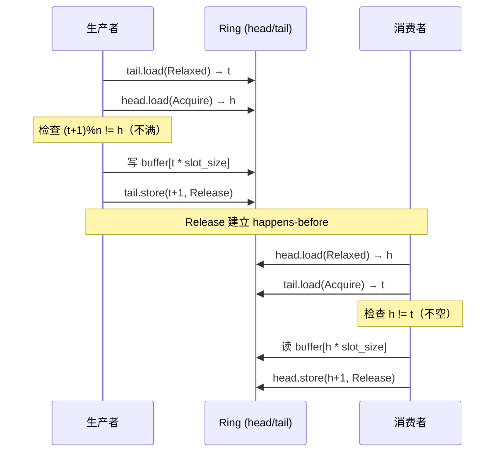
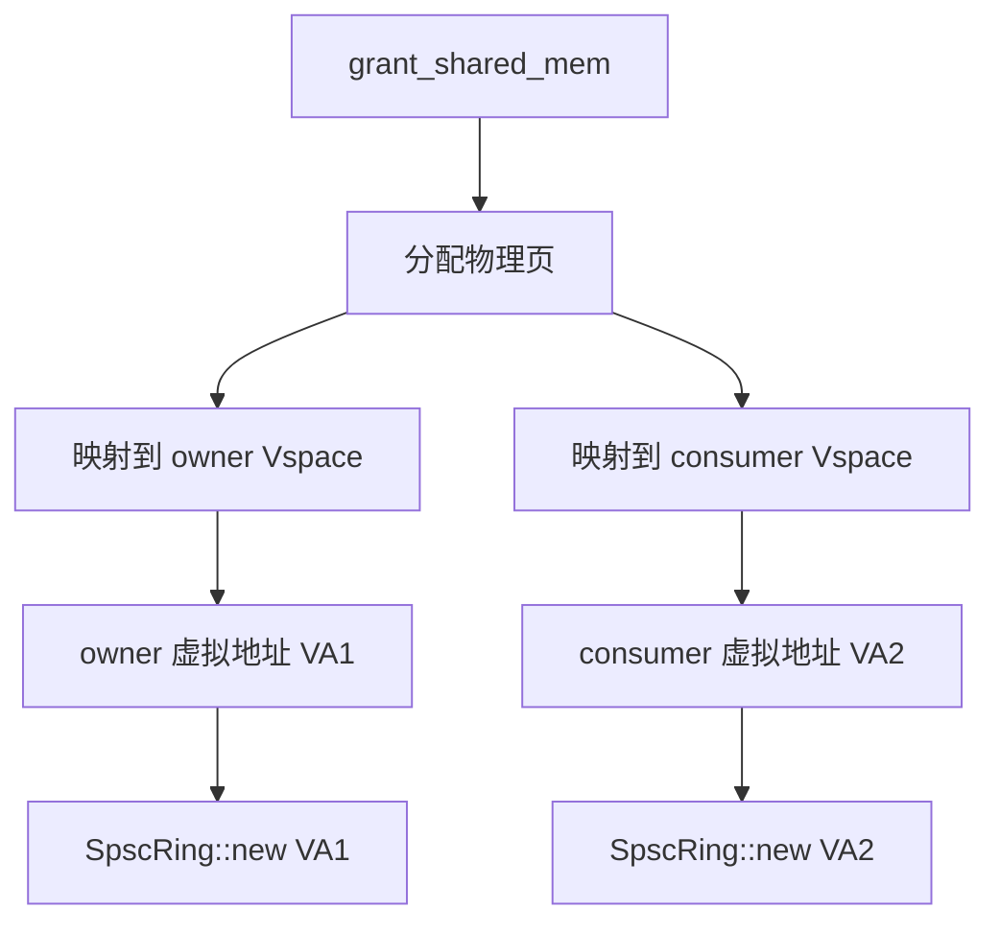

# EnerOS SPSC Ring Buffer 设计 — 无锁单生产者单消费者环形缓冲区

> **版本**：v0.21.0
> **crate**：`eneros-ipc`（`crates/kernel/ipc/src/spsc_ring.rs`）
> **蓝图依据**：`蓝图/phase0.md` §v0.21.0（P0-H）
> **最后更新**：2026-07-13

---

## 1. 架构概述

EnerOS SPSC Ring Buffer 是一个**无锁（lock-free）单生产者单消费者环形缓冲区**，用于在两个执行流之间传递定长消息而不需要任何锁。它是 v0.22.0 Control Bus 的底层命令通道，也是 Phase 0 出口验证的关键组件。

### 1.1 为什么是 SPSC 而不是 MPMC

| 拓扑 | 适用场景 | 本项目选择 |
|------|---------|-----------|
| SPSC（单生产者单消费者） | 一对一线程间通信 | ✅ Control Bus 采用 |
| MPMC（多生产者多消费者） | 多对多广播 | ❌ 复杂度高，需锁或 CAS |

**Control Bus 的拓扑**：


- Agent 平面只有一个线程向 Control Bus 推送命令（生产者）
- RTOS 平面只有一个线程从 Control Bus 拉取命令（消费者）
- 这种 1:1 拓扑天然适合 SPSC，无需 CAS 重试，性能最优

### 1.2 设计目标

| 指标 | 目标 | 说明 |
|------|------|------|
| 单次 push/pop 延迟 | < 100 ns | 原子操作 + 一次内存拷贝 |
| 吞吐率 | > 1 M ops/s | 单核无锁 |
| 无内存分配 | 运行期零 alloc | 缓冲区外部拥有 |
| ARMv8 内存模型友好 | Acquire/Release | 不使用 SeqCst（避免 DMB ISH 全屏障） |
| no_std 合规 | 仅 `core::sync::atomic` | 无堆、无锁 |

---

## 2. 数据结构

### 2.1 SpscRing 结构

```rust
pub struct SpscRing {
    pub buffer: *mut u8,           // 外部拥有的缓冲区裸指针
    pub capacity: usize,           // 缓冲区总字节大小
    pub slot_size: usize,          // 每个槽位的字节大小
    pub slot_count: usize,         // 槽位总数
    pub head: AtomicUsize,         // 消费者读位置（pop 推进）
    pub tail: AtomicUsize,         // 生产者写位置（push 推进）
}
```

| 字段 | 类型 | 访问者 | 内存序 |
|------|------|--------|--------|
| `buffer` | `*mut u8` | 双方（生产者写、消费者读） | 由 head/tail 隔离 |
| `head` | `AtomicUsize` | 消费者写、生产者读 | Relaxed（自身）/ Acquire（对端） |
| `tail` | `AtomicUsize` | 生产者写、消费者读 | Relaxed（自身）/ Acquire（对端） |

### 2.2 RingError 枚举

```rust
#[derive(Debug, Clone, Copy, PartialEq, Eq)]
pub enum RingError {
    Full,         // 环已满，无法 push
    Empty,        // 环已空，无法 pop
    InvalidSize,  // data.len() > slot_size
}
```

---

## 3. 内存序设计

### 3.1 内存序规则

SPSC Ring 的核心是无锁同步，依赖 **Acquire/Release 配对**建立 happens-before 关系：

| 操作 | 自身索引 | 对端索引 | 发布自身索引 |
|------|---------|---------|------------|
| `push`（生产者） | `tail.load(Relaxed)` | `head.load(Acquire)` | `tail.store(Release)` |
| `pop`（消费者） | `head.load(Relaxed)` | `tail.load(Acquire)` | `head.store(Release)` |



### 3.2 为什么 Acquire/Release 配对在 ARMv8 上正确

ARMv8 弱内存模型中，普通 load/store 可能被重排。Acquire/Release 在 ARMv8 上编译为：

| Rust 内存序 | ARMv8 指令 | 语义 |
|------------|-----------|------|
| `load(Acquire)` | `LDAR` | Load-Acquire，后续读写不可重排到前面 |
| `store(Release)` | `STLR` | Store-Release，前面读写不可重排到后面 |
| `load(Relaxed)` | `LDR` | 普通 load，可重排 |
| `store(Relaxed)` | `STR` | 普通 store，可重排 |

**正确性论证**：

1. 生产者写 buffer 后 `STLR tail`（Release）
2. 消费者 `LDAR tail`（Acquire）看到新 tail
3. Acquire 保证消费者看到生产者写 buffer 的结果
4. 因此消费者读 buffer 时数据已就绪

**为什么不用 SeqCst？**

- SeqCst 在 ARMv8 上插入 `DMB ISH` 全屏障，比 `LDAR/STLR` 慢 2-3 倍
- SPSC 只需要单向 happens-before，不需要全局顺序
- Acquire/Release 足够且更快

---

## 4. 满/空检测

### 4.1 预留一个空槽

SPSC Ring 使用**"预留一槽"法**区分满与空：

| 条件 | 状态 |
|------|------|
| `head == tail` | 空 |
| `(tail + 1) % slot_count == head` | 满 |

**为什么不用计数器？**

- 计数器需要额外的原子变量，且需要生产者/消费者双方都更新它
- 预留一槽法只需读写各自的 head/tail，无需共享计数器
- 代价：有效容量为 `slot_count - 1`（少一个槽）

### 4.2 容量计算

```rust
// 实际可用容量 = slot_count - 1
let effective_capacity = ring.slot_count - 1;

// 例如：slot_count = 16，slot_size = 256
// 有效容量 = 15 条命令
// 缓冲区大小 = 16 × 256 = 4096 字节
```

### 4.3 used / free 计算

```rust
pub fn used(&self) -> usize {
    let head = self.head.load(Ordering::Relaxed);
    let tail = self.tail.load(Ordering::Relaxed);
    (tail + self.slot_count - head) % self.slot_count
}

pub fn free(&self) -> usize {
    self.slot_count - 1 - self.used()
}
```

`used()` 使用 Relaxed，仅用于统计，不用于同步决策。

---

## 5. push / pop 实现

### 5.1 push 流程

```rust
pub fn push(&self, data: &[u8]) -> Result<(), RingError> {
    if data.len() > self.slot_size {
        return Err(RingError::InvalidSize);
    }

    let tail = self.tail.load(Ordering::Relaxed);       // 自身位置，Relaxed
    let next = (tail + 1) % self.slot_count;
    let head = self.head.load(Ordering::Acquire);       // 对端位置，Acquire

    if next == head {
        return Err(RingError::Full);                     // 满
    }

    // SAFETY: tail < slot_count（因取模），slot 在 head 之后（已检查）
    let slot_ptr = unsafe { self.buffer.add(tail * self.slot_size) };
    unsafe {
        core::ptr::copy_nonoverlapping(data.as_ptr(), slot_ptr, data.len());
    }

    self.tail.store(next, Ordering::Release);           // 发布，Release
    Ok(())
}
```

**关键安全条件**：

1. `tail < slot_count`（由 `(tail + 1) % slot_count` 保证）
2. `tail * slot_size < capacity`（由构造时校验 `slot_size * slot_count <= buf.len()`）
3. 该槽位不被消费者读取（`next != head` 保证生产者写在 head 之前）

### 5.2 pop 流程

```rust
pub fn pop(&self, out: &mut [u8]) -> Result<usize, RingError> {
    let head = self.head.load(Ordering::Relaxed);       // 自身位置，Relaxed
    let tail = self.tail.load(Ordering::Acquire);       // 对端位置，Acquire

    if head == tail {
        return Err(RingError::Empty);                    // 空
    }

    let len = self.slot_size.min(out.len());

    // SAFETY: head < slot_count，slot 在 tail 之前（已检查非空）
    let slot_ptr = unsafe { self.buffer.add(head * self.slot_size) };
    unsafe {
        core::ptr::copy_nonoverlapping(slot_ptr, out.as_mut_ptr(), len);
    }

    let next = (head + 1) % self.slot_count;
    self.head.store(next, Ordering::Release);           // 发布，Release
    Ok(len)
}
```

### 5.3 回绕处理

回绕通过模运算实现：

```rust
let next = (tail + 1) % self.slot_count;  // 生产者
let next = (head + 1) % self.slot_count;  // 消费者
```

当 `tail` 或 `head` 到达 `slot_count - 1` 时，下一次 +1 回绕到 0，形成环形。

---

## 6. 共享内存集成

### 6.1 SharedMemRegion

SPSC Ring 通常构建在共享内存上，以便跨核/跨分区访问：

```rust
pub struct SharedMemRegion {
    pub phys: u64,        // 物理基址
    pub size: usize,      // 区域大小
    pub owner: u32,       // 生产者线程 ID
    pub consumer: u32,    // 消费者线程 ID
}
```

### 6.2 grant_shared_mem（Phase 0 桩）

```rust
pub fn grant_shared_mem(owner: u32, consumer: u32, size: usize) -> Option<SharedMemRegion> {
    Some(SharedMemRegion {
        phys: 0x8000_0000,  // Phase 0 固定地址
        size,
        owner,
        consumer,
    })
}
```

**Phase 0 限制**：

- 返回固定物理地址 `0x8000_0000`，不真正分配
- 主机测试中 SpscRing 直接使用栈上/静态数组作为缓冲区
- 真实跨核共享需要 v0.8.0 `Vspace::map_shared` 将同一物理页映射到两个分区

### 6.3 真实共享内存的搭建（Phase 1+）



---

## 7. 线程安全

### 7.1 手动 Send + Sync

```rust
// SAFETY: SpscRing 可安全在线程间传递，因为按 SPSC 纪律使用：
// 一个线程拥有生产者侧（push），另一个拥有消费者侧（pop）
unsafe impl Send for SpscRing {}

// SAFETY: Sync 在 SPSC 契约下是 sound 的：
// 生产者与消费者访问不相交的槽（由 head/tail 隔离），
// 原子序（Acquire/Release）建立 happens-before 关系
unsafe impl Sync for SpscRing {}
```

### 7.2 外部缓冲区生命周期

```rust
pub fn new(buf: &mut [u8], slot_size: usize, slot_count: usize) -> Self {
    Self {
        buffer: buf.as_mut_ptr(),  // 存储裸指针
        capacity: buf.len(),
        ...
    }
}
```

- `SpscRing` 不拥有缓冲区，仅持有裸指针
- **调用者必须保证 `buf` 在 `SpscRing` 生命周期内有效**
- 这避免了堆分配，符合 no_std 与零运行期开销原则

### 7.3 使用纪律

| 纪律 | 说明 |
|------|------|
| 仅一个线程调用 `push` | 多线程 push 会破坏 SPSC 契约 |
| 仅一个线程调用 `pop` | 多线程 pop 会破坏 SPSC 契约 |
| `buffer` 不可在 Ring 使用期间释放 | 否则 use-after-free |
| `slot_size` 与 `slot_count` 构造后不可变 | 字段为 pub 但约定不可修改 |

---

## 8. 性能分析

### 8.1 单次 push/pop 开销

| 操作 | 指令 | 估计耗时 |
|------|------|---------|
| `tail.load(Relaxed)` | `LDR` | 1 cycle（缓存命中） |
| `head.load(Acquire)` | `LDAR` | 5-10 cycles |
| `copy_nonoverlapping` | `LDP/STP` 循环 | ~50 ns（256 字节） |
| `tail.store(Release)` | `STLR` | 5-10 cycles |
| **总计** | — | **~70-100 ns** |

### 8.2 吞吐率

- 单核理论吞吐：1 / 100 ns = **10 M ops/s**
- 实测目标：> 1 M ops/s（含函数调用开销）
- Phase 0 主机测试通过；QEMU 实测推迟到 Phase 1

### 8.3 与有锁方案的对比

| 方案 | 单次延迟 | 吞吐率 | 适用场景 |
|------|---------|--------|---------|
| Spinlock + 数组 | ~500 ns（锁竞争） | < 1 M ops/s | MPMC 通用 |
| SPSC Ring（本方案） | ~100 ns | > 1 M ops/s | 1:1 通信 |
| Crossbeam queue | ~200 ns | ~5 M ops/s | MPMC 高性能 |

---

## 9. ARMv8 弱内存模型考量

### 9.1 重排风险

ARMv8 允许以下重排（普通 load/store）：

| 原始顺序 | 允许重排？ | 风险 |
|---------|----------|------|
| store; store | ✅ | 数据未写完就更新 tail，消费者读到脏数据 |
| load; load | ✅ | 读到新 tail 但旧 buffer 数据未加载 |
| store; load | ✅ | 写数据后读 head，可能读到旧 head |

### 9.2 Acquire/Release 的屏障效果

| 操作 | 屏障效果 |
|------|---------|
| `store(Release)` | 前面的 store/load 不可重排到后面 |
| `load(Acquire)` | 后面的 store/load 不可重排到前面 |
| `load(Relaxed)` | 无屏障，仅保证原子性 |

### 9.3 关键不变量

- 生产者写 buffer 后才 `tail.store(Release)`：消费者看到新 tail 时，buffer 已就绪
- 消费者读 buffer 后才 `head.store(Release)`：生产者看到新 head 时，旧槽已释放

---

## 10. 测试策略

### 10.1 单元测试覆盖

`crates/kernel/ipc/src/spsc_ring.rs` 包含以下测试：

| 测试 | 验证点 |
|------|--------|
| `test_new_ring` | 构造后 head=tail=0，capacity/slot_size/slot_count 正确 |
| `test_push_pop_roundtrip` | push 后 pop，数据完整，used 归零 |
| `test_push_full` | push 到 `slot_count - 1` 后返回 `Full` |
| `test_pop_empty` | 空 ring pop 返回 `Empty` |
| `test_ring_wraparound` | 推到尾部后回绕，数据完整 |
| `test_used_free` | used/free 计数正确 |
| `test_push_invalid_size` | `data.len() > slot_size` 返回 `InvalidSize` |

### 10.2 压力测试（建议）

Phase 0 未实现跨线程压力测试，Phase 1 应补充：

```rust
#[test]
fn test_stress_spsc() {
    // 生产者线程：push 1_000_000 条
    // 消费者线程：pop 1_000_000 条
    // 校验：总数一致，每条数据完整
    // 目标：> 1 M ops/s
}
```

### 10.3 边界用例

| 用例 | 期望 |
|------|------|
| slot_count = 1 | effective_capacity = 0，第一次 push 即 Full |
| slot_count = 2 | effective_capacity = 1，push 1 条后满 |
| 数据恰好 = slot_size | push 成功 |
| 数据 = slot_size + 1 | push 返回 InvalidSize |
| 回绕后继续 push/pop | 数据完整，head/tail 正确回绕 |

---

## 11. 文件结构

```
crates/kernel/ipc/src/
├── spsc_ring.rs        # SpscRing 实现 + 单元测试
├── shared_mem.rs       # SharedMemRegion + grant_shared_mem（Phase 0 桩）
└── lib.rs              # 模块导出
```

---

## 12. 与其他版本的关系

| 方向 | 版本 | 关系 |
|------|------|------|
| 依赖 | v0.17.0（原子操作） | `AtomicUsize` 在多核下的可见性 |
| 同期 | v0.20.0（IPC） | 共享 `eneros-ipc` crate，复用 D2 模式 |
| 下游 | v0.22.0（Control Bus） | `CMD_RING` 使用 `SpscRing` 作为命令通道 |
| 未来 | Phase 1（用户态） | 共享内存需 `Vspace::map_shared` 支持 |
| 参考 | `docs/smp/armv8-memory-model.md` | LDAR/STLR 指令详解 |

---

## 13. 已知限制

| 限制 | 说明 | 缓解措施 |
|------|------|---------|
| 单生产者单消费者 | 多对多场景不适用 | Phase 1 引入 MPMC 队列（基于 CAS） |
| 外部缓冲区生命周期 | 调用者需保证 buf 有效 | 文档约束 + clippy lint |
| 无动态扩容 | 容量固定 | 满时返回 `RingError::Full`，由上层降级 |
| Phase 0 共享内存为桩 | 物理地址固定 | Phase 1 接入 mm 的真实映射 |
| 无跨线程压力测试 | 仅单线程测试 | Phase 1 补充 |

---

> **参考**：
> - `蓝图/phase0.md` §v0.21.0 — SPSC Ring 交付物清单
> - `crates/kernel/ipc/src/spsc_ring.rs` — 实现源码
> - `docs/smp/armv8-memory-model.md` — ARMv8 内存模型与内存序
> - `docs/kernel/control-bus-design.md` — Control Bus 如何使用 SpscRing
