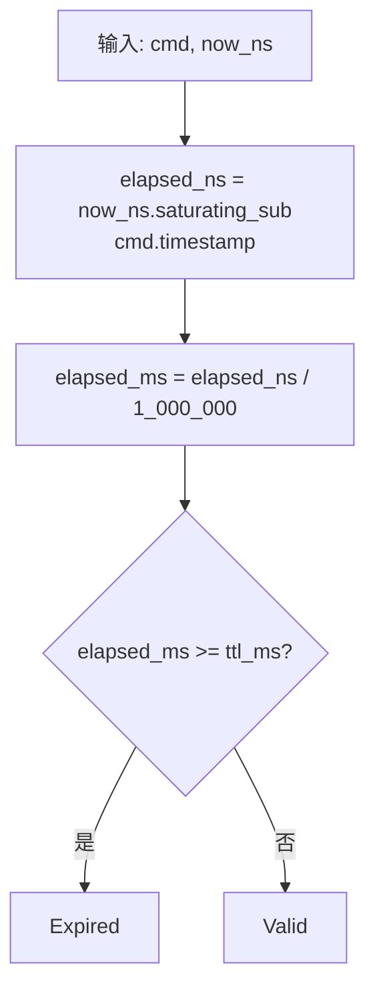
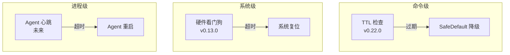
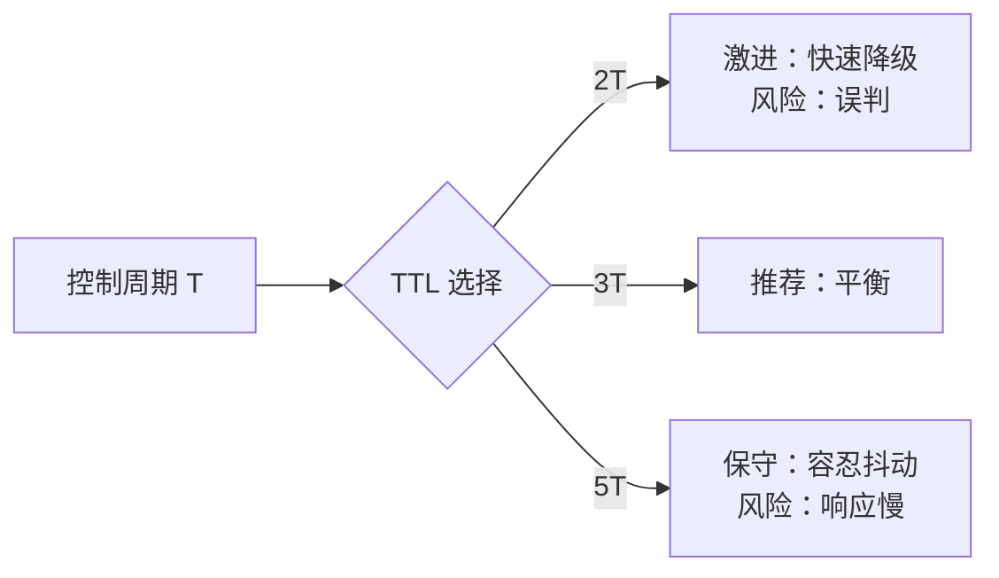

# EnerOS TTL 安全机制 — 命令级时效性保护

> **版本**：v0.22.0
> **crate**：`eneros-controlbus`（`crates/kernel/controlbus/src/ttl.rs`）
> **蓝图依据**：`蓝图/phase0.md` §v0.22.0
> **最后更新**：2026-07-13

---

## 1. 概述

EnerOS TTL（Time-To-Live）安全机制为 Control Bus 中的每条命令提供**命令级时效性保护**。当 Agent 平面崩溃或网络延迟导致命令过期时，RTOS 平面通过 TTL 检查自动拒绝旧命令，并降级到安全默认行为，避免陈旧指令控制物理设备。

### 1.1 为什么需要 TTL

| 风险场景 | 无 TTL 的后果 | TTL 的作用 |
|---------|--------------|-----------|
| Agent 崩溃 | 旧命令持续执行，设备失控 | 过期命令被拒绝，降级 SafeDefault |
| 网络延迟 | 旧设定值可能不安全 | 过期命令被拒绝 |
| 命令排队 | 队列中积压的旧命令被执行 | 入队时戳 + TTL 过滤 |
| 时钟漂移 | 命令时序混乱 | 单调时钟 + TTL 校准 |

### 1.2 TTL 与心跳的区别

| 维度 | 心跳（Heartbeat） | TTL（本机制） |
|------|------------------|--------------|
| 粒度 | 系统级/线程级 | 命令级 |
| 检测对象 | Agent 是否存活 | 单条命令是否新鲜 |
| 响应 | 全局降级 | 单命令拒绝 |
| 适用 | Agent 进程崩溃 | 命令延迟/排队/重放 |

TTL 提供更细粒度的保护：即便 Agent 存活，单条延迟过大的命令也会被拒绝。

---

## 2. TTL 算法

### 2.1 核心实现

```rust
/// TTL 检查结果
#[derive(Debug, Clone, Copy, PartialEq, Eq)]
pub enum TtlStatus {
    Valid,    // 命令在 TTL 内，可执行
    Expired,  // 命令已过期，必须拒绝
}

/// 检查命令在 `now_ns` 时刻是否仍有效
pub fn ttl_check(cmd: &ControlCommand, now_ns: u64) -> TtlStatus {
    let elapsed_ns = now_ns.saturating_sub(cmd.timestamp);  // 防下溢
    let elapsed_ms = elapsed_ns / 1_000_000;
    if elapsed_ms >= cmd.ttl_ms as u64 {
        TtlStatus::Expired
    } else {
        TtlStatus::Valid
    }
}
```

### 2.2 算法步骤



| 步骤 | 操作 | 说明 |
|------|------|------|
| 1 | `now_ns.saturating_sub(cmd.timestamp)` | 计算流逝纳秒，防下溢 |
| 2 | `elapsed_ns / 1_000_000` | 转换为毫秒 |
| 3 | `elapsed_ms >= ttl_ms` | 比较是否过期（含等号） |

### 2.3 边界语义

- `elapsed_ms == ttl_ms` → **Expired**（边界即过期）
- `elapsed_ms == ttl_ms - 1` → **Valid**（最后一毫秒仍有效）
- `ttl_ms == 0` → 任何时刻都 **Expired**（立即过期，用于特殊场景）

---

## 3. 单调时钟依赖

### 3.1 v0.12.0 单调时钟

TTL 依赖 v0.12.0 提供的 `get_monotonic_ns()`：

```rust
// v0.12.0 提供（eneros-time crate）
pub fn get_monotonic_ns() -> u64;
```

**单调时钟的关键性质**：

| 性质 | 说明 |
|------|------|
| 单调递增 | 时间戳永不回退 |
| 纳秒精度 | 足以分辨微秒级命令 |
| 不受系统时间调整影响 | NTP 校时不会影响单调时钟 |
| 基于 ARMv8 计数器 | `CNTVCT_EL0` 虚拟计数器 |

### 3.2 时钟跳变处理

`ttl_check` 使用 `saturating_sub` 处理 `now_ns < cmd.timestamp` 的情况：

| 情况 | 原因 | 处理 | 结果 |
|------|------|------|------|
| `now_ns >= timestamp` | 正常 | `elapsed = now - ts` | 正常判断 |
| `now_ns < timestamp` | 时钟跳变/测试构造 | `elapsed = 0`（saturating） | Valid |

**设计权衡**：

- 时钟回退时，命令被视为"刚发出"（Valid）
- 这避免了误判过期导致的不必要降级
- **fail-safe 倾向**：宁可延迟降级也不误降级

### 3.3 时钟源对比

| 时钟源 | 单调性 | 精度 | 适用 |
|--------|--------|------|------|
| `CNTVCT_EL0`（v0.12.0） | ✅ 单调 | ns | TTL、调度、性能计数 |
| PL031 RTC | ❌ 可被 NTP 调整 | s | 日志、日历 |
| `CNTFRQ_EL0` | — | Hz | 频率参考 |

TTL 必须使用单调时钟，不能用 RTC。

---

## 4. 与看门狗的关系

### 4.1 两层看门狗体系



### 4.2 三层保障对比

| 层次 | 机制 | 版本 | 检测对象 | 响应 |
|------|------|------|---------|------|
| 命令级 | TTL | v0.22.0 | 单条命令时效 | 拒绝该命令，降级 SafeDefault |
| 进程级 | 心跳 | 未来 | Agent 进程存活 | 重启 Agent |
| 系统级 | 硬件看门狗 | v0.13.0 | RTOS 内核存活 | 系统复位 |

**互补关系**：

- TTL 是**最快**的检测：单条命令过期立即降级（毫秒级）
- 心跳是**中速**检测：Agent 进程崩溃后秒级检测
- 硬件看门狗是**最后防线**：RTOS 自身崩溃后触发复位

### 4.3 协同工作场景

| 场景 | TTL | 心跳 | 看门狗 |
|------|-----|------|--------|
| Agent 正常 | Valid | 正常 | 喂狗 |
| Agent 卡顿 | 部分过期 | 超时 | 喂狗 |
| Agent 崩溃 | 全部过期 | 超时 | 喂狗 |
| RTOS 崩溃 | — | — | 超时复位 |

---

## 5. TTL 配置

### 5.1 默认配置

| 命令类型 | ttl_ms | 说明 |
|---------|--------|------|
| 普通控制命令 | 100 | 10 个控制周期（10ms × 10） |
| 紧急停机 | 0 | 立即过期（特殊处理，见下） |
| 高优先级命令 | 50 | 5 个周期 |
| 配置类命令 | 1000 | 100 个周期（容忍较大延迟） |

### 5.2 紧急命令的特殊处理

`ttl_ms = 0` 会导致命令立即过期，这与"紧急命令必须立即执行"矛盾。实际处理方式：

```rust
// 紧急命令的执行路径（在 execute_or_fallback 之前判断）
if cmd.action == ControlAction::Emergency {
    // 紧急命令绕过 TTL 检查，直接执行
    execute_emergency(cmd);
    return;
}
// 非紧急命令走正常 TTL 检查
let mode = execute_or_fallback(Some(cmd), now_ns);
```

**安全考量**：紧急停机命令必须立即执行，TTL 不应阻止。但紧急命令仍需通过约束检查（防止参数越界）。

### 5.3 推荐配置范围

| 控制周期 | 推荐 TTL | 理由 |
|---------|---------|------|
| 1 ms | 2-3 ms | 2-3 倍周期 |
| 10 ms | 20-30 ms | 2-3 倍周期 |
| 100 ms | 200-300 ms | 2-3 倍周期 |

**原则**：TTL = 2-3 倍控制周期，既保证新鲜度，又容忍偶尔的调度抖动。

---

## 6. 安全性分析

### 6.1 TTL 过短的风险

| 风险 | 后果 | 缓解 |
|------|------|------|
| 误判过期 | 不必要的 SafeDefault 降级 | 增大 TTL |
| 控制抖动 | 频繁切换 Normal/SafeDefault | 增大 TTL 或引入滞后 |
| 性能损失 | 降级后恢复耗时 | 平滑恢复策略 |

### 6.2 TTL 过长的风险

| 风险 | 后果 | 缓解 |
|------|------|------|
| 旧命令执行 | 设备受控于陈旧设定 | 减小 TTL |
| Agent 崩溃响应慢 | 故障扩散 | 减小 TTL 或增加心跳 |

### 6.3 推荐 TTL 选择



**EnerOS 默认选择**：3T（30 ms，对应 10ms 控制周期）。

---

## 7. 与 Fallback 的集成

### 7.1 TTL 在 Fallback 决策中的角色

```rust
pub fn execute_or_fallback(cmd: Option<&ControlCommand>, now_ns: u64) -> FallbackMode {
    match cmd {
        Some(c) => {
            if ttl_check(c, now_ns) == TtlStatus::Expired {
                FallbackMode::SafeDefault  // 新命令过期 → 降级
            } else {
                FallbackMode::Normal       // 新命令有效 → 正常执行
            }
        }
        None => {
            // 无新命令，检查 last_cmd
            if let Some(last) = get_last_cmd() {
                if ttl_check(&last, now_ns) == TtlStatus::Valid {
                    FallbackMode::WaitForCommand  // last_cmd 仍有效 → 沿用
                } else {
                    FallbackMode::SafeDefault     // last_cmd 过期 → 降级
                }
            } else {
                FallbackMode::SafeDefault         // 无 last_cmd → 降级
            }
        }
    }
}
```

### 7.2 三种 TTL 检查场景

| 场景 | cmd 输入 | TTL 检查对象 | 结果 |
|------|---------|------------|------|
| Agent 在线 | Some(c) | 当前命令 c | Normal 或 SafeDefault |
| Agent 崩溃（TTL 内） | None | last_cmd | WaitForCommand |
| Agent 崩溃（TTL 过期） | None | last_cmd | SafeDefault |

---

## 8. 测试覆盖

`ttl.rs` 包含以下单元测试：

| 测试 | 输入 | 期望 |
|------|------|------|
| `test_ttl_valid` | timestamp=1000, ttl=10ms, now=+5ms | Valid |
| `test_ttl_expired` | timestamp=1000, ttl=10ms, now=+15ms | Expired |
| `test_ttl_exactly_expired` | timestamp=1000, ttl=10ms, now=+10ms | Expired（边界） |
| `test_ttl_zero_immediate_expiry` | ttl=0, now=timestamp | Expired |
| `test_ttl_timestamp_zero` | timestamp=0, ttl=100ms, now=99.999999ms | Valid |
| `test_ttl_now_before_timestamp` | now < timestamp | Valid（saturating） |

### 8.1 边界用例详解

```rust
// 边界：elapsed_ms == ttl_ms → Expired
let cmd = ControlCommand { timestamp: 1000, ttl_ms: 10, ..Default::default() };
let now_ns = 1000 + 10_000_000;  // 恰好 10ms 后
assert_eq!(ttl_check(&cmd, now_ns), TtlStatus::Expired);

// 边界：elapsed_ms == ttl_ms - 1 → Valid
let now_ns = 1000 + 9_999_999;  // 9.999999ms 后
assert_eq!(ttl_check(&cmd, now_ns), TtlStatus::Valid);
```

---

## 9. 性能分析

### 9.1 单次 TTL 检查开销

| 操作 | 指令 | 估计耗时 |
|------|------|---------|
| `saturating_sub` | `SUB` + 条件 | 1-2 cycles |
| 除以 1_000_000 | `UDIV` | 5-10 cycles |
| 比较 | `CMP` | 1 cycle |
| **总计** | — | **< 10 ns** |

目标 < 1 μs，实际 < 10 ns，余量充足。

### 9.2 与控制周期的关系

- 控制周期：10 ms = 10,000,000 ns
- TTL 检查：< 10 ns
- 占比：0.0001%，可忽略

---

## 10. 未来扩展

### 10.1 自适应 TTL

根据网络延迟测量动态调整 TTL：

```rust
// 未来扩展（Phase 2 多机联邦）
pub fn adaptive_ttl(base_ms: u32, measured_latency_ns: u64) -> u32 {
    let measured_ms = measured_latency_ns / 1_000_000;
    // TTL = max(3 * 周期, 2 * 实测延迟)
    core::cmp::max(base_ms, (measured_ms * 2) as u32)
}
```

### 10.2 分级 TTL

不同优先级命令使用不同 TTL：

| 优先级 | TTL | 说明 |
|--------|-----|------|
| 紧急 | 0（绕过） | 立即执行 |
| 高 | 50 ms | 5 周期 |
| 普通 | 100 ms | 10 周期 |
| 低 | 500 ms | 50 周期 |

### 10.3 TTL 滑动窗口

允许命令在 TTL 内被多次消费（用于批量操作）：

```rust
pub struct ControlCommand {
    pub ttl_ms: u32,
    pub consume_count: AtomicU32,  // 已消费次数
    pub max_consume: u32,          // 最大消费次数
}
```

---

## 11. 文件结构

```
crates/kernel/controlbus/src/
├── ttl.rs               # ttl_check + TtlStatus + 单元测试
├── command.rs           # ControlCommand（含 timestamp/ttl_ms 字段）
├── fallback.rs          # execute_or_fallback（调用 ttl_check）
└── integration.rs       # 集成仿真（验证 TTL 生命周期）
```

---

## 12. 与其他版本的关系

| 方向 | 版本 | 关系 |
|------|------|------|
| 依赖 | v0.12.0（RTC/时钟） | 提供 `get_monotonic_ns()` |
| 依赖 | v0.13.0（看门狗） | 系统级看门狗与命令级 TTL 互补 |
| 同期 | v0.22.0（Control Bus） | TTL 是 Control Bus 的核心安全机制 |
| 下游 | Phase 1（设备驱动） | SafeDefault 由驱动层实现 |
| 未来 | Phase 2（多机联邦） | 自适应 TTL 基于网络延迟 |

---

## 13. 已知限制

| 限制 | 说明 | 缓解 |
|------|------|------|
| 时钟回退时命令被误判为 Valid | `saturating_sub` 导致 elapsed=0 | 单调时钟不应回退；fail-safe 倾向 |
| 紧急命令需特殊处理 | ttl_ms=0 会立即过期 | 在 execute_or_fallback 前判断 action |
| 无自适应 | TTL 固定 | Phase 2 引入自适应 TTL |
| 单时钟源 | 依赖单一单调时钟 | v0.12.0 已提供可靠单调时钟 |

---

> **参考**：
> - `蓝图/phase0.md` §v0.22.0 — TTL 安全机制交付物
> - `crates/kernel/controlbus/src/ttl.rs` — 实现源码
> - `docs/kernel/control-bus-design.md` — Control Bus 设计
> - `docs/drivers/rtc-driver-design.md` — RTC 与单调时钟
> - `docs/drivers/watchdog-design.md` — 硬件看门狗（v0.13.0）
