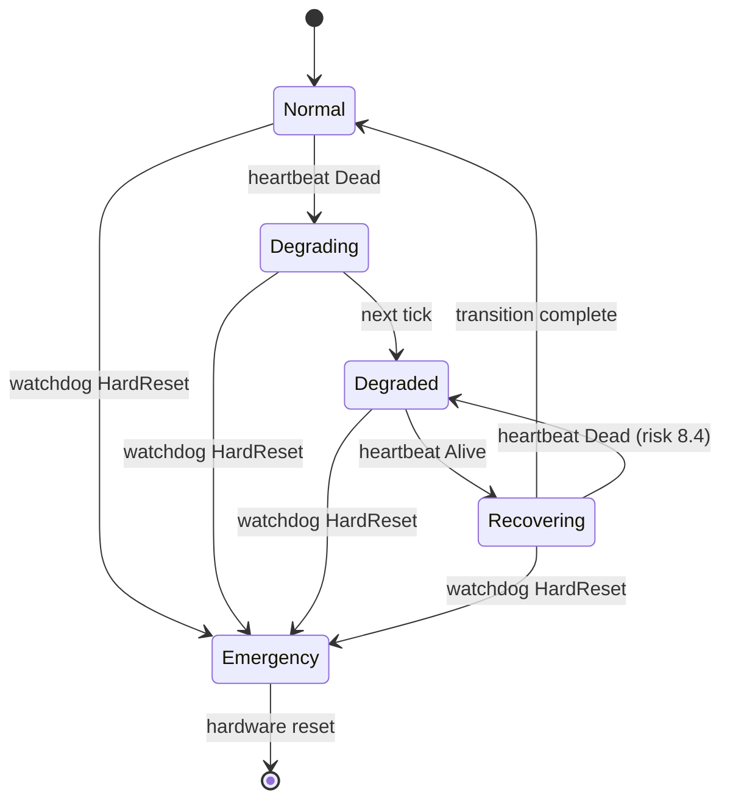
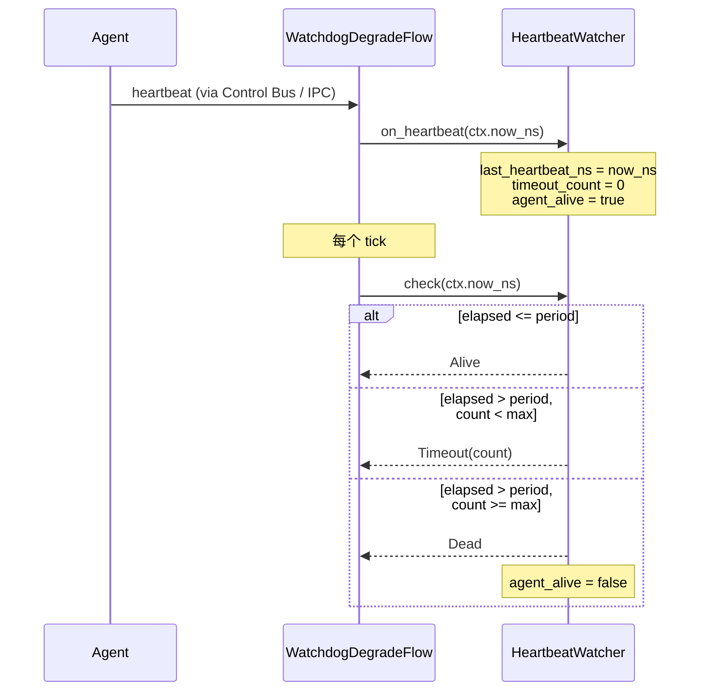
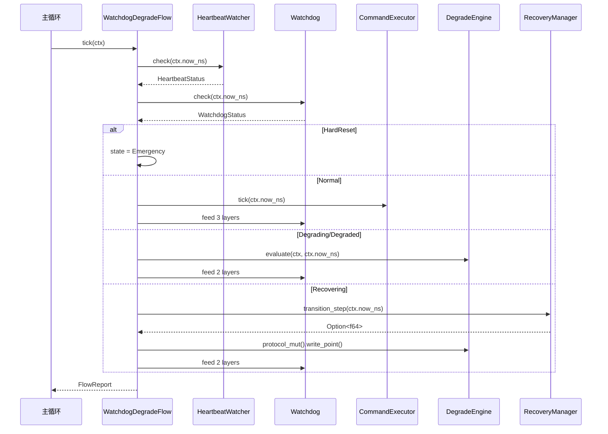

# EnerOS 看门狗与端到端降级流程设计 — 双平面安全降级收官

> **版本**：v0.58.0（P1-H RTOS 组件收官层，端到端降级编排，★ Phase 1 关键瓶颈版本）
> **crate**：`eneros-rtos-watchdog-degrade`（`crates/kernel/rtos-watchdog-degrade/`）
> **蓝图依据**：`蓝图/phase1.md` §v0.58.0
> **最后更新**：2026-07-16

---

## 1. 版本目标

### 1.1 一句话目标

实现端到端降级流程管理器 `WatchdogDegradeFlow<P, S>`，整合 v0.13.0 分层看门狗、v0.37.0 心跳监控模式、v0.56.0 命令执行器与 v0.57.0 降级规则引擎，通过 5 态状态机（Normal / Degrading / Degraded / Recovering / Emergency）编排"Agent 崩溃 → 心跳超时 → 降级切换 → RTOS 接管 → Agent 恢复 → 过渡回切"完整链路，并按状态分层喂狗，确保任何软件失效路径下储能设备最终由硬件看门狗兜底复位。

### 1.2 详细描述

v0.57.0 降级规则引擎解决了"故障信号 → 降级模式 → 安全动作"的单步评估问题，但其前提是调用方在每个控制周期注入正确的 `DegradeContext`，且自身不感知 Agent 心跳、不操作看门狗、不管理恢复过渡。这意味着"Agent 崩溃后多久触发降级""降级期间谁在喂狗""Agent 恢复后如何安全回切避免功率跳变""软件全部失效时谁兜底"四个问题尚未闭环。本版本填补这一空缺：实现一个端到端编排器，把心跳监控、命令执行、降级评估、恢复过渡与分层看门狗五件事串成一条状态机驱动的单步流水线。

编排器以"单步驱动（`tick(&mut self, ctx: &DegradeContext) -> FlowReport`）"方式由 v0.19.0 分区调度器周期性调用（典型 10ms 周期）。每个 tick 内，编排器依次：

1. 调用 `HeartbeatWatcher::check(ctx.now_ns)` 判定 Agent 心跳是否超时；
2. 调用 `Watchdog::check(ctx.now_ns)` 判定是否触发硬复位；
3. 根据心跳状态与看门狗状态，通过 `evaluate_state_transition()` 计算 5 态状态机的下一状态；
4. 在状态切换时通过 `on_state_transition()` 执行副作用（保存设定值 / 启动过渡 / 完成过渡）；
5. 按当前状态分发主体工作：Normal 调 `CommandExecutor::tick(ctx.now_ns)` 消费 Agent 命令；Degrading/Degraded 调 `DegradeEngine::evaluate(ctx, ctx.now_ns)` 由规则引擎接管；Recovering 调 `RecoveryManager::transition_step(ctx.now_ns)` 线性插值并通过 `degrade_engine.protocol_mut().write_point()` 下发；
6. 按当前状态分层喂狗：Normal 喂 kernel+runtime+agent 三层；Degrading/Degraded/Recovering 喂 kernel+runtime 两层（跳过 agent 层）；Emergency 不喂狗，等待硬件复位。

整个流程必须在调度周期（典型 10ms）内完成。编排器不持有时间源（D3：`now_ns` 由 `DegradeContext` 注入），不依赖日志系统（D4：用 `FlowStats` 计数器替代 `log_*!`），不要求 `P`/`S` 为 `Send + Sync`（D6：no_std 单线程），不自动从 Emergency 恢复（D12：硬件复位后由启动流程恢复）。

### 1.3 架构定位

| 维度 | 定位 |
|------|------|
| Phase | Phase 1 单机 MVP |
| 子系统 | P1-H RTOS 组件收官层（第五层），双平面安全降级核心 |
| 平面 | 快平面（RTOS 分区，Core 0） |
| 角色 | 快平面端到端降级编排器，整合心跳/命令/降级/恢复/看门狗 |
| 上游版本 | v0.13.0 `Watchdog`（分层喂狗复用，D1）、v0.37.0 Agent 心跳（监控算法参考，D2）、v0.56.0 `CommandExecutor`（Normal 状态命令执行，D7）、v0.57.0 `DegradeEngine`（降级评估与 `protocol_mut()`，D8/D10）、v0.50.0 `PointId`/`PointValue`、v0.51.0 `PointAccess` |
| 同层版本 | v0.54.0 ControlLoopEngine、v0.55.0 SamplingService、v0.56.0 CommandExecutor、v0.57.0 DegradeEngine（四者由本编排器统一调度） |
| 下游版本 | Phase 3 seL4 集成时，`PointAccess` 下发通道替换为 seL4 notification/endpoint；心跳信号替换为 seL4 notification |
| 后续版本 | 本版本为 P1-H RTOS 组件收官，Phase 1 后续版本（v0.59.0+）转向 Agent 平面与协议栈 |

### 1.4 设计原则关联

| 原则 | 体现 |
|------|------|
| 安全第一 | 5 态状态机任何软件失效路径最终落入 Emergency，由硬件看门狗硬复位兜底（蓝图 §9.4）；Recovering 中再次崩溃立即回 Degraded（蓝图风险 8.4） |
| 确定性 | 状态机显式枚举所有转换路径（§3）；`tick` 单步驱动，无内部循环、无阻塞 I/O；恢复过渡用线性插值，时间可预测 |
| 故障隔离 | Agent 层喂狗在降级期间被跳过，Agent 崩溃不会拖垮 runtime/kernel 层看门狗；Emergency 不喂狗，软件失效最终由硬件兜底 |
| 复用优先 | 复用 v0.13.0 `Watchdog`（D1，不新建 `WatchdogFeeder`）、v0.56.0 `CommandExecutor`/`DevicePointMap`、v0.57.0 `DegradeEngine`/`DegradeContext`（记忆文件 §5.5） |
| 可观测 | 6 个 `u64` 计数器覆盖状态切换/紧急/恢复/心跳超时/降级评估/命令执行全路径（§11） |
| no_std 合规 | 全 crate 仅使用 `core::*` / `alloc::*`，无 `std::*`（蓝图 §43.1） |

---

## 2. 架构定位

### 2.1 P1-H RTOS 组件分层（收官层）

P1-H RTOS 组件按"控制闭环 → 高频采样 → 命令执行 → 安全降级 → 端到端编排"五层层级组织，本版本位于第五层（收官层）：

| 层级 | 版本 | crate | 职责 |
|------|------|-------|------|
| 第一层（控制闭环） | v0.54.0 | `eneros-rtos-control` | 10ms 周期 PID 控制律计算，设定值跟踪 |
| 第二层（高频采样） | v0.55.0 | `eneros-rtos-sampling` | 100ms 周期设备状态采集，共享内存快照 |
| 第三层（命令执行） | v0.56.0 | `eneros-rtos-cmd-exec` | 命令消费 → TTL → 约束 → 协议下发 |
| 第四层（安全降级） | v0.57.0 | `eneros-rtos-degrade` | 故障检测 → 降级模式选择 → 安全动作下发 |
| **第五层（端到端编排）** | **v0.58.0** | **`eneros-rtos-watchdog-degrade`** | **心跳监控 → 状态机 → 分层喂狗 → 恢复过渡** |

五层关系：前四层是"可被独立调用的单步组件"，本编排器是"把前四层与看门狗串成状态机的驱动器"。前四层各自不知道彼此存在，由本编排器在 `tick` 中按状态决定调用谁。五者均以单步 `tick`/`evaluate` 方式由 v0.19.0 分区调度器驱动，同处 Core 0 快平面。

### 2.2 双平面安全降级核心

EnerOS 采用"快平面（RTOS）+ 慢平面（Agent）"双平面架构（蓝图 §9.4）。本编排器是双平面安全降级的核心纽带：

| 平面 | 角色 | 与本编排器关系 |
|------|------|--------------|
| 慢平面（Agent） | 业务决策、自然语言交互、复杂规划（L2 路径） | 通过心跳向快平面申报存活；通过 Control Bus 命令向快平面下发设定值；崩溃时由本编排器检测并降级 |
| 快平面（RTOS） | 实时控制、安全降级、看门狗兜底（L1 路径） | 本编排器运行于此；Agent 正常时执行 Agent 命令；Agent 崩溃时由规则引擎接管；全软件失效时由硬件看门狗硬复位 |

降级流的方向是"慢平面失效 → 快平面接管 → 硬件兜底"，回切流的方向是"慢平面恢复 → 快平面过渡回切 → 慢平面重新接管"。本编排器正是这两个方向的状态机驱动器。

### 2.3 与同层组件的职责边界

| 组件 | 输入 | 输出 | 与本编排器关系 |
|------|------|------|-------------|
| `ControlLoopEngine`（v0.54.0） | 反馈点 + 设定值 | PID 输出 | Normal 状态下可由其驱动控制律；本编排器不直接调用（由调度器分别驱动，本版本范围外） |
| `SamplingService`（v0.55.0） | `PointAccess::read_point` | `SharedMemorySnapshot` | 为 `DegradeContext` 提供 `battery_soc`/`temperature`/`grid_frequency` 字段来源 |
| `CommandExecutor`（v0.56.0） | `command_consume()` + `DeviceState` | `PointAccess::write_point()` | Normal 状态下由本编排器调用 `tick(ctx.now_ns)`（D7） |
| `DegradeEngine`（v0.57.0） | `DegradeContext` + 规则集 | `PointAccess::write_point()` | Degrading/Degraded 状态下由本编排器调用 `evaluate(ctx, ctx.now_ns)`（D8）；Recovering 状态下通过 `protocol_mut()` 写入插值（D10） |
| `Watchdog`（v0.13.0） | `feed_layer()` + `check()` | 硬件复位 | 由本编排器注册 3 层并按状态分层喂狗（D1） |

### 2.4 上下游依赖图

```
v0.37.0 Agent 心跳 ──► on_heartbeat() ──┐
                                        │
v0.55.0 SamplingService ──► DegradeContext ──┤
                                        │
v0.56.0 CommandExecutor ──► tick(now_ns) ──┤
                                        │      ┌──────────────────────┐
v0.57.0 DegradeEngine ──► evaluate(ctx) ──┼──► │ v0.58.0 编排器        │
                                        │      │ WatchdogDegradeFlow   │
v0.13.0 Watchdog ──► feed/check ────────┤      │  - HeartbeatWatcher   │
                                        │      │  - RecoveryManager    │
                                        └─────►│  - DegradeState 状态机 │
                                               └──────────┬───────────┘
                                                          │
v0.51.0 PointAccess ◄── write_point() ◄───────────────────┤
                                                          │
v0.13.0 硬件看门狗 ◄── hw.stop() ◄─────────────────────────┘  (Emergency 兜底)
```

### 2.5 不做的事（职责边界）

本编排器**不负责**以下职责，避免与上下游重叠：

| 不做的事 | 归属版本 | 理由 |
|---------|---------|------|
| 多 Agent 心跳监控 | v0.37.0 `HeartbeatMonitor` | 本编排器只监控单个快平面 Agent（D2）；多 Agent 场景由 v0.37.0 在上层聚合后注入 `DegradeContext.agent_alive` |
| 降级规则评估逻辑 | v0.57.0 `DegradeEngine` | 本编排器在 Degraded 状态调用 `evaluate`，不重复实现规则 |
| 命令 TTL/约束检查 | v0.56.0 `CommandExecutor` | 本编排器在 Normal 状态调用 `tick`，不重复实现命令执行 |
| 控制律计算 | v0.54.0 `ControlLoopEngine` | 本编排器不直接驱动 PID；控制律由调度器单独驱动 |
| 硬件看门狗驱动 | v0.13.0 `HwWatchdog`/SP805 | 本编排器复用 `Watchdog` 的分层喂狗，不直接操作硬件寄存器 |
| Emergency 后的启动恢复 | 启动流程 | D12：Emergency 触发硬件复位后，由启动流程重新初始化，不在本版本范围 |

---

## 3. 端到端降级状态机

### 3.1 5 态状态机总览

本编排器以 5 态状态机编排端到端降级流程。状态机显式枚举所有合法转换，任何未列出的转换均非法（保持原状态）：

| 状态 | 含义 | 主体工作 | 喂狗层数 |
|------|------|---------|---------|
| `Normal` | Agent 正常运行，快平面执行 Agent 命令 | `CommandExecutor::tick(ctx.now_ns)` | 3 层（kernel+runtime+agent） |
| `Degrading` | 心跳刚判 Dead，过渡态（保存设定值） | 无（仅一 tick） | 2 层（kernel+runtime） |
| `Degraded` | 规则引擎接管，按故障模式降级运行 | `DegradeEngine::evaluate(ctx, ctx.now_ns)` | 2 层（kernel+runtime） |
| `Recovering` | Agent 恢复，线性插值过渡回切 | `RecoveryManager::transition_step(ctx.now_ns)` + `write_point()` | 2 层（kernel+runtime） |
| `Emergency` | 看门狗硬复位触发，停止喂狗等待复位 | 无（锁定） | 0 层（不喂狗） |

### 3.2 状态转换图（Mermaid）



### 3.3 转换条件矩阵

下表列出所有合法的状态转换及其触发条件与副作用（§9 详述）：

| from \ to | Normal | Degrading | Degraded | Recovering | Emergency |
|-----------|--------|-----------|----------|------------|-----------|
| **Normal** | — | heartbeat Dead | — | — | watchdog HardReset |
| **Degrading** | — | — | next tick（无条件） | — | watchdog HardReset |
| **Degraded** | — | — | — | heartbeat Alive | watchdog HardReset |
| **Recovering** | transition complete | — | heartbeat Dead（风险 8.4） | — | watchdog HardReset |
| **Emergency** | ❌ 不可自动恢复（D12） | ❌ | ❌ | ❌ | — |

### 3.4 状态机设计要点

| 维度 | 说明 |
|------|------|
| 为什么有独立的 `Degrading` 态 | Normal→Degraded 直接转换会丢失"当前 Agent 设定值"（用于恢复过渡的 `agent_setpoint`）。引入 Degrading 态在转换瞬间保存设定值，下一 tick 再进入 Degraded，避免在同一 tick 内既保存又评估的副作用顺序问题 |
| 为什么 Recovering→Degraded 而非 Recovering→Degrading | 恢复中再次崩溃属于"恶化"，应立即回到规则引擎接管，无需再保存设定值（Degrading 态的保存动作只在 Normal→Degrading 时有意义）。对应蓝图风险 8.4 |
| 为什么 Emergency 不可自动恢复 | Emergency 意味着看门狗已决定硬复位（`hw.stop()` 已调用）。此时软件即将被复位重启，无"自动恢复"语义；复位后由启动流程重新初始化为 Normal（D12，对应蓝图风险 8.4/8.6） |
| 为什么 Normal 喂 3 层而 Degraded 喂 2 层 | Agent 层看门狗由 Agent 自己喂（通过 `on_heartbeat`）；Agent 崩溃后无法喂 agent 层，若强制喂会掩盖 Agent 失效。跳过 agent 层使 Agent 崩溃能被 kernel/runtime 层看门狗在硬超时内感知 |
| 为什么 Emergency 不喂狗 | Emergency 是"软件已放弃"的终态，停止喂狗使硬件看门狗在最短时间内触发硬复位，把系统拉回已知良好状态 |

---

## 4. DegradeState

### 4.1 枚举定义

```rust
/// 端到端降级流程状态（5 变体）。
///
/// 由 [`WatchdogDegradeFlow`](crate::flow::WatchdogDegradeFlow) 的状态机维护，
/// 描述快平面当前处于降级流程的哪个阶段。状态转换见 §3。
#[derive(Debug, Clone, Copy, PartialEq, Eq)]
pub enum DegradeState {
    /// 正常运行（Agent 控制中，快平面执行 Agent 命令）。
    Normal,
    /// 降级过渡态（心跳刚判 Dead，已保存设定值，下一 tick 进入 Degraded）。
    Degrading,
    /// 已降级（规则引擎接管，按故障模式降级运行）。
    Degraded,
    /// 恢复过渡中（Agent 恢复，线性插值从降级值过渡到 Agent 设定值）。
    Recovering,
    /// 紧急（看门狗硬复位触发，停止喂狗等待硬件复位，D12 不可自动恢复）。
    Emergency,
}
```

### 4.2 5 变体说明

| 变体 | 严重程度 | 主体工作 | 喂狗层数 | 自动恢复出口 |
|------|---------|---------|---------|-------------|
| `Normal` | 最低（正常运行） | `CommandExecutor::tick` | 3 层 | — |
| `Degrading` | 中度（过渡态，仅 1 tick） | 无（保存设定值的副作用在 `on_state_transition` 中完成） | 2 层 | → Degraded（下一 tick 无条件） |
| `Degraded` | 中高度（规则引擎接管） | `DegradeEngine::evaluate` | 2 层 | → Recovering（心跳 Alive） |
| `Recovering` | 中度（恢复过渡中） | `RecoveryManager::transition_step` + `write_point` | 2 层 | → Normal（过渡完成）/ → Degraded（再次崩溃） |
| `Emergency` | 最高（锁定，等硬复位） | 无 | 0 层 | ❌ 不可自动恢复（D12） |

### 4.3 is_degraded() 方法

```rust
impl DegradeState {
    /// 判断是否处于降级状态（非 Normal 即降级）。
    ///
    /// 用于 `WatchdogDegradeFlow` 在 tick 中决定是否跳过 agent 层喂狗：
    /// `Normal` 喂 3 层，其余降级态喂 2 层（Emergency 喂 0 层，单独处理）。
    pub fn is_degraded(&self) -> bool {
        *self != DegradeState::Normal
    }

    /// 判断是否处于紧急锁定状态（Emergency）。
    pub fn is_emergency(&self) -> bool {
        *self == DegradeState::Emergency
    }
}
```

### 4.4 设计说明

| 维度 | 说明 |
|------|------|
| 为什么不派生 `Ord` | 与 v0.57.0 `DegradeMode` 不同，本状态机的 5 态不是严格按严重程度递增的线性序（Degrading 是过渡态，Recovering 是恢复态而非恶化态），`Ord` 派生会误导。状态转换由显式 `evaluate_state_transition` 逻辑决定（§7.5） |
| 为什么 `Degrading` 不直接合并到 `Normal→Degraded` | 见 §3.4：需要在转换瞬间保存设定值，独立态使副作用顺序清晰（`on_state_transition(Normal, Degrading)` 保存 → 下一 tick `Degrading→Degraded` 无副作用） |
| 与 v0.57.0 `DegradeMode` 的区别 | `DegradeMode` 描述"降级到什么程度"（5 种安全动作），`DegradeState` 描述"降级流程进行到哪一步"（5 个流程阶段）。二者正交：Degraded 状态下 `DegradeEngine` 内部的 `current_mode` 可能是 `HoldOutput`/`StopCharge`/`SafeDefault` 之一 |

---

## 5. HeartbeatWatcher

### 5.1 设计定位（D2/D3）

`HeartbeatWatcher` 是本编排器内部的**单 Agent 心跳监控器**，用于判定 Agent 是否存活。蓝图原文建议复用 v0.37.0 `HeartbeatMonitor`，但 `HeartbeatMonitor` 是多 Agent 的（`BTreeMap<AgentId, HeartbeatState>`），且位于 `eneros-agent` crate，引入会造成重依赖（D2）。本设计在 v0.58.0 本地实现单 Agent 的 `HeartbeatWatcher`，逻辑参考 v0.37.0 的 `check()` 算法（`elapsed > period → missed_count++ → 达阈值判定 Dead`）。

所有时间相关方法追加 `now_ns: u64` 参数（D3）：no_std 无系统时钟（与 v0.56.0 D12 / v0.57.0 D5 一致），`MonotonicTime::now()` 在 no_std 不存在。

### 5.2 HeartbeatStatus 枚举

```rust
/// 心跳检查结果（3 变体）。
#[derive(Debug, Clone, Copy, PartialEq, Eq)]
pub enum HeartbeatStatus {
    /// 心跳正常（elapsed <= period，重置 timeout_count）。
    Alive,
    /// 心跳超时但未达阈值（elapsed > period，timeout_count < max_timeout）。
    /// 携带当前连续超时次数。
    Timeout(u8),
    /// 心跳死亡（连续超时次数 >= max_timeout）。
    Dead,
}
```

### 5.3 HeartbeatWatcher 结构

```rust
/// 单 Agent 心跳监控器（D2：本地实现，不复用 v0.37.0 HeartbeatMonitor）。
///
/// 追踪最后心跳时间与连续超时次数。由 `WatchdogDegradeFlow` 在每个 tick
/// 调用 [`check`](Self::check) 判定 Agent 存活状态。
///
/// 时间通过 `now_ns` 参数注入（D3：no_std 无 `MonotonicTime::now()`）。
pub struct HeartbeatWatcher {
    /// 心跳周期（纳秒）。超过此周期未收到心跳记一次超时。
    heartbeat_period_ns: u64,
    /// 最后一次收到心跳的时间戳（纳秒）。
    last_heartbeat_ns: u64,
    /// 当前连续超时次数。
    timeout_count: u8,
    /// 判定 Dead 的最大连续超时次数（默认 3，D5：通过 DegradeConfig 配置）。
    max_timeout: u8,
    /// Agent 是否存活（timeout_count >= max_timeout 时置 false）。
    agent_alive: bool,
}
```

### 5.4 字段说明

| # | 字段 | 类型 | 说明 |
|---|------|------|------|
| 1 | `heartbeat_period_ns` | `u64` | 心跳周期（纳秒）。由 `DegradeConfig::heartbeat_period_ms` 转换（`* 1_000_000`）。默认 1s |
| 2 | `last_heartbeat_ns` | `u64` | 最后心跳时间戳。`on_heartbeat` 时更新为 `now_ns` |
| 3 | `timeout_count` | `u8` | 连续超时次数。每次 `check` 发现 `elapsed > period` 时 +1；收到心跳或 `elapsed <= period` 时重置为 0 |
| 4 | `max_timeout` | `u8` | Dead 阈值。`timeout_count >= max_timeout` 时判定 Dead 并置 `agent_alive = false`。默认 3（即 3 次超时 = 3s 无心跳判崩溃） |
| 5 | `agent_alive` | `bool` | Agent 存活标志。Dead 时置 false；Alive 时置 true。供 `evaluate_state_transition` 决策 |

### 5.5 方法

```rust
impl HeartbeatWatcher {
    /// 创建心跳监控器。
    ///
    /// - `heartbeat_period_ns`：心跳周期（纳秒）
    /// - `max_timeout`：判 Dead 的连续超时次数阈值
    pub fn new(heartbeat_period_ns: u64, max_timeout: u8) -> Self {
        Self {
            heartbeat_period_ns,
            last_heartbeat_ns: 0,
            timeout_count: 0,
            max_timeout,
            agent_alive: true, // 初始假设存活，避免启动瞬间误降级
        }
    }

    /// 收到 Agent 心跳（D3：now_ns 注入）。
    ///
    /// 更新 `last_heartbeat_ns = now_ns`，重置 `timeout_count = 0`，
    /// 置 `agent_alive = true`。
    pub fn on_heartbeat(&mut self, now_ns: u64) {
        self.last_heartbeat_ns = now_ns;
        self.timeout_count = 0;
        self.agent_alive = true;
    }

    /// 检查心跳状态（D3：now_ns 注入）。
    ///
    /// - `elapsed = now_ns - last_heartbeat_ns > heartbeat_period_ns`：
    ///   `timeout_count += 1`；若 `>= max_timeout` 返回 `Dead` 并置 `agent_alive = false`，
    ///   否则返回 `Timeout(timeout_count)`。
    /// - 否则返回 `Alive`，重置 `timeout_count = 0`。
    pub fn check(&mut self, now_ns: u64) -> HeartbeatStatus {
        let elapsed = now_ns.saturating_sub(self.last_heartbeat_ns);
        if elapsed > self.heartbeat_period_ns {
            self.timeout_count = self.timeout_count.saturating_add(1);
            if self.timeout_count >= self.max_timeout {
                self.agent_alive = false;
                HeartbeatStatus::Dead
            } else {
                HeartbeatStatus::Timeout(self.timeout_count)
            }
        } else {
            self.timeout_count = 0;
            HeartbeatStatus::Alive
        }
    }

    /// 返回 Agent 是否存活（只读）。
    pub fn is_alive(&self) -> bool {
        self.agent_alive
    }
}
```

### 5.6 D2/D3 偏差说明

| 偏差 | 蓝图原文 | 本设计 | 理由 |
|------|---------|--------|------|
| **D2** | 复用 v0.37.0 `HeartbeatMonitor` | 本地实现单 Agent `HeartbeatWatcher` | `HeartbeatMonitor` 是多 Agent 的（`BTreeMap<AgentId, HeartbeatState>`）且位于 `eneros-agent` crate，引入会造成重依赖；本编排器只监控单个快平面 Agent |
| **D3** | `on_heartbeat()` / `check()` 内部调用 `MonotonicTime::now()` | 追加 `now_ns: u64` 参数 | no_std 无系统时钟（蓝图 §43.1）；与 v0.56.0 D12 / v0.57.0 D5 一致 |

### 5.7 心跳判定时序



---

## 6. RecoveryManager

### 6.1 设计定位（D10 纯状态）

`RecoveryManager` 管理从降级值到 Agent 设定值的线性插值过渡。蓝图原文让 `RecoveryManager` 持有 `protocol: Box<dyn PointAccess>` 并在内部直接读写点表，但 D6 已拒绝 `Box<dyn PointAccess>`（泛型优先），且 `WatchdogDegradeFlow` 已通过 `degrade_engine.protocol_mut()` 拥有协议访问，三处持有 `P` 会冗余。

本设计将 `RecoveryManager` 实现为**纯状态结构**（D10）：只维护过渡状态（保存的设定值、过渡起止时间、进度、降级值与目标值），不持有 protocol，不执行 I/O。`WatchdogDegradeFlow` 在 Recovering 状态调用 `recovery.transition_step(now_ns)` 获取插值结果（`Option<f64>`），再通过 `degrade_engine.protocol_mut().write_point()` 下发。

### 6.2 结构定义

```rust
/// 恢复过渡管理器（D10：纯状态，不持有 protocol，I/O 在 WatchdogDegradeFlow 中执行）。
///
/// 维护从降级值到 Agent 设定值的线性插值过渡状态。
/// 过渡曲线为线性：`out = degraded + (agent - degraded) * progress`，
/// `progress = min(1.0, elapsed / transition_duration)`。
pub struct RecoveryManager {
    /// Normal→Degrading 时保存的 Agent 设定值（用于回切目标）。
    saved_setpoint: Option<f64>,
    /// 当前过渡的起始时间戳（纳秒）。None 表示未在过渡中。
    transition_start_ns: Option<u64>,
    /// 过渡总时长（纳秒）。由 `DegradeConfig::recovery_transition_ms` 转换。
    transition_duration_ns: u64,
    /// 当前过渡进度（0.0~1.0）。>= 1.0 表示完成。
    progress: f64,
    /// 当前过渡的降级起始值（从 Degraded 状态进入 Recovering 时的当前出力）。
    degraded_setpoint: f64,
    /// 当前过渡的 Agent 目标值（来自 saved_setpoint）。
    agent_setpoint: f64,
}
```

### 6.3 字段说明

| # | 字段 | 类型 | 说明 |
|---|------|------|------|
| 1 | `saved_setpoint` | `Option<f64>` | Normal→Degrading 时保存的 Agent 设定值。`save_setpoint()` 设置；`start_transition()` 读取作为 `agent_setpoint`；`complete()` 后清空 |
| 2 | `transition_start_ns` | `Option<u64>` | 过渡起始时间。`start_transition()` 设置；`transition_step()` 用于计算 elapsed；`complete()` 后置 None |
| 3 | `transition_duration_ns` | `u64` | 过渡总时长。构造时由 `DegradeConfig::recovery_transition_ms * 1_000_000` 注入。默认 30s |
| 4 | `progress` | `f64` | 当前进度 0.0~1.0。`transition_step()` 每次更新；`is_complete()` 判定 `>= 1.0` |
| 5 | `degraded_setpoint` | `f64` | 过渡起始的降级值。`start_transition()` 设置 |
| 6 | `agent_setpoint` | `f64` | 过渡目标的 Agent 设定值。`start_transition()` 从 `saved_setpoint` 读取设置 |

### 6.4 方法

```rust
impl RecoveryManager {
    /// 创建恢复管理器。
    pub fn new(transition_duration_ns: u64) -> Self {
        Self {
            saved_setpoint: None,
            transition_start_ns: None,
            transition_duration_ns,
            progress: 0.0,
            degraded_setpoint: 0.0,
            agent_setpoint: 0.0,
        }
    }

    /// 保存降级前的 Agent 设定值（Normal→Degrading 转换时调用）。
    pub fn save_setpoint(&mut self, current_value: f64) {
        self.saved_setpoint = Some(current_value);
    }

    /// 启动过渡（Degraded→Recovering 转换时调用）。
    ///
    /// - `degraded_value`：当前降级出力（过渡起始值）
    /// - `agent_value`：Agent 恢复后的目标设定值（通常取自 `saved_setpoint`）
    /// - `now_ns`：过渡起始时间戳
    pub fn start_transition(&mut self, degraded_value: f64, agent_value: f64, now_ns: u64) {
        self.degraded_setpoint = degraded_value;
        self.agent_setpoint = agent_value;
        self.transition_start_ns = Some(now_ns);
        self.progress = 0.0;
    }

    /// 过渡步进（Recovering 状态每 tick 调用，D10：只返回插值，不执行 I/O）。
    ///
    /// 计算 `progress = min(1.0, elapsed / transition_duration)`，
    /// 返回线性插值 `degraded + (agent - degraded) * progress`。
    ///
    /// - 返回 `Some(value)`：本次步进的插值结果，由调用方下发
    /// - 返回 `None`：过渡已完成（`progress >= 1.0`），调用方应转 Normal
    pub fn transition_step(&mut self, now_ns: u64) -> Option<f64> {
        let start = match self.transition_start_ns {
            Some(s) => s,
            None => return None, // 未在过渡中
        };
        let elapsed = now_ns.saturating_sub(start);
        let mut p = if self.transition_duration_ns == 0 {
            1.0
        } else {
            elapsed as f64 / self.transition_duration_ns as f64
        };
        if p >= 1.0 {
            p = 1.0;
            self.progress = 1.0;
            return None; // 完成
        }
        self.progress = p;
        Some(self.degraded_setpoint + (self.agent_setpoint - self.degraded_setpoint) * p)
    }

    /// 过渡是否完成（progress >= 1.0）。
    pub fn is_complete(&self) -> bool {
        self.progress >= 1.0
    }

    /// 完成过渡，清理状态（Recovering→Normal 转换时调用）。
    pub fn complete(&mut self) {
        self.transition_start_ns = None;
        self.saved_setpoint = None;
        self.progress = 0.0;
    }

    /// 返回保存的设定值（用于 start_transition 时读取 agent_value）。
    pub fn saved_setpoint(&self) -> Option<f64> {
        self.saved_setpoint
    }
}
```

### 6.5 线性插值示例

假设 `degraded_setpoint = 0.0`（SafeDefault 模式下的安全值），`agent_setpoint = 50.0`（Agent 恢复后的目标功率），`transition_duration_ns = 30s`：

| elapsed | progress | 插值输出 | 说明 |
|---------|----------|---------|------|
| 0s | 0.0 | 0.0 | 过渡起点（降级值） |
| 7.5s | 0.25 | 12.5 | 25% 过渡 |
| 15s | 0.5 | 25.0 | 50% 过渡 |
| 22.5s | 0.75 | 37.5 | 75% 过渡 |
| 30s | 1.0 | None（完成） | 转入 Normal，Agent 接管 |

线性插值避免从降级值直接跳到 Agent 设定值造成的功率冲击（蓝图风险 8.2 要求从 SafeDefault 切回 Normal 需逐步过渡）。

### 6.6 D10 偏差说明

| 维度 | 蓝图原文 | 本设计 | 理由 |
|------|---------|--------|------|
| 持有 protocol | `RecoveryManager { protocol: Box<dyn PointAccess> }`，内部 `read_point`/`write_point` | 纯状态，不持有 protocol；I/O 由 `WatchdogDegradeFlow` 通过 `degrade_engine.protocol_mut()` 执行 | D6 已拒绝 `Box<dyn PointAccess>`；`WatchdogDegradeFlow` 已通过 `DegradeEngine` 拥有协议访问，三处持有 `P` 冗余；纯状态结构更易测试（无需 mock protocol 即可测插值数学） |
| v0.57.0 扩展 | — | 需新增 `DegradeEngine::protocol_mut(&mut self) -> &mut P`（外科手术式扩展 v0.57.0） | `RecoveryManager` 不持有 protocol，但 `WatchdogDegradeFlow` 需要可变协议访问以写入插值结果。原 `protocol(&self) -> &P` 只读，无法写入 |

---

## 7. WatchdogDegradeFlow

### 7.1 设计定位（D6/D11）

`WatchdogDegradeFlow` 是本版本的核心编排器，整合 `HeartbeatWatcher`、`CommandExecutor`、`DegradeEngine`、`RecoveryManager` 与 `Watchdog`，通过 5 态状态机驱动端到端降级流程。

采用泛型 `<P: PointAccess, S: DeviceStateProvider>`（D6），而非 `Box<dyn PointAccess>`：no_std 单线程无需动态分发，泛型零成本抽象更适合硬实时路径。与 v0.54.0 D6、v0.55.0 D6、v0.56.0 D6、v0.57.0 D2 一致。

单步驱动签名 `tick(&mut self, ctx: &DegradeContext) -> FlowReport`（D11）：与 v0.56.0/v0.57.0 单步驱动模式一致。`DegradeContext` 已含 `now_ns` 字段（v0.57.0 定义），无需额外时间参数，内部从 `ctx.now_ns` 取时间戳。

### 7.2 结构定义

```rust
use eneros_protocol_abstract::PointAccess;
use eneros_rtos_cmd_exec::state_provider::DeviceStateProvider;
use eneros_rtos_cmd_exec::CommandExecutor;
use eneros_rtos_degrade::{DegradeContext, DegradeEngine, DegradeReport};
use eneros_watchdog::{Watchdog, WatchdogStatus};

use crate::config::DegradeConfig;
use crate::heartbeat::{HeartbeatStatus, HeartbeatWatcher};
use crate::recovery::RecoveryManager;
use crate::state::DegradeState;
use crate::stats::{FlowReport, FlowStats};

/// 端到端降级流程编排器（泛型 `<P: PointAccess, S: DeviceStateProvider>`，D6）。
///
/// 单步 `tick(&mut self, ctx: &DegradeContext) -> FlowReport`（D11）按 5 态状态机
/// 编排心跳监控、命令执行、降级评估、恢复过渡与分层喂狗。
///
/// 泛型而非 `Box<dyn PointAccess>`（D6），避免堆分配与动态分发，
/// 与 v0.54.0/v0.55.0/v0.56.0/v0.57.0 一致。
pub struct WatchdogDegradeFlow<P: PointAccess, S: DeviceStateProvider> {
    /// 当前状态机状态。
    state: DegradeState,
    /// 单 Agent 心跳监控器（D2：本地实现）。
    heartbeat: HeartbeatWatcher,
    /// 降级规则引擎（v0.57.0 复用，D8）。
    degrade_engine: DegradeEngine<P>,
    /// 命令执行器（v0.56.0 复用，D7）。
    cmd_executor: CommandExecutor<P, S>,
    /// 恢复过渡管理器（D10：纯状态）。
    recovery: RecoveryManager,
    /// 分层看门狗（v0.13.0 复用，D1）。
    watchdog: Watchdog,
    /// 降级流程配置。
    config: DegradeConfig,
    /// 累计统计（D4：普通 u64，非 AtomicU64）。
    stats: FlowStats,
}
```

### 7.3 字段说明

| # | 字段 | 类型 | 说明 |
|---|------|------|------|
| 1 | `state` | `DegradeState` | 当前状态机状态，初始为 `Normal` |
| 2 | `heartbeat` | `HeartbeatWatcher` | 单 Agent 心跳监控器（D2）。每个 tick 调用 `check(ctx.now_ns)` |
| 3 | `degrade_engine` | `DegradeEngine<P>` | 降级规则引擎（v0.57.0 复用）。Degrading/Degraded 状态调用 `evaluate(ctx, ctx.now_ns)`（D8）；Recovering 状态通过 `protocol_mut()` 写入插值（D10） |
| 4 | `cmd_executor` | `CommandExecutor<P, S>` | 命令执行器（v0.56.0 复用）。Normal 状态调用 `tick(ctx.now_ns)`（D7） |
| 5 | `recovery` | `RecoveryManager` | 恢复过渡管理器（D10 纯状态）。Recovering 状态调用 `transition_step(ctx.now_ns)` |
| 6 | `watchdog` | `Watchdog` | 分层看门狗（v0.13.0 复用，D1）。`new` 时注册 3 层，每 tick 按状态分层喂狗 |
| 7 | `config` | `DegradeConfig` | 降级流程配置（心跳周期/超时阈值/过渡时长/看门狗硬超时/功率点 ID） |
| 8 | `stats` | `FlowStats` | 累计统计，6 个 `u64` 计数器（D4） |

### 7.4 构造函数

```rust
impl<P: PointAccess, S: DeviceStateProvider> WatchdogDegradeFlow<P, S> {
    /// 创建端到端降级流程编排器。
    ///
    /// - `degrade_engine`：降级规则引擎（v0.57.0）
    /// - `cmd_executor`：命令执行器（v0.56.0）
    /// - `watchdog`：分层看门狗（v0.13.0，D1：复用，不新建 WatchdogFeeder）
    /// - `config`：降级流程配置
    ///
    /// 初始状态为 `Normal`。在构造时向 `watchdog` 注册 3 层（kernel/runtime/agent）。
    pub fn new(
        degrade_engine: DegradeEngine<P>,
        cmd_executor: CommandExecutor<P, S>,
        mut watchdog: Watchdog,
        config: DegradeConfig,
    ) -> Self {
        // D1：复用 v0.13.0 Watchdog，注册 3 层
        // kernel 层：100ms（最快超时，内核调度异常检测）
        // runtime 层：500ms（RTOS 运行时异常检测）
        // agent 层：由 DegradeConfig.heartbeat_period_ms 决定（Agent 崩溃检测）
        let _kernel_id = watchdog.register_layer("kernel", 100);
        let _runtime_id = watchdog.register_layer("runtime", 500);
        let _agent_id = watchdog.register_layer(
            "agent",
            config.heartbeat_period_ms as u32,
        );

        let heartbeat = HeartbeatWatcher::new(
            config.heartbeat_period_ms * 1_000_000,
            config.heartbeat_timeout_count,
        );
        let recovery = RecoveryManager::new(config.recovery_transition_ms * 1_000_000);

        Self {
            state: DegradeState::Normal,
            heartbeat,
            degrade_engine,
            cmd_executor,
            recovery,
            watchdog,
            config,
            stats: FlowStats::default(),
        }
    }

    /// 返回当前状态（只读）。
    pub fn state(&self) -> DegradeState {
        self.state
    }

    /// 返回累计统计（只读引用）。
    pub fn stats(&self) -> &FlowStats {
        &self.stats
    }

    /// 收到 Agent 心跳时调用（转发给 HeartbeatWatcher）。
    pub fn on_heartbeat(&mut self, now_ns: u64) {
        self.heartbeat.on_heartbeat(now_ns);
    }
}
```

### 7.5 tick 单步驱动（D11）

```rust
impl<P: PointAccess, S: DeviceStateProvider> WatchdogDegradeFlow<P, S> {
    /// 单步驱动端到端降级流程（每个控制周期调用，D11）。
    ///
    /// 返回本次 tick 的汇总报告 [`FlowReport`]。
    pub fn tick(&mut self, ctx: &DegradeContext) -> FlowReport {
        let now_ns = ctx.now_ns;
        let mut report = FlowReport {
            state: self.state,
            state_changed: false,
            heartbeat: HeartbeatStatus::Alive,
            cmd_report: None,
            degrade_report: None,
            watchdog: WatchdogStatus::AllFed,
        };

        // 1. 心跳检查
        let hb_status = self.heartbeat.check(now_ns);
        report.heartbeat = hb_status;

        // 2. 看门狗检查（Emergency 陷阱）
        let wd_status = self.watchdog.check(now_ns);
        report.watchdog = wd_status;
        if wd_status == WatchdogStatus::HardReset {
            // D12：任意状态 → Emergency，停止喂狗
            self.transition_to(DegradeState::Emergency, now_ns, &mut report);
            self.stats.emergency_count += 1;
            return report;
        }

        // 3. 状态机转换
        let new_state = self.evaluate_state_transition(hb_status);
        if new_state != self.state {
            let from = self.state;
            self.on_state_transition(from, new_state, now_ns);
            self.state = new_state;
            report.state = new_state;
            report.state_changed = true;
            self.stats.state_transitions += 1;
        }

        // 4. 按状态分发主体工作 + 分层喂狗
        match self.state {
            DegradeState::Normal => {
                // D7：调用 cmd_executor.tick(now_ns)
                let cmd_report = self.cmd_executor.tick(now_ns);
                self.stats.cmds_executed += cmd_report.total as u64;
                report.cmd_report = Some(cmd_report);
                self.feed_layers(3, now_ns); // kernel + runtime + agent
            }
            DegradeState::Degrading => {
                // 过渡态，无主体工作，下一 tick 转 Degraded
                self.feed_layers(2, now_ns); // kernel + runtime
            }
            DegradeState::Degraded => {
                // D8：调用 degrade_engine.evaluate(ctx, now_ns)
                let degrade_report = self.degrade_engine.evaluate(ctx, now_ns);
                self.stats.degrade_evaluations += 1;
                report.degrade_report = Some(degrade_report);
                self.feed_layers(2, now_ns); // kernel + runtime
            }
            DegradeState::Recovering => {
                // D10：transition_step 返回插值，通过 protocol_mut 下发
                if let Some(value) = self.recovery.transition_step(now_ns) {
                    let _ = self
                        .degrade_engine
                        .protocol_mut()
                        .write_point(self.config.power_cmd_point, PointValue::Float(value));
                }
                if self.recovery.is_complete() {
                    // 过渡完成，转 Normal
                    self.recovery.complete();
                    self.transition_to(DegradeState::Normal, now_ns, &mut report);
                    self.stats.recovery_count += 1;
                }
                self.feed_layers(2, now_ns); // kernel + runtime
            }
            DegradeState::Emergency => {
                // D12：不喂狗，等待硬件复位
            }
        }

        // 心跳超时统计
        if matches!(hb_status, HeartbeatStatus::Dead) {
            self.stats.heartbeat_timeouts += 1;
        }

        report
    }
}
```

### 7.6 evaluate_state_transition 状态机转换逻辑

```rust
impl<P: PointAccess, S: DeviceStateProvider> WatchdogDegradeFlow<P, S> {
    /// 根据心跳状态计算下一状态（状态机核心逻辑，§3 转换矩阵）。
    ///
    /// Emergency 状态由 tick 中看门狗 HardReset 分支单独处理，本方法不返回 Emergency。
    fn evaluate_state_transition(&self, hb: HeartbeatStatus) -> DegradeState {
        match (self.state, hb) {
            // Normal → Degrading（心跳 Dead）
            (DegradeState::Normal, HeartbeatStatus::Dead) => DegradeState::Degrading,
            (DegradeState::Normal, _) => DegradeState::Normal,

            // Degrading → Degraded（下一 tick 无条件）
            (DegradeState::Degrading, _) => DegradeState::Degraded,

            // Degraded → Recovering（心跳 Alive）
            (DegradeState::Degraded, HeartbeatStatus::Alive) => DegradeState::Recovering,
            (DegradeState::Degraded, _) => DegradeState::Degraded,

            // Recovering → Degraded（恢复中再次崩溃，风险 8.4）；
            // Recovering → Normal 由 tick 中 is_complete() 分支处理，本方法保持 Recovering
            (DegradeState::Recovering, HeartbeatStatus::Dead) => DegradeState::Degraded,
            (DegradeState::Recovering, _) => DegradeState::Recovering,

            // Emergency 锁定（D12，由看门狗 HardReset 进入，本方法不处理）
            (DegradeState::Emergency, _) => DegradeState::Emergency,
        }
    }
}
```

### 7.7 on_state_transition 转换动作

```rust
impl<P: PointAccess, S: DeviceStateProvider> WatchdogDegradeFlow<P, S> {
    /// 状态转换副作用（在状态实际切换前调用）。
    ///
    /// - Normal→Degrading：保存当前 Agent 设定值（recovery.save_setpoint）
    /// - Degraded→Recovering：启动过渡（recovery.start_transition）
    /// - Recovering→Normal：完成过渡（recovery.complete，在 tick 中调用）
    /// - Recovering→Degraded：无动作（风险 8.4，立即回到规则引擎接管）
    /// - 任意→Emergency：无动作（停止喂狗，在 tick 中处理）
    fn on_state_transition(&mut self, from: DegradeState, to: DegradeState, now_ns: u64) {
        match (from, to) {
            (DegradeState::Normal, DegradeState::Degrading) => {
                // 保存当前 Agent 设定值（读取功率设定点）
                if let Ok(PointValue::Float(v)) = self
                    .degrade_engine
                    .protocol()
                    .read_point(self.config.power_setpoint_point)
                {
                    self.recovery.save_setpoint(v);
                }
            }
            (DegradeState::Degraded, DegradeState::Recovering) => {
                // 启动过渡：降级起始值 = 当前功率命令点值；目标值 = 保存的设定值
                let degraded = match self
                    .degrade_engine
                    .protocol()
                    .read_point(self.config.power_cmd_point)
                {
                    Ok(PointValue::Float(v)) => v,
                    _ => 0.0,
                };
                let agent = self.recovery.saved_setpoint().unwrap_or(degraded);
                self.recovery.start_transition(degraded, agent, now_ns);
            }
            (DegradeState::Recovering, DegradeState::Normal) => {
                // complete() 已在 tick 中调用
            }
            (DegradeState::Recovering, DegradeState::Degraded) => {
                // 风险 8.4：恢复中再次崩溃，无副作用，回到规则引擎
            }
            (_, DegradeState::Emergency) => {
                // D12：停止喂狗在 tick 中处理
            }
            _ => {}
        }
    }

    /// 内部：状态转换辅助（更新 state 与 report）。
    fn transition_to(&mut self, to: DegradeState, now_ns: u64, report: &mut FlowReport) {
        let from = self.state;
        if from != to {
            self.on_state_transition(from, to, now_ns);
            self.state = to;
            report.state = to;
            report.state_changed = true;
            self.stats.state_transitions += 1;
        }
    }
}
```

### 7.8 D6/D11 偏差说明

| 偏差 | 蓝图原文 | 本设计 | 理由 |
|------|---------|--------|------|
| **D6** | `Box<dyn PointAccess>` | 泛型 `<P: PointAccess, S: DeviceStateProvider>` | no_std 单线程无需动态分发；泛型零成本抽象更适合硬实时；与 v0.54.0~v0.57.0 一致 |
| **D11** | `tick(&mut self, context: &DegradeContext)` | `tick(&mut self, ctx: &DegradeContext) -> FlowReport` | 与 v0.56.0/v0.57.0 单步驱动模式一致；`DegradeContext` 已含 `now_ns`，无需额外参数；返回 `FlowReport` 供调用方即时监控 |

---

## 8. 分层喂狗

### 8.1 D1：复用 v0.13.0 Watchdog

蓝图原文建议新建 `WatchdogFeeder { levels: [bool; 3], watchdog: HardwareWatchdog }`，手写 3 层喂狗逻辑。但 v0.13.0 `eneros-watchdog` crate 的 `Watchdog` 已提供分层喂狗（`crates/drivers/watchdog/src/layered.rs`）：

```rust
// v0.13.0 Watchdog 已提供的 API（eneros-watchdog::layered）
wd.register_layer("kernel", 100)?;     // 注册层级，返回 LayerId
wd.feed_layer(kernel_id, now_ns);      // 喂指定层
wd.check(now_ns) -> WatchdogStatus     // 检查所有层，超时则 hw.stop() 触发硬件复位
```

`WatchdogStatus` 三态（`crates/drivers/watchdog/src/layered.rs:22-27`）：
- `AllFed`：所有层都在周期内喂过
- `LayerTimeout(LayerId)`：某层超时但未达硬超时
- `HardReset`：某层超时且超过 `hard_timeout_ms`，已调用 `hw.stop()` 触发硬复位

本设计直接复用 `Watchdog`，在 `WatchdogDegradeFlow::new` 中注册 3 层（kernel/runtime/agent），不创建并行的 `WatchdogFeeder` 结构（D1）。

### 8.2 3 层喂狗架构

| 层 | 名称 | 周期 | 职责 | 喂狗时机 |
|----|------|------|------|---------|
| kernel 层 | `"kernel"` | 100ms | 检测内核调度异常（分区调度器停止调度） | Normal/Degrading/Degraded/Recovering 状态每 tick 喂 |
| runtime 层 | `"runtime"` | 500ms | 检测 RTOS 运行时异常（编排器停止 tick） | Normal/Degrading/Degraded/Recovering 状态每 tick 喂 |
| agent 层 | `"agent"` | `heartbeat_period_ms`（默认 1s） | 检测 Agent 崩溃（Agent 停止心跳） | 仅 Normal 状态喂（由 Agent 心跳驱动） |

### 8.3 按状态分层喂狗策略

```rust
impl<P: PointAccess, S: DeviceStateProvider> WatchdogDegradeFlow<P, S> {
    /// 按状态分层喂狗（D1：复用 v0.13.0 Watchdog.feed_layer）。
    ///
    /// - `layers`：3 = kernel+runtime+agent；2 = kernel+runtime（跳过 agent）；0 = 不喂
    fn feed_layers(&mut self, layers: u8, now_ns: u64) {
        // kernel 层（LayerId(1)）
        self.watchdog.feed_layer(LayerId(1), now_ns);
        // runtime 层（LayerId(2)）
        self.watchdog.feed_layer(LayerId(2), now_ns);
        // agent 层（LayerId(3)）：仅 Normal 状态喂
        if layers >= 3 {
            self.watchdog.feed_layer(LayerId(3), now_ns);
        }
    }
}
```

| 状态 | 喂狗层数 | 喂哪些层 | 理由 |
|------|---------|---------|------|
| `Normal` | 3 层 | kernel + runtime + agent | Agent 存活，三层都健康 |
| `Degrading` | 2 层 | kernel + runtime | Agent 已判 Dead，不再喂 agent 层 |
| `Degraded` | 2 层 | kernel + runtime | 规则引擎接管，Agent 仍崩溃 |
| `Recovering` | 2 层 | kernel + runtime | 过渡中，Agent 心跳恢复但尚未完全接管（保守起见仍跳过 agent 层） |
| `Emergency` | 0 层 | 不喂狗 | D12：软件已放弃，等待硬件复位 |

### 8.4 喂狗与硬复位的关系

`Watchdog::check(now_ns)` 在每 tick 调用，其行为（`crates/drivers/watchdog/src/layered.rs:73-109`）：

| 检查结果 | `Watchdog` 行为 | 编排器行为 |
|---------|----------------|-----------|
| 所有启用层在周期内喂过 | `hw.kick()`（喂硬件看门狗） | 继续正常流程 |
| 某层超时但未达 `hard_timeout_ms` | 不 kick 硬件看门狗，返回 `LayerTimeout` | 编排器记录到 `FlowReport.watchdog`，不改变状态 |
| 某层超时且超过 `hard_timeout_ms` | `hw.stop()`（停止硬件看门狗，触发硬复位） | 返回 `HardReset`，编排器转 Emergency（D12） |

`hard_timeout_ms` 由 `DegradeConfig::watchdog_hard_timeout_ms` 配置（默认 10s），在 `Watchdog::new` 时传入。

### 8.5 为什么 Normal 喂 3 层而 Degraded 喂 2 层

| 维度 | 说明 |
|------|------|
| Agent 层的意义 | agent 层看门狗用于检测 Agent 是否在持续心跳。Agent 通过 `on_heartbeat` 间接触发快平面喂 agent 层（实际由编排器在 Normal 状态每 tick 喂） |
| 降级时跳过 agent 层 | Agent 崩溃后无法喂 agent 层。若编排器继续喂 agent 层，会掩盖 Agent 失效（agent 层看门狗永远不超时）。跳过 agent 层使 Agent 崩溃能被 kernel/runtime 层看门狗在硬超时内感知 |
| 为什么不直接让 agent 层超时触发降级 | agent 层超时是"被动等待"，而 `HeartbeatWatcher` 是"主动检测"（3 次超时即判 Dead，比硬超时 10s 更快）。二者配合：HeartbeatWatcher 快速触发降级，agent 层看门狗作为兜底（若 HeartbeatWatcher 逻辑失效，agent 层看门狗硬超时仍能复位） |
| Recovering 为什么也跳过 agent 层 | 过渡中 Agent 虽恢复心跳但尚未完全接管控制权（功率仍在插值过渡），保守起见仍跳过 agent 层。过渡完成转 Normal 后才恢复喂 agent 层 |

---

## 9. 状态转换流程

### 9.1 tick 时序图（Mermaid）



### 9.2 Normal → Degrading → Degraded 降级流程

**场景**：Agent 崩溃，心跳连续 3 次超时。

```
tick #1:  state=Normal, hb=Timeout(1)  → 保持 Normal，喂 3 层
tick #2:  state=Normal, hb=Timeout(2)  → 保持 Normal，喂 3 层
tick #3:  state=Normal, hb=Dead        → 转 Degrading
                                   on_state_transition(Normal, Degrading):
                                     recovery.save_setpoint(read_point(power_setpoint))
                                   喂 2 层
tick #4:  state=Degrading, hb=Dead     → 转 Degraded（无条件）
                                   喂 2 层
tick #5:  state=Degraded, hb=Dead      → 保持 Degraded
                                   degrade_engine.evaluate(ctx, now_ns) → SafeDefault
                                   喂 2 层
...（规则引擎持续接管）
```

### 9.3 Degraded → Recovering → Normal 回切流程

**场景**：Agent 恢复心跳，过渡 30s 回切。

```
tick #N:   state=Degraded, hb=Alive   → 转 Recovering
                                   on_state_transition(Degraded, Recovering):
                                     degraded = read_point(power_cmd)  // 当前降级出力
                                     agent = recovery.saved_setpoint() // 保存的设定值
                                     recovery.start_transition(degraded, agent, now_ns)
                                   recovery.transition_step(now_ns) → Some(0.0+Δ)
                                   protocol_mut().write_point(power_cmd, 0.0+Δ)
                                   喂 2 层
tick #N+1: state=Recovering, hb=Alive → 保持 Recovering
                                   recovery.transition_step(now_ns) → Some(0.0+2Δ)
                                   protocol_mut().write_point(power_cmd, 0.0+2Δ)
                                   喂 2 层
...（线性插值持续 30s）
tick #N+M: state=Recovering, hb=Alive → recovery.is_complete() == true
                                   recovery.complete()
                                   转 Normal
                                   recovery_count++
                                   喂 3 层（恢复 agent 层）
tick #N+M+1: state=Normal, hb=Alive   → cmd_executor.tick(now_ns)
                                   喂 3 层
```

### 9.4 Recovering → Degraded 再次崩溃（风险 8.4）

**场景**：恢复过渡中 Agent 再次崩溃。

```
tick #K:   state=Recovering, hb=Alive → 插值中
tick #K+1: state=Recovering, hb=Dead  → 转 Degraded（风险 8.4）
                                   on_state_transition(Recovering, Degraded): 无副作用
                                   degrade_engine.evaluate(ctx, now_ns) → 规则引擎重新接管
                                   喂 2 层
```

**设计要点**：恢复中再次崩溃不回到 Degrading（无需再保存设定值，`saved_setpoint` 仍有效），直接回到 Degraded 让规则引擎接管。对应蓝图风险 8.4。

### 9.5 任意 → Emergency 看门狗硬复位（D12）

**场景**：kernel 或 runtime 层看门狗硬超时（如编排器自身卡死）。

```
tick #X: 任意状态
         wd.check(now_ns) == HardReset
         → 转 Emergency
         emergency_count++
         不喂狗
         返回 FlowReport
（硬件看门狗在 wd.check 中已调用 hw.stop()，数 ms 内触发硬复位）
（系统重启，由启动流程重新初始化为 Normal）
```

**设计要点**：Emergency 是终态，不自动恢复（D12）。`hw.stop()` 已在 `Watchdog::check` 中调用（`crates/drivers/watchdog/src/layered.rs:100`），硬件看门狗停止被 kick 后会在其硬件超时内拉低复位线，触发系统硬复位。复位后由启动流程重新初始化编排器为 `Normal`，不在本版本范围。

---

## 10. 错误处理

### 10.1 FlowError 枚举

```rust
/// 降级流程错误枚举（3 变体）。
#[derive(Debug, Clone, Copy, PartialEq, Eq)]
pub enum FlowError {
    /// 点写入失败（protocol_mut().write_point 返回 Err）。
    /// 在 Recovering 状态下发插值结果时可能发生。
    PointWriteFailed,
    /// 心跳未注册（HeartbeatWatcher 未初始化就调用 check）。
    /// 理论上不会发生（new 中已初始化），保留用于防御性编程。
    HeartbeatNotRegistered,
    /// 恢复过渡未进行中（RecoveryManager.transition_start_ns 为 None 时调用 transition_step）。
    /// 理论上不会发生（仅在 Recovering 状态调用），保留用于防御性编程。
    RecoveryNotInProgress,
}
```

### 10.2 错误变体与处理策略

| 变体 | 触发场景 | 处理策略 | 统计计数器 | 是否可恢复 |
|------|---------|---------|-----------|-----------|
| `PointWriteFailed` | Recovering 状态 `protocol_mut().write_point()` 返回 `Err` | 跳过本次下发，继续过渡（下一 tick 重试） | 不单独计数（通信故障由 v0.57.0 `write_failure_count` 统计） | ✅ 通信恢复后 |
| `HeartbeatNotRegistered` | `HeartbeatWatcher` 未初始化 | 理论不发生（`new` 中初始化） | — | — |
| `RecoveryNotInProgress` | `RecoveryManager` 未启动过渡就调用 `transition_step` | `transition_step` 返回 `None`，不触发转 Normal | — | — |

### 10.3 EmergencyStop 锁定（D12）

`DegradeState::Emergency` 是看门狗硬复位场景下的终态，**不可自动恢复**（D12）。对应 v0.57.0 D11 的 `EmergencyStop` 锁定语义：

| 维度 | v0.57.0 D11 | v0.58.0 D12 |
|------|------------|------------|
| 锁定对象 | `DegradeMode::EmergencyStop`（降级模式） | `DegradeState::Emergency`（流程状态） |
| 触发方式 | 规则评估返回 EmergencyStop | `Watchdog::check` 返回 HardReset |
| 锁定表现 | `evaluate` 不自动回切，需 `force_mode()` 显式恢复 | 状态机不自动转出 Emergency，等待硬件复位 |
| 恢复方式 | 调用方 `force_mode(Normal)` | 硬件复位后由启动流程重新初始化 |
| 关系 | v0.57.0 的 EmergencyStop 是规则引擎层的紧急停机 | v0.58.0 的 Emergency 是流程层的看门狗硬复位，比 EmergencyStop 更严重（软件已放弃） |

### 10.4 风险 8.4：Recovering → Degraded 再次崩溃

蓝图风险 8.4 要求"恢复过程中若再次检测到崩溃，应立即回到降级状态"。本设计在 `evaluate_state_transition` 中实现（§7.6）：

```rust
// Recovering → Degraded（恢复中再次崩溃，风险 8.4）
(DegradeState::Recovering, HeartbeatStatus::Dead) => DegradeState::Degraded,
```

| 维度 | 说明 |
|------|------|
| 为什么立即回 Degraded 而非 Degrading | Degrading 态的副作用是保存设定值，但 `saved_setpoint` 在 Normal→Degrading 时已保存且仍有效，无需重新保存。直接回 Degraded 让规则引擎立即接管，减少响应延迟 |
| 过渡进度如何处理 | `RecoveryManager` 的 `progress` 不清零（`on_state_transition(Recovering, Degraded)` 无副作用）。下次 Degraded→Recovering 时 `start_transition` 会重置 `progress = 0.0`，从当前降级值重新过渡 |
| 是否触发告警 | `state_transitions++` 计数；频繁的 Recovering→Degraded 切换提示 Agent 不稳定，由上层监控 `FlowStats.state_transitions` 决策 |

### 10.5 不 panic 原则

编排器在任何错误路径下均不 `panic!` / `todo!` / `unimplemented!`（蓝图 §43.1 no_std 合规）。所有错误通过计数器记录或跳过：

| 场景 | 处理 | 理由 |
|------|------|------|
| Recovering 状态 `write_point` 失败 | 跳过本次下发，继续过渡 | 通信故障不应阻塞过渡流程；下一 tick 重试 |
| `read_point(power_setpoint)` 失败（Normal→Degrading 保存设定值时） | `save_setpoint` 不执行，`saved_setpoint` 保持 None | 启动过渡时 `agent_value` 取 `unwrap_or(degraded)`，过渡退化为保持降级值 |
| `read_point(power_cmd)` 失败（Degraded→Recovering 启动过渡时） | `degraded = 0.0` | 保守起始值，避免读失败导致过渡无法启动 |
| `transition_step` 在非 Recovering 状态调用 | 返回 `None` | 防御性编程，理论不发生 |
| `Watchdog::check` 返回 `LayerTimeout` | 记录到 `FlowReport.watchdog`，不改变状态 | 层超时是预警，硬复位才转 Emergency |

---

## 11. 统计与可观测

### 11.1 FlowStats 结构（D4）

```rust
/// 降级流程累计统计（6 个 u64 计数器，D4：普通 u64，非 AtomicU64）。
///
/// 单线程读写（WatchdogDegradeFlow 所在 Core 0 单线程），无并发，
/// 无需原子操作。与 v0.54.0 D8、v0.55.0 D7、v0.56.0 D7、v0.57.0 D7 一致。
#[derive(Debug, Clone, Copy, Default)]
pub struct FlowStats {
    /// 累计状态转换次数（on_state_transition 调用次数）。
    pub state_transitions: u64,
    /// 累计进入 Emergency 次数（看门狗 HardReset 触发次数）。
    pub emergency_count: u64,
    /// 累计恢复完成次数（Recovering→Normal 转换次数）。
    pub recovery_count: u64,
    /// 累计心跳超时次数（HeartbeatStatus::Dead 出现次数）。
    pub heartbeat_timeouts: u64,
    /// 累计降级评估次数（DegradeEngine::evaluate 调用次数）。
    pub degrade_evaluations: u64,
    /// 累计执行命令数（CommandExecutor::tick 处理的命令总数）。
    pub cmds_executed: u64,
}
```

### 11.2 计数器说明

| # | 计数器 | 类型 | 触发条件 | 用途 |
|---|--------|------|---------|------|
| 1 | `state_transitions` | `u64` | 每次 `on_state_transition` 执行 | 状态机活跃度监控；频繁切换提示系统不稳定 |
| 2 | `emergency_count` | `u64` | 每次 `wd.check == HardReset` | 看门狗硬复位频率监控；> 0 表示软件曾失效到需硬复位 |
| 3 | `recovery_count` | `u64` | 每次 Recovering→Normal 完成 | 恢复成功率监控；与 `heartbeat_timeouts` 比值反映 Agent 稳定性 |
| 4 | `heartbeat_timeouts` | `u64` | 每次 `HeartbeatStatus::Dead` | Agent 崩溃频率监控；持续上升触发运维告警 |
| 5 | `degrade_evaluations` | `u64` | 每次 `degrade_engine.evaluate` 调用 | 降级引擎活跃度监控；Degraded 状态持续时应单调上升 |
| 6 | `cmds_executed` | `u64` | 每次 `cmd_executor.tick` 处理的命令数累加 | Normal 状态命令吞吐监控；归零提示 Agent 停止下发命令 |

### 11.3 FlowReport 结构

```rust
/// 单次 tick 汇总报告（tick 返回值，6 字段）。
///
/// 与 FlowStats 不同，FlowReport 仅记录本次 tick 的增量，
/// 调用方可用于即时监控；累计值由 FlowStats 维护。
use eneros_rtos_cmd_exec::stats::ExecutorReport;
use eneros_rtos_degrade::DegradeReport;
use eneros_watchdog::WatchdogStatus;

use crate::heartbeat::HeartbeatStatus;
use crate::state::DegradeState;

#[derive(Debug, Clone)]
pub struct FlowReport {
    /// 本次 tick 结束时的状态。
    pub state: DegradeState,
    /// 本次 tick 是否发生状态转换。
    pub state_changed: bool,
    /// 本次心跳检查结果。
    pub heartbeat: HeartbeatStatus,
    /// 本次 cmd_executor.tick 报告（仅 Normal 状态有值）。
    pub cmd_report: Option<ExecutorReport>,
    /// 本次 degrade_engine.evaluate 报告（仅 Degraded 状态有值）。
    pub degrade_report: Option<DegradeReport>,
    /// 本次看门狗检查结果。
    pub watchdog: WatchdogStatus,
}
```

### 11.4 不使用 AtomicU64（D4）

| 维度 | 说明 |
|------|------|
| 访问模型 | `FlowStats` 仅由 `WatchdogDegradeFlow` 在 Core 0 单线程读写 |
| 读者 | 调度器 / 监控任务通过 `&self` 读取快照（`flow.stats()`），无并发写入 |
| 原子开销 | `AtomicU64` 的 `fetch_add` 在 ARM64 需 `LDXR`/`STXR` 循环，比普通 `+=` 慢 |
| 一致性 | 单线程下普通 `u64` 读写天然原子（64 位对齐访问无撕裂） |
| 一致性 | 与 v0.54.0 D8（`EngineStats` 用普通 `u64`）、v0.55.0 D7、v0.56.0 D7、v0.57.0 D7 一致 |

### 11.5 不使用日志（D4）

蓝图原文在状态转换时调用 `log_warn!("Degrade state: {:?} → {:?}", from, to)` / `log_error!("Emergency state")`，但 no_std 环境无日志系统（记忆文件 §4.3）。本设计用统计计数器 + `FlowReport` 替代日志：

| 蓝图原文 | 本设计替代 | 理由 |
|---------|-----------|------|
| `log_info!("Agent heartbeat received")` | `heartbeat.on_heartbeat(now_ns)` 重置 `timeout_count` | no_std 无 log 宏；心跳接收通过 `timeout_count=0` 隐式体现 |
| `log_warn!("Degrade state: {:?} → {:?}", from, to)` | `state_transitions++` + `FlowReport{state, state_changed}` | 计数器可量化、可聚合、可被程序读取 |
| `log_error!("Emergency state")` | `emergency_count++` + `FlowReport{watchdog: HardReset}` | 同上 |

计数器的优势：可量化、可聚合、可被程序化读取（而非仅人类阅读），更适合实时系统的自动化监控与告警。

### 11.6 与 v0.56.0/v0.57.0 统计的衔接

本编排器的统计整合了 v0.56.0 `ExecutorStats` 与 v0.57.0 `DegradeStats` 的关键信号：

| 本编排器统计信号 | 来源 | 上层监控用途 |
|--------------|------|-------------|
| `state_transitions` 频繁 | 本编排器 | 系统不稳定 → 触发运维告警 |
| `emergency_count > 0` | 本编排器 | 软件曾失效到需硬复位 → 触发安全审计 |
| `heartbeat_timeouts` 持续上升 | 本编排器 | Agent 频繁崩溃 → 触发 Agent 重启 |
| `degrade_evaluations` 持续上升 | 本编排器 | 长期处于 Degraded → 触发降级根因分析 |
| `cmds_executed` 归零 | v0.56.0 `ExecutorStats.total_executed` | Agent 停止下发命令 → 检查 Control Bus |
| `degrade_engine.stats().write_failure_count` 上升 | v0.57.0 `DegradeStats` | 通信故障率超阈值 → 触发看门狗告警 |

---

## 12. 偏差声明（D1~D12）

本设计文档相对蓝图原文（`蓝图/phase1.md` §v0.58.0）的偏差声明如下。所有偏差均出于 no_std 合规性、可测试性、与既有版本一致性或安全优先考虑。

| D# | 蓝图设计 | 实际偏差 | 决策理由 |
|----|---------|---------|---------|
| **D1** | 新建 `WatchdogFeeder { levels: [bool; 3], watchdog: HardwareWatchdog }`，手写 3 层喂狗逻辑 | 复用 v0.13.0 `eneros-watchdog` crate 的 `Watchdog`（`crates/drivers/watchdog/src/layered.rs`），在 `WatchdogDegradeFlow::new` 中注册 3 层（kernel/runtime/agent） | v0.13.0 `Watchdog` 已提供 `register_layer`/`feed_layer`/`check` 完整分层喂狗 API；不重复造轮子（记忆文件 §5.5）；避免并行的 `WatchdogFeeder` 结构造成双重喂狗逻辑 |
| **D2** | 复用 v0.37.0 `HeartbeatMonitor` | 本地实现单 Agent `HeartbeatWatcher` | `HeartbeatMonitor` 是多 Agent 的（`BTreeMap<AgentId, HeartbeatState>`）且位于 `eneros-agent` crate，引入会造成重依赖；本编排器只监控单个快平面 Agent；逻辑参考 v0.37.0 `check()` 算法 |
| **D3** | `HeartbeatWatcher::on_heartbeat()` 与 `check()` 内部调用 `MonotonicTime::now()` | 所有时间相关方法追加 `now_ns: u64` 参数 | no_std 无系统时钟（蓝图 §43.1）；与 v0.56.0 D12 / v0.57.0 D5 一致 |
| **D4** | `log_info!("Agent heartbeat received")` / `log_warn!("Degrade state: ...")` / `log_error!("Emergency state")` | `FlowStats` 累计 6 个 `u64` 计数器（`state_transitions`/`emergency_count`/`recovery_count`/`heartbeat_timeouts`/`degrade_evaluations`/`cmds_executed`） | no_std 无日志系统（记忆文件 §4.3）；计数器可量化、可聚合、可被程序化读取，优于日志；与 v0.54.0 D8、v0.55.0 D7、v0.56.0 D7、v0.57.0 D7 一致 |
| **D5** | `DegradeConfig { cmd_ttl: Duration, degrade_delay: Duration, recovery_transition: Duration, watchdog_timeout: Duration }` | `DegradeConfig { heartbeat_period_ms: u64, heartbeat_timeout_count: u8, recovery_transition_ms: u64, watchdog_hard_timeout_ms: u32, power_setpoint_point: PointId, power_cmd_point: PointId }` | 与 v0.57.0 D5 一致，使用 `u64` 毫秒/纳秒；`Duration` 在 no_std 虽可用但与既有版本时间单位不一致 |
| **D6** | `WatchdogDegradeFlow` 持有 `Box<dyn PointAccess>` | 泛型 `<P: PointAccess, S: DeviceStateProvider>` | 与 v0.57.0 D6 一致，no_std 友好用泛型；`Box<dyn>` 引入动态分发开销，泛型零成本抽象更适合硬实时；与 v0.54.0~v0.57.0 一致 |
| **D7** | `self.cmd_executor.process_commands()` | `self.cmd_executor.tick(ctx.now_ns)`（返回 `ExecutorReport`） | v0.56.0 `CommandExecutor::tick(&mut self, now_ns: u64) -> ExecutorReport`（`crates/kernel/rtos-cmd-exec/src/executor.rs:41`）；与 v0.56.0 单步驱动模式一致 |
| **D8** | `self.degrade_engine.evaluate(context)` | `self.degrade_engine.evaluate(ctx, ctx.now_ns)`（返回 `DegradeReport`） | v0.57.0 `DegradeEngine::evaluate(&mut self, ctx: &DegradeContext, now_ns: u64) -> DegradeReport`（`crates/kernel/rtos-degrade/src/engine.rs:84`）；与 v0.57.0 单步驱动模式一致 |
| **D9** | `RecoveryManager::save_last_setpoint()` 调用 `self.protocol.read_point(POWER_SETPOINT_ID)`，`transition_step()` 调用 `self.protocol.write_point(POWER_CMD_ID, ...)` | `WatchdogDegradeFlow` 通过 `degrade_engine.protocol()`/`protocol_mut()` 读写点表；`DegradeConfig` 新增 `power_setpoint_point: PointId` 与 `power_cmd_point: PointId` 字段 | `POWER_SETPOINT_ID`/`POWER_CMD_ID` 在代码库中不存在（与 v0.57.0 D9 一致）；点 ID 由调用方配置，避免硬编码 |
| **D10** | `RecoveryManager` 持有 `protocol: Box<dyn PointAccess>`，内部直接读写点表 | `RecoveryManager` 为纯状态结构（6 字段：`saved_setpoint`/`transition_start_ns`/`transition_duration_ns`/`progress`/`degraded_setpoint`/`agent_setpoint`），不持有 protocol；I/O 由 `WatchdogDegradeFlow` 通过 `degrade_engine.protocol_mut()` 执行 | D6 已拒绝 `Box<dyn PointAccess>`；`WatchdogDegradeFlow` 已通过 `DegradeEngine` 拥有协议访问，三处持有 `P` 冗余；纯状态结构更易测试。**注**：需外科手术式扩展 v0.57.0 `DegradeEngine`，新增 `protocol_mut(&mut self) -> &mut P`（`crates/kernel/rtos-degrade/src/engine.rs:212`，已实现），原 `protocol(&self) -> &P` 保留 |
| **D11** | `tick(&mut self, context: &DegradeContext)` | `tick(&mut self, ctx: &DegradeContext) -> FlowReport` | 与 v0.56.0/v0.57.0 单步驱动模式一致；`DegradeContext` 已含 `now_ns` 字段（`crates/kernel/rtos-degrade/src/context.rs:14`），无需额外参数；返回 `FlowReport` 供调用方即时监控 |
| **D12** | Emergency 状态"停止喂狗，触发硬件复位" | `DegradeState::Emergency` 对应看门狗硬复位场景；`watchdog.check(now_ns) == WatchdogStatus::HardReset` 时转 Emergency 并停止喂狗；**不自动恢复** | v0.57.0 D11 已实现 EmergencyStop 锁定（`evaluate` 不自动回切，需 `force_mode()`）；v0.58.0 的 Emergency 是流程层终态，对应蓝图风险 8.4/8.6：硬件复位后由启动流程恢复，不在本版本范围 |

### 12.1 偏差一致性说明

本版本偏差与既有版本偏差的一致性：

| 偏差 | 一致版本 | 一致点 |
|------|---------|--------|
| D1（复用既有看门狗） | v0.56.0 D4（复用 `DevicePointMap`） | 不重复造轮子（记忆文件 §5.5） |
| D2（本地轻量实现） | — | 与 v0.37.0 算法逻辑一致，但避免重依赖 |
| D3（now_ns 注入） | v0.54.0 D1、v0.55.0 D1、v0.56.0 D12、v0.57.0 D5 | no_std 下时间戳统一用 u64 参数注入 |
| D4（统计用普通 u64 + 计数器替代日志） | v0.54.0 D8、v0.55.0 D7、v0.56.0 D7、v0.57.0 D7 | 单线程 no_std 无需原子；无日志系统用计数器 |
| D5（u64 毫秒/纳秒） | v0.57.0 D5 | 与 v0.57.0 时间单位一致 |
| D6（泛型替代 `Box<dyn PointAccess>`） | v0.51.0 D2、v0.54.0 D6、v0.55.0 D6、v0.56.0 D6、v0.57.0 D2/D6 | 硬实时路径优先泛型零成本抽象 |
| D7（tick 单步驱动） | v0.56.0（`CommandExecutor::tick`） | 与 v0.56.0 单步驱动模式一致 |
| D8（evaluate 单步驱动） | v0.57.0（`DegradeEngine::evaluate`） | 与 v0.57.0 单步驱动模式一致 |
| D9（点 ID 配置化） | v0.57.0 D9 | 不硬编码不存在的常量 |
| D11（tick 返回 Report） | v0.56.0（`ExecutorReport`）、v0.57.0（`DegradeReport`） | 单步驱动返回 Report 供即时监控 |
| D12（Emergency 不可自动恢复） | v0.57.0 D11（EmergencyStop 锁定） | 安全态不可自动恢复，需人工/硬件介入 |

### 12.2 偏差与蓝图验收标准对照

| 蓝图验收项 | 本设计对应章节 | 状态 |
|-----------|--------------|------|
| 5 态状态机（Normal/Degrading/Degraded/Recovering/Emergency） | §3 状态机、§4 DegradeState、图 1 | ✅ 5 变体枚举 + 显式转换矩阵 |
| Agent 崩溃 → 心跳超时 → 降级切换 | §5 HeartbeatWatcher、§9.2 降级流程、D2/D3 | ✅ 3 次超时判 Dead → Degrading → Degraded |
| RTOS 接管（规则引擎） | §7.5 tick Degraded 分支、D8 | ✅ 调用 `degrade_engine.evaluate` |
| Agent 恢复 → 过渡回切 | §6 RecoveryManager、§9.3 回切流程、D10 | ✅ 线性插值 30s 过渡 |
| 恢复中再次崩溃回 Degraded（风险 8.4） | §7.6 状态机、§10.4、D12 | ✅ Recovering→Degraded |
| 分层喂狗（Normal 3 层 / Degraded 2 层 / Emergency 0 层） | §8 分层喂狗、D1 | ✅ 复用 v0.13.0 Watchdog |
| 看门狗硬复位兜底 | §9.5 Emergency 流程、§10.3、D12 | ✅ HardReset → Emergency → 硬件复位 |
| no_std 合规 | §1.4、D3/D4/D5/D6/D12 | ✅ 仅 core::*/alloc::* |
| 解锁 Phase 1 后续版本 | §2.1 收官层 | ✅ P1-H RTOS 组件收官 |

---

## 附录 A. 文件布局

```
crates/kernel/rtos-watchdog-degrade/
├── Cargo.toml
└── src/
    ├── lib.rs                      # 模块导出 + D1~D12 偏差声明表
    ├── error.rs                    # FlowError 枚举
    ├── state.rs                    # DegradeState 枚举 + is_degraded()/is_emergency()
    ├── config.rs                   # DegradeConfig + Default
    ├── heartbeat.rs                # HeartbeatWatcher + HeartbeatStatus
    ├── recovery.rs                 # RecoveryManager（纯状态，D10）
    ├── stats.rs                    # FlowStats + FlowReport
    ├── flow.rs                     # WatchdogDegradeFlow<P, S> 编排器主体
    │                               #  - new（注册 3 层看门狗）
    │                               #  - tick（D11 单步驱动）
    │                               #  - evaluate_state_transition（状态机）
    │                               #  - on_state_transition（转换副作用）
    │                               #  - feed_layers（分层喂狗）
    └── mock.rs                     # MockPointAccess + MockDeviceStateProvider（测试用）
```

## 附录 B. 测试计划摘要

| 测试类型 | 覆盖项 | 目标 |
|---------|--------|------|
| 单元测试 | `DegradeState::is_degraded()` / `is_emergency()` | §4 验证 |
| 单元测试 | `HeartbeatWatcher` Alive / Timeout / Dead / 恢复 | §5 验证（D2/D3） |
| 单元测试 | `RecoveryManager` 保存 / 启动 / 线性插值 / 完成 | §6 验证（D10） |
| 单元测试 | `RecoveryManager` 不持有 protocol（编译期保证） | D10 验证 |
| 单元测试 | `WatchdogDegradeFlow` Normal 执行 `cmd_executor.tick` | §7.5 / D7 验证 |
| 单元测试 | Normal → Degrading → Degraded（心跳 Dead） | §9.2 验证 |
| 单元测试 | Degraded → Recovering → Normal（心跳 Alive + 过渡完成） | §9.3 验证 |
| 单元测试 | Recovering → Degraded（恢复中再次崩溃，风险 8.4） | §10.4 验证 |
| 单元测试 | 任意 → Emergency（watchdog HardReset） | §9.5 / D12 验证 |
| 单元测试 | 喂狗层级（Normal 3 层 / Degraded 2 层 / Emergency 0 层） | §8 验证（D1） |
| 单元测试 | `FlowStats` 6 计数器累加 | §11 验证（D4） |
| 单元测试 | `DegradeConfig::default()` 默认值 | §7.4 验证（D5） |
| 集成测试 | `MockPointAccess` + `MockDeviceStateProvider` 端到端流程 | 端到端链路 |
| 回归测试 | v0.57.0 `cargo test -p eneros-rtos-degrade` 全部通过 | D10 `protocol_mut` 扩展非破坏性 |

## 附录 C. 验收标准对照

| 蓝图验收项 | 本设计对应章节 | 状态 |
|-----------|--------------|------|
| 5 态状态机 | §3、§4、图 1 | ✅ 设计支持 |
| Agent 崩溃触发降级 | §5、§9.2、D2/D3 | ✅ 3 次心跳超时判 Dead |
| RTOS 接管 | §7.5、D8 | ✅ `degrade_engine.evaluate` |
| 恢复过渡回切 | §6、§9.3、D10 | ✅ 线性插值 30s |
| 风险 8.4（恢复中再次崩溃） | §7.6、§10.4、D12 | ✅ Recovering→Degraded |
| 分层喂狗 | §8、D1 | ✅ 复用 v0.13.0 Watchdog |
| 看门狗硬复位兜底 | §9.5、§10.3、D12 | ✅ Emergency 终态 |
| no_std 合规 | §1.4、D3/D4/D5/D6/D12 | ✅ 仅 core::*/alloc::* |
| P1-H RTOS 组件收官 | §2.1 | ✅ 第五层收官 |
| 解锁 Phase 1 后续 | §2.1 | ✅ 转向 Agent 平面与协议栈 |

---

## 附录 D. 与 v0.57.0 DegradeEngine 的协作

### D.1 Normal 状态下的协作

Normal 状态下，`WatchdogDegradeFlow` 调用 `CommandExecutor::tick` 消费 Agent 命令，`DegradeEngine` 不介入：

```
[Normal 状态]
Agent → Control Bus → CommandExecutor::tick(ctx.now_ns) → write_point(setpoint)
                                                              ↑
                                                      DegradeEngine 不介入
                                                      WatchdogDegradeFlow 喂 3 层
```

### D.2 Degraded 状态下的协作

Degraded 状态下，`WatchdogDegradeFlow` 调用 `DegradeEngine::evaluate`，`CommandExecutor` 不被调用（Agent 命令链路已断）：

```
[Degraded 状态]
Agent 崩溃
       ↓
WatchdogDegradeFlow::tick → degrade_engine.evaluate(ctx, now_ns) → on_mode_change()
       ↓
write_point(0.0) 或 write_point(safe_values) 或 write_point(Bool(true))
       ↓
（CommandExecutor 此时未被调用，Agent 命令被忽略）
WatchdogDegradeFlow 喂 2 层（跳过 agent 层）
```

### D.3 Recovering 状态下的协作

Recovering 状态下，`WatchdogDegradeFlow` 通过 `degrade_engine.protocol_mut()` 写入插值结果，覆盖 `DegradeEngine` 的安全动作：

```
[Recovering 状态]
Agent 恢复心跳
       ↓
WatchdogDegradeFlow::tick → recovery.transition_step(now_ns) → Some(value)
       ↓
degrade_engine.protocol_mut().write_point(power_cmd, value)  // D10
       ↓
（DegradeEngine 不被调用 evaluate，其安全动作被插值覆盖）
WatchdogDegradeFlow 喂 2 层
```

### D.4 protocol_mut 外科手术式扩展（D10）

v0.57.0 `DegradeEngine` 原有 `protocol(&self) -> &P`（只读，`crates/kernel/rtos-degrade/src/engine.rs:205`）。为支持 v0.58.0 Recovering 状态写入插值结果，新增 `protocol_mut(&mut self) -> &mut P`（`crates/kernel/rtos-degrade/src/engine.rs:212`）：

```rust
// v0.57.0 DegradeEngine 新增（v0.58.0 D10 要求）
/// 协议访问层可变引用（v0.58.0 端到端降级流程所需）.
///
/// 供 `WatchdogDegradeFlow` 在 Recovering 状态写入过渡插值结果。
pub fn protocol_mut(&mut self) -> &mut P {
    &mut self.protocol
}
```

| 维度 | 说明 |
|------|------|
| 是否破坏性 | ❌ 非破坏性（新增方法，不修改既有方法签名） |
| 回归测试 | v0.57.0 的 16 个测试全部保持通过（`cargo test -p eneros-rtos-degrade`） |
| 设计理由 | `RecoveryManager` 为纯状态（D10），I/O 由 `WatchdogDegradeFlow` 执行，需要可变协议访问 |

---

> **参考**：
> - `蓝图/phase1.md` §v0.58.0 — 蓝图原文
> - `crates/drivers/watchdog/src/layered.rs` — v0.13.0 `Watchdog`/`WatchdogStatus`/`LayerId` 实际定义（D1 复用）
> - `crates/kernel/rtos-cmd-exec/src/executor.rs` — v0.56.0 `CommandExecutor::tick` 实际实现（D7 复用）
> - `crates/kernel/rtos-cmd-exec/src/state_provider.rs` — `DeviceStateProvider` trait 实际定义（D6 泛型约束）
> - `crates/kernel/rtos-degrade/src/engine.rs` — v0.57.0 `DegradeEngine::evaluate`/`protocol_mut` 实际实现（D8/D10 复用）
> - `crates/kernel/rtos-degrade/src/context.rs` — `DegradeContext`（含 `now_ns`）实际定义（D11）
> - `crates/kernel/rtos-degrade/src/stats.rs` — v0.57.0 `DegradeStats`/`DegradeReport`（统计风格参考）
> - `docs/kernel/degrade-engine-design.md` — v0.57.0 降级规则引擎设计（文档结构参考、偏差一致性参考）
> - `docs/kernel/cmd-executor-design.md` — v0.56.0 命令执行器设计（tick 模式参考）
> - 记忆文件 §2.3.2 — 子系统归属判定规则；§5.5 — 默认集成清单（不重复造轮子）；§4.3 — no_std 合规性；§5.4 ADR-0004 — v1.0.0 最小可商用集合
