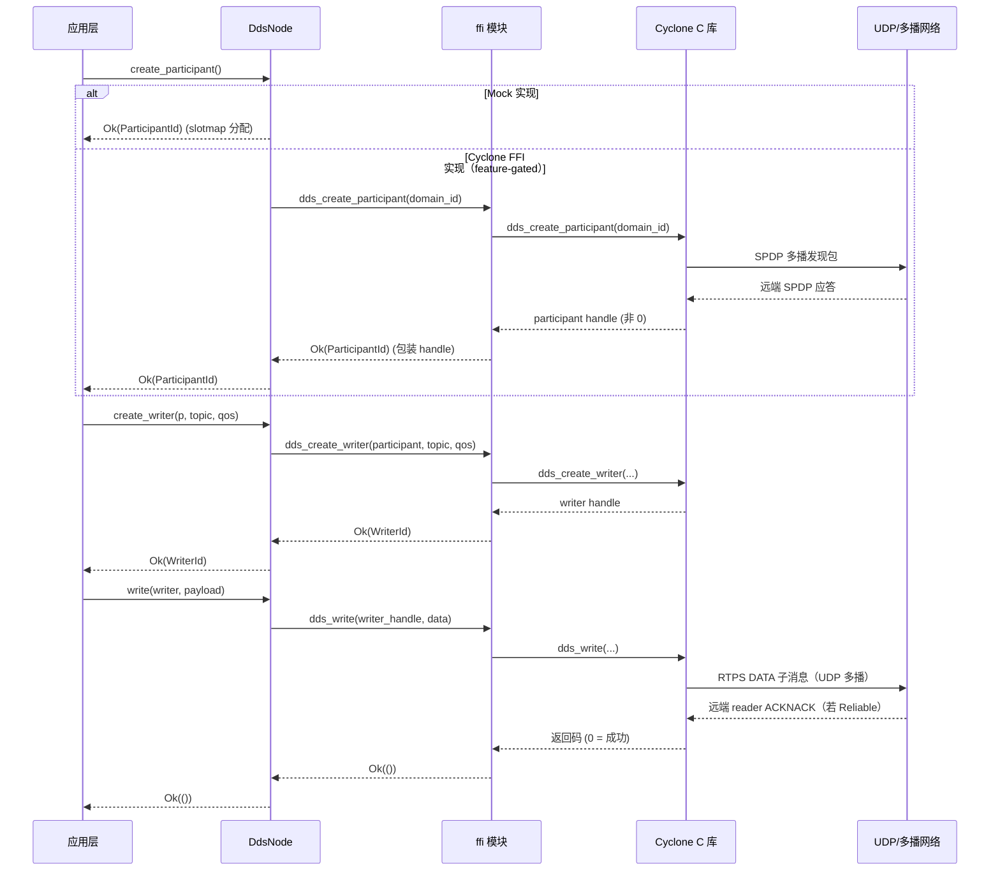
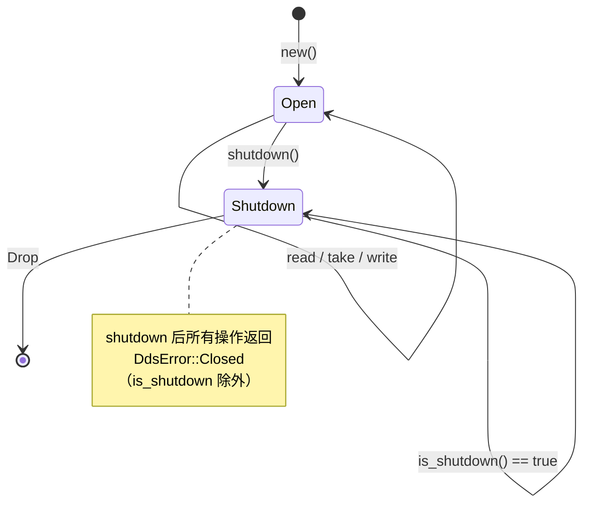
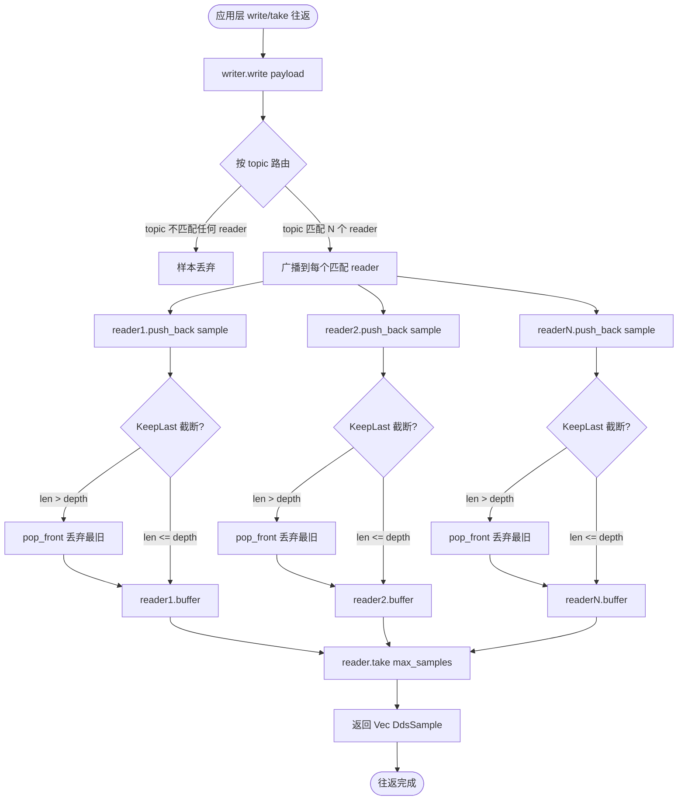

# EnerOS DDS 中间件集成设计文档（v0.75.0）

> **版本**：v0.75.0
> **阶段**：Phase 2 多机联邦 — P2-A 起点 / Agent Bus DDS 三层总线之一
> **crate**：`eneros-agent-bus-dds`（`crates/protocols/agent-bus-dds/`）
> **蓝图依据**：`蓝图/phase2.md` §v0.75.0
> **状态**：设计中
> **覆盖版本**：v0.75.0
> **最后更新**：2026-07-16

---

## 目录

1. [概述](#1-概述)
2. [背景与动机](#2-背景与动机)
3. [选型对比](#3-选型对比)
4. [架构设计](#4-架构设计)
5. [核心数据结构](#5-核心数据结构)
6. [DdsNode trait 设计](#6-ddsnode-trait-设计)
7. [MockDdsNode 实现](#7-mockddsnode-实现)
8. [CycloneDdsNode FFI 封装](#8-cycloneddsnode-ffi-封装)
9. [偏差声明 D1~D12](#9-偏差声明d1d12)
10. [测试策略](#10-测试策略)
11. [未来扩展](#11-未来扩展)
12. [参考](#12-参考)

---

## 1. 概述

### 1.1 版本目标

v0.75.0 是 **Phase 2 多机联邦的起点版本**，为 Agent Bus（DDS 发布/订阅）提供 Rust 安全抽象 `DdsNode`，解锁多 Agent 跨进程/跨设备发布订阅通信。本版本是**联邦协同的数据平面基石**，为 v0.97.0 联邦发现、v0.94.0 VPP 聚合提供通信基础。

### 1.2 一句话目标

实现 DDS 中间件的 Rust 安全抽象层——`DdsNode` trait + `MockDdsNode` 默认实现 + feature-gated `CycloneDdsNode` FFI 封装，为多 Agent 联邦协同提供发布/订阅通信平面。

### 1.3 设计目标

| 目标 | 说明 |
|------|------|
| **抽象统一** | 提供 `DdsNode` trait，统一 Mock 与真实 FFI 实现的接口契约 |
| **Mock 默认可用** | `MockDdsNode` 纯 Rust 实现，无 C 库依赖，可交叉编译 |
| **FFI feature-gated** | `CycloneDdsNode` + `ffi` 模块通过 `cyclone-dds` feature 门控，默认关闭 |
| **no_std 合规** | 全 crate `#![cfg_attr(not(test), no_std)]`，仅依赖 `alloc` + `slotmap` |
| **QoS 基础** | 提供 `QosPolicy` 简单结构体（Reliable/BestEffort + KeepLast/KeepAll） |
| **本地往返** | Mock 实现单节点发布订阅往返，支持 topic 路由、广播语义、KeepLast 截断 |
| **配置模板** | 提供 `configs/dds.toml` 配置模板（domain id、发现策略、peers） |

### 1.4 架构定位

| 维度 | 定位 |
|------|------|
| Phase | Phase 2 多机联邦 |
| 子系统 | P2-A 起点 / Agent Bus DDS 三层总线之一 |
| 平面 | 数据平面（联邦协同通信） |
| 角色 | DDS 发布/订阅中间件，Rust 安全抽象 |
| 上游版本 | 无（Phase 2 起点，不依赖 Phase 1 业务 crate） |
| 下游版本 | v0.76.0（QoS builder + Topic 注册表）、v0.77.0（路由器）、v0.94.0（VPP 聚合）、v0.97.0（联邦发现） |
| 部署形态 | 纯 Rust crate（Mock）；FFI feature 启用时链接 `libddsc.so`（Cyclone DDS C 库） |
| 集成策略 | Mock 默认 + feature-gated FFI（与 v0.59.0 llama.cpp / v0.64.0 HiGHS 一致） |

### 1.5 交付物清单

| 类型 | 交付物 | 描述 |
|------|--------|------|
| 代码 crate | `eneros-agent-bus-dds` | DDS 中间件 Rust 封装 |
| 接口 | `DdsNode` trait | 节点生命周期与资源管理统一接口 |
| 接口 | `DdsConfig` / `DiscoveryPolicy` | 节点配置与发现策略 |
| 接口 | `QosPolicy` + `Reliability`/`Durability`/`History` | 基础 QoS 策略 |
| 接口 | `DdsSample` / `InstanceHandle` | 数据样本与实例句柄 |
| 接口 | `ParticipantId` / `ReaderId` / `WriterId` | slotmap 句柄类型 |
| 接口 | `DdsError` | 8 变体错误枚举 |
| 实现 | `MockDdsNode` | 默认可用的纯 Rust 实现 |
| 实现 | `CycloneDdsNode` + `ffi` 模块 | feature-gated FFI 封装 |
| 配置 | `configs/dds.toml` | DDS 配置模板 |
| 文档 | 本设计文档 | 架构 / 偏差声明 / 测试策略 |

---

## 2. 背景与动机

### 2.1 为什么需要 DDS

EnerOS 进入 Phase 2 多机联邦阶段后，储能终端从单机自治走向跨设备协同：

- **多 Agent 跨进程通信**：v0.72~v0.74 完成了单机 MVP 的 MarketAgent / EnergyAgent / DeviceAgent，但这些 Agent 在单一进程内通过 `MvpOrchestrator` 直接持有协作。联邦阶段需要跨进程、跨设备发布订阅。
- **联邦协同的数据平面**：蓝图 §v0.75.0 引入 Agent Bus DDS 作为联邦协同的数据平面，承载 Agent 间的状态同步、命令下发、事件广播。
- **解耦生产者与消费者**：DDS 的发布/订阅模型天然解耦数据生产者与消费者，符合联邦协同的多对多通信需求。

### 2.2 数据平面基石定位

```
┌────────────────────────────────────────────────────┐
│  联邦协同业务层（v0.97.0 联邦发现 / v0.94.0 VPP）   │
├────────────────────────────────────────────────────┤
│  Agent Bus DDS（本 crate v0.75.0）                 │  ← 数据平面基石
│  DdsNode trait + MockDdsNode + CycloneDdsNode FFI  │
├────────────────────────────────────────────────────┤
│  Cyclone DDS C 库（libddsc.so，MIT 许可）          │  ← feature-gated
├────────────────────────────────────────────────────┤
│  UDP / 多播网络（smoltcp TCP/IP 栈 v0.28.0）       │
└────────────────────────────────────────────────────┘
```

### 2.3 Mock 默认 + feature-gated FFI 策略

实际部署环境（飞腾/鲲鹏 Edge Box）暂未集成 Cyclone DDS C 库。本版本采用与 v0.59.0（llama.cpp）/ v0.64.0（HiGHS）一致的策略：

- **Mock 默认可用**：`MockDdsNode` 纯 Rust 实现，不依赖任何 C 库，可交叉编译到 `aarch64-unknown-none`。
- **FFI feature-gated**：`CycloneDdsNode` + `ffi` 模块通过 `#[cfg(feature = "cyclone-dds")]` 门控，默认关闭。启用时需链接 `libddsc.so`。
- **CI 默认不启用 FFI feature**：避免在 CI 环境中引入 C 库依赖。

该策略让本版本可在 CI 中交叉编译验证，并为后续真实部署预留 FFI 通路。

---

## 3. 选型对比

### 3.1 DDS 实现方案对比

| 维度 | Cyclone DDS | Fast DDS | rustdds | ZeroMQ |
|------|-------------|----------|---------|--------|
| 实现语言 | C | C++ | Rust | C |
| 许可证 | MIT | Apache 2.0 | MIT | MPL-2.0 |
| DDS-RTPS 合规 | ✅ OMG 标准 | ✅ OMG 标准 | ✅ OMG 标准 | ❌ 非 DDS |
| no_std 友好 | ✅ C 库可 FFI | ✅ C++ 可 FFI | ❌ 依赖 std | ✅ C 库可 FFI |
| Rust 封装层 | 自研（本 crate） | 自研 | 已有但停止维护 | 自研 |
| 发布/订阅模型 | ✅ DDS Pub/Sub | ✅ DDS Pub/Sub | ✅ DDS Pub/Sub | ✅ Pub/Sub |
| QoS 策略 | ✅ 完整 RTPS QoS | ✅ 完整 RTPS QoS | ✅ 部分 | ❌ 仅 socket |
| 多播发现 | ✅ SPDP 多播 | ✅ SPDP 多播 | ✅ SPDP | ❌ 需自实现 |
| 形式化背景 | ✅ Eclipse 项目 | ✅ eProsima 项目 | ❌ 个人项目 | ✅ 成熟 |
| SBOM 许可证风险 | ✅ MIT 无风险 | ✅ Apache 无风险 | ✅ MIT 无风险 | ⚠️ MPL 需评估 |
| 默认集成清单 | ✅ §5.5 已选 | ❌ | ❌ | ❌ |

### 3.2 选型结论

**选择 Cyclone DDS** 作为底层 C 库（蓝图 §5.5 默认集成清单已决策），理由：

1. **蓝图 ADR 已决策**：§5.5 明确 `DDS 总线 → Cyclone DDS（OMG 标准，工业级实现）`，仅自研 Rust 封装层。
2. **许可证清洁**：MIT 许可证，无 SCIP 等许可证风险（蓝图 §5.5 已排除 Fast DDS 的潜在顾虑）。
3. **C 库 FFI 友好**：C ABI 稳定，`libddsc.so` 提供 `dds_create_*` / `dds_write` / `dds_read` / `dds_take` 等 C API。
4. **rustdds 不采用**：维护停滞，且依赖 `std`（非 no_std），不符合蓝图 §43.1 全项目 no_std 要求。
5. **ZeroMQ 不采用**：非 DDS 标准，无 RTPS QoS 体系，无法满足联邦发现（SPDP）与 QoS 兼容性校验需求。

### 3.3 本 crate 的 Rust 封装范围

| 层级 | 实现 | 说明 |
|------|------|------|
| Rust 安全抽象 | `DdsNode` trait | 统一 Mock 与 FFI 接口 |
| Mock 实现 | `MockDdsNode` | 纯 Rust，本地路由，验证接口契约 |
| FFI 封装 | `CycloneDdsNode` + `ffi` 模块 | feature-gated，封装 `libddsc.so` |
| 不在本 crate | DDS Topic 注册表 | v0.76.0 |
| 不在本 crate | QoS builder 模式 | v0.76.0 |
| 不在本 crate | 跨机集成测试 | 集成测试层（Cyclone DDS 启用时） |

---

## 4. 架构设计

### 4.1 三层架构

```
┌─────────────────────────────────────────────────────────┐
│  上层消费者（Agent Runtime / 联邦协同业务层）             │
├─────────────────────────────────────────────────────────┤
│  DdsNode trait（统一接口）                               │  ← 本 crate 第 1 层
│  create_participant / create_reader / create_writer     │
│  read / take / write / shutdown / is_shutdown           │
├──────────────────────┬──────────────────────────────────┤
│  MockDdsNode         │  CycloneDdsNode（feature-gated） │  ← 本 crate 第 2 层
│  （默认可用）         │  #[cfg(feature = "cyclone-dds")] │
│  纯 Rust + slotmap    │                                  │
│  BTreeMap topic 路由  │                                  │
├──────────────────────┴──────────────────────────────────┤
│  ffi 模块（feature-gated）                               │  ← 本 crate 第 3 层
│  extern "C" + unsafe + SAFETY 注释 + Drop 释放           │
├─────────────────────────────────────────────────────────┤
│  Cyclone DDS C 库（libddsc.so，MIT）                     │  ← 外部 C 库
│  dds_create_participant / dds_create_reader / ...        │
├─────────────────────────────────────────────────────────┤
│  UDP / 多播网络（smoltcp v0.28.0）                       │
└─────────────────────────────────────────────────────────┘
```

### 4.2 模块组成

| 模块 | 职责 | feature 门控 |
|------|------|-------------|
| `lib.rs` | crate 入口 + `#![cfg_attr(not(test), no_std)]` + re-export | 默认 |
| `config.rs` | `DdsConfig` / `DiscoveryPolicy` | 默认 |
| `qos.rs` | `QosPolicy` / `Reliability` / `Durability` / `History` | 默认 |
| `sample.rs` | `DdsSample` / `InstanceHandle` | 默认 |
| `error.rs` | `DdsError`（8 变体）+ `Display` + `Error` | 默认 |
| `node.rs` | `DdsNode` trait + 句柄类型 | 默认 |
| `mock.rs` | `MockDdsNode` / `MockParticipant` / `MockReader` / `MockWriter` | 默认 |
| `cyclone.rs` | `CycloneDdsNode` | `#[cfg(feature = "cyclone-dds")]` |
| `ffi.rs` | extern "C" 绑定 + unsafe 封装 | `#[cfg(feature = "cyclone-dds")]` |

### 4.3 DDS 节点创建时序图



---

## 5. 核心数据结构

### 5.1 DdsConfig 与 DiscoveryPolicy

```rust
pub struct DdsConfig {
    pub domain_id: u32,
    pub discovery: DiscoveryPolicy,
    pub interface: Option<alloc::string::String>,
}

pub enum DiscoveryPolicy {
    Multicast,
    Unicast,
    Static,
}
```

| 字段 | 类型 | 默认值 | 说明 |
|------|------|--------|------|
| `domain_id` | `u32` | `0` | DDS 域 ID（同域才能通信） |
| `discovery` | `DiscoveryPolicy` | `Multicast` | 发现策略（三态） |
| `interface` | `Option<String>` | `None` | 绑定网卡（`None` 表示自动选择） |

**默认配置场景**：

```rust
let cfg = DdsConfig::default();
// cfg.domain_id == 0
// cfg.discovery == DiscoveryPolicy::Multicast
// cfg.interface == None
```

> **D5**：简化 `DiscoveryPolicy` 为三态 enum，不嵌入 `Ipv4Addr`（no_std 无 `std::net::Ipv4Addr`，`core::net::Ipv4Addr` 在 nightly 可用但增加复杂度）。
> **D6**：移除 `multicast_addr` / `peers` 字段（Mock 不使用网络地址；真实 FFI 由 `configs/dds.toml` 解析）。

### 5.2 QosPolicy

```rust
pub struct QosPolicy {
    pub reliability: Reliability,
    pub durability: Durability,
    pub history: History,
    pub history_depth: i32,
}

pub enum Reliability { BestEffort, Reliable }
pub enum Durability { Volatile, TransientLocal }
pub enum History { KeepAll, KeepLast }
```

| 构造方法 | reliability | durability | history | history_depth |
|---------|-------------|------------|---------|---------------|
| `QosPolicy::default()` | `Reliable` | `Volatile` | `KeepLast` | `10` |
| `QosPolicy::state_default()` | `BestEffort` | `Volatile` | `KeepLast` | `1` |

- `history_depth`：`KeepLast` 时为深度；`KeepAll` 时忽略。

> **D9**：`QosPolicy` 为简单结构体（非 builder 模式）；v0.76.0 将扩展为完整 builder + Topic 注册表。

### 5.3 DdsSample 与 InstanceHandle

```rust
pub struct DdsSample {
    pub payload: alloc::vec::Vec<u8>,
    pub instance_handle: InstanceHandle,
    pub source_timestamp: u64,
}

pub type InstanceHandle = u64;
```

| 字段 | 类型 | 说明 |
|------|------|------|
| `payload` | `Vec<u8>` | 数据负载（字节序列） |
| `instance_handle` | `InstanceHandle` | 实例句柄（u64） |
| `source_timestamp` | `u64` | 发布方时间戳（ns），由 Mock 实现填充 `now_ns` |

### 5.4 句柄类型

```rust
// slotmap key 类型，new_key! 宏生成
slotmap::new_key_type! {
    pub struct ParticipantId;
    pub struct ReaderId;
    pub struct WriterId;
}
```

| 句柄 | 由 `SlotMap<_, _>` 分配 | 生命周期 |
|------|------------------------|---------|
| `ParticipantId` | `create_participant()` 返回 | 随 `MockDdsNode` 存活 |
| `ReaderId` | `create_reader()` 返回 | 随 `MockDdsNode` 存活 |
| `WriterId` | `create_writer()` 返回 | 随 `MockDdsNode` 存活 |

> **D4**：使用 `slotmap::SlotMap` 管理句柄（与蓝图一致；`slotmap` no_std 兼容，`default-features = false`）。slotmap 的 key 带版本号，可避免悬垂句柄复用。

### 5.5 DdsError

```rust
#[derive(Debug)]
pub enum DdsError {
    Ffi(i32),
    InvalidHandle,
    Closed,
    InconsistentQos(alloc::string::String),
    Serialization(alloc::string::String),
    TopicNotFound(alloc::string::String),
    ParticipantNotFound,
    Timeout,
}
```

| 变体 | 触发场景 |
|------|---------|
| `Ffi(i32)` | FFI 返回负数错误码（feature 启用时） |
| `InvalidHandle` | 传入的句柄不存在或已失效 |
| `Closed` | `shutdown()` 后再调用操作 |
| `InconsistentQos(String)` | reader/writer QoS 不兼容（真实 FFI 校验） |
| `Serialization(String)` | payload 序列化失败 |
| `TopicNotFound(String)` | topic 不存在 |
| `ParticipantNotFound` | participant 句柄无效 |
| `Timeout` | 操作超时 |

- 派生 `Debug`
- 实现 `core::fmt::Display`
- 实现 `core::error::Error`（nightly `no_std` 支持）

---

## 6. DdsNode trait 设计

### 6.1 方法签名

```rust
pub trait DdsNode {
    fn create_participant(&mut self) -> Result<ParticipantId, DdsError>;
    fn create_reader(
        &mut self,
        p: ParticipantId,
        topic: &str,
        qos: QosPolicy,
    ) -> Result<ReaderId, DdsError>;
    fn create_writer(
        &mut self,
        p: ParticipantId,
        topic: &str,
        qos: QosPolicy,
    ) -> Result<WriterId, DdsError>;
    fn read(&mut self, reader: ReaderId, max_samples: usize) -> Result<alloc::vec::Vec<DdsSample>, DdsError>;
    fn take(&mut self, reader: ReaderId, max_samples: usize) -> Result<alloc::vec::Vec<DdsSample>, DdsError>;
    fn write(&mut self, writer: WriterId, data: &[u8]) -> Result<(), DdsError>;
    fn shutdown(&mut self) -> Result<(), DdsError>;
    fn is_shutdown(&self) -> bool;
}
```

### 6.2 方法语义

| 方法 | 语义 | 错误场景 |
|------|------|---------|
| `create_participant` | 创建 DDS participant | `Closed`（shutdown 后） |
| `create_reader` | 创建订阅者（绑定 topic + QoS） | `Closed` / `ParticipantNotFound` |
| `create_writer` | 创建发布者（绑定 topic + QoS） | `Closed` / `ParticipantNotFound` |
| `read` | 读取样本（保留在 reader 缓存） | `InvalidHandle` / `Closed` |
| `take` | 取走样本（从 reader 缓存移除） | `InvalidHandle` / `Closed` |
| `write` | 写入数据 | `InvalidHandle` / `Closed` |
| `shutdown` | 关闭节点，释放资源 | 幂等（重复调用安全） |
| `is_shutdown` | 查询关闭状态 | 无（返回 `bool`） |

**`read` vs `take` 区别**：

- `read`：返回样本但**保留**在 reader 缓存中，可重复读取（peek 语义）。
- `take`：返回样本并**移除**，不重复（pop 语义）。

### 6.3 错误处理策略

- **句柄校验**：所有方法在操作前校验句柄有效性，失败返回 `DdsError::InvalidHandle`。
- **关闭校验**：除 `is_shutdown` 外，所有方法在操作前校验 `shutdown` 标志，失败返回 `DdsError::Closed`。
- **幂等 shutdown**：`shutdown()` 可重复调用，后续调用返回 `Ok(())`。
- **FFI 错误码映射**：FFI 返回负数时映射为 `DdsError::Ffi(code)`。

### 6.4 生命周期



### 6.5 设计要点

> **D2**：trait **不要求** `Send + Sync`（与 v0.59/v0.63/v0.71/v0.72 一致；`*mut c_void` 非 `Send`）。多线程访问由调用方通过 `spin::Mutex` 等同步原语保证。
>
> **D7**：合并 `DdsReader`/`DdsWriter` trait 为 `DdsNode` 统一接口（蓝图分离 reader/writer trait，但 Mock 实现单一结构体更简单；read/take/write 方法集中管理避免句柄跨结构体同步）。
>
> **D8**：`create_reader`/`create_writer` 接受 `&str` topic（no_std 兼容；FFI 实现内部用 `alloc::ffi::CString` 转换）。

---

## 7. MockDdsNode 实现

### 7.1 结构定义

```rust
pub struct MockDdsNode {
    config: DdsConfig,
    participants: SlotMap<ParticipantId, MockParticipant>,
    shutdown: bool,
    now_ns: u64,
}

struct MockParticipant {
    readers: SlotMap<ReaderId, MockReader>,
    writers: SlotMap<WriterId, MockWriter>,
}

struct MockReader {
    topic: alloc::string::String,
    qos: QosPolicy,
    buffer: alloc::collections::VecDeque<DdsSample>,
}

struct MockWriter {
    topic: alloc::string::String,
    qos: QosPolicy,
}
```

### 7.2 消息路由机制

> **D10**：Mock 内部用 `alloc::collections::BTreeMap` 按 topic 路由消息。

**路由流程**：

1. `writer.write(payload)` 时，将 `(topic, payload)` 注入一个 `MockDdsNode` 内的 topic → samples 路由表。
2. `reader.take(max)` 时，从该 reader 订阅的 topic 对应的 buffer 中取出 `min(max, len)` 条样本。
3. 同一 topic 可有多个 reader（广播语义），每个 reader 维护独立 buffer。

**广播语义**：当 `write` 被调用时，遍历所有 reader，对每个 topic 匹配的 reader 推入一份样本副本（`payload.clone()`）。

### 7.3 KeepLast 截断

> **D11**：Mock 支持 `set_now_ns(now_ns)` 注入时间戳（避免 `SystemTime::now()`，no_std 兼容）。

**截断规则**：

- 当 reader 的 QoS `history = KeepLast(depth)` 时，每次推入新样本后，若 buffer 长度超过 `depth`，丢弃最旧样本（FIFO）。
- 当 `history = KeepAll` 时，不截断（`history_depth` 字段忽略）。

```rust
fn push_sample(&mut self, sample: DdsSample) {
    self.buffer.push_back(sample);
    if self.qos.history == History::KeepLast {
        while self.buffer.len() as i32 > self.qos.history_depth {
            self.buffer.pop_front();
        }
    }
}
```

### 7.4 时间戳注入

Mock 通过 `set_now_ns(now_ns: u64)` 注入当前时间戳，避免 `SystemTime::now()`（no_std 不可用）。`write` 时将 `now_ns` 写入样本的 `source_timestamp` 字段。

```rust
impl MockDdsNode {
    pub fn set_now_ns(&mut self, now_ns: u64) {
        self.now_ns = now_ns;
    }
}
```

### 7.5 QoS 兼容性

> Mock **不强制 QoS 兼容性校验**。writer 用 `Reliable` 写入、reader 用 `BestEffort` 读取时仍能收到（真实 FFI 启用时由 C 库校验）。

### 7.6 Mock 发布订阅往返流程图



### 7.7 广播语义示例

| 场景 | writer | reader1 | reader2 | 结果 |
|------|--------|---------|---------|------|
| 单 reader 单 topic | write topic1 | sub topic1 | — | reader1.take(10) 返回 1 条 |
| 双 reader 同 topic | write topic1 | sub topic1 | sub topic1 | 两个 reader 各 take(1) 返回 1 条 |
| 跨 topic 隔离 | write topic1 | sub topic2 | — | reader.take(10) 返回空 Vec |
| QoS 不一致 | write Reliable | sub BestEffort | — | 仍能收到（Mock 不校验） |
| KeepLast(2) 深度 | write 3 条 | sub KeepLast(2) | — | reader.take(10) 最多返回 2 条 |

---

## 8. CycloneDdsNode FFI 封装

### 8.1 feature 门控

`Cargo.toml`：

```toml
[features]
default = []
cyclone-dds = []
```

`cyclone.rs` / `ffi.rs`：

```rust
#![cfg(feature = "cyclone-dds")]
// 仅在 cyclone-dds feature 启用时编译
```

### 8.2 FFI 集中封装原则

> **D10**：FFI 集中封装于 `ffi` 模块；每个 `unsafe` 块附 SAFETY 注释；指针所有权明确（`dds_create_*` 返回值由 `CycloneDdsNode` 持有，`Drop` 调用 `dds_delete`）。

| 原则 | 实践 |
|------|------|
| 集中封装 | 所有 `extern "C"` 声明集中在 `ffi.rs`，`cyclone.rs` 仅调用 `ffi::` 函数 |
| SAFETY 注释 | 每个 `unsafe` 块上方附 `// SAFETY: ...` 注释，说明不变量 |
| 指针所有权 | `dds_create_participant` 等返回的 `dds_entity_t`（i32）由 `CycloneDdsNode` 持有 |
| Drop 释放 | `impl Drop for CycloneDdsNode` 调用 `dds_delete` 释放所有句柄 |
| 错误码映射 | FFI 返回 `DDS_RETCODE_OK` (0) 为成功，负数为错误，映射为 `DdsError::Ffi(code)` |

### 8.3 FFI 绑定示例

```rust
#![cfg(feature = "cyclone-dds")]

use core::ffi::c_void;

pub type dds_entity_t = i32;
pub const DDS_RETCODE_OK: i32 = 0;

extern "C" {
    pub fn dds_create_participant(domain_id: u32, qos: *const c_void, listener: *const c_void) -> dds_entity_t;
    pub fn dds_create_writer(participant: dds_entity_t, topic: dds_entity_t, qos: *const c_void, listener: *const c_void) -> dds_entity_t;
    pub fn dds_create_reader(participant: dds_entity_t, topic: dds_entity_t, qos: *const c_void, listener: *const c_void) -> dds_entity_t;
    pub fn dds_write(writer: dds_entity_t, data: *const c_void) -> i32;
    pub fn dds_read(reader: dds_entity_t, samples: *mut *mut c_void, info: *mut c_void, max_samples: usize) -> i32;
    pub fn dds_take(reader: dds_entity_t, samples: *mut *mut c_void, info: *mut c_void, max_samples: usize) -> i32;
    pub fn dds_delete(entity: dds_entity_t) -> i32;
}
```

### 8.4 SAFETY 注释规范

每个 `unsafe` 块附 SAFETY 注释，示例：

```rust
let handle = unsafe {
    // SAFETY: participant 由 dds_create_participant 返回，有效非负；
    // topic 已通过 dds_create_topic 创建；qos 为 null 表示默认 QoS。
    ffi::dds_create_writer(participant, topic, core::ptr::null(), core::ptr::null())
};
if handle < 0 {
    return Err(DdsError::Ffi(handle));
}
```

### 8.5 Drop 释放

```rust
impl Drop for CycloneDdsNode {
    fn drop(&mut self) {
        // SAFETY: 所有句柄在 shutdown 时已记录；dds_delete 对已删除句柄返回错误码但不 UB。
        for &reader in self.readers.values() {
            unsafe { ffi::dds_delete(reader); }
        }
        for &writer in self.writers.values() {
            unsafe { ffi::dds_delete(writer); }
        }
        for &participant in self.participants.values() {
            unsafe { ffi::dds_delete(participant); }
        }
    }
}
```

### 8.6 feature 启用与编译

| 场景 | 命令 | 结果 |
|------|------|------|
| 默认编译（Mock） | `cargo build -p eneros-agent-bus-dds` | 成功，无 `unsafe` / C 库依赖 |
| 启用 FFI feature | `cargo build -p eneros-agent-bus-dds --features cyclone-dds` | `ffi` 模块参与编译，需 `libddsc.so` 链接 |
| CI 默认 | 不启用 `cyclone-dds` feature | 仅 Mock 编译，CI 无 C 库依赖 |

### 8.7 交叉编译验证

```bash
# 默认（Mock）交叉编译
cargo build -p eneros-agent-bus-dds \
  --target aarch64-unknown-none \
  -Z build-std=core,alloc \
  -Z build-std-features=compiler-builtins-mem

# feature 启用（FFI）需在目标平台链接 libddsc.so
# CI 默认不启用此 feature
```

---

## 9. 偏差声明 D1~D12

本版本相对蓝图 §v0.75.0 的偏差声明，完整列表如下：

| 偏差 | 说明 |
|------|------|
| **D1** | no_std 合规：`alloc::string::String` / `alloc::vec::Vec` / `alloc::collections::BTreeMap` 替代 `std::*`；`#![cfg_attr(not(test), no_std)]` + `extern crate alloc`；子模块不重复 no_std 声明 |
| **D2** | `DdsNode` trait **不要求** `Send + Sync`（与 v0.59/v0.63/v0.71/v0.72 一致；`*mut c_void` 非 `Send`） |
| **D3** | `MockDdsNode` 默认可用；`CycloneDdsNode` + `ffi` 模块通过 `#[cfg(feature = "cyclone-dds")]` 门控；`Cargo.toml` 声明 `[features] cyclone-dds = []`（默认关闭） |
| **D4** | 使用 `slotmap::SlotMap` 管理句柄（与蓝图一致；`slotmap` no_std 兼容，`default-features = false`） |
| **D5** | `DiscoveryPolicy` 简化为三态 enum（`Multicast`/`Unicast`/`Static`），不嵌入 `Ipv4Addr`（no_std 无 `std::net::Ipv4Addr`，`core::net::Ipv4Addr` 增加复杂度） |
| **D6** | 移除 `DdsConfig` 的 `multicast_addr` / `peers` 字段（Mock 不使用网络地址；真实 FFI 由 `configs/dds.toml` 解析） |
| **D7** | 合并 `DdsReader`/`DdsWriter` trait 为 `DdsNode` 统一接口（Mock 单结构体更简单；read/take/write 集中管理避免句柄跨结构体同步） |
| **D8** | `create_reader`/`create_writer` 接受 `&str` topic（no_std 兼容；FFI 实现内部用 `alloc::ffi::CString` 转换） |
| **D9** | `QosPolicy` 为简单结构体（非 builder 模式）；v0.76.0 将扩展为完整 builder + Topic 注册表 |
| **D10** | FFI 集中封装于 `ffi` 模块；每个 `unsafe` 块附 SAFETY 注释；指针所有权明确（`dds_create_*` 返回值由 `CycloneDdsNode` 持有，`Drop` 调用 `dds_delete`） |
| **D11** | Mock 支持 `set_now_ns(now_ns)` 注入时间戳（避免 `SystemTime::now()`，no_std 兼容） |
| **D12** | crate 位置 `crates/protocols/agent-bus-dds/`（protocols 子系统；DDS 是通信协议中间件，与 mqtt/modbus 同类；项目规则 §2.3.1） |

### 9.1 简化设计验证（Karpathy 原则）

- ✅ Mock 默认可用（不依赖 C 库，可交叉编译）
- ✅ 合并 reader/writer trait 为 `DdsNode`（单一结构体更简单）
- ✅ 简化 `DiscoveryPolicy`（三态 enum，不嵌入 IP 地址）
- ✅ 简化 `QosPolicy`（结构体非 builder，v0.76.0 扩展）
- ✅ 无 panic hook 安装（蓝图 `install_panic_hook_once` 在 no_std 下由 `#[panic_handler]` 处理，本 crate 不涉及）
- ✅ 无 valgrind 集成（Mock 实现无 FFI 内存泄漏；真实 FFI 启用时由 CI 集成层验证）
- ✅ 无跨机集成测试（Mock 仅验证单节点往返；跨机测试由集成测试层 + Cyclone DDS C 库启用时验证）

---

## 10. 测试策略

### 10.1 测试覆盖（T1~T17）

| 编号 | 测试名 | 覆盖需求 | 说明 |
|------|--------|---------|------|
| **T1** | `dds_config_default` | DdsConfig 默认配置 | `domain_id=0` / `Multicast` / `interface=None` |
| **T2** | `dds_config_custom` | DdsConfig 自定义 | `domain_id=42` / `Unicast` / `Some("eth0")` |
| **T3** | `qos_default` | QosPolicy 默认 | `Reliable` + `Volatile` + `KeepLast` + `depth=10` |
| **T4** | `qos_state_default` | QosPolicy 状态类 | `BestEffort` + `Volatile` + `KeepLast(1)` |
| **T5** | `mock_create_participant` | 创建参与者 | 返回 `Ok(ParticipantId)` |
| **T6** | `mock_create_writer` | 创建写入器 | 返回 `Ok(WriterId)` |
| **T7** | `mock_create_reader` | 创建读取器 | 返回 `Ok(ReaderId)` |
| **T8** | `mock_write_take_roundtrip` | 写入与读取往返 | writer 写入 `[0x01,0x02,0x03]`，reader `take` 返回该样本 |
| **T9** | `mock_read_keeps_samples` | read 保留样本 | `read` 后再 `read` 仍能取到 |
| **T10** | `mock_take_removes_samples` | take 移除样本 | `take` 后再 `take` 返回空 |
| **T11** | `mock_cross_topic_isolation` | 跨 topic 隔离 | writer 写 topic1，reader 订 topic2，返回空 |
| **T12** | `mock_qos_not_enforced` | QoS 不强制 | writer `Reliable`，reader `BestEffort`，仍能收到 |
| **T13** | `mock_multi_reader_broadcast` | 多 reader 广播 | 同 topic 2 reader，writer 写 1 条，各 `take(1)` 返回 1 条 |
| **T14** | `mock_keep_last_depth` | KeepLast 深度限制 | reader `KeepLast(2)`，writer 写 3 条，`take(10)` 最多 2 条 |
| **T15** | `mock_keep_all_unbounded` | KeepAll 不截断 | reader `KeepAll`，writer 写 3 条，`take(10)` 返回 3 条 |
| **T16** | `mock_shutdown_blocks_operations` | 关闭后操作失败 | `shutdown()` 后 `create_participant()` 返回 `Err(Closed)` |
| **T17** | `mock_is_shutdown` | 查询关闭状态 | shutdown 前后 `is_shutdown()` 返回值变化 |

### 10.2 no_std 合规验证

| 验证项 | 命令 | 期望 |
|--------|------|------|
| `#![no_std]` 声明 | `grep -r "no_std" crates/protocols/agent-bus-dds/src/` | `lib.rs` 顶部声明 |
| 无 `std::` 引用 | `grep -r "use std::" crates/protocols/agent-bus-dds/src/` | 零匹配 |
| 仅 `alloc` + `core` | 检查 import | 无 `std::*` |
| `cargo clippy` | `cargo clippy -p eneros-agent-bus-dds -- -D warnings` | 无 warning |

### 10.3 交叉编译验证

```bash
# 默认（Mock）交叉编译
cargo build -p eneros-agent-bus-dds \
  --target aarch64-unknown-none \
  -Z build-std=core,alloc \
  -Z build-std-features=compiler-builtins-mem

# 期望：编译成功，无链接错误
```

### 10.4 feature 验证

| 场景 | 命令 | 期望 |
|------|------|------|
| 默认（Mock） | `cargo build -p eneros-agent-bus-dds` | 成功，`CycloneDdsNode` / `ffi` 不参与编译 |
| feature 启用 | `cargo build -p eneros-agent-bus-dds --features cyclone-dds` | `ffi` 模块编译（需 `libddsc.so`；CI 默认不启用） |

### 10.5 测试执行

```bash
# 单元测试（Mock）
cargo test -p eneros-agent-bus-dds

# clippy lint
cargo clippy -p eneros-agent-bus-dds --all-targets -- -D warnings

# 格式检查
cargo fmt -p eneros-agent-bus-dds -- --check
```

### 10.6 集成测试（后置）

- 跨机集成测试由集成测试层负责（Cyclone DDS C 库启用时验证）。
- 本版本仅验证 Mock 单节点往返。

---

## 11. 未来扩展

### 11.1 v0.76.0 — QoS builder + Topic 注册表

- `QosPolicy` 扩展为 builder 模式（`QosPolicyBuilder`）。
- 新增 `TopicRegistry`，支持 topic 类型注册与序列化绑定。
- 完整 RTPS QoS 策略（Deadline / Lifespan / Liveliness / Ownership 等）。

### 11.2 v0.77.0 — 路由器

- DDS Router（基于 Cyclone DDS Router）。
- 跨域路由（domain forwarding）。
- 桥接 DDS 与其他协议（mqtt/modbus）。

### 11.3 v0.94.0 — VPP 聚合

- Virtual Power Plant（VPP）聚合，基于 DDS 跨设备数据汇聚。
- 多终端功率状态发布到 VPP 中心节点。

### 11.4 v0.97.0 — 联邦发现

- 联邦发现服务（基于 DDS SPDP）。
- 跨设备 Agent 注册与发现。

### 11.5 路线图链路

```
v0.75.0（本版本）DDS 抽象层
   │
   ├─► v0.76.0 QoS builder + Topic 注册表
   │     │
   │     └─► v0.77.0 DDS Router（跨域路由）
   │
   ├─► v0.94.0 VPP 聚合（数据汇聚）
   │
   └─► v0.97.0 联邦发现（SPDP）
```

---

## 12. 参考

### 12.1 DDS / RTPS 规范

- **DDS Specification**：OMG Data Distribution Service 1.4（formal/2015-04-10）
- **RTPS Specification**：OMG RTPS 2.5（formal/2014-11-01，DDS wire protocol）
- **DDS Security Specification**：OMG DDS Security 1.1（formal/2018-04-01）

### 12.2 Cyclone DDS 文档

- **Eclipse Cyclone DDS**：<https://github.com/eclipse-cyclonedds/cyclonedds>
- **Cyclone DDS C API**：<https://github.com/eclipse-cyclonedds/cyclonedds/blob/master/docs/manual/options.md>
- **许可证**：MIT / Eclipse Public License 2.0

### 12.3 相关版本

| 版本 | 关系 | 说明 |
|------|------|------|
| v0.28.0 | 依赖（传输层） | smoltcp TCP/IP 栈（UDP/多播网络） |
| v0.59.0 | 模式参考 | llama.cpp Mock + FFI 策略 |
| v0.64.0 | 模式参考 | HiGHS Mock + FFI 策略 |
| v0.74.0 | 前置 | Phase 1 MVP 出口验证（单机自治完成） |
| **v0.75.0** | 本版本 | DDS 中间件集成（Phase 2 起点） |
| v0.76.0 | 后继 | QoS builder + Topic 注册表 |
| v0.77.0 | 后继 | DDS Router |
| v0.94.0 | 后继 | VPP 聚合 |
| v0.97.0 | 后继 | 联邦发现 |

### 12.4 内部参考

- `蓝图/phase2.md` §v0.75.0 — 蓝图版本交付物
- `蓝图/Power_Native_Agent_OS_Blueprint.md` §42 / §44 — ADR 决策记录
- `蓝图/Power_Native_Agent_OS_Version_Roadmap_v3.md` — 版本路线图
- `.trae/specs/develop-v0750-agent-bus-dds/spec.md` — 完整规格文档
- `docs/protocols/mqtt-client-design.md` — MQTT 客户端设计（同子系统文档格式参考）
- `docs/protocols/protocol-abstract-design.md` — 协议抽象层设计
- `.trae/rules/记忆.md` §5.5 — 默认集成清单（DDS → Cyclone DDS）

---

> **文档状态**：本设计文档依据 `develop-v0750-agent-bus-dds` spec 编写，偏差声明 D1~D12 完整覆盖，Karpathy 简化设计验证通过。
