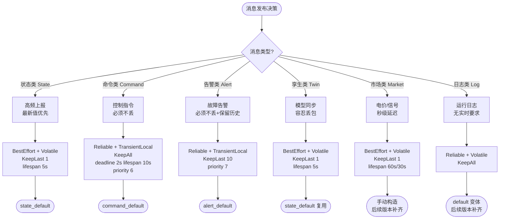
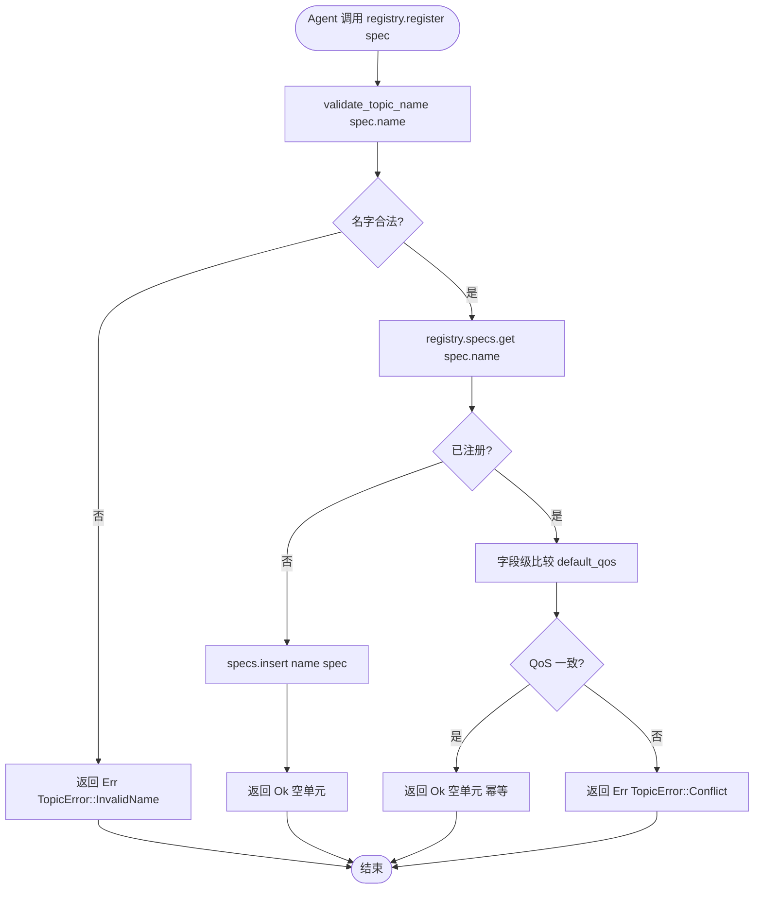

# EnerOS DDS Topic 设计与 QoS 策略设计文档（v0.76.0）

> **版本**：v0.76.0
> **阶段**：Phase 2 多机联邦 — P2-A 第 2 版 / DDS 语义层
> **crate**：`eneros-agent-bus-dds`（`crates/protocols/agent-bus-dds/`，扩展现有 crate）
> **蓝图依据**：`蓝图/phase2.md` §v0.76.0
> **状态**：设计中
> **覆盖版本**：v0.76.0
> **最后更新**：2026-07-17
> **change-id**：`develop-v0760-dds-topic-qos`

---

## 目录

1. [概述](#1-概述)
2. [背景与动机](#2-背景与动机)
3. [BREAKING 变更说明](#3-breaking-变更说明)
4. [Topic 命名规范](#4-topic-命名规范)
5. [TopicCategory 分类](#5-topiccategory-分类)
6. [QoS 分级策略](#6-qos-分级策略)
7. [TopicRegistry 设计](#7-topicregistry-设计)
8. [标准 Topic 预置](#8-标准-topic-预置)
9. [偏差声明 D1~D12](#9-偏差声明-d1d12)
10. [测试策略](#10-测试策略)
11. [未来扩展](#11-未来扩展)
12. [参考](#12-参考)

---

## 1. 概述

### 1.1 版本目标

v0.76.0 是 **Phase 2 多机联邦 P2-A 的第 2 个版本**，在 v0.75.0 DDS 通信底座（`DdsNode` / `MockDdsNode`）之上建立 **DDS 语义层**：Topic 命名规范、QoS 分级策略、Topic 注册表。本版本为 v0.77.0 Agent 消息路由器、v0.94.0 VPP 聚合提供消息语义保证，使能源场景中不同消息类型（状态/命令/告警/数字孪生/市场/日志）获得与其业务语义匹配的 QoS 策略。

### 1.2 一句话目标

在 v0.75.0 DDS 通信底座之上建立语义层——`TopicSpec` / `TopicCategory` / `PayloadType` 数据结构 + `TopicRegistry` 注册表 + `validate_topic_name()` 校验 + 8 个标准预置 Topic + QoS 分级策略（state/command/alert/twin 默认 QoS），并完成 `History::KeepLast(u32)` 破坏性变更迁移。

### 1.3 设计目标

| 目标 | 说明 |
|------|------|
| **语义层抽象** | 提供 `TopicSpec` / `TopicCategory` / `PayloadType`，将"裸 topic 字符串"提升为带类型与默认 QoS 的规范对象 |
| **QoS 分级** | 4 种默认 QoS（State / Command / Alert / Twin），覆盖能源场景主要消息类型 |
| **Topic 注册表** | `TopicRegistry` 基于 `BTreeMap`，支持注册/查询/通配符匹配，预加载 8 个标准 Topic |
| **命名校验** | `validate_topic_name()` 强制 `/power/{category}/{resource}[/{id}]` 格式，拒绝非法字符 |
| **BREAKING 迁移** | `History::KeepLast(u32)` 替代独立 `history_depth` 字段；新增 `deadline` / `lifespan` / `priority` |
| **no_std 合规** | 全 crate `#![cfg_attr(not(test), no_std)]`，无 `regex` / `toml` / `once_cell::sync` 等 std 依赖 |
| **配置模板** | `configs/topics.toml` 提供 8 个标准 Topic 的配置模板（运行时加载由后续版本实现） |

### 1.4 架构定位

| 维度 | 定位 |
|------|------|
| Phase | Phase 2 多机联邦 |
| 子系统 | P2-A 第 2 版 / DDS 语义层 |
| 平面 | 数据平面语义层（在 v0.75.0 通信底座之上） |
| 角色 | Topic 规范 / QoS 分级 / Topic 注册表 |
| 上游版本 | v0.75.0（DDS 通信底座 `DdsNode` / `MockDdsNode`） |
| 下游版本 | v0.77.0（Agent 消息路由器）、v0.94.0（VPP 聚合）、v0.97.0（联邦发现） |
| 部署形态 | 纯 Rust crate（扩展现有 `eneros-agent-bus-dds`，无新增 C 库依赖） |
| 集成策略 | 扩展现有 crate（不新建 crate；Topic/QoS 与 DdsNode 同属 DDS 语义层，D10） |

### 1.5 交付物清单

| 类型 | 交付物 | 描述 |
|------|--------|------|
| 代码模块 | `crates/protocols/agent-bus-dds/src/topic.rs`（新增） | `TopicSpec` / `TopicCategory` / `PayloadType` / `TopicError` / `validate_topic_name()` / `standard_topics()` |
| 代码模块 | `crates/protocols/agent-bus-dds/src/registry.rs`（新增） | `TopicRegistry`（`BTreeMap` 存储 + 通配符匹配） |
| 代码模块 | `crates/protocols/agent-bus-dds/src/qos.rs`（修改） | `QosPolicy` BREAKING 变更：`History::KeepLast(u32)` + 新增 `deadline` / `lifespan` / `priority` + `command_default()` / `alert_default()` |
| 代码模块 | `crates/protocols/agent-bus-dds/src/mock.rs`（修改） | `MockDdsNode::write()` 适配 `History::KeepLast(u32)` 新签名 |
| 代码模块 | `crates/protocols/agent-bus-dds/src/lib.rs`（修改） | re-export 新增类型；版本号 0.75.0 → 0.76.0 |
| 接口 | `TopicSpec` / `TopicCategory` / `PayloadType` | Topic 规范数据结构 |
| 接口 | `TopicRegistry` | Topic 注册表（`register` / `lookup` / `match_pattern` / `with_standards`） |
| 接口 | `TopicError` | 3 变体错误枚举（InvalidName / Conflict / InvalidQos） |
| 接口 | `validate_topic_name()` | Topic 名校验函数 |
| 接口 | `standard_topics()` | 8 个标准预置 Topic |
| 接口 | `QosPolicy::command_default()` / `alert_default()` | 命令类/告警类默认 QoS |
| 配置 | `configs/topics.toml` | 8 个标准 Topic 配置模板 |
| 文档 | 本设计文档 | 架构 / BREAKING / 偏差声明 / 测试策略 |
| 测试 | T18~T31 新增 + T4/T5/T13 适配 | 14 个新测试 + 3 个适配测试 |

---

## 2. 背景与动机

### 2.1 为什么需要 Topic 语义层

v0.75.0 提供了 DDS 通信底座（`DdsNode` trait + `MockDdsNode` 默认实现 + feature-gated `CycloneDdsNode` FFI 封装），但仅支持裸 topic 字符串与简单 QoS（`Reliability` + `Durability` + `History` + `history_depth`）。能源场景中不同业务消息类型需要不同的 QoS 策略，但 v0.75.0 缺少：

1. **Topic 命名规范**：Agent 间约定 topic 名时无统一格式，易出现 `/power/state/battery/1` vs `/battery/state/1` 等不一致命名。
2. **QoS 分级策略**：所有 Topic 共用默认 QoS，无法区分"状态类需要低延迟最新值"与"命令类需要可靠不丢"。
3. **Topic 注册表**：Agent 启动时无法查询已注册的 Topic 规范，无法做兼容性校验。
4. **标准 Topic 预置**：每个 Agent 各自硬编码 topic 字符串，缺乏统一的标准 Topic 清单。

### 2.2 QoS 分级策略的业务价值

能源场景的消息可按业务语义分为 6 类，每类对延迟、可靠性、历史保留的需求差异显著：

| 消息类别 | 业务示例 | 延迟需求 | 可靠性需求 | 历史保留 | 适配 QoS |
|---------|---------|---------|-----------|---------|---------|
| **状态类（State）** | 电池 SOC / PV 输出 / 电网频率 | 低延迟（< 100ms） | 容忍丢包（最新值优先） | 仅保留最新 1 条 | BEST_EFFORT + VOLATILE + KEEP_LAST(1) |
| **命令类（Command）** | 调度指令 / 启停命令 | 中等（< 2s deadline） | 必须可靠不丢 | 保留全部历史 | RELIABLE + TRANSIENT_LOCAL + KEEP_ALL |
| **告警类（Alert）** | 故障告警 / 越限告警 | 中等 | 必须可靠不丢 | 保留最近 10 条 | RELIABLE + TRANSIENT_LOCAL + KEEP_LAST(10) |
| **数字孪生（Twin）** | 设备模型同步 | 低延迟 | 容忍丢包 | 仅保留最新 1 条 | BEST_EFFORT + VOLATILE + KEEP_LAST(1) |
| **市场类（Market）** | 电价 / 调度信号 | 中等（秒级） | 容忍丢包 | 仅保留最新 1 条 | BEST_EFFORT + VOLATILE + KEEP_LAST(1) |
| **日志类（Log）** | 运行日志 / 审计日志 | 无实时要求 | 必须可靠 | 保留全部历史 | RELIABLE + TRANSIENT_LOCAL + KEEP_ALL |

> 注：本版本仅提供 State / Command / Alert / Twin 四类默认 QoS 构造方法；Market 与 Log 沿用 `QosPolicy::default()` 或由调用方手动构造，后续版本补齐。

### 2.3 在 v0.75.0 通信底座之上的语义层定位

```
┌──────────────────────────────────────────────────────┐
│  联邦协同业务层（v0.97.0 联邦发现 / v0.94.0 VPP 聚合）  │
├──────────────────────────────────────────────────────┤
│  Agent 消息路由器（v0.77.0）                          │  ← 下游消费者
├──────────────────────────────────────────────────────┤
│  DDS 语义层（本版本 v0.76.0）                         │  ← 本版本
│  TopicSpec / TopicCategory / PayloadType              │
│  TopicRegistry / validate_topic_name() / standard_topics() │
│  QoS 分级（state/command/alert/twin default）         │
├──────────────────────────────────────────────────────┤
│  DDS 通信底座（v0.75.0）                              │  ← 上游底座
│  DdsNode trait + MockDdsNode + CycloneDdsNode FFI     │
├──────────────────────────────────────────────────────┤
│  Cyclone DDS C 库（libddsc.so，MIT 许可）             │  ← feature-gated
├──────────────────────────────────────────────────────┤
│  UDP / 多播网络（smoltcp TCP/IP 栈 v0.28.0）          │
└──────────────────────────────────────────────────────┘
```

---

## 3. BREAKING 变更说明

### 3.1 破坏性变更概览

v0.76.0 对 v0.75.0 的 `QosPolicy` / `History` 进行**破坏性变更**，以符合 DDS RTPS 规范语义并为后续 QoS 扩展铺路：

| 变更项 | v0.75.0 | v0.76.0 | 影响范围 |
|--------|---------|---------|---------|
| `History` 枚举签名 | `History::KeepLast` + `History::KeepAll`（无参数） | `History::KeepLast(u32)` + `History::KeepAll`（深度内嵌） | 所有模式匹配 `History::KeepLast` 的代码 |
| `QosPolicy::history_depth` 字段 | `pub history_depth: i32`（独立字段） | **移除**（深度内嵌于 `History::KeepLast(u32)`） | 所有访问 `qos.history_depth` 的代码 |
| `QosPolicy` 新增字段 | 无 `deadline` / `lifespan` / `priority` | 新增 `deadline: Option<Duration>` / `lifespan: Option<Duration>` / `priority: i32` | 所有 `QosPolicy { ... }` 字面量构造 |
| `MockDdsNode::write()` 截断逻辑 | `if r.qos.history == History::KeepLast && r.qos.history_depth > 0` | `if let History::KeepLast(depth) = r.qos.history` | Mock 实现内部 |

### 3.2 变更前 / 变更后对比

**变更前（v0.75.0）**：

```rust
pub enum History { KeepLast, KeepAll }

pub struct QosPolicy {
    pub reliability: Reliability,
    pub durability: Durability,
    pub history: History,
    pub history_depth: i32,  // 独立字段
}

// 构造
let qos = QosPolicy {
    reliability: Reliability::BestEffort,
    durability: Durability::Volatile,
    history: History::KeepLast,
    history_depth: 1,
};

// Mock 截断
if r.qos.history == History::KeepLast && r.qos.history_depth > 0 {
    let depth = r.qos.history_depth as usize;
    while r.buffer.len() > depth { r.buffer.pop_front(); }
}
```

**变更后（v0.76.0）**：

```rust
pub enum History {
    KeepLast(u32),  // 深度内嵌于枚举变体
    KeepAll,
}

pub struct QosPolicy {
    pub reliability: Reliability,
    pub durability: Durability,
    pub history: History,
    pub deadline: Option<core::time::Duration>,
    pub lifespan: Option<core::time::Duration>,
    pub priority: i32,
}

// 构造
let qos = QosPolicy {
    reliability: Reliability::BestEffort,
    durability: Durability::Volatile,
    history: History::KeepLast(1),
    deadline: None,
    lifespan: Some(core::time::Duration::from_secs(5)),
    priority: 0,
};

// Mock 截断（模式匹配）
if let History::KeepLast(depth) = r.qos.history {
    let depth = depth as usize;
    while r.buffer.len() > depth { r.buffer.pop_front(); }
}
```

### 3.3 迁移指引

#### 3.3.1 `History::KeepLast` 模式匹配迁移

```rust
// ❌ v0.75.0 旧代码
if qos.history == History::KeepLast {
    let depth = qos.history_depth as usize;
    // ...
}

// ✅ v0.76.0 新代码
if let History::KeepLast(depth) = qos.history {
    let depth = depth as usize;
    // ...
}
```

#### 3.3.2 `QosPolicy` 字面量构造迁移

```rust
// ❌ v0.75.0 旧代码
let qos = QosPolicy {
    reliability: Reliability::Reliable,
    durability: Durability::Volatile,
    history: History::KeepLast,
    history_depth: 10,
};

// ✅ v0.76.0 新代码
let qos = QosPolicy {
    reliability: Reliability::Reliable,
    durability: Durability::Volatile,
    history: History::KeepLast(10),
    deadline: None,
    lifespan: None,
    priority: 0,
};
```

#### 3.3.3 受影响的现有测试（T4 / T5 / T13）

| 测试 | v0.75.0 旧断言 | v0.76.0 新断言 |
|------|---------------|---------------|
| **T4** `qos_state_default` | `qos.history_depth == 1` | `qos.history == History::KeepLast(1)` |
| **T5** `qos_default` | `qos.history_depth == 10` | `qos.history == History::KeepLast(10)` |
| **T13** `mock_multi_reader_broadcast` | `QosPolicy { history: History::KeepLast, history_depth: 2, ... }` | `QosPolicy { history: History::KeepLast(2), deadline: None, lifespan: None, priority: 0, ... }` |

#### 3.3.4 迁移影响评估

- **crate 内部**：`crates/protocols/agent-bus-dds/src/{qos,mock,lib}.rs` + 测试模块，约 5~8 处修改。
- **跨 crate**：v0.75.0 尚未被其他 crate 依赖（Phase 2 起点），无外部消费者受影响。
- **配置文件**：`configs/dds.toml`（v0.75.0）未使用 `history_depth` 字段，无需修改。
- **回滚成本**：低（仅 `QosPolicy` / `History` 数据结构变更，无外部接口签名变化）。

---

## 4. Topic 命名规范

### 4.1 命名格式

EnerOS DDS Topic 命名遵循统一的层级格式：

```
/power/{category}/{resource}[/{id}]
```

| 段 | 必填 | 取值 | 示例 |
|----|------|------|------|
| `/` 前缀 | ✅ 必填 | 固定 `/` 开头 | `/` |
| `power` | ✅ 必填 | 固定字符串 `power`（项目命名空间） | `power` |
| `{category}` | ✅ 必填 | `state` / `command` / `alert` / `twin` / `market` / `log` | `state` |
| `{resource}` | ✅ 必填 | 资源类型（小写字母 + 数字 + 下划线） | `battery` / `pv` / `grid` |
| `/{id}` | ❌ 可选 | 资源实例 ID 或参数占位符 `{id}` | `1` / `{id}` |

### 4.2 合法示例

| Topic 名 | 说明 |
|---------|------|
| `/power/state/battery/1` | 1 号电池状态 |
| `/power/state/battery/{id}` | 电池状态模板（含参数占位符） |
| `/power/state/pv/2` | 2 号光伏状态 |
| `/power/state/grid` | 电网状态（无 id，单例资源） |
| `/power/command/internal` | 内部命令 |
| `/power/alert/fault` | 故障告警 |
| `/power/market/price` | 市场电价 |
| `/power/twin/update` | 数字孪生更新 |

### 4.3 非法示例

| Topic 名 | 非法原因 |
|---------|---------|
| `power/state/battery/1` | 不以 `/` 开头 |
| `/Power/state/battery/1` | 含大写字母 `P`（仅 `[a-zA-Z0-9_/{}` 允许，但 `power` 段应小写） |
| `/power/state battery/1` | 含空格 |
| `/power/state;drop` | 含分号 `;`（SQL 注入风险字符） |
| `/power/state/battery/1/` | 末尾多余 `/`（合法字符集内但不推荐） |
| `/power//battery/1` | 空段（合法字符集内但不推荐） |

### 4.4 合法字符集

`validate_topic_name()` 强制 Topic 名仅包含以下字符：

```
[a-zA-Z0-9_/{]
```

| 字符类别 | 允许字符 | 说明 |
|---------|---------|------|
| 小写字母 | `a-z` | category / resource 段（推荐小写） |
| 大写字母 | `A-Z` | 允许但不推荐（保持兼容性） |
| 数字 | `0-9` | id 段 |
| 下划线 | `_` | resource 段分隔（如 `market_price`） |
| 斜杠 | `/` | 段分隔符 |
| 左花括号 | `{` | 参数占位符开始（如 `{id}`） |
| 右花括号 | `}` | 参数占位符结束 |

**禁止字符**：空格、制表符、分号、引号、反斜杠、星号（`*` 保留给 `match_pattern` 通配符）、问号、冒号、点号等。

### 4.5 校验规则

```rust
pub fn validate_topic_name(name: &str) -> Result<(), TopicError>;
```

校验流程：

1. **必须以 `/` 开头**：否则返回 `Err(TopicError::InvalidName("必须以 / 开头".into()))`。
2. **仅含合法字符集 `[a-zA-Z0-9_/{]`**：否则返回 `Err(TopicError::InvalidName("含非法字符".into()))`。
3. **非空**：长度 ≥ 1（仅 `/` 也合法但无业务意义，不做强制拒绝）。

> **D4 相关**：`match_pattern()` 使用 `*` 作为通配符，故 `*` 不在 `validate_topic_name` 的合法字符集中（避免注册时与通配符冲突）。

---

## 5. TopicCategory 分类

### 5.1 枚举定义

```rust
pub enum TopicCategory {
    State,    // BEST_EFFORT + KEEP_LAST(1)
    Command,  // RELIABLE + KEEP_ALL
    Alert,    // RELIABLE + KEEP_LAST(10)
    Twin,     // BEST_EFFORT + KEEP_LAST(1)
    Market,   // BEST_EFFORT + KEEP_LAST(1)
    Log,      // RELIABLE + KEEP_ALL
}
```

### 5.2 分类语义

| 分类 | 语义 | 默认 QoS | 典型 Topic | 业务场景 |
|------|------|---------|-----------|---------|
| **State** | 设备/资源实时状态 | `state_default()`：BEST_EFFORT + VOLATILE + KEEP_LAST(1) + lifespan=5s | `/power/state/battery/{id}` | 电池 SOC / PV 输出 / 电网频率，低延迟最新值优先 |
| **Command** | 控制命令 | `command_default()`：RELIABLE + TRANSIENT_LOCAL + KEEP_ALL + deadline=2s + lifespan=10s + priority=6 | `/power/command/internal` | 调度指令 / 启停命令，必须可靠不丢，保留全部历史 |
| **Alert** | 告警事件 | `alert_default()`：RELIABLE + TRANSIENT_LOCAL + KEEP_LAST(10) + priority=7 | `/power/alert/fault` | 故障告警 / 越限告警，必须可靠不丢，保留最近 10 条 |
| **Twin** | 数字孪生同步 | `state_default()`：BEST_EFFORT + VOLATILE + KEEP_LAST(1) + lifespan=5s | `/power/twin/update` | 设备模型/参数同步，容忍丢包，仅保留最新 |
| **Market** | 市场信号 | `state_default()` 变体：BEST_EFFORT + VOLATILE + KEEP_LAST(1) + lifespan=60s/30s | `/power/market/price` / `/power/market/signal` | 电价 / 调度信号，秒级延迟，仅保留最新 |
| **Log** | 运行/审计日志 | `default()` 变体：RELIABLE + VOLATILE + KEEP_ALL | （本版本未预置，后续版本扩展） | 运行日志 / 审计日志，无实时要求，保留全部历史 |

### 5.3 分类与默认 QoS 映射

> 本版本提供 4 个 QoS 构造方法（`default` / `state_default` / `command_default` / `alert_default`）；Market 与 Log 沿用 `default()` 或由调用方手动构造。

| 构造方法 | reliability | durability | history | deadline | lifespan | priority |
|---------|-------------|------------|---------|----------|----------|----------|
| `QosPolicy::default()` | Reliable | Volatile | KeepLast(10) | None | None | 0 |
| `QosPolicy::state_default()` | BestEffort | Volatile | KeepLast(1) | None | 5s | 0 |
| `QosPolicy::command_default()` | Reliable | TransientLocal | KeepAll | 2s | 10s | 6 |
| `QosPolicy::alert_default()` | Reliable | TransientLocal | KeepLast(10) | None | None | 7 |

---

## 6. QoS 分级策略

### 6.1 4 种 QoS 组合选型对比

本版本针对能源场景 4 类核心消息（State / Command / Alert / Twin）提供 4 种默认 QoS 组合，调用方无需手动拼装字段：

| QoS 组合 | reliability | durability | history | deadline | lifespan | priority | 延迟 | 可靠性 | 历史保留 |
|---------|-------------|------------|---------|----------|----------|----------|------|--------|---------|
| **State** | BestEffort | Volatile | KeepLast(1) | None | 5s | 0 | 最低 | 容忍丢包 | 仅最新 1 条 |
| **Command** | Reliable | TransientLocal | KeepAll | 2s | 10s | 6 | 中等 | 必须不丢 | 全部历史 |
| **Alert** | Reliable | TransientLocal | KeepLast(10) | None | None | 7 | 中等 | 必须不丢 | 最近 10 条 |
| **Twin** | BestEffort | Volatile | KeepLast(1) | None | 5s | 0 | 最低 | 容忍丢包 | 仅最新 1 条 |

### 6.2 适用场景

| QoS 组合 | 适用场景 | 不适用场景 |
|---------|---------|-----------|
| **State** | 高频状态上报（电池 SOC / PV 输出 / 电网频率），最新值优先于历史完整性 | 命令下发（丢包不可接受）、告警（必须保留历史） |
| **Command** | 调度指令 / 启停命令 / 控制信号，必须可靠送达且保留全部历史以供审计 | 高频状态上报（KeepAll 会无限增长 buffer） |
| **Alert** | 故障告警 / 越限告警，必须可靠送达且保留最近 10 条供运维查看 | 高频状态上报（KeepLast(10) 仍会截断，但 State 更适合 KeepLast(1)） |
| **Twin** | 数字孪生模型/参数同步，容忍丢包（最新模型覆盖旧值） | 命令下发（不可丢）、告警（必须保留历史） |

### 6.3 QoS 字段语义

| 字段 | 类型 | 语义 | None / 默认值含义 |
|------|------|------|------------------|
| `reliability` | `Reliability`（BestEffort / Reliable） | 传输可靠性：BestEffort 不重传，Reliable 自动重传至 ACK | — |
| `durability` | `Durability`（Volatile / TransientLocal） | 持久性：Volatile 仅在线样本，TransientLocal 后加入 reader 也能收到最近历史 | — |
| `history` | `History`（KeepLast(u32) / KeepAll） | 历史保留：KeepLast(n) 仅保留最近 n 条，KeepAll 不截断 | — |
| `deadline` | `Option<Duration>` | 期望最大到达间隔，超时触发告警 | `None` = 无限制 |
| `lifespan` | `Option<Duration>` | 样本有效期，过期样本被丢弃 | `None` = 永不过期 |
| `priority` | `i32` | TSN 优先级映射（0=最低，7=最高），用于跨网桥优先级队列 | `0` = 最低 |

### 6.4 QoS 分级策略矩阵图



### 6.5 QoS 兼容性说明

> **D7**：Mock 实现不强制 QoS 兼容性校验（继承 v0.75.0 D10 策略）。例如 writer 用 `Reliable` 写入、reader 用 `BestEffort` 读取时仍能收到。真实 FFI 启用时由 Cyclone DDS C 库按 RTPS QoS 兼容性矩阵校验。

---

## 7. TopicRegistry 设计

### 7.1 数据结构

```rust
pub struct TopicRegistry {
    specs: alloc::collections::BTreeMap<alloc::string::String, TopicSpec>,
}
```

> **D1**：使用 `alloc::collections::BTreeMap` 替代 `std::collections::HashMap`（no_std 兼容；`BTreeMap` 还提供按 key 排序的迭代顺序，便于调试与确定性输出）。

### 7.2 接口签名

```rust
impl TopicRegistry {
    /// 创建空注册表
    pub fn new() -> Self;

    /// 创建并预加载 8 个标准 Topic
    pub fn with_standards() -> Self;

    /// 注册 Topic 规范
    ///
    /// - 名字非法 → `Err(TopicError::InvalidName)`
    /// - 同名已注册且 QoS 一致 → `Ok(())`（幂等）
    /// - 同名已注册但 QoS 不一致 → `Err(TopicError::Conflict)`
    pub fn register(&mut self, spec: TopicSpec) -> Result<(), TopicError>;

    /// 查询 Topic 规范（精确匹配）
    pub fn lookup(&self, name: &str) -> Option<&TopicSpec>;

    /// 通配符匹配（仅支持 `*` 后缀通配，如 `/power/state/*`）
    pub fn match_pattern(&self, pattern: &str) -> alloc::vec::Vec<&TopicSpec>;
}
```

### 7.3 register 语义

| 场景 | 输入 | 输出 |
|------|------|------|
| 注册新 Topic（名字合法 + 未注册） | `spec.name = "/power/state/battery/1"`，未注册 | `Ok(())`，后续 `lookup` 可查到 |
| 重复注册同名 + QoS 一致 | `spec.name` 已注册，`default_qos` 字段级相同 | `Ok(())`（幂等） |
| 重复注册同名 + QoS 不一致 | `spec.name` 已注册，`default_qos` 字段级不同 | `Err(TopicError::Conflict { name })` |
| 名字非法（不以 `/` 开头） | `spec.name = "power/state"` | `Err(TopicError::InvalidName(...))` |
| 名字非法（含空格/特殊字符） | `spec.name = "/power/state;drop"` | `Err(TopicError::InvalidName(...))` |

> **QoS 一致性判定**：因 `TopicSpec` 不派生 `PartialEq`（D8），一致性判定采用字段级比较（`reliability` / `durability` / `history` / `deadline` / `lifespan` / `priority` 逐字段对比）。

### 7.4 lookup 语义

| 场景 | 输入 | 输出 |
|------|------|------|
| 查询已注册 Topic | `lookup("/power/state/battery/1")`，已注册 | `Some(&TopicSpec)` |
| 查询未注册 Topic | `lookup("/unknown")` | `None` |
| 查询带参数占位符 | `lookup("/power/state/battery/{id}")`，已注册模板 | `Some(&TopicSpec)`（精确字符串匹配，不解析占位符） |

### 7.5 match_pattern 通配符匹配

> **D4**：`match_pattern` 实现简化通配符匹配，**仅支持 `*` 后缀通配**（如 `/power/state/*`），不引入 `regex` 依赖（regex crate 体积大且需 std）。

**匹配规则**：

1. 若 `pattern` 以 `*` 结尾，则前缀匹配：所有以 `pattern` 去掉末尾 `*` 后的前缀开头的已注册 topic 均匹配。
2. 若 `pattern` 不以 `*` 结尾，则退化为精确匹配（等价于 `lookup` 但返回 `Vec`）。

**示例**：

| 模式 | 已注册 Topic | 匹配结果 |
|------|-------------|---------|
| `/power/state/*` | `/power/state/battery/1` / `/power/state/pv/1` / `/power/state/grid` / `/power/command/internal` | 前 3 个（均以 `/power/state/` 开头） |
| `/power/market/*` | `/power/market/price` / `/power/market/signal` | 2 个 |
| `/power/state/battery/1` | `/power/state/battery/1` | 1 个（精确匹配） |
| `/unknown/*` | 任意 | 空 `Vec` |

**实现伪代码**（约 20 行）：

```rust
pub fn match_pattern(&self, pattern: &str) -> alloc::vec::Vec<&TopicSpec> {
    if let Some(prefix) = pattern.strip_suffix('*') {
        // 前缀匹配
        self.specs
            .range(prefix.to_string()..)  // BTreeMap 范围扫描
            .take_while(|(k, _)| k.starts_with(prefix))
            .map(|(_, v)| v)
            .collect()
    } else {
        // 精确匹配
        self.specs
            .get(pattern)
            .map(|v| alloc::vec![v])
            .unwrap_or_default()
    }
}
```

### 7.6 Topic 注册流程图



### 7.7 with_standards 预加载

`TopicRegistry::with_standards()` 等价于：

```rust
pub fn with_standards() -> Self {
    let mut registry = Self::new();
    for spec in standard_topics() {
        let _ = registry.register(spec);  // 标准 Topic 名均合法，注册必成功
    }
    registry
}
```

预加载后注册表包含 8 个标准 Topic（见 §8）。

---

## 8. 标准 Topic 预置

### 8.1 standard_topics() 函数

```rust
pub fn standard_topics() -> alloc::vec::Vec<TopicSpec>;
```

> **D8**：使用普通函数替代 `once_cell::sync::Lazy`（no_std 兼容；`once_cell::sync` 需 `std`）。每次调用重新构造 `Vec`，调用方按需缓存。

### 8.2 8 个标准 Topic 清单

| # | Topic 名 | Category | PayloadType | 默认 QoS | TTL | 业务含义 |
|---|---------|----------|-------------|---------|-----|---------|
| 1 | `/power/state/battery/{id}` | State | Json | `state_default()` | 5s | 电池状态（SOC / 电压 / 电流 / 温度） |
| 2 | `/power/state/pv/{id}` | State | Json | `state_default()` | 5s | 光伏状态（输出功率 / 辐照度） |
| 3 | `/power/state/grid` | State | Json | `state_default()` 变体（lifespan=2s） | 2s | 电网状态（频率 / 电压 / 相位） |
| 4 | `/power/market/price` | Market | Json | `state_default()` 变体（lifespan=60s） | 60s | 市场电价 |
| 5 | `/power/market/signal` | Market | Json | `state_default()` 变体（lifespan=30s） | 30s | 市场调度信号 |
| 6 | `/power/command/internal` | Command | Bincode | `command_default()` | 10s | 内部控制命令 |
| 7 | `/power/alert/fault` | Alert | Json | `alert_default()` | None（不过期） | 故障告警 |
| 8 | `/power/twin/update` | Twin | Json | `state_default()` | 5s | 数字孪生更新 |

### 8.3 标准 Topic QoS 配置详解

| Topic | reliability | durability | history | deadline | lifespan | priority |
|-------|-------------|------------|---------|----------|----------|----------|
| `/power/state/battery/{id}` | BestEffort | Volatile | KeepLast(1) | None | 5s | 0 |
| `/power/state/pv/{id}` | BestEffort | Volatile | KeepLast(1) | None | 5s | 0 |
| `/power/state/grid` | BestEffort | Volatile | KeepLast(1) | None | 2s | 0 |
| `/power/market/price` | BestEffort | Volatile | KeepLast(1) | None | 60s | 0 |
| `/power/market/signal` | BestEffort | Volatile | KeepLast(1) | None | 30s | 0 |
| `/power/command/internal` | Reliable | TransientLocal | KeepAll | 2s | 10s | 6 |
| `/power/alert/fault` | Reliable | TransientLocal | KeepLast(10) | None | None | 7 |
| `/power/twin/update` | BestEffort | Volatile | KeepLast(1) | None | 5s | 0 |

### 8.4 PayloadType 选择理由

| Topic | PayloadType | 理由 |
|-------|-------------|------|
| State / Alert / Twin / Market | Json | 跨语言可读，便于调试与第三方集成 |
| Command | Bincode | Rust 原生二进制序列化，低开销，命令结构紧凑 |
| （未使用） | Cdr | DDS 标准 CDR 编码，由 v0.77.0 路由器或后续版本实现（D6） |

---

## 9. 偏差声明 D1~D12

本版本相对蓝图 §v0.76.0 的偏差声明，完整列表如下（与 `develop-v0760-dds-topic-qos` spec.md 一致）：

| 偏差 | 说明 |
|------|------|
| **D1** | `TopicRegistry` 使用 `alloc::collections::BTreeMap` 替代 `std::collections::HashMap`（no_std 兼容；`BTreeMap` 提供排序迭代，便于 `match_pattern` 范围扫描） |
| **D2** | `History::KeepLast(u32)` 破坏性变更：深度内嵌于枚举变体，移除 `QosPolicy::history_depth` 独立字段（蓝图规范，更符合 DDS 语义；减少字段数） |
| **D3** | `QosPolicy` 新增 `deadline` / `lifespan` / `priority` 字段（蓝图 §4.1 要求）；使用 `core::time::Duration`（no_std 兼容） |
| **D4** | `match_pattern` 实现简化通配符匹配（仅支持 `*` 后缀通配，不引入 `regex` 依赖；regex crate 体积大且需 std） |
| **D5** | 不实现 `load_from_toml`（`toml` crate 需 `std`；`configs/topics.toml` 作为配置模板，运行时加载由后续版本 std 环境实现） |
| **D6** | 仅定义 `PayloadType` 枚举，不实现 CDR 编码（CDR 编码由 v0.77.0 路由器或后续版本实现） |
| **D7** | Mock 不强制 QoS 兼容性校验（继承 v0.75.0 D10）；KeepLast 截断按 reader 自身 QoS |
| **D8** | `standard_topics()` 使用普通函数替代 `once_cell::sync::Lazy`（no_std 兼容；`once_cell::sync` 需 `std`）；`TopicSpec` 派生 `Debug, Clone`（不派生 `PartialEq`，因 `Duration` 已实现 `PartialEq` 但 `QosPolicy` 含 `Option<Duration>`；如需比较用字段级比较） |
| **D9** | `TopicError` 作为独立错误类型（不并入 `DdsError`；Topic 语义错误与 DDS 通信错误关注点不同） |
| **D10** | 扩展 v0.75.0 `eneros-agent-bus-dds` crate（不新建 crate；Topic/QoS 与 DdsNode 同属 DDS 语义层） |
| **D11** | 配置文件位于 `configs/topics.toml`（项目规则 §2.3，非蓝图 `config/topics.toml`） |
| **D12** | 文档位于 `docs/protocols/dds-topic-qos-design.md`（项目规则 §2.3.3，非蓝图 `docs/phase2/`） |

### 9.1 简化设计验证（Karpathy 原则）

- ✅ 无 `regex` 依赖（手动实现 `*` 通配符匹配，约 20 行代码）
- ✅ 无 `once_cell::sync::Lazy`（普通函数 `standard_topics()` 返回 `Vec`）
- ✅ 无 `toml` 运行时解析（配置模板仅文档作用，运行时加载后置）
- ✅ 无 CDR 编码实现（仅枚举定义，编码后置到 v0.77.0）
- ✅ 无 QoS 兼容性强制校验（Mock 继承 v0.75.0 策略）
- ✅ `History::KeepLast(u32)` 替代 `history_depth` 独立字段（更符合 DDS 规范，减少字段数）
- ✅ 扩展现有 crate 而非新建（Topic/QoS 与 DdsNode 同属语义层）
- ✅ `TopicError` 独立错误类型（不并入 `DdsError`，关注点分离）
- ✅ `BTreeMap` 替代 `HashMap`（no_std 兼容 + 排序迭代 + 范围扫描优化 `match_pattern`）

---

## 10. 测试策略

### 10.1 测试覆盖

#### 10.1.1 v0.76.0 新增测试（T18~T31）

| 编号 | 测试名 | 覆盖需求 | 说明 |
|------|--------|---------|------|
| **T18** | `topic_spec_construct` | TopicSpec 构造 | 构造 `TopicSpec { name: "/power/state/battery/1", category: State, ... }`，字段正确设置 |
| **T19** | `payload_type_variants` | PayloadType 枚举 | `PayloadType::Json` / `Bincode` / `Cdr` 三个变体均存在 |
| **T20** | `topic_registry_new_empty` | TopicRegistry::new() | 新建注册表为空，`lookup` 任意 topic 返回 `None` |
| **T21** | `topic_registry_register_new` | register 新 Topic | 注册合法新 Topic 返回 `Ok(())`，`lookup` 可查到 |
| **T22** | `topic_registry_register_idempotent` | register 幂等 | 重复注册同名 + QoS 一致返回 `Ok(())`（幂等） |
| **T23** | `topic_registry_register_conflict` | register 冲突 | 重复注册同名 + QoS 不一致返回 `Err(TopicError::Conflict)` |
| **T24** | `topic_registry_register_invalid_name` | register 非法名 | 注册不以 `/` 开头或含非法字符的 topic 返回 `Err(TopicError::InvalidName)` |
| **T25** | `topic_registry_lookup_found` | lookup 命中 | 已注册 topic `lookup` 返回 `Some(&TopicSpec)` |
| **T26** | `topic_registry_match_pattern` | match_pattern 通配 | 注册 `/power/state/battery/1` + `/power/state/pv/1`，`match_pattern("/power/state/*")` 返回 2 个 |
| **T27** | `topic_registry_with_standards` | with_standards 预加载 | `TopicRegistry::with_standards()` 包含 8 个标准 Topic |
| **T28** | `standard_topics_count_and_names` | standard_topics() | `standard_topics()` 返回 `Vec` 长度为 8，包含 8 个标准 topic 名 |
| **T29** | `validate_topic_name_valid` | 校验合法名 | `validate_topic_name("/power/state/battery/1")` 与 `"/power/state/battery/{id}"` 均返回 `Ok(())` |
| **T30** | `validate_topic_name_invalid` | 校验非法名 | 不以 `/` 开头 / 含空格 / 含 `;` 三种非法场景均返回 `Err(TopicError::InvalidName)` |
| **T31** | `qos_command_alert_defaults` | command_default / alert_default | `command_default()` = Reliable + TransientLocal + KeepAll + deadline=2s + lifespan=10s + priority=6；`alert_default()` = Reliable + TransientLocal + KeepLast(10) + deadline=None + lifespan=None + priority=7 |

#### 10.1.2 v0.75.0 适配测试（T4 / T5 / T13）

| 编号 | 测试名 | 适配说明 |
|------|--------|---------|
| **T4** | `qos_state_default` | `qos.history_depth == 1` → `qos.history == History::KeepLast(1)` |
| **T5** | `qos_default` | `qos.history_depth == 10` → `qos.history == History::KeepLast(10)` |
| **T13** | `mock_multi_reader_broadcast` | 构造 `QosPolicy { history: History::KeepLast, history_depth: 2 }` → `QosPolicy { history: History::KeepLast(2), deadline: None, lifespan: None, priority: 0 }`（移除 `history_depth` 字段，新增 `deadline` / `lifespan` / `priority` 字段） |

#### 10.1.3 Mock 截断验证（继承 v0.75.0，适配新签名）

| 编号 | 测试名 | 说明 |
|------|--------|------|
| **T14** | `mock_keep_last_depth` | reader QoS `KeepLast(2)`，writer 写入 3 条，`take(10)` 返回最多 2 条（适配 `History::KeepLast(u32)` 模式匹配） |
| **T15** | `mock_keep_all_unbounded` | reader QoS `KeepAll`，writer 写入 3 条，`take(10)` 返回 3 条（不截断） |

### 10.2 no_std 合规验证

| 验证项 | 命令 | 期望 |
|--------|------|------|
| `#![no_std]` 声明 | `grep -r "no_std" crates/protocols/agent-bus-dds/src/` | `lib.rs` 顶部声明 |
| 无 `std::` 引用 | `grep -r "use std::" crates/protocols/agent-bus-dds/src/` | 零匹配 |
| 无 `regex` 依赖 | `grep "regex" crates/protocols/agent-bus-dds/Cargo.toml` | 零匹配 |
| 无 `toml` 依赖 | `grep "^toml " crates/protocols/agent-bus-dds/Cargo.toml` | 零匹配 |
| 无 `once_cell::sync` | `grep "once_cell::sync" crates/protocols/agent-bus-dds/src/` | 零匹配 |
| `cargo clippy` | `cargo clippy -p eneros-agent-bus-dds -- -D warnings` | 无 warning |

### 10.3 交叉编译验证

```bash
# 默认（Mock）交叉编译
cargo build -p eneros-agent-bus-dds \
  --target aarch64-unknown-none \
  -Z build-std=core,alloc \
  -Z build-std-features=compiler-builtins-mem

# 期望：编译成功，无链接错误
```

### 10.4 测试执行

```bash
# 单元测试（Mock）
cargo test -p eneros-agent-bus-dds

# clippy lint
cargo clippy -p eneros-agent-bus-dds --all-targets -- -D warnings

# 格式检查
cargo fmt -p eneros-agent-bus-dds -- --check
```

### 10.5 验收标准

| 验收项 | 标准 |
|--------|------|
| T18~T31 全部通过 | `cargo test -p eneros-agent-bus-dds` 14 个新测试 + 适配后的 T4/T5/T13 通过 |
| BREAKING 迁移完成 | `QosPolicy` / `History` 全 crate 无 `history_depth` 字段残留 |
| 8 个标准 Topic 注册成功 | `TopicRegistry::with_standards()` 包含 8 个标准 Topic |
| no_std 合规 | 无 `std::` / `regex` / `toml` / `once_cell::sync` 引用 |
| 交叉编译通过 | `cargo build --target aarch64-unknown-none` 成功 |
| clippy 无 warning | `cargo clippy -- -D warnings` 通过 |
| 文档与配置就绪 | 本设计文档 + `configs/topics.toml` 存在且内容完整 |

---

## 11. 未来扩展

### 11.1 v0.77.0 — Agent 消息路由器

- **DDS Router**：基于 Cyclone DDS Router 实现跨域路由（domain forwarding）。
- **桥接**：DDS ↔ MQTT / Modbus 协议桥接。
- **CDR 编码**：实现 `PayloadType::Cdr` 的 CDR 序列化/反序列化（本版本 D6 后置）。
- **路由表**：基于 `TopicRegistry` 的路由决策（topic → 目标域/协议映射）。

### 11.2 v0.94.0 — VPP 聚合

- **Virtual Power Plant**：基于 DDS 跨设备数据汇聚，多终端功率状态发布到 VPP 中心节点。
- **聚合 Topic**：新增 `/power/vpp/aggregate/{vpp_id}` 等聚合 Topic。
- **聚合 QoS**：聚合数据沿用 State 类 QoS（低延迟最新值）。

### 11.3 v0.97.0 — 联邦发现

- **联邦发现服务**：基于 DDS SPDP 实现跨设备 Agent 注册与发现。
- **Agent 元数据 Topic**：新增 `/power/discovery/agent/{id}` 等 Agent 元数据 Topic。
- **发现 QoS**：Agent 元数据沿用 Alert 类 QoS（可靠 + 保留历史）。

### 11.4 CDR 编码（后续版本）

- 实现 `PayloadType::Cdr` 的 CDR 序列化/反序列化。
- CDR（Common Data Representation）是 DDS RTPS 标准线协议编码格式。
- 由 v0.77.0 路由器或独立编码版本实现（D6）。

### 11.5 toml 运行时加载（后续版本）

- 实现 `TopicRegistry::load_from_toml(path)` 在 std 环境下加载 `configs/topics.toml`。
- 本版本 `configs/topics.toml` 仅作为配置模板（D5）。
- 运行时加载由后续版本在 std 环境（如管理信息大区 Agent Runtime）实现，no_std 边缘侧仍使用 `with_standards()` 硬编码预置。

### 11.6 路线图链路

```
v0.75.0 DDS 通信底座
   │
   ├─► v0.76.0（本版本）DDS 语义层
   │     │  TopicSpec / TopicRegistry / QoS 分级 / 8 个标准 Topic
   │     │
   │     ├─► v0.77.0 DDS Router（跨域路由 + CDR 编码）
   │     │
   │     ├─► v0.94.0 VPP 聚合（数据汇聚）
   │     │
   │     └─► v0.97.0 联邦发现（SPDP）
   │
   └─► toml 运行时加载（后续版本，std 环境）
```

---

## 12. 参考

### 12.1 DDS / RTPS QoS 规范

- **DDS Specification**：OMG Data Distribution Service 1.4（formal/2015-04-10）—— QoS 策略定义（Reliability / Durability / History / Deadline / Lifespan / Ownership 等）
- **RTPS Specification**：OMG RTPS 2.5（formal/2014-11-01，DDS wire protocol）—— QoS 兼容性矩阵
- **DDS Security Specification**：OMG DDS Security 1.1（formal/2018-04-01）

### 12.2 Cyclone DDS 文档

- **Eclipse Cyclone DDS**：<https://github.com/eclipse-cyclonedds/cyclonedds>
- **Cyclone DDS C API**：<https://github.com/eclipse-cyclonedds/cyclonedds/blob/master/docs/manual/options.md>
- **许可证**：MIT / Eclipse Public License 2.0

### 12.3 相关版本

| 版本 | 关系 | 说明 |
|------|------|------|
| v0.28.0 | 依赖（传输层） | smoltcp TCP/IP 栈（UDP/多播网络） |
| v0.74.0 | 间接前置 | Phase 1 MVP 出口验证（单机自治完成） |
| **v0.75.0** | 直接前置 | DDS 中间件集成（Phase 2 起点，通信底座） |
| **v0.76.0** | 本版本 | DDS Topic 设计与 QoS 策略（语义层） |
| v0.77.0 | 后继 | Agent 消息路由器（跨域路由 + CDR 编码） |
| v0.94.0 | 后继 | VPP 聚合（数据汇聚） |
| v0.97.0 | 后继 | 联邦发现（SPDP） |

### 12.4 内部参考

- `蓝图/phase2.md` §v0.76.0 — 蓝图版本交付物
- `蓝图/Power_Native_Agent_OS_Blueprint.md` §42 / §44 — ADR 决策记录
- `蓝图/Power_Native_Agent_OS_Version_Roadmap_v3.md` — 版本路线图
- `.trae/specs/develop-v0760-dds-topic-qos/spec.md` — 完整规格文档
- `docs/protocols/dds-integration-design.md` — v0.75.0 DDS 集成设计文档（前置版本，格式与风格参考）
- `docs/protocols/mqtt-client-design.md` — MQTT 客户端设计（同子系统文档格式参考）
- `docs/protocols/protocol-abstract-design.md` — 协议抽象层设计
- `configs/topics.toml` — Topic 注册表配置模板（本版本交付物）
- `.trae/rules/记忆.md` §5.5 — 默认集成清单（DDS → Cyclone DDS）

---

> **文档状态**：本设计文档依据 `develop-v0760-dds-topic-qos` spec 编写，偏差声明 D1~D12 完整覆盖，Karpathy 简化设计验证通过。BREAKING 变更（`History::KeepLast(u32)`）迁移指引完整，T18~T31 新增测试 + T4/T5/T13 适配测试覆盖全部需求场景。
