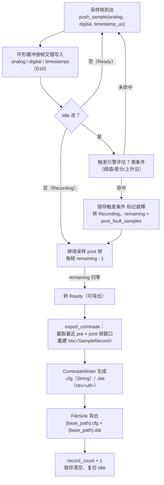
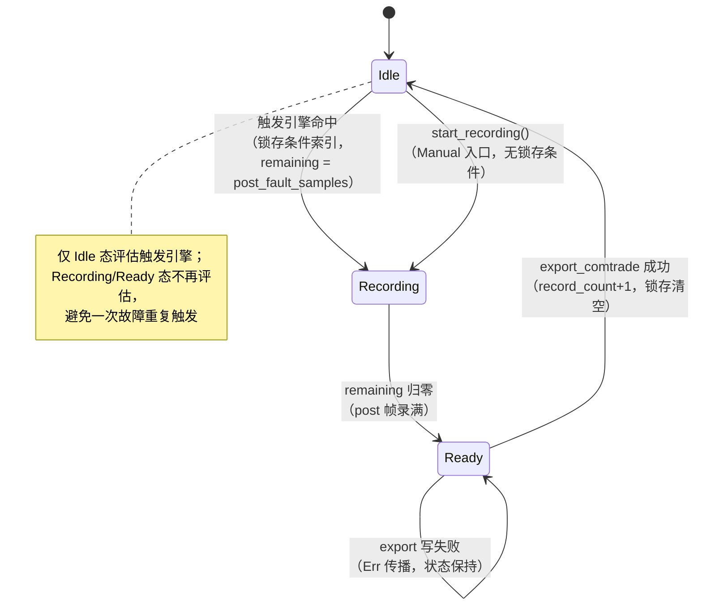

# EnerOS 故障录波 COMTRADE 设计文档（v0.109.0）

> **版本**：v0.109.0
> **crate**：`eneros-fault-recorder`（`crates/protocols/fault-recorder/`）
> **依赖**：无（零第三方依赖，no_std + alloc）
> **状态**：已实现（环形采样缓冲 + 7 类故障触发条件 + COMTRADE .cfg/.dat 生成导出，31/31 测试通过）
> **覆盖版本**：v0.109.0（Phase 2 P2-H 第 1 版）
> **最后更新**：2026-07-20

---

## 目录

1. [概述](#1-概述)
2. [设计目标与范围](#2-设计目标与范围)
3. [架构设计](#3-架构设计)
4. [核心数据结构](#4-核心数据结构)
5. [接口设计](#5-接口设计)
6. [触发条件引擎](#6-触发条件引擎)
7. [COMTRADE C37.111 文件格式](#7-comtrade-c37111-文件格式)
8. [测试设计](#8-测试设计)
9. [偏差记录](#9-偏差记录)
10. [性能与内存预算](#10-性能与内存预算)
11. [安全与合规](#11-安全与合规)
12. [依赖与上下游](#12-依赖与上下游)

---

## 1. 概述

### 1.1 版本定位

v0.109.0 为 Phase 2 多机联邦阶段 P2-H（基础服务族）第 1 版，系路线图 v3.0 新增的基础服务版本。故障录波（Fault Recording）是电力事故追溯的法定数据源：故障时刻前后的电压/电流/开关量波形必须以 IEEE C37.111 COMTRADE 标准格式落盘，供标准分析工具（如 Sigra、Wavewin）解析。v0.55.0 已落地高频采样，v0.24.0 已落地文件系统，v0.108.0 已提供安全 SV 采样源，本版实现环形采样缓冲 + 7 类故障触发条件 + COMTRADE .cfg/.dat 文件生成导出，打通「采样 → 触发 → 录波 → 导出」链路，为 v0.110.0 云边同步提供可上传的录波文件。

### 1.2 设计目标

- **环形采样缓冲**（蓝图 §4.4/§4.5）：`RingSampleBuffer<T: Copy>` 固定容量、溢出覆盖最旧、`get_recent(n)` 按时间旧→新保序（D5）。
- **7 类故障触发条件**（蓝图 §4.4，D12）：过流/过压/低压/过频/变化率/数字量上升沿/手动；duration_ms 折算连续帧数；同帧多命中按配置序优先级。
- **COMTRADE C37.111-2013 文件生成**（蓝图 §5.1，D6~D9）：`ComtradeWriter` 无状态纯函数生成 .cfg（ASCII 配置）与 .dat（ASCII/BINARY/BINARY32 三种格式）。
- **FileSink 落盘抽象**（D4）：`FileSink` trait + `MockSink`，真实 littlefs2 接线在集成层。

### 1.3 设计原则

- **Simplicity First**：COMTRADE 仅生成侧（录波写盘），不自研解析器；触发引擎为逐帧阈值比较/差分/边沿检测，无复杂滤波。
- **no_std 全链路**：`#![cfg_attr(not(test), no_std)]` + `extern crate alloc`，零第三方依赖、零 unsafe、零 C FFI，交叉编译到 `aarch64-unknown-none`。
- **可测试性**：`MockSink` 记录写入路径与字节 + 一次性错误注入，31 个单元测试全部 src 内嵌，主机全过。

---

## 2. 设计目标与范围

### 2.1 范围内（本版交付）

| 交付物 | 说明 |
|--------|------|
| `crates/protocols/fault-recorder/` | eneros-fault-recorder crate（ring_buffer.rs / trigger.rs / comtrade_writer.rs / lib.rs） |
| `configs/fault-recorder.toml` | `[recorder]` 采样率/前后窗/缓冲 + `[[triggers]]` 触发条件模板 + `[comtrade]` 站点配置 |
| 本文档 | 12 章节设计文档 + D1~D12 偏差表 |
| 31 个单元测试 | RB×6 + TG×7 + CW×9 + FR×8 + PERF×1（src 内嵌 `#[cfg(test)]`，D3） |

### 2.2 范围外（集成层/下游版本）

- **真实文件系统接线**：littlefs2（v0.24.0）挂载与 `FileSink` 真实实现属集成层（D4）。
- **录波文件上传**：v0.110.0 云边同步负责将录波文件上传云端/主站。
- **COMTRADE 解析**：仅生成不解析；标准分析工具（Sigra/Wavewin）承担解析侧。
- **真实硬件触发时延实测**：实验室项（D12，见 §10）。

---

## 3. 架构设计

### 3.1 模块划分

| 模块 | 职责 | 核心类型/函数 |
|------|------|--------------|
| `ring_buffer.rs` | 固定容量环形采样缓冲（溢出覆盖最旧，旧→新保序，D5） | `RingSampleBuffer<T>` |
| `trigger.rs` | 7 类触发条件 + 持续帧数语义 + 配置序优先级（D12） | `TriggerType` / `TriggerCondition` / `TriggerEngine`（pub(crate)） |
| `comtrade_writer.rs` | C37.111-2013 .cfg/.dat 生成（无状态纯函数，D6~D9） | `ComtradeWriter` / `ChannelConfig` / `ComtradeConfig` / `ComtradeFormat` / `SampleRecord` / `Phase` |
| `lib.rs` | FaultRecorder 状态机 + 交错双缓冲（D10）+ FileSink 抽象（D4）+ 错误模型（D12）+ 模块声明 + 重导出 + crate 文档 | `FaultRecorder` / `RecorderConfig` / `RecorderState` / `RecorderError` / `FileSink` / `MockSink` |

### 3.2 录波流程



> 注：窗口截取以导出时刻为基准取最近 pre+post 帧——因 Ready 态恰在触发帧后 post 帧到达，最近 pre+post 帧窗口天然覆盖「触发前 pre 帧 + 触发帧 + 触发后 post 帧」（FR30 验证窗口值回放一致）。

---

## 4. 核心数据结构

| 类型 | 说明 | 关键字段 | derive |
|------|------|---------|--------|
| `RecorderConfig` | 录波配置（`FaultRecorder::new` 入参） | `channels: Vec<ChannelConfig>` / `triggers: Vec<TriggerCondition>` / `comtrade: ComtradeConfig` / `pre_fault_samples: usize` / `post_fault_samples: usize` / `sample_rate: u32` / `buffer_frames: usize`（≥ pre+post，D10） | Debug/Clone/PartialEq |
| `RecorderState` | 录波状态机 | `Idle`（评估触发）/ `Recording`（录 post 帧）/ `Ready`（可导出） | Debug/Clone/Copy/PartialEq |
| `RecorderError` | 错误模型（4 变体，D12） | `IoError`（FileSink 上报）/ `InvalidConfig`（channels 空/sample_rate=0/buffer<pre+post）/ `NotReady`（非 Ready 态导出）/ `ChannelMismatch`（切片长度与配置不符） | Debug/Clone/PartialEq |
| `ChannelConfig` | 通道配置 | `channel_id: String` / `channel_name: String` / `phase: Phase` / `unit: String` / `scale_factor: f32`（a）/ `offset: f32`（b） | Debug/Clone/PartialEq |
| `Phase` | 相别（`None` = 数字量通道，蓝图约定） | `A / B / C / N / None` | Debug/Clone/Copy/PartialEq |
| `TriggerCondition` | 触发条件 | `trigger_type: TriggerType` / `threshold: f32` / `duration_ms: u32` / `channel: String`（匹配 channel_id） | Debug/Clone/PartialEq |
| `TriggerType` | 触发类型（7 变体，见 §6） | `OverCurrent / OverVoltage / UnderVoltage / OverFrequency / RateOfChange / DigitalEvent / Manual` | Debug/Clone/Copy/PartialEq |
| `ComtradeConfig` | COMTRADE 站点配置 | `station_name: String` / `device_id: String` / `revision_year: u16` / `file_format: ComtradeFormat` | Debug/Clone/PartialEq |
| `ComtradeFormat` | 数据文件格式（D9） | `Ascii / Binary / Binary32` | Debug/Clone/Copy/PartialEq |
| `SampleRecord` | 单帧采样记录（导出窗口重建结果） | `sample_num: u32`（从 1 起）/ `timestamp_us: u32`（相对首帧微秒）/ `analog: Vec<f32>` / `digital: Vec<bool>` | Debug/Clone/PartialEq |
| `RingSampleBuffer<T>` | 固定容量环形缓冲（D5） | `data: Vec<T>` / `capacity` / `write_pos` / `samples_written: u64` | — |

**FaultRecorder 内部表示**（D10 交错双缓冲 + 时间戳缓冲）：

- `analog: RingSampleBuffer<f32>`（容量 frames×n_analog，帧 i 通道 c 位于 i×n_analog+c）
- `digital: RingSampleBuffer<bool>`（容量 frames×n_digital，同构交错）
- `timestamps: RingSampleBuffer<u64>`（容量 frames，帧级时间戳）
- `prev_analog / prev_digital`：上一帧基线（RateOfChange 差分 / DigitalEvent 边沿判定）；首帧以当前帧自身初始化，避免边沿误判
- `latched_trigger: Option<usize>`：锁存命中条件索引（供 `check_triggers` 取引用）
- `remaining / frame_count / record_count`：post 帧倒计时 / 累计帧号 / 累计导出次数

---

## 5. 接口设计

以下签名全部提取自实际源码，与 spec.md 接口契约一致。

### 5.1 FaultRecorder（lib.rs）

```rust
pub struct FaultRecorder { /* 字段私有（D10 交错双缓冲 + 时间戳缓冲 + TriggerEngine + 状态机） */ }
impl FaultRecorder {
    pub fn new(config: RecorderConfig) -> Result<Self, RecorderError>;
    pub fn push_sample(&mut self, analog: &[f32], digital: &[bool], timestamp_us: u64)
        -> Result<(), RecorderError>;
    pub fn check_triggers(&self) -> Option<&TriggerCondition>;   // 锁存触发（D12）
    pub fn start_recording(&mut self);                            // Manual 入口（仅 Idle 生效）
    pub fn export_comtrade<S: FileSink>(&mut self, sink: &mut S,
        base_path: &str, time_str: &str) -> Result<(), RecorderError>;   // 仅 Ready 态（D4/D11）
    pub fn state(&self) -> RecorderState;
    pub fn record_count(&self) -> usize;
}
```

### 5.2 FileSink 抽象与 MockSink（lib.rs，D4）

```rust
pub trait FileSink {
    fn write_file(&mut self, path: &str, data: &[u8]) -> Result<(), RecorderError>;
}

pub struct MockSink { /* written: Vec<(String, Vec<u8>)> + inject_error: bool */ }
impl MockSink {
    pub fn new() -> Self;
    pub fn inject_write_error_once(&mut self);             // 下一次 write_file 返回 Err(IoError)
    pub fn written(&self) -> &[(String, Vec<u8>)];
    pub fn get(&self, path: &str) -> Option<&[u8]>;
    pub fn len(&self) -> usize;
    pub fn is_empty(&self) -> bool;
}
```

### 5.3 ComtradeWriter（comtrade_writer.rs，无状态纯函数）

```rust
pub struct ComtradeWriter;
impl ComtradeWriter {
    pub fn write_cfg(config: &ComtradeConfig, channels: &[ChannelConfig],
        total_samples: usize, sample_rate: u32, time_str: &str) -> String;   // D6/D7/D8
    pub fn write_dat(records: &[SampleRecord], channels: &[ChannelConfig],
        format: ComtradeFormat) -> Vec<u8>;                                   // D9
}
impl ChannelConfig {
    pub fn phase_str(&self) -> &'static str;   // A/B/C/N；数字量为空串
    pub fn is_analog(&self) -> bool;           // phase != Phase::None
}
```

### 5.4 RingSampleBuffer（ring_buffer.rs）

```rust
pub struct RingSampleBuffer<T: Copy> { /* data: Vec<T>, capacity, write_pos, samples_written（D5） */ }
impl<T: Copy + Default> RingSampleBuffer<T> {
    pub fn new(capacity: usize) -> Self;   // capacity=0 退化为空缓冲（见 §9.2）
    pub fn push(&mut self, value: T);      // 满则覆盖最旧
    pub fn push_slice(&mut self, slice: &[T]);
    pub fn get_recent(&self, n: usize) -> Vec<T>;   // 旧→新保序，min(n, len())
    pub fn len(&self) -> usize;
    pub fn is_empty(&self) -> bool;
    pub fn capacity(&self) -> usize;
}
```

### 5.5 触发引擎（trigger.rs，pub(crate) 内部实现）

```rust
pub enum TriggerType {
    OverCurrent, OverVoltage, UnderVoltage, OverFrequency, RateOfChange, DigitalEvent, Manual,
}  // Debug/Clone/Copy/PartialEq
pub struct TriggerCondition {               // Debug/Clone/PartialEq
    pub trigger_type: TriggerType,
    pub threshold: f32,
    pub duration_ms: u32,
    pub channel: String,
}

pub(crate) struct TriggerEngine { /* conditions / consec / required */ }
impl TriggerEngine {
    pub(crate) fn new(conditions: Vec<TriggerCondition>, sample_rate: u32) -> Self;
    pub(crate) fn evaluate(&mut self,
        ch_idx: impl Fn(&str) -> Option<(bool, usize)>,   // 通道名 → (is_digital, idx)
        analog: &[f32], prev_analog: &[f32],
        digital: &[bool], prev_digital: &[bool]) -> Option<usize>;
    pub(crate) fn conditions(&self) -> &[TriggerCondition];
}
```

---

## 6. 触发条件引擎

### 6.1 7 类触发语义（D12）

| 类型 | 每帧命中判定 | 绑定通道 | 说明 |
|------|-------------|---------|------|
| `OverCurrent` | `v > threshold` | 模拟量 | 过电流 |
| `OverVoltage` | `v > threshold` | 模拟量 | 过电压 |
| `OverFrequency` | `v > threshold` | 模拟量 | 过频率 |
| `UnderVoltage` | `v < threshold` | 模拟量 | 低电压 |
| `RateOfChange` | `|v - v_prev| > threshold` | 模拟量 | 相邻帧差分绝对值（突变检测） |
| `DigitalEvent` | `!prev && cur`（上升沿） | 数字量 | false→true 命中；持续 true 不重复 |
| `Manual` | 不自动评估 | — | 仅 `FaultRecorder::start_recording()` 显式触发 |

通道匹配按 `channel` 字符串查 `ChannelConfig.channel_id`：先查模拟通道命名空间、后查数字通道命名空间（lib.rs `channel_lookup`）；未匹配视为不命中。

### 6.2 duration_ms 帧折算（D12）

蓝图 `TriggerCondition` 有 `duration_ms` 字段但零语义定义，本版补全：

```
required = max(1, duration_ms × sample_rate / 1000)     // 触发所需连续命中帧数
```

- 每帧评估后：命中则 `consec[i] += 1`，否则 `consec[i] = 0`；`consec[i] >= required[i]` 即触发并复位该条件计数（触发后可再次触发）。
- 示例：4000Hz、duration_ms=10 → required=40；连续 39 帧超阈值后回落不触发，再连续 40 帧方触发（TG7）。
- duration_ms=0 → required=1（单帧即触发）。

### 6.3 配置序优先级

同帧多条件命中按**配置顺序取首个**（最小索引）作为本帧触发返回；所有条件的计数器每帧全量更新（不短路），保证非首个命中条件的持续帧计数状态正确推进（见 §9.2）。

### 6.4 录波状态机（蓝图 §4.3）



---

## 7. COMTRADE C37.111 文件格式

### 7.1 .cfg 配置文件（ASCII，行序严格按 C37.111-2013 §5.4~5.6）

完整示例（2 模拟量 + 1 数字量、4000Hz、800 采样，CW14~CW17 验证）：

```
SubA,FR01,2013                          ← 行1：station_name,device_id,rev_year
3,2A,1D                                 ← 行2：TT,nA,nD（A/D 后缀，D6）
A1,Ia,A,,A,0.1,0,0,-32767,32767,1,1,P   ← 模拟量行：13 字段（An,ch_id,ph,,uu,a,b,0,min,max,1,1,P，D8）
A2,Ib,A,,A,1,2,0,-32767,32767,1,1,P
D1,CB,,,0                               ← 数字量行：Dn,ch_id,,,0（D8）
50                                      ← 线路频率行（Hz，D7）
1                                       ← 采样率档数行（D7）
4000,800                                ← 档行：samp_rate,total_samples（D7）
20/07/2026,10:00:00.123456              ← 首采样时间戳 dd/mm/yyyy,hh:mm:ss.ssssss（D7/D11）
20/07/2026,10:00:00.123456              ← 触发点时间戳（同格式，由 time_str 承载）
ASCII                                   ← 文件类型行：ASCII / BINARY / BINARY32
1                                       ← 时标乘数行
```

- 模拟量行 `a = scale_factor`、`b = offset` 必须写出（D8）：缺 a/b 则二进制量化值无法还原工程量。
- 两行时间戳由调用方传预格式化字符串（D11：no_std 无日历转换，集成层 RTC 格式化，v0.12.0）。

### 7.2 .dat 数据文件（三种格式，D9）

**通用逆变换量化**（所有格式一致）：

```
raw = round((v - b) / a)                // a == 0 按 1 处理
```

量化值钳位目标位宽后写出；cfg 的 a/b 与 dat 量化值互逆（分析工具按 `v = a × raw + b` 还原工程量）。

| 格式 | 布局（逐记录） | 模拟量位宽 | 钳位范围 |
|------|---------------|-----------|---------|
| `ASCII` | `sample_num,timestamp_us,raw…,dig…` 逐行文本（数字量 0/1 逐列） | 整数十进制文本 | — |
| `BINARY` | sample_num u32 LE + timestamp u32 LE + n×i16 LE + 数字量 16 位字打包 | i16 LE | ±32767 |
| `BINARY32` | sample_num u32 LE + timestamp u32 LE + n×i32 LE + 数字量 16 位字打包 | i32 LE | i32::MIN~MAX |

**数字量 16 位字打包**（BINARY/BINARY32）：每 16 个数字通道打包为 1 个 u16 LE 字（位 i = 通道 i，1 = true）；不足 16 位仍写完整字。示例：`[true,false,true]` → `0b101 = 5`（u16 LE 2 字节，CW22）。

> D9 修正：BINARY32 为 32 位**整数** LE（蓝图误写 f32 LE，f32 对应 2013 REAL32 格式）；数字量按 16 位字打包（蓝图按 8 位字节打包不合规）。

---

## 8. 测试设计

31 个单元测试全部 src 内嵌 `#[cfg(test)]`（D3），不新增 `tests/` 文件。31/31 主机全过。

| 组 | 编号 | 数量 | 覆盖点 |
|----|------|------|--------|
| ring_buffer | RB1~RB6 | 6 | push+get_recent 基本序 / 溢出覆盖保序 / 未写满读取 / capacity=1 / push_slice / len+capacity+is_empty |
| trigger | TG7~TG13 | 7 | 过流阈值+duration 帧数（39 帧不触发/40 帧触发）/ 低压 v<threshold / 变化率相邻差分 / 数字量上升沿（持续 true 不重复、下降沿不命中）/ Manual 不自动触发 / 同帧多条件配置序优先级 / 触发后计数复位可再触发 |
| comtrade_writer | CW14~CW22 | 9 | cfg 第 1/2 行（TT,nA,nD）/ 模拟量 13 字段含 a/b / 数字量行 / 频率+档数+档行+时间戳行序（12 行）/ ASCII dat 行格式 / BINARY 布局（u32+u32+i16×n+16 位字）/ BINARY 逆变换量化+钳位 / BINARY32 i32 / 数字量 16 位打包 |
| recorder | FR23~FR30 | 8 | new 校验 InvalidConfig（buffer<pre+post / sample_rate=0 / channels 空）/ push_sample 长度 ChannelMismatch / 全流程 Idle→Recording→Ready→export→Idle / 导出文件内容（cfg 行 + dat 记录数=pre+post）/ NotReady 拒绝且 sink 无写入 / record_count 递增 / 手动 start_recording（非 Idle 不生效）/ 窗口数据正确性（触发点前后值回放一致） |
| perf | PERF31 | 1 | 4000 次 push_sample（4 通道 4 条件含触发评估）< 1000ms（cfg(test) Instant，D12） |

---

## 9. 偏差记录

### 9.1 D1~D12（与 spec.md 逐字一致）

| 编号 | 偏差 | 理由 |
|------|------|------|
| **D1** | 蓝图 `crates/fault_recorder/` → `crates/protocols/fault-recorder/`（eneros-fault-recorder） | 记忆 §2.3.1 强制：crate 归 `crates/<subsystem>/`；录波为设备协议族基础服务，与 soe-engine（事件触发引擎）同 protocols 子系统先例 |
| **D2** | 蓝图 `docs/phase2/comtrade.md` → `docs/protocols/fault-recorder-comtrade-design.md` | 记忆 §2.3.3 强制：文档按方向分类 |
| **D3** | 蓝图 `tests/comtrade_parse.rs` → src 内嵌 `#[cfg(test)]` | v0.87.0~v0.108.0 项目惯例，不新增 tests/ 文件 |
| **D4** | 删除蓝图 `fs::write(path, ...)` 直接文件调用；新增 `FileSink` trait（`write_file(path, data)`）+ `MockSink`（置于 lib.rs，记录写入路径与字节）；真实 littlefs2 接线在集成层 | no_std 无 `std::fs`；主机可测；与 v0.106.0 D4 MmsTransport / v0.107.0 D4 L2Transport 同先例；`ComtradeWriter` 改为返回 String/Vec<u8> 纯函数 |
| **D5** | 蓝图 `RingSampleBuffer { data: Box<[T]> }` → `Vec<T>` 固定容量 | no_std 下 `Vec::with_capacity` 更直观（v0.108.0 D6 同先例） |
| **D6** | 蓝图 bug 修复①：cfg 第 2 行 `{n},{nA},{nD}` 缺 A/D 后缀 → 补 C37.111 合规 `TT,nA,nD` 格式 | C37.111-2013 §5.4 要求通道计数行带 A/D 后缀（如 `3,2A,1D`）；缺后缀标准工具解析失败 |
| **D7** | 蓝图 bug 修复②：cfg 结构缺行/错序——补线路频率行（50）；档数行为采样率档数（1）而非采样率值；档行 `samp_rate,total_samples`（蓝图写成 `total_samples,sample_rate` 错序且把采样率当档数）；时间戳行补 `dd/mm/yyyy,hh:mm:ss.ssssss`（蓝图仅 `hh:mm:ss` 无日期，不合规）；删除蓝图无意义的 `1,1s,1` 行 | C37.111-2013 §5.5/§5.6 强制行序；蓝图各行自相矛盾，录波文件无法被标准工具解析 |
| **D8** | 蓝图 bug 修复③：模拟量通道行补全 13 字段含 a=scale_factor/b=offset（蓝图 ChannelConfig 定义了缩放却未写出）；数字量行 `Dn,ch_id,,,0` | C37.111-2013 §5.4.2 模拟量行 13 字段（An,ch_id,ph,ccbm,uu,a,b,skew,min,max,primary,secondary,PS）；缺 a/b 则二进制量化值无法还原工程量 |
| **D9** | 蓝图 bug 修复④：BINARY32 语义修正为 i32 整数 LE（蓝图误写 f32 LE，f32 对应 2013 REAL32 格式）；BINARY/BINARY32/ASCII 模拟量统一按 `raw=round((v-b)/a)` 逆变换量化并钳位（蓝图 `v as i16` 截断且忽略缩放）；数字量按 16 位字打包（蓝图按 8 位字节打包不合规）；`write_dat` 增加 `channels` 参数承载 a/b（蓝图签名缺失） | C37.111-2013 §6/附录：BINARY=i16、BINARY32=i32、数字量 16 位字；cfg 的 a/b 与 dat 量化值必须互逆，否则分析工具还原值错误 |
| **D10** | 环形缓冲多通道承载：蓝图 `analog_buf: RingSampleBuffer<f32>` 单缓冲无法区分通道 → 按帧交错存储（帧×通道数+通道索引），数字量同构，时间戳独立 `RingSampleBuffer<u64>`；对外帧级 API `push_sample`/`get_recent_frames` | 蓝图数据结构自相矛盾（多通道采样压入单 f32 流无法回放）；交错存储零额外分配、保持 T: Copy |
| **D11** | 时间注入：`push_sample(timestamp_us)` 由调用方携带时间戳；`export_comtrade(time_str)` 的 cfg 时间戳行由调用方传预格式化字符串（集成层 RTC 格式化，v0.12.0）；蓝图 `fs::write` 内写死 `00:00:00.000000` 占位 | no_std 无系统时间/日历转换（v0.107.0 D6 / v0.108.0 D9 注入先例）；录波时间戳必须来自真实 RTC 才有事故追溯价值 |
| **D12** | 错误模型 `RecorderError` = IoError / InvalidConfig / NotReady / ChannelMismatch（4 变体）；触发语义补全：duration_ms 折算连续帧数、RateOfChange 相邻差分、DigitalEvent 上升沿、Manual 仅 `start_recording()`、冲突按配置序优先级；`check_triggers()` 返回锁存触发引用（蓝图 `&self` 签名保留）；性能 <1ms 落地为 cfg(test) Instant 断言（主机口径，真实硬件为实验室项） | 蓝图 TriggerCondition 有 duration_ms 字段但零语义定义（无法落地）；错误变体覆盖各失败面（对齐 v0.107.0/v0.108.0 D10 精简风格） |

### 9.2 实施增量偏差（代码阶段发现）

以下 6 项为源码实现阶段相对 spec 接口/蓝图的增量约定，已逐条对照实际代码确认：

1. **TriggerEngine 同帧多命中：计数器全量更新，仅返回最小索引**。spec 声明「同帧多条件命中按配置顺序取首个」；实现为 `evaluate` 每帧遍历**所有**条件并更新各自的 `consec` 计数（不短路），命中达 required 即复位，但返回值只取首个触发条件索引（`if fired.is_none() { fired = Some(i); }`）。语义等价且更正确：非首个命中条件的持续帧计数不会被跳过滞留（TG12 验证返回最小索引 0）。
2. **`ch_idx` 闭包签名 `impl Fn(&str) -> Option<(bool, usize)>`**。spec 仅声明「TriggerEngine 为 pub(crate) 内部实现」未给出签名；实现采用调用方注入通道查询闭包（`Fn(&str) -> Option<(is_digital, idx)>`），由 lib.rs 私有函数 `channel_lookup` 提供（先查模拟通道命名空间、后查数字通道命名空间），引擎本体不持有 channels 引用，规避借用冲突。
3. **`RingSampleBuffer::new(0)` 退化空缓冲 + 补充 `is_empty()` 访问器**。spec 接口契约未定义 capacity=0 语义、未列 `is_empty`；实现显式定义容量 0 时 `push` 丢弃、`get_recent` 恒空（ring_buffer.rs 模块文档已声明）——对应数字量通道数为 0 时 `digital` 缓冲即 `new(0)` 的真实场景（FR30 单模拟通道配置）；`is_empty()` 为惯用访问器补齐。
4. **FR 测试拆分 fr25 + fr26**。spec 测试矩阵 FR23~FR30 的「全流程 Idle→Recording→Ready→export→Idle」与「导出文件内容（cfg+dat 记录数=pre+post）」两个覆盖点，实现拆分为 `fr25_full_flow_idle_recording_ready_export`（状态机流转 + MockSink 两文件 + record_count=1 + 复位 Idle + 锁存清空）与 `fr26_export_dat_contains_pre_plus_post_records`（cfg 行 `2,1A,1D` / `1000,8` + dat 行数 = pre+post）两个独立测试，总测试数 31 不变。
5. **PERF31 实测口径**。spec 场景要求「4000 次 push_sample 总耗时 < 1000ms（等效单帧 < 0.25ms）」；实现为 `cfg(test)` 下 `std::time::Instant` 主机断言（2 模拟 + 2 数字通道、4 触发条件、4000Hz 帧率），真实硬件单帧触发检测 < 1ms 为实验室项（D12），集成阶段在目标硬件（飞腾/鲲鹏/QEMU）补测。
6. **`quantize()` 舍入缺失修复（checklist 核验发现）**。D9 声明模拟量逆变换为 `raw = round((v - b) / a)`（四舍五入）；`comtrade_writer.rs` 的 `quantize()` 实现返回 `(v - b) / a` 后直接 `as i16/i32/i64`（Rust 浮点转整数为向零截断），缺 `.round()`。既有测试取值 trunc==round 无法区分，checklist 核验时定位到该偏差：v=12.36、a=0.1 → 期望 124、截断实际 123。已修复为手动舍入 `adj - (adj % 1.0)`（其中 `adj = x ± 0.5`，等价 half away from zero；`f64::round` 属 libm 方法 no_std 不可用，仅用 core 运算、零新依赖），并新增 `cw23_quantize_rounds_half_up` 测试（ASCII 断言 `1,0,124` + Binary 断言 i16 LE=124）防回归，测试总数 31 → 32。

---

## 10. 性能与内存预算

### 10.1 触发检测性能（蓝图 §6.3/§7.2，D12 口径声明）

- **目标**：4000Hz 帧率下单帧触发检测 < 1ms。
- **口径声明**：性能验收为 `#[cfg(test)]` 主机 `std::time::Instant` 断言（PERF31：4000 次 `push_sample` 含 4 条件触发评估总耗时 < 1000ms，等效单帧 < 0.25ms，满足 < 1ms）；**真实硬件触发时延为实验室项**，集成阶段在目标硬件上补测（与 v0.107.0 D11 / v0.108.0 D11 同口径）。
- **复杂度**：每帧触发评估 O(条件数) 阈值比较；环形缓冲 `push` O(1)（定长索引写）；`get_recent` O(n)；导出窗口重建 O(pre+post)。

### 10.2 内存预算（蓝图 §43.6，记忆 §5.6）

本 crate 属 **Agent Runtime 管理信息大区**（≤ 64 MB 预算）。录波缓冲占用公式：

```
内存占用 = buffer_frames × (n_analog × 4 + n_digital + 8) 字节
          ────────────   ───────────   ──────────   ────
            帧容量        模拟量 f32     数字量 bool   u64 时间戳
```

| 项目 | 示例值 | 说明 |
|------|--------|------|
| 典型配置 | buffer_frames=8000、8 模拟 + 8 数字 | 8000 × (32 + 8 + 8) ≈ **375 KB** |
| 管理信息大区总预算 | ≤ 64 MB | 与 Agent Runtime 其他组件共享；OOM 策略：降级到规则引擎 |
| OOM 阈值 | 总用量 > 90% | 触发 OOM handler：冻结非关键 Agent（蓝图 §43.6） |

- Vec 分配走 v0.11.0 用户堆 `alloc`；零 `unsafe`，无堆外内存。
- `buffer_frames ≥ pre_fault_samples + post_fault_samples` 为 `FaultRecorder::new` 硬校验（否则 `InvalidConfig`）。

### 10.3 GPU 不适用声明

录波触发为逐帧阈值比较/差分/边沿检测 workload，COMTRADE 写盘为文本/二进制序列化：无矩阵运算、无大规模张量，GPU 加速无意义。记忆 §4.2 GPU 优先规则仅适用模型训练/校准与数字孪生仿真，不适用协议栈路径。**本 crate 零 GPU 代码**，纯 CPU 处理（蓝图 §6.6）。

---

## 11. 安全与合规

- **录波文件完整性**：录波文件为事故追溯的法定数据源。`.cfg` 的 a/b 缩放与 `.dat` 量化值严格互逆（D9），保证分析工具还原工程量不失真；窗口截取以 u64 时间戳缓冲为基准，`timestamp_us` 相对首帧微秒（`wrapping_sub` 防回绕）；导出窗口数据正确性由 FR30 回放验证。
- **时间可信**：时间戳由调用方注入真实 RTC（D11，v0.12.0；蓝图 §5.6 时间同步链），crate 内不写死占位时间——录波时间戳必须来自真实 RTC 才有事故追溯价值。
- **标准合规**：C37.111 为 IEEE 开放国际标准，**无国产化替代限制**（蓝图 §5.6）；本实现修复蓝图 4 处格式 bug（D6~D9）后严格符合 C37.111-2013 行序与字段定义，可被 Sigra/Wavewin 等标准工具解析。
- **no_std 合规**：`#![cfg_attr(not(test), no_std)]` + `extern crate alloc`，仅使用 `alloc::*` / `core::*`，零第三方依赖、零 unsafe、零 C FFI，可交叉编译到 `aarch64-unknown-none`（蓝图 §43.1）。
- **传输安全**：录波文件上传链路（v0.110.0 云边同步）的加密认证由下游版本与纵向加密体系（v0.98.1）承担，本 crate 不涉密钥材料。

---

## 12. 依赖与上下游

### 12.1 上游依赖

| 版本 | 交付 | 本版消费点 |
|------|------|-----------|
| v0.55.0 高频采样 | 高速采样数据源 | `push_sample` 的 4kHz 帧流来源 |
| v0.24.0 文件系统 | littlefs2 落盘 | 集成层实现 `FileSink` 真实接线（D4） |
| v0.108.0 SV 安全采样 | IEC 61850-9-2 安全采样流 | 录波模拟量/数字量采样源（联邦场景） |
| v0.12.0 RTC | 实时时钟 | 帧时间戳与 cfg 时间戳行注入（D11） |

### 12.2 下游解锁

| 版本 | 交付 | 消费点 |
|------|------|--------|
| v0.110.0 云边同步 | 录波文件上传云端/主站 | 消费本版生成的 `.cfg` / `.dat` 标准录波文件 |

### 12.3 参考

- **IEEE C37.111-2013**：电力系统暂态数据交换通用格式（COMTRADE）
- **蓝图 `phase2.md` §v0.109.0**：P2-H 第 1 版版本蓝图（9 节齐全）
- **spec**：`.trae/specs/develop-v10900-fault-recorder-comtrade/spec.md`
- **配置模板**：`configs/fault-recorder.toml`
- **同族先例**：`docs/protocols/iec61850-sv-design.md`（v0.108.0，L2Transport/环形缓冲同构模式）

---

> **GPU 不适用**：本 crate 无 GPU 代码，纯 CPU 逐帧比较与序列化（蓝图 §6.6）。
>
> **性能口径**：触发检测 < 1ms 为 cfg(test) 主机 Instant 断言口径（D12），真实硬件为实验室项。
>
> **下游解锁**：v0.110.0 云边同步基于本版录波文件构建上传链路。
