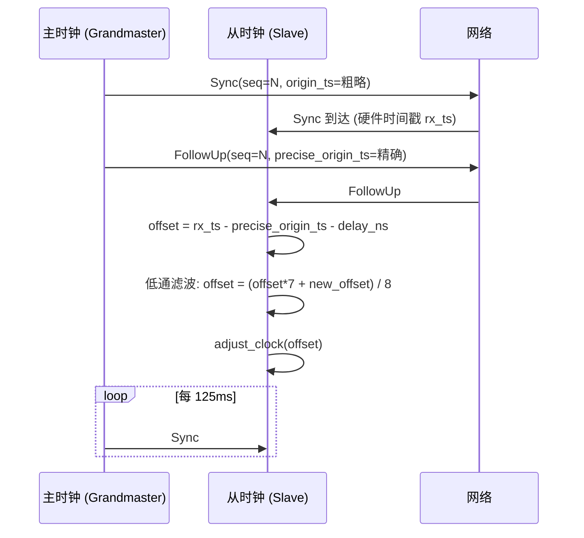

# EnerOS v0.79.0 gPTP 时间同步设计文档

> **版本**：v0.79.0
> **Phase**：Phase 2 多机联邦
> **子系统**：`crates/protocols/tsn-time`
> **文档状态**：设计态
> **覆盖版本**：v0.79.0（gPTP 时间同步）
> **最后更新**：2026-07-17

---

## 1. 版本目标

### 1.1 核心目标

v0.79.0 在 v0.75.0~v0.78.0 已建立的联邦骨架与消息签名层之上，为园区内多 Edge Box 之间引入 **IEEE 802.1AS（gPTP）跨节点时间同步的类型与算法骨架**，使联邦内所有节点共享统一的高精度时钟基线，具体包括：

1. **主从时钟模型**：定义 `GptpClock` 作为节点级时钟抽象，支持主时钟（Grandmaster）与从时钟（Slave）两种角色，时钟差目标 < 1ms。
2. **BMCA 选举**：实现最佳主时钟算法（Best Master Clock Algorithm），通过 `compare_priority` 完成三层平局打破（`priority1` / `clock_quality` / `clock_identity`），在多节点环境中自动选举最优主时钟。
3. **低通滤波偏移计算**：`adjust_clock` 接受偏移量后采用 `(offset*7 + new_offset) / 8` 一阶 IIR 低通滤波，抑制网络抖动导致的时钟阶跃。
4. **Sync / FollowUp 消息骨架**：定义 `SyncMessage` 与 `FollowUpMessage` 类型，匹配 gPTP 两步同步模型（Sync 携带粗略时间戳，FollowUp 携带精确时间戳）。

### 1.2 业务价值

- **联邦多机时间一致性**：是 SOE（Sequence of Events）事件排序、分布式追踪、TSN 调度的前置条件。
- **TSN 调度解锁**：v0.80.0 TSN 调度依赖本版本提供的时钟基线（P2-B 子阶段起点）。
- **审计取证基线**：与 v0.78.0 消息签名层的 `timestamp` 字段形成可信时间证据链，避免各节点本地时钟漂移导致的审计歧义。
- **降级路径保障**：当 gPTP 主时钟丢失时，BMCA 自动重新选举新主时钟，避免时间服务单点故障导致联邦功能降级。

### 1.3 Phase 定位

| 维度 | 定位 |
|------|------|
| Phase | Phase 2 多机联邦（v0.75.0~v0.126.0） |
| 子阶段 | P2-B 时间同步子阶段（v0.79.0~v0.80.0） |
| 依赖关系 | 上承 v0.78.0 消息签名层；下接 v0.80.0 TSN 调度 |
| 关键性 | 非刚性版本，但为 v0.80.0 TSN 调度的必要前置 |

### 1.4 出口关联

本版本不构成 Phase 出口条件，但其交付物 `GptpClock` 与 BMCA 算法骨架将被以下后续版本直接复用：

- **v0.80.0** TSN 调度：依赖本版本提供的时间基线进行时间感知整形（TAS）调度。
- **v0.78.0 消息签名层**：本版本落地后可替换 `now: u64` 注入参数为 gPTP 提供的高精度时钟。
- **SOE 引擎**：事件时间戳从本地时钟升级为 gPTP 同步时钟，保证跨节点事件排序正确性。

---

## 2. 前置依赖

### 2.1 前序版本依赖

| 版本 | 交付物 | 本版本使用方式 |
|------|--------|---------------|
| v0.27.0 | 网卡驱动（含硬件时间戳接口） | 本版本仅声明 `Port.hw_timestamping: bool` 标志位（偏差 D8），实际网卡时间戳接口在硬件集成阶段接入 |
| v0.12.0 | RTC/时钟服务 | 本版本不直接调用，但 `PtpTime` 与 RTC 时钟的单位对齐（纳秒）由上层协调 |
| v0.78.0 | 消息签名层 | 后续版本将 Announce 消息结合签名验证（本版本仅类型定义，不集成签名） |

### 2.2 外部依赖

| 依赖 | 版本 | 用途 | feature |
|------|------|------|---------|
| `alloc` | core 自带 | `Vec` 用于候选列表（BMCA 排序） | 默认 |
| `heapless` | ≥ 0.8 | 无堆场景的端口数组（`heapless::Vec<Port, N>`） | 默认 |

> **说明**：本版本为算法骨架，不引入任何外部网络栈或 PTP 库依赖。`smoltcp` 在 v0.28.0 已集成，但本版本不通过 smoltcp 收发报文（偏差 D5：无真实网络 I/O）。

### 2.3 假设

1. **拓扑稳定假设**：园区内网络拓扑稳定，主时钟节点可被选举且不会频繁切换。
2. **硬件时间戳假设**：目标网卡支持 PTP 硬件时间戳（如 Intel i210/i225），本版本仅通过 `hw_timestamping: bool` 标志位声明能力（偏差 D8）。
3. **单线程假设**：Agent Runtime 在 Phase 2 阶段为单线程模型（蓝图 §43.6 内存预算：Agent Runtime ≤ 64 MB），`GptpClock` 实现不要求 `Send + Sync`。
4. **时间注入假设**：本版本不提供 `PtpTime::now()`（偏差 D7：no_std 无系统时钟），由 `GptpClock::new()` 接受 `initial_time: PtpTime` 参数注入。

### 2.4 阻塞条件

- 若网卡不支持硬件时间戳，则退化为软件时间戳（精度约 10ms），无法满足 < 1ms 时钟差目标，但本版本的算法骨架仍可工作（偏差 D8）。
- 若 v0.27.0 网卡驱动时间戳接口未合入，则本版本仅交付类型与算法骨架，不进行实际网络集成（已在偏差 D5/D8 中声明）。

---

## 3. 交付物清单

### 3.1 代码交付物

| 路径 | 内容 | 说明 |
|------|------|------|
| `crates/protocols/tsn-time/src/lib.rs` | crate 入口与 T1~T25 测试 | 模块导出与单元测试内嵌（偏差 D4） |
| `crates/protocols/tsn-time/src/clock.rs` | PTP 时钟类型层 | `ClockIdentity` / `MacAddr` / `PtpTime` |
| `crates/protocols/tsn-time/src/port.rs` | 端口层 | `Port` / `PortRole` / `PortState` |
| `crates/protocols/tsn-time/src/bmca.rs` | BMCA 选举层 | `AnnounceMessage` / `BmcaResult` / `compare_priority` |
| `crates/protocols/tsn-time/src/gptp.rs` | gPTP 主时钟层 | `GptpClock` / `SyncMessage` / `FollowUpMessage` / `GptpConfig` |

> **偏差 D1**：crate 位于 `crates/protocols/tsn-time/`（项目规则 §2.3.1 子系统分组），非蓝图 `crates/tsn_time/`。

### 3.2 接口交付物

| 接口 | 类型 | 用途 |
|------|------|------|
| `GptpClock` | struct | 节点级 gPTP 时钟抽象 |
| `Port` | struct | gPTP 端口抽象（含硬件时间戳能力标志） |
| `Bmca`（逻辑模块） | 模块 | 最佳主时钟算法实现（`compare_priority` 自由函数） |
| `compare_priority` | fn | Announce 消息优先级比较（三层平局打破） |

### 3.3 文档交付物

| 路径 | 内容 |
|------|------|
| `docs/protocols/gptp-sync-design.md` | 本设计文档（偏差 D2：非蓝图 `docs/phase2/gptp_sync.md`） |

### 3.4 测试交付物

| 测试 ID | 类型 | 位置 |
|---------|------|------|
| T1~T25 | 单元测试 | `crates/protocols/tsn-time/src/lib.rs`（偏差 D4：内嵌而非 `tests/gptp_convergence.rs` / `tests/clock_drift.rs`） |

### 3.5 配置交付物

| 路径 | 内容 |
|------|------|
| `configs/gptp.toml` | gPTP 配置模板（偏差 D3：非蓝图 `config/gptp.toml`） |

---

## 4. 数据结构

> 本章节详细定义 gPTP 时间同步层所有公开数据结构。所有结构均满足 no_std 合规（蓝图 §43.1），不使用 `std::*`。

### 4.1 `ClockIdentity`

```rust
/// gPTP 时钟标识符，遵循 EUI-64 格式（8 字节）。
///
/// 偏差声明 D13：采用 `ClockIdentity(pub [u8; 8])` newtype，
/// 固定 8 字节数组对应 EUI-64，避免变长 Vec<u8> 的堆分配。
#[derive(Debug, Clone, Copy, PartialEq, Eq, PartialOrd, Ord, Hash)]
pub struct ClockIdentity(pub [u8; 8]);
```

**设计要点**：
- 实现 `Ord`：用于 BMCA 选举第三层平局打破（`clock_identity` 比较）。
- 固定 8 字节：对应 IEEE 802.1AS 的 EUI-64 标识格式，无需堆分配。
- 通常由网卡 MAC 地址扩展生成（MAC 6 字节 + 2 字节填充）。

### 4.2 `MacAddr`

```rust
/// 网卡 MAC 地址（6 字节）。
///
/// 偏差声明 D14：采用 `MacAddr(pub [u8; 6])` newtype，
/// 固定 6 字节数组对应 IEEE 802.3 MAC 格式。
#[derive(Debug, Clone, Copy, PartialEq, Eq, PartialOrd, Ord, Hash)]
pub struct MacAddr(pub [u8; 6]);
```

**设计要点**：
- 实现 `Display`：用于日志与调试输出（见 §5 接口实现）。
- 用于从网卡 MAC 生成 `ClockIdentity`（前 6 字节 + 2 字节填充）。

### 4.3 `PtpTime`

```rust
/// PTP 时间戳（纳秒精度）。
///
/// 偏差声明 D7：不提供 `PtpTime::now()`，no_std 无系统时钟。
/// 由 `GptpClock::new()` 接受 `initial_time: PtpTime` 参数注入。
#[derive(Debug, Clone, Copy, PartialEq, Eq, PartialOrd, Ord)]
pub struct PtpTime {
    /// 纳秒计数（自时钟纪元起）
    pub nanos: u64,
}
```

**字段说明**：
- `nanos: u64`：纳秒计数，最大可表示约 584 年时间跨度，满足长期运行需求。
- 不实现 `Default`：避免误用零值时间，强制调用方注入初始时间。

### 4.4 `PortRole`

```rust
/// gPTP 端口角色。
#[derive(Debug, Clone, Copy, PartialEq, Eq)]
#[repr(u8)]
pub enum PortRole {
    /// 主时钟端口（向下游发送 Sync 消息）
    Master = 0,
    /// 从时钟端口（接收 Sync 消息并同步）
    Slave = 1,
    /// 未决策状态（BMCA 选举中）
    Undefined = 2,
}
```

### 4.5 `PortState`

```rust
/// gPTP 端口状态。
#[derive(Debug, Clone, Copy, PartialEq, Eq)]
#[repr(u8)]
pub enum PortState {
    /// 初始化中
    Initializing = 0,
    /// 故障状态
    Faulty = 1,
    /// 已禁用
    Disabled = 2,
    /// 监听状态（等待 Announce）
    Listening = 3,
    /// 预主状态
    PreMaster = 4,
    /// 主状态
    Master = 5,
    /// 被动状态
    Passive = 6,
    /// 从状态
    Slave = 7,
}
```

### 4.6 `Port`

```rust
/// gPTP 端口抽象。
pub struct Port {
    /// 端口所属的 MAC 地址
    pub mac: MacAddr,
    /// 端口角色
    pub role: PortRole,
    /// 端口状态
    pub state: PortState,
    /// 是否支持硬件时间戳（偏差 D8：仅标志位，无实际降级逻辑）
    pub hw_timestamping: bool,
}
```

**设计要点**：
- `hw_timestamping: bool`：声明端口是否支持 PTP 硬件时间戳，本版本仅作为标志位（偏差 D8），硬件集成阶段由 v0.27.0 网卡驱动填充。
- 不实现 `Copy`：因 `MacAddr` 已实现 `Copy`，整个 `Port` 可派生 `Copy`，但本版本不派生以预留未来可变字段扩展空间。

### 4.7 `AnnounceMessage`

```rust
/// gPTP Announce 消息（BMCA 选举用）。
#[derive(Debug, Clone, PartialEq, Eq)]
pub struct AnnounceMessage {
    /// 发送方时钟标识
    pub grandmaster_identity: ClockIdentity,
    /// 第一优先级（数值越小优先级越高）
    pub priority1: u8,
    /// 时钟质量等级
    pub clock_quality: u8,
    /// 第二优先级
    pub priority2: u8,
    /// 距离主时钟的跳数
    pub steps_removed: u16,
    /// 发送方端口 MAC
    pub sender_mac: MacAddr,
}
```

### 4.8 `BmcaResult`

```rust
/// BMCA 选举结果。
#[derive(Debug, Clone, Copy, PartialEq, Eq)]
pub enum BmcaResult {
    /// 本节点当选主时钟
    ElectedAsMaster,
    /// 本节点跟随指定主时钟
    FollowMaster(ClockIdentity),
}
```

### 4.9 `SyncMessage`

```rust
/// gPTP Sync 消息（携带粗略时间戳，第一步同步）。
#[derive(Debug, Clone, Copy, PartialEq, Eq)]
pub struct SyncMessage {
    /// 消息序列号
    pub seq: u16,
    /// 发送方粗略时间戳（硬件时间戳不可用时为软件时间戳）
    pub origin_ts: PtpTime,
}
```

### 4.10 `FollowUpMessage`

```rust
/// gPTP FollowUp 消息（携带精确时间戳，第二步同步）。
#[derive(Debug, Clone, Copy, PartialEq, Eq)]
pub struct FollowUpMessage {
    /// 对应 Sync 消息的序列号
    pub seq: u16,
    /// 发送方精确时间戳（硬件时间戳）
    pub precise_origin_ts: PtpTime,
}
```

### 4.11 `GptpConfig`

```rust
/// gPTP 配置。
pub struct GptpConfig {
    /// 本节点时钟标识
    pub clock_identity: ClockIdentity,
    /// 第一优先级
    pub priority1: u8,
    /// 时钟质量等级
    pub clock_quality: u8,
    /// 第二优先级
    pub priority2: u8,
    /// Sync 消息发送间隔（毫秒），默认 125ms
    pub sync_interval_ms: u32,
    /// 是否启用硬件时间戳
    pub hw_timestamping: bool,
}
```

### 4.12 `GptpClock`

```rust
/// gPTP 节点时钟抽象。
pub struct GptpClock {
    /// 本节点配置
    pub config: GptpConfig,
    /// 本地时钟（纳秒）
    pub local_time: PtpTime,
    /// 当前主时钟标识（None 表示尚未选举）
    pub grandmaster_identity: Option<ClockIdentity>,
    /// 距离主时钟的跳数
    pub steps_removed: u16,
    /// 低通滤波后的累积偏移（纳秒）
    pub offset_ns: i64,
    /// 上一次时钟跳变记录（偏差 D6：替代 `warn!()` 宏）
    pub last_jump_ns: Option<i64>,
}
```

### 4.13 gPTP 主从同步时序图



---

## 5. 接口设计

### 5.1 `GptpClock::new`

```rust
/// 构造 gPTP 时钟实例。
///
/// 偏差声明 D7：接受 `initial_time: PtpTime` 参数注入，
/// 不提供 `PtpTime::now()`（no_std 无系统时钟）。
///
/// # 参数
/// - `config`: gPTP 配置
/// - `initial_time`: 初始本地时间（由调用方注入）
pub fn new(config: GptpConfig, initial_time: PtpTime) -> Self;
```

### 5.2 `GptpClock::run_bmca`

```rust
/// 执行最佳主时钟算法（BMCA）。
///
/// 收集自身 `to_announce()` + 远端 `announces` 列表，
/// 按 `compare_priority` 升序排序后判定本节点角色。
///
/// # 参数
/// - `announces`: 远端 Announce 消息列表
///
/// # 返回
/// - `BmcaResult::ElectedAsMaster`：本节点当选主时钟
/// - `BmcaResult::FollowMaster(gm_id)`：本节点跟随指定主时钟
pub fn run_bmca(&mut self, announces: &[AnnounceMessage]) -> BmcaResult;
```

### 5.3 `GptpClock::handle_sync`

```rust
/// 处理 Sync 消息（第一步同步，记录接收时间戳）。
///
/// 偏差声明 D9：接受 `delay_ns: i64` 参数，
/// 修复蓝图 bug：原 `delay_to()` 与 `diff_ns()` 对同一时间戳对相减恒为 0。
///
/// # 参数
/// - `msg`: Sync 消息
/// - `rx_ts`: 接收时间戳（硬件或软件）
/// - `delay_ns`: 已知的链路延迟（纳秒）
pub fn handle_sync(&mut self, msg: &SyncMessage, rx_ts: PtpTime, delay_ns: i64);
```

### 5.4 `GptpClock::handle_follow_up`

```rust
/// 处理 FollowUp 消息（第二步同步，计算偏移并低通滤波）。
///
/// # 参数
/// - `msg`: FollowUp 消息
///
/// # 偏移计算
/// - `new_offset = rx_ts - precise_origin_ts - delay_ns`
/// - `offset = (offset * 7 + new_offset) / 8`（一阶 IIR 低通滤波）
pub fn handle_follow_up(&mut self, msg: &FollowUpMessage);
```

### 5.5 `GptpClock::adjust_clock`

```rust
/// 调整本地时钟。
///
/// 偏差声明 D6：无 `log` crate 依赖，
/// 偏差突变 > 100ms 时通过 `last_jump_ns: Option<i64>` 字段记录，
/// 不调用 `warn!()` 宏。
///
/// # 参数
/// - `offset_ns`: 偏移量（纳秒）
pub fn adjust_clock(&mut self, offset_ns: i64);
```

### 5.6 `GptpClock::compute_offset`

```rust
/// 计算偏移量（不修改状态）。
///
/// # 参数
/// - `rx_ts`: 接收时间戳
/// - `precise_origin_ts`: 主时钟精确时间戳
/// - `delay_ns`: 链路延迟
///
/// # 返回
/// - 偏移量（纳秒）
pub fn compute_offset(&self, rx_ts: PtpTime, precise_origin_ts: PtpTime, delay_ns: i64) -> i64;
```

### 5.7 `GptpClock::current_time`

```rust
/// 获取当前本地时间（含偏移修正）。
///
/// # 返回
/// - 当前本地时间
pub fn current_time(&self) -> PtpTime;
```

### 5.8 `GptpClock::to_announce`

```rust
/// 生成 Announce 消息（用于广播给其他节点）。
///
/// # 返回
/// - 本节点的 Announce 消息
pub fn to_announce(&self) -> AnnounceMessage;
```

### 5.9 `compare_priority`（自由函数）

```rust
/// 比较两个 Announce 消息的优先级（三层平局打破）。
///
/// 比较顺序：
/// 1. `priority1`（数值越小优先级越高）
/// 2. `clock_quality`（数值越小优先级越高）
/// 3. `grandmaster_identity`（字典序越小优先级越高）
///
/// # 参数
/// - `a`: 第一个 Announce 消息
/// - `b`: 第二个 Announce 消息
///
/// # 返回
/// - `core::cmp::Ordering::Less`：a 优先级更高
/// - `core::cmp::Ordering::Greater`：b 优先级更高
/// - `core::cmp::Ordering::Equal`：优先级相同
pub fn compare_priority(a: &AnnounceMessage, b: &AnnounceMessage) -> core::cmp::Ordering;
```

### 5.10 BMCA 选举决策流程图

```mermaid
flowchart TD
    A[接收 Announce 消息列表] --> B[收集候选: 自身 to_announce + 远端 announces]
    B --> C[按 compare_priority 升序排序]
    C --> D{最优候选 grandmaster_identity == self.identity?}
    D -- 是 --> E[ElectedAsMaster]
    E --> F[所有端口 role = Master]
    D -- 否 --> G[FollowMaster(best.grandmaster_identity)]
    G --> H[更新 self.grandmaster_identity]
    H --> I[steps_removed = best.steps_removed + 1]
```

---

## 6. 错误处理

### 6.1 主时钟丢失

**场景**：从节点在 `sync_interval_ms * 3`（约 375ms）内未收到主时钟的 Sync 消息。

**处理策略**：
1. 触发 BMCA 重新选举（调用 `run_bmca` 重新收集 Announce 消息）。
2. 若本节点当选为新主时钟，则切换角色为 Master 并开始发送 Sync 消息。
3. 若远端节点当选，则更新 `grandmaster_identity` 并跟随新主时钟。

### 6.2 偏差突变检测

**场景**：`adjust_clock` 接收到的偏移量绝对值 > 100ms（即 `|offset_ns| > 100_000_000`）。

**处理策略**（偏差 D6）：
- 不调用 `warn!()` 宏（本版本无 `log` crate 依赖）。
- 通过 `GptpClock.last_jump_ns: Option<i64>` 字段记录跳变值。
- 上层 Agent 责任读取 `last_jump_ns` 字段并决定是否触发告警或重置时钟。
- `last_jump_ns` 在每次 `adjust_clock` 调用时被覆盖（保留最近一次跳变记录）。

### 6.3 硬件时间戳不可用

**场景**：网卡不支持 PTP 硬件时间戳（如普通消费级网卡）。

**处理策略**（偏差 D8）：
- `Port.hw_timestamping: bool` 标志位为 `false`。
- 本版本仅作为标志位，无实际降级逻辑（不切换到软件时间戳路径）。
- 实际降级路径（精度约 10ms，不达标）由硬件集成阶段实现。
- CI 验证仅覆盖算法正确性，不验证时间戳精度。

### 6.4 错误恢复策略

| 错误类别 | 恢复策略 | 责任方 |
|---------|---------|--------|
| 主时钟丢失 | BMCA 重新选举 | 本层 |
| 偏差突变 > 100ms | 记录 `last_jump_ns`，由上层告警 | 上层 Agent |
| 硬件时间戳不可用 | 标志位 `false`，降级为软件时间戳（精度差） | 硬件集成阶段 |
| Announce 消息签名验证失败 | 丢弃消息（结合 v0.78.0 签名层，后续版本集成） | 后续版本 |

---

## 7. 选型对比

### 7.1 时间同步方案对比

| 维度 | gPTP (802.1AS) | PTPv2 (1588) | NTP | 软件同步 |
|------|---------------|--------------|-----|---------|
| **精度** | < 1ms（硬件时间戳） | < 1ms（硬件时间戳） | 10~100ms | > 100ms |
| **硬件要求** | PTP 硬件时间戳网卡 | PTP 硬件时间戳网卡 | 无特殊要求 | 无 |
| **标准** | IEEE 802.1AS | IEEE 1588-2008 | RFC 5905 | 无标准 |
| **适用场景** | TSN 工业以太网 | 通用精确同步 | 网络时间同步 | 简单粗略同步 |
| **拓扑假设** | 单跳或多跳（边界时钟） | 单跳或多跳 | 任意拓扑 | 局域网 |
| **协议复杂度** | 中（BMCA + Sync/FollowUp） | 高（多种消息类型） | 低 | 低 |
| **no_std 支持** | ✅ 可纯算法实现 | ✅ 可纯算法实现 | ❌ 需网络栈 | ✅ |
| **本版本采用** | ✅ | ❌ | ❌ | ❌ |

> **决策**：本版本采用 gPTP（IEEE 802.1AS）作为时间同步方案，理由：
> 1. **TSN 兼容**：gPTP 是 TSN 协议族（802.1Q）的时间同步标准，与 v0.80.0 TSN 调度天然兼容。
> 2. **精度达标**：硬件时间戳支持下可达到 < 1ms 精度，满足 SOE 事件排序与 TSN 调度需求。
> 3. **算法简洁**：相比 PTPv2，gPTP 简化了消息类型（无 DelayReq/DelayResp，采用固定延迟假设），更易在 no_std 环境实现。
> 4. **工业标准**：IEEE 802.1AS 是工业以太网时间同步的事实标准，与目标场景（能源 Edge Box）匹配。

---

## 8. 实现路径

### 8.1 实现路径概览（5 步）

```
Step 1: PTP 类型层（clock.rs）
   ↓
Step 2: 端口层（port.rs）
   ↓
Step 3: BMCA 选举层（bmca.rs）
   ↓
Step 4: gPTP 主时钟层（gptp.rs）
   ↓
Step 5: lib.rs 集成 + T1~T25 测试
```

### 8.2 Step 1：PTP 类型层

**文件**：`crates/protocols/tsn-time/src/clock.rs`

**内容**：
- 定义 `ClockIdentity(pub [u8; 8])`（见 §4.1）
- 定义 `MacAddr(pub [u8; 6])`（见 §4.2）
- 定义 `PtpTime`（见 §4.3）
- 实现 `MacAddr` 的 `Display` trait
- 实现 `ClockIdentity` 从 `MacAddr` 的构造方法

**验证**：`cargo build -p eneros-tsn-time` 通过。

### 8.3 Step 2：端口层

**文件**：`crates/protocols/tsn-time/src/port.rs`

**内容**：
- 定义 `PortRole` 枚举（见 §4.4）
- 定义 `PortState` 枚举（见 §4.5）
- 定义 `Port` 结构体（见 §4.6）
- 实现 `Port::new` 构造方法

**验证**：`cargo build -p eneros-tsn-time` 通过。

### 8.4 Step 3：BMCA 选举层

**文件**：`crates/protocols/tsn-time/src/bmca.rs`

**内容**：
- 定义 `AnnounceMessage`（见 §4.7）
- 定义 `BmcaResult` 枚举（见 §4.8）
- 实现 `compare_priority` 自由函数（见 §5.9，三层平局打破）

**验证**：
- `cargo build -p eneros-tsn-time` 通过
- `cargo test -p eneros-tsn-time` 通过（BMCA 单元测试）

### 8.5 Step 4：gPTP 主时钟层

**文件**：`crates/protocols/tsn-time/src/gptp.rs`

**内容**：
- 定义 `SyncMessage`（见 §4.9）
- 定义 `FollowUpMessage`（见 §4.10）
- 定义 `GptpConfig`（见 §4.11）
- 定义 `GptpClock`（见 §4.12）
- 实现 `GptpClock` 的所有方法（见 §5.1~§5.8）

**验证**：
- `cargo build -p eneros-tsn-time` 通过
- `cargo test -p eneros-tsn-time` 通过（gPTP 单元测试）

### 8.6 Step 5：lib.rs 集成与测试

**文件**：`crates/protocols/tsn-time/src/lib.rs`

**修改**：

```rust
//! eneros-tsn-time crate 顶层文档
//!
//! # 模块
//! - `clock`: PTP 时钟类型层（v0.79.0 新增）
//! - `port`: gPTP 端口层（v0.79.0 新增）
//! - `bmca`: BMCA 选举层（v0.79.0 新增）
//! - `gptp`: gPTP 主时钟层（v0.79.0 新增）

pub mod bmca;
pub mod clock;
pub mod gptp;
pub mod port;

// Re-export 常用类型
pub use bmca::{compare_priority, AnnounceMessage, BmcaResult};
pub use clock::{ClockIdentity, MacAddr, PtpTime};
pub use gptp::{
    FollowUpMessage, GptpClock, GptpConfig, SyncMessage,
};
pub use port::{Port, PortRole, PortState};

#[cfg(test)]
mod tests {
    // T1~T25 测试（见 §9）
}
```

**验证**：
- `cargo test -p eneros-tsn-time` 全绿（25 个测试）
- `cargo clippy -p eneros-tsn-time --all-targets -- -D warnings` 无 warning
- `cargo fmt --all -- --check` 通过
- `cargo deny check advisories licenses bans sources` 通过
- `cargo build -p eneros-tsn-time --target aarch64-unknown-none -Z build-std=core,alloc -Z build-std-features=compiler-builtins-mem` 通过

---

## 9. 测试计划

### 9.1 测试矩阵 T1~T25

| 测试 ID | 类型 | 测试名称 | 输入 | 期望输出 |
|---------|------|---------|------|---------|
| T1 | 单元 | `test_clock_identity_display` | `ClockIdentity([0x00;8])` | Display 输出 `"00:00:00:00:00:00:00:00"` |
| T2 | 单元 | `test_mac_addr_display` | `MacAddr([0x12,0x34,0x56,0x78,0x9a,0xbc])` | Display 输出 `"12:34:56:78:9a:bc"` |
| T3 | 单元 | `test_mac_addr_to_clock_identity` | `MacAddr([0x12,0x34,0x56,0x78,0x9a,0xbc])` | `ClockIdentity([0x12,0x34,0x56,0xff,0xfe,0x78,0x9a,0xbc])` |
| T4 | 单元 | `test_ptp_time_from_nanos` | `PtpTime::from_nanos(1_500_000_000)` | `seconds == 1`, `sub_nanos == 500_000_000` |
| T5 | 单元 | `test_ptp_time_carry` | `PtpTime{nanos: 1_000_000_000}` 换算 | `seconds == 1` |
| T6 | 单元 | `test_ptp_time_borrow` | `PtpTime{nanos: 0}` 减 1ns | 回退到 `u64::MAX`（无 panic） |
| T7 | 单元 | `test_port_new` | `Port::new(mac, hw_ts)` | 字段值与构造一致 |
| T8 | 单元 | `test_port_role_default` | `PortRole::default()` | `Undefined` |
| T9 | 单元 | `test_gptp_config_default` | `GptpConfig::default()` | `sync_interval_ms == 125` |
| T10 | 单元 | `test_gptp_clock_new` | `GptpClock::new(config, init_time)` | `local_time == init_time`, `grandmaster_identity == None` |
| T11 | 单元 | `test_adjust_clock_small` | `adjust_clock(1_000)`（1μs） | `local_time` 增加约 1000ns，`last_jump_ns == None` |
| T12 | 单元 | `test_adjust_clock_large` | `adjust_clock(200_000_000)`（200ms） | `last_jump_ns == Some(200_000_000)` |
| T13 | 单元 | `test_to_announce_fields` | `clock.to_announce()` | 字段值与 `config` 一致 |
| T14 | 单元 | `test_compare_priority_p1_diff` | a.priority1=10, b.priority1=20 | `Less` |
| T15 | 单元 | `test_compare_priority_p1_tie_quality_diff` | priority1 相同, quality 不同 | `Less`（quality 小者优先） |
| T16 | 单元 | `test_compare_priority_all_tie_identity_diff` | priority1/quality 相同, identity 不同 | `Less`（identity 小者优先） |
| T17 | 单元 | `test_compare_priority_all_equal` | 三层字段全相同 | `Equal` |
| T18 | 单元 | `test_run_bmca_empty_candidates` | `run_bmca(&[])` | `ElectedAsMaster`（本节点独占） |
| T19 | 单元 | `test_run_bmca_remote_higher_priority` | 远端 priority1 更小 | `FollowMaster(remote_id)` |
| T20 | 单元 | `test_run_bmca_remote_lower_priority` | 远端 priority1 更大 | `ElectedAsMaster` |
| T21 | 单元 | `test_handle_sync_records_rx_ts` | `handle_sync(sync, rx_ts, delay)` | 内部状态正确记录接收时间戳 |
| T22 | 单元 | `test_compute_offset_basic` | `rx_ts=1000`, `origin_ts=900`, `delay=10` | `offset = 90` |
| T23 | 单元 | `test_handle_follow_up_lowpass` | 多次调用 `handle_follow_up` | 偏移按 `(offset*7 + new)/8` 低通滤波收敛 |
| T24 | 单元 | `test_current_time_includes_offset` | `adjust_clock(1000)` 后 `current_time()` | 包含偏移修正 |
| T25 | 单元 | `test_steps_removed_increment` | 跟随主时钟后 `steps_removed` | `best.steps_removed + 1` |

### 9.2 集成测试

| 测试 ID | 类型 | 状态 | 说明 |
|---------|------|------|------|
| — | 双机集成测试 | ❌ 不实现（偏差 D12） | CI 无真实网络环境，延后到硬件环境验证 |

### 9.3 性能基准

| 测试 ID | 类型 | 状态 | 说明 |
|---------|------|------|------|
| — | < 1ms 收敛基准 | ❌ 不实现（偏差 D10） | CI 无法验证 < 1ms 收敛，硬件集成阶段验证 |

### 9.4 长期漂移

| 测试 ID | 类型 | 状态 | 说明 |
|---------|------|------|------|
| — | 24h 时钟漂移 | ❌ 不实现（偏差 D11） | CI 时间预算不允许 24h 测试 |

### 9.5 回归测试

| 测试范围 | 验证内容 |
|---------|---------|
| v0.78.0 消息签名层 | `cargo test -p eneros-agent-bus-dds` 不破坏现有 T49~T63 |
| aarch64 交叉编译 | `cargo build -p eneros-tsn-time --target aarch64-unknown-none -Z build-std=core,alloc` 通过 |

---

## 10. 验收标准

### 10.1 功能验收

- [ ] **F1**：25 个单元测试（T1~T25）全部通过
- [ ] **F2**：主从同步算法正确（CI 验证算法骨架）
- [ ] **F3**：BMCA 选举算法可用（`compare_priority` 三层平局打破）
- [ ] **F4**：低通滤波偏移计算收敛（多次 `handle_follow_up` 后偏移趋近真值）
- [ ] **F5**：`adjust_clock` 小幅偏移不触发 `last_jump_ns`，大幅偏移（> 100ms）触发记录

### 10.2 性能验收

- [ ] **P1**：时钟差 < 1ms（硬件集成阶段验证，非 CI；偏差 D10）

> **偏差 D10 说明**：蓝图要求时钟差 < 1ms，本版本仅做算法正确性测试，不在 CI 中验证性能基线。性能基准由硬件集成阶段回归验证。

### 10.3 安全验收

- [ ] **S1**：Announce 签名验证结合 v0.78.0 签名层（后续版本集成，本版本仅类型定义）
- [ ] **S2**：`last_jump_ns` 不泄露敏感信息（仅记录纳秒数值）
- [ ] **S3**：`configs/gptp.toml` 不含密钥（仅配置参数）

### 10.4 文档验收

- [ ] **D1**：本设计文档 12 章节完整
- [ ] **D2**：2 个 Mermaid 图渲染正常（gPTP 主从同步时序图 + BMCA 选举决策流程图）
- [ ] **D3**：D1~D14 偏差声明表完整
- [ ] **D4**：`cargo doc -p eneros-tsn-time` 无 warning

### 10.5 出口判定

- [ ] **E1**：T1~T25 全绿
- [ ] **E2**：aarch64-unknown-none 交叉编译通过
- [ ] **E3**：`cargo fmt --all -- --check` 通过
- [ ] **E4**：`cargo clippy -p eneros-tsn-time --all-targets -- -D warnings` 无 warning
- [ ] **E5**：`cargo deny check advisories licenses bans sources` 通过
- [ ] **E6**：目录结构校验 C1~C15 全部通过（蓝图 §2.4）
- [ ] **E7**：v0.78.0 消息签名层测试无回归

---

## 11. 风险与注意事项

### 11.1 技术风险

| 风险 | 影响 | 缓解措施 | 解决版本 |
|------|------|---------|---------|
| 硬件时间戳依赖网卡型号 | 部分网卡不支持 PTP 硬件时间戳，退化为软件时间戳（精度约 10ms，不达标） | 硬件兼容性清单（偏差 D8：本版本仅标志位） | 硬件集成阶段 |
| 低通滤波系数固定（1/8） | 不同网络抖动场景下滤波效果不一 | 后续版本支持配置化滤波系数 | v0.80.0+ |
| `PtpTime::nanos` 溢出 | 长期运行（> 584 年）后纳秒计数溢出 | 不在产品生命周期内发生 | — |

### 11.2 依赖风险

| 风险 | 影响 | 缓解措施 | 解决版本 |
|------|------|---------|---------|
| v0.27.0 网卡驱动时间戳接口 | 本版本不集成，仅类型定义 | 算法骨架先行，硬件集成阶段接入 | 硬件集成阶段 |
| 无 `log` crate 依赖 | 偏差突变无法通过日志输出 | 通过 `last_jump_ns` 字段暴露给上层 | 后续版本按需引入 |

### 11.3 资源风险

| 风险 | 影响 | 缓解措施 |
|------|------|---------|
| gPTP 守护进程占用内存 | 预估 ~1MB（含 `GptpClock` + 端口表 + Announce 缓冲） | 满足 Agent Runtime ≤ 64 MB 预算（蓝图 §43.6） |

### 11.4 兼容性风险

| 风险 | 影响 | 缓解措施 |
|------|------|---------|
| 与 SOE/日志时间戳一致 | 上层 Agent 需读取 `last_jump_ns` 判断时钟可信度 | 上层 Agent 责任（本版本仅暴露字段） |
| 与 v0.78.0 签名层集成 | Announce 消息签名验证未集成 | 后续版本集成签名验证 |

### 11.5 坑点

1. **跨网段时需 PTP 透传或边界时钟**：本版本仅支持单网段主从同步，跨网段需边界时钟角色（后续版本支持）。
2. **`handle_sync` 与 `handle_follow_up` 必须配对调用**：通过 `seq` 序列号匹配，未配对的 FollowUp 消息将被丢弃。
3. **`compute_offset` 不修改状态**：纯函数，仅计算偏移；实际状态修改由 `adjust_clock` 完成。
4. **`run_bmca` 的候选列表包含本节点**：`to_announce()` 注入到候选列表头部，确保本节点可被选举为主时钟。
5. **`steps_removed` 单调递增**：跟随主时钟后 `steps_removed = best.steps_removed + 1`，避免环路。
6. **`last_jump_ns` 覆盖式记录**：仅保留最近一次跳变，不累积历史；上层 Agent 需主动轮询并归档。
7. **`PtpTime::nanos` 无系统时钟**：no_std 无 `Instant::now()`，本版本不提供 `PtpTime::now()`（偏差 D7）。

---

## 12. 偏差声明

> 本章节记录 v0.79.0 实现相对蓝图要求的 14 项偏差。

| 偏差 | 说明 |
|------|------|
| **D1** | 新建 crate 位于 `crates/protocols/tsn-time/`（项目规则 §2.3.1，非蓝图 `crates/tsn_time/`） |
| **D2** | 文档位于 `docs/protocols/gptp-sync-design.md`（项目规则 §2.3.3，非蓝图 `docs/phase2/gptp_sync.md`） |
| **D3** | 配置位于 `configs/gptp.toml`（项目规则 §2.3，非蓝图 `config/gptp.toml`） |
| **D4** | 测试内嵌 `src/lib.rs` T1~T25（沿用 v0.75.0~v0.78.0 模式，非蓝图 `tests/gptp_convergence.rs` / `tests/clock_drift.rs`） |
| **D5** | 无真实网络 I/O — `AnnounceMessage` / `SyncMessage` / `FollowUpMessage` 通过参数注入（沿用 v0.75.0 `MockDdsNode` 模式） |
| **D6** | 无 `log` crate 依赖 — `adjust_clock()` 用 `last_jump_ns: Option<i64>` 字段替代 `warn!()` 宏 |
| **D7** | 无 `PtpTime::now()` — `GptpClock::new()` 接受 `initial_time: PtpTime` 参数注入（no_std 无系统时钟） |
| **D8** | `Port.hw_timestamping: bool` 仅标志位，无实际 `SO_TIMESTAMPING` socket 集成 |
| **D9** | `handle_sync()` 接受 `delay_ns: i64` 参数（修复蓝图 bug：原 `delay_to()` 与 `diff_ns()` 对同一时间戳对相减恒为 0） |
| **D10** | 不实现性能基准测试（CI 无法验证 < 1ms 收敛） |
| **D11** | 不实现 24h 漂移测试（CI 时间预算不允许） |
| **D12** | 不实现双机集成测试（CI 无真实网络环境） |
| **D13** | `ClockIdentity(pub [u8; 8])` newtype（EUI-64，固定 8 字节数组） |
| **D14** | `MacAddr(pub [u8; 6])` newtype（固定 6 字节数组） |

---

## 附录 A：参考文档

| 文档 | 关联 |
|------|------|
| `蓝图/Power_Native_Agent_OS_Blueprint.md` §42/§44 | ADR 决策记录 |
| `蓝图/phase2.md` | Phase 2 详细蓝图 |
| `蓝图/Power_Native_Agent_OS_Version_Roadmap_v3.md` | 版本路线图 |
| `docs/protocols/message-signing-design.md` | 消息签名层设计（v0.78.0） |
| `docs/protocols/dds-integration-design.md` | DDS 集成设计（v0.75.0） |
| `docs/drivers/rtc-driver-design.md` | RTC 驱动设计（v0.12.0） |
| `docs/drivers/net-driver-design.md` | 网卡驱动设计（v0.27.0） |
| `docs/drivers/beidou-time-sync-design.md` | 北斗授时设计 |
| `.trae/rules/记忆.md` §2.3 / §4.3 / §5.4 / §5.5 | 项目规则 |

## 附录 B：术语表

| 术语 | 含义 |
|------|------|
| gPTP | 精确时间协议（IEEE 802.1AS），TSN 时间同步标准 |
| PTPv2 | 精确时间协议 v2（IEEE 1588-2008） |
| BMCA | 最佳主时钟算法（Best Master Clock Algorithm） |
| Grandmaster | 主时钟（gPTP 网络中最高优先级时钟） |
| Slave | 从时钟（跟随主时钟同步） |
| Sync | gPTP Sync 消息（携带粗略时间戳） |
| FollowUp | gPTP FollowUp 消息（携带精确时间戳） |
| Announce | gPTP Announce 消息（BMCA 选举用） |
| ClockIdentity | 时钟标识符（EUI-64，8 字节） |
| TSN | 时间敏感网络（Time-Sensitive Networking） |
| SOE | 事件顺序记录（Sequence of Events） |
| Edge Box | 边缘计算盒子 |
| EUI-64 | 64 位扩展唯一标识符（Extended Unique Identifier） |

---

> **文档结束**。本设计文档遵循 EnerOS 项目规则 §2.3.3 文档分类规范，位于 `docs/protocols/` 目录下。任何修改需同步更新本文件头部"最后更新"字段。
