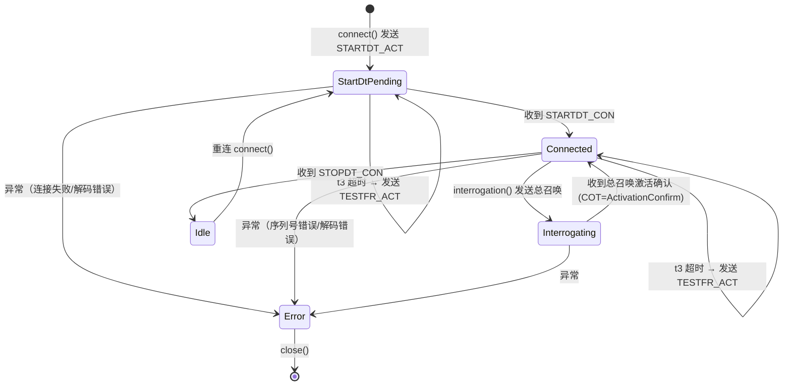
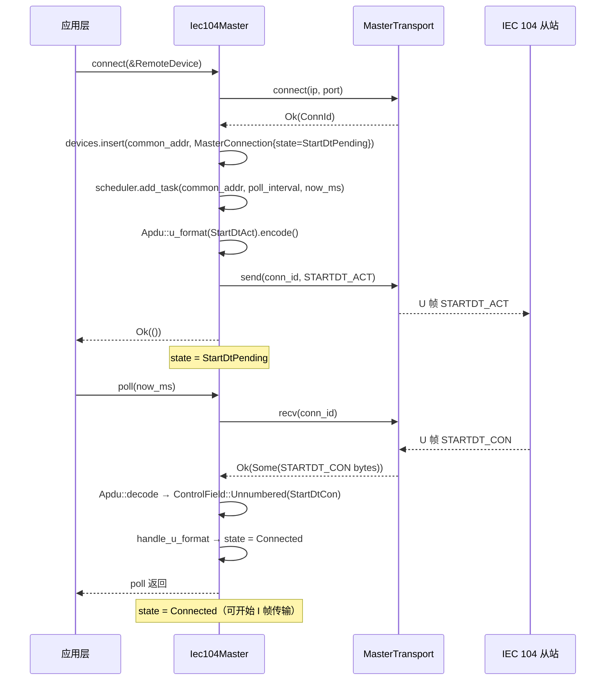
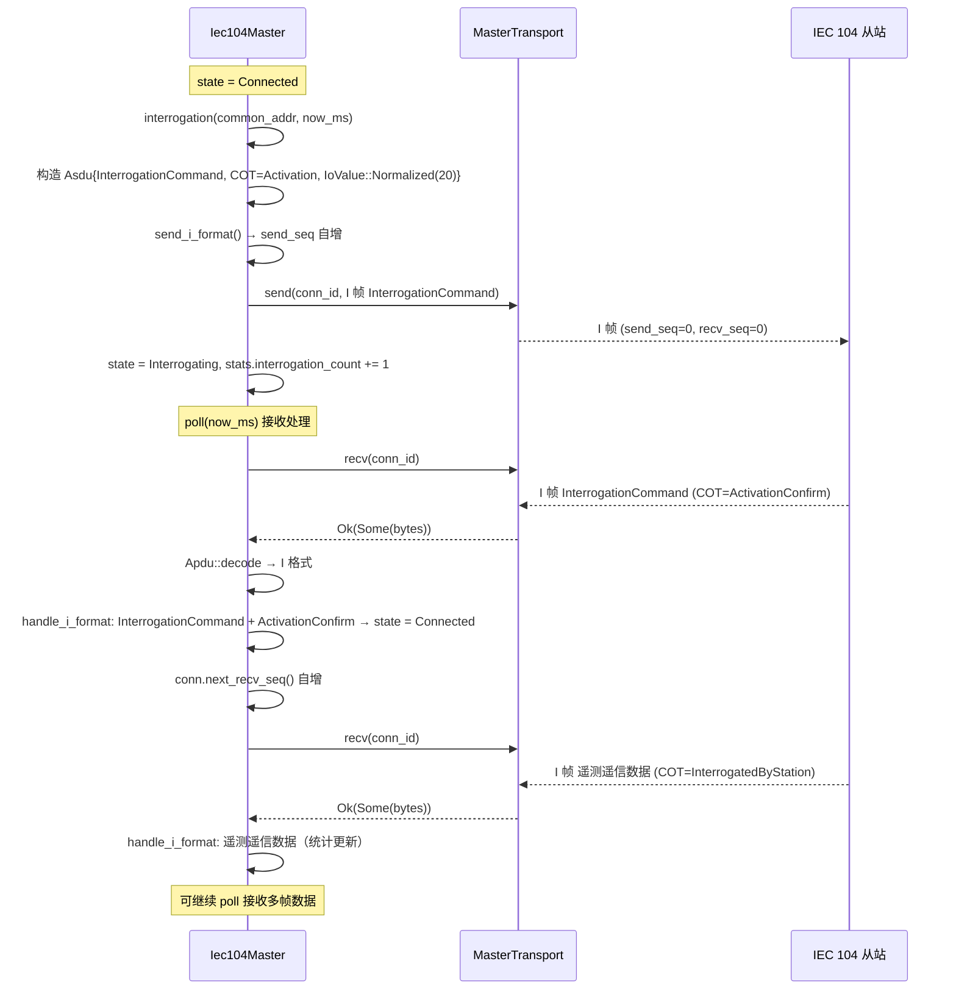
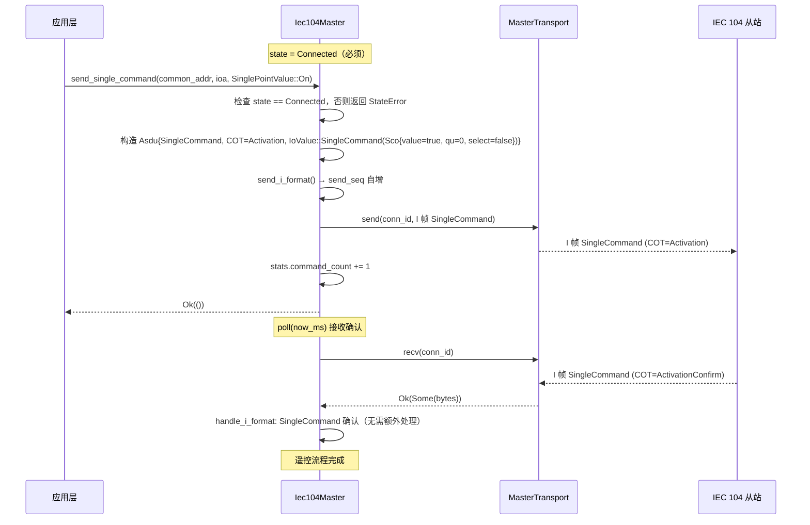
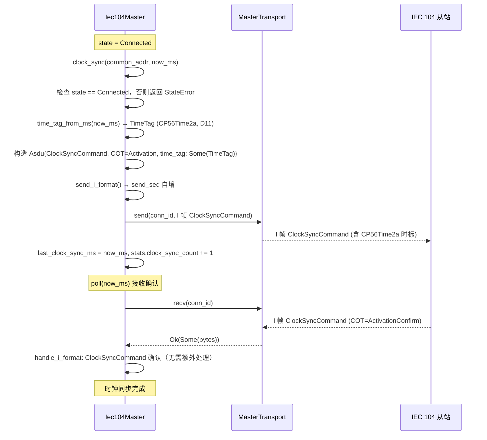

# IEC 104 主站设计文档（v0.49.0）

> **版本**：v0.49.0
> **蓝图参考**：`蓝图/phase1.md` §8967-9174
> **前置版本**：v0.48.0（IEC 104 从站，作为依赖被复用，D5）
> **后续版本**：v0.50.0（统一点表，整合 IEC 104/Modbus/CAN 点表）
> **最后更新**：2026-07-15

---

## 1. 概述

电力调度控制中心需要主动发起通信：周期性总召唤读取全网遥测遥信、下发遥控命令控制场站设备、下发时钟同步命令统一全网时间。v0.48.0 完成了 IEC 60870-5-104 从站（被控设备侧），本版本实现主站侧（控制中心侧），与从站构成完整的 IEC 104 主从互通链路，解锁 P1-F 协议栈第七层完整能力。

- **一句话目标**：实现 IEC 60870-5-104 主站协议栈，支持多设备并发连接（`BTreeMap<u16, MasterConnection>`）、周期性总召唤（QOI=20 站召唤）、单点/双点遥控命令下发、时钟同步命令下发（CP56Time2a 时标）、STARTDT 握手、t3 保活（TESTFR_ACT）。
- **架构定位**：P1-F 设备协议栈第七层——IEC 104 完整实现（主+从）。协议栈层次关系：
  - v0.43.0 驱动框架（第一层，可选依赖）
  - v0.44.0 RS485 串口驱动（第二层）
  - v0.45.0 Modbus RTU 主站（第三层）
  - v0.46.0 Modbus TCP 主站（第四层）
  - v0.47.0 CAN 驱动（第五层）
  - v0.48.0 IEC 104 从站（第六层）
  - **v0.49.0 IEC 104 主站（第七层，本版本）**
- **与 v0.48.0 的关系**：复用从站的 `Apdu`/`Asdu`/`TypeId`/`Cot`/`InformationObject`/`IoValue`/`QualityDescriptor`/`Sco`/`Dco`/`TimeTag`/`SinglePointValue`/`DoublePointValue`/`Iec104Error` 等类型（D5，path 依赖，类比 v0.46.0 modbus-tcp 复用 v0.45.0 modbus-rtu），避免重复定义。主站侧仅新增连接管理、轮询调度、命令下发逻辑。
- **设计原则关联**：主动控制（主站轮询策略）、实时性（总召唤周期可配置）、解耦（`MasterTransport` trait，D1）、最小依赖（零外部依赖，仅依赖 eneros-iec104-slave，D4）、Simplicity First（`PollScheduler` 基于 `now_ms` 时间戳比较，D10）。

## 2. 架构

### 2.1 crate 依赖图

```
                    ┌─────────────────────────┐
                    │   eneros-iec104-master  │  ← 本版本（v0.49.0）
                    │   (crates/protocols/    │
                    │    iec104-master/)      │
                    └────────────┬────────────┘
                                 │ path 依赖（D5）
                                 ▼
                    ┌─────────────────────────┐
                    │   eneros-iec104-slave   │  ← v0.48.0
                    │   (crates/protocols/    │
                    │    iec104-slave/)       │
                    └─────────────────────────┘
                                 │
                                 │ 提供：Apdu/Asdu/TypeId/Cot/IoValue/
                                 │       InformationObject/QualityDescriptor/
                                 │       Sco/Dco/TimeTag/SinglePointValue/
                                 │       DoublePointValue/Iec104Error
                                 ▼
                       （无其他外部依赖，D4）
```

主站 crate 仅依赖 `eneros-iec104-slave`（path 依赖），不依赖 `eneros-net`/smoltcp（D4），传输层由 `MasterTransport` trait 抽象（D1）。

### 2.2 模块划分

```
crates/protocols/iec104-master/
├── Cargo.toml          # crate 清单（workspace 继承，仅依赖 eneros-iec104-slave，D4）
└── src/
    ├── lib.rs          # crate 根：#![cfg_attr(not(test), no_std)] + extern crate alloc
    │                   #         + 模块声明 + re-export + D1~D11 偏差声明表 + 集成测试
    ├── error.rs        # MasterError 枚举（6 变体 + Iec104 包装）+ From<Iec104Error>
    ├── config.rs       # MasterConfig（clock_sync_interval_ms/t3_timeout_ms/poll_interval_ms/default_port）
    ├── device.rs       # RemoteDevice（ip/port/common_addr/poll_interval_ms）+ ConnState 枚举
    ├── transport.rs    # MasterTransport trait（D1）+ ConnId + MasterStats
    ├── poll.rs         # PollTask + PollScheduler（D10，基于 now_ms 时间戳比较）
    ├── connection.rs   # MasterConnection（send_seq/recv_seq/state/时间戳/pending_acks）
    ├── master.rs       # Iec104Master 核心 + time_tag_from_ms（D11）
    └── mock.rs         # MockMasterTransport 测试桩（#[cfg(test)]）
```

**模块依赖关系**：

```
lib.rs
  ├── error.rs        （依赖 eneros_iec104_slave::Iec104Error，重导出）
  ├── config.rs       （无依赖）
  ├── device.rs       （无依赖）
  ├── transport.rs    （依赖 error.rs）
  ├── poll.rs         （依赖 alloc::collections::BTreeMap）
  ├── connection.rs   （依赖 device.rs + transport.rs）
  ├── master.rs       （依赖 error.rs + config.rs + connection.rs + device.rs + poll.rs + transport.rs
  │                    + eneros_iec104_slave 的 Apdu/Asdu/TypeId/Cot/...）
  └── mock.rs         （依赖 transport.rs + error.rs，仅 #[cfg(test)]）
```

### 2.3 数据流

主站采用"调用方注入传输层 + 周期 poll 驱动"的非阻塞模型，数据流如下：

```
                ┌──────────────────────────────────────────┐
                │              调用方（应用层）              │
                │  构造 RemoteDevice → connect() → poll()   │
                └──────────────┬───────────────────────────┘
                               │
                               ▼
┌──────────────────────────────────────────────────────────────┐
│                        Iec104Master                          │
│  ┌──────────────┐  ┌──────────────┐  ┌──────────────────┐    │
│  │  devices:    │  │  scheduler:  │  │  transport:      │    │
│  │  BTreeMap<   │  │  PollScheduler│ │  Box<dyn         │    │
│  │  u16,        │◄─┤  (D10)       │  │  MasterTransport>│    │
│  │  MasterConn> │  │              │  │  (D1)            │    │
│  └──────┬───────┘  └──────────────┘  └────────┬─────────┘    │
│         │                                      │             │
│         │  poll(now_ms)                        │             │
│         │  1. due_tasks → interrogation()      │             │
│         │  2. clock_sync 周期检查               │             │
│         │  3. t3 超时 → send_testfr()          │             │
│         │  4. process_rx() 解帧分发            │             │
│         ▼                                      ▼             │
│  ┌─────────────────────────────────────────────────────┐     │
│  │  APDU 编解码（复用 eneros-iec104-slave，D5）         │     │
│  │  U 格式: STARTDT_ACT/CON, TESTFR_ACT/CON             │     │
│  │  I 格式: InterrogationCommand/SingleCommand/         │     │
│  │         DoubleCommand/ClockSyncCommand/遥测遥信      │     │
│  └─────────────────────────────────────────────────────┘     │
└──────────────────────────────────────────────────────────────┘
                               │
                               ▼
                    ┌─────────────────────┐
                    │  传输层实现（注入）   │
                    │  - MockMasterTrans   │ （测试）
                    │  - 未来 smoltcp 适配 │ （生产）
                    └─────────────────────┘
```

## 3. 核心类型

### 3.1 Iec104Master

主站核心结构体，封装多设备连接管理、轮询调度、APDU 收发与 ASDU 分发。通过 `MasterTransport` trait 抽象传输层（D1），不直接依赖 smoltcp（D4）。

```rust
use alloc::boxed::Box;
use alloc::collections::BTreeMap;
use crate::config::MasterConfig;
use crate::connection::MasterConnection;
use crate::poll::PollScheduler;
use crate::transport::{MasterStats, MasterTransport};

pub struct Iec104Master {
    /// 设备连接表（key: common_addr，value: MasterConnection）
    devices: BTreeMap<u16, MasterConnection>,
    /// 轮询调度器（D10）
    scheduler: PollScheduler,
    /// 主站配置
    config: MasterConfig,
    /// 统计信息
    stats: MasterStats,
    /// 传输层（trait object，由调用方注入，D1）
    transport: Box<dyn MasterTransport>,
}
```

**核心方法**：

| 方法 | 说明 |
|------|------|
| `new(config, transport)` | 创建主站，注入配置与传输层 |
| `connect(&mut self, device: &RemoteDevice)` | 传输层 connect + 发送 STARTDT_ACT，状态置 StartDtPending |
| `interrogation(&mut self, common_addr, now_ms)` | 发送总召唤 ASDU（COT=Activation, QOI=20），状态置 Interrogating |
| `clock_sync(&mut self, common_addr, now_ms)` | 发送时钟同步 ASDU（含 CP56Time2a，D11） |
| `send_single_command(&mut self, common_addr, ioa, value)` | 发送单点遥控 ASDU（TypeId=45, COT=Activation） |
| `send_double_command(&mut self, common_addr, ioa, value)` | 发送双点遥控 ASDU（TypeId=46, COT=Activation） |
| `poll(&mut self, now_ms)` | 周期轮询：到期总召唤 + 时钟同步 + t3 保活 + 接收处理 |
| `process_rx(&mut self, conn_key)` | 处理一帧接收数据（U/S/I 格式分发） |
| `stats(&self)` | 返回统计信息引用 |
| `device_state(&self, common_addr)` | 返回指定设备的连接状态 |

### 3.2 MasterConnection

每个远端设备对应一个 `MasterConnection`，维护发送/接收序列号（15 位回绕）、各类时间戳、连接状态与待确认计数。

```rust
use crate::device::{ConnState, RemoteDevice};
use crate::transport::ConnId;

#[derive(Debug, Clone)]
pub struct MasterConnection {
    /// 远端设备描述
    pub remote: RemoteDevice,
    /// 传输层连接标识（D9: ConnId = u32）
    pub conn_id: ConnId,
    /// 发送序列号（15 位，0~32767 回绕）
    pub send_seq: u16,
    /// 接收序列号（15 位，0~32767 回绕）
    pub recv_seq: u16,
    /// 上次总召唤时间戳（毫秒）
    pub last_interrogation_ms: u64,
    /// 上次时钟同步时间戳（毫秒）
    pub last_clock_sync_ms: u64,
    /// 上次活动时间戳（毫秒，收发均更新）
    pub last_activity_ms: u64,
    /// 连接状态
    pub state: ConnState,
    /// 待确认 I 帧数
    pub pending_acks: u16,
}

impl MasterConnection {
    /// 创建连接，初始序列号为 0，状态为 StartDtPending。
    pub fn new(remote: RemoteDevice, conn_id: ConnId, now_ms: u64) -> Self { /* ... */ }

    /// 取出当前发送序列号并递增（15 位回绕：& 0x7FFF）。
    pub fn next_send_seq(&mut self) -> u16 { /* ... */ }

    /// 取出当前接收序列号并递增（15 位回绕：& 0x7FFF）。
    pub fn next_recv_seq(&mut self) -> u16 { /* ... */ }

    /// 更新活动时间戳。
    pub fn touch(&mut self, now_ms: u64) { self.last_activity_ms = now_ms; }
}
```

### 3.3 RemoteDevice

远端设备（IEC 104 从站）描述，标识一个被轮询的从站设备。IP 地址用 `[u8; 4]` 表示 IPv4（D8，无 `std::net::IpAddr`，与 v0.46.0 `TcpDevice` 一致）。

```rust
#[derive(Debug, Clone, Copy, PartialEq, Eq)]
pub struct RemoteDevice {
    /// IPv4 地址（D8）
    pub ip: [u8; 4],
    /// TCP 端口
    pub port: u16,
    /// 公共地址（ASDU 地址，作为 devices BTreeMap 的 key）
    pub common_addr: u16,
    /// 轮询周期（毫秒）
    pub poll_interval_ms: u32,
}

impl RemoteDevice {
    pub const fn new(ip: [u8; 4], port: u16, common_addr: u16, poll_interval_ms: u32) -> Self { /* ... */ }
}
```

### 3.4 ConnState

主站连接状态枚举（6 变体）。派生 `Debug/Clone/Copy/PartialEq/Eq`。

```rust
#[derive(Debug, Clone, Copy, PartialEq, Eq)]
pub enum ConnState {
    /// 空闲（未连接，或收到 STOPDT_CON 后）
    Idle,
    /// 连接中（传输层 connect 进行中）
    Connecting,
    /// STARTDT 等待确认
    StartDtPending,
    /// 已连接（数据传输中）
    Connected,
    /// 总召唤进行中
    Interrogating,
    /// 错误
    Error,
}
```

> **注**：`Idle` 与 `Connecting` 在当前实现中主要由枚举完备性保留。`MasterConnection::new` 直接将初始状态置为 `StartDtPending`（因为 `transport.connect()` 是同步返回的），`Idle` 在收到 `STOPDT_CON` 时使用。

### 3.5 MasterConfig

主站配置（4 字段）。超时/间隔使用 `u32` 毫秒（D3，无 `Duration` 类型，与 v0.48.0 D5 一致）。

```rust
#[derive(Debug, Clone, Copy, PartialEq, Eq)]
pub struct MasterConfig {
    /// 时钟同步周期（毫秒，默认 600000 = 10 分钟）
    pub clock_sync_interval_ms: u32,
    /// t3 保活超时（毫秒，默认 20000）
    pub t3_timeout_ms: u32,
    /// 默认轮询周期（毫秒，默认 30000）
    pub poll_interval_ms: u32,
    /// 默认端口（IEC 104 标准端口 2404）
    pub default_port: u16,
}

impl Default for MasterConfig {
    fn default() -> Self {
        Self {
            clock_sync_interval_ms: 600_000,  // 10 分钟
            t3_timeout_ms: 20_000,            // 20 秒
            poll_interval_ms: 30_000,         // 30 秒
            default_port: 2404,               // IEC 104 标准端口
        }
    }
}
```

### 3.6 MasterStats

主站统计信息（9 字段），用于可观测性。

```rust
#[derive(Debug, Clone, Default, PartialEq, Eq)]
pub struct MasterStats {
    pub tx_count: u64,              // 发送帧总数
    pub rx_count: u64,              // 接收帧总数
    pub tx_error_count: u64,        // 发送错误总数
    pub rx_error_count: u64,        // 接收错误总数
    pub connect_count: u64,         // 建立连接总数
    pub disconnect_count: u64,      // 断开连接总数
    pub interrogation_count: u64,   // 总召唤执行次数
    pub command_count: u64,         // 遥控命令执行次数
    pub clock_sync_count: u64,      // 时钟同步执行次数
}
```

### 3.7 PollTask 与 PollScheduler

轮询调度类型（D10）。`PollScheduler` 简化为基于 `now_ms` 的时间戳比较，无定时器对象（Simplicity First）。

```rust
use alloc::collections::BTreeMap;
use alloc::vec::Vec;

/// 单个轮询任务
#[derive(Debug, Clone, Copy)]
pub struct PollTask {
    /// 公共地址（设备标识）
    pub common_addr: u16,
    /// 下次轮询时间戳（毫秒）
    pub next_poll_ms: u64,
    /// 轮询周期（毫秒）
    pub interval_ms: u32,
}

/// 轮询调度器（D10）
pub struct PollScheduler {
    pub tasks: BTreeMap<u16, PollTask>,
}

impl PollScheduler {
    pub fn new() -> Self { /* ... */ }
    /// 添加任务，next_poll_ms = now_ms + interval_ms
    pub fn add_task(&mut self, common_addr: u16, interval_ms: u32, now_ms: u64) { /* ... */ }
    pub fn remove_task(&mut self, common_addr: u16) { /* ... */ }
    /// 返回 now_ms >= next_poll_ms 的所有 common_addr
    pub fn due_tasks(&self, now_ms: u64) -> Vec<u16> { /* ... */ }
    /// 更新 next_poll_ms = now_ms + interval_ms
    pub fn update_next(&mut self, common_addr: u16, now_ms: u64) { /* ... */ }
}
```

## 4. 主站状态机

`ConnState` 描述单个远端设备的连接状态。主站通过 `connect()` → `poll()` 驱动状态转换：



**状态说明**：

| 状态 | 说明 | 允许的操作 |
|------|------|-----------|
| `Idle` | 空闲，未连接或收到 STOPDT_CON | `connect()` 重连 |
| `Connecting` | 传输层 connect 进行中（枚举完备性保留） | 等待 connect 返回 |
| `StartDtPending` | 已发送 STARTDT_ACT，等待 STARTDT_CON | `poll()` 接收；t3 保活 |
| `Connected` | 数据传输已激活 | `interrogation()`/`clock_sync()`/`send_*_command()`/`poll()` |
| `Interrogating` | 总召唤进行中，等待激活确认 | `interrogation()`（允许重入）；`poll()` 接收 |
| `Error` | 连接异常（解码失败/序列号错误） | `close()` 关闭连接 |

**关键转换逻辑**（见 `master.rs`）：

- `connect()`：调用 `transport.connect()` 成功后，`MasterConnection::new` 置 `StartDtPending`，并发送 `STARTDT_ACT` U 格式帧。
- `handle_u_format(StartDtCon)`：`StartDtPending` → `Connected`。
- `handle_u_format(StopDtCon)`：任意状态 → `Idle`。
- `interrogation()`：`Connected` 或 `Interrogating` → `Interrogating`（发送 InterrogationCommand ASDU）。
- `handle_i_format(InterrogationCommand, ActivationConfirm)`：`Interrogating` → `Connected`。
- `send_single_command()` / `send_double_command()` / `clock_sync()`：仅允许 `Connected` 状态执行，否则返回 `MasterError::StateError`。

## 5. 通信流程

### 5.1 STARTDT 握手流程

主站连接建立后必须发送 STARTDT_ACT，收到 STARTDT_CON 后才能开始 I 格式数据传输（蓝图 §技术交底坑点 8.4）。



### 5.2 总召唤流程

主站周期性发起总召唤（QOI=20 站召唤），从站回复激活确认后开始发送全量遥测遥信数据。



**实现要点**：
1. `interrogation()` 构造 `Asdu { type_id: InterrogationCommand, cause_of_tx: Activation, ioas: [IoValue::Normalized(20)] }`（QOI=20 站召唤）。
2. 发送后状态置 `Interrogating`，等待从站激活确认。
3. `handle_i_format` 收到 `InterrogationCommand` + `ActivationConfirm` 后，若当前状态为 `Interrogating` 则恢复 `Connected`。
4. 后续遥测遥信数据（`SinglePointInformation`/`MeasuredValueFloat` 等）由 `handle_i_format` 处理，统计在 `process_rx` 中更新。

### 5.3 遥控命令流程

主站下发单点（SingleCommand, TypeId=45）或双点（DoubleCommand, TypeId=46）遥控命令，COT=Activation。从站执行后回复激活确认。



**实现要点**：
1. `send_single_command` 仅在 `state == Connected` 时允许，否则返回 `MasterError::StateError`。
2. `Sco::new(matches!(value, SinglePointValue::On))` 将 `SinglePointValue` 映射为 `Sco { value: bool, qu: 0, select: false }`。
3. 双点遥控 `send_double_command` 流程类似，使用 `Dco::new(value)` 构造 `Dco { value: DoublePointValue, qu: 0, select: false }`。
4. SBO（Select Before Operate）选择-执行两阶段由 `Sco.select`/`Dco.select` 标志区分，本版本默认 `select=false`（直接执行）。

### 5.4 时钟同步流程

主站周期性下发时钟同步命令（ClockSyncCommand, TypeId=103），携带 CP56Time2a 时标，统一全网时间。时标由调用方通过 `now_ms` 参数注入并构造 `TimeTag`（D11，不在主站内部获取系统时间）。



**`time_tag_from_ms` 实现（D11）**：

基准为 2026-01-01 00:00:00 UTC（CP56Time2a year=26）。`now_ms=0` 对应 `TimeTag { year: 26, month: 1, day: 1, hour: 0, minute: 0, second: 0, millis: 0 }`。

```rust
pub fn time_tag_from_ms(now_ms: u64) -> TimeTag {
    let total_seconds = now_ms / 1000;
    let millis = (now_ms % 1000) as u16;
    let second = (total_seconds % 60) as u8;
    let total_minutes = total_seconds / 60;
    let minute = (total_minutes % 60) as u8;
    let total_hours = total_minutes / 60;
    let hour = (total_hours % 24) as u8;
    let total_days = total_hours / 24;
    let (year, month, day) = days_to_ymd(total_days); // 自 2026-01-01 起算
    TimeTag { year, month, day, hour, minute, second, iv: false, su: false, millis }
}
```

## 6. 多设备管理

主站通过 `BTreeMap<u16, MasterConnection>` 管理多个远端设备，key 为 `common_addr`（ASDU 公共地址），保证唯一性与有序遍历。

### 6.1 设计要点

```rust
pub struct Iec104Master {
    devices: BTreeMap<u16, MasterConnection>,  // key: common_addr
    // ...
}
```

- **key 选择**：使用 `common_addr`（IEC 104 ASDU 公共地址）作为设备唯一标识，而非 `ConnId`。因为 `ConnId` 由传输层分配（D9，`u32` 自增），应用层通过 `common_addr` 寻址设备更自然。
- **并发轮询**：`poll(now_ms)` 遍历所有设备，每个设备独立检查总召唤周期、时钟同步周期、t3 保活、接收处理。
- **独立序列号**：每个 `MasterConnection` 独立维护 `send_seq`/`recv_seq`（15 位回绕），设备间互不影响。
- **独立状态机**：每个设备拥有独立的 `ConnState`，一台设备断线不影响其他设备。

### 6.2 多设备连接示例

```rust
let mut mock = MockMasterTransport::new();
// connect() 返回递增 ConnId：设备1 → conn_id=1, 设备2 → conn_id=2
mock.push_rx(1, startdt_con_bytes());
mock.push_rx(2, startdt_con_bytes());

let dev1 = RemoteDevice::new([192, 168, 1, 1], 2404, 1, 30_000);
let dev2 = RemoteDevice::new([192, 168, 1, 2], 2404, 2, 30_000);

let mut master = Iec104Master::new(MasterConfig::default(), Box::new(mock));
master.connect(&dev1)?;  // conn_id=1, state=StartDtPending
master.connect(&dev2)?;  // conn_id=2, state=StartDtPending

master.poll(100);  // 两个设备均收到 STARTDT_CON → Connected
assert_eq!(master.device_state(1), Some(ConnState::Connected));
assert_eq!(master.device_state(2), Some(ConnState::Connected));
```

### 6.3 poll 中的多设备遍历

为避免迭代时借用冲突（`self.devices` 既被读又被写），`poll()` 先收集 `conn_keys: Vec<u16>`，再逐个处理：

```rust
pub fn poll(&mut self, now_ms: u64) {
    // 1. 到期总召唤任务
    let due = self.scheduler.due_tasks(now_ms);
    for common_addr in due {
        let _ = self.interrogation(common_addr, now_ms);
        self.scheduler.update_next(common_addr, now_ms);
    }

    // 2. 收集连接 key（避免借用冲突）
    let conn_keys: Vec<u16> = self.devices.keys().copied().collect();
    for conn_key in conn_keys {
        // 时钟同步检查
        // t3 保活检查
        // 接收处理
        let _ = self.process_rx(conn_key);
    }
}
```

## 7. 轮询调度

`PollScheduler` 采用基于 `now_ms` 时间戳比较的简化设计（D10，无定时器对象，Simplicity First），管理多个设备的总召唤周期。

### 7.1 设计原理

- **无定时器对象**：不依赖任何定时器/事件循环，仅比较 `now_ms >= next_poll_ms` 判断到期。
- **时间注入**：`now_ms` 由调用方通过 `poll(now_ms)` 注入（D2，无 `MonotonicTime` 类型）。
- **独立周期**：每个设备按各自 `poll_interval_ms` 独立调度，互不影响。

### 7.2 调度逻辑

```rust
impl PollScheduler {
    /// 添加任务，next_poll_ms = now_ms + interval_ms
    pub fn add_task(&mut self, common_addr: u16, interval_ms: u32, now_ms: u64) {
        self.tasks.insert(common_addr, PollTask {
            common_addr,
            next_poll_ms: now_ms + interval_ms as u64,
            interval_ms,
        });
    }

    /// 返回 now_ms >= next_poll_ms 的所有 common_addr
    pub fn due_tasks(&self, now_ms: u64) -> Vec<u16> {
        self.tasks.iter()
            .filter(|(_, task)| now_ms >= task.next_poll_ms)
            .map(|(addr, _)| *addr)
            .collect()
    }

    /// 更新 next_poll_ms = now_ms + interval_ms
    pub fn update_next(&mut self, common_addr: u16, now_ms: u64) {
        if let Some(task) = self.tasks.get_mut(&common_addr) {
            task.next_poll_ms = now_ms + task.interval_ms as u64;
        }
    }
}
```

### 7.3 周期触发示例

```rust
// poll_interval = 10000ms，connect 时 next_poll = 0 + 10000 = 10000
master.connect(&device)?;       // now_ms=0
master.poll(100);               // STARTDT_CON → Connected
assert_eq!(master.stats().interrogation_count, 0);

master.poll(9_000);             // 未到期（9000 < 10000）
assert_eq!(master.stats().interrogation_count, 0);

master.poll(10_001);            // 到期（10001 >= 10000）
assert_eq!(master.stats().interrogation_count, 1);
// update_next 后 next_poll = 10001 + 10000 = 20001
```

### 7.4 poll 完整流程

`poll(now_ms)` 按以下顺序处理（见 `master.rs`）：

1. **到期总召唤**：`scheduler.due_tasks(now_ms)` 返回到期设备列表，对每个设备执行 `interrogation()` + `scheduler.update_next()`。
2. **时钟同步检查**：对每个 `state == Connected` 的设备，若 `now_ms - last_clock_sync_ms > clock_sync_interval_ms`，执行 `clock_sync()`。
3. **t3 保活检查**：对每个 `state == Connected` 或 `StartDtPending` 的设备，若 `now_ms - last_activity_ms > t3_timeout_ms`，执行 `send_testfr()` 发送 TESTFR_ACT。
4. **接收处理**：对每个设备调用 `process_rx()`，每次处理一帧（非阻塞）。

## 8. 错误处理

### 8.1 MasterError 枚举

主站错误枚举（7 变体），覆盖连接/状态/传输层错误，并包装 IEC 104 协议层错误。

```rust
pub use eneros_iec104_slave::Iec104Error;

#[derive(Debug, Clone, PartialEq, Eq)]
pub enum MasterError {
    /// 未连接（目标设备不存在于连接表）
    NotConnected,
    /// 连接失败（传输层 connect 返回错误）
    ConnectFailed,
    /// 发送失败
    SendFailed,
    /// 接收失败
    RecvFailed,
    /// 状态错误（操作在当前状态下不合法，如未 Connected 时发命令）
    StateError,
    /// 超时
    Timeout,
    /// IEC 104 协议层错误（解码失败等，D5 复用 Iec104Error）
    Iec104(Iec104Error),
}

impl From<Iec104Error> for MasterError {
    fn from(e: Iec104Error) -> Self {
        Self::Iec104(e)
    }
}
```

### 8.2 错误传播

- `connect()` 失败 → `MasterError::ConnectFailed`（由传输层返回）或 `SendFailed`（发送 STARTDT_ACT 失败）。
- `interrogation()` / `clock_sync()` / `send_*_command()`：
  - 设备不存在 → `NotConnected`
  - 状态不合法 → `StateError`（如未 `Connected` 时发命令）
  - 发送失败 → `SendFailed`
- `process_rx()`：
  - 设备不存在 → `NotConnected`
  - 接收失败 → 传输层错误（`RecvFailed`/`SendFailed` 等）
  - 解码失败 → `MasterError::Iec104(Iec104Error::InvalidFrame)` 或 `Decode`

### 8.3 From<Iec104Error> 转换

通过 `impl From<Iec104Error> for MasterError`，`?` 操作符可自动将 `Iec104Error` 转换为 `MasterError::Iec104`，便于在主站方法中传播从站层的解码错误：

```rust
let apdu = Apdu::decode(&data)?;  // Iec104Error → MasterError::Iec104
```

### 8.4 错误统计

错误发生时同步更新 `MasterStats`：
- 发送失败 → `tx_error_count += 1`
- 接收失败（含解码失败）→ `rx_error_count += 1`

## 9. no_std 合规

本 crate 严格遵循 EnerOS no_std 规范（蓝图 §43.1，记忆文件 §4.3）。

### 9.1 crate 根声明

```rust
#![cfg_attr(not(test), no_std)]

extern crate alloc;
```

- `#![cfg_attr(not(test), no_std)]`：测试模式下使用 `std`（便于 `Vec`/`BTreeMap` 等测试），非测试模式严格 `no_std`。
- `extern crate alloc`：使用 `alloc::vec::Vec`、`alloc::collections::BTreeMap`、`alloc::boxed::Box` 等。

### 9.2 依赖约束

- **仅使用 `alloc::*` 与 `core::*`**：禁止 `use std::*`。
- **零外部依赖**（D4）：`Cargo.toml` 仅依赖 `eneros-iec104-slave`（path 依赖），不依赖 `eneros-net`/smoltcp/任何第三方 crate。
- **传输层抽象**（D1）：通过 `MasterTransport` trait 解耦网络栈，主站不直接持有 socket。

```toml
# crates/protocols/iec104-master/Cargo.toml
[package]
name = "eneros-iec104-master"
version.workspace = true
edition.workspace = true

[dependencies]
eneros-iec104-slave = { path = "../iec104-slave" }
```

### 9.3 无 unsafe 代码

全 crate 使用 safe Rust，无 `unsafe` 块。序列号回绕通过 `& 0x7FFF` 算术实现，无需位运算 unsafe。

## 10. 测试策略

本 crate 共 **58 个测试用例**，覆盖所有公共 API 与 IEC 104 主站流程，全部通过 `cargo test -p eneros-iec104-master`。

### 10.1 测试分布

| 模块 | 测试数 | 覆盖内容 |
|------|--------|---------|
| `lib.rs`（集成测试） | 14 | 主站端到端流程：STARTDT 握手、总召唤、单/双点遥控、时钟同步、多设备、t3 保活、序列号回绕、poll 触发、状态机、错误处理、trait object |
| `master.rs` | 8 | `time_tag_from_ms` 各时间单位换算（秒/毫秒/分/时/天/月/完整日期） |
| `connection.rs` | 6 | `MasterConnection` 初始状态、send/recv 序列号递增、15 位回绕、touch |
| `poll.rs` | 8 | `PollScheduler` 空/添加/到期/多任务/更新/删除/默认 |
| `mock.rs` | 10 | `MockMasterTransport` connect 自增 ID、send 记录、recv 队列、close、时间推进 |
| `transport.rs` | 3 | `MasterStats` 默认值/clone/mutation |
| `config.rs` | 3 | `MasterConfig` 默认值/copy/修改 |
| `device.rs` | 3 | `RemoteDevice` 构造/相等性、`ConnState` 相等性 |
| `error.rs` | 3 | `From<Iec104Error>` 转换、相等性、clone |
| **合计** | **58** | |

### 10.2 mock 传输层设计

`MockMasterTransport` 实现 `MasterTransport` trait，用于测试中解耦真实网络栈：

```rust
pub struct MockMasterTransport {
    next_conn_id: ConnId,                              // 自增，从 1 开始
    connections: BTreeMap<ConnId, ([u8; 4], u16)>,     // 活跃连接
    rx_data: BTreeMap<ConnId, VecDeque<Vec<u8>>>,      // 预置接收队列
    tx_frames: Vec<(ConnId, Vec<u8>)>,                 // 已发送帧记录
    current_time_ms: u64,                              // 虚拟时钟
}
```

**关键方法**：
- `push_rx(conn, data)`：预置从站发送的帧到接收队列，模拟从站响应。
- `tx_frames()`：返回已发送帧列表，用于验证主站发送内容。
- `advance_time(ms)` / `set_time(ms)`：推进/设置虚拟时钟，模拟时间流逝（测试 t3 超时、poll 周期）。
- `connect()`：返回递增 `ConnId`（从 1 开始），便于多设备测试预填 `push_rx(1, ...)` / `push_rx(2, ...)`。

### 10.3 集成测试场景（lib.rs）

| 测试 | 描述 |
|------|------|
| `test_t1_connect_and_startdt_handshake` | 主站连接 + STARTDT 握手，验证状态 StartDtPending → Connected |
| `test_t2_interrogation_send_and_receive` | 总召唤发送 + 接收激活确认 + 遥测数据 |
| `test_t3_single_command` | 单点遥控命令发送（IOA=10, On） |
| `test_t4_double_command` | 双点遥控命令发送（IOA=20, On） |
| `test_t5_clock_sync_and_timetag` | 时钟同步命令 + `time_tag_from_ms` 构造验证 |
| `test_t6_multi_device_polling` | 多设备并发连接 + 轮询（2 个设备独立状态） |
| `test_t7_t3_timeout_testfr` | t3 超时（21000ms > 20000ms）触发 TESTFR_ACT 发送 |
| `test_t8_sequence_wraparound` | 序列号递增 + 15 位回绕（0x7FFF → 0） |
| `test_t9_poll_triggers_interrogation` | poll 周期触发总召唤（10000ms 到期） |
| `test_t10_state_machine_transitions` | 完整状态转换：StartDtPending → Connected → Interrogating → Connected |
| `test_testfr_con_handling` | TESTFR_CON 处理（保持 Connected） |
| `test_not_connected_error` | 未连接设备操作返回 `NotConnected` |
| `test_state_error_when_not_connected` | 非 Connected 状态发命令返回 `StateError` |
| `test_trait_object_compatibility` | `Box<dyn MasterTransport>` trait object 兼容性 |

## 11. 与 v0.48.0 的关系

### 11.1 类型复用（D5）

本版本通过 path 依赖复用 `eneros-iec104-slave` 的全部协议层类型，避免重复定义：

| 复用类型 | 来源 | 用途 |
|---------|------|------|
| `Apdu` + `ControlField` + `UFormatFunction` | `iec104-slave::apdu` | APDU 帧编解码（I/S/U 三种格式） |
| `Asdu` + `TypeId` + `Cot` + `InformationObject` + `IoValue` | `iec104-slave::asdu` | ASDU 应用层（10 种 TypeId） |
| `QualityDescriptor` + `SinglePointValue` + `DoublePointValue` | `iec104-slave::asdu` | 品质描述符与点值 |
| `Sco` + `Dco` | `iec104-slave::asdu` | 单点/双点命令限定词 |
| `TimeTag` | `iec104-slave::asdu` | CP56Time2a 时标（7 字节） |
| `Iec104Error` | `iec104-slave::error` | 协议层错误（被 `MasterError::Iec104` 包装） |

主站 crate 在 `lib.rs` 中重导出这些类型，便于上游统一从本 crate 引用：

```rust
pub use eneros_iec104_slave::{
    Apdu, Asdu, ControlField, Cot, Dco, DoublePointValue, InformationObject, IoValue,
    QualityDescriptor, Sco, SinglePointValue, TimeTag, TypeId, UFormatFunction,
};
```

### 11.2 path 依赖

```toml
# crates/protocols/iec104-master/Cargo.toml
[dependencies]
eneros-iec104-slave = { path = "../iec104-slave" }
```

类比 v0.46.0 modbus-tcp 复用 v0.45.0 modbus-rtu 的模式：同属 `crates/protocols/` 子系统的相邻版本通过 path 依赖共享协议层类型。

### 11.3 主从角色对比

| 维度 | v0.48.0 从站 | v0.49.0 主站 |
|------|-------------|-------------|
| 角色 | 被控设备（响应请求） | 控制中心（主动发起） |
| 传输层 trait | `SlaveTransport`（accept/send/recv/close/now_ms） | `MasterTransport`（connect/send/recv/close/now_ms） |
| 连接管理 | `Option<SlaveConnection>`（单连接，D4） | `BTreeMap<u16, MasterConnection>`（多设备） |
| 状态机 | Idle → Connected → StartDtPending → Active → Stopped | Idle → Connecting → StartDtPending → Connected → Interrogating |
| 总召唤 | 响应（激活确认 → 数据 → 激活终止） | 发起（COT=Activation, QOI=20） |
| 遥控 | 响应（执行 + 确认） | 下发（COT=Activation） |
| 时钟同步 | 响应（更新时间 + 确认） | 下发（构造 CP56Time2a, D11） |
| 点数据库 | `PointDatabase` trait + `InMemoryPointDatabase` | 无（主站不存储点数据，仅接收） |
| 轮询调度 | 无（从站被动响应） | `PollScheduler`（D10，基于 now_ms） |
| 统计 | `SlaveStats`（tx/rx/error/connections） | `MasterStats`（tx/rx/error/connect/interrogation/command/clock_sync） |

### 11.4 共同设计模式

- **传输层 trait 抽象**（D1/D4）：均定义本地 transport trait 解耦 smoltcp，支持 mock 测试。
- **时间注入**（D2/D3）：均通过 `now_ms: u64` 参数注入，超时使用 `u32` 毫秒。
- **序列号 15 位回绕**：均使用 `& 0x7FFF` 实现 send_seq/recv_seq 回绕。
- **t3 保活**：均通过 `last_activity_ms` 比较 `t3_timeout_ms` 触发 TESTFR_ACT。
- **no_std 合规**：均 `#![cfg_attr(not(test), no_std)]` + `extern crate alloc`，零外部依赖。

## 12. 偏差声明

> 以下偏差与 `.trae/specs/develop-v0490-iec104-master/spec.md` §偏差声明一致。

| 偏差 | 蓝图假设 | 实际情况 | 处理方案 |
|------|---------|---------|---------|
| **D1** | 蓝图 `Iec104Master` 直接持 `SocketHandle::connect()` | 协议层不应直接依赖具体网络栈 | 定义本地 `MasterTransport` trait（`connect`/`send`/`recv`/`close`/`now_ms`），主站持 `Box<dyn MasterTransport>`，解耦 smoltcp 便于 mock 测试，类比 v0.48.0 `SlaveTransport` |
| **D2** | 蓝图使用 `MonotonicTime` 类型 | EnerOS 无 `MonotonicTime` 类型 | 时间通过 `now_ms: u64` 参数注入（`MasterTransport::now_ms()` / `poll(now_ms)`）；与 v0.48.0 D3 一致 |
| **D3** | 蓝图使用 `Duration` 类型 | EnerOS 无 `core::time::Duration` 在 no_std 下需 alloc | 超时/间隔使用 `u32` 毫秒（`clock_sync_interval_ms`/`t3_timeout_ms`/`poll_interval_ms`）；与 v0.48.0 D5 一致 |
| **D4** | 蓝图依赖 `eneros-net`/smoltcp | 直接依赖网络栈使协议层与传输层耦合 | 不依赖 `eneros-net`/smoltcp；传输层由 `MasterTransport` trait 抽象；零外部依赖（仅依赖 eneros-iec104-slave）；与 v0.48.0 D8 一致 |
| **D5** | 蓝图独立定义 APDU/ASDU 类型 | v0.48.0 已定义全部协议层类型 | 复用 `eneros-iec104-slave` 的 APDU/ASDU/TypeId/Cot/IoValue/InformationObject/QualityDescriptor/Sco/Dco/TimeTag/SinglePointValue/DoublePointValue/Iec104Error 类型（path 依赖，类比 v0.46.0 modbus-tcp 复用 v0.45.0 modbus-rtu） |
| **D6** | 蓝图未明确 crate 放置位置 | §2.3.1 要求所有 crate 放 `crates/<subsystem>/` | crate 放入 `crates/protocols/iec104-master/`（与 iec104-slave/modbus-rtu/modbus-tcp 同级） |
| **D7** | 蓝图标注 v0.43.0 驱动框架依赖 | IEC 104 主站是协议栈而非设备驱动 | 不实现 `DeviceDriver` trait；与 v0.48.0 D9 一致 |
| **D8** | 蓝图使用 `IpAddr` 类型 | EnerOS 无 `std::net::IpAddr` | IP 地址用 `[u8; 4]` 表示 IPv4；与 v0.46.0 `TcpDevice` 一致 |
| **D9** | 蓝图使用 `SocketHandle` 类型 | EnerOS 无 `SocketHandle` | `SocketHandle` 抽象为 `ConnId = u32`（传输层 trait 返回连接 ID，主站按 ID 操作） |
| **D10** | 蓝图 `PollScheduler` 暗含定时器对象 | 定时器对象增加复杂度 | `PollScheduler` 简化为基于 `now_ms` 的时间戳比较（`now_ms >= next_poll_ms`），无定时器对象，Simplicity First |
| **D11** | 蓝图 `TimeTag::from_system_time(now)` 获取系统时间 | no_std 下无系统时间获取 | 时钟同步时标由调用方通过 `now_ms` 参数注入，主站内部 `time_tag_from_ms(now_ms)` 构造 `TimeTag`（基准 2026-01-01，year=26） |

---

> **后续演进**：
> - **v0.50.0 统一点表**：将 IEC 104 主站接收的遥测遥信数据与 Modbus/CAN 点表整合为统一抽象。
> - **v0.51.0 协议抽象层**：将 `MasterTransport`（IEC 104 主站）/`SlaveTransport`（IEC 104 从站）/`TcpTransport`（Modbus TCP）/`RtuTransport`（Modbus RTU）统一为 `ProtocolTransport` trait，支持多协议并发。
> - **真实 TCP 集成**：通过 v0.29.0 Socket 抽象层提供 `MasterTransport` 实现，接入 smoltcp 真实 TCP 栈。
> - **断线重连**：当前版本不实现自动重连（蓝图 §8.2 风险），后置到 Phase 2 增加连接监控与重连策略。
> - **IEC 104 安全扩展**：基于 `MasterTransport` trait 替换为 TLS 实现，增加连接认证（Phase 2）。
