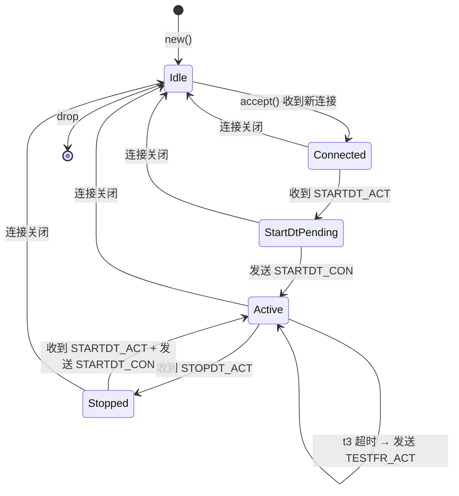
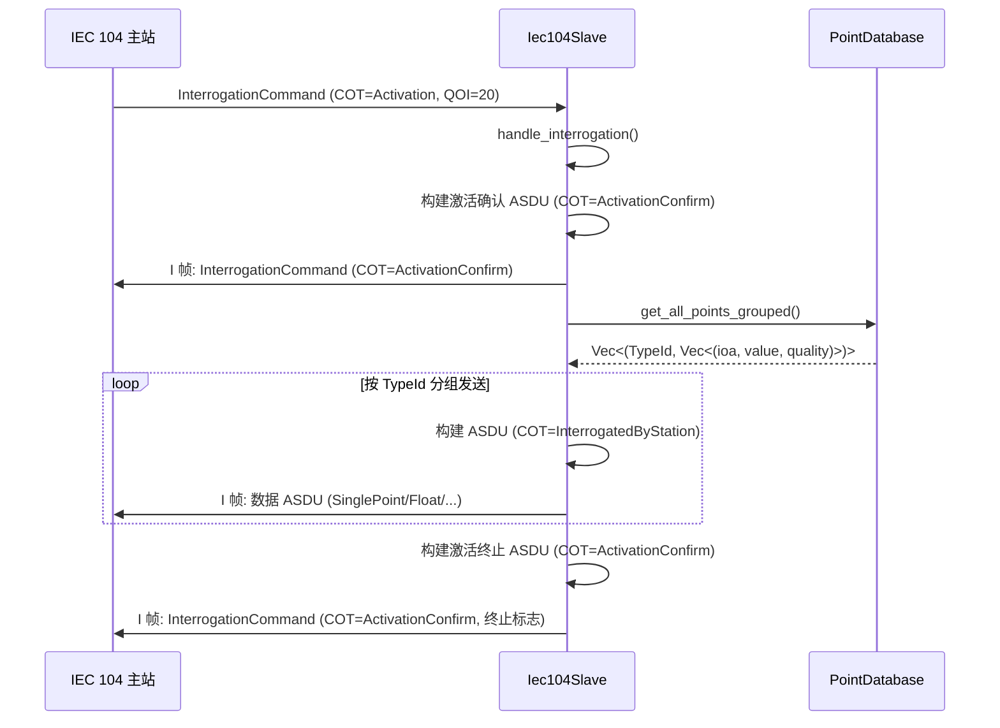
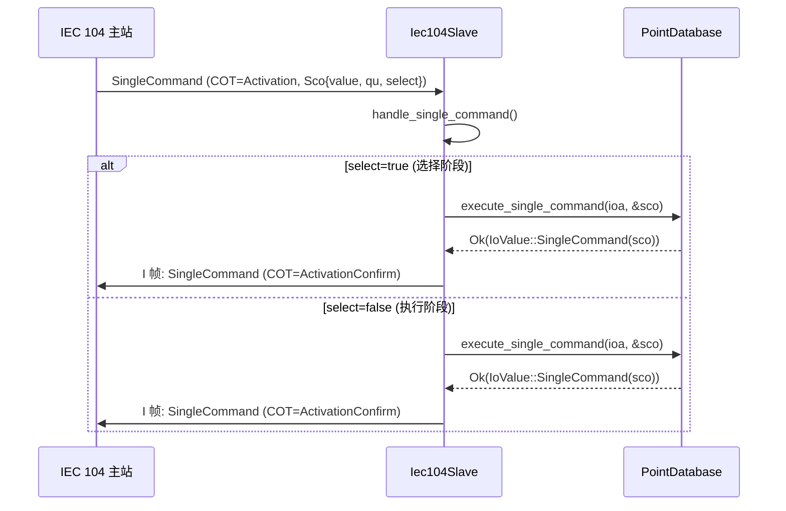
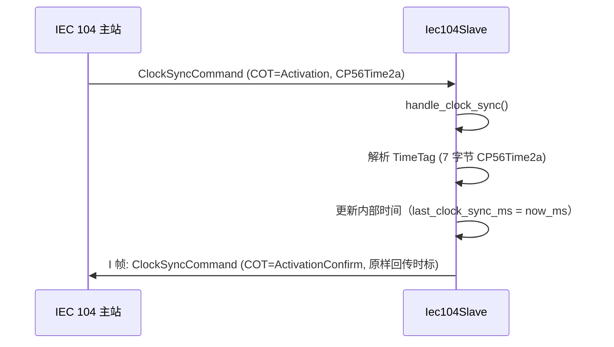

# IEC 104 从站设计文档（v0.48.0）

> **版本**：v0.48.0
> **蓝图参考**：`蓝图/phase1.md` §8646-8964
> **前置版本**：v0.29.0（Socket 抽象层，概念依赖）、v0.43.0（驱动框架，可选依赖）
> **后续版本**：v0.49.0（IEC 104 主站，复用 APDU/ASDU 类型）
> **最后更新**：2026-07-15

---

## 1. 概述

储能系统中的 PCS/BMS/电表等设备通过 IEC 60870-5-104 协议（TCP/IP 端口 2404，电力行业标准）与调度主站通信。本版本实现 IEC 104 从站协议栈，作为被控设备侧的通信端，响应主站的遥测/遥信读取、遥控命令、总召唤、时钟同步等请求。

- **一句话目标**：实现 IEC 60870-5-104 从站协议栈，支持 APDU（I/S/U 三种格式）编解码、ASDU（10 种 TypeId）处理、总召唤（激活确认 → 数据 → 激活终止）、单点/双点遥控响应、时钟同步命令处理。
- **架构定位**：P1-F 设备协议栈第六层——电力行业专用协议，位于 v0.29.0 Socket 传输层（概念）之上、应用层（Agent/业务）之下。协议栈层次关系：
  - v0.43.0 驱动框架（第一层，可选依赖）
  - v0.44.0 RS485 串口驱动（第二层）
  - v0.45.0 Modbus RTU 主站（第三层）
  - v0.46.0 Modbus TCP 主站（第四层）
  - v0.47.0 CAN 驱动（第五层）
  - **v0.48.0 IEC 104 从站（第六层，本版本）**
- **后续解锁**：v0.49.0 IEC 104 主站（复用本版本的 `Apdu`/`Asdu`/`TypeId`/`Cot`/`IoValue` 等类型，避免重复定义）。
- **设计原则关联**：电力行业标准合规（IEC 60870-5-104）、实时性（遥测响应 <500ms）、解耦（`SlaveTransport` trait，D1）、可扩展（`PointDatabase` trait，D2）、最小依赖（零外部依赖，D8/D9）。

## 2. 版本目标

| # | 目标 | 验收方式 |
|---|------|---------|
| G1 | 实现 APDU 帧结构（I/S/U 三种格式）编解码 | 单元测试：I/S/U 格式 encode/decode 环回一致 |
| G2 | 实现 ASDU 应用层（10 种 TypeId）编解码 | 单元测试：各 TypeId encode/decode 环回一致 |
| G3 | 实现总召唤流程（激活确认 → 数据 → 激活终止） | 集成测试：MockSlaveTransport 注入 InterrogationCommand，验证三步响应 |
| G4 | 实现单点/双点遥控命令响应 | 集成测试：SingleCommand/DoubleCommand 执行 + 确认 |
| G5 | 实现时钟同步命令处理 | 集成测试：ClockSyncCommand 含 CP56Time2a → 更新时间 + 确认 |
| G6 | 实现 U 格式控制功能（STARTDT/STOPDT/TESTFR） | 单元测试：U 格式握手 → state=Active |
| G7 | 实现序列号管理（15 位回绕）+ w 阈值 S 帧发送 | 单元测试：多帧收发 + 序列号递增 + 15 位回绕 |
| G8 | 实现 t3 超时自动发 TestFrAct | 单元测试：t3 超时触发 TestFrAct 发送 |
| G9 | no_std 合规（`#![cfg_attr(not(test), no_std)]` + `extern crate alloc`） | 交叉编译 `aarch64-unknown-none` 通过 |
| G10 | 零外部依赖（不依赖 `eneros-net`/smoltcp，D8） | `Cargo.toml` 无外部依赖项 |

## 3. 前置依赖

| 依赖版本 | 依赖产出 | 用途 | 依赖类型 |
|---------|---------|------|---------|
| v0.29.0 | Socket 抽象层（TCP 连接管理） | 概念依赖，提供 TCP 传输能力（本版本不直接依赖 crate，D8） | 概念依赖 |
| v0.43.0 | `DeviceDriver` trait + `DriverRegistry` | 可选依赖，IEC 104 从站是协议栈而非设备驱动，不实现 `DeviceDriver`（D9） | 可选依赖 |

> **依赖关系说明**：本版本通过 `SlaveTransport` trait（D1）抽象 TCP 传输层，使从站独立于 smoltcp/`eneros-net`，便于 mock 测试与未来替换为真实 TCP 实现。v0.29.0 Socket 抽象层可提供满足 `SlaveTransport` 的实现（适配层在传输层 crate，不在 `iec104-slave` crate 内）。v0.43.0 驱动框架标注为"可选依赖"，本版本遵循 v0.46.0 Modbus TCP 的处理方式（D9，不实现 `DeviceDriver`）。

## 4. 交付物清单

| 类型 | 交付物 | 路径 |
|------|--------|------|
| 代码 crate | `eneros-iec104-slave` | `crates/protocols/iec104-slave/`（D7） |
| 接口 | `Apdu` + `ControlField` + `UFormatFunction` | `crates/protocols/iec104-slave/src/apdu.rs` |
| 接口 | `Asdu` + `TypeId` + `Cot` + `InformationObject` + `IoValue` | `crates/protocols/iec104-slave/src/asdu.rs` |
| 接口 | `QualityDescriptor` + `SinglePointValue` + `DoublePointValue` + `Sco` + `Dco` + `TimeTag` | `crates/protocols/iec104-slave/src/asdu.rs` |
| 接口 | `Iec104Config` | `crates/protocols/iec104-slave/src/config.rs` |
| 接口 | `PointDatabase` trait + `InMemoryPointDatabase`（D2） | `crates/protocols/iec104-slave/src/point.rs` |
| 接口 | `SlaveTransport` trait（D1） + `SlaveStats` + `ConnId` | `crates/protocols/iec104-slave/src/transport.rs` |
| 接口 | `Iec104Slave` + `SlaveState` + `SlaveConnection` | `crates/protocols/iec104-slave/src/slave.rs` |
| 接口 | `Iec104Error` 错误枚举（9 变体） | `crates/protocols/iec104-slave/src/error.rs` |
| 测试桩 | `MockSlaveTransport` | `crates/protocols/iec104-slave/src/mock.rs` |
| 测试 | APDU/ASDU 编解码 + 从站状态机 + 总召唤 + 遥控 + 时钟同步 + 序列号管理 | 各模块单元/集成测试 |
| 文档 | 本设计文档 | `docs/protocols/iec104-slave-design.md` |
| 配置 | workspace `Cargo.toml` | 版本 `0.47.0` → `0.48.0`，`members` 新增 `crates/protocols/iec104-slave` |

## 5. 详细设计

### 5.1 模块结构

```
crates/protocols/iec104-slave/
├── Cargo.toml          # crate 清单（workspace 继承，零外部依赖，D8）
└── src/
    ├── lib.rs          # crate 根：#![cfg_attr(not(test), no_std)] + extern crate alloc + 模块声明 + re-export
    ├── error.rs        # Iec104Error 枚举（9 变体）
    ├── asdu.rs         # ASDU 应用层：TypeId(10)/Cot(9)/QualityDescriptor/SinglePointValue/DoublePointValue/
    │                   #   Sco/Dco/TimeTag(CP56Time2a)/IoValue(8)/InformationObject/Asdu
    ├── apdu.rs         # APDU 帧层：Apdu/ControlField(I/S/U)/UFormatFunction(6)
    ├── config.rs       # Iec104Config（common_addr/listen_port/t1/t2/t3/k/w）
    ├── point.rs        # PointDatabase trait + InMemoryPointDatabase
    ├── transport.rs    # SlaveTransport trait + SlaveStats + ConnId
    ├── slave.rs        # Iec104Slave/SlaveState/SlaveConnection
    └── mock.rs         # MockSlaveTransport 测试桩
```

**模块依赖关系**：

```
lib.rs
  ├── error.rs        （无依赖）
  ├── asdu.rs         （依赖 error.rs）
  ├── apdu.rs         （依赖 error.rs + asdu.rs）
  ├── config.rs       （无依赖）
  ├── point.rs        （依赖 asdu.rs 的 IoValue/QualityDescriptor）
  ├── transport.rs    （依赖 error.rs）
  ├── slave.rs        （依赖 error.rs + asdu.rs + apdu.rs + config.rs + point.rs + transport.rs）
  └── mock.rs         （依赖 transport.rs + error.rs）
```

### 5.2 APDU 帧结构

APDU（Application Protocol Data Unit）是 IEC 104 的链路层帧，由起始字节 + 长度 + 控制域 + 可选 ASDU 组成。控制域区分 I/S/U 三种格式。

**字节布局**：

```
+----------+--------+----------------------+------------------+
| 起始字节  | 长度   | 控制域（4 字节）      | ASDU（可选，N）   |
| 0x68     | 1 字节 | 4 字节               | 0~253 字节       |
+----------+--------+----------------------+------------------+
```

**控制域三种格式**：

```
I 格式（信息传输）：
+---+---+---+---+---+---+---+---+---+---+---+---+---+---+---+---+
| 0 |     SendSeq (15 bit)        |     RecvSeq (15 bit)        |
+---+---+---+---+---+---+---+---+---+---+---+---+---+---+---+---+
  bit0=0 标识 I 格式；send_seq/recv_seq 按 I 帧计数递增（非按字节）

S 格式（确认）：
+---+---+---+---+---+---+---+---+---+---+---+---+---+---+---+---+
| 1 | 1 | 0 | 0 | 0 | 0 | 0 | 0 |     RecvSeq (15 bit)        |
+---+---+---+---+---+---+---+---+---+---+---+---+---+---+---+---+
  bit0=1 bit1=1 标识 S 格式；仅携带 recv_seq 确认收到的 I 帧

U 格式（控制功能）：
+---+---+---+---+---+---+---+---+---+---+---+---+---+---+---+---+
| 1 | 0 |   U 功能位        | 0 | 0 | 0 | 0 | 0 | 0 | 0 | 0 | 0 |
+---+---+---+---+---+---+---+---+---+---+---+---+---+---+---+---+
  bit0=1 bit1=0 标识 U 格式；功能位区分 STARTDT/STOPDT/TESTFR 的 ACT/CON
```

**U 格式功能字节**：

| UFormatFunction | 控制域第 1 字节 | 说明 |
|-----------------|----------------|------|
| `StartDtAct` | `0x07` | 启动数据传输激活 |
| `StartDtCon` | `0x0B` | 启动数据传输确认 |
| `StopDtAct` | `0x13` | 停止数据传输激活 |
| `StopDtCon` | `0x17` | 停止数据传输确认 |
| `TestFrAct` | `0x43` | 测试帧激活 |
| `TestFrCon` | `0x83` | 测试帧确认 |

**Rust 定义**：

```rust
use crate::asdu::Asdu;
use crate::error::Iec104Error;
use alloc::vec::Vec;

/// APDU（Application Protocol Data Unit）
#[derive(Debug, Clone)]
pub struct Apdu {
    pub control_field: ControlField,
    pub asdu: Option<Asdu>,  // None 表示 U 格式或 S 格式帧
}

/// 控制域三种格式
#[derive(Debug, Clone, PartialEq, Eq)]
pub enum ControlField {
    /// I 格式（信息传输）：bit0=0
    Information { send_seq: u16, recv_seq: u16 },
    /// S 格式（确认）：bit0=1 bit1=1
    Numbered { recv_seq: u16 },
    /// U 格式（控制功能）：bit0=1 bit1=0
    Unnumbered(UFormatFunction),
}

/// U 格式控制功能（6 变体）
#[derive(Debug, Clone, Copy, PartialEq, Eq)]
pub enum UFormatFunction {
    StartDtAct,
    StartDtCon,
    StopDtAct,
    StopDtCon,
    TestFrAct,
    TestFrCon,
}

impl Apdu {
    /// 便捷构造：U 格式
    pub fn u_format(func: UFormatFunction) -> Self {
        Self { control_field: ControlField::Unnumbered(func), asdu: None }
    }

    /// 便捷构造：S 格式
    pub fn s_format(recv_seq: u16) -> Self {
        Self { control_field: ControlField::Numbered { recv_seq }, asdu: None }
    }

    /// 便捷构造：I 格式
    pub fn i_format(send_seq: u16, recv_seq: u16, asdu: Asdu) -> Self {
        Self {
            control_field: ControlField::Information { send_seq, recv_seq },
            asdu: Some(asdu),
        }
    }

    /// 编码为字节流
    pub fn encode(&self) -> Vec<u8> {
        let mut buf = Vec::new();
        buf.push(0x68); // 起始字节
        let mut ctrl = [0u8; 4];
        match &self.control_field {
            ControlField::Information { send_seq, recv_seq } => {
                let s = send_seq << 1; // bit0=0
                let r = recv_seq << 1;
                ctrl[0] = (s & 0xFF) as u8;
                ctrl[1] = ((s >> 8) & 0xFF) as u8;
                ctrl[2] = (r & 0xFF) as u8;
                ctrl[3] = ((r >> 8) & 0xFF) as u8;
            }
            ControlField::Numbered { recv_seq } => {
                ctrl[0] = 0x01; // bit0=1 bit1=1
                ctrl[1] = 0x00;
                let r = recv_seq << 1;
                ctrl[2] = (r & 0xFF) as u8;
                ctrl[3] = ((r >> 8) & 0xFF) as u8;
            }
            ControlField::Unnumbered(func) => {
                ctrl[0] = match func {
                    UFormatFunction::StartDtAct => 0x07,
                    UFormatFunction::StartDtCon => 0x0B,
                    UFormatFunction::StopDtAct => 0x13,
                    UFormatFunction::StopDtCon => 0x17,
                    UFormatFunction::TestFrAct => 0x43,
                    UFormatFunction::TestFrCon => 0x83,
                };
            }
        }
        let mut asdu_bytes = Vec::new();
        if let Some(asdu) = &self.asdu {
            asdu_bytes = asdu.encode();
        }
        buf.push((ctrl.len() + asdu_bytes.len()) as u8); // 长度（控制域 + ASDU）
        buf.extend_from_slice(&ctrl);
        buf.extend_from_slice(&asdu_bytes);
        buf
    }

    /// 从字节流解码
    pub fn decode(bytes: &[u8]) -> Result<Self, Iec104Error> {
        if bytes.len() < 6 {
            return Err(Iec104Error::InvalidFrame);
        }
        if bytes[0] != 0x68 {
            return Err(Iec104Error::InvalidFrame);
        }
        let length = bytes[1] as usize;
        if length < 4 || bytes.len() < 2 + length {
            return Err(Iec104Error::InvalidFrame);
        }
        let ctrl = &bytes[2..6];
        let control_field = if ctrl[0] & 0x01 == 0 {
            // I 格式：bit0=0
            let send_seq = (u16::from(ctrl[0]) | (u16::from(ctrl[1]) << 8)) >> 1;
            let recv_seq = (u16::from(ctrl[2]) | (u16::from(ctrl[3]) << 8)) >> 1;
            ControlField::Information { send_seq, recv_seq }
        } else if ctrl[0] & 0x02 != 0 {
            // S 格式：bit0=1 bit1=1
            let recv_seq = (u16::from(ctrl[2]) | (u16::from(ctrl[3]) << 8)) >> 1;
            ControlField::Numbered { recv_seq }
        } else {
            // U 格式：bit0=1 bit1=0
            let func = match ctrl[0] {
                0x07 => UFormatFunction::StartDtAct,
                0x0B => UFormatFunction::StartDtCon,
                0x13 => UFormatFunction::StopDtAct,
                0x17 => UFormatFunction::StopDtCon,
                0x43 => UFormatFunction::TestFrAct,
                0x83 => UFormatFunction::TestFrCon,
                _ => return Err(Iec104Error::InvalidFrame),
            };
            ControlField::Unnumbered(func)
        };
        let asdu = if length > 4 {
            Some(Asdu::decode(&bytes[6..2 + length])?)
        } else {
            None
        };
        Ok(Self { control_field, asdu })
    }
}
```

**编解码场景**：

| 场景 | 输入 | 输出 |
|------|------|------|
| 编码 U 格式 StartDtAct | `Apdu::u_format(StartDtAct)` | `[0x68, 0x04, 0x07, 0x00, 0x00, 0x00]` |
| 编码 S 格式 recv_seq=1 | `Apdu::s_format(1)` | `[0x68, 0x04, 0x01, 0x00, 0x02, 0x00]` |
| 解码 S 格式 | `[0x68, 0x04, 0x01, 0x00, 0x02, 0x00]` | `ControlField::Numbered { recv_seq: 1 }` |
| 解码错误起始字节 | `[0x00, 0x04, ...]` | `Err(InvalidFrame)` |
| 序列号 15 位回绕 | send_seq=32767 → +1 | send_seq=0（自动回绕） |

### 5.3 ASDU 结构

ASDU（Application Service Data Unit）是 IEC 104 的应用层数据单元，由类型标识 + 可变结构限定词 + 传送原因 + 公共地址 + 信息对象列表组成。

**字节布局**：

```
+----------+-----------+--------+----------------+----------------+------------------+
| TypeId   | VarStruct | COT    | OriginatorAddr | CommonAddr     | InfoObjects      |
| 1 字节   | 1 字节    | 1 字节 | 1 字节         | 2 字节 LE      | 变长             |
+----------+-----------+--------+----------------+----------------+------------------+

VarStruct: | SQ(1) | Count(7) |
  SQ=0: 非序列模式，每个信息对象携带自身 IOA（本版本仅支持 SQ=0，D2 延迟 SQ=1）
  SQ=1: 序列模式，仅首个信息对象携带 IOA，后续按 IOA+1 递增（后置）

信息对象（SQ=0 模式）：
+----------+----------+----------+
| IOA(2LE) | Value    | Quality  |
+----------+----------+----------+
  IOA: 信息对象地址（2 字节小端）
  Value: 按 TypeId 决定长度与编码
  Quality: 品质描述符（1 字节，遥控类型无此字段）
```

**各 TypeId 的 Value 字段编码**：

| TypeId | 值 | Value 字段 | 长度 | 说明 |
|--------|-----|-----------|------|------|
| `SinglePointInformation` | 1 | SPI(1 bit) + Quality(7 bit) | 1 字节 | 单点遥信：Off=0/On=1 |
| `DoublePointInformation` | 3 | DPI(2 bit) + Quality(6 bit) | 1 字节 | 双点遥信：Intermediate/Off/On/Bad |
| `MeasuredValueNormalized` | 9 | NVA(2 LE) + Quality(1) | 3 字节 | 归一化遥测 i16 |
| `MeasuredValueScaled` | 11 | SVA(2 LE) + Quality(1) | 3 字节 | 标度化遥测 i16 |
| `MeasuredValueFloat` | 13 | Float(4 LE) + Quality(1) | 5 字节 | 短浮点遥测 f32（IEEE 754 LE，D6） |
| `Counter` | 15 | Counter(4 LE) + Quality(1) | 5 字节 | 计数量 u32 |
| `SingleCommand` | 45 | SCO(1) | 1 字节 | 单点遥控：value(1 bit)/qu(2 bit)/select(1 bit) |
| `DoubleCommand` | 46 | DCO(1) | 1 字节 | 双点遥控：value(2 bit)/qu(2 bit)/select(1 bit) |
| `InterrogationCommand` | 100 | QOI(1) | 1 字节 | 总召唤命令：QOI=20（站召唤） |
| `ClockSyncCommand` | 103 | CP56Time2a(7) | 7 字节 | 时钟同步：7 字节时标 |

**SQ=0 非序列模式说明**（D2）：

本版本仅支持 SQ=0 模式（非序列 IOA），每个信息对象独立携带 IOA 地址。SQ=1 序列模式（仅首个对象携带 IOA，后续按 IOA+1 递增）延迟到后续版本实现。

**浮点小端序编解码**（D6）：

IEC 104 浮点采用 IEEE 754 小端序编码，与网络字节序（大端）不同，需显式使用 `f32::from_le_bytes` / `to_le_bytes`：

```rust
// 编码浮点（小端序，D6）
fn encode_float(value: f32) -> [u8; 4] {
    value.to_le_bytes()
}

// 解码浮点（小端序，D6）
fn decode_float(bytes: &[u8]) -> Result<f32, Iec104Error> {
    if bytes.len() < 4 {
        return Err(Iec104Error::Decode);
    }
    Ok(f32::from_le_bytes([bytes[0], bytes[1], bytes[2], bytes[3]]))
}
```

### 5.4 核心数据类型

#### TypeId（10 变体）

```rust
/// ASDU 类型标识（10 变体）
#[derive(Debug, Clone, Copy, PartialEq, Eq)]
pub enum TypeId {
    SinglePointInformation = 1,      // 单点遥信
    DoublePointInformation = 3,      // 双点遥信
    MeasuredValueNormalized = 9,     // 归一化遥测
    MeasuredValueScaled = 11,        // 标度化遥测
    MeasuredValueFloat = 13,         // 短浮点遥测
    Counter = 15,                    // 计数量
    SingleCommand = 45,              // 单点遥控
    DoubleCommand = 46,              // 双点遥控
    InterrogationCommand = 100,      // 总召唤命令
    ClockSyncCommand = 103,          // 时钟同步命令
}

impl TypeId {
    pub fn from_u8(v: u8) -> Result<Self, Iec104Error> {
        match v {
            1 => Ok(Self::SinglePointInformation),
            3 => Ok(Self::DoublePointInformation),
            9 => Ok(Self::MeasuredValueNormalized),
            11 => Ok(Self::MeasuredValueScaled),
            13 => Ok(Self::MeasuredValueFloat),
            15 => Ok(Self::Counter),
            45 => Ok(Self::SingleCommand),
            46 => Ok(Self::DoubleCommand),
            100 => Ok(Self::InterrogationCommand),
            103 => Ok(Self::ClockSyncCommand),
            _ => Err(Iec104Error::InvalidTypeId),
        }
    }
    pub fn to_u8(self) -> u8 { self as u8 }
}
```

#### Cot（9 变体）

```rust
/// 传送原因（9 变体）
#[derive(Debug, Clone, Copy, PartialEq, Eq)]
pub enum Cot {
    Periodic = 1,              // 周期传送
    Background = 2,            // 背景扫描
    Spontaneous = 3,           // 突发（变化上报）
    Initialized = 4,           // 初始化
    Request = 5,               // 请求
    Activation = 6,            // 激活
    ActivationConfirm = 7,     // 激活确认
    Deactivation = 8,          // 停止激活
    InterrogatedByStation = 20, // 被总召唤
}
```

#### QualityDescriptor（5 标志位）

```rust
/// 品质描述符（5 标志位）
#[derive(Debug, Clone, Copy, Default, PartialEq, Eq)]
pub struct QualityDescriptor {
    pub invalid: bool,      // 无效
    pub not_topical: bool,  // 非当前
    pub substituted: bool,  // 替代值
    pub blocked: bool,      // 闭锁
    pub overflow: bool,     // 溢出（遥测）
}

impl QualityDescriptor {
    pub fn good() -> Self { Self::default() }

    pub fn encode(&self) -> u8 {
        let mut b = 0u8;
        if self.invalid { b |= 0x80; }
        if self.not_topical { b |= 0x40; }
        if self.substituted { b |= 0x20; }
        if self.blocked { b |= 0x10; }
        if self.overflow { b |= 0x01; }
        b
    }

    pub fn decode(b: u8) -> Self {
        Self {
            invalid: b & 0x80 != 0,
            not_topical: b & 0x40 != 0,
            substituted: b & 0x20 != 0,
            blocked: b & 0x10 != 0,
            overflow: b & 0x01 != 0,
        }
    }
}
```

#### SinglePointValue / DoublePointValue / Sco / Dco

```rust
#[derive(Debug, Clone, Copy, PartialEq, Eq)]
pub enum SinglePointValue { Off = 0, On = 1 }

#[derive(Debug, Clone, Copy, PartialEq, Eq)]
pub enum DoublePointValue { Intermediate = 0, Off = 1, On = 2, Bad = 3 }

/// 单点命令（Single Command）
#[derive(Debug, Clone, Copy, PartialEq, Eq)]
pub struct Sco {
    pub value: bool,        // 命令值
    pub qu: u8,             // 限定词（2 bit）
    pub select: bool,       // 选择标志（SBO）
}

/// 双点命令（Double Command）
#[derive(Debug, Clone, Copy, PartialEq, Eq)]
pub struct Dco {
    pub value: DoublePointValue, // 命令值
    pub qu: u8,                  // 限定词（2 bit）
    pub select: bool,            // 选择标志（SBO）
}
```

#### TimeTag（CP56Time2a，7 字节）

```rust
/// CP56Time2a 时标（7 字节，D10）
#[derive(Debug, Clone, Copy, PartialEq, Eq)]
pub struct TimeTag {
    pub year: u16,      // 年（低 7 bit，0-99，基准 2000）
    pub month: u8,      // 月（1-12）
    pub day: u8,        // 日（1-31）
    pub hour: u8,       // 时（0-23）
    pub minute: u8,     // 分（0-59）
    pub second: u8,     // 秒（0-59）
    pub iv: bool,       // 无效标志
    pub su: bool,       // 夏令时标志
    pub millis: u16,    // 毫秒（0-999）
}

impl TimeTag {
    /// 编码为 7 字节 CP56Time2a
    pub fn encode(&self) -> [u8; 7] {
        let mut b = [0u8; 7];
        // 字节 0-1：毫秒低字节 + 毫秒高 3 bit + 秒高 3 bit
        let ms = self.millis & 0x03FF;
        b[0] = (ms & 0xFF) as u8;
        b[1] = ((ms >> 8) as u8) | ((self.second << 3) as u8 & 0xF8);
        // 字节 2：分钟
        b[2] = self.minute & 0x3F;
        // 字节 3：小时 + IV
        b[3] = (self.hour & 0x1F) | if self.iv { 0x80 } else { 0x00 };
        // 字节 4：日（1-31，5 bit）+ 星期（3 bit，本版本置 0）
        b[4] = self.day & 0x1F;
        // 字节 5：月（4 bit）+ SU
        b[5] = (self.month & 0x0F) | if self.su { 0x80 } else { 0x00 };
        // 字节 6：年（7 bit）
        b[6] = (self.year & 0x7F) as u8;
        b
    }

    pub fn decode(b: &[u8]) -> Result<Self, Iec104Error> {
        if b.len() < 7 {
            return Err(Iec104Error::Decode);
        }
        let millis = u16::from(b[0]) | ((u16::from(b[1]) & 0x07) << 8);
        let second = b[1] >> 3;
        let minute = b[2] & 0x3F;
        let hour = b[3] & 0x1F;
        let iv = b[3] & 0x80 != 0;
        let day = b[4] & 0x1F;
        let month = b[5] & 0x0F;
        let su = b[5] & 0x80 != 0;
        let year = u16::from(b[6] & 0x7F);
        Ok(Self { year, month, day, hour, minute, second, iv, su, millis })
    }
}
```

#### IoValue（8 变体）

```rust
/// 信息对象值（8 变体）
#[derive(Debug, Clone, PartialEq)]
pub enum IoValue {
    Normalized(i16),                       // 归一化值 -32768~32767
    Scaled(i16),                           // 标度化值
    Float(f32),                            // 短浮点（IEEE 754 LE，D6）
    SinglePoint(SinglePointValue),         // 单点遥信
    DoublePoint(DoublePointValue),         // 双点遥信
    SingleCommand(Sco),                    // 单点遥控
    DoubleCommand(Dco),                    // 双点遥控
    Counter(u32),                          // 计数量
}

/// 信息对象
#[derive(Debug, Clone, PartialEq)]
pub struct InformationObject {
    pub ioa: u16,                          // 信息对象地址
    pub value: IoValue,                    // 值
    pub quality: QualityDescriptor,        // 品质描述
    pub time_tag: Option<TimeTag>,         // 时标（CP56Time2a）
}

/// ASDU
#[derive(Debug, Clone, PartialEq)]
pub struct Asdu {
    pub type_id: TypeId,                   // 类型标识
    pub cause_of_tx: Cot,                  // 传送原因
    pub common_addr: u16,                  // 公共地址（ASDU 地址）
    pub ioas: Vec<InformationObject>,      // 信息对象列表
}
```

#### Iec104Config（7 字段）

```rust
/// IEC 104 从站配置
#[derive(Debug, Clone)]
pub struct Iec104Config {
    pub common_addr: u16,       // 本站公共地址，默认 1
    pub listen_port: u16,       // 监听端口，默认 2404（IEC 104 标准端口）
    pub t1_timeout_ms: u32,     // 发送 U 格式后等待确认超时，默认 15000ms
    pub t2_timeout_ms: u32,     // 确认超时（必须 < t1），默认 10000ms
    pub t3_timeout_ms: u32,     // 空闲时测试帧超时，默认 20000ms
    pub k: u16,                 // 未确认 I 帧最大数，默认 12
    pub w: u16,                 // 最迟确认 I 帧数，默认 8
}

impl Default for Iec104Config {
    fn default() -> Self {
        Self {
            common_addr: 1,
            listen_port: 2404,
            t1_timeout_ms: 15000,
            t2_timeout_ms: 10000,
            t3_timeout_ms: 20000,
            k: 12,
            w: 8,
        }
    }
}
```

**配置字段说明**：

| 字段 | 默认值 | 说明 |
|------|--------|------|
| `common_addr` | 1 | 本站公共地址（ASDU 地址），标识从站站点 |
| `listen_port` | 2404 | IEC 104 标准端口（IANA 分配） |
| `t1_timeout_ms` | 15000 | 发送 U 格式（如 STARTDT_ACT）后等待确认的超时 |
| `t2_timeout_ms` | 10000 | 收到 I 帧后必须发 S 帧确认的超时（必须 < t1） |
| `t3_timeout_ms` | 20000 | 空闲时发送 TESTFR_ACT 的超时（连接保活） |
| `k` | 12 | 未确认 I 帧最大数（达到后暂停发送） |
| `w` | 8 | 收到 w 个 I 帧后必须发 S 帧确认 |

### 5.5 SlaveTransport 抽象（D1）

蓝图假设 `Iec104Slave` 直接持有 smoltcp `SocketHandle`，但协议层不应直接依赖具体网络栈。因此定义 `SlaveTransport` trait 抽象 TCP 传输层访问（D1，类比 v0.46.0 Modbus TCP 的 `TcpTransport`）：

```rust
use crate::error::Iec104Error;

/// 连接标识（D4 单连接 MVP）
pub type ConnId = u32;

/// IEC 104 从站传输层抽象（D1）
/// 解耦 Iec104Slave 与 smoltcp socket 实现，支持 mock 测试
/// 连接管理（accept/close）由传输层实现负责
pub trait SlaveTransport {
    /// 接受新连接（非阻塞），返回新连接 ID；无连接返回 None
    fn accept(&mut self) -> Option<ConnId>;

    /// 发送字节流到指定连接
    fn send(&mut self, conn: ConnId, data: &[u8]) -> Result<(), Iec104Error>;

    /// 从指定连接接收字节流（非阻塞），写入 buf 并返回读取字节数
    fn recv(&mut self, conn: ConnId, buf: &mut [u8]) -> Result<usize, Iec104Error>;

    /// 关闭指定连接
    fn close(&mut self, conn: ConnId);

    /// 当前时间（毫秒，D3 时间注入）
    fn now_ms(&self) -> u64;
}
```

**设计要点**：
- 从站持 `Box<dyn SlaveTransport>`，可在测试中替换为 `MockSlaveTransport`。
- `accept()` 非阻塞，无连接返回 `None`；连接管理（监听端口、连接池）由传输层实现负责。
- `now_ms()` 提供时间注入（D3），与 RS485/CAN 驱动的时间注入模式一致，避免依赖 `MonotonicTime`。
- v0.29.0 的 Socket 抽象层可提供满足此 trait 的实现（适配层在传输层 crate，不在 `iec104-slave` crate 内）。

### 5.6 PointDatabase 抽象（D2）

蓝图引用 `PointDatabase` 但未定义其接口。定义为 trait 使应用可插入自定义存储（如持久化到 littlefs2、对接真实硬件点表）；提供 `InMemoryPointDatabase` 内存实现供测试参考（D2）：

```rust
use crate::asdu::{IoValue, QualityDescriptor, Sco, Dco, TypeId};
use alloc::vec::Vec;

/// 点数据库抽象（D2）
/// 存储遥测/遥信/遥控点数据，支持总召唤分组遍历与命令执行
pub trait PointDatabase {
    /// 获取单点遥信值
    fn get_single_point(&self, ioa: u16) -> Option<IoValue>;

    /// 获取双点遥信值
    fn get_double_point(&self, ioa: u16) -> Option<IoValue>;

    /// 获取浮点遥测值
    fn get_float(&self, ioa: u16) -> Option<IoValue>;

    /// 获取全部点（按 TypeId 分组，用于总召唤）
    fn get_all_points_grouped(&self) -> Vec<(TypeId, Vec<(u16, IoValue, QualityDescriptor)>)>;

    /// 设置浮点遥测值
    fn set_float(&mut self, ioa: u16, value: f32, quality: QualityDescriptor);

    /// 设置单点遥信值
    fn set_single_point(&mut self, ioa: u16, value: bool, quality: QualityDescriptor);

    /// 执行单点遥控命令
    fn execute_single_command(&mut self, ioa: u16, sco: &Sco) -> Result<IoValue, ()>;

    /// 执行双点遥控命令
    fn execute_double_command(&mut self, ioa: u16, dco: &Dco) -> Result<IoValue, ()>;
}

/// 内存点数据库实现（D2，供测试参考）
use alloc::collections::BTreeMap;

pub struct InMemoryPointDatabase {
    values: BTreeMap<u16, IoValue>,
    qualities: BTreeMap<u16, QualityDescriptor>,
}

impl InMemoryPointDatabase {
    pub fn new() -> Self {
        Self {
            values: BTreeMap::new(),
            qualities: BTreeMap::new(),
        }
    }
}

impl PointDatabase for InMemoryPointDatabase {
    // 实现略：按 ioa 查询/设置，按 TypeId 分组遍历
    // execute_single_command/execute_double_command 调用上层执行器回调
}
```

**设计要点**：
- `get_all_points_grouped()` 按 `TypeId` 分组返回点列表，用于总召唤时按类型发送 ASDU。
- `execute_single_command`/`execute_double_command` 由应用实现具体执行逻辑（如驱动 GPIO/继电器），协议层仅负责命令解析与确认回复。
- `InMemoryPointDatabase` 提供 `BTreeMap<u16, IoValue>` + `BTreeMap<u16, QualityDescriptor>` 存储，供单元测试参考。

### 5.7 Iec104Slave 状态机

`Iec104Slave` 维护单活动连接的状态机（D4 单连接 MVP），状态转换如下：



**状态说明**：

| 状态 | 说明 |
|------|------|
| `Idle` | 无活动连接，等待 accept() |
| `Connected` | 已接受连接，未启动数据传输 |
| `StartDtPending` | 收到 STARTDT_ACT，待发送 STARTDT_CON |
| `Active` | 数据传输已激活，可处理 I 格式 ASDU |
| `Stopped` | 收到 STOPDT_ACT，暂停数据传输 |
| `Error` | 连接异常（序列号错误/解码失败） |

**Rust 定义**：

```rust
use crate::asdu::TypeId;
use crate::config::Iec104Config;
use crate::point::PointDatabase;
use crate::transport::{ConnId, SlaveTransport, SlaveStats};

/// 从站状态
#[derive(Debug, Clone, Copy, PartialEq, Eq)]
pub enum SlaveState {
    Idle,
    Connected,
    StartDtPending,
    Active,
    Stopped,
    Error,
}

/// 单连接状态（D4 单连接 MVP）
#[derive(Debug, Clone)]
pub struct SlaveConnection {
    pub conn_id: ConnId,
    pub send_seq: u16,           // 发送序列号（I 帧）
    pub recv_seq: u16,           // 接收序列号（I 帧）
    pub last_rx_time_ms: u64,    // 最后接收时间
    pub last_tx_time_ms: u64,    // 最后发送时间
    pub pending_acks: u16,       // 待确认 I 帧数（用于 w 阈值）
    pub state: SlaveState,
}

/// IEC 104 从站（D4 单连接）
pub struct Iec104Slave {
    pub config: Iec104Config,
    pub point_db: Box<dyn PointDatabase>,
    pub transport: Box<dyn SlaveTransport>,
    pub connection: Option<SlaveConnection>,
    pub stats: SlaveStats,
    pub last_testfr_ms: u64,
}

impl Iec104Slave {
    pub fn new(
        config: Iec104Config,
        point_db: Box<dyn PointDatabase>,
        transport: Box<dyn SlaveTransport>,
    ) -> Self {
        Self {
            config,
            point_db,
            transport,
            connection: None,
            stats: SlaveStats::default(),
            last_testfr_ms: 0,
        }
    }

    /// 主循环轮询（D3 时间注入）
    pub fn poll(&mut self, now_ms: u64) -> Result<(), Iec104Error> {
        // 1. 接受新连接（若当前无活动连接）
        if self.connection.is_none() {
            if let Some(conn_id) = self.transport.accept() {
                self.connection = Some(SlaveConnection {
                    conn_id,
                    send_seq: 0,
                    recv_seq: 0,
                    last_rx_time_ms: now_ms,
                    last_tx_time_ms: now_ms,
                    pending_acks: 0,
                    state: SlaveState::Connected,
                });
                self.stats.connections_accepted += 1;
            }
        }
        // 2. 接收数据并处理 APDU
        if let Some(conn) = self.connection.as_mut() {
            let mut buf = [0u8; 256];
            match self.transport.recv(conn.conn_id, &mut buf) {
                Ok(n) if n > 0 => {
                    conn.last_rx_time_ms = now_ms;
                    self.stats.rx_count += 1;
                    let apdu = Apdu::decode(&buf[..n])?;
                    self.handle_apdu(apdu)?;
                }
                _ => {}
            }
            // 3. 检查 t3 超时 → 发送 TESTFR_ACT
            if conn.state == SlaveState::Active
                && now_ms - conn.last_rx_time_ms > self.config.t3_timeout_ms as u64
            {
                let testfr = Apdu::u_format(UFormatFunction::TestFrAct);
                self.send_apdu(&testfr)?;
                self.last_testfr_ms = now_ms;
            }
            // 4. 检查 w 阈值 → 发送 S 帧
            if conn.pending_acks >= self.config.w {
                let s_frame = Apdu::s_format(conn.recv_seq);
                self.send_apdu(&s_frame)?;
                conn.pending_acks = 0;
            }
        }
        Ok(())
    }
}
```

### 5.8 总召唤流程

总召唤（Interrogation）是主站请求从站发送全部点数据的标准流程，遵循"激活确认 → 数据 → 激活终止"三步响应：



**实现要点**：
1. 收到 `TypeId::InterrogationCommand`（COT=Activation）后，立即回复激活确认（COT=ActivationConfirm）。
2. 调用 `PointDatabase::get_all_points_grouped()` 获取全部点，按 `TypeId` 分组发送数据 ASDU（COT=InterrogatedByStation）。
3. 全部数据发送完成后，回复激活终止（COT=ActivationConfirm，含终止标志）。
4. 每个分组作为独立 I 帧发送，序列号按帧递增。

### 5.9 遥控命令流程

遥控命令支持单点（SingleCommand，TypeId 45）和双点（DoubleCommand，TypeId 46），执行后回复确认：



**实现要点**：
1. 收到 `TypeId::SingleCommand`（COT=Activation）后，遍历 ASDU 中的信息对象。
2. 对每个信息对象，调用 `PointDatabase::execute_single_command(ioa, &sco)` 执行命令。
3. 执行成功后，回复 `SingleCommand`（COT=ActivationConfirm）。
4. 双点命令（`DoubleCommand`）流程类似，调用 `execute_double_command(ioa, &dco)`。
5. SBO（Select Before Operate）选择-执行两阶段由 `sco.select` 标志区分，协议层透传给 `PointDatabase`。

### 5.10 时钟同步流程

时钟同步命令（ClockSyncCommand，TypeId 103）携带 CP56Time2a 时标，从站更新内部时间后回复确认：



**实现要点**：
1. 收到 `TypeId::ClockSyncCommand`（COT=Activation）后，解析信息对象中的 `TimeTag`（7 字节 CP56Time2a）。
2. 更新从站内部时间（记录同步时间戳，供应用层查询）。
3. 回复 `ClockSyncCommand`（COT=ActivationConfirm），原样回传时标。

### 5.11 偏差声明表（D1~D10）

> 以下偏差与 `.trae/specs/develop-v0480-iec104-slave/spec.md` §偏差声明一致。

| 偏差 | 蓝图假设 | 实际情况 | 处理方案 |
|------|---------|---------|---------|
| **D1** | `Iec104Slave` 持有 smoltcp `SocketHandle::connect()` | 协议层不应直接依赖具体网络栈 | 定义 `SlaveTransport` trait（`accept`/`send`/`recv`/`close`/`now_ms`），从站持 `Box<dyn SlaveTransport>`，解耦 smoltcp 便于 mock 测试（类比 v0.46.0 Modbus TCP 的 `TcpTransport`） |
| **D2** | `PointDatabase` 被引用但未定义 | 蓝图未给出接口定义 | 定义 `PointDatabase` trait（`get_*`/`set_*`/`get_all_points_grouped`/`execute_*_command`）+ `InMemoryPointDatabase` 实现；trait 使应用可插入自定义存储，内存实现供测试参考 |
| **D3** | 蓝图使用 `MonotonicTime` 类型 | EnerOS 无 `MonotonicTime` 类型 | 时间通过 `now_ms: u64` 参数注入（`SlaveTransport::now_ms()` / `poll(now_ms)`）；与 RS485/CAN 驱动 D3/D5 模式一致 |
| **D4** | 蓝图 `Vec<Iec104Connection>` 多连接 | 多连接增加复杂度 | 单活动连接 MVP（`Option<SlaveConnection>`）；储能场景下从站通常服务单一本地主站；多连接后置扩展；遵循 Simplicity First |
| **D5** | 蓝图使用 `Duration` 类型 | EnerOS 无 `core::time::Duration` 在 no_std 下需 alloc | 超时使用 `u32` 毫秒（`t1_timeout_ms`/`t2_timeout_ms`/`t3_timeout_ms`）；直接用 u32 ms 更简洁 |
| **D6** | 蓝图未明确浮点字节序 | IEC 104 浮点为 LE IEEE 754，非网络大端序 | 浮点值显式小端序编解码（`f32::to_le_bytes`/`from_le_bytes`）；蓝图 §8.5 坑点 |
| **D7** | crate 放置位置未明确 | §2.3.1 要求所有 crate 放 `crates/<subsystem>/` | crate 放入 `crates/protocols/iec104-slave/`（crate 名 `eneros-iec104-slave`）；同属 protocols 子系统，与 modbus-rtu/modbus-tcp 同级 |
| **D8** | 蓝图依赖 `eneros-net`/smoltcp | 直接依赖网络栈使协议层与传输层耦合 | 不依赖 `eneros-net`/smoltcp；传输层由 `SlaveTransport` trait 抽象；slave 监听端口，连接以 `ConnId` 标识；零外部依赖 |
| **D9** | 蓝图标注 v0.43.0 驱动框架依赖 | IEC 104 从站是协议栈而非设备驱动 | 不实现 `DeviceDriver` trait；蓝图标注 v0.43.0 依赖为"可选"；与 v0.46.0 Modbus TCP 一致 |
| **D10** | 蓝图使用 `TimeTag` 但未定义 | 蓝图未给出 CP56Time2a 实现 | 本地实现 `TimeTag`（CP56Time2a 7 字节时标）+ `encode()`/`decode()`，支持 `Option<TimeTag>` |

## 6. 测试计划

### 6.1 单元测试

| 模块 | 测试内容 | 测试向量 |
|------|---------|---------|
| `asdu.rs` | `TypeId::from_u8`/`to_u8` | 10 变体环回；非法值（如 0/2/200）→ `Err(InvalidTypeId)` |
| `asdu.rs` | `Cot::from_u8`/`to_u8` | 9 变体环回 |
| `asdu.rs` | `QualityDescriptor::encode`/`decode` | 全标志位置 1 环回；`good()` 全 0 |
| `asdu.rs` | `SinglePointValue`/`DoublePointValue` | Off=0/On=1；Intermediate/Off/On/Bad |
| `asdu.rs` | `TimeTag::encode`/`decode` | 7 字节 CP56Time2a 环回；边界值（年 99/月 12/日 31） |
| `asdu.rs` | `Asdu::encode`/`decode` 各 TypeId | SinglePoint/DoublePoint/Normalized/Scaled/Float/Counter/SingleCommand/DoubleCommand/Interrogation/ClockSync |
| `asdu.rs` | 浮点小端序（D6） | `Float(3.14)` 编码后字节为 LE IEEE 754 |
| `asdu.rs` | SQ=0 非序列模式 | 每个信息对象携带独立 IOA |
| `apdu.rs` | `Apdu::encode` U 格式 | `StartDtAct` → `[0x68, 0x04, 0x07, 0x00, 0x00, 0x00]` |
| `apdu.rs` | `Apdu::encode` S 格式 | `recv_seq=1` → `[0x68, 0x04, 0x01, 0x00, 0x02, 0x00]` |
| `apdu.rs` | `Apdu::encode` I 格式 | send_seq=0/recv_seq=0 + ASDU；控制域 bit0=0 |
| `apdu.rs` | `Apdu::decode` 三种格式环回 | I/S/U 编码后解码还原 |
| `apdu.rs` | `Apdu::decode` 错误起始字节 | `[0x00, ...]` → `Err(InvalidFrame)` |
| `apdu.rs` | `Apdu::decode` 帧过短 | <6 字节 → `Err(InvalidFrame)` |
| `apdu.rs` | 序列号 15 位回绕 | send_seq=32767 → +1 = 0 |
| `config.rs` | `Iec104Config::default` | common_addr=1/listen_port=2404/t1=15000/t2=10000/t3=20000/k=12/w=8 |
| `point.rs` | `InMemoryPointDatabase` 增删改查 | set_float/get_float/set_single_point/get_single_point |
| `point.rs` | `get_all_points_grouped` 分组 | 多类型点按 TypeId 分组返回 |
| `point.rs` | `execute_single_command`/`execute_double_command` | 执行后返回 IoValue |
| `transport.rs` | `SlaveStats::default` | 全字段为 0 |
| `slave.rs` | 状态转换 Idle→Connected→Active | accept + STARTDT_ACT → STARTDT_CON + state=Active |
| `slave.rs` | U 格式处理 STARTDT | STARTDT_ACT → 回复 STARTDT_CON |
| `slave.rs` | U 格式处理 STOPDT | STOPDT_ACT → 回复 STOPDT_CON + state=Stopped |
| `slave.rs` | U 格式处理 TESTFR | TESTFR_ACT → 回复 TESTFR_CON |
| `slave.rs` | 总召唤完整流程 | 激活确认 → 数据 → 激活终止 |
| `slave.rs` | 单点遥控响应 | SingleCommand 执行 + 确认 |
| `slave.rs` | 双点遥控响应 | DoubleCommand 执行 + 确认 |
| `slave.rs` | 时钟同步处理 | ClockSyncCommand + CP56Time2a → 更新 + 确认 |
| `slave.rs` | 序列号管理 | 多帧收发 + 序列号递增 |
| `slave.rs` | w 阈值 S 帧发送 | 收到 w 个 I 帧 → 发送 S 帧 |
| `slave.rs` | t3 超时 TestFrAct | t3 超时 → 发送 TESTFR_ACT |
| `slave.rs` | 15 位序列号回绕 | 32767 → 0 |
| `slave.rs` | trait object 兼容 | `Box<dyn SlaveTransport>`/`Box<dyn PointDatabase>` 可正常使用 |

### 6.2 集成测试（MockSlaveTransport）

| 测试 | 描述 | 预期 |
|------|------|------|
| APDU 端到端 | 构造 I 帧 → encode → mock recv → decode → 校验 | 环回一致，序列号正确 |
| STARTDT 握手 | mock 主站发 STARTDT_ACT → 从站 poll | 从站回复 STARTDT_CON，state=Active |
| 总召唤完整流程 | mock 主站发 InterrogationCommand → 从站 poll | 三步响应：激活确认 + 数据 + 激活终止 |
| 单点遥控 | mock 主站发 SingleCommand → 从站 poll | PointDatabase 执行 + 回复确认 |
| 双点遥控 | mock 主站发 DoubleCommand → 从站 poll | PointDatabase 执行 + 回复确认 |
| 时钟同步 | mock 主站发 ClockSyncCommand + CP56Time2a → 从站 poll | 更新时间 + 回复确认 |
| 序列号管理 | 多帧收发 | 序列号递增 + 15 位回绕正确 |
| w 阈值 S 帧 | 连续发送 w 个 I 帧 | 从站发送 S 帧确认 |
| t3 超时 TestFrAct | 模拟 t3 超时 | 从站发送 TESTFR_ACT |

### 6.3 性能基准

| 基准 | 目标 | 测试方法 |
|------|------|---------|
| `poll()` 传输层检查 | O(1) | `MockSlaveTransport` 无数据时 poll 耗时 |
| 总召唤（n 点） | O(n) | n=100/1000 点分组发送耗时 |
| APDU 编解码 | <10μs | 主机侧基准测试 |
| ASDU 编解码 | <10μs | 主机侧基准测试 |
| 遥测响应延迟 | <500ms | mock 模拟时序 |

### 6.4 边界测试

| 边界场景 | 输入 | 预期 |
|---------|------|------|
| 序列号 15 位回绕 | send_seq=32767 → +1 | send_seq=0 |
| APDU 帧过短 | <6 字节 | `Err(InvalidFrame)` |
| 错误起始字节 | 非 0x68 | `Err(InvalidFrame)` |
| 非法 TypeId | TypeId=200 | `Err(InvalidTypeId)` |
| 空帧（仅控制域） | U/S 格式无 ASDU | 正常解析，asdu=None |
| 超长帧 | ASDU > 253 字节 | `Err(InvalidFrame)` |
| t2 必须 < t1 | 配置 t2 > t1 | 文档约束（运行时不强制） |
| 浮点小端序 | `Float(3.14)` | 字节为 LE IEEE 754（D6） |
| CP56Time2a 边界 | 年 99/月 12/日 31 | 正确编码解码 |

## 7. 验收标准

- [ ] **A1**：I/S/U 格式帧编解码正确——`encode()`/`decode()` 环回一致，控制域 bit 标志正确
- [ ] **A2**：总召唤流程完整——激活确认（COT=ActivationConfirm）→ 数据（COT=InterrogatedByStation）→ 激活终止（COT=ActivationConfirm）
- [ ] **A3**：遥控命令响应正确——SingleCommand + DoubleCommand 执行 + 回复确认（COT=ActivationConfirm）
- [ ] **A4**：时钟同步命令处理——ClockSyncCommand 含 CP56Time2a → 更新时间 + 回复确认
- [ ] **A5**：与主流 IEC 104 测试工具互通（MVP 阶段以 MockSlaveTransport 验证，真实互通后置）
- [ ] **A6**：U 格式控制功能——STARTDT/STOPDT/TESTFR 的 ACT/CON 正确响应
- [ ] **A7**：序列号管理——15 位回绕正确，w 阈值触发 S 帧发送
- [ ] **A8**：t3 超时自动发送 TESTFR_ACT
- [ ] **A9**：`SlaveTransport` trait（D1）解耦从站与 socket 实现，`MockSlaveTransport` 可注入测试
- [ ] **A10**：`PointDatabase` trait（D2）+ `InMemoryPointDatabase` 实现可插入自定义存储
- [ ] **A11**：`Iec104Config` 配置字段默认值正确（common_addr=1/listen_port=2404/t1=15000/t2=10000/t3=20000/k=12/w=8）
- [ ] **A12**：crate 位于 `crates/protocols/iec104-slave/`（D7 目录规范）
- [ ] **A13**：零外部依赖（D8），不依赖 `eneros-net`/smoltcp
- [ ] **A14**：no_std 合规——`#![cfg_attr(not(test), no_std)]` + `extern crate alloc`，无 `std::*`
- [ ] **A15**：交叉编译 `aarch64-unknown-none` 通过
- [ ] **A16**：测试覆盖 ≥40 个测试用例，覆盖所有公共 API 与 IEC 104 流程

## 8. 风险

| # | 风险 | 缓解措施 |
|---|------|---------|
| R1 | 无真实硬件/网络环境，仅 mock 测试 | `MockSlaveTransport` 模拟 TCP 收发；真实互通后置到硬件集成阶段 |
| R2 | 仅支持 SQ=0 非序列模式，SQ=1 延迟 | SQ=0 满足 MVP 功能正确性；SQ=1 序列模式后置扩展 |
| R3 | 单活动连接（D4），多连接延迟 | 储能场景下从站通常服务单一本地主站；多连接后置扩展 |
| R4 | 无真实 TCP 栈集成，`SlaveTransport` 为抽象 | v0.29.0 Socket 抽象层可提供实现；传输层适配在传输层 crate 完成 |
| R5 | IEC 104 安全扩展（TLS/认证）未实现 | 当前版本依赖网络隔离；安全扩展后置到 Phase 2 |
| R6 | 无真实 IEC 104 主站互通测试 | MVP 以 MockSlaveTransport 验证协议逻辑；真实互通后置 |
| R7 | 序列号管理复杂，收发序列号需精确维护 | 单元测试覆盖 15 位回绕 + w 阈值；t3 超时 TestFrAct 保活 |
| R8 | 大数据量总召唤（1000+ 点）可能需分帧 | 按 TypeId 分组发送，每组独立 I 帧；流控由 k/w 阈值保证 |
| R9 | t2 必须 < t1，否则确认超时 | 文档约束（`Iec104Config` 默认值满足）；运行时不强制校验 |
| R10 | 浮点字节序易错（D6） | 显式使用 `f32::to_le_bytes`/`from_le_bytes`；单元测试验证 LE 编码 |

## 9. 多角度要求

| 维度 | 要求 | 实现 |
|------|------|------|
| 9.1 性能 | `poll()` O(1) 传输层检查；总召唤 O(n) for n points | ✅ `accept()`/`recv()` 非阻塞；`get_all_points_grouped()` 按 TypeId 分组 |
| 9.2 内存 | `Iec104Slave` ~100 字节 + point_db 可变；APDU 缓冲 256 字节 | ✅ 单连接 `Option<SlaveConnection>`；接收缓冲栈分配 `[u8; 256]` |
| 9.3 安全 | 无 unsafe 代码；遥控执行经 `PointDatabase` trait | ✅ 全 safe Rust；`execute_single_command`/`execute_double_command` 由应用实现 |
| 9.4 可维护 | trait 边界清晰；transport/point_db 可替换 | ✅ `SlaveTransport`（D1）+ `PointDatabase`（D2）trait 解耦 |
| 9.5 no_std 合规 | `#![cfg_attr(not(test), no_std)]` + `extern crate alloc`；零外部依赖 | ✅ 仅使用 `alloc`/`core`；无 `std::*`；无 `eneros-net`/smoltcp 依赖（D8） |
| 9.6 测试覆盖 | ≥40 测试覆盖所有公共 API 与 IEC 104 流程 | ✅ 单元测试（TypeId/Cot/QualityDescriptor/TimeTag/Asdu/Apdu/Slave）+ 集成测试（端到端流程） |
| 9.7 可观测 | `SlaveStats`（tx/rx/error/connections） | ✅ `SlaveStats`：tx_count/rx_count/tx_error_count/rx_error_count/connections_accepted/connections_closed |
| 9.8 可扩展 | SQ=1 模式、多连接、IEC 104 安全扩展 | ✅ `PointDatabase` trait 可扩展存储；`SlaveTransport` trait 可替换为 TLS；多连接后置（D4） |

## 10. 蓝图对照

> 蓝图参考：`蓝图/phase1.md` §8646-8964

| 蓝图交付物 | 本版本实现 | 对照说明 |
|-----------|-----------|---------|
| `iec104-slave` crate | `crates/protocols/iec104-slave/`（D7） | 路径遵循 §2.3.1，同属 protocols 子系统 |
| `Asdu` 结构体 | `asdu.rs` | 字段一致：type_id/cause_of_tx/common_addr/ioas |
| `TypeId`（10 变体） | `asdu.rs` | 完全匹配蓝图：1/3/9/11/13/15/45/46/100/103 |
| `Cot`（9 变体） | `asdu.rs` | 完全匹配蓝图：1/2/3/4/5/6/7/8/20 |
| `IoValue`（8 变体） | `asdu.rs` | 完全匹配蓝图：Normalized/Scaled/Float/SinglePoint/DoublePoint/SingleCommand/DoubleCommand/Counter |
| `QualityDescriptor`（5 标志） | `asdu.rs` | 完全匹配蓝图：invalid/not_topical/substituted/blocked/overflow |
| `Apdu` + `ControlField` | `apdu.rs` | 完全匹配蓝图：I/S/U 三种格式，起始字节 0x68 |
| `UFormatFunction`（6 变体） | `apdu.rs` | 完全匹配蓝图：StartDtAct/Con/StopDtAct/Con/TestFrAct/Con |
| `Iec104Config` | `config.rs` | 完全匹配蓝图：common_addr/listen_port/t1/t2/t3/k/w，默认值一致 |
| `Iec104Slave` | `slave.rs` | 简化为单连接（D4），蓝图为 `Vec<Iec104Connection>` |
| `PointDatabase` | `point.rs`（D2） | 蓝图引用但未定义，本版本定义 trait + InMemoryPointDatabase |
| `Iec104Stats` | `transport.rs` 的 `SlaveStats` | 字段对齐：tx/rx/error/connections |
| 总召唤流程 | `slave.rs::handle_interrogation` | 完全匹配蓝图：激活确认 → 数据 → 激活终止 |
| 遥控流程 | `slave.rs::handle_single_command`/`handle_double_command` | 完全匹配蓝图：执行 + 确认 |
| 时钟同步 | `slave.rs::handle_clock_sync` | 完全匹配蓝图：更新时间 + 确认 |
| `SlaveTransport` | `transport.rs`（D1） | 蓝图直接使用 `SocketHandle::connect()`，本版本抽象为 trait |
| `TimeTag`（CP56Time2a） | `asdu.rs`（D10） | 蓝图使用 `TimeTag` 但未定义，本版本实现 7 字节编解码 |
| `MockSlaveTransport` | `mock.rs` | 蓝图未涉及，本版本新增用于测试 |

## 11. 后续解锁

- **v0.49.0 IEC 104 主站**：复用本版本的 `Apdu`/`Asdu`/`TypeId`/`Cot`/`IoValue`/`InformationObject`/`QualityDescriptor`/`TimeTag` 等类型，避免重复定义；主站侧实现总召唤发起、遥控发送、时钟同步请求。
- **Phase 2 IEC 104 安全扩展**：基于 `SlaveTransport` trait 替换为 TLS 实现，增加连接认证。
- **SQ=1 序列模式**：扩展 `Asdu::encode`/`decode` 支持 SQ=1 序列模式（仅首个信息对象携带 IOA，后续按 IOA+1 递增），减少帧大小。
- **多连接支持**：将 `Option<SlaveConnection>` 扩展为 `Vec<SlaveConnection>`（蓝图原始设计），支持多主站并发连接。
- **真实 TCP 集成**：通过 v0.29.0 Socket 抽象层提供 `SlaveTransport` 实现，接入 smoltcp 真实 TCP 栈。
- **v0.50.0 统一点表**：与本版本的 `PointDatabase` 共同作为数据源，整合 Modbus RTU/TCP、IEC 104、CAN 等多协议点表。
- **v0.51.0 协议抽象层**：将 `SlaveTransport`（IEC 104）与 `TcpTransport`（Modbus TCP）/`RtuTransport`（Modbus RTU）统一为 `ProtocolTransport` trait。

## 12. 参考

- **IEC 60870-5-104 标准**：电力系统远动通信核心标准（TCP/IP 传输，端口 2404）
- **蓝图**：`蓝图/phase1.md` §8646-8964（v0.48.0 IEC 104 从站蓝图章节）
- **Spec**：`.trae/specs/develop-v0480-iec104-slave/spec.md`（需求规格 + D1~D10 偏差声明）
- **Tasks**：`.trae/specs/develop-v0480-iec104-slave/tasks.md`（任务分解 Task 1~12）
- **Checklist**：`.trae/specs/develop-v0480-iec104-slave/checklist.md`（验收检查清单）
- **Modbus TCP 设计文档**：`docs/protocols/modbus-tcp-master-design.md`（模式参考——章节结构、Mermaid 图表风格、偏差声明表格式）
- **RS485 设计文档**：`docs/drivers/rs485-driver-design.md`（结构参考——模块结构、trait 抽象模式）
- **项目记忆**：`.trae/rules/记忆.md`（目录规范 §2.3.1、no_std 合规 §4.3、ADR 决策 §5.4）

---

> **后续演进**：
> - **v0.49.0 IEC 104 主站**：与本版本共同构成 P1-F 设备协议栈的 IEC 104 双端支持，复用 APDU/ASDU 类型。
> - **v0.50.0 统一点表**：使用本版本的 `PointDatabase` 与 Modbus/CAN 点表整合为统一抽象。
> - **v0.51.0 协议抽象层**：将 IEC 104/Modbus/CAN 传输层统一为 `ProtocolTransport` trait，支持多协议并发。
