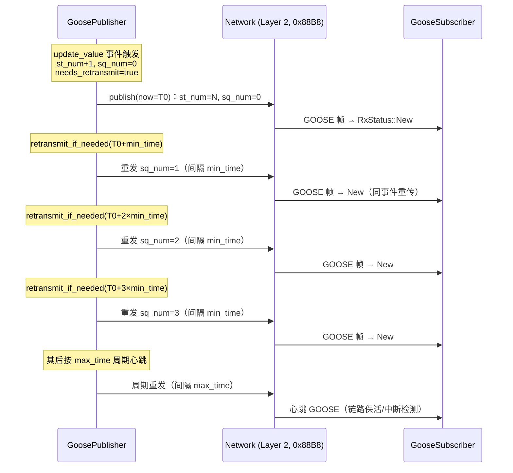
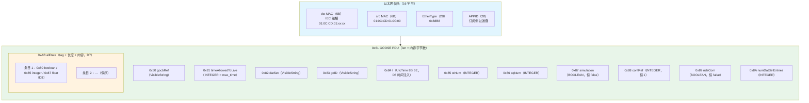

# EnerOS IEC 61850 GOOSE 快速事件传输协议栈设计文档（v0.107.0）

> **版本**：v0.107.0
> **crate**：`eneros-iec61850-goose`（`crates/protocols/iec61850-goose/`）
> **依赖**：`eneros-iec61850-model`（v0.105.0，path 引用）
> **状态**：已实现（GOOSE 发布/订阅 + BER 编解码 + st_num/sq_num 重传状态机 + L2Transport 抽象）
> **覆盖版本**：v0.107.0
> **最后更新**：2026-07-20

---

## 目录

1. [版本定位与目标](#1-版本定位与目标)
2. [架构总览](#2-架构总览)
3. [数据结构设计](#3-数据结构设计)
4. [接口契约](#4-接口契约)
5. [核心机制设计](#5-核心机制设计)
6. [关键流程](#6-关键流程)
7. [与上游 iec61850-model / iec61850-mms 的关系](#7-与上游-iec61850-model--iec61850-mms-的关系)
8. [配置说明](#8-配置说明)
9. [偏差声明](#9-偏差声明)
10. [测试计划](#10-测试计划)
11. [性能与内存](#11-性能与内存)
12. [风险与后续版本展望](#12-风险与后续版本展望)

---

## 1. 版本定位与目标

### 1.1 设计目标

电力保护级快速事件传输要求 GOOSE（IEC 61850-8-1，EtherType 0x88B8）二层组播直发，端到端 < 4ms。v0.105.0 已落地 LD/LN/DO/DA 信息模型，v0.106.0 已落地 MMS 服务层与 BER TLV 编解码规则，本版在二者基座上实现 GOOSE 发布/订阅 + BER PDU 编解码 + st_num/sq_num 重传状态机，打通联邦保护协同的事件通道，为 v0.108.0 SV + IEC 62351 安全加固奠基。

本版本实现：

- **GOOSE 数据集**（蓝图 §4.1）：`GooseDataset` / `GooseEntry`（path + DaValue），`set` 有则覆盖无则追加（保序），`get` 按路径查找。
- **GOOSE 发布者**（蓝图 §4.2/§4.3）：`GoosePublisher<T: L2Transport>` 泛型化（D5）；以太网头 + APPID + GOOSE PDU BER 组帧（allData 0xAB 补长度，D7；数据 tag 统一，D8）；`update_value` 触发 st_num+1 / sq_num=0 / needs_retransmit=true；`publish(now)` / `retransmit_if_needed(now)` 时间注入（D6）。
- **GOOSE 订阅者**（蓝图 §4.2/§4.4）：`GooseSubscriber<T: L2Transport>`；EtherType 0x88B8 / dst MAC / APPID 三重过滤；st_num 跳变检测以 `RxStatus`（New/Duplicate/StJump）随 PDU 返回（D12）；回调注册 `set_callback`（去 Send+Sync bound，D9）。
- **传输抽象**（D4）：`L2Transport` trait（send/recv）+ `MockL2`（帧队列 + 发送记录 + 错误注入 + loopback），主机可测、集成层可接线 v0.27.0 真实网卡。

### 1.2 设计原则

- **Simplicity First**：BER 仅覆盖 GOOSE PDU 子集（0x61 + 11 个固定字段 + allData），不自研完整 ASN.1 编译器；与 v0.106.0 MMS 栈共用长度规则与数据 tag 约定。
- **no_std 全链路**：`#![cfg_attr(not(test), no_std)]` + `extern crate alloc`，第三方依赖仅 `eneros-iec61850-model`，零 unsafe、零 C FFI，交叉编译到 `aarch64-unknown-none`。
- **可测试性**：`MockL2` 提供脚本化帧队列 / loopback / 错误注入，36 个单元测试全部 src 内嵌，主机全过。

### 1.3 在协议栈中的位置

本 crate 位于 `crates/protocols/iec61850-goose/`，与 `iec61850-model` / `iec61850-mms` / `modbus-rtu` / `iec104-slave` 等同层。

- **上游**：v0.105.0 `eneros-iec61850-model`（`DaValue` 复用）、v0.106.0 `eneros-iec61850-mms`（BER TLV 规则与数据 tag 约定复用）、v0.27.0 网卡驱动（真实 L2 接线在集成层，D4）。
- **下游**：v0.108.0 SV + IEC 62351 安全加固。

---

## 2. 架构总览

### 2.1 模块划分

| 模块 | 职责 | 核心类型/函数 |
|------|------|--------------|
| `dataset.rs` | GOOSE 数据集 | `GooseDataset` / `GooseEntry` |
| `goose_tx.rs` | 发布者 + 组帧 + 重传状态机 | `GooseControlBlock` / `GoosePublisher<T>` / BER 编码辅助 |
| `goose_rx.rs` | 订阅者 + 过滤 + 解码 + 跳变检测 | `GoosePdu` / `RxStatus` / `GooseSubscriber<T>` / `read_tag_length` |
| `lib.rs` | 错误类型 + 传输抽象 + Mock + 模块声明 + 重导出 | `GooseError` / `L2Transport` / `MockL2` |

### 2.2 重传时序（蓝图 §4.3）



> 注：前 3 次重发按 `min_time` 间隔快速补齐（对抗瞬时丢帧），其后转 `max_time` 周期心跳保活；每次发送 sq_num 递增、st_num 不变（蓝图 §4.3）。

### 2.3 GOOSE 帧结构



> 注：所有 BER 长度均为**内容字节数**（< 0x80 短型单字节，≥ 0x80 用 0x82 双字节长型），与 v0.106.0 MMS 栈一致。

---

## 3. 数据结构设计

### 3.1 类型清单（10 个 pub 类型）

| 类型 | 说明 | derive |
|------|------|--------|
| `GooseError` | 错误枚举（TransportError/BerEncodeError/BerDecodeError/InvalidConfig，D10） | Debug/Clone/PartialEq |
| `L2Transport` | 二层传输 trait（send/recv，D4） | — |
| `MockL2` | 脚本化 mock 传输（帧队列 + 发送记录 + 错误注入 + loopback，D4/D11） | Debug/Clone/PartialEq |
| `GooseDataset` | 数据集（entries: Vec，保序） | Debug/Clone/PartialEq |
| `GooseEntry` | 条目（path: String / value: DaValue） | Debug/Clone/PartialEq |
| `GooseControlBlock` | 控制块（9 字段全 pub） | Debug/Clone/PartialEq |
| `GoosePublisher<T>` | 发布者（泛型 L2 传输，D5） | — |
| `GoosePdu` | 解码后 PDU（st_num/sq_num/timestamp/dataset） | Debug/Clone/PartialEq |
| `RxStatus` | 接收状态（New/Duplicate/StJump，D12） | Debug/Clone/Copy/PartialEq |
| `GooseSubscriber<T>` | 订阅者（泛型 L2 传输，D5） | — |

### 3.2 关键字段语义

- **`GooseControlBlock.st_num / sq_num`**：st_num 为事件计数（`update_value` +1），sq_num 为同事件内重传计数（`publish` +1）；二者回绕用 `wrapping_add`。
- **`GooseControlBlock.max_time`**：同时作为 `timeAllowedToLive` 字段编码（订阅侧判定链路存活的预算）。
- **`GoosePdu.dataset` 的 `GooseEntry.path`**：rx 侧无路径语义（allData 仅值保序），置空字符串（实现声明）。
- **`MockL2.loopback`**：启用后 `send` 的帧自动进入 rx 队列尾部，支撑 publish→poll 回路测试（LB31/LB32/LB35/LB36）。

---

## 4. 接口契约

以下签名全部提取自实际源码，文档与代码保持一致。

### 4.1 错误类型与传输抽象（lib.rs）

```rust
#[derive(Debug, Clone, PartialEq)]
pub enum GooseError {
    TransportError,
    BerEncodeError,
    BerDecodeError,
    InvalidConfig,
}

pub trait L2Transport {
    fn send(&mut self, frame: &[u8]) -> Result<(), GooseError>;
    fn recv(&mut self, buf: &mut [u8]) -> Result<usize, GooseError>;
}

pub struct MockL2 { /* rx_frames / tx_frames / 注入错误 / loopback */ }
impl MockL2 {
    pub fn new() -> Self;
    pub fn push_rx_frame(&mut self, bytes: &[u8]);
    pub fn tx_frames(&self) -> &[Vec<u8>];
    pub fn clear_tx(&mut self);
    pub fn inject_send_error(&mut self, e: GooseError);
    pub fn inject_recv_error(&mut self, e: GooseError);
    pub fn set_loopback(&mut self, enabled: bool);
    pub fn loopback_enabled(&self) -> bool;
}
```

### 4.2 数据集（dataset.rs）

```rust
#[derive(Debug, Clone, PartialEq)]
pub struct GooseDataset { pub entries: Vec<GooseEntry> }

#[derive(Debug, Clone, PartialEq)]
pub struct GooseEntry { pub path: String, pub value: DaValue }

impl GooseDataset {
    pub fn new() -> Self;
    pub fn set(&mut self, path: &str, value: DaValue);   // 有则覆盖无则追加
    pub fn get(&self, path: &str) -> Option<&GooseEntry>;
}
```

### 4.3 发布者（goose_tx.rs）

```rust
#[derive(Debug, Clone, PartialEq)]
pub struct GooseControlBlock {
    pub go_cb_ref: String,
    pub app_id: u16,
    pub dst_addr: [u8; 6],
    pub min_time: u16,
    pub max_time: u16,
    pub st_num: u32,
    pub sq_num: u32,
    pub dataset_ref: String,
    pub needs_retransmit: bool,
}

pub struct GoosePublisher<T: L2Transport> { /* cb, dataset, last_tx_time, retransmit_count, transport */ }
impl<T: L2Transport> GoosePublisher<T> {
    pub fn new(cb: GooseControlBlock, transport: T) -> Result<Self, GooseError>; // app_id==0 → InvalidConfig
    pub fn update_value(&mut self, path: &str, value: DaValue);
    pub fn publish(&mut self, now: u64) -> Result<(), GooseError>;               // D6 时间注入
    pub fn retransmit_if_needed(&mut self, now: u64) -> bool;
    pub fn cb(&self) -> &GooseControlBlock;
    pub fn dataset(&self) -> &GooseDataset;
    pub fn transport(&self) -> &T;
    pub fn transport_mut(&mut self) -> &mut T;
}
```

### 4.4 订阅者（goose_rx.rs）

```rust
#[derive(Debug, Clone, PartialEq)]
pub struct GoosePdu {
    pub st_num: u32,
    pub sq_num: u32,
    pub timestamp: u64,
    pub dataset: GooseDataset,
}

#[derive(Debug, Clone, Copy, PartialEq)]
pub enum RxStatus { New, Duplicate, StJump }

pub struct GooseSubscriber<T: L2Transport> {
    /* app_id, filter_mac, last_st_num, last_sq_num,
       callback: Option<Box<dyn Fn(&GoosePdu)>>,  // D9 去 Send+Sync bound
       transport */
}
impl<T: L2Transport> GooseSubscriber<T> {
    pub fn new(app_id: u16, mac: [u8; 6], transport: T) -> Result<Self, GooseError>;
    pub fn set_callback<F: Fn(&GoosePdu) + 'static>(&mut self, f: F);
    pub fn poll(&mut self) -> Result<Option<(GoosePdu, RxStatus)>, GooseError>;  // D12
    pub fn last_st_num(&self) -> u32;
    pub fn transport_mut(&mut self) -> &mut T;
}
```

---

## 5. 核心机制设计

### 5.1 组帧与 BER 编码（goose_tx.rs）

#### 5.1.1 帧格式

`dst MAC(6B) + src 组播 MAC 01:0C:CD:01:00:00(6B) + EtherType 0x88B8(2B) + APPID(2B) + GOOSE PDU`。**APPID 2 字节为蓝图省略字段**，接收侧过滤器需要，本实现补入并声明。

#### 5.1.2 BER 长度规则（与 v0.106.0 一致）

- 长度恒为**内容字节数**：< 0x80 短型单字节；≥ 0x80 用 0x82 双字节长型。
- INTEGER 大端最小字节数且保持正数语义（最高位为 1 时前补 0x00）。
- allData 0xAB 为完整「tag + 长度 + 内容」TLV（D7：修复蓝图只有 tag 无长度的 bug，接收端据此确定条目边界）。

#### 5.1.3 数据 tag 统一（D8）

allData 条目 tag 与 v0.106.0 MMS 栈统一（修复蓝图 Bool 0x01 / Int32 0x03 / Float64 0x85 与 MMS 解码约定冲突的 bug）：

| `DaValue` 变体 | tag | 长度 |
|----------------|-----|------|
| `Bool(b)` | `0x80` | 1 |
| `Int32(v)` | `0x85` | 4 |
| `Float32(f)` | `0x87` | 4 |
| `Float64(f)` | `0x87` | 8 |
| `Enum(v)` | `0x86` | 2 |
| `StringVal(s)` | `0x8A` | 变长 |
| `Timestamp(t)` | `0x91` | 8 |

### 5.2 重传状态机（蓝图 §4.3）

- `update_value`：`dataset.set` → `st_num+1`、`sq_num=0`、`needs_retransmit=true`、`retransmit_count=0`。
- `publish(now)`：组帧（t = now）→ `transport.send` → `sq_num+1`、`last_tx_time=now`。
- `retransmit_if_needed(now)`：`needs_retransmit == false` → false；间隔取 `retransmit_count < 3 ? min_time : max_time`；`now - last_tx_time >= interval`（`saturating_sub`）→ publish + `retransmit_count+1` → true，否则 false。

### 5.3 接收过滤与跳变检测（goose_rx.rs）

#### 5.3.1 poll 流程

`recv` → 空帧（n == 0）→ `Ok(None)` → 帧长 < 16 → `BerDecodeError` → EtherType != 0x88B8 → `Ok(None)` → dst MAC 不匹配 → `Ok(None)` → APPID 不匹配 → `Ok(None)` → 解码 GOOSE PDU → RxStatus 判定 → 回调 → 返回。

#### 5.3.2 RxStatus 判定（D12，蓝图 §4.4）

| 条件 | 状态 | 说明 |
|------|------|------|
| `last_st_num == 0`（首帧） | `New` | 初始接收 |
| `st_num == last + 1` | `New` | 新事件 |
| `st_num > last + 1` | `StJump` | 事件丢失（蓝图 §6.5 故障注入） |
| `st_num == last` 且 `sq_num > last_sq` | `New` | 同事件重传 |
| 其余（完全重复 / 旧帧乱序） | `Duplicate` | 不更新 last_st/last_sq |

非 `Duplicate` 时更新 `last_st_num / last_sq_num`；每个有效 PDU 触发一次回调。

#### 5.3.3 解码容错

- 未知字段 tag（gocbRef/datSet/goID/simulation/confRef/ndsCom/numDatSetEntries 等本版不消费字段）：跳过内容不报错。
- allData 未知条目 tag：`Ok(None)` 跳过，不产生 entry（保序仅对已知条目）。
- 截断（声明长度超出剩余缓冲区 / 其他长型标记）：`BerDecodeError`。
- 浮点解码与 v0.106.0 同规则：4 字节 → `Float32`，其余右对齐/截断到 8 字节 → `Float64`。

---

## 6. 关键流程

### 6.1 发布流程

```
GoosePublisher::update_value(path, value)
  ├─ dataset.set(path, value)（有则覆盖无则追加）
  ├─ st_num + 1 / sq_num = 0 / needs_retransmit = true / retransmit_count = 0
  ↓
GoosePublisher::publish(now)
  ├─ build_frame(now)
  │   ├─ GOOSE PDU 内容：gocbRef 0x80 → timeAllowedToLive 0x81 → datSet 0x82
  │   │   → goID 0x83 → t 0x84(8B) → stNum 0x85 → sqNum 0x86 → simulation 0x87
  │   │   → confRef 0x88 → ndsCom 0x89 → numDatSetEntries 0x8A → allData 0xAB(含长度)
  │   └─ 帧头：dst MAC + src 组播 MAC + EtherType 0x88B8 + APPID + 0x61 PDU TLV
  ├─ transport.send(frame)
  └─ sq_num + 1 / last_tx_time = now
```

### 6.2 重传流程（蓝图 §4.3）

```
retransmit_if_needed(now)
  ├─ needs_retransmit == false → return false
  ├─ interval = retransmit_count < 3 ? min_time : max_time
  ├─ now - last_tx_time >= interval ?
  │   ├─ 是 → publish(now) → retransmit_count + 1 → return true
  │   └─ 否 → return false
```

### 6.3 订阅流程

```
GooseSubscriber::poll()
  ├─ transport.recv(buf) → n
  ├─ n == 0 → Ok(None)
  ├─ len < 16 → Err(BerDecodeError)
  ├─ EtherType != 0x88B8 → Ok(None)      // 非 GOOSE 帧
  ├─ dst MAC != filter_mac → Ok(None)    // 非本组播组
  ├─ APPID != app_id → Ok(None)          // 非本 GoCB
  ├─ decode_pdu → GoosePdu
  ├─ classify(st_num, sq_num) → RxStatus
  ├─ status != Duplicate → 更新 last_st/last_sq
  ├─ callback.map(|cb| cb(&pdu))
  └─ Ok(Some((pdu, status)))
```

### 6.4 丢帧检测（蓝图 §6.5 故障注入）

先收 st_num=5（New，last_st=5）→ st_num=6 帧丢失 → 再收 st_num=7：`st_num(7) > last(5) + 1` → 返回 `(pdu, RxStatus::StJump)`，`pdu.st_num == 7`，`last_st_num` 更新为 7（LB34/RX22）。

---

## 7. 与上游 iec61850-model / iec61850-mms 的关系

本 crate 依赖 v0.105.0 `eneros-iec61850-model`（path 引用），复用 `DaValue` 类型基座，零代码改动；不依赖 `eneros-iec61850-mms` crate，但**复用其 BER TLV 规则与数据 tag 约定**（D8 对齐）。

### 7.1 DaValue 复用与 tag 映射（D8）

| `DaValue` 变体 | 编码 tag（goose_tx） | 解码 tag（goose_rx） | 说明 |
|----------------|---------------------|---------------------|------|
| `Bool(b)` | `0x80` | `0x80` | 1 字节，非零为 `true` |
| `Int32(v)` | `0x85` | `0x85` | 4 字节大端（rx 变长符号扩展） |
| `Float32(f)` | `0x87` len=4 | `0x87` len=4 | 右对齐解码 |
| `Float64(f)` | `0x87` len=8 | `0x87` len=8 | 右对齐解码 |
| `Enum(v)` | `0x86` | `0x86` | 2 字节大端 |
| `StringVal(s)` | `0x8A` | `0x8A` | UTF-8 损失性解码 |
| `Timestamp(t)` | `0x91` | `0x91` | 8 字节大端 |

> 注：rx 侧条目 `path` 无来源（allData 仅值保序），置空字符串（实现声明）。

### 7.2 BER 规则复用（相对 v0.106.0）

- 长度语义（短型 < 0x80 / 0x82 双字节长型）、INTEGER 最小字节正数语义、浮点右对齐解码：`goose_rx.rs::read_tag_length` / `decode_float` 与 v0.106.0 `ber_decode.rs` 同规则。
- 差异：GOOSE PDU 为 `0x61` 单层 TLV（无 COTP/ACSE 封装）；allData 为 `0xAB`（MMS listOfData 为 `0xA0`），属 IEC 61850-8-1 各自 ASN.1 定义。

---

## 8. 配置说明

配置模板 `configs/iec61850-goose.toml`（`[gocb]` 节）：

| 键 | 默认 | 说明 |
|----|------|------|
| `go_cb_ref` | `"IED1LD/LLN0$GO$gocb1"` | GoCB 引用（须与 IED SCD 文件一致，否则订阅侧过滤不到帧） |
| `app_id` | `1` | GOOSE APPID（帧内二层过滤键；0 非法 → `InvalidConfig`） |
| `dst_mac` | `"01:0C:CD:01:00:01"` | 目的组播 MAC（IEC 61850 GOOSE 保留段 01:0C:CD:01:xx:xx） |
| `min_time_ms` | `2` | 最小重传间隔（事件后前 3 次按此间隔快速重发） |
| `max_time_ms` | `5000` | 最大重传间隔（3 次快发后的周期心跳；同时作为 timeAllowedToLive） |
| `dataset_ref` | `"IED1LD/LLN0$dsGOOSE1"` | GOOSE 数据集引用（allData 条目来源） |

配置文件中包含 9 处中文注释，覆盖：Raw socket L2 直发选型（蓝图 §5.1）、EtherType 0x88B8 + IEC 组播 MAC、重传 min_time×3 后 max_time 心跳策略（蓝图 §4.3）、L2Transport 传输抽象（D4）、时间注入（D6）、性能 < 4ms 口径（D11）、内存预算（记忆 §5.6）、GPU 不适用（蓝图 §6.6）、IEC 62351 安全加固待 v0.108.0（蓝图 §7.3）。

---

## 9. 偏差声明

### 9.1 D1~D12（与 spec.md 逐字一致）

| 编号 | 偏差 | 理由 |
|------|------|------|
| **D1** | 蓝图 `crates/iec61850_goose/` → `crates/protocols/iec61850-goose/`（eneros-iec61850-goose） | 记忆 §2.3.1 强制：crate 归 `crates/<subsystem>/`；与 mms/iec61850-model 同 protocols 子系统 |
| **D2** | 蓝图 `docs/phase2/goose.md` → `docs/protocols/iec61850-goose-design.md` | 记忆 §2.3.3 强制：文档按方向分类 |
| **D3** | 蓝图 `tests/goose_latency.rs` → src 内嵌 `#[cfg(test)]` | v0.87.0~v0.106.0 项目惯例，不新增 tests/ 文件 |
| **D4** | 删除蓝图 §4.5 `extern "C"` raw socket FFI + unsafe；新增 `L2Transport` trait（send/recv）+ `MockL2`（置于 lib.rs）；真实 raw socket 接线在集成层 | aarch64-unknown-none 无 libc 可链接 extern "C"；主机不可测；项目零 unsafe/零 C FFI 惯例；与 v0.106.0 D4 MmsTransport 同先例 |
| **D5** | `GoosePublisher<T: L2Transport>` / `GooseSubscriber<T: L2Transport>` 泛型化，transport 由 `new` 注入（蓝图内部建 socket 写死 "eth0"） | 可测试性 + 网卡选择属集成层决策（Karpathy Simplicity First） |
| **D6** | 时间注入：`publish(now: u64)` / `retransmit_if_needed(now)` 使用外部时间参数；蓝图 `current_time_ms()` 未定义 | no_std 无系统时间（v0.64.0 D1 时间注入先例）；重传间隔判定需要时钟源 |
| **D7** | 蓝图 bug 修复①：allData 0xAB 只有 tag 无长度字段（条目直接尾随）→ 补「tag + 长度 + 内容」完整 TLV | BER TLV 合规（X.690）；无长度则接收端无法确定条目边界 |
| **D8** | 蓝图 bug 修复②：allData 数据 tag（Bool 0x01 / Int32 0x03 / Float64 0x85）与 v0.106.0 MMS 解码约定冲突 → 统一 boolean 0x80 / integer 0x85 / floating-point 0x87（4B→Float32、8B→Float64） | IEC 61850-8-1 数据 tag 与 MMS 一致；栈内编解码对称，rx 可复用 v0.106.0 解码规则 |
| **D9** | `rx_callback: Box<dyn Fn + Send + Sync>` → 去 Send+Sync bound | 蓝图 §43.1 no_std 全项目去 bound 惯例（v0.64.0/v0.105.0/v0.106.0 一致） |
| **D10** | 错误模型统一：`GooseError` = TransportError / BerEncodeError / BerDecodeError / InvalidConfig（4 变体）；蓝图 SocketCreateFailed/SendFailed 随 FFI 删除合并为 TransportError | FFI 删除后原错误无来源；4 变体覆盖组帧/解码/传输/配置全部失败面（对齐 v0.106.0 D10 精简风格） |
| **D11** | 性能 < 4ms 落地为 cfg(test) Instant 断言（MockL2 回路，编码+传输+解码全链路口径，文档声明）；§6.2 真实网卡端到端为实验室硬件项，以 MockL2 脚本化帧替代 | 无真实网卡硬件（与 v0.106.0 D12 同口径） |
| **D12** | 接收侧 st_num 跳变检测以 `RxStatus`（New/Duplicate/StJump）随 PDU 返回；蓝图 §4.4 要求检测跳变但 §4.2 `poll -> Option<GoosePdu>` 无承载 → `poll -> Option<(GoosePdu, RxStatus)>` | 蓝图自相矛盾（要求检测但接口无处上报）；接收方必须能区分新事件/重传/丢帧 |

### 9.2 实施增量偏差（代码阶段发现）

以下 3 项为源码实现阶段相对任务书/蓝图的增量约定，文档在此集中记录：

1. **APPID 2 字节字段补入**：蓝图 §4.5 组帧代码仅有 dst MAC + src MAC + EtherType，无 APPID 字段；但蓝图 §4.4 要求订阅侧按 APPID 过滤，自相矛盾。本实现在 EtherType 之后、GOOSE PDU 之前补入 APPID（2 字节大端），订阅侧据 `frame[14..16]` 过滤。
2. **`GooseEntry.path` rx 侧置空字符串**：allData 仅值保序、无路径语义，解码侧 `GooseEntry.path` 置 `String::new()`（值与保序语义完整，模块文档已声明）。
3. **`MockL2` 增加 loopback 模式**：`set_loopback(true)` 后 `send` 的帧自动进入 rx 队列尾部，支撑 publish→poll 全链路回路测试（LB31/LB32/LB35/LB36）；任务书未列该开关，属全链路测试刚需。

---

## 10. 测试计划

36 个单元测试全部 src 内嵌 `#[cfg(test)]`（D3），不新增 `tests/` 文件。

### 10.1 测试覆盖总表

| 文件 | 编号 | 数量 | 覆盖点 |
|------|------|------|--------|
| `dataset.rs` | DS1~DS6 | 6 | new 空数据集 / set 追加新路径 / set 覆盖已有路径（不新增）/ get 命中 / get miss → None / 多 DaValue 变体存储 + Clone/PartialEq |
| `goose_tx.rs` | TX7~TX18 | 12 | 以太网头 dst/src 组播 MAC + EtherType 0x88B8 + APPID / gocbRef 0x80 编码 / timeAllowedToLive 0x81 / t 0x84 8 字节 / stNum 0x85 / sqNum 0x86 / allData 0xAB 含长度（D7）/ 数据 tag 统一 0x80/0x85/0x87（D8）/ update_value 后 st+1 sq=0 needs_retransmit / publish 后 sq_num+1 / retransmit 前 3 次 min_time 其后 max_time / 整帧 TLV 可被 read_tag_length 逐层解析 |
| `goose_rx.rs` | RX19~RX30 | 12 | 有效帧解码 / APPID 不匹配丢弃 / dst MAC 不匹配丢弃 / st_num 跳变 → StJump（D12）/ 重复帧 → Duplicate / 非 0x88B8 → Ok(None) / 截断帧 → BerDecodeError / Bool 0x80 值解码 / Int32 0x85 解码 / Float32 4B + Float64 8B / 时间戳提取 / 未知 tag 跳过不报错 |
| `goose_rx.rs` | LB31~LB36 | 6 | publish→poll loopback 值一致 / 多条目保序 / set_callback 被调用 / mock 全链路 < 4ms（Instant，D11）/ 丢帧注入 → 下一帧 StJump / 事件后重传帧 sq_num 递增接收 |

### 10.2 关键测试详解

- **TX13（D7）**：allData 为 `[0xAB, 0x03, 0x80, 0x01, 0x01]`（tag + 长度 + 内容），`read_tag_length` 解出声明长度 == 实际内容长度，且 allData 为 PDU 末字段。
- **TX14（D8）**：TLV 遍历校验 allData 条目 tag 序列 == `[0x80, 0x85, 0x87]`；蓝图 bug tag（0x01/0x03）不得出现。
- **TX17（蓝图 §4.3）**：T0+min_time / +2×min_time / +3×min_time 三次重发，第 4 次起按 max_time（+3×min_time+max_time-1 不到不重发）；共 5 帧，st 恒 1，sq 递增到 5。
- **RX22 / LB34（D12）**：st_num=5 后 st_num=7（6 丢失）→ 第二次 poll 返回 `(pdu, StJump)`，`pdu.st_num == 7`。
- **LB35（D11）**：4 条目（Bool/Float32/Float64/Int32）MockL2 loopback 全链路（编码 + 传输 + 解码）`std::time::Instant` 断言 < 4ms，值一致且保序。
- **LB36**：事件后 3 帧（sq_num=0/1/2）接收状态均为 `New`（同事件重传），`last_st_num` 恒 1。

---

## 11. 性能与内存

### 11.1 性能基准

- **目标**：端到端 < 4ms（蓝图 §6.3/§7.2）。
- **口径声明**：该指标落地为 `#[cfg(test)]` 断言（`std::time::Instant`，D11——no_std 无计时器，v0.64.0 D1 / v0.106.0 D12 先例）。测试为 **MockL2 回路**（BER 编码 + 传输 + 解码全链路口径，无真实网卡 I/O），主机侧实测远低于 4ms，余量充足；真实网卡端到端时延为实验室硬件项（蓝图 §6.2），以 MockL2 脚本化帧替代。
- **复杂度**：组帧 O(n) 遍历数据集条目；解码 O(n) 遍历 PDU 字段与条目；过滤为 O(1) 定长比较。

### 11.2 内存预算（记忆 §5.6）

本 crate 属 **Agent Runtime 管理信息大区**（≤ 64 MB 预算）：

| 项目 | 预算 | 说明 |
|------|------|------|
| 单帧 GOOSE 缓冲 | ≤ 2 KB | 组帧 `Vec::with_capacity(256)`，rx 栈缓冲区 `RECV_BUF_LEN = 2048`；典型帧（4 条目）约 150 B |
| 管理信息大区总预算 | ≤ 64 MB | 与 Agent Runtime 其他组件共享；OOM 策略：降级到规则引擎 |
| OOM 阈值 | 总用量 > 90% | 触发 OOM handler：冻结非关键 Agent（蓝图 §43.6） |

- 字符串/Vec 均走 v0.11.0 用户堆 `alloc`。
- 零 `unsafe`，无堆外内存。

### 11.3 GPU 不适用声明

GOOSE 组帧/解码为字节流拼接与逐层 TLV 解析 workload：无矩阵运算、无大规模张量，GPU 加速无意义。记忆 §4.2 GPU 优先规则仅适用模型训练/校准与数字孪生仿真，不适用协议栈路径。**本 crate 零 GPU 代码**，纯 CPU 字节处理（蓝图 §6.6）。

---

## 12. 风险与后续版本展望

### 12.1 当前风险

| 风险 | 等级 | 缓解措施 |
|------|------|----------|
| 不同厂商 GOOSE 实现差异 | 中 | 未知字段/条目 tag 跳过不报错；解码仅依赖 IEC 61850-8-1 标准 tag |
| 无真实网卡硬件回归 | 中 | MockL2 脚本化/loopback 覆盖全部分支；实验室硬件项在集成阶段补测 |
| < 4ms 真实链路保证依赖网卡与驱动 | 中 | v0.27.0 网卡驱动 + TSN 时隙（v0.78.0）在集成层兜底；crate 内 O(n) 无锁路径 |
| BER 长型长度 > 2 字节 | 低 | 当前仅支持 0x82 双字节长型（≤ 65535 字节），GOOSE 帧远未触及；如需可扩展 |

### 12.2 后续版本展望

| 版本 | 内容 |
|------|------|
| **v0.108.0** | SV（采样值）接收 + **IEC 62351 安全加固**（GOOSE/SV 报文完整性保护 + 源认证，依赖 v0.31.0 国密）。当前 GOOSE 为明文二层组播（无签名、无加密），**生产部署前须完成 v0.108.0 升级**；纵向加密认证装置对接见 v0.98.1 |

---

> **GPU 不适用**：本 crate 无 GPU 代码，纯 CPU 字节处理（蓝图 §6.6）。
>
> **安全声明**：IEC 62351 安全加固待 v0.108.0 落地（蓝图 §7.3）。
>
> **下游解锁**：v0.108.0 SV + IEC 62351 基于本版 GOOSE 协议栈构建。
