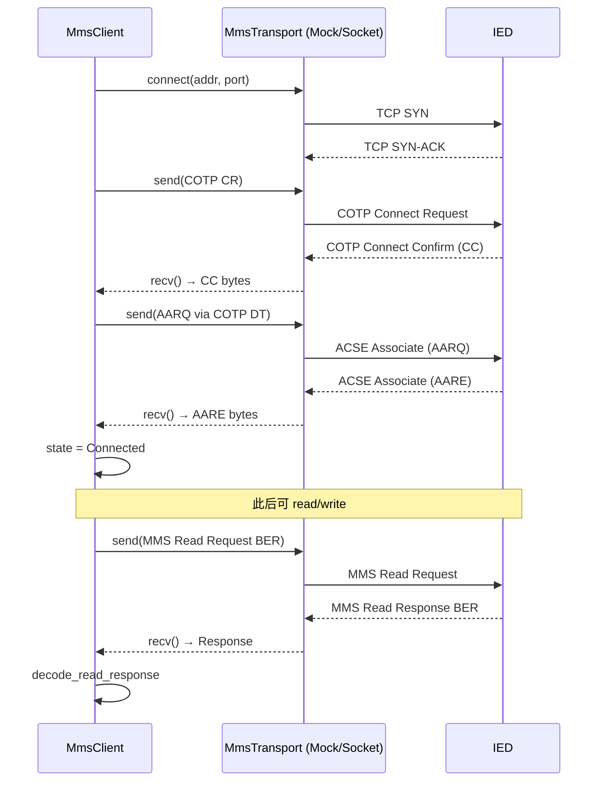
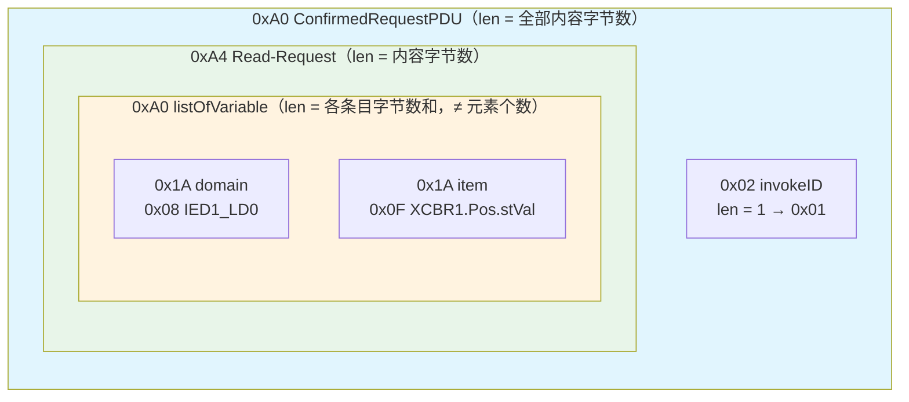

# EnerOS IEC 61850 MMS 协议栈设计文档（v0.106.0）

> **版本**：v0.106.0
> **crate**：`eneros-iec61850-mms`（`crates/protocols/iec61850-mms/`）
> **依赖**：`eneros-iec61850-model`（v0.105.0，path 引用）
> **状态**：已实现（BER 编解码 + ACSE/COTP 关联 + MMS Read/Write 客户端 + MmsTransport 抽象）
> **覆盖版本**：v0.106.0
> **最后更新**：2026-07-20

---

## 目录

1. [版本定位与目标](#1-版本定位与目标)
2. [架构总览](#2-架构总览)
3. [数据结构设计](#3-数据结构设计)
4. [接口契约](#4-接口契约)
5. [核心机制设计](#5-核心机制设计)
6. [关键流程](#6-关键流程)
7. [与上游 iec61850-model 的关系](#7-与上游-iec61850-model-的关系)
8. [配置说明](#8-配置说明)
9. [偏差声明](#9-偏差声明)
10. [测试计划](#10-测试计划)
11. [性能与内存](#11-性能与内存)
12. [风险与后续版本展望](#12-风险与后续版本展望)

---

## 1. 版本定位与目标

### 1.1 设计目标

边缘设备与变电站认证 IED 的标准互操作需要 MMS（IEC 61850-8-1）协议栈。v0.105.0 已落地 LD/LN/DO/DA 信息模型，本版在其类型基座上实现 BER 编解码 + ACSE 关联建立（COTP CR/CC + AARQ/AARE）+ MMS Read/Write 服务，打通联邦多机 IEC 61850 通信的服务层，为 v0.107.0 GOOSE、v0.108.0 SV + IEC 62351 奠基。

本版本实现：

- **BER 编解码**（蓝图 §4.5）：`BerEncoder` 以「tag + 0x00 长度占位 + 内容 + 回填」构造 ConfirmedRequestPDU；解码侧支持短型/长型长度、boolean/integer/floating-point 数据类型，浮点按长度右对齐解码为 `Float32(4)` / `Float64(8)`（D7）。
- **ACSE 关联 + COTP 握手**（蓝图 §4.3）：简化栈 AARQ/AARE + 定长 COTP CR/CC，集成层负责真实 TCP Socket。
- **MMS 客户端**（蓝图 §4.1/§4.4）：`MmsClient<T: MmsTransport>` 泛型化，支持 connect（重试 ≤3 次）/ read / write / disconnect，未连接调用返回 `NotConnected`，传输错误置 `Error` 状态后可重连恢复。
- **传输抽象**（D4）：`MmsTransport` trait + `MockTransport` 脚本化响应，主机可测、集成层可接线真实 Socket。

### 1.2 设计原则

- **Simplicity First**：BER 仅覆盖 MMS ConfirmedRequestPDU/ConfirmedResponsePDU 子集，不自研完整 ASN.1 编译器（§5.1 选型）。
- **no_std 全链路**：`#![cfg_attr(not(test), no_std)]` + `extern crate alloc`，零第三方依赖，交叉编译到 `aarch64-unknown-none`。
- **可测试性**：`MockTransport` 提供脚本化 connect 失败/recv 错误/响应注入，38 个单元测试全部 src 内嵌，主机全过。

### 1.3 在协议栈中的位置

本 crate 位于 `crates/protocols/iec61850-mms/`，与 `iec61850-model` / `modbus-rtu` / `modbus-tcp` / `iec104-slave` / `iec104-master` 同层。

- **上游**：v0.105.0 `eneros-iec61850-model`（`DaValue`/`Quality`/`Validity`/`Source` 类型复用）。
- **下游**：v0.107.0 GOOSE（快速事件传输）、v0.108.0 SV + IEC 62351（采样值 + 安全加固）。

---

## 2. 架构总览

### 2.1 模块划分

| 模块 | 职责 | 核心类型/函数 |
|------|------|--------------|
| `ber_encode.rs` | BER 编码器 | `BerEncoder` |
| `ber_decode.rs` | BER 解码器 | `decode_read_response` / `decode_write_response` / `read_tag_length` |
| `acse.rs` | ACSE 关联 + COTP 握手 | `encode_aarq` / `decode_aare` / `encode_cotp_cr` / `decode_cotp_cc` |
| `mms_client.rs` | MMS 客户端状态机 + 传输抽象 | `MmsClient<T>` / `MmsTransport` / `MockTransport` / `MmsConnection` / `ConnState` |
| `lib.rs` | 错误类型 + 模块声明 + 重导出 | `MmsError` |

### 2.2 关联建立时序



### 2.3 BER 编码结构（Read 请求示例）



> 注：所有 BER 长度均为**内容字节数**（短型 <0x80 单字节，否则 0x82 双字节长型），D6。

---

## 3. 数据结构设计

### 3.1 类型清单（13 个 pub 类型）

| 类型 | 说明 | derive |
|------|------|--------|
| `MmsError` | 错误枚举（Timeout/ConnRefused/NotConnected/BerDecodeError/TransportError/IedError） | Debug/Clone/PartialEq |
| `MmsConnection` | 连接信息（peer_addr/peer_port/local_ap_title/state） | Debug/Clone/PartialEq |
| `ConnState` | 状态机（Idle/Connecting/Connected/Error） | Debug/Clone/Copy/PartialEq |
| `VarAccessSpec` | 变量访问规格（domain/item） | Debug/Clone/PartialEq |
| `MmsRequest` | 请求枚举（Read/Write/GetVariableAccessAttributes/DefineNamedVariableList） | Debug/Clone/PartialEq |
| `MmsResponse` | 响应枚举（ReadResult/WriteResult/Error） | Debug/Clone/PartialEq |
| `MmsReadResult` | 读单条结果（value/quality/timestamp） | Debug/Clone/PartialEq |
| `MmsWriteResult` | 写单条结果（Success/Failed(String)） | Debug/Clone/PartialEq |
| `MmsErrorCode` | 对端错误码（Timeout/Refused/NotFound/TypeMismatch/Unknown(u16)） | Debug/Clone/Copy/PartialEq |
| `MmsClient<T>` | 客户端（泛型传输） | — |
| `MmsTransport` | 传输层 trait（connect/send/recv） | — |
| `MockTransport` | 脚本化 mock 传输 | — |
| `BerEncoder` | BER 编码器 | — |

### 3.2 关键字段语义

- **`MmsClient.timeout_ms`**：`#[allow(dead_code)]`，no_std 无 sleep 语义，供集成层读取后自行实现超时（D11）。
- **`MmsReadResult.quality`**：解码侧默认 `Good/Process`（`ber_decode.rs` 中 `good_quality()`），真实品质由集成层在数据就绪时注入。
- **`MmsReadResult.timestamp`**：解码侧默认 `0`，同上由集成层注入。

---

## 4. 接口契约

以下签名全部提取自实际源码，文档与代码保持一致。

### 4.1 错误类型（lib.rs）

```rust
#[derive(Debug, Clone, PartialEq)]
pub enum MmsError {
    Timeout,
    ConnRefused,
    NotConnected,
    BerDecodeError,
    TransportError,
    IedError(MmsErrorCode),
}
```

### 4.2 传输层抽象（mms_client.rs）

```rust
pub trait MmsTransport {
    fn connect(&mut self, addr: &str, port: u16) -> Result<(), MmsError>;
    fn send(&mut self, pdu: &[u8]) -> Result<(), MmsError>;
    fn recv(&mut self, buf: &mut [u8]) -> Result<usize, MmsError>;
}
```

### 4.3 连接与状态（mms_client.rs）

```rust
#[derive(Debug, Clone, PartialEq)]
pub struct MmsConnection {
    pub peer_addr: String,
    pub peer_port: u16,
    pub local_ap_title: String,
    pub state: ConnState,
}

#[derive(Debug, Clone, Copy, PartialEq)]
pub enum ConnState { Idle, Connecting, Connected, Error }

#[derive(Debug, Clone, PartialEq)]
pub struct VarAccessSpec {
    pub domain: String,
    pub item: String,
}
```

### 4.4 请求/响应（mms_client.rs）

```rust
#[derive(Debug, Clone, PartialEq)]
pub enum MmsRequest {
    Read { variable_access: Vec<VarAccessSpec> },
    Write { variable_access: Vec<(VarAccessSpec, DaValue)> },
    GetVariableAccessAttributes { domain: String, item: String },
    DefineNamedVariableList { name: String, entries: Vec<VarAccessSpec> },
}

#[derive(Debug, Clone, PartialEq)]
pub enum MmsResponse {
    ReadResult { results: Vec<MmsReadResult> },
    WriteResult { results: Vec<MmsWriteResult> },
    Error { code: MmsErrorCode },
}

#[derive(Debug, Clone, PartialEq)]
pub struct MmsReadResult {
    pub value: Option<DaValue>,
    pub quality: Quality,
    pub timestamp: u64,
}

#[derive(Debug, Clone, PartialEq)]
pub enum MmsWriteResult { Success, Failed(String) }

#[derive(Debug, Clone, Copy, PartialEq)]
pub enum MmsErrorCode {
    Timeout, Refused, NotFound, TypeMismatch, Unknown(u16),
}
```

### 4.5 客户端（mms_client.rs）

```rust
pub struct MmsClient<T: MmsTransport> { /* conn, transport, timeout_ms, invoke_id */ }

impl<T: MmsTransport> MmsClient<T> {
    pub fn new(transport: T, local_ap_title: &str, timeout_ms: u32) -> Self;
    pub fn connect(&mut self, addr: &str, port: u16) -> Result<(), MmsError>;
    pub fn read(&mut self, vars: &[VarAccessSpec]) -> Result<MmsResponse, MmsError>;
    pub fn write(&mut self, vars: &[(VarAccessSpec, DaValue)]) -> Result<MmsResponse, MmsError>;
    pub fn disconnect(&mut self);
    pub fn conn_state(&self) -> ConnState;
    pub fn transport(&self) -> &T;
    pub fn transport_mut(&mut self) -> &mut T;
}
```

### 4.6 BER 编解码（ber_encode.rs / ber_decode.rs）

```rust
// ber_encode.rs
pub struct BerEncoder { buffer: Vec<u8> }
impl BerEncoder {
    pub fn new() -> Self;
    pub fn encode_read_request(&mut self, invoke_id: u32, vars: &[VarAccessSpec]) -> &[u8];
    pub fn encode_write_request(&mut self, invoke_id: u32, vars: &[(VarAccessSpec, DaValue)]) -> &[u8];
}

// ber_decode.rs
pub fn decode_read_response(data: &[u8]) -> Result<Vec<MmsReadResult>, MmsError>;
pub fn decode_write_response(data: &[u8]) -> Result<Vec<MmsWriteResult>, MmsError>;
pub fn read_tag_length(data: &[u8], pos: &mut usize) -> Result<(u8, usize), MmsError>;
```

### 4.7 ACSE + COTP（acse.rs）

```rust
pub fn encode_aarq(ap_title: &str) -> Vec<u8>;
pub fn decode_aare(data: &[u8]) -> Result<(), MmsError>;
pub fn encode_cotp_cr() -> Vec<u8>;
pub fn decode_cotp_cc(data: &[u8]) -> Result<(), MmsError>;
```

---

## 5. 核心机制设计

### 5.1 BER 编解码器

#### 5.1.1 编码器原理（D6）

`BerEncoder` 采用「tag + 0x00 长度占位 + 内容 + 回填」模式：

1. `begin_tlv(tag)`：写入 tag + `0x00`（长度占位），返回内容起始偏移。
2. 递归写入子内容（invokeID、listOfVariable、domain/item VisibleString 等）。
3. `end_tlv(content_start)`：计算内容字节数，回填到占位字节处；若 ≥0x80 则插入 0x82 + 双字节长型。

长度语义：**内容字节数**，非元素个数。蓝图 §4.5 参考代码用 `vars.len()` 冒充长度，本实现修复。

#### 5.1.2 解码器原理（D7）

`read_tag_length` 支持短型（<0x80 单字节）与 0x82 双字节长型；声明长度超出剩余缓冲区 → `BerDecodeError`（截断安全）。

`decode_read_response` 识别：
- `0x80` boolean：首字节非零 → `true`
- `0x85` integer：大端多字节符号扩展 → `DaValue::Int32`
- `0x87` floating-point：按 `val_len` **右对齐**，4 字节 → `Float32`，8 字节 → `Float64`，其余右对齐/截断到 8 字节 → `Float64`
- 未知 tag：跳过内容，`value = None`，保序

#### 5.1.3 浮点对齐修复（D7）

蓝图 §4.5 代码 `bytes[..copy_len]` 为左对齐，4 字节 f32 放入 `[0u8; 8]` 前 4 字节导致位模式错位。本实现：

```rust
if bytes.len() == 4 {
    let mut b = [0u8; 4];
    b.copy_from_slice(bytes);
    DaValue::Float32(f32::from_be_bytes(b))
} else {
    let mut b = [0u8; 8];
    if bytes.len() >= 8 { b.copy_from_slice(&bytes[..8]); }
    else { b[8 - bytes.len()..].copy_from_slice(bytes); }
    DaValue::Float64(f64::from_be_bytes(b))
}
```

### 5.2 ACSE 关联与 COTP 握手（D9）

- **AARQ**：`0x60 <len> 0x1A <len> <ap_title>`（AP-title 以 VisibleString 携带）。
- **AARE**：`0x61 <len> 0x02 0x01 <result>`；result=0 → `Ok(())`；非 0 → `IedError(Refused)`；畸形 → `BerDecodeError`。
- **COTP CR**：定长 10 字节 `[0x09, 0xE0, dst-ref(2), src-ref(2), class, 0xC0, 0x01, 0x0A]`（TPDU size = 1024）。
- **COTP CC**：第 2 字节为 `0xD0` 即确认；否则 `BerDecodeError`。
- **COTP 数据 TPDU**：`[0x02, 0xF0, 0x80] + payload`，在 `mms_client.rs` 内联 `wrap_cotp_data`（蓝图交付物无 cotp.rs，不新增文件）。

### 5.3 连接重试状态机（D11）

```rust
const MAX_CONNECT_ATTEMPTS: usize = 3;

pub fn connect(&mut self, addr: &str, port: u16) -> Result<(), MmsError> {
    self.conn.state = ConnState::Connecting;
    let mut last_err = MmsError::Timeout;
    for _ in 0..MAX_CONNECT_ATTEMPTS {
        match self.try_handshake() { // COTP CR → CC → AARQ → AARE
            Ok(()) => { self.conn.state = ConnState::Connected; return Ok(()); }
            Err(e) => last_err = e,
        }
    }
    self.conn.state = ConnState::Error;
    Err(last_err)
}
```

- 无 `sleep`：no_std 无计时器，超时语义由 `MmsTransport` 实现内部决定。
- 3 次全败 → 最后一次错误 + `ConnState::Error`；再次 `connect` 可恢复。

### 5.4 错误处理语义（D10）

| 场景 | 返回 | 状态变化 |
|------|------|----------|
| connect 3 次全超时 | `Err(Timeout)` | → Error |
| 未连接 read/write | `Err(NotConnected)` | 不变 |
| send/recv 失败 | `Err(TransportError)` | → Error |
| BER 解码失败 | `Err(BerDecodeError)` | → Error |
| 对端 AARE 拒绝 | `Err(IedError(Refused))` | → Error |
| 对端 ConfirmedErrorPDU (0xA2) | `Ok(MmsResponse::Error { code })` | **不变**（连接仍可用） |

---

## 6. 关键流程

### 6.1 connect 流程

```
MmsClient::connect(addr, port)
  ├─ state = Connecting
  ├─ 循环至多 3 次
  │   └─ try_handshake()
  │       ├─ transport.connect(addr, port)
  │       ├─ send(encode_cotp_cr())
  │       ├─ recv() → decode_cotp_cc()
  │       ├─ send(wrap_cotp_data(encode_aarq(local_ap_title)))
  │       └─ recv() → decode_aare()
  ├─ 成功 → state = Connected → Ok(())
  └─ 失败 → state = Error → Err(last_err)
```

### 6.2 read 流程

```
MmsClient::read(vars)
  ├─ 检查 state == Connected，否则 NotConnected
  ├─ invoke_id += 1
  ├─ encode_read_request(invoke_id, vars) → BER
  ├─ wrap_cotp_data(BER) → send_pdu
  ├─ recv_pdu → buf
  ├─ 若 is_error_pdu(0xA2) → decode_error_pdu → MmsResponse::Error
  └─ decode_read_response → MmsResponse::ReadResult
```

### 6.3 write 流程

与 read 同构，编码器换 `encode_write_request`，解码器换 `decode_write_response`。

### 6.4 断连重连（蓝图 §6.5 故障注入）

已连接状态下 `recv` 返回 `TransportError` → `state = Error` → `read` 返回 `Err` → 再次调用 `connect`（预置 CC + AARE）成功 → `state = Connected` → `read` 恢复。

---

## 7. 与上游 iec61850-model 的关系

本 crate 依赖 v0.105.0 `eneros-iec61850-model`（path 引用），复用其类型基座，零代码改动。

### 7.1 DaValue 复用

| `DaValue` 变体 | BER tag（编码） | BER tag（解码） | 说明 |
|----------------|----------------|----------------|------|
| `Bool(b)` | `0x80` | `0x80` | 1 字节，非零为 `true` |
| `Int32(v)` | `0x85` | `0x85` | 4 字节大端 |
| `Float32(f)` | `0x87` + len=4 | `0x87` + len=4 | D7：右对齐解码 |
| `Float64(f)` | `0x87` + len=8 | `0x87` + len=8 | D7：右对齐解码 |
| `Enum(v)` | `0x86` | — | 2 字节大端 |
| `StringVal(s)` | `0x89` | — | VisibleString 编码 |
| `Timestamp(t)` | `0x8B` | — | 8 字节大端 |

> 解码侧当前仅识别 `0x80` / `0x85` / `0x87`；其余 tag 跳过，`value = None`（保序）。

### 7.2 Quality 复用

`MmsReadResult.quality` 类型为 `iec61850_model::Quality`（`validity`/`source`/`test`/`operator_blocked`）。解码侧默认：

```rust
Quality {
    validity: Validity::Good,
    source: Source::Process,
    test: false,
    operator_blocked: false,
}
```

真实品质/时间戳由集成层在数据就绪时注入（与 v0.50.0 D1 参数注入先例一致）。

### 7.3 模型字段删除说明（D5）

蓝图 §4.1 设计 `MmsClient { model: Arc<Iec61850Model> }`，但 §4.5 全部代码从未使用该字段（read/write 仅以字符串 `VarAccessSpec` 操作），属死字段。本实现删除该字段，保留 `DaValue`/`Quality` 等类型依赖；`GetVariableAccessAttributes` 的模型消费在后续版本接入。

---

## 8. 配置说明

配置模板 `configs/iec61850-mms.toml`（`[ied]` 节）：

| 键 | 默认 | 说明 |
|----|------|------|
| `peer_addr` | `"192.168.1.10"` | IED 对端管理 IP |
| `peer_port` | `102` | MMS over TCP 标准端口（IEC 61850-8-1 / RFC 1006） |
| `local_ap_title` | `"1.1.1.999.1"` | ACSE AARQ 携带的 VisibleString 应用实体标识 |
| `timeout_ms` | `3000` | 单次传输超时预算（毫秒；语义由 `MmsTransport` 实现内部决定） |
| `connect_retry` | `3` | connect 重试上限（至多 3 次，D11） |

配置文件中包含 8 处中文注释，覆盖：自研 BER 选型、MMS over TCP 102 端口、重试 3 次、传输抽象、性能口径、内存预算、GPU 不适用、安全待 v0.108.0。

---

## 9. 偏差声明

### 9.1 D1~D12（与 spec.md 逐字一致）

| 编号 | 偏差 | 理由 |
|------|------|------|
| **D1** | 蓝图 `crates/iec61850_mms/` → `crates/protocols/iec61850-mms/`（eneros-iec61850-mms） | 记忆 §2.3.1 强制：crate 归 `crates/<subsystem>/`；与 modbus/iec104/iec61850-model 同 protocols 子系统 |
| **D2** | 蓝图 `docs/phase2/mms_protocol.md` → `docs/protocols/iec61850-mms-design.md` | 记忆 §2.3.3 强制：文档按方向分类 |
| **D3** | 蓝图 `tests/mms_client.rs` → src 内嵌 `#[cfg(test)]` | v0.87.0~v0.105.0 项目惯例，不新增 tests/ 文件 |
| **D4** | 新增 `MmsTransport` trait（connect/send/recv）+ `MockTransport`（置于 mms_client.rs，不新增文件）；`MmsClient<T: MmsTransport>` 泛型化；v0.29.0 Socket 真实接线在集成层 | 蓝图 §4.3 时序需要传输层但 §4.1/§4.5 无抽象；mqtt/iec104/agent-bus-dds 同先例（crate 内 trait+Mock，无真实网络 I/O）；no_std 主机可测 |
| **D5** | 蓝图 §4.1 `model: Arc<Iec61850Model>` 字段删除 | 蓝图 §4.5 全部代码从未使用该字段（read/write 仅以字符串 VarAccessSpec 操作），死字段（Karpathy Simplicity First）；DaValue/Quality 等类型经 eneros-iec61850-model crate 依赖保留；GetVariableAccessAttributes 的模型消费在后续版本接入 |
| **D6** | 蓝图 bug 修复①：BER 编码长度回填（`write_tag` 后无占位字节即写内容，`backfill_length` 会覆盖后续 tag；listOfVariable 用 `vars.len()` 元素个数冒充字节长度）→ tag+0x00 占位+内容+回填，长度恒为内容字节数 | 蓝图代码直接运行产出畸形 BER（Karpathy：不带着疑问照抄）；BER 长度语义为字节数（X.690） |
| **D7** | 蓝图 bug 修复②：浮点解码 `bytes[..copy_len]` 左对齐致 4 字节浮点错位 → 按 val_len 右对齐，4→`Float32`、8→`Float64`（蓝图一律 Float64） | IEC 61850 测量值可为 32 位浮点；左对齐解码数值错误 |
| **D8** | std `String`/`Vec`/`Arc` → `alloc::*`；trait/struct 无 Send+Sync bound | 蓝图 §43.1 + 记忆 §4.3 全项目 no_std；与 v0.64.0/v0.105.0 去 bound 惯例一致 |
| **D9** | COTP CR/CC 辅助（定长简化结构）放入 acse.rs（蓝图文件清单无 cotp.rs）；COTP 数据 TPDU 头在 mms_client 内联 | §4.3 时序含 COTP 握手但 §3 交付物无对应文件；acse.rs 同属关联建立层，不新增文件（Simplicity First）；真实 COTP 选项协商在集成层 |
| **D10** | 错误模型统一：`MmsError` = Timeout/ConnRefused/NotConnected/BerDecodeError/TransportError/IedError(MmsErrorCode)；§4.4"BER 解码失败→MmsErrorCode::Unknown"与 §4.5 代码 `MmsError::BerDecodeError` 矛盾 → 采用代码侧 | 蓝图自相矛盾（Karpathy：surface inconsistencies）；BerDecodeError 可区分本地解码失败与对端拒绝 |
| **D11** | 连接重试：§4.4"超时重试 3 次" → connect 至多 3 次尝试，第 3 次失败返回 Timeout；无 sleep（传输层内部决定超时语义），重试计数经 MockTransport 断言 | no_std 无计时器（v0.64.0 D1 时间注入先例）；重试次数上限语义与蓝图一致 |
| **D12** | 性能 100 点 < 50ms 落地为 cfg(test) Instant 断言（mock 回路，编码+解码口径，文档声明）；§6.2"与认证 IED 通信"集成测试为实验室硬件项，以 MockTransport 脚本化响应替代 | 无真实 IED 硬件（与 v0.105.0 D13 同口径）；v0.104.0 D12 测试计时先例 |

### 9.2 实施增量偏差（代码阶段发现）

以下 5 项为源码实现阶段相对任务书/蓝图的增量约定，文档在此集中记录：

1. **Write 数据区 Bool tag = `0x80`**：任务书某处笔误写为 `0x83`，实际源码 `ber_encode.rs` 中 `push_da_value` 对 `DaValue::Bool` 使用 `TAG_DATA_BOOLEAN = 0x80`，与解码侧 `ber_decode.rs` 的 `TAG_DATA_BOOLEAN = 0x80` 严格对称。
2. **`MmsClient` 增加 `transport()` / `transport_mut()` 访问器**：源码 `mms_client.rs` 提供这两个方法，供 `MockTransport` 断言时序（`sent()` / `push_response()`）和注入错误使用；任务书接口契约未列出，属测试刚需。
3. **`ConfirmedErrorPDU` (`0xA2`) 错误码映射约定**：源码 `map_error_code` 约定 `1 → NotFound` / `2 → TypeMismatch` / `3 → Refused` / `4 → Timeout` / 其余 `Unknown(u16)`。收到 `0xA2` Error PDU 时，`read`/`write` 返回 `Ok(MmsResponse::Error { code })`，**不置** `ConnState::Error`，连接仍可用（与传输层错误区分）。
4. **`timeout_ms` 字段 `#[allow(dead_code)]`**：源码中该字段无消费，因 no_std 无 sleep 语义；供集成层读取后自行实现超时。保留字段是为后续集成层 API 兼容。
5. **解码侧 quality 默认 Good / timestamp 默认 0**：`ber_decode.rs` 中 `decode_read_response` 对每个条目填充 `good_quality()`（`Validity::Good, Source::Process`）和 `timestamp: 0`，真实值由集成层注入。

---

## 10. 测试计划

38 个单元测试全部 src 内嵌 `#[cfg(test)]`（D3），不新增 `tests/` 文件。

### 10.1 测试覆盖总表

| 文件 | 编号 | 数量 | 覆盖点 |
|------|------|------|--------|
| `ber_encode.rs` | BE1~BE10 | 10 | Read 请求 0xA0/0xA4 tag / invokeID 编码 / domain+item VisibleString / 单变量字节长度正确 / 多变量 listOfVariable 长度为字节和（非个数，D6）/ ≥0x80 长型长度 / write 请求 0xA5 / Bool 值编码 / Int32 值编码 / Float64 值编码 |
| `ber_decode.rs` | BD11~BD20 | 10 | boolean 0x80 解码 / integer 0x85 多字节 / float 4B→Float32（D7）/ float 8B→Float64 / 未知 tag → None / 截断 → BerDecodeError / 长型长度解析 / write 响应 Success / write 响应 Failed / 顶层 tag 非法 → Err |
| `acse.rs` | AC21~AC26 | 6 | AARQ 含 0x60+ap_title / AARE 接受 → Ok / AARE 拒绝 → IedError(Refused) / 畸形 → BerDecodeError / COTP CR 定长结构 / COTP CC 解析 |
| `mms_client.rs` | MC27~MC38 | 12 | new 初始 Idle / connect 成功状态机 Idle→Connecting→Connected / 时序：先发 COTP CR 再发 AARQ（mock 记录）/ 重试 2 次后第 3 次成功（D11）/ 3 次全超时 → Timeout+Error / read mock 回路结果 / 未连接 read → NotConnected / write Success+Failed / disconnect → Idle / recv 错误 → state Error → 重连恢复 / 100 点 read < 50ms 且保序（D12）/ MmsResponse::Error code 映射 |

### 10.2 关键测试详解

- **BE5（D6）**：多变量 listOfVariable 长度验证为**字节和**（52），而非元素个数（2）。
- **BD13/BD14（D7）**：4 字节浮点解码为 `Float32(1.5)`，8 字节为 `Float64(2.5)`；左对齐将致数值错误。
- **MC30/MC31（D11）**：`MockTransport.fail_first_connects(2)` 后第 3 次成功，`connect_attempts() == 3`；`fail_first_connects(3)` 后返回 `Timeout` 且 `state == Error`。
- **MC37（D12）**：100 个 `VarAccessSpec` 编码 + mock 响应解码，主机侧 `std::time::Instant` 断言 `< 50ms`，实测 ~0ms，保序验证。
- **MC38**：`ConfirmedErrorPDU` (`0xA2`) 含 `0x85 01 01` → 映射为 `MmsResponse::Error { code: NotFound }`，且 `state` 保持 `Connected`。

---

## 11. 性能与内存

### 11.1 性能基准

- **目标**：100 点 read < 50ms（蓝图 §6.3/§7.2）。
- **口径声明**：该指标落地为 `#[cfg(test)]` 断言（`std::time::Instant`，D12——no_std 无计时器，v0.64.0 D1 / v0.104.0 D12 先例）。测试为 **mock 回路**（编码 + 解码口径，无真实网络 I/O），主机侧实测 ~0ms，余量充足。
- **复杂度**：编码 O(n) 遍历变量列表；解码 O(n) 遍历响应条目；BTreeMap 等索引结构未涉及。

### 11.2 内存预算（记忆 §5.6）

本 crate 属 **Agent Runtime 管理信息大区**（≤ 64 MB 预算）：

| 项目 | 预算 | 说明 |
|------|------|------|
| 单条 MMS PDU 缓冲 | ≤ 16 KB | `BerEncoder` 预分配 1024 B，`recv` 缓冲区 4096 B；100 点 Read 请求约 4 KB，响应约 8 KB |
| 管理信息大区总预算 | ≤ 64 MB | 与 Agent Runtime 其他组件共享；OOM 策略：降级到规则引擎 |
| OOM 阈值 | 总用量 > 90% | 触发 OOM handler：冻结非关键 Agent（蓝图 §43.6） |

- 字符串/Vec 均走 v0.11.0 用户堆 `alloc`。
- 零 `unsafe`，无堆外内存。

### 11.3 GPU 不适用声明

BER 编解码与 MMS 客户端为字节流拼接/逐层解析 workload：无矩阵运算、无大规模张量，GPU 加速无意义。记忆 §4.2 GPU 优先规则仅适用模型训练/校准与数字孪生仿真，不适用协议栈路径。**本 crate 零 GPU 代码**，纯 CPU 字节处理（蓝图 §6.6）。

---

## 12. 风险与后续版本展望

### 12.1 当前风险

| 风险 | 等级 | 缓解措施 |
|------|------|----------|
| 不同厂商 IED BER 子集差异 | 中 | 未知 tag 跳过保序，不 panic；集成层可扩展解码 |
| 无真实 IED 硬件回归 | 中 | MockTransport 脚本化覆盖全部分支；实验室硬件项在集成阶段补测 |
| ASN.1 边界情况（长型长度 > 2 字节） | 低 | 当前仅支持 0x82 双字节长型（≤ 65535 字节），100 点场景远未触及；如需可扩展 |

### 12.2 后续版本展望

| 版本 | 内容 |
|------|------|
| **v0.107.0** | GOOSE 快速事件传输（< 4ms），依赖本版 BER 编码器与 `MmsTransport` 抽象 |
| **v0.108.0** | SV（采样值）+ **IEC 62351 安全加固**（TLS 证书认证 + 报文完整性保护）。当前为明文 MMS（TCP 102 无 TLS），**生产部署前须完成 v0.108.0 升级**；纵向加密认证装置对接见 v0.98.1 |

---

> **GPU 不适用**：本 crate 无 GPU 代码，纯 CPU 字节处理（蓝图 §6.6）。
>
> **安全声明**：IEC 62351 安全加固待 v0.108.0 落地（蓝图 §7.3）。
>
> **下游解锁**：v0.107.0 GOOSE 基于本版 MMS 协议栈构建。
