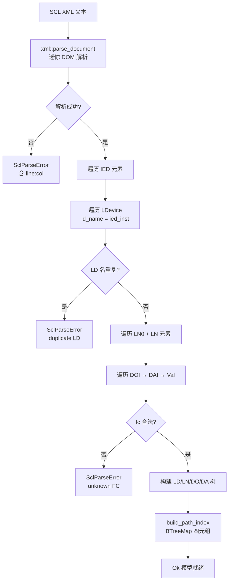
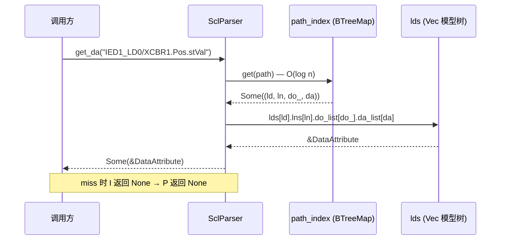

# EnerOS IEC 61850 信息模型设计文档（v0.105.0）

> **版本**：v0.105.0
> **crate**：`eneros-iec61850-model`（`crates/protocols/iec61850-model/`）
> **依赖**：零第三方依赖（no_std + alloc，仅 `core::*` / `alloc::*`）
> **状态**：已实现（LD/LN/DO/DA 四层模型 + SCL 解析 + 路径索引）
> **覆盖版本**：v0.105.0
> **最后更新**：2026-07-19

---

## 目录

1. [概述](#1-概述)
2. [架构](#2-架构)
3. [核心类型](#3-核心类型)
4. [Iec61850Model trait](#4-iec61850model-trait)
5. [SCL 解析](#5-scl-解析)
6. [路径索引与查询](#6-路径索引与查询)
7. [UPA 语义映射](#7-upa-语义映射)
8. [配置](#8-配置)
9. [no_std 合规](#9-no_std-合规)
10. [测试策略](#10-测试策略)
11. [性能](#11-性能)
12. [偏差声明](#12-偏差声明)

---

## 1. 概述

### 1.1 设计目标

IEC 61850 信息模型是 EnerOS 联邦多机通信（Phase 2 P2-G）的地基。MMS
（v0.106.0）、GOOSE（v0.107.0）、SV + IEC 62351（v0.108.0）三种协议都操作
同一棵 LD/LN/DO/DA 语义树——没有统一信息模型，三种协议将各自维护一套
点表，语义漂移不可避免。本版本实现：

- **四层数据结构**（蓝图 §4.1）：LogicalDevice → LogicalNode → DataObject →
  DataAttribute，字段全 pub，`Vec` 存储（D4）。
- **SCL 自动解析**（蓝图 §5.1）：从 Substation Configuration Language（XML）
  文件直接建模，内置迷你 XML DOM 解析器（零第三方依赖，D4）。
- **路径索引快速查找**（蓝图 §6.3/§7.2）：`LD/LN.DO.DA` 路径 → 四元组索引，
  1000 次 DA 查找 < 1ms。

### 1.2 设计原则

- **Simplicity First**：仅交付四层模型 + SCL 解析 + 路径索引，不实现
  MMS/GOOSE/SV 编解码（后续版本任务）。
- **零依赖**：不引入 roxmltree/SlotMap/HashMap 等第三方组件（D4），全
  workspace `cargo deny` 零新增。
- **确定性**：重复 LD 名、未知 FC 均显式报错（D8/D11），不静默容错；
  `set_da` 类型检查以 DaValue variant 判别式为准（D12）。

### 1.3 在协议栈中的位置

本 crate 位于 `crates/protocols/`，与 modbus-rtu / modbus-tcp / iec104-slave /
iec104-master / upa-model 同层。上游 v0.50.0 upa-model（统一点表）仅语义
对齐、零代码依赖（§7）；下游 v0.106.0~v0.108.0 消费本模型。

---

## 2. 架构

### 2.1 模块划分

| 模块 | 职责 | 类型 |
|------|------|------|
| `ld.rs` | 逻辑设备 | `LogicalDevice` |
| `ln.rs` | 逻辑节点 | `LogicalNode` / `LnClass` |
| `do_da.rs` | 数据对象/属性 | `DataObject` / `DataAttribute` / `DaValue` / `Quality` 等 |
| `scl_parser.rs` | SCL 解析 + 模型存储 + 路径索引 | `SclParser`（impl `Iec61850Model`） |
| `xml.rs`（私有） | 迷你 XML DOM 解析器 | `XmlNode` / `parse_document` |
| `lib.rs` | trait + 错误 + 重导出 | `Iec61850Model` / `ModelError` |

### 2.2 SCL 解析流程



---

## 3. 核心类型

### 3.1 四层层次

```
LogicalDevice (ld_name/ref_name/lns)
  └── LogicalNode (ln_class/ln_inst/ln_prefix/do_list)
        └── DataObject (do_name/da_list/cdc)
              └── DataAttribute (da_name/fc/value/quality/timestamp)
```

### 3.2 类型清单（14 个 pub 类型）

| 类型 | 说明 | derive |
|------|------|--------|
| `LogicalDevice` | 逻辑设备（ld_name = `{ied}_{inst}`） | Debug/Clone/PartialEq |
| `LogicalNode` | 逻辑节点 | Debug/Clone/PartialEq |
| `LnClass` | XCBR/MMXU/PTRC/CSWI/GGIO/Other(String) | Debug/Clone/PartialEq |
| `DataObject` | 数据对象 | Debug/Clone/PartialEq |
| `CommonDataClass` | SPS/DPS/MV/ENS/ACT/ASG/Other(String) | Debug/Clone/PartialEq |
| `DataAttribute` | 数据属性（叶子） | Debug/Clone/PartialEq |
| `FunctionalConstraint` | ST/MX/CO/SP/SG/SE/BR/OR（8 变体） | Debug/Clone/Copy/PartialEq |
| `DaValue` | Bool/Int32/Float32/Float64/Enum/StringVal/Timestamp | Debug/Clone/PartialEq（不派生 Eq） |
| `Quality` | validity/source/test/operator_blocked | Debug/Clone/Copy/PartialEq |
| `Validity` | Good/Invalid/Reserved/Questionable | Debug/Clone/Copy/PartialEq |
| `Source` | Process/Substituted | Debug/Clone/Copy/PartialEq |
| `Iec61850Model` | 信息模型 trait（§4） | — |
| `SclParser` | SCL 解析器 + 模型存储 | — |
| `ModelError` | SclParseError/NotFound/TypeMismatch（均携带 String） | Debug/Clone/PartialEq |

### 3.3 开放枚举扩展

非标准 LN 类（如 "PDIS"）与 CDC（如 "WYE"）分别以
`LnClass::Other("PDIS")` / `CommonDataClass::Other("WYE")` 保留原始名，
不丢弃、不 panic（蓝图 §9 可扩展）。LLN0 走 `Other("LLN0")`（D10）。

---

## 4. Iec61850Model trait

```rust
pub trait Iec61850Model {        // 无 Send+Sync（D6）
    fn load_scl(&mut self, scl_xml: &str) -> Result<(), ModelError>;
    fn get_ld(&self, ld_name: &str) -> Option<&LogicalDevice>;
    fn get_ln(&self, ld_name: &str, ln_ref: &str) -> Option<&LogicalNode>;
    fn get_da(&self, path: &str) -> Option<&DataAttribute>;   // "LD/LN.DO.DA"
    fn set_da(&mut self, path: &str, value: DaValue) -> Result<(), ModelError>;
    fn list_lds(&self) -> Vec<&str>;
}
```

- `load_scl` 可多次调用**追加**模型；解析出重复 LD 名时返回
  `SclParseError`（D11）。
- `get_da` 不存在返回 `None`；`set_da` 路径不存在返回 `NotFound`（携带
  路径），DaValue variant 判别式不一致返回 `TypeMismatch`（携带期望/实际
  variant，D12），一致则仅更新 `value` 字段（quality/timestamp 不动）。

---

## 5. SCL 解析

### 5.1 迷你 XML DOM 解析器（D4）

私有 `xml` 模块（~300 行，零 unsafe），仅支持 SCL 所需子集：

- 元素 / 属性 / 文本 / 嵌套 / 自闭合标签
- XML 声明 `<?xml ...?>` 跳过、注释 `<!-- ... -->` 跳过
- CDATA 取原文（不解码实体）
- 实体转义解码：`&amp;`→`&`、`&lt;`→`<`、`&gt;`→`>`、`&quot;`→`"`、
  `&apos;`→`'`
- 错误携带 `line:col` 位置（蓝图 §4.4"返回详细错误位置"）

### 5.2 建模规则

| SCL 元素 | 建模动作 |
|----------|---------|
| `IED name="IED1"` | IED 名参与 LD 命名 |
| `LDevice inst="LD0"` | `ld_name = "IED1_LD0"`；重复 → SclParseError（D11） |
| `LN0 lnClass="LLN0"` | `LnClass::Other("LLN0")`，inst=0，ref="LLN0"（D10） |
| `LN lnClass="XCBR" inst="1" prefix=""` | `LnClass::XCBR`，ref="XCBR1" |
| `DOI name="Pos"` | `DataObject`，cdc 由 `infer_cdc` 按名推断 |
| `DAI name="stVal" fc="ST"` | `DataAttribute`；未知 fc → SclParseError（D8） |
| `Val` 文本 | `parse_da_value`：`true/false`→Bool、可解析 `i32`→Int32、其余→StringVal；无 Val→Bool(false)（D9） |

### 5.3 CDC 常见映射（`infer_cdc`）

| DO 名 | CDC |
|-------|-----|
| `Pos` / `Beh` | DPS |
| `StVal` | ENS |
| `W` / `V` / `A` / `Hz` | MV |
| `general` | SPS |
| 其他 | `Other(原始名)` |

---

## 6. 路径索引与查询

### 6.1 索引结构（D7）

```rust
path_index: BTreeMap<String, (usize, usize, usize, usize)>
//            "LD/LN.DO.DA" →  (ld,  ln,  do_, da)
```

蓝图原设计三元组 `(LnId, do_idx, da_idx)` 缺 LN 索引，DA 无法回溯（蓝图
bug 修复①）；本实现用四元组，路径语法统一 `LD/LN.DO.DA`（蓝图 §4.2 与
§4.5 自相矛盾，以 §4.2 为准）。

### 6.2 get_da 路径解析时序



`set_da` 流程相同，额外执行 variant 判别式比较（D12），一致则原地更新
`value`。

---

## 7. UPA 语义映射

蓝图 §6.4 要求与 v0.50.0 UPA 点表"点表映射一致性"。本 crate **零代码依赖**
upa-model（D13：协议适配属 v0.51.0 适配层职责），仅给出语义映射表，由适
配层落地：

### 7.1 Quality ↔ PointQuality

| IEC 61850 `Quality` | UPA `PointQuality` |
|---------------------|--------------------|
| `validity == Good` | `valid = true` |
| `validity == Invalid` | `invalid = true` |
| `validity == Questionable` | `questionable = true` |
| `validity == Reserved` | `questionable = true`（降级） |
| `source == Substituted` | `substituted = true` |
| `operator_blocked == true` | `blocked = true` |
| `test` | （UPA 无对应，适配层丢弃或记日志） |

### 7.2 DaValue ↔ PointValue

| IEC 61850 `DaValue` | UPA `PointValue` |
|---------------------|------------------|
| `Bool(b)` | `Bool(b)` |
| `Int32(i)` | `Int(i as i64)` |
| `Float32(f)` | `Float(f as f64)` |
| `Float64(f)` | `Float(f)` |
| `Enum(e)` | `Enum(e)` |
| `StringVal(s)` | `String(s)` |
| `Timestamp(t)` | `Int(t as i64)`（适配层按约定） |

---

## 8. 配置

配置模板 `configs/iec61850-model.toml`（`[iec61850_model]` 节）：

| 键 | 默认 | 说明 |
|----|------|------|
| `max_lds` | 64 | 单模型最大 LD 数（文档性防呆参数） |
| `max_lns_per_ld` | 256 | 单 LD 最大 LN 数（含 LN0） |
| `max_dos_per_ln` | 64 | 单 LN 最大 DO 数 |
| `max_das_per_do` | 64 | 单 DO 最大 DA 数 |
| `unknown_fc` | `"error"` | 未知 FC 策略（唯一支持值，D8） |
| `allow_duplicate_ld` | `false` | 重复 LD 名 → SclParseError（D11） |

---

## 9. no_std 合规

- crate 根 `#![cfg_attr(not(test), no_std)]` + `extern crate alloc`；子模块
  不重复声明。
- 仅使用 `alloc::*` / `core::*`；`std::time::Instant` 仅出现在
  `#[cfg(test)]` 性能断言（D13）。
- 零 `panic!` / `todo!` / `unimplemented!`；生产路径零 `unwrap()`。
- 零第三方依赖（`[dependencies]` 为空）、零 unsafe。
- 交叉编译 `aarch64-unknown-none` 通过（`-Z build-std=core,alloc`）。
- **GPU 不适用**（蓝图 §6.6）：SCL 解析为字符串/树遍历 workload，无矩阵
  运算；本 crate 零 GPU 代码，纯 CPU 解析。

---

## 10. 测试策略

32 个单元测试全部 src 内嵌 `#[cfg(test)]`（D3），不新增 `tests/` 文件。

| 文件 | 编号 | 数量 | 覆盖 |
|------|------|------|------|
| ld.rs | LD1~LD4 | 4 | LD 构造字段 / lns Vec 压入与 len / Debug+Clone derive / 空 lns 行为 |
| ln.rs | LN5~LN10 | 6 | LnClass 五标准变体 + Other / LogicalNode 构造 / ln_inst+prefix / do_list 压入 / Debug+Clone+PartialEq / Other(String) 相等比较 |
| do_da.rs | DD11~DD20 | 10 | DaValue 7 变体构造 / DaValue PartialEq（同变体等、异变体不等）/ Quality 4 字段 / Validity 4 变体 / Source 2 变体 / FC 8 变体（含 OR，D8）/ CDC 7 变体 / DataObject 构造 / DataAttribute 构造含 timestamp / Debug+Clone derive |
| scl_parser.rs | SP21~SP32 | 12 | 迷你 XML（元素/属性/文本/嵌套/自闭合/声明注释跳过）/ 实体转义解码 / e2e 最小 SCL 建模 / LN0 解析（LLN0，D10）/ get_da 命中 / get_ld+get_ln+list_lds / set_da 成功更新 / set_da NotFound / set_da TypeMismatch / 畸形 XML 报错含位置 + 未知 FC + 重复 LD 名报错 / 1000 次 get_da < 1ms（Instant，D13） |

---

## 11. 性能

- **目标**（蓝图 §6.3/§7.2）：1000 次 DA 查找 < 1ms。
- **口径声明**：该指标落地为 `#[cfg(test)]` 断言（`std::time::Instant`，
  D13——no_std 无计时器，v0.64.0 D1 / v0.104.0 D12 先例）；测试模型
  100 LN × 10 DA = 1000 DA，全路径命中，主机侧实测微秒级，余量充足。
- **复杂度**：`get_da` = BTreeMap 查找 O(log n) + 四级 Vec 索引 O(1)。

---

## 12. 偏差声明

| 编号 | 偏差 | 理由 |
|------|------|------|
| **D1** | 蓝图 `crates/iec61850_model/` → `crates/protocols/iec61850-model/`（eneros-iec61850-model） | 记忆 §2.3.1 强制：crate 归 `crates/<subsystem>/`；IEC 61850 属设备协议栈，与 modbus/iec104 同 protocols 子系统 |
| **D2** | 蓝图 `docs/phase2/iec61850_model.md` → `docs/protocols/iec61850-model-design.md` | 记忆 §2.3.3 强制：文档按方向分类 |
| **D3** | 蓝图 `tests/iec61850_model.rs` → src 内嵌 `#[cfg(test)]` | v0.87.0~v0.104.0 项目惯例，不新增 tests/ 文件 |
| **D4** | 蓝图 roxmltree + SlotMap + HashMap → 零第三方依赖：内置迷你 XML DOM 解析器（私有 `xml` 模块，仅 SCL 子集：元素/属性/文本/嵌套/自闭合/声明/注释/CDATA/实体转义）+ `Vec` 存储 + `alloc::collections::BTreeMap` 路径索引 | 全项目 no_std + aarch64-unknown-none 交叉编译（记忆 §4.3）；cargo deny 离线 SBOM 零新增依赖先例；v0.104.0 D4 内置 PRNG 替代 rand 先例；SlotMap/HashMap 非 no_std/需 RandomState |
| **D5** | 蓝图 `String`/`Vec`/`format!`/`HashMap`（std）→ `alloc::string::String`/`alloc::vec::Vec`/`alloc::format!`/BTreeMap | 蓝图 §43.1 + 记忆 §4.3：全项目 Rust 代码必须 no_std |
| **D6** | 蓝图 `Iec61850Model: Send + Sync` → 去除 bound | 与 v0.64.0 `Solver` / v0.104.0 `ParetoSolver` 惯例一致；单线程数据模型无跨线程需求 |
| **D7** | 蓝图 bug 修复①：`path_index` 值三元组 `(LnId, do_idx, da_idx)` 缺 LN 索引（DA 无法回溯）→ 四元组 `(ld, ln, do_, da)`；路径语法统一为 `LD/LN.DO.DA`（蓝图 §4.2 注释 "LD/LN.DO.DA" 与 §4.5 `format!("{}/{}/{}.{}")` = "LD/LN/DO.DA" 自相矛盾） | IEC 61850 引用惯例即 `LD/LN.DO.DA`；不修复则 get_da/set_da 无法实现（Karpathy：surface inconsistencies） |
| **D8** | 蓝图 bug 修复②：`parse_fc` 缺 `"OR"` 分支（落入 `_ => ST`）→ 补齐 8 分支；未知 FC 静默映射 ST → 返回 `SclParseError` | 静默映射丢失语义且与蓝图 §9"解析容错"的容错语义（可诊断）冲突；故障注入测试（§6.5）要求错误可报告 |
| **D9** | 蓝图 bug 修复③：`parse_da_value` 的 stVal 分支 `"true"` 被 `unwrap_or(Bool(val=="1"))` 误判为 `Bool(false)` → 明确规则：true/false→Bool、可解析整数→Int32、其余→StringVal | 蓝图代码逻辑错误，直接运行将产生错误模型值（Karpathy：不带着疑问照抄） |
| **D10** | 蓝图仅过滤 `"LN"` 元素 → 同时解析 `"LN0"`（真实 SCL 每个 LDevice 必含 LLN0；ln_class=`Other("LLN0")`，inst=0，ln_ref 不带实例号后缀即 "LLN0"） | IEC 61850-6：LLN0 为每 LD 强制节点；蓝图遗漏导致真实 SCL 模型不完整 |
| **D11** | 重复 LD 名 → `SclParseError`（蓝图未定义重复行为） | IEC 61850 LD 名系统内唯一；静默接受将致路径索引覆盖、查询结果不确定（确定性优先） |
| **D12** | `ModelError::NotFound` / `TypeMismatch` 裸变体 → `NotFound(String)` 携带路径 / `TypeMismatch(String)` 携带期望与实际 variant；`set_da` 类型检查定义为 DaValue variant 判别式一致（quality/timestamp 不参与） | 蓝图 §4.4 仅给变体名未定义载荷；诊断信息为运维必需（蓝图 §9 可观测） |
| **D13** | 蓝图 §6.4"点表映射一致性"回归 → 零依赖交付：设计文档给出 `Quality.validity`↔UPA `PointQuality`、`DaValue`↔`PointValue` 语义映射表 + 语义对齐测试；性能 1000 查找 < 1ms 落地为 cfg(test) `Instant` 断言 | UPA 协议适配属 v0.51.0 适配层职责（upa-model D6 零耦合先例）；本 crate 不引入 eneros 依赖（v0.104.0 D12 测试计时先例） |
