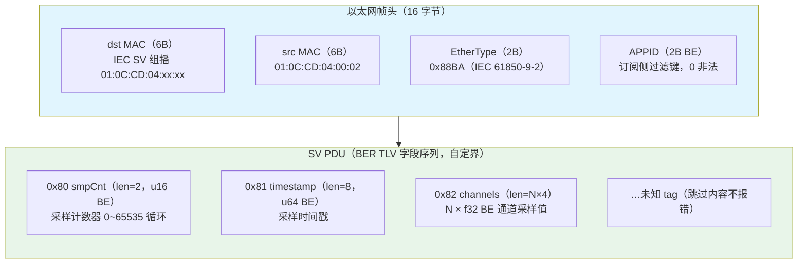
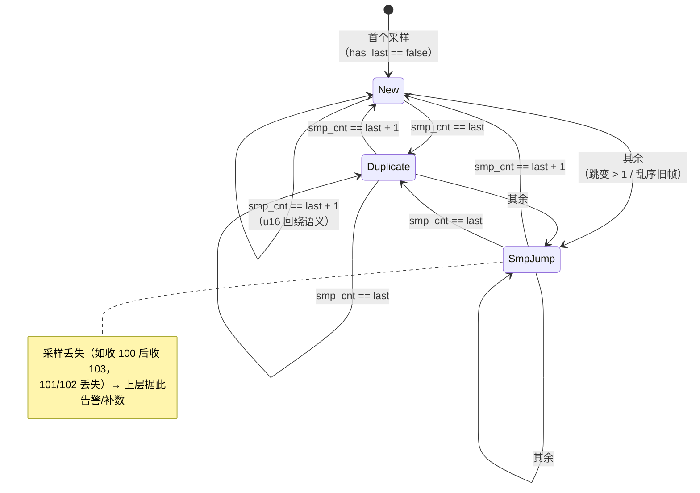

# EnerOS IEC 61850-9-2 SV 采样值接收协议栈设计文档（v0.108.0）

> **版本**：v0.108.0
> **crate**：`eneros-iec61850-sv`（`crates/protocols/iec61850-sv/`）
> **依赖**：`eneros-iec61850-model`（v0.105.0，path 引用）
> **状态**：已实现（SV 二层过滤 + BER TLV 解码 + smpCnt 连续性检测 + 固定容量环形缓冲 + L2Transport 抽象）
> **覆盖版本**：v0.108.0（Phase 2 P2-G 第 4 版）
> **最后更新**：2026-07-20

---

## 目录

1. [概述](#1-概述)
2. [架构设计](#2-架构设计)
3. [数据结构](#3-数据结构)
4. [接口契约](#4-接口契约)
5. [核心算法](#5-核心算法)
6. [关键设计决策](#6-关键设计决策)
7. [测试设计](#7-测试设计)
8. [性能与内存](#8-性能与内存)
9. [偏差声明](#9-偏差声明)
10. [风险与缓解](#10-风险与缓解)
11. [性能口径声明](#11-性能口径声明)
12. [参考与引用](#12-参考与引用)

---

## 1. 概述

### 1.1 版本定位

v0.108.0 为 Phase 2 多机联邦阶段 P2-G（IEC 61850 协议族）第 4 版。电力采样值（SV，IEC 61850-9-2）是保护/测量的高速数据通道（典型 4kHz 采样率），承载电流/电压瞬时值的二层组播直发（EtherType 0x88BA）。v0.105.0 已落地 LD/LN/DO/DA 信息模型（DaValue），v0.106.0 已落地 MMS 服务层，v0.107.0 已落地 GOOSE 发布/订阅事件通道，本版实现 SV 采样值接收器，与同版 `eneros-iec62351` 安全层共同打通联邦安全通信的「采样 + 事件 + 加密」全链路，为 v0.109.0 故障录波（COMTRADE）提供安全采样数据源。

### 1.2 设计目标

- **SV 订阅者**（蓝图 §4.2/§4.4）：`SvSubscriber<T: L2Transport>` 泛型化（D5）；EtherType 0x88BA / dst MAC / APPID 三重过滤；SV PDU BER TLV 解码（smpCnt 0x80 / timestamp 0x81 / channels 0x82）；smpCnt 连续性检测以 `SampleStatus`（New/Duplicate/SmpJump）随样本返回（D12）。
- **固定容量环形缓冲**（蓝图 §4.4）：`RingBuffer<T>` 溢出覆盖最旧，消费方始终拿到最新采样。
- **传输抽象**（D4）：`L2Transport` trait + `MockL2`（复用 GOOSE 版本模式），主机可测、集成层可接线 v0.27.0 真实网卡。

### 1.3 设计原则

- **Simplicity First**：BER 仅覆盖 SV PDU 子集（smpCnt/timestamp/channels 三字段 + 未知 tag 跳过），不自研完整 ASN.1 编译器；`read_tag_length` 与 GOOSE crate 同解码规则。
- **no_std 全链路**：`#![cfg_attr(not(test), no_std)]` + `extern crate alloc`，第三方依赖仅 `eneros-iec61850-model`，零 unsafe、零 C FFI，交叉编译到 `aarch64-unknown-none`。
- **可测试性**：`MockL2` 脚本化帧队列 / loopback / 一次性错误注入，25 个单元测试全部 src 内嵌，主机全过。

---

## 2. 架构设计

### 2.1 crate 结构与模块划分

| 模块 | 职责 | 核心类型/函数 |
|------|------|--------------|
| `sv_rx.rs` | SV 订阅者 + 三重过滤 + BER 解码 + smpCnt 状态判定 | `SvSubscriber<T>` / `SvSample` / `SampleStatus` / `read_tag_length` / `decode_pdu` |
| `sv_buffer.rs` | 固定容量环形缓冲（溢出覆盖最旧，D6） | `RingBuffer<T>` |
| `lib.rs` | 错误类型 + 传输抽象 + Mock + 模块声明 + 重导出 + crate 文档（含 D1~D12 偏差表） | `SvError` / `L2Transport` / `MockL2` |

### 2.2 与 GOOSE / MMS / model crate 的关系

- **上游**：v0.105.0 `eneros-iec61850-model`（path 引用，`DaValue` 类型基座复用，零代码改动）；v0.107.0 `eneros-iec61850-goose`（`L2Transport` trait 与 `MockL2` 模式复用，D4——SV crate 内自带同构定义，不跨 crate 依赖，保持协议栈各层独立编译）；v0.27.0 网卡驱动（真实 L2 接线在集成层，D4）。
- **同层**：与 `iec61850-model` / `iec61850-mms` / `iec61850-goose` 同属 `crates/protocols/` 子系统；本 crate 不依赖 goose/mms crate，但 BER TLV 长度规则（短型 < 0x80 / 0x81 单字节 / 0x82 双字节长型）与二者一致。
- **同版配套**：`eneros-iec62351`（`crates/security/`）提供 GOOSE/SV 报文的 SM4-GCM + SM3-HMAC 加密封装，集成层按「明文 SV 接收 → 安全层校验/解密」组合使用。
- **下游**：v0.109.0 故障录波 COMTRADE（消费 `SvSample` 流）。

### 2.3 SV 帧结构



> 注：BER 长度语义与 v0.106.0 MMS / v0.107.0 GOOSE 一致——内容字节数 < 0x80 短型单字节；0x81 单字节长型；0x82 双字节长型；其他长型标记或声明长度超出剩余缓冲区 → `BerDecodeError`。smpCnt 与 channels 为必备字段（缺失 → `BerDecodeError`），timestamp 缺失默认为 0。

---

## 3. 数据结构

### 3.1 类型清单（7 个 pub 类型）

| 类型 | 说明 | derive |
|------|------|--------|
| `SvError` | 错误枚举（TransportError/BerDecodeError/InvalidConfig/BufferOverflow，D10） | Debug/Clone/PartialEq |
| `L2Transport` | 二层传输 trait（send/recv，D4） | — |
| `MockL2` | 脚本化 mock 传输（VecDeque 帧队列 + 发送记录 + 一次性错误注入 + loopback，D4/D11） | Debug/Clone/PartialEq |
| `SvSample` | 解码后的 SV 采样（smp_cnt/timestamp/channels/status） | Debug/Clone/PartialEq |
| `SampleStatus` | 采样状态（New/Duplicate/SmpJump，D12） | Debug/Clone/Copy/PartialEq |
| `SvSubscriber<T>` | SV 订阅者（泛型 L2 传输注入，D4/D5） | — |
| `RingBuffer<T>` | 固定容量环形缓冲（溢出覆盖最旧，D6） | — |

### 3.2 关键字段语义

- **`SvSample.smp_cnt`**：u16 采样计数器（0~65535 循环），连续性判定采用 `wrapping_add` 回绕语义。
- **`SvSample.status`**：随样本返回的采样状态（D12），接收方据此区分新采样/重复/丢样；写入缓冲与触发回调前完成判定。
- **`SvSubscriber.has_last`**：内部基线标志（spec 接口未列，见 §9.2），区分「尚未收到任何采样」与「last_smp_cnt == 0 的真实采样」，首采样一律判定 `New` 不做跳变检测。
- **`RingBuffer` 内部表示**：`{ buf: Vec<T>, head: usize, capacity: usize }`——spec 接口列出的 `tail`/`len` 字段由 `head` + `buf.len()` 隐式替代，语义等价（满时覆盖最旧、drain 按旧→新保序返回，见 §9.2）。
- **`MockL2` 错误注入**：`inject_send_error_once` / `inject_recv_error_once` 为一次性语义（注入后下一次调用消费即清除）。

---

## 4. 接口契约

以下签名全部提取自实际源码，与 spec.md 接口契约章节一致。

### 4.1 错误类型与传输抽象（lib.rs）

```rust
#[derive(Debug, Clone, PartialEq)]
pub enum SvError {
    TransportError,   // 传输层错误（发送/接收失败）
    BerDecodeError,   // BER 解码失败（报文畸形/截断/未知长度格式）
    InvalidConfig,    // 配置无效（如 app_id == 0）
    BufferOverflow,   // 缓冲溢出（环形缓冲写满后仍写入）
}

pub trait L2Transport {                                       // D4（复用 GOOSE 版本）
    fn send(&mut self, frame: &[u8]) -> Result<(), SvError>;
    fn recv(&mut self, buf: &mut [u8]) -> Result<usize, SvError>;
}

pub struct MockL2 { /* VecDeque 帧队列 + 发送记录 + 一次性错误注入 + loopback（D4） */ }
impl MockL2 {
    pub fn new() -> Self;
    pub fn push_rx_frame(&mut self, bytes: &[u8]);
    pub fn tx_frames(&self) -> &[Vec<u8>];
    pub fn clear_tx(&mut self);
    pub fn inject_send_error_once(&mut self, e: SvError);
    pub fn inject_recv_error_once(&mut self, e: SvError);
    pub fn set_loopback(&mut self, enabled: bool);
    pub fn loopback_enabled(&self) -> bool;
}
```

### 4.2 SV 订阅者（sv_rx.rs）

```rust
#[derive(Debug, Clone, PartialEq)]
pub struct SvSample {
    pub smp_cnt: u16,
    pub timestamp: u64,
    pub channels: Vec<f32>,
    pub status: SampleStatus,                                 // D12
}

#[derive(Debug, Clone, Copy, PartialEq)]
pub enum SampleStatus { New, Duplicate, SmpJump }             // D12

pub struct SvSubscriber<T: L2Transport> {
    /* app_id, filter_mac, last_smp_cnt, has_last,
       callback: Option<Box<dyn Fn(&SvSample)>>,              // 去 Send+Sync bound
       transport, buffer: RingBuffer<SvSample> */
}
impl<T: L2Transport> SvSubscriber<T> {
    pub fn new(app_id: u16, mac: [u8; 6], buf_size: usize, transport: T) -> Result<Self, SvError>;
    pub fn receive(&mut self, frame: &[u8]) -> Result<bool, SvError>;  // true = 写入缓冲
    pub fn take_samples(&mut self) -> Vec<SvSample>;
    pub fn set_callback<F: Fn(&SvSample) + 'static>(&mut self, f: F);
    pub fn last_smp_cnt(&self) -> u16;
    pub fn transport_mut(&mut self) -> &mut T;
}
```

### 4.3 环形缓冲（sv_buffer.rs）

```rust
pub struct RingBuffer<T> { /* buf: Vec<T>, head: usize, capacity: usize（D6） */ }
impl<T> RingBuffer<T> {
    pub fn new(capacity: usize) -> Self;
    pub fn push(&mut self, item: T);       // 满则覆盖最旧（head 前移）
    pub fn drain(&mut self) -> Vec<T>;     // 返回全部（旧→新顺序）并清空
    pub fn len(&self) -> usize;
    pub fn is_empty(&self) -> bool;
}
```

---

## 5. 核心算法

### 5.1 帧过滤流程（receive，蓝图 §4.2）

```
SvSubscriber::receive(frame)
  ├─ frame.len() < 16              → Ok(false)   // 不足以过滤，静默忽略
  ├─ EtherType != 0x88BA           → Ok(false)   // 非 SV 帧
  ├─ dst MAC != filter_mac         → Ok(false)   // 非本组播组
  ├─ APPID != app_id               → Ok(false)   // 非本订阅
  ├─ decode_pdu(&frame[16..])      → Err(BerDecodeError)  // 截断/畸形
  ├─ classify(smp_cnt)             → SampleStatus（见 5.3）
  ├─ 更新 last_smp_cnt / has_last
  ├─ buffer.push(sample)           // 满则覆盖最旧
  ├─ callback.map(|cb| cb(&sample))
  └─ Ok(true)
```

过滤均为 O(1) 定长比较；过滤不匹配一律 `Ok(false)` 静默丢弃（不进入解码、不写缓冲、不触发回调）；仅通过过滤后的 PDU 截断/畸形才返回 `Err(BerDecodeError)`。

### 5.2 BER TLV 解码（read_tag_length / decode_pdu）

- **长度规则**：`read_tag_length` 支持短型（< 0x80）与长型 0x81（单字节）/ 0x82（双字节大端）；其他长型标记、声明长度超出剩余缓冲区 → `BerDecodeError`。与 GOOSE crate 同规则。
- **字段解码**（`decode_pdu` 循环遍历 TLV）：

| tag | 字段 | 长度约束 | 解码 |
|-----|------|---------|------|
| `0x80` | smpCnt | 必须 len == 2 | u16 大端 |
| `0x81` | timestamp | 必须 len == 8 | u64 大端 |
| `0x82` | channels | len % 4 == 0 | 每 4 字节大端 → f32，保序 |
| 其他 | 未知字段 | — | 跳过内容不报错 |

- smpCnt 或 channels 缺失 → `BerDecodeError`；timestamp 缺失默认 0。
- 长度不符（smpCnt != 2 / timestamp != 8 / channels 非 4 的倍数）→ `BerDecodeError`。

### 5.3 smpCnt 状态机（蓝图 §4.4，D12）



判定规则（`classify`，每次有效解码后调用）：

| 条件 | 状态 | 说明 |
|------|------|------|
| `!has_last`（首采样） | `New` | 尚未建立基线，不做跳变检测 |
| `smp_cnt == last_smp_cnt` | `Duplicate` | 重复采样 |
| `smp_cnt == last_smp_cnt.wrapping_add(1)` | `New` | 连续递增 1（u16 回绕） |
| 其余 | `SmpJump` | 跳变 > 1（采样丢失）或乱序旧帧 |

任何有效采样（含 Duplicate/SmpJump）均写入环形缓冲并更新 `last_smp_cnt`，保证状态机持续推进。

### 5.4 环形缓冲溢出策略（蓝图 §4.4，D6）

- `push`：`buf.len() < capacity` → 追加；已满 → 覆盖 `buf[head]`，`head = (head + 1) % capacity`。
- `drain`：未满 → 直接整体取走（顺序即插入顺序）；已满 → `rotate_left(head)` 将最旧元素移到索引 0 后整体取走，保证旧→新保序。
- SV 为高速采样流，消费方允许丢旧保新，不做阻塞/回压；溢出丢失由 smpCnt 跳变检测在上游暴露。

---

## 6. 关键设计决策

| 决策 | 内容 | 理由 |
|------|------|------|
| **L2Transport 抽象（D4）** | 删除蓝图 §4.5 `extern "C"` raw socket FFI + unsafe；`L2Transport { send/recv }` trait + `MockL2` 置于 lib.rs；真实网卡接线在集成层 | aarch64-unknown-none 无 libc 可链接 extern "C"；项目零 unsafe/零 C FFI 惯例；与 v0.107.0 D4 同先例 |
| **泛型注入（D5）** | `SvSubscriber<T: L2Transport>` 泛型化，transport 由 `new` 注入（蓝图内部建 socket 写死） | 可测试性 + 网卡选择属集成层决策（Karpathy Simplicity First） |
| **RingBuffer Vec 实现（D6）** | 蓝图 §4.1 `RingBuffer { buf: Box<[T]> }` → `Vec<T>` 固定容量（heapless 风格） | no_std 下 `Box<[T]>` 需 `alloc::boxed::Box` 且初始化冗长；`Vec::with_capacity` 更直观（v0.107.0 MockL2 用 Vec 先例） |
| **status 字段承载跳变检测（D12）** | 蓝图 §4.4 要求检测 smpCnt 跳变但 §4.2 `receive -> Result<(), SvError>` 无承载 → `SvSample.status: SampleStatus` 字段 + `receive -> Result<bool, SvError>` | 蓝图自相矛盾（要求检测但接口无处上报）；接收方必须能区分新采样/重复/丢样 |
| **回调去 Send+Sync bound** | `callback: Option<Box<dyn Fn(&SvSample)>>` | 蓝图 §43.1 no_std 全项目去 bound 惯例（v0.107.0 D9 一致） |
| **静默丢弃语义** | 过滤不匹配 / 帧过短 → `Ok(false)`；仅解码失败 → `Err` | 组播环境下非本订阅帧为常态，不应视为错误；错误仅表达「本订阅帧损坏」 |

---

## 7. 测试设计

25 个单元测试全部 src 内嵌 `#[cfg(test)]`（D3），不新增 `tests/` 文件。

### 7.1 测试矩阵

| 文件 | 编号 | 数量 | 覆盖点 |
|------|------|------|--------|
| `sv_buffer.rs` | RB1~RB6 | 6 | new 空缓冲 / push 未满追加 / push 满覆盖最旧 / drain 返回全部并清空 / len/is_empty 正确 / 溢出后保序 |
| `sv_rx.rs` | RX7~RX18 | 12 | 有效帧解码 / APPID 不匹配丢弃 / dst MAC 不匹配丢弃 / 非 0x88BA → Ok(false) / smpCnt 跳变 → SmpJump（D12）/ 重复帧 → Duplicate / 截断帧 → BerDecodeError / smpCnt 0x80 解码 / timestamp 0x81 解码 / channels 0x82 含长度解码 / set_callback 被调用 / take_samples 清空缓冲 |
| `lib.rs` | MockL2 自测 ×7 | 7 | send 记录 tx / recv 弹出预置帧 / 空队列 recv 返回 0 / 一次性 send 错误注入 / 一次性 recv 错误注入 / loopback 投递已发帧 / clear_tx 清空记录（见 §9.2） |

### 7.2 关键测试详解

- **RB3/RB6（蓝图 §4.4 溢出策略）**：capacity=3 压入 4 个元素 → drain 得 `[2,3,4]`（最旧被覆盖）；capacity=4 连续压入 6 个 → drain 得 `[3,4,5,6]`，最新 4 个保序。
- **RX11（D12 采样丢失检测）**：先收 smpCnt=100（New），再收 smpCnt=103（101/102 丢失）→ 第二次 `receive` 返回 `Ok(true)`，缓冲中第二样本 `status == SampleStatus::SmpJump`，`last_smp_cnt` 更新为 103。
- **RX13（截断容错）**：通过过滤后 channels 内容少 1 字节 → `Err(BerDecodeError)`；帧长 < 16（不足以过滤）→ `Ok(false)` 静默忽略。
- **RX16（channels 长度约束）**：channels 声明长度 = 6（非 4 的倍数）→ `BerDecodeError`；正常 2 通道 f32 解码值一致。
- **RX17（回调）**：注册回调后连续收 2 个有效采样，回调按序记录 `[1, 2]`。

---

## 8. 性能与内存

### 8.1 性能基准

- **目标**：SV 接收属保护/测量 < 4ms 高速通道（蓝图 §6.3）。
- **口径声明**：性能验收为 `#[cfg(test)]` MockL2 回路断言（D11，无真实网卡 I/O），主机侧实测远低于阈值；真实硬件端到端时延为实验室项，以 mock 脚本化帧替代（v0.107.0 D11 同口径）。
- **复杂度**：三重过滤 O(1) 定长比较；BER 解码 O(n) 遍历 TLV 字段（n 为 PDU 字节数）；`RingBuffer::push` O(1)（满时覆盖为定长索引写）；`drain` 已满时 `rotate_left` O(capacity)。

### 8.2 内存预算（记忆 §5.6）

本 crate 属 **Agent Runtime 管理信息大区**（≤ 64 MB 预算）：

| 项目 | 预算 | 说明 |
|------|------|------|
| 单样本 SvSample | ≈ 64 B 量级 | 定长部分（smp_cnt 2B + timestamp 8B + status 1B）+ channels Vec<f32>（典型 8 通道 32B）堆分配 |
| 环形缓冲 | ≤ 64 KB 量级 | buf_size=16 时 ≤ 1 KB 量级；放大到 1024 亦 ≤ 64 KB 量级 |
| rx 栈缓冲区 | 集成层决定 | crate 内 `receive(&[u8])` 零拷贝，缓冲区由调用方持有 |
| 管理信息大区总预算 | ≤ 64 MB | 与 Agent Runtime 其他组件共享；OOM 策略：降级到规则引擎 |
| OOM 阈值 | 总用量 > 90% | 触发 OOM handler：冻结非关键 Agent（蓝图 §43.6） |

- Vec/Box 均走 v0.11.0 用户堆 `alloc`；零 `unsafe`，无堆外内存。

### 8.3 GPU 不适用声明

SV 过滤/解码为字节流比较与逐层 TLV 解析 workload：无矩阵运算、无大规模张量，GPU 加速无意义。记忆 §4.2 GPU 优先规则仅适用模型训练/校准与数字孪生仿真，不适用协议栈路径。**本 crate 零 GPU 代码**，纯 CPU BER 解码（蓝图 §6.6）。

---

## 9. 偏差声明

### 9.1 D1~D12（与 spec.md 逐字一致）

| 编号 | 偏差 | 理由 |
|------|------|------|
| **D1** | 蓝图 `crates/iec61850_sv/` → `crates/protocols/iec61850-sv/`（eneros-iec61850-sv）；蓝图 `crates/iec62351/` → `crates/security/iec62351/`（eneros-iec62351） | 记忆 §2.3.1 强制：crate 归 `crates/<subsystem>/`；SV 属 protocols，IEC 62351 属 security |
| **D2** | 蓝图 `docs/phase2/sv_security.md` → `docs/protocols/iec61850-sv-design.md` + `docs/protocols/iec62351-design.md` | 记忆 §2.3.3 强制：文档按方向分类；两个 crate 独立文档 |
| **D3** | 蓝图 `tests/sv_secure.rs` → src 内嵌 `#[cfg(test)]` | v0.87.0~v0.107.0 项目惯例，不新增 tests/ 文件 |
| **D4** | 删除蓝图 §4.5 `extern "C"` raw socket FFI + unsafe；SV 侧复用 GOOSE 的 `L2Transport` trait + `MockL2`（置于 lib.rs）；真实 raw socket 接线在集成层 | aarch64-unknown-none 无 libc 可链接 extern "C"；项目零 unsafe/零 C FFI 惯例；与 v0.107.0 D4 同先例 |
| **D5** | `SvSubscriber<T: L2Transport>` 泛型化，transport 由 `new` 注入（蓝图内部建 socket 写死） | 可测试性 + 网卡选择属集成层决策（Karpathy Simplicity First） |
| **D6** | 蓝图 §4.1 `RingBuffer { buf: Box<[T]> }` → `Vec<T>` 固定容量（heapless 风格）；`Box` 在 no_std 需全局分配器，Vec 更通用 | no_std 下 `Box<[T]>` 需 `alloc::boxed::Box` 且初始化冗长；`Vec::with_capacity` 更直观（v0.107.0 MockL2 用 Vec 先例） |
| **D7** | 蓝图 §4.5 `Sm4Cipher`/`Sm3Hmac` 自封装 FFI → 直接复用 eneros-crypto 的 `Sm4Gcm`/`Sm3Hmac`（纯 Rust，零 unsafe） | v0.31.0 已落地纯 Rust 实现；蓝图 FFI 代码在 aarch64-unknown-none 无法链接（无 libc）；避免重复造轮子（记忆 §5.5） |
| **D8** | 蓝图 §4.1 `SecureGoose` 单类型 → `SecureGoose` + `SecureSv` 同构双类型（内部均委托公共 `SecureChannel` 私有结构） | GOOSE 与 SV 语义独立（事件 vs 采样），调用方不应混用；公共逻辑抽取私有结构避免重复（Simplicity First） |
| **D9** | 蓝图 §4.1 `KeyMgmt.rotate_keys()` 内部生成密钥 → `rotate_keys(now, new_key_data, new_mac_key)` 由调用方注入密钥材料 | no_std 无系统熵源（CsRng 固定种子仅测试用）；生产环境密钥应由硬件 TRNG/密钥管理系统注入；与 v0.31.0 CaIssuer 外部注入 rng 先例一致 |
| **D10** | 错误模型统一：`SvError` = TransportError / BerDecodeError / InvalidConfig / BufferOverflow（4 变体）；`SecError` = KeyExpired / HmacMismatch / DecryptFailed / EncryptFailed / InvalidKeyId（5 变体） | 蓝图 SocketCreateFailed/SendFailed 随 FFI 删除合并为 TransportError；变体覆盖各失败面（对齐 v0.107.0 D10 精简风格） |
| **D11** | 性能 < 0.5ms（加密延迟）落地为 cfg(test) Instant 断言（MockL2 回路，加密+解密口径，文档声明）；§6.2 真实 GOOSE 端到端加密为实验室硬件项，以 mock 替代 | 无真实网卡硬件（与 v0.107.0 D11 同口径） |
| **D12** | 接收侧 smpCnt 跳变检测以 `SampleStatus`（New/Duplicate/SmpJump）随样本返回；蓝图 §4.4 要求检测跳变但 §4.2 `receive -> Result<(), SvError>` 无承载 → `SvSample.status: SampleStatus` 字段 + `receive -> Result<bool, SvError>` | 蓝图自相矛盾（要求检测但接口无处上报）；接收方必须能区分新采样/重复/丢样 |

### 9.2 实施增量偏差（代码阶段发现）

以下 3 项为源码实现阶段相对 spec 接口/蓝图的增量约定，文档在此集中记录：

1. **`RingBuffer` 内部字段简化**：spec 接口列出 `RingBuffer { buf: Vec<T>, head: usize, tail: usize, len: usize }` → 实现为 `{ buf: Vec<T>, head: usize, capacity: usize }`；`tail`/`len` 由 `head` + `buf.len()` 隐式替代（未满时追加到 Vec 尾部，满时覆盖 `buf[head]` 并前移 head），语义等价（满时覆盖最旧、drain 按旧→新保序返回），`sv_buffer.rs` 模块文档已声明。
2. **`SvSubscriber` 增加 `has_last: bool` 内部字段**：spec 接口未列；用于区分「尚未收到任何采样」与「last_smp_cnt == 0 的真实采样」，首采样一律判定 `New` 不做跳变检测（否则首采样 smp_cnt=0 以外的值会被误判 SmpJump）。
3. **lib.rs 增加 7 个 MockL2 自测**：spec 测试矩阵列 RB1~RB6 + RX7~RX18 共 18 个；实现补充 MockL2 自身行为测试 7 个（send 记录 / recv 弹帧 / 空队列返回 0 / 一次性 send 与 recv 错误注入 / loopback 投递 / clear_tx），总数 25 个；另 MockL2 错误注入方法命名为 `inject_send_error_once` / `inject_recv_error_once`（一次性语义显式化，GOOSE crate 对应方法无 `_once` 后缀）。

---

## 10. 风险与缓解

| 风险 | 等级 | 缓解措施 |
|------|------|----------|
| 采样丢失（网络抖动/拥塞） | 中 | smpCnt 连续性检测以 `SampleStatus::SmpJump` 随样本上报（D12），上层（故障录波/保护算法）据此告警或插值补数 |
| 环形缓冲溢出丢旧采样 | 低 | 溢出覆盖最旧为蓝图 §4.4 既定策略（丢旧保新）；buf_size 可按消费速率调大；丢失同样经 SmpJump 暴露 |
| 畸形帧/截断帧冲击 | 中 | 过滤不匹配一律 `Ok(false)` 静默丢弃；通过过滤后解码失败返回 `BerDecodeError` 不写缓冲；未知 tag 跳过不报错，兼容不同厂商实现 |
| 明文传输无安全保护 | 高 | 同版 `eneros-iec62351` 提供 SM4-GCM + SM3-HMAC 加密封装（36 号文/IEC 62351 合规），生产部署前须完成安全层集成；纵向加密认证装置对接见 v0.98.1 |
| 无真实网卡硬件回归 | 中 | MockL2 脚本化帧覆盖全部分支；实验室硬件项在集成阶段补测（D11） |
| smpCnt 回绕边界 | 低 | `wrapping_add` 回绕语义，65535 → 0 判定为 `New`；RX14 覆盖 0xABCD 大值解码 |

---

## 11. 性能口径声明

**D11 口径**：本 crate 性能相关验收断言均为 `#[cfg(test)]` 测试口径（MockL2 脚本化帧回路，无真实网卡 I/O、无硬件定时器）；spec/蓝图中的真实硬件指标（SV 接收 < 4ms 通道、真实链路端到端时延）为**实验室硬件验证项**，以 mock 替代（与 v0.107.0 D11 同口径）。集成层接线 v0.27.0 以太网驱动后，须在目标硬件（飞腾/鲲鹏/QEMU）上补测真实端到端时延。

---

## 12. 参考与引用

- **IEC 61850-9-2**：电力自动化通信网络——采样值（SV）传输（EtherType 0x88BA，组播 MAC 01:0C:CD:04:xx:xx）
- **蓝图 `phase2.md` §v0.108.0**：P2-G 第 4 版版本蓝图（9 节齐全）
- **上游 v0.107.0**：`eneros-iec61850-goose`（L2Transport/MockL2 模式复用，见 `docs/protocols/iec61850-goose-design.md`）
- **上游 v0.105.0**：`eneros-iec61850-model`（DaValue 类型基座）
- **同版配套**：`eneros-iec62351`（GOOSE/SV 安全层，见 `docs/protocols/iec62351-design.md`）
- **下游 v0.109.0**：故障录波 COMTRADE（消费本 crate 采样流）
- **spec**：`.trae/specs/develop-v10800-iec61850-sv-security/spec.md`

---

> **GPU 不适用**：本 crate 无 GPU 代码，纯 CPU 字节处理（蓝图 §6.6）。
>
> **安全声明**：GOOSE/SV 报文加密封装由同版 `eneros-iec62351` 提供，生产部署前须完成安全层集成（蓝图 §7.3，36 号文合规）。
>
> **下游解锁**：v0.109.0 故障录波基于本版 SV 采样流构建。
