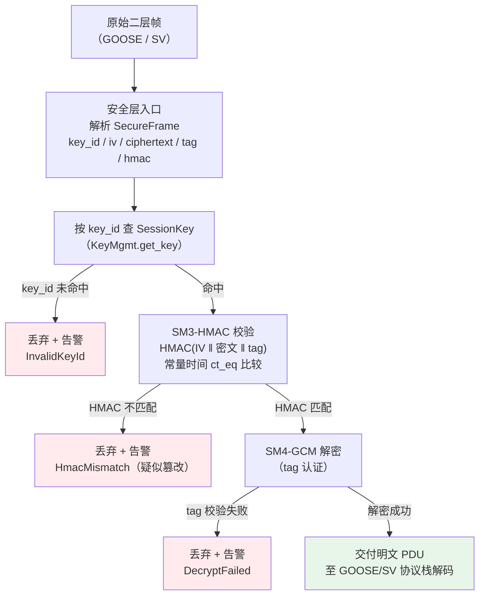
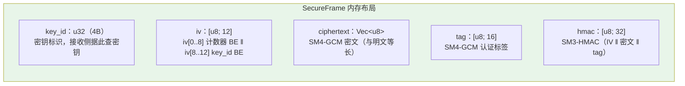

# EnerOS IEC 62351 GOOSE/SV 安全层设计文档（v0.108.0）

> **版本**：v0.108.0
> **crate**：`eneros-iec62351`（`crates/security/iec62351/`）
> **依赖**：`eneros-crypto`（v0.31.0，path 引用）
> **状态**：已实现（SM4-GCM 加密封装 + SM3-HMAC 消息认证 + 会话密钥管理/轮换）
> **覆盖版本**：v0.108.0（Phase 2 P2-G 第 4 版）
> **最后更新**：2026-07-20

---

## 目录

1. [概述](#1-概述)
2. [架构设计](#2-架构设计)
3. [数据结构](#3-数据结构)
4. [接口契约](#4-接口契约)
5. [核心算法](#5-核心算法)
6. [关键设计决策](#6-关键设计决策)
7. [测试设计](#7-测试设计)
8. [性能与内存](#8-性能与内存)
9. [偏差声明](#9-偏差声明)
10. [风险与缓解](#10-风险与缓解)
11. [性能口径声明](#11-性能口径声明)
12. [参考与引用](#12-参考与引用)

---

## 1. 概述

### 1.1 版本定位

v0.108.0 为 Phase 2 多机联邦阶段 P2-G 第 4 版的安全半边。GOOSE/SV 明文二层组播不满足电力安全合规（36 号文横向隔离 / IEC 62351 / 等保 2.0 三级）。v0.31.0 已落地国密 SM2/SM3/SM4（`eneros-crypto`，纯 Rust 零 unsafe），v0.107.0 已落地 GOOSE 事件通道，本版实现 IEC 62351 GOOSE/SV 加密封装（SM4-GCM 机密性 + SM3-HMAC 完整性/源认证）与会话密钥管理（多密钥存储、过期检测、密钥轮换），与同版 `eneros-iec61850-sv` 共同打通联邦安全通信的「采样 + 事件 + 加密」全链路，加密延迟 < 0.5ms，为 v0.109.0 故障录波提供安全采样数据源。

### 1.2 设计目标

- **GOOSE/SV 加密封装**（蓝图 §4.5）：`SecureGoose` / `SecureSv` 同构双类型（D8）；`encrypt` → 12 字节 IV（计数器 + key_id）→ SM4-GCM 加密 → SM3-HMAC（IV ‖ 密文 ‖ tag）→ `SecureFrame`；`decrypt` → 常量时间 HMAC 校验（防时序攻击）→ SM4-GCM 解密。
- **会话密钥管理**（蓝图 §4.4）：`SessionKey` / `KeyMgmt`；多密钥 Vec 存储（D6）、过期检测、`rotate_keys` 密钥材料外部注入（D9）。
- **复用国密基座**（D7）：直接复用 `eneros-crypto` 的 `Sm4Gcm` / `Sm3Hmac` / `ct_eq`，不自研密码学、不引入 FFI。

### 1.3 设计原则

- **Simplicity First**：公共加密/认证逻辑抽取私有 `SecureChannel`（D8），GOOSE/SV 双类型仅做语义隔离的薄封装，公共逻辑只维护一份。
- **no_std 全链路**：`#![cfg_attr(not(test), no_std)]` + `extern crate alloc`，第三方依赖仅 `eneros-crypto`，零 unsafe、零 C FFI，交叉编译到 `aarch64-unknown-none`。
- **密钥零泄露**：`SessionKey` 不派生 `Debug`（D9），密钥材料由调用方注入（硬件 TRNG/密钥管理系统），crate 内不生成、不记录、不打印密钥。

---

## 2. 架构设计

### 2.1 crate 结构与模块划分

| 模块 | 职责 | 核心类型/函数 |
|------|------|--------------|
| `key_mgmt.rs` | 会话密钥与密钥管理（多密钥存储 / 过期检测 / 轮换） | `SessionKey` / `KeyMgmt` |
| `secure_goose.rs` | GOOSE 加密封装 + 私有共享安全通道（D8） | `SecureGoose` / `SecureFrame` / `SecureChannel`（pub(crate)） |
| `secure_sv.rs` | SV 加密封装（同构薄封装，委托 SecureChannel） | `SecureSv` |
| `lib.rs` | 错误类型 + 模块声明 + 重导出 + crate 文档（含 D1~D12 偏差表） | `SecError` |

### 2.2 私有 SecureChannel 共享（D8）

`SecureGoose` 与 `SecureSv` 语义独立（事件 vs 采样，调用方不应混用），但加密/认证逻辑完全相同：二者内部均委托 `secure_goose.rs` 中的 `pub(crate) SecureChannel`（封装 `Sm4Gcm` 实例 + `mac_key` + `key_id` + `iv_counter`），公共逻辑只维护一份，避免重复（Simplicity First）。`SecureChannel` 不对外导出，crate 公共面仅 `SecureGoose` / `SecureSv` / `SecureFrame` / `SessionKey` / `KeyMgmt` / `SecError`。

### 2.3 与 eneros-crypto 的关系（D7）

- **上游**：v0.31.0 `eneros-crypto`（path 引用，零代码改动）——复用 `sm4::gcm::Sm4Gcm`（SM4-GCM AEAD）、`sm3::hmac::hmac_sm3`（SM3-HMAC）、`ct_eq`（常量时间比较）。蓝图 §4.5 的 `Sm4Cipher`/`Sm3Hmac` 自封装 FFI 已删除（D7：aarch64-unknown-none 无 libc 可链接，且避免重复造轮子，记忆 §5.5）。
- **同版配套**：`eneros-iec61850-sv`（明文 SV 接收）与 v0.107.0 `eneros-iec61850-goose`（明文 GOOSE 收发）；集成层按「协议栈 PDU ↔ 安全层 SecureFrame」组合，安全层不依赖协议栈 crate（保持 security 子系统独立编译）。
- **下游**：v0.109.0 故障录波 COMTRADE（安全采样数据源）；v0.98.1 纵向加密认证装置对接（独立链路）。

---

## 3. 数据结构

### 3.1 类型清单（6 个 pub 类型）

| 类型 | 说明 | derive |
|------|------|--------|
| `SecError` | 错误枚举（KeyExpired/HmacMismatch/DecryptFailed/EncryptFailed/InvalidKeyId，D10） | Debug/Clone/PartialEq |
| `SessionKey` | 会话密钥（key_id + SM4 密钥 + HMAC 密钥 + 过期时间） | Clone/PartialEq（**不派生 Debug**，D9 防泄露，见 §3.2/§9.2） |
| `KeyMgmt` | 密钥管理器（local_keys Vec + key_lifetime + next_key_id） | — |
| `SecureFrame` | 安全帧封装（key_id/iv/ciphertext/tag/hmac） | Debug/Clone/PartialEq |
| `SecureGoose` | GOOSE 加密封装（委托 SecureChannel，D8） | — |
| `SecureSv` | SV 加密封装（同构于 SecureGoose，D8） | — |

另有 `pub(crate) SecureChannel`（私有共享安全通道，D8，不导出）。

### 3.2 关键字段语义

- **`SessionKey` 不派生 Debug（D9）**：`key_data`（SM4 128 bit）与 `mac_key`（SM3-HMAC 256 bit）为高敏密钥材料，派生 Debug 会在日志/panic 信息/调试器中泄露；实现选择**整体不派生 Debug**（仅 Clone/PartialEq，供测试断言与密钥表比较），从类型层面杜绝泄露路径（spec 接口注释并列「Debug/Clone/PartialEq」与「key_data/mac_key 不派生 Debug」自相矛盾，按 D9 防泄露精神取更严格解，见 §9.2）。
- **`SessionKey.expiry`**：绝对时间戳（单位由调用方约定，与 `KeyMgmt` 的 `now` 同口径）；`expiry > now` 为未过期（`expiry == now` 视为过期）。
- **`SecureFrame.iv`**：12 字节 Nonce——`iv[0..8]` = u64 计数器大端，`iv[8..12]` = key_id 大端（蓝图 §4.5）。
- **`KeyMgmt.local_keys: Vec<SessionKey>`**（D6）：Vec 替代 HashMap（no_std 无 SipHash 随机态；密钥数量级 < 10，线性查找足够）。
- **`KeyMgmt.next_key_id`**：自动分配的下一个 key_id（初始 1）；`add_key` 存入更大 key_id 时同步推进，保证 `rotate_keys` 生成的 key_id 单调递增不与既有冲突。

---

## 4. 接口契约

以下签名全部提取自实际源码，与 spec.md 接口契约章节一致。

### 4.1 错误类型（lib.rs）

```rust
#[derive(Debug, Clone, PartialEq)]
pub enum SecError {
    KeyExpired,      // 会话密钥已过期或不存在可用密钥
    HmacMismatch,    // SM3-HMAC 校验不匹配（报文被篡改或密钥错误，先于解密校验）
    DecryptFailed,   // SM4-GCM 解密失败（tag 校验不通过）
    EncryptFailed,   // SM4-GCM 加密失败（当前实现不产生，见 §9.2）
    InvalidKeyId,    // 按 key_id 查找密钥未命中
}
```

### 4.2 密钥管理（key_mgmt.rs）

```rust
#[derive(Clone, PartialEq)]              // 不派生 Debug（D9 防泄露）
pub struct SessionKey {
    pub key_id: u32,
    pub key_data: [u8; 16],               // SM4 对称密钥（128 bit）
    pub mac_key: [u8; 32],                // SM3-HMAC 认证密钥（256 bit）
    pub expiry: u64,                      // 过期时间戳（绝对时间，单位由调用方约定）
}

pub struct KeyMgmt {
    /* local_keys: Vec<SessionKey>,       // D6（Vec 替代 HashMap，no_std）
       key_lifetime: u64, next_key_id: u32 */
}
impl KeyMgmt {
    pub fn new(key_lifetime: u64) -> Self;                 // next_key_id 初始 1
    pub fn add_key(&mut self, session: SessionKey);
    pub fn get_current_key(&self, now: u64) -> Result<&SessionKey, SecError>;
    pub fn rotate_keys(&mut self, now: u64, new_key_data: [u8; 16], new_mac_key: [u8; 32]) -> Result<(), SecError>;  // D9
    pub fn get_key(&self, key_id: u32) -> Result<&SessionKey, SecError>;
}
```

### 4.3 GOOSE/SV 加密封装（secure_goose.rs / secure_sv.rs）

```rust
#[derive(Debug, Clone, PartialEq)]
pub struct SecureFrame {
    pub key_id: u32,
    pub iv: [u8; 12],        // 计数器(8B BE) + key_id(4B BE)，蓝图 §4.5
    pub ciphertext: Vec<u8>,
    pub tag: [u8; 16],       // SM4-GCM 认证标签
    pub hmac: [u8; 32],      // SM3-HMAC（IV ‖ ciphertext ‖ tag）
}

pub struct SecureGoose { /* channel: SecureChannel（D8） */ }
impl SecureGoose {
    pub fn new(session: &SessionKey) -> Self;
    pub fn encrypt(&mut self, plaintext: &[u8]) -> Result<SecureFrame, SecError>;
    pub fn decrypt(&self, frame: &SecureFrame) -> Result<Vec<u8>, SecError>;
}

pub struct SecureSv { /* channel: SecureChannel（同构，D8） */ }
impl SecureSv {
    pub fn new(session: &SessionKey) -> Self;
    pub fn encrypt(&mut self, plaintext: &[u8]) -> Result<SecureFrame, SecError>;
    pub fn decrypt(&self, frame: &SecureFrame) -> Result<Vec<u8>, SecError>;
}
```

---

## 5. 核心算法

### 5.1 IV 构造（蓝图 §4.5）

```
generate_iv():
  iv_counter += 1                        // 先自增后取值（首帧计数器段为 1）
  iv[0..8]  = iv_counter.to_be_bytes()   // 8 字节计数器大端
  iv[8..12] = key_id.to_be_bytes()       // 4 字节 key_id 大端
```

SM4-GCM 要求同一密钥下 IV 绝对唯一，否则认证安全性被破坏：计数器段保证同一 `SecureChannel` 实例内单调唯一；key_id 段隔离不同密钥世代（轮换后计数器归零亦不冲突）。计数器为 u64，回绕前须轮换密钥（生命周期远早于回绕）。

### 5.2 encrypt 流程（蓝图 §4.5）

```
SecureChannel::encrypt(plaintext)
  ├─ iv = generate_iv()                       // 计数器 + key_id（5.1）
  ├─ (ciphertext, tag) = Sm4Gcm::encrypt(&iv, plaintext, aad=&[])
  ├─ auth_data = iv ‖ ciphertext ‖ tag
  ├─ hmac = hmac_sm3(mac_key, auth_data)
  └─ Ok(SecureFrame { key_id, iv, ciphertext, tag, hmac })
```

`Sm4Gcm::encrypt` 为无错接口（eneros-crypto 纯 Rust 实现），故当前实现不会产生 `SecError::EncryptFailed`（变体保留以对齐 D10 错误模型，见 §9.2）。

### 5.3 decrypt 流程（先 HMAC 后解密，防时序攻击）

```
SecureChannel::decrypt(frame)
  ├─ auth_data = frame.iv ‖ frame.ciphertext ‖ frame.tag
  ├─ expected = hmac_sm3(mac_key, auth_data)
  ├─ ct_eq(expected, frame.hmac) == false → Err(HmacMismatch)   // 常量时间比较
  └─ Sm4Gcm::decrypt(&frame.iv, &frame.ciphertext, &[], &frame.tag)
       ├─ Ok(plaintext)  → Ok(plaintext)
       └─ Err(_)         → Err(DecryptFailed)
```

HMAC 覆盖 IV/密文/tag 三者，篡改任一字段（含 GCM tag 本身）都在 HMAC 阶段被拦截（SG13/SG14/SG15）；仅 HMAC 通过后才进入 GCM 解密，攻击者无法通过解密耗时差异探测有效密文结构。

### 5.4 密钥轮换（蓝图 §4.4，D9）

```
KeyMgmt::rotate_keys(now, new_key_data, new_mac_key)
  ├─ get_current_key(now) 命中且 expiry > now → Ok(())     // 未过期不轮换
  └─ 否则生成新密钥并追加：
       SessionKey { key_id: next_key_id,
                    key_data: new_key_data,                // 调用方注入（D9）
                    mac_key: new_mac_key,                  // 调用方注入（D9）
                    expiry: now + key_lifetime }
       next_key_id += 1 → Ok(())
```

- `get_current_key(now)`：逆序遍历密钥表，返回最近添加且未过期（expiry > now）的密钥；全过期/空表 → `Err(KeyExpired)`。
- 多密钥并存：旧密钥保留在表中，接收侧按 `SecureFrame.key_id` 经 `get_key` 查找，兼容轮换窗口内的乱序帧/在途帧解密。

### 5.5 安全校验流程（蓝图 §4.3 重绘）



> 注：发送侧流程为「协议栈明文 PDU → encrypt → SecureFrame → 二层发送」；HMAC 先于解密校验（防时序攻击），三级失败分别对应 `InvalidKeyId` / `HmacMismatch` / `DecryptFailed`。

### 5.6 SecureFrame 结构



> 固定开销 = key_id(4) + iv(12) + tag(16) + hmac(32) = **64 B**；单帧总量 ≈ 明文长 + 64 B。线格式序列化（集成层）示例见 SG19：`key_id(4 BE) ‖ iv(12) ‖ ct_len(4 BE) ‖ ciphertext ‖ tag(16) ‖ hmac(32)`。

---

## 6. 关键设计决策

| 决策 | 内容 | 理由 |
|------|------|------|
| **复用 eneros-crypto（D7）** | 蓝图 §4.5 `Sm4Cipher`/`Sm3Hmac` 自封装 FFI → 直接复用 `Sm4Gcm`/`Sm3Hmac`/`ct_eq`（纯 Rust，零 unsafe） | v0.31.0 已落地纯 Rust 实现；蓝图 FFI 在 aarch64-unknown-none 无法链接（无 libc）；避免重复造轮子（记忆 §5.5 默认集成清单） |
| **SecureChannel 私有共享（D8）** | 蓝图 §4.1 `SecureGoose` 单类型 → `SecureGoose` + `SecureSv` 同构双类型，内部均委托 `pub(crate) SecureChannel` | GOOSE 与 SV 语义独立（事件 vs 采样），调用方不应混用；公共逻辑抽取私有结构避免重复（Simplicity First） |
| **密钥材料外部注入（D9）** | 蓝图 §4.1 `KeyMgmt.rotate_keys()` 内部生成密钥 → `rotate_keys(now, new_key_data, new_mac_key)` 由调用方注入 | no_std 无系统熵源（CsRng 固定种子仅测试用）；生产环境密钥应由硬件 TRNG/密钥管理系统注入；与 v0.31.0 CaIssuer 外部注入 rng 先例一致 |
| **Vec 密钥表（D6）** | `local_keys: Vec<SessionKey>` 替代 HashMap | no_std 下 HashMap 无随机态 SipHash（需 entropy）；密钥数量级 < 10，线性/逆序扫描足够且更直观（v0.107.0 MockL2 用 Vec 先例） |
| **SessionKey 不派生 Debug（D9）** | 仅 derive Clone/PartialEq | 密钥材料（key_data/mac_key）防日志/调试器泄露，从类型层面杜绝泄露路径 |
| **先 HMAC 后解密** | decrypt 先常量时间校验 HMAC，再 GCM 解密 | 防时序攻击；HMAC 覆盖 tag，篡改 GCM tag 亦在 HMAC 阶段拦截 |

---

## 7. 测试设计

22 个单元测试全部 src 内嵌 `#[cfg(test)]`（D3），不新增 `tests/` 文件。

### 7.1 测试矩阵

| 文件 | 编号 | 数量 | 覆盖点 |
|------|------|------|--------|
| `key_mgmt.rs` | KM1~KM8 | 8 | new 空密钥表 / add_key 存储 / get_current_key 命中未过期 / get_current_key 全过期 → KeyExpired / rotate_keys 生成新密钥 / rotate_keys 未过期不轮换 / get_key 按 ID 命中 / get_key miss → InvalidKeyId |
| `secure_goose.rs` | SG9~SG19 | 11 | 加密往返一致 / frame.key_id 正确 / IV 计数器递增 / 篡改 ciphertext → HmacMismatch / 篡改 tag → HmacMismatch（先校验 HMAC）/ 篡改 hmac → HmacMismatch / 解密空密文 / 加密空明文 / 不同 session 解密失败 / MockL2 回路加密 GOOSE PDU 往返 / 加密延迟 < 0.5ms（D11） |
| `secure_sv.rs` | SS20~SS22 | 3 | 加密往返一致 / IV 计数器递增 / 篡改检测（与 SG 同构，抽样验证） |

### 7.2 关键测试详解

- **SG11/SS21（蓝图 §4.5 IV 唯一性）**：同一实例连续加密 2 次，`iv` 不同且计数器段 `c2 == c1 + 1`；`iv[8..12]` 为 key_id 大端（7u32）。
- **SG13~SG15（蓝图 §6.5 故障注入篡改检测）**：分别翻转 `ciphertext` / `tag` / `hmac` 首字节 → 均返回 `Err(HmacMismatch)`，证明 HMAC 覆盖三者且先于解密校验（防时序攻击）。
- **SG18（跨会话隔离）**：mac_key 不同的接收方解密他人帧 → `HmacMismatch`（密钥错误与篡改同路径拦截）。
- **SG19（D11 性能 + 回路）**：256 字节载荷 × 100 次加密+解密 `std::time::Instant` 断言 < 50ms（< 0.5ms/次）；另以伪 GOOSE PDU（0x61 头 + 填充 128B）走「加密 → 线格式序列化 → 解析回 SecureFrame → 解密」回路，往返一致。
- **KM5（蓝图 §4.4 轮换）**：当前密钥 expiry=1000，now=1001 调用 `rotate_keys` → 生成 key_id=2、expiry=1501（now + lifetime）、材料与注入一致；KM6 覆盖未过期不轮换。

---

## 8. 性能与内存

### 8.1 性能基准

- **目标**：加密延迟 < 0.5ms/次（蓝图 §6.3）。
- **口径声明**：落地为 SG19 `#[cfg(test)]` `std::time::Instant` 断言——256 字节载荷 × 100 次「加密 + 解密」< 50ms（即 < 0.5ms/次，D11）；主机侧实测远低于阈值，余量充足。真实网卡端到端 GOOSE/SV 安全通信为实验室硬件项（蓝图 §6.2），以 mock 替代。
- **复杂度**：SM4-GCM 加密/解密与 SM3-HMAC 均为 O(n)（n 为明文/密文字节数）；`get_current_key`/`get_key` 为 O(k) 线性扫描（k = 密钥数，典型 < 4）。

### 8.2 内存预算（记忆 §5.6）

本 crate 属 **Agent Runtime 管理信息大区**（≤ 64 MB 预算）：

| 项目 | 预算 | 说明 |
|------|------|------|
| SecureFrame 固定开销 | 64 B | key_id(4) + iv(12) + tag(16) + hmac(32) |
| 单帧总量 | ≈ 明文长 + 64 B | GOOSE/SV 典型帧 ≤ 256 B → 封装后 ≤ 320 B |
| 密钥表 | ≈ 56 B × N | SessionKey = key_id(4) + key_data(16) + mac_key(32) + expiry(8)（含对齐）；N 典型 < 4 |
| SecureChannel | ≈ 数百 B | Sm4Gcm 轮密钥展开 + mac_key + iv_counter |
| 管理信息大区总预算 | ≤ 64 MB | 与 Agent Runtime 其他组件共享；OOM 策略：降级到规则引擎 |
| OOM 阈值 | 总用量 > 90% | 触发 OOM handler：冻结非关键 Agent（蓝图 §43.6） |

- Vec 均走 v0.11.0 用户堆 `alloc`；零 `unsafe`，无堆外内存。

### 8.3 GPU 不适用声明

SM4/SM3 为轻量对称加密与哈希运算，单次载荷仅百字节级，CPU 处理延迟 < 0.5ms；GPU 卸载反而引入上下文切换与显存拷贝开销，无加速意义。记忆 §4.2 GPU 优先规则仅适用模型训练/校准与数字孪生仿真，不适用密码学协议栈路径。**本 crate 零 GPU 代码**（蓝图 §6.6）。

---

## 9. 偏差声明

### 9.1 D1~D12（与 spec.md 逐字一致）

| 编号 | 偏差 | 理由 |
|------|------|------|
| **D1** | 蓝图 `crates/iec61850_sv/` → `crates/protocols/iec61850-sv/`（eneros-iec61850-sv）；蓝图 `crates/iec62351/` → `crates/security/iec62351/`（eneros-iec62351） | 记忆 §2.3.1 强制：crate 归 `crates/<subsystem>/`；SV 属 protocols，IEC 62351 属 security |
| **D2** | 蓝图 `docs/phase2/sv_security.md` → `docs/protocols/iec61850-sv-design.md` + `docs/protocols/iec62351-design.md` | 记忆 §2.3.3 强制：文档按方向分类；两个 crate 独立文档 |
| **D3** | 蓝图 `tests/sv_secure.rs` → src 内嵌 `#[cfg(test)]` | v0.87.0~v0.107.0 项目惯例，不新增 tests/ 文件 |
| **D4** | 删除蓝图 §4.5 `extern "C"` raw socket FFI + unsafe；SV 侧复用 GOOSE 的 `L2Transport` trait + `MockL2`（置于 lib.rs）；真实 raw socket 接线在集成层 | aarch64-unknown-none 无 libc 可链接 extern "C"；项目零 unsafe/零 C FFI 惯例；与 v0.107.0 D4 同先例 |
| **D5** | `SvSubscriber<T: L2Transport>` 泛型化，transport 由 `new` 注入（蓝图内部建 socket 写死） | 可测试性 + 网卡选择属集成层决策（Karpathy Simplicity First） |
| **D6** | 蓝图 §4.1 `RingBuffer { buf: Box<[T]> }` → `Vec<T>` 固定容量（heapless 风格）；`Box` 在 no_std 需全局分配器，Vec 更通用 | no_std 下 `Box<[T]>` 需 `alloc::boxed::Box` 且初始化冗长；`Vec::with_capacity` 更直观（v0.107.0 MockL2 用 Vec 先例） |
| **D7** | 蓝图 §4.5 `Sm4Cipher`/`Sm3Hmac` 自封装 FFI → 直接复用 eneros-crypto 的 `Sm4Gcm`/`Sm3Hmac`（纯 Rust，零 unsafe） | v0.31.0 已落地纯 Rust 实现；蓝图 FFI 代码在 aarch64-unknown-none 无法链接（无 libc）；避免重复造轮子（记忆 §5.5） |
| **D8** | 蓝图 §4.1 `SecureGoose` 单类型 → `SecureGoose` + `SecureSv` 同构双类型（内部均委托公共 `SecureChannel` 私有结构） | GOOSE 与 SV 语义独立（事件 vs 采样），调用方不应混用；公共逻辑抽取私有结构避免重复（Simplicity First） |
| **D9** | 蓝图 §4.1 `KeyMgmt.rotate_keys()` 内部生成密钥 → `rotate_keys(now, new_key_data, new_mac_key)` 由调用方注入密钥材料 | no_std 无系统熵源（CsRng 固定种子仅测试用）；生产环境密钥应由硬件 TRNG/密钥管理系统注入；与 v0.31.0 CaIssuer 外部注入 rng 先例一致 |
| **D10** | 错误模型统一：`SvError` = TransportError / BerDecodeError / InvalidConfig / BufferOverflow（4 变体）；`SecError` = KeyExpired / HmacMismatch / DecryptFailed / EncryptFailed / InvalidKeyId（5 变体） | 蓝图 SocketCreateFailed/SendFailed 随 FFI 删除合并为 TransportError；变体覆盖各失败面（对齐 v0.107.0 D10 精简风格） |
| **D11** | 性能 < 0.5ms（加密延迟）落地为 cfg(test) Instant 断言（MockL2 回路，加密+解密口径，文档声明）；§6.2 真实 GOOSE 端到端加密为实验室硬件项，以 mock 替代 | 无真实网卡硬件（与 v0.107.0 D11 同口径） |
| **D12** | 接收侧 smpCnt 跳变检测以 `SampleStatus`（New/Duplicate/SmpJump）随样本返回；蓝图 §4.4 要求检测跳变但 §4.2 `receive -> Result<(), SvError>` 无承载 → `SvSample.status: SampleStatus` 字段 + `receive -> Result<bool, SvError>` | 蓝图自相矛盾（要求检测但接口无处上报）；接收方必须能区分新采样/重复/丢样 |

### 9.2 实施增量偏差（代码阶段发现）

以下 3 项为源码实现阶段相对 spec 接口/蓝图的增量约定，文档在此集中记录：

1. **`SessionKey` 整体不派生 Debug**：spec 接口注释并列「Debug/Clone/PartialEq」与「key_data/mac_key 不派生 Debug 防泄露（D9）」，自相矛盾（结构体级 derive 无法按字段排除）；实现按 D9 防泄露精神取更严格解——整体不派生 Debug，仅保留 Clone/PartialEq（测试断言与密钥表比较够用），从类型层面杜绝密钥材料经 Debug 输出泄露。
2. **`SecError::EncryptFailed` 当前不产生**：eneros-crypto 的 `Sm4Gcm::encrypt` 为无错接口（纯 Rust 实现不会失败），故 encrypt 路径实际不会返回 `EncryptFailed`；变体保留以对齐 spec D10 错误模型，供未来可失败加密后端（如硬件加密引擎）使用；`secure_goose.rs` 模块文档已声明。
3. **IV 计数器先自增后取值**：`generate_iv` 先 `iv_counter += 1` 再编码，首帧 IV 计数器段为 1（非 0），SG11 断言 `c2 == c1 + 1`；另 `KeyMgmt::add_key` 存入 `key_id >= next_key_id` 的密钥时同步推进 `next_key_id`，保证 `rotate_keys` 自动分配的 key_id 不与外部注入密钥冲突（spec 未列此细节，属轮换正确性刚需）。

---

## 10. 风险与缓解

| 风险 | 等级 | 缓解措施 |
|------|------|----------|
| 密钥泄露 | 高 | SessionKey 不派生 Debug（D9）；密钥材料外部注入（硬件 TRNG/密钥管理系统）；crate 内不生成、不记录、不打印密钥；配置文件不含明文密钥 |
| IV 重用（Nonce 灾难） | 高 | IV = 计数器(8B) + key_id(4B)，同实例单调递增（SG11/SS21 断言）；key_id 段隔离密钥世代；u64 计数器回绕前强制轮换（lifetime 远早于回绕） |
| 篡改攻击（密文/tag/hmac 翻转） | 高 | HMAC 覆盖 IV ‖ 密文 ‖ tag，先于解密常量时间校验（SG13~SG15 三向篡改注入全覆盖）；防时序攻击（ct_eq） |
| 密钥同步失败（收发两端世代错位） | 中 | 多密钥并存 + `SecureFrame.key_id` 显式索引，接收侧按 key_id 查表（get_key），兼容轮换窗口在途帧；key_id 未命中 → InvalidKeyId 告警 |
| 密钥过期导致通信中断 | 中 | `get_current_key` 过期即 `KeyExpired` 显式上报；rotate_keys 过期触发新密钥（KM5）；未过期调用不轮换（KM6），运维可按 lifetime 提前注入下一世代密钥 |
| 跨会话密钥混淆 | 低 | 不同 mac_key 解密他人帧 → HmacMismatch（SG18）；SecureGoose/SecureSv 类型隔离防 GOOSE/SV 语义混用（D8） |
| 无真实硬件性能回归 | 中 | SG19 mock 口径 < 0.5ms/次断言；实验室硬件项在集成阶段补测（D11） |

---

## 11. 性能口径声明

**D11 口径**：本 crate 性能验收（加密延迟 < 0.5ms/次）落地为 SG19 `#[cfg(test)]` `std::time::Instant` 断言——256 字节载荷 × 100 次「加密 + 解密」< 50ms 的 mock 口径（无真实网卡 I/O、无硬件加密加速）；spec/蓝图中的真实硬件指标（真实 GOOSE 端到端加密通信，蓝图 §6.2）为**实验室硬件验证项**，以 mock 替代（与 v0.107.0 D11 同口径）。集成层在目标硬件（飞腾/鲲鹏/QEMU）上须补测真实端到端加密时延。

---

## 12. 参考与引用

- **IEC 62351**：电力系统管理及相关信息交换——数据和通信安全（GOOSE/SV 报文机密性与完整性保护）
- **GB/T 32907**：信息安全技术 SM4 分组密码算法
- **GB/T 32905**：信息安全技术 SM3 密码杂凑算法
- **蓝图 `phase2.md` §v0.108.0**：P2-G 第 4 版版本蓝图（9 节齐全，§4.3 安全校验流程 / §4.4 密钥轮换 / §4.5 IV 构造与加密封装）
- **上游 v0.31.0**：`eneros-crypto`（国密 SM2/SM3/SM4 纯 Rust 基座，`Sm4Gcm`/`Sm3Hmac`/`ct_eq` 复用）
- **同版配套**：`eneros-iec61850-sv`（明文 SV 接收，见 `docs/protocols/iec61850-sv-design.md`）
- **上游 v0.107.0**：`eneros-iec61850-goose`（明文 GOOSE 收发，见 `docs/protocols/iec61850-goose-design.md`）
- **下游**：v0.109.0 故障录波 COMTRADE；v0.98.1 纵向加密认证装置对接
- **spec**：`.trae/specs/develop-v10800-iec61850-sv-security/spec.md`

---

> **GPU 不适用**：本 crate 无 GPU 代码，SM4/SM3 轻量加密纯 CPU 处理（蓝图 §6.6）。
>
> **安全声明**：本 crate 为 36 号文横向隔离 / IEC 62351 / 等保 2.0 三级合规链路的安全层组件；密钥材料必须由硬件 TRNG/密钥管理系统注入（D9），严禁硬编码明文密钥。
>
> **下游解锁**：v0.109.0 故障录波基于本版安全采样数据源构建。
