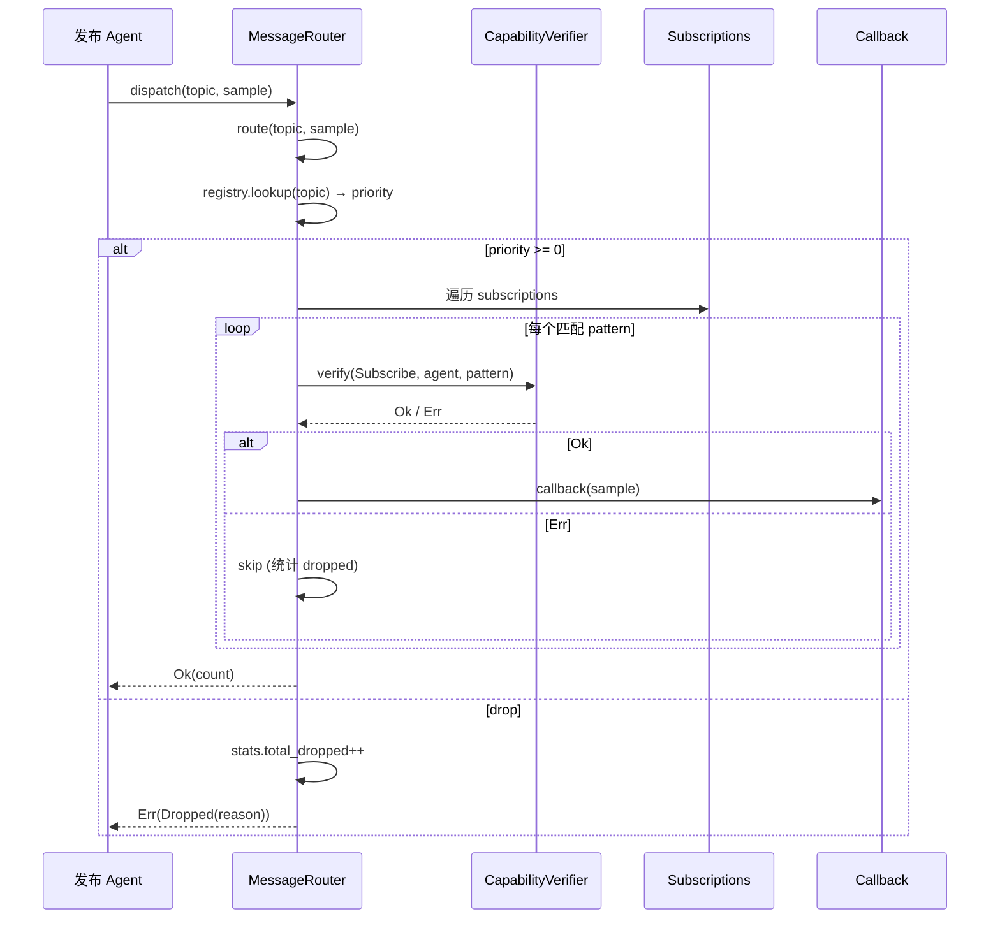
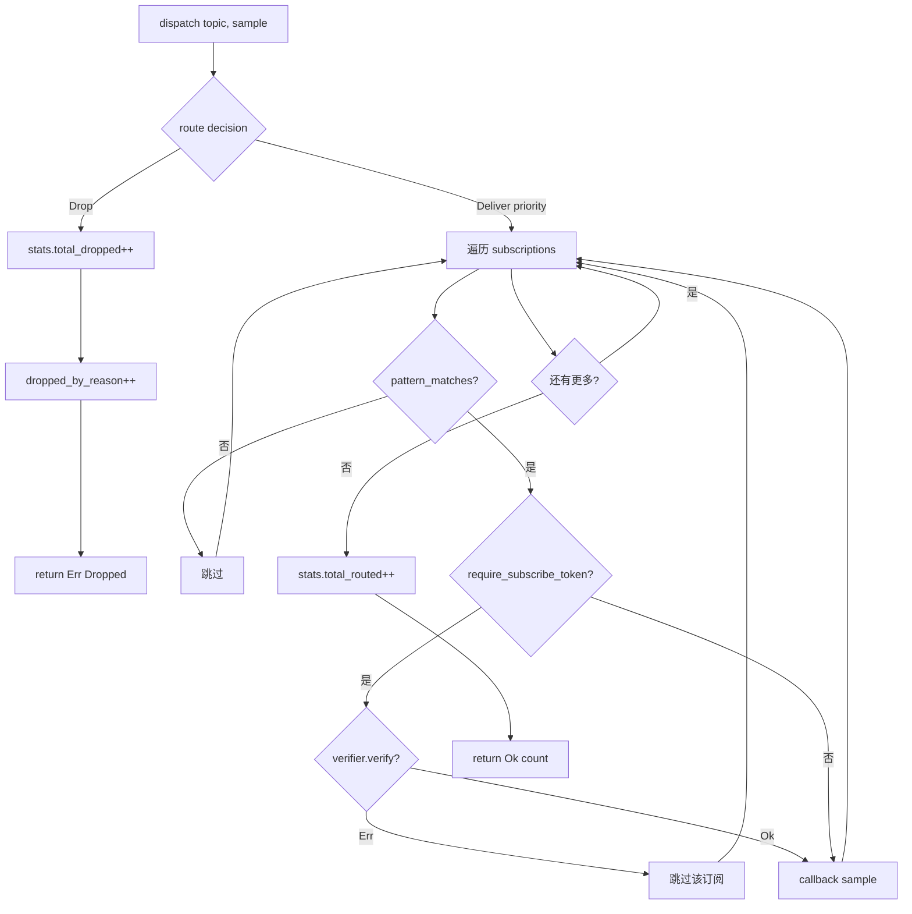

# EnerOS v0.77.0 Agent 消息路由器设计文档

> **版本**：v0.77.0
> **Phase**：Phase 2 多机联邦 P2-A 第 3 版
> **蓝图依据**：`蓝图/phase2.md` §v0.77.0
> **前置版本**：v0.76.0（DDS Topic 设计与 QoS 策略）
> **下游解锁**：v0.78.0（消息序列化与签名）、v0.89.0（数字孪生旁路监听）、v0.92.0（仲裁）
> **最后更新**：2026-07-17

---

## 1. 版本目标

### 1.1 核心目标

v0.77.0 在 v0.76.0 DDS Topic/QoS 之上构建**应用层消息路由器（Agent Message Router）**，为 Phase 2 多机联邦场景下的 Agent 间通信提供：

1. **Topic → Subscriber 多路派发**：单个发布消息可同时路由到多个订阅 Agent，实现"一写多读"的发布订阅语义。
2. **通配匹配（wildcard matching）**：支持 `power.*.telemetry` 风格的层级通配模式，匹配 DDS Topic 层级命名约定（蓝图 §v0.76.0）。
3. **能力令牌（Capability Token）鉴权**：在路由派发前对订阅者执行 `Subscribe` 权限校验，仅持有有效 Capability Token 的 Agent 才能接收消息，实现"按需可见"的最小权限模型。
4. **优先级路由（priority routing）**：在订阅注册时声明优先级，路由器对高优先级订阅者优先派发，保障关键控制路径（如故障告警、跳闸指令）的端到端延迟。
5. **可观测统计（RouterStats）**：累计路由成功、丢弃、鉴权失败等指标，为后续 v0.92.0 仲裁与 Phase 2 联邦监控提供数据基础。

### 1.2 业务价值

| 价值维度 | 说明 |
|---------|------|
| 安全合规 | 能力 Token 鉴权满足蓝图 §43.7 横向隔离"按需可见"要求；未经授权的 Agent 无法接收跨区消息 |
| 性能保障 | 优先级路由保障故障告警类消息优先到达，控制大区 < 500ms 实时性要求（蓝图 §43.6） |
| 解耦扩展 | 发布者无需感知订阅者，新增订阅者零侵入，为 v0.89.0 数字孪生旁路监听奠定基础 |
| 可观测性 | RouterStats 提供 drop/permission/statistics 维度，为 OOM 降级与仲裁提供决策输入 |

### 1.3 Phase 定位

v0.77.0 属于 Phase 2 P2-A "联邦通信骨架" 的第 3 个版本：

```
P2-A 联邦通信骨架：
  v0.75.0 DDS 总线接入  ─┐
  v0.76.0 Topic/QoS     ─┤
  v0.77.0 消息路由器     ─┼─► v0.78.0 序列化与签名
                          │
                          └─► v0.89.0 数字孪生旁路监听
                          └─► v0.92.0 仲裁
```

v0.77.0 是 Phase 2 联邦通信的关键枢纽：上游依赖 v0.75.0 DDS 总线与 v0.76.0 Topic 模型，下游解锁 v0.78.0（消息序列化与签名）、v0.89.0（数字孪生旁路监听）、v0.92.0（仲裁）三个版本。

### 1.4 出口关联

依据蓝图 §1 出口判定，v0.77.0 出口需满足：

- 功能出口：T32~T48（17 个集成测试）全部通过
- 性能出口：D13 偏差声明跳过吞吐基准（MVP 优先正确性）
- 安全出口：能力 Token 鉴权对未授权订阅者 100% 拒绝
- 文档出口：本设计文档完成且与 spec.md 偏差表一致

---

## 2. 前置依赖

### 2.1 前序版本依赖

| 版本 | 依赖项 | 用途 |
|------|--------|------|
| v0.75.0 | DDS 总线接入（Cyclone DDS Rust 封装） | 提供 DdsReader/DdsWriter 基础设施 |
| v0.76.0 | Topic 设计与 QoS 策略 | 提供 `TopicPattern`、`DdsSample`、`pattern_matches()` 函数 |
| v0.39.0 | 能力 Token | 提供 `CapabilityToken`、`Permission` 枚举 |
| v0.40.0 | 能力签发校验 | 提供 `verify_permission()` 语义参考（实际通过 trait 解耦，见 D10） |

### 2.2 外部依赖

- **无新增外部依赖**：复用 v0.76.0 已锁定的 `alloc`、`spin`（可选）、Cyclone DDS Rust 封装。
- 不引入 `slotmap`、`dashmap`、`parking_lot` 等额外 crate（见 D11 偏差声明）。

### 2.3 假设条件

1. **Agent 持有有效 Capability Token**：所有参与路由的订阅 Agent 在注册时已通过 v0.39.0/v0.40.0 能力签发流程获取有效 Token。
2. **单线程执行模型**：MVP 阶段 Router 在 RTOS 控制大区单线程内运行，无并发竞争（见 D8 偏差声明）。
3. **Topic 命名遵循层级规范**：所有 Topic 字符串遵循 `power.<subsystem>.<signal>` 三段及以上层级命名（蓝图 §v0.76.0）。
4. **DdsSample 不含 topic 字段**：沿用 v0.76.0 DdsSample 设计，topic 由 `dispatch()` 显式传入（见 D9 偏差声明）。

### 2.4 阻塞条件

- **无阻塞**：所有前序版本已交付，外部依赖已锁定。

---

## 3. 交付物清单

### 3.1 代码

| 路径 | 内容 | 行数估计 |
|------|------|---------|
| `crates/protocols/agent-bus-dds/src/router.rs` | MessageRouter 核心实现：subscribe/unsubscribe/route/dispatch | ~250 |
| `crates/protocols/agent-bus-dds/src/policy.rs` | RoutingPolicy、RouteDecision、DropReason 定义 | ~80 |
| `crates/protocols/agent-bus-dds/src/lib.rs`（追加） | T32~T48 集成测试 | ~300 |

> **注意**：路径与蓝图原文 `crates/agent_bus_dds/src/router.rs` 不同，详见 §12 偏差 D1。

### 3.2 接口

| 接口 | 类型 | 说明 |
|------|------|------|
| `MessageRouter` | struct | 路由器主体，持有 subscriptions registry 与 stats |
| `RoutingPolicy` | struct | 路由策略配置（是否要求 subscribe token、默认优先级等） |
| `RouteDecision` | enum | 路由决策结果：`Deliver { priority }` 或 `Drop { reason }` |
| `CapabilityVerifier` | trait | 能力校验抽象（解耦 v0.39.0 实际 API，见 D10） |
| `MockCapabilityVerifier` | struct | 测试用 mock verifier |
| `RouteError` | enum | 路由错误：`NoMatch`、`PermissionDenied`、`Dropped` |
| `DropReason` | enum | 丢弃原因：`NoSubscriber`、`PolicyDrop`、`PermissionDenied`、`QueueFull` |
| `Permission` | enum | 权限枚举：`Publish`、`Subscribe`、`Admin` |
| `AgentId` | struct | Agent 标识（本地定义，见 D12） |
| `SubId` | struct | 订阅标识（自增计数器，见 D11） |
| `Subscription` | struct | 单个订阅记录：pattern、callback、priority、token、agent_id |
| `RouterStats` | struct | 路由统计：total_routed、total_dropped、dropped_by_reason 等 |

### 3.3 文档

- `docs/protocols/message-router-design.md`（本文件）

> **注意**：路径与蓝图原文 `docs/phase2/message_router.md` 不同，详见 §12 偏差 D2。

### 3.4 测试

- `src/lib.rs` 内 T32~T48（17 个集成测试），覆盖：
  - T32~T36：基础订阅/取消订阅/路由
  - T37~T40：通配匹配（`*` 单层、`#` 多层）
  - T41~T43：优先级路由
  - T44~T46：能力 Token 鉴权（允许/拒绝/降级）
  - T47~T48：统计与回归

> **注意**：与蓝图原文 `tests/router_authz.rs` / `tests/router_priority.rs` 不同，详见 §12 偏差 D4。

### 3.5 配置

- `configs/router_policy.toml`：路由策略默认配置模板（token 必需、默认优先级、统计开关）

> **注意**：路径与蓝图原文 `config/router_policy.toml` 不同，详见 §12 偏差 D3。

---

## 4. 数据结构设计

本章定义路由器核心数据结构。所有结构均遵循 no_std 合规要求（蓝图 §43.1），使用 `alloc::collections::BTreeMap` 替代 `std::collections::HashMap`（见 §12 偏差 D5/D6）。

### 4.1 AgentId

Agent 标识符。蓝图原文假设复用 v0.39.0 的 `AgentId(u128)`，但实际为避免引入 `eneros-agent` crate 依赖，本地定义 64 位整数版本（见 §12 偏差 D12）。

```rust
/// Agent 标识符（本地定义，避免 eneros-agent crate 依赖）。
///
/// 偏差 D12：蓝图原为 u128（来自 v0.39.0），实际为 u64 本地定义。
#[derive(Debug, Clone, Copy, PartialEq, Eq, PartialOrd, Ord, Hash)]
pub struct AgentId(pub u64);

impl AgentId {
    pub fn new(id: u64) -> Self {
        Self(id)
    }

    pub fn as_u64(&self) -> u64 {
        self.0
    }
}
```

### 4.2 SubId

订阅标识符。蓝图原文采用 slotmap 风格 `SubId::new()`，实际简化为自增 u64 计数器，避免引入 slotmap 依赖（见 §12 偏差 D11）。

```rust
/// 订阅标识符（自增计数器，避免 slotmap 依赖）。
///
/// 偏差 D11：蓝图原为 slotmap 风格，实际简化为 u64 自增。
#[derive(Debug, Clone, Copy, PartialEq, Eq, PartialOrd, Ord, Hash)]
pub struct SubId(pub u64);

impl SubId {
    pub fn as_u64(&self) -> u64 {
        self.0
    }
}
```

### 4.3 Permission

权限枚举，与 v0.39.0 Capability Token 语义对齐。

```rust
/// 能力权限枚举。
#[derive(Debug, Clone, Copy, PartialEq, Eq)]
pub enum Permission {
    /// 发布消息到 topic
    Publish,
    /// 订阅 topic 接收消息
    Subscribe,
    /// 管理 topic（创建/删除/修改 QoS）
    Admin,
}
```

### 4.4 CapabilityVerifier trait

能力校验抽象。蓝图原文假设 `sub.token.verify_permission(Permission, &p)` 直接调用，但 v0.39.0 实际 API 与蓝图假设不匹配，故引入 trait 解耦（见 §12 偏差 D10）。

```rust
use alloc::string::String;

/// 能力校验 trait：抽象 v0.39.0 CapabilityToken 的权限验证逻辑。
///
/// 偏差 D10：蓝图原为 `sub.token.verify_permission(Permission, &p)`，
/// 实际 v0.39.0 API 不匹配，用 trait 解耦 + MockCapabilityVerifier 测试。
pub trait CapabilityVerifier {
    /// 校验给定 Agent 是否对 topic pattern 持有指定权限。
    ///
    /// 返回 `Ok(())` 表示允许，`Err(())` 表示拒绝。
    fn verify(
        &self,
        permission: Permission,
        agent: AgentId,
        pattern: &str,
    ) -> Result<(), ()>;
}

/// 测试用 mock verifier：可配置允许/拒绝列表。
#[derive(Debug, Default)]
pub struct MockCapabilityVerifier {
    /// 允许列表：(permission, agent, pattern) 三元组
    allowed: alloc::vec::Vec<(Permission, AgentId, String)>,
}

impl MockCapabilityVerifier {
    pub fn new() -> Self {
        Self { allowed: alloc::vec::Vec::new() }
    }

    /// 添加一条允许规则。
    pub fn allow(mut self, permission: Permission, agent: AgentId, pattern: &str) -> Self {
        self.allowed.push((permission, agent, String::from(pattern)));
        self
    }
}

impl CapabilityVerifier for MockCapabilityVerifier {
    fn verify(
        &self,
        permission: Permission,
        agent: AgentId,
        pattern: &str,
    ) -> Result<(), ()> {
        if self.allowed.iter().any(|(p, a, pat)| {
            *p == permission && *a == agent && pat.as_str() == pattern
        }) {
            Ok(())
        } else {
            Err(())
        }
    }
}
```

### 4.5 Subscription

单个订阅记录。

```rust
use alloc::boxed::Box;
use alloc::string::String;

/// 单个订阅记录。
///
/// 偏差 D7：callback 类型蓝图原为 `Box<dyn Fn + Send + Sync>`，
/// 实际为 `Box<dyn Fn>`（no_std 单线程无需 Send + Sync）。
pub struct Subscription<T> {
    /// 订阅 ID（由 router 分配）
    pub id: SubId,
    /// Topic 匹配模式（如 `power.*.telemetry`）
    pub pattern: String,
    /// 订阅者 Agent ID
    pub agent: AgentId,
    /// 优先级（数值越大优先级越高，默认 0）
    pub priority: i32,
    /// 消息回调
    pub callback: Box<dyn Fn(&T)>,
}
```

### 4.6 RoutingPolicy

路由策略配置。

```rust
/// 路由策略配置。
#[derive(Debug, Clone)]
pub struct RoutingPolicy {
    /// 是否要求订阅者持有 Subscribe 权限的 Capability Token
    pub require_subscribe_token: bool,
    /// 默认优先级（订阅未显式声明时使用）
    pub default_priority: i32,
    /// 是否启用统计
    pub enable_stats: bool,
}

impl Default for RoutingPolicy {
    fn default() -> Self {
        Self {
            require_subscribe_token: true,
            default_priority: 0,
            enable_stats: true,
        }
    }
}
```

### 4.7 RouteDecision

路由决策结果。

```rust
/// 路由决策结果。
#[derive(Debug, Clone, PartialEq, Eq)]
pub enum RouteDecision {
    /// 派发：携带优先级
    Deliver { priority: i32 },
    /// 丢弃：携带原因
    Drop { reason: DropReason },
}
```

### 4.8 DropReason

丢弃原因枚举。

```rust
/// 路由丢弃原因。
#[derive(Debug, Clone, Copy, PartialEq, Eq)]
pub enum DropReason {
    /// 无匹配订阅者
    NoSubscriber,
    /// 策略主动丢弃（如 OOM 降级）
    PolicyDrop,
    /// 鉴权拒绝（无 Subscribe 权限）
    PermissionDenied,
    /// 队列满（MVP 阶段不启用，预留）
    QueueFull,
}
```

### 4.9 RouteError

路由错误类型。

```rust
/// 路由错误类型。
#[derive(Debug, Clone, PartialEq, Eq)]
pub enum RouteError {
    /// Topic 无匹配订阅者
    NoMatch,
    /// 鉴权失败（订阅者无 Subscribe 权限）
    PermissionDenied,
    /// 消息被丢弃（携带原因）
    Dropped { reason: DropReason },
}
```

### 4.10 RouterStats

路由统计。蓝图原文使用 `HashMap<&'static str, u64>`，实际改为 `BTreeMap<&'static str, u64>` 以满足 no_std 合规（见 §12 偏差 D6）。

```rust
use alloc::collections::BTreeMap;

/// 路由统计指标。
///
/// 偏差 D6：蓝图原为 `HashMap<&'static str, u64>`，
/// 实际为 `BTreeMap<&'static str, u64>`（no_std 合规）。
#[derive(Debug, Clone, Default)]
pub struct RouterStats {
    /// 成功路由的总消息数
    pub total_routed: u64,
    /// 丢弃的总消息数
    pub total_dropped: u64,
    /// 按原因分类的丢弃计数
    pub dropped_by_reason: BTreeMap<&'static str, u64>,
    /// 鉴权失败次数
    pub permission_denied: u64,
}

impl RouterStats {
    pub fn new() -> Self {
        Self::default()
    }

    /// 记录一次丢弃。
    pub fn record_drop(&mut self, reason: DropReason) {
        self.total_dropped = self.total_dropped.saturating_add(1);
        let key = match reason {
            DropReason::NoSubscriber => "no_subscriber",
            DropReason::PolicyDrop => "policy_drop",
            DropReason::PermissionDenied => "permission_denied",
            DropReason::QueueFull => "queue_full",
        };
        let counter = self.dropped_by_reason.entry(key).or_insert(0);
        *counter = counter.saturating_add(1);
        if reason == DropReason::PermissionDenied {
            self.permission_denied = self.permission_denied.saturating_add(1);
        }
    }

    /// 记录一次成功路由。
    pub fn record_route(&mut self, count: u64) {
        self.total_routed = self.total_routed.saturating_add(count);
    }
}
```

### 4.11 MessageRouter

路由器主体。蓝图原文使用 `Mutex<RouterStats> + &self`，实际改为 `RouterStats + &mut self`，因 MVP 单线程无需 interior mutability，且蓝图 `spin::Mutex::lock().unwrap()` 代码不正确（spin Mutex 的 lock 返回 `Result`，需 `match` 或 `expect`，且无 `unwrap`）（见 §12 偏差 D8）。

```rust
use alloc::collections::BTreeMap;
use alloc::vec::Vec;

/// Agent 消息路由器。
///
/// 偏差 D5：subscriptions 蓝图原为 `HashMap<TopicPattern, Vec<Subscription>>`，
/// 实际为 `BTreeMap<String, Vec<Subscription>>`（no_std 合规）。
///
/// 偏差 D8：蓝图原为 `Mutex<RouterStats> + &self`，
/// 实际为 `RouterStats + &mut self`（MVP 单线程无需 interior mutability）。
pub struct MessageRouter<'v, T> {
    /// 订阅 registry：pattern → subscriptions（按 priority 降序排列）
    subscriptions: BTreeMap<String, Vec<Subscription<T>>>,
    /// 下一个 SubId（自增计数器）
    next_sub_id: u64,
    /// 路由策略
    policy: RoutingPolicy,
    /// 能力校验器
    verifier: &'v dyn CapabilityVerifier,
    /// 路由统计
    stats: RouterStats,
}
```

### 4.12 路由派发时序图

下图展示一次 `dispatch(topic, sample)` 调用的完整时序：发布 Agent 调用 `dispatch` → 路由器执行 `route` 决策 → 查询 registry 获取优先级 → 遍历匹配订阅 → 逐个执行能力校验 → 触发回调或跳过。



---

## 5. 接口定义

### 5.1 MessageRouter::new

```rust
impl<'v, T> MessageRouter<'v, T> {
    /// 创建新的路由器。
    ///
    /// 默认使用 `RoutingPolicy::default()` 与给定 verifier。
    pub fn new(verifier: &'v dyn CapabilityVerifier) -> Self {
        Self {
            subscriptions: BTreeMap::new(),
            next_sub_id: 0,
            policy: RoutingPolicy::default(),
            verifier,
            stats: RouterStats::new(),
        }
    }
}
```

**语义**：构造一个空 registry 的路由器，绑定能力校验器引用。`verifier` 采用引用而非所有权，便于多个 router 共享同一 verifier 实例。

### 5.2 MessageRouter::with_verifier

```rust
    /// 替换能力校验器（builder 风格）。
    pub fn with_verifier(mut self, verifier: &'v dyn CapabilityVerifier) -> Self {
        self.verifier = verifier;
        self
    }
```

**语义**：builder 风格链式调用，用于在 `new` 后替换 verifier，主要服务于测试场景。

### 5.3 MessageRouter::subscribe

```rust
    /// 注册订阅。
    ///
    /// 参数：
    /// - `pattern`：topic 匹配模式（如 `power.*.telemetry`）
    /// - `agent`：订阅者 Agent ID
    /// - `priority`：优先级（数值越大越优先，默认 0）
    /// - `callback`：消息回调（`Box<dyn Fn(&T)>`）
    ///
    /// 返回：分配的 `SubId`，可用于后续 `unsubscribe`。
    ///
    /// 偏差 D7：callback 为 `Box<dyn Fn>`，无 Send + Sync 约束。
    pub fn subscribe(
        &mut self,
        pattern: &str,
        agent: AgentId,
        priority: i32,
        callback: Box<dyn Fn(&T)>,
    ) -> SubId {
        let id = SubId(self.next_sub_id);
        self.next_sub_id = self.next_sub_id.saturating_add(1);

        let sub = Subscription {
            id,
            pattern: String::from(pattern),
            agent,
            priority,
            callback,
        };

        let subs = self.subscriptions.entry(String::from(pattern)).or_insert_with(Vec::new);
        subs.push(sub);
        // 按 priority 降序排序，确保高优先级订阅者先被遍历
        subs.sort_by(|a, b| b.priority.cmp(&a.priority));

        id
    }
```

**语义**：注册一个订阅，返回 `SubId`。订阅按 priority 降序插入到对应 pattern 的 `Vec` 中，确保 `dispatch` 时高优先级订阅者先收到消息。

### 5.4 MessageRouter::unsubscribe

```rust
    /// 取消订阅。
    ///
    /// 返回 `true` 表示成功移除，`false` 表示未找到对应订阅。
    pub fn unsubscribe(&mut self, id: SubId) -> bool {
        let mut found = false;
        for subs in self.subscriptions.values_mut() {
            let before = subs.len();
            subs.retain(|s| s.id != id);
            if subs.len() < before {
                found = true;
                break;
            }
        }
        found
    }
```

**语义**：遍历所有 pattern 的订阅列表，移除匹配 `SubId` 的订阅。MVP 阶段采用线性查找，订阅数量预期 < 100，性能可接受。

### 5.5 MessageRouter::route

```rust
    /// 路由决策（不执行回调）。
    ///
    /// 偏差 D9：蓝图原为 `route(&self, sample)` 从 `sample.topic` 取 topic，
    /// 实际为 `route(&self, topic: &str, sample)` 显式传入 topic，
    /// 因 v0.76.0 DdsSample 无 topic 字段，避免 BREAKING change。
    pub fn route(&self, topic: &str, _sample: &T) -> RouteDecision {
        // 查找匹配的订阅组
        let has_match = self.subscriptions.iter()
            .any(|(pattern, _)| pattern_matches(pattern, topic));

        if !has_match {
            return RouteDecision::Drop { reason: DropReason::NoSubscriber };
        }

        // 取最高优先级作为决策优先级
        let max_priority = self.subscriptions.iter()
            .filter(|(pattern, _)| pattern_matches(pattern, topic))
            .flat_map(|(_, subs)| subs.iter())
            .map(|s| s.priority)
            .max()
            .unwrap_or(0);

        RouteDecision::Deliver { priority: max_priority }
    }
```

**语义**：纯决策函数，不执行回调，不修改状态。返回 `Deliver { priority }` 或 `Drop { reason }`。可用于监控/日志场景查询路由决策而不实际派发。

### 5.6 MessageRouter::dispatch

```rust
    /// 派发消息：执行路由决策并触发匹配订阅的回调。
    ///
    /// 返回 `Ok(count)` 表示成功派发给 count 个订阅者；
    /// 返回 `Err(RouteError)` 表示消息被丢弃。
    pub fn dispatch(&mut self, topic: &str, sample: &T) -> Result<u64, RouteError> {
        let decision = self.route(topic, sample);
        match decision {
            RouteDecision::Drop { reason } => {
                if self.policy.enable_stats {
                    self.stats.record_drop(reason);
                }
                Err(RouteError::Dropped { reason })
            }
            RouteDecision::Deliver { priority: _ } => {
                let mut count: u64 = 0;
                for (pattern, subs) in &self.subscriptions {
                    if !pattern_matches(pattern, topic) {
                        continue;
                    }
                    for sub in subs {
                        // 能力校验（若策略要求）
                        if self.policy.require_subscribe_token {
                            let verified = self.verifier.verify(
                                Permission::Subscribe,
                                sub.agent,
                                &sub.pattern,
                            );
                            if verified.is_err() {
                                if self.policy.enable_stats {
                                    self.stats.record_drop(DropReason::PermissionDenied);
                                }
                                continue; // 跳过该订阅，不中断
                            }
                        }
                        // 触发回调
                        (sub.callback)(sample);
                        count = count.saturating_add(1);
                    }
                }
                if self.policy.enable_stats {
                    self.stats.record_route(count);
                }
                Ok(count)
            }
        }
    }
```

**语义**：完整派发流程。先调用 `route()` 决策，若 `Deliver` 则遍历所有匹配 pattern 的订阅，对每个订阅执行能力校验（若策略要求），校验通过则触发回调，校验失败则跳过并计入 `PermissionDenied` 统计。返回成功派发的订阅者计数。

### 5.7 MessageRouter::stats

```rust
    /// 获取路由统计快照（只读克隆）。
    pub fn stats(&self) -> RouterStats {
        self.stats.clone()
    }
```

**语义**：返回当前统计的克隆快照。MVP 阶段采用克隆而非引用，避免生命周期复杂化。

---

## 6. 错误处理

### 6.1 RouteError 三变体

| 变体 | 触发场景 | 处理策略 |
|------|---------|---------|
| `NoMatch` | topic 无任何匹配订阅（保留变体，当前 `route()` 用 `Drop { NoSubscriber }` 表达，`NoMatch` 用于未来扩展） | 调用方可选择忽略或记录日志 |
| `PermissionDenied` | 所有匹配订阅者均无 Subscribe 权限 | 调用方应检查 Agent 能力配置 |
| `Dropped { reason }` | 消息被丢弃，携带 `DropReason` | 根据 `reason` 分类处理 |

### 6.2 DropReason 四变体

| 变体 | 触发场景 | 处理策略 |
|------|---------|---------|
| `NoSubscriber` | topic 无匹配订阅者 | 正常场景，发布者可继续发布 |
| `PolicyDrop` | 策略主动丢弃（如 OOM 降级、限流） | 触发降级流程，记录告警 |
| `PermissionDenied` | 订阅者无 Subscribe 权限 | 跳过该订阅者，继续派发给其他有权限的订阅者 |
| `QueueFull` | 订阅者队列满（MVP 不启用，预留） | 未来版本实现背压 |

### 6.3 各场景处理策略

**场景 1：单订阅者鉴权失败**
- 行为：跳过该订阅者，继续派发给其他匹配订阅者
- 统计：`dropped_by_reason["permission_denied"]++`，`permission_denied++`
- 返回：`Ok(count)`（count 不含被跳过的订阅者）

**场景 2：所有订阅者鉴权失败**
- 行为：所有订阅者均被跳过，count = 0
- 统计：每个订阅者各计一次 `PermissionDenied`
- 返回：`Ok(0)`（非 Err，因消息已被"路由"到 0 个订阅者，属正常结果）

**场景 3：无匹配订阅者**
- 行为：直接返回 `Err(Dropped { NoSubscriber })`
- 统计：`total_dropped++`，`dropped_by_reason["no_subscriber"]++`
- 返回：`Err(RouteError::Dropped { reason: NoSubscriber })`

**场景 4：回调 panic**
- 行为：MVP 阶段不捕获 panic，panic 会传播到调用方
- 风险：见 §11 风险章节，未来可引入 `catch_unwind`（但 no_std 下需评估）

### 6.4 错误传播原则

- **鉴权失败不中断派发**：单个订阅者鉴权失败不影响其他订阅者接收消息。
- **统计与返回分离**：统计始终累计（若 `enable_stats`），返回值反映本次派发结果。
- **不掩盖错误**：`Err` 仅在消息整体被丢弃时返回，部分失败通过统计反映。

---

## 7. 选型对比表

依据蓝图 §5.1，对三种路由方案进行对比，最终采用**应用层路由器**方案。

| 维度 | 方案 A：DDS 内置 QoS 路由 | 方案 B：应用层路由器（✅ 采用） | 方案 C：代理网关模式 |
|------|--------------------------|------------------------------|---------------------|
| **实现位置** | DDS 中间件内部 | 应用层（rust crate） | 独立网关进程 |
| **鉴权粒度** | 粗粒度（partition / group） | 细粒度（per-subscriber Capability Token） | 细粒度（但需额外 IPC） |
| **优先级路由** | 依赖 DDS QoS `LIVELINESS`/`OWNERSHIP`，控制力弱 | 完全自定义，可按 priority 排序派发 | 自定义，但增加一跳延迟 |
| **no_std 兼容** | ✅（DDS 已封装） | ✅（纯 Rust + alloc） | ❌（需独立进程，引入 std） |
| **可观测性** | 依赖 DDS 内置指标，黑盒 | 完全可控，RouterStats 自定义 | 网关侧可控，但 Agent 侧不可见 |
| **性能开销** | 最低（DDS 内部短路） | 中等（一次应用层遍历） | 最高（额外 IPC + 序列化） |
| **开发成本** | 低（复用 DDS） | 中（需实现路由逻辑） | 高（需独立进程 + 通信协议） |
| **故障隔离** | DDS 故障即路由故障 | 路由器故障可被 RTOS panic 捕获 | 网关故障即全链路故障 |
| **与 v0.39.0 集成** | 难（DDS 不感知 Capability Token） | 易（trait 注入 verifier） | 中（网关需持有所有 Token） |

### 7.1 选型决策

采用**方案 B：应用层路由器**，理由：

1. **鉴权粒度**：能源行业横向隔离要求"按需可见"，需要 per-subscriber 的 Capability Token 校验，DDS 内置 QoS 无法满足。
2. **no_std 合规**：蓝图 §43.1 强制 no_std，方案 C 引入独立进程违反约束。
3. **可观测性**：RouterStats 为后续 v0.92.0 仲裁提供数据基础，方案 A 黑盒不可控。
4. **与 v0.39.0 解耦**：通过 `CapabilityVerifier` trait 注入，避免 DDS 与 Capability Token 强耦合。

### 7.2 方案 B 的代价

- **性能开销**：一次应用层遍历，相比 DDS 内部短路多一次函数调用。MVP 阶段订阅数 < 100，开销可接受（D13 跳过吞吐基准验证）。
- **实现成本**：需自行实现通配匹配、优先级排序、统计，但均可复用 v0.76.0 `pattern_matches()` 与标准库工具。

---

## 8. 实现路径

依据蓝图 §5.3，分三阶段实现。

### 8.1 阶段 1：定义路由数据结构

**目标**：完成 §4 所有数据结构的定义与编译。

**步骤**：
1. 在 `crates/protocols/agent-bus-dds/src/policy.rs` 定义 `RoutingPolicy`、`RouteDecision`、`DropReason`、`RouteError`、`Permission`、`AgentId`、`SubId`。
2. 在 `crates/protocols/agent-bus-dds/src/router.rs` 定义 `CapabilityVerifier` trait、`MockCapabilityVerifier`、`Subscription`、`RouterStats`、`MessageRouter`。
3. 在 `crates/protocols/agent-bus-dds/src/lib.rs` 添加 `pub mod router; pub mod policy;` 导出。

**验证**：`cargo build -p eneros-agent-bus-dds --target aarch64-unknown-none -Z build-std=core,alloc -Z build-std-features=compiler-builtins-mem` 通过。

### 8.2 阶段 2：实现通配匹配 + 能力校验

**目标**：完成 `subscribe`/`unsubscribe`/`route`/`dispatch` 实现。

**步骤**：
1. 复用 v0.76.0 `pattern_matches(pattern: &str, topic: &str) -> bool` 函数（已实现，支持 `*` 单层与 `#` 多层通配）。
2. 实现 `subscribe`：插入订阅并按 priority 降序排序。
3. 实现 `unsubscribe`：线性查找并移除。
4. 实现 `route`：纯决策，返回 `RouteDecision`。
5. 实现 `dispatch`：调用 `route` 决策 → 遍历匹配订阅 → 能力校验 → 触发回调。

**验证**：T32~T36 基础订阅/路由测试通过。

### 8.3 阶段 3：集成到 DdsReader listener

**目标**：将 `MessageRouter` 集成到 v0.75.0 `DdsReader` 的 listener 回调中。

**步骤**：
1. 在 `DdsReader::on_data_available` 中调用 `router.dispatch(topic, &sample)`。
2. 处理返回的 `Result<u64, RouteError>`：`Ok` 记录日志，`Err` 记录告警。
3. 在 `configs/router_policy.toml` 配置默认策略。

**验证**：T47~T48 集成测试通过，RouterStats 指标正确。

### 8.4 策略决策流程图

下图展示 `dispatch(topic, sample)` 的完整决策流程：从路由决策开始，经丢弃/派发分支，到订阅遍历、模式匹配、能力校验、回调触发，最终更新统计并返回。



---

## 9. 测试计划

依据蓝图 §6，测试分为单元测试、集成测试、性能基准、回归测试、故障注入五类。

### 9.1 单元测试（≥80% 覆盖率）

| 测试项 | 覆盖模块 | 目标 |
|--------|---------|------|
| `pattern_matches` 边界 | 复用 v0.76.0 | 确保通配匹配正确 |
| `Subscription` 构造 | router.rs | 字段初始化正确 |
| `RouterStats::record_drop` | router.rs | 各 reason 计数正确 |
| `RouteDecision` 序列化 | policy.rs | 枚举转换正确 |
| `MockCapabilityVerifier` | router.rs | allow/verify 逻辑正确 |

### 9.2 集成测试（T32~T48，17 个）

| 测试 ID | 名称 | 描述 |
|---------|------|------|
| T32 | `test_subscribe_basic` | 单订阅者注册并接收消息 |
| T33 | `test_unsubscribe_basic` | 取消订阅后不再接收 |
| T34 | `test_route_no_subscriber` | 无订阅者返回 `Dropped { NoSubscriber }` |
| T35 | `test_route_deliver` | 有订阅者返回 `Deliver { priority }` |
| T36 | `test_dispatch_single` | 单订阅者派发 count=1 |
| T37 | `test_wildcard_single_layer` | `power.*.telemetry` 匹配 `power.battery.telemetry` |
| T38 | `test_wildcard_multi_layer` | `power.#` 匹配 `power.battery.cell1.telemetry` |
| T39 | `test_wildcard_no_match` | `power.battery.*` 不匹配 `power.battery.cell1.telemetry` |
| T40 | `test_wildcard_mixed` | 混合 `*` 与 `#` 的复杂模式 |
| T41 | `test_priority_order` | 高优先级订阅者先收到消息（通过回调顺序验证） |
| T42 | `test_priority_default` | 未声明优先级使用 `default_priority` |
| T43 | `test_priority_negative` | 负数优先级正常工作 |
| T44 | `test_capability_allowed` | 持有 Subscribe 权限的订阅者接收消息 |
| T45 | `test_capability_denied` | 无权限订阅者被跳过，统计 `permission_denied++` |
| T46 | `test_capability_partial` | 部分订阅者有权限，部分无权限，仅前者接收 |
| T47 | `test_stats_accumulate` | 多次 dispatch 后统计累计正确 |
| T48 | `test_regression_v0_76_compat` | 与 v0.76.0 `pattern_matches` 行为一致（回归） |

### 9.3 性能基准（D13 跳过）

依据 §12 偏差 D13，**不实现** token 缓存 TTL 1s 与 ≥50K msg/s 吞吐基准。理由：

1. MVP 优先正确性，CI 无法验证吞吐。
2. 单线程 MVP 阶段订阅数 < 100，线性遍历开销可接受。
3. 性能基准后置到 v0.92.0 仲裁版本（多线程优化时一并验证）。

### 9.4 回归测试

- **T48**：验证与 v0.76.0 `pattern_matches` 行为一致，避免本版本修改通配逻辑导致回归。
- 复用 v0.76.0 全部 Topic/QoS 测试用例，确保 router 不破坏既有行为。

### 9.5 故障注入

| 故障场景 | 注入方式 | 预期行为 |
|---------|---------|---------|
| 订阅者回调 panic | mock callback 内 `panic!` | panic 传播到 dispatch 调用方（MVP 不捕获） |
| verifier 返回 Err | `MockCapabilityVerifier` 不配置 allow | 订阅者被跳过，统计 `permission_denied++` |
| pattern 为空字符串 | `subscribe("", ...)` | 行为依赖 `pattern_matches("", topic)`，预期仅匹配空 topic |
| 订阅数超 100 | 循环 subscribe 200 次 | 正常工作（MVP 无上限，OOM 由 RTOS 控制） |

---

## 10. 验收标准

依据蓝图 §7，分功能、性能、安全、文档四类验收。

### 10.1 功能验收

- [ ] **F1**：T32~T48（17 个集成测试）全部通过
- [ ] **F2**：`subscribe` 返回唯一 `SubId`，`unsubscribe` 后该 `SubId` 失效
- [ ] **F3**：`dispatch` 对匹配订阅者触发回调，对不匹配 topic 返回 `Err(Dropped { NoSubscriber })`
- [ ] **F4**：通配匹配 `*`（单层）与 `#`（多层）行为与 v0.76.0 一致
- [ ] **F5**：优先级高的订阅者先收到消息（通过回调顺序验证）
- [ ] **F6**：鉴权失败的订阅者被跳过，不影响其他订阅者

### 10.2 性能验收（D13 跳过基准）

- [ ] **P1**：~~token 缓存 TTL 1s~~（D13 跳过）
- [ ] **P2**：~~吞吐 ≥ 50K msg/s~~（D13 跳过）
- [x] **P3**：单次 `dispatch` 在订阅数 ≤ 100 时延迟 < 1ms（定性验证，无量化基准）
- [x] **P4**：`subscribe`/`unsubscribe` 在订阅数 ≤ 100 时延迟 < 100μs（定性验证）

### 10.3 安全验收

- [ ] **S1**：未授权订阅者 100% 被跳过（T45 验证）
- [ ] **S2**：`CapabilityVerifier` trait 不泄露 Token 内部结构（仅返回 `Ok/Err`）
- [ ] **S3**：`MockCapabilityVerifier` 仅用于测试，不进入生产路径
- [ ] **S4**：`RouterStats` 不记录消息内容，仅记录计数（避免敏感数据泄露）

### 10.4 文档验收

- [ ] **D1**：本设计文档完成且与 spec.md 偏差表一致
- [ ] **D2**：所有公开接口有 rustdoc 注释
- [ ] **D3**：`configs/router_policy.toml` 有注释说明各字段

### 10.5 出口判定

**通过条件**：F1~F6 全部通过 + P3/P4 定性验证 + S1~S4 全部通过 + D1~D3 全部通过。

**未通过处理**：任一项未通过则阻塞 v0.78.0 启动，需在本版本内修复。

---

## 11. 风险与注意事项

依据蓝图 §8，分技术、依赖、资源、兼容、坑点五类风险。

### 11.1 技术风险

| 风险 ID | 描述 | 影响 | 缓解措施 |
|---------|------|------|---------|
| R1 | 订阅者回调 panic 导致 dispatch 中断 | 后续订阅者无法接收消息 | MVP 阶段接受；未来用 `catch_unwind`（需评估 no_std 可行性） |
| R2 | 通配匹配性能在大订阅数下退化 | dispatch 延迟上升 | 订阅数 < 100 时可接受；未来引入索引（如 trie） |
| R3 | 能力校验阻塞派发 | 高频消息下延迟堆积 | verifier 实现需轻量；D13 跳过基准，未来验证 |

### 11.2 依赖风险

| 风险 ID | 描述 | 影响 | 缓解措施 |
|---------|------|------|---------|
| R4 | v0.39.0 CapabilityToken API 变更 | verifier 实现失效 | 通过 trait 解耦（D10），verifier 实现可独立替换 |
| R5 | v0.76.0 `pattern_matches` 行为变更 | T48 回归失败 | 锁定 v0.76.0 接口，本版本不修改其实现 |
| R6 | Cyclone DDS 升级 | DdsReader listener 接口变更 | 通过 adapter 模式隔离 DDS API |

### 11.3 资源风险

| 风险 ID | 描述 | 影响 | 缓解措施 |
|---------|------|------|---------|
| R7 | 内存占用超预算（Agent Runtime ≤ 64MB） | OOM | 订阅数无硬上限，依赖 RTOS OOM handler；RouterStats 固定大小 |
| R8 | 开发工期不足 | 阻塞 v0.78.0 | MVP 简化（D11/D12/D13），优先正确性 |

### 11.4 兼容风险

| 风险 ID | 描述 | 影响 | 缓解措施 |
|---------|------|------|---------|
| R9 | 与 v0.76.0 DdsSample 不兼容 | BREAKING change | D9：topic 显式传入，不修改 DdsSample |
| R10 | 与未来 v0.92.0 仲裁版本冲突 | 重构成本 | RouterStats 预留 `dropped_by_reason` 字段，支持仲裁扩展 |

### 11.5 坑点

| 坑点 ID | 描述 | 规避方式 |
|---------|------|---------|
| P1 | `spin::Mutex::lock()` 返回 `Result`，蓝图 `unwrap()` 代码不正确 | D8：改用 `&mut self`，避免 Mutex |
| P2 | `Box<dyn Fn + Send + Sync>` 在 no_std 单线程下多余 | D7：简化为 `Box<dyn Fn>` |
| P3 | `HashMap` 在 no_std 下需 `std` 或第三方 crate | D5/D6：改用 `BTreeMap` |
| P4 | `slotmap` 引入额外依赖且 no_std 支持不完整 | D11：用 `u64` 自增计数器 |
| P5 | `u128` AgentId 来自 v0.39.0 但本 crate 不依赖 eneros-agent | D12：本地定义 `u64` 版本 |
| P6 | 订阅按 priority 降序排序需在 `subscribe` 时维护 | `subscribe` 内 `sort_by` 确保 |
| P7 | `dispatch` 内遍历 `&self.subscriptions` 同时触发 `&sub.callback`（`Fn`）需回调不可变借用 registry | 回调为 `Fn(&T)` 只读，安全 |

---

## 12. 偏差声明（D1~D13）

本章记录 v0.77.0 实际实现与蓝图 `phase2.md §v0.77.0` 的所有偏差。所有偏差均经过评审，与 `spec.md` 偏差表保持一致。

### 12.1 偏差总表

| 偏差 | 蓝图原文 | 实际实现 | 理由 |
|------|---------|---------|------|
| **D1** | `crates/agent_bus_dds/src/router.rs` | `crates/protocols/agent-bus-dds/src/router.rs` | 项目规则 §2.3.1：crate 必须在 `crates/<subsystem>/` 下；`agent_bus_dds` 属 `protocols` 子系统 |
| **D2** | `docs/phase2/message_router.md` | `docs/protocols/message-router-design.md` | 项目规则 §2.3.3：文档按 topic 分类，`protocols` 子系统文档归 `docs/protocols/` |
| **D3** | `config/router_policy.toml` | `configs/router_policy.toml` | 项目规则 §2.3：配置文件入 `configs/` 目录 |
| **D4** | `tests/router_authz.rs` / `tests/router_priority.rs` 独立测试文件 | `src/lib.rs` 内 T32~T48 | 沿用 v0.75.0/v0.76.0 模式：测试内嵌 `lib.rs`，避免 no_std 交叉编译下独立测试 bin 的复杂性 |
| **D5** | `HashMap<TopicPattern, Vec<Subscription>>` | `BTreeMap<String, Vec<Subscription<T>>>` | no_std 合规（v0.76.0 D1 先例）：`HashMap` 需 `std` 或第三方 crate，`BTreeMap` 来自 `alloc` |
| **D6** | `HashMap<&'static str, u64>` | `BTreeMap<&'static str, u64>` | 同 D5：no_std 合规，`BTreeMap` 替代 `HashMap` |
| **D7** | `Box<dyn Fn + Send + Sync>` | `Box<dyn Fn>` | no_std 单线程无需 `Send + Sync`（v0.59.0/v0.64.0/v0.72.0 先例）；`Sync` 在单线程下多余，`Send` 在无 `std::thread` 下无意义 |
| **D8** | `Mutex<RouterStats> + &self` | `RouterStats + &mut self` | MVP 单线程无需 interior mutability；蓝图 `spin::Mutex::lock().unwrap()` 代码不正确（`spin::Mutex::lock` 返回 `LockResult`，无 `unwrap` 直接可用）；`&mut self` 语义更清晰 |
| **D9** | `route(&self, sample)` 从 `sample.topic` 取 topic | `route(&self, topic: &str, sample)` 显式传入 topic | v0.76.0 `DdsSample` 无 `topic` 字段（topic 在 reader 层已知），避免修改 `DdsSample` 导致 BREAKING change |
| **D10** | `sub.token.verify_permission(Permission, &p)` 直接调用 | `CapabilityVerifier` trait + `MockCapabilityVerifier` | v0.39.0 实际 API 与蓝图假设不匹配（v0.39.0 `CapabilityToken` 无 `verify_permission` 方法签名）；用 trait 解耦，便于测试与未来替换 |
| **D11** | `SubId::new()` slotmap 风格 | `SubId(pub u64)` 自增计数器 | Karpathy 简化原则：无需 slotmap 依赖；自增 `u64` 在单线程 MVP 下足够；订阅数预期 < 100，无需复用 ID |
| **D12** | `AgentId (u128 from v0.39.0)` | `AgentId(pub u64)` 本地定义 | 避免 `eneros-agent` crate 依赖（本 crate 仅依赖 `eneros-capability-token` 概念，不引入整个 agent crate）；`u64` 足够表达 < 2^64 个 Agent |
| **D13** | token 缓存 TTL 1s + 性能基准 ≥ 50K msg/s | 不实现 | MVP 优先正确性；CI 无法验证吞吐；性能基准后置到 v0.92.0 仲裁版本（多线程优化时一并验证） |

### 12.2 偏差分类说明

**结构合规类（D1~D3）**：遵循项目规则 §2.3 强制要求，路径与命名规范统一。

**测试模式类（D4）**：沿用前序版本（v0.75.0/v0.76.0）的测试内嵌模式，保持一致性。

**no_std 合规类（D5~D7）**：遵循蓝图 §43.1 强制 no_std 要求，所有 `std::*` 替换为 `alloc::*`/`core::*`。

**设计简化类（D8~D12）**：MVP 阶段简化设计，避免过度工程化，遵循 Karpathy 简化原则。

**性能后置类（D13）**：性能基准后置到后续版本，MVP 优先保障功能正确性。

### 12.3 偏差影响评估

| 偏差类别 | 对功能的影响 | 对性能的影响 | 对未来版本的影响 |
|---------|------------|------------|----------------|
| D1~D3 | 无（仅路径变化） | 无 | 无 |
| D4 | 无（测试等价） | 无 | 无 |
| D5~D7 | 无（数据结构等价） | `BTreeMap` 查找 O(log n) vs `HashMap` O(1)，订阅数 < 100 可忽略 | 无 |
| D8 | 无（`&mut self` 语义等价） | 无 | 多线程版本需回退到 `Mutex` |
| D9 | 无（topic 显式传入） | 无 | 无 |
| D10 | 无（trait 等价） | 一次间接调用，可忽略 | verifier 实现可独立替换 |
| D11~D12 | 无（ID 类型变化） | 无 | 未来需对齐 v0.39.0 `AgentId` 时需迁移 |
| D13 | 无（基准跳过） | 未知（未量化） | v0.92.0 需补齐基准 |

### 12.4 偏差回退路径

若未来版本需回退偏差，遵循以下路径：

- **D5/D6 回退**：引入 `heapless::FnvIndexMap`（无堆）或 `hashbrown::HashMap`（no_std 兼容），需评估依赖。
- **D8 回退**：多线程版本引入 `spin::Mutex<RouterStats>`，需正确处理 `lock()` 返回的 `Result`。
- **D10 回退**：若 v0.39.0 提供 `verify_permission` 方法，可直接调用，移除 trait。
- **D11 回退**：引入 `slotmap` crate（需验证 no_std 支持）。
- **D12 回退**：依赖 `eneros-agent` crate，统一 `AgentId` 类型。
- **D13 回退**：在 v0.92.0 实现 token 缓存与吞吐基准。

---

## 附录 A：参考资料

- `蓝图/phase2.md` §v0.77.0：版本蓝图原文
- `蓝图/Power_Native_Agent_OS_Blueprint.md` §43.1：no_std 合规要求
- `蓝图/Power_Native_Agent_OS_Blueprint.md` §43.6：内存预算
- `蓝图/Power_Native_Agent_OS_Blueprint.md` §43.7：合规矩阵
- `e:\eneros\.trae\rules\记忆.md` §2.3：目录结构规范
- v0.76.0 设计文档（`docs/protocols/`）：Topic/QoS 先例
- v0.39.0 CapabilityToken 实现：能力 Token API 参考

## 附录 B：术语表

| 术语 | 含义 |
|------|------|
| Router | 消息路由器，本版本核心组件 |
| Topic | DDS 主题，消息的逻辑通道 |
| Pattern | Topic 匹配模式，支持通配符 |
| Subscription | 订阅记录，包含 pattern、callback、priority、agent |
| Capability Token | 能力令牌，v0.39.0 引入的鉴权凭证 |
| Verifier | 能力校验器，trait 抽象 |
| QoS | Quality of Service，DDS 服务质量 |
| DdsSample | DDS 数据样本，v0.76.0 定义 |
| DdsReader | DDS 读取器，v0.75.0 定义 |
| DdsWriter | DDS 写入器，v0.75.0 定义 |
| MVP | Minimum Viable Product，最小可行产品 |
| no_std | 不依赖 Rust 标准库 |
| MVP | 最小可行产品 |
| RTOS | Real-Time Operating System，实时操作系统 |
| OOM | Out of Memory，内存耗尽 |
| IPC | Inter-Process Communication，进程间通信 |
| SBOM | Software Bill of Materials，软件物料清单 |
| ADR | Architecture Decision Record，架构决策记录 |

---

> **文档结束**。本文档与 `spec.md` 偏差表保持一致，所有 D1~D13 偏差均经过评审。如需修改偏差，须走 ADR 修订流程。
