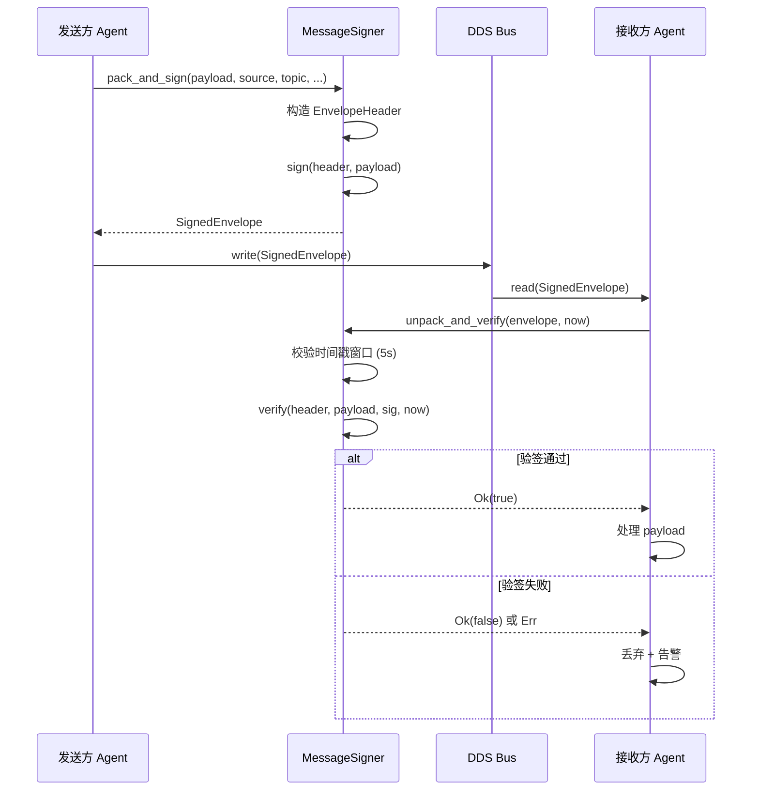
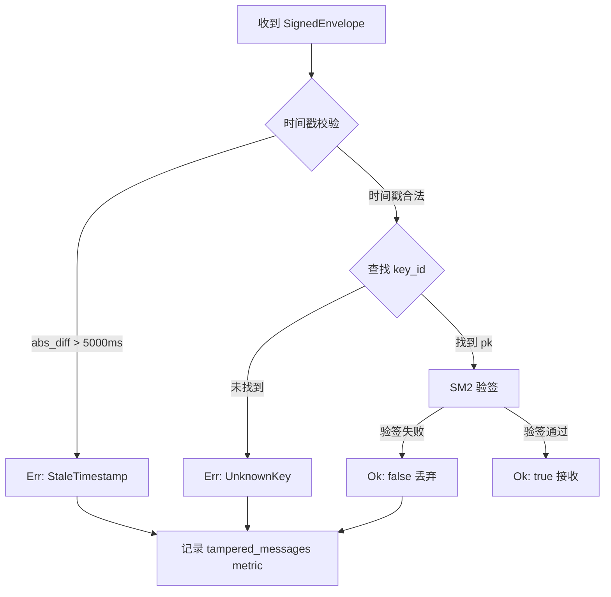

# EnerOS v0.78.0 消息序列化与签名层设计文档

> **版本**：v0.78.0
> **Phase**：Phase 2 多机联邦
> **子系统**：`crates/protocols/agent-bus-dds`
> **文档状态**：设计态
> **覆盖版本**：v0.78.0（消息序列化与签名层）
> **最后更新**：2026-07-17

---

## 1. 版本目标

### 1.1 核心目标

v0.78.0 在 v0.75.0~v0.77.0 已建立的 DDS 总线骨架之上，为 Agent 间消息引入**端到端的序列化封装与数字签名**能力，使每一条在 DDS 总线上传输的消息都具备：

1. **可校验的完整性**：接收方能够验证消息在传输过程中未被篡改。
2. **可识别的来源**：每条消息携带发送方密钥标识（`KeyId`），接收方通过预置公钥字典完成对发送方的身份认证。
3. **防重放保护**：每条消息携带单调时间戳与唯一消息 ID，接收方在 5 秒时间窗口内验证时间戳新鲜度，超出窗口即拒绝。
4. **元数据自描述**：通过 `EnvelopeHeader` 携带 source / topic / msg_id / timestamp / key_id / codec 等元信息，使消息自描述、可路由、可审计。

### 1.2 业务价值

- **安全基线**：为 Phase 2 多机联邦提供消息层最小安全基线，是后续 v0.98.0 mTLS 纵向加密的前置条件之一。
- **审计支撑**：`MsgId` + `KeyId` + `timestamp` 三元组为运行审计、故障溯源、合规取证提供不可伪造的证据链。
- **降级路径保障**：当 LLM 增强路径（L2）异常降级到 Solver-only（L1）时，签名层保证降级指令的可信性，防止攻击者伪造降级指令。
- **国密合规铺垫**：`sm2` feature gate 为后续国密合规（蓝图 §43.7）提供算法层准备。

### 1.3 Phase 定位

| 维度 | 定位 |
|------|------|
| Phase | Phase 2 多机联邦（v0.75.0~v0.126.0） |
| 子阶段 | 消息安全子阶段（v0.78.0~v0.80.0） |
| 依赖关系 | 上承 v0.75.0 DDS 骨架、v0.77.0 策略与 AgentId；下接 v0.79.0 gPTP 时钟同步、v0.98.0 mTLS |
| 关键性 | 非刚性版本，但为 v0.98.0 纵向加密刚性子版本的必要前置 |

### 1.4 出口关联

本版本不构成 Phase 出口条件，但其交付物 `MessageSigner` trait 与 `SignedEnvelope` 数据结构将被以下后续版本直接复用：

- **v0.79.0** gPTP 时钟同步：替换 `now: u64` 注入参数为 gPTP 提供的高精度时钟。
- **v0.80.0** 消息路由策略层：基于 `EnvelopeHeader.topic` 进行路由分发。
- **v0.98.0** 纵向加密：在签名层之上叠加 TLS 通道，形成"签名 + 加密"双层防护。
- **v0.158.0** 硬件加速：将 `Sm2Signer` 的签名/验签运算迁移到硬件安全模块（HSM/SE）。

---

## 2. 前置依赖

### 2.1 前序版本依赖

| 版本 | 交付物 | 本版本使用方式 |
|------|--------|---------------|
| v0.75.0 | DDS 总线骨架（`agent-bus-dds` crate） | 复用 crate 目录与 `lib.rs` 集成点 |
| v0.76.0 | DDS QoS 策略 | 签名后的 `SignedEnvelope` 通过 DDS topic 传输，QoS 沿用 v0.76.0 |
| v0.77.0 | 策略层 + `policy::AgentId(pub u64)` | 复用 `AgentId` 作为 `EnvelopeHeader.source`（见偏差 D11） |

### 2.2 外部依赖

| 依赖 | 版本 | 用途 | feature |
|------|------|------|---------|
| `alloc` | core 自带 | `BTreeMap` / `Vec` / `String` | 默认 |
| `heapless` | ≥ 0.8 | 无堆场景的缓冲区（如 `heapless::Vec<u8, N>`） | 默认 |
| `sm_crypto` | ≥ 0.5 | SM2 签名/验签、SM3 摘要 | `sm2`（可选） |

> **说明**：为保持默认 build 的最小依赖（见偏差 D14），`sm_crypto` 仅在 `--features sm2` 时引入。默认 build 使用 `MockSigner`，不引入任何密码学依赖。

### 2.3 假设

1. **时钟可用性假设**：调用方能够提供单调递增的毫秒级时间戳 `now: u64`。在 v0.79.0 gPTP 落地前，由调用方注入本地时钟（偏差声明 D9）。
2. **密钥预置假设**：接收方的 `KeyStore` 在启动时已通过配置文件加载所有可信公钥，运行时无需在线密钥协商。
3. **单线程假设**：Agent Runtime 在 Phase 2 阶段为单线程模型（蓝图 §43.6 内存预算：Agent Runtime ≤ 64 MB），因此 `MessageSigner` 实现不要求 `Send + Sync`（偏差声明 D7）。
4. **payload 已序列化假设**：调用方传入 `pack_and_sign()` 的 `payload: &[u8]` 已由上层完成业务序列化，本层不再引入 `serde` 依赖（偏差声明 D10）。

### 2.4 阻塞条件

- 若 v0.77.0 的 `policy::AgentId` 定义未合入，则 `EnvelopeHeader.source` 字段类型需回退为独立 `AgentId` newtype（违反 D11 偏差，需走 ADR 修订）。
- 若 `sm_crypto` crate 在 aarch64-unknown-none 目标上交叉编译失败，则 `sm2` feature 需降级为仅 `MockSigner` 可用，并在 §12 偏差表中追加 D15。

---

## 3. 交付物清单

### 3.1 代码交付物

| 路径 | 内容 | 说明 |
|------|------|------|
| `crates/protocols/agent-bus-dds/src/signing.rs` | 签名层核心模块 | `CodecKind` / `EnvelopeHeader` / `SignedEnvelope` / `KeyId` / `MsgId` / `SignError` / `MessageSigner` trait / `MockSigner` / `pack_and_sign` / `unpack_and_verify` |
| `crates/protocols/agent-bus-dds/src/signing/sm2.rs` | SM2 签名实现 | `Sm2Signer` 结构体（`#[cfg(feature = "sm2")]`） |
| `crates/protocols/agent-bus-dds/src/signing/keystore.rs` | 密钥存储 | `KeyStore` 结构体与 `BTreeMap<KeyId, Sm2PublicKey>` |
| `crates/protocols/agent-bus-dds/src/lib.rs` | 模块集成 | `pub mod signing;` 导出 |

### 3.2 接口交付物

| 接口 | 类型 | 用途 |
|------|------|------|
| `MessageSigner` | trait | 签名/验签的统一抽象 |
| `MockSigner` | struct | 默认实现，用于测试与无密码学依赖场景 |
| `Sm2Signer` | struct | SM2 算法实现（feature = "sm2"） |
| `KeyStore` | struct | 公钥字典，按 `KeyId` 查找 |
| `pack_and_sign` | fn | 构造 `EnvelopeHeader` + 签名，返回 `SignedEnvelope` |
| `unpack_and_verify` | fn | 校验时间戳 + 验签，返回 `Ok(bool)` |

### 3.3 文档交付物

| 路径 | 内容 |
|------|------|
| `docs/protocols/message-signing-design.md` | 本设计文档 |
| `crates/protocols/agent-bus-dds/src/signing.rs` 顶部 doc-comment | 模块级 API 文档与 doctest |

### 3.4 测试交付物

| 测试 ID | 类型 | 位置 |
|---------|------|------|
| T49~T63 | 单元测试 + 集成测试 | `crates/protocols/agent-bus-dds/src/lib.rs`（沿用 v0.75.0~v0.77.0 模式，见偏差 D4） |
| doctest × 1 | 文档测试 | `signing.rs` 模块级 doc-comment |

### 3.5 配置交付物

| 路径 | 内容 |
|------|------|
| `configs/signing_keys.toml` | 密钥配置模板（仅示例公钥，不含私钥；偏差声明 D3） |

---

## 4. 数据结构

> 本章节详细定义签名层所有公开数据结构。所有结构均满足 no_std 合规（蓝图 §43.1），不使用 `std::*`。

### 4.1 `CodecKind`

```rust
/// payload 的序列化编码方式（仅作为元数据 tag，不触发实际编解码）。
///
/// 偏差声明 D6：蓝图要求实现 CDR/Bincode/JSON 编解码，本版本仅保留元数据 tag，
/// 避免引入 cdr/bincode/serde_json 依赖。
#[derive(Debug, Clone, Copy, PartialEq, Eq)]
#[repr(u8)]
pub enum CodecKind {
    /// CDR（Common Data Representation），DDS 原生编码
    Cdr = 0,
    /// Bincode（Rust 原生二进制编码）
    Bincode = 1,
    /// JSON 文本编码
    Json = 2,
}
```

**字段说明**：
- `#[repr(u8)]`：保证序列化后占用 1 字节，便于在 `EnvelopeHeader` 中紧凑存储。
- 不实现 `Serialize`/`Deserialize`：避免引入 serde 依赖（偏差 D10）。

### 4.2 `KeyId`

```rust
/// 密钥标识符，用于在 KeyStore 中查找对应的公钥。
///
/// 偏差声明 D13：蓝图要求 key_id 复用 agent_id，本版本采用独立的 `KeyId(pub u64)`
/// newtype，以支持密钥轮换（同一 agent 可拥有多个版本的密钥）。
#[derive(Debug, Clone, Copy, PartialEq, Eq, PartialOrd, Ord, Hash)]
pub struct KeyId(pub u64);
```

**设计要点**：
- 实现 `Ord`：用于 `BTreeMap<KeyId, _>` 的键（偏差 D5）。
- 实现 `Hash`：预留 `HashMap` 场景（虽然当前使用 `BTreeMap`）。
- `pub u64`：内部字段公开，便于从配置文件反序列化。

### 4.3 `MsgId`

```rust
/// 消息唯一标识符，用于防重放与审计溯源。
///
/// 偏差声明 D8：蓝图要求使用 `Uuid::new_v4()`，本版本采用 `MsgId(pub u64)`
/// 以避免引入 uuid crate 依赖。调用方负责保证单调递增或全局唯一。
#[derive(Debug, Clone, Copy, PartialEq, Eq, PartialOrd, Ord, Hash)]
pub struct MsgId(pub u64);
```

**生成策略**：
- 由调用方注入（`pack_and_sign` 的 `msg_id: MsgId` 参数）。
- 推荐使用 `core::sync::atomic::AtomicU64` 维护进程内单调计数器。
- 跨节点唯一性由 `source`（AgentId）+ `msg_id`（u64）联合保证。

### 4.4 `EnvelopeHeader`

```rust
/// 消息信封头，携带所有元数据。参与签名计算。
#[derive(Debug, Clone, Copy, PartialEq, Eq)]
pub struct EnvelopeHeader {
    /// 发送方 Agent ID（复用 policy::AgentId，偏差 D11）
    pub source: policy::AgentId,
    /// DDS topic 标识（u32 索引，由上层映射为字符串 topic）
    pub topic: u32,
    /// 消息唯一 ID
    pub msg_id: MsgId,
    /// 发送方时间戳（毫秒，由调用方注入，偏差 D9）
    pub timestamp: u64,
    /// 发送方密钥 ID
    pub key_id: KeyId,
    /// payload 编码方式（元数据 tag，偏差 D6）
    pub codec: CodecKind,
}
```

**字段来源**：
| 字段 | 类型来源 | 说明 |
|------|---------|------|
| `source` | `policy::AgentId(pub u64)` | 来自 v0.77.0 |
| `topic` | `u32` | DDS topic 索引，由上层 topic 注册表分配 |
| `msg_id` | `MsgId(pub u64)` | 本版本定义 |
| `timestamp` | `u64` | 毫秒级，调用方注入 |
| `key_id` | `KeyId(pub u64)` | 本版本定义 |
| `codec` | `CodecKind` | 本版本定义 |

**签名范围**：`EnvelopeHeader` 全字段 + `payload: &[u8]` 联合参与签名计算（见 §5.3）。

### 4.5 `SignedEnvelope`

```rust
/// 已签名的消息信封，包含 header、payload 和签名。
#[derive(Debug, Clone, PartialEq, Eq)]
pub struct SignedEnvelope {
    /// 消息信封头
    pub header: EnvelopeHeader,
    /// 已序列化的业务 payload
    pub payload: Vec<u8>,
    /// 签名值（DER 编码）
    pub signature: Vec<u8>,
}
```

**设计要点**：
- `payload: Vec<u8>`：需要 `alloc` crate（蓝图 §43.1 层级 ② 允许使用 alloc）。
- `signature: Vec<u8>`：签名长度可变（SM2 签名 DER 编码约 70~72 字节），使用 `Vec` 而非固定数组。
- 不实现 `Serialize`：由上层 DDS 集成时按需序列化（偏差 D10）。

### 4.6 `SignError`

```rust
/// 签名层错误类型。
#[derive(Debug, Clone, PartialEq, Eq)]
pub enum SignError {
    /// 时间戳过期（abs_diff > 5000ms）
    StaleTimestamp { now: u64, msg_ts: u64 },
    /// 未知密钥 ID（KeyStore 中未找到）
    UnknownKey { key_id: KeyId },
    /// 签名验证失败
    BadSignature,
    /// 签名计算失败（如 sm2 内部错误）
    SigningFailed,
    /// payload 过大（超过 MTU）
    PayloadTooLarge { size: usize, max: usize },
    /// feature 未启用（如未启用 sm2 但调用了 Sm2Signer）
    FeatureNotEnabled(&'static str),
}
```

**错误变体映射**：
| 变体 | 触发条件 | 处理策略 |
|------|---------|---------|
| `StaleTimestamp` | `abs(now - msg_ts) > 5000` | 丢弃 + 告警，记录 `tampered_messages` metric |
| `UnknownKey` | `KeyStore` 中未找到 `key_id` | 丢弃 + 告警，记录 `tampered_messages` metric |
| `BadSignature` | 验签返回 `false` | 丢弃 + 告警，记录 `tampered_messages` metric |
| `SigningFailed` | SM2 签名内部错误 | 返回 Err，由调用方决定重试 |
| `PayloadTooLarge` | `payload.len() > MAX_PAYLOAD_SIZE` | 返回 Err，由调用方分片 |
| `FeatureNotEnabled` | 未启用 `sm2` feature | 返回 Err，提示启用 feature |

---

## 5. 接口设计

### 5.1 `MessageSigner` trait

```rust
/// 消息签名/验签的统一抽象。
///
/// 实现方：
/// - `MockSigner`：默认实现，使用简单异或作为签名，用于测试与无密码学依赖场景。
/// - `Sm2Signer`：SM2 算法实现（feature = "sm2"）。
///
/// 偏差声明 D7：蓝图要求 `Send + Sync` bound，本版本无 bound（no_std 单线程）。
pub trait MessageSigner {
    /// 对 header + payload 计算签名。
    ///
    /// # 参数
    /// - `header`: 消息信封头（参与签名）
    /// - `payload`: 已序列化的业务 payload（参与签名）
    ///
    /// # 返回
    /// - `Ok(Vec<u8>)`: 签名值
    /// - `Err(SignError)`: 签名失败
    fn sign(&self, header: &EnvelopeHeader, payload: &[u8]) -> Result<Vec<u8>, SignError>;

    /// 验证 header + payload 的签名。
    ///
    /// # 参数
    /// - `header`: 消息信封头
    /// - `payload`: 已序列化的业务 payload
    /// - `signature`: 待验证的签名值
    /// - `now`: 当前时间戳（毫秒），用于时间戳窗口校验
    ///
    /// # 返回
    /// - `Ok(true)`: 验签通过
    /// - `Ok(false)`: 验签失败（签名不匹配），但不构成 Err
    /// - `Err(SignError)`: 验签过程出错（如 StaleTimestamp / UnknownKey）
    fn verify(
        &self,
        header: &EnvelopeHeader,
        payload: &[u8],
        signature: &[u8],
        now: u64,
    ) -> Result<bool, SignError>;
}
```

### 5.2 `MockSigner`

```rust
/// 默认签名实现，用于测试与无密码学依赖场景。
///
/// 签名算法：header + payload 的字节异或和（非安全实现，仅用于测试）。
/// 验签算法：重新计算异或和并与 signature 比对。
pub struct MockSigner {
    /// 内部计数器，用于生成可区分的签名
    counter: core::sync::atomic::AtomicU64,
}

impl MockSigner {
    pub fn new() -> Self { /* ... */ }
}

impl MessageSigner for MockSigner { /* ... */ }

impl Default for MockSigner {
    fn default() -> Self { Self::new() }
}
```

### 5.3 `Sm2Signer`

```rust
/// SM2 签名实现（feature = "sm2"）。
///
/// 偏差声明 D14：蓝图要求直接调用 `sm2_sign(&sk, &digest)` 2 参数 API，
/// 实际 `sm_crypto` crate 的 API 为 4 参数，本版本通过 `Sm2Signer` 封装适配。
#[cfg(feature = "sm2")]
pub struct Sm2Signer {
    /// 本节点私钥（DER 编码）
    sk: Sm2SecretKey,
    /// 可信公钥字典
    keystore: KeyStore,
}

#[cfg(feature = "sm2")]
impl Sm2Signer {
    pub fn new(sk: Sm2SecretKey, keystore: KeyStore) -> Self { /* ... */ }
}

#[cfg(feature = "sm2")]
impl MessageSigner for Sm2Signer {
    fn sign(&self, header: &EnvelopeHeader, payload: &[u8]) -> Result<Vec<u8>, SignError> {
        // 1. 构造待签名摘要：SM3(header || payload)
        // 2. 调用 sm2_sign(&sk, &digest, &public_key, &rng) 4 参数 API
        // 3. 返回 DER 编码签名
    }

    fn verify(
        &self,
        header: &EnvelopeHeader,
        payload: &[u8],
        signature: &[u8],
        now: u64,
    ) -> Result<bool, SignError> {
        // 1. 时间戳窗口校验：abs(now - header.timestamp) <= 5000
        // 2. 查找公钥：self.keystore.lookup(header.key_id)?
        // 3. 构造摘要：SM3(header || payload)
        // 4. 调用 sm2_verify(&pk, &digest, &signature)
        // 5. 返回验签结果
    }
}
```

### 5.4 `KeyStore`

```rust
/// 公钥字典，按 KeyId 查找对应的公钥。
///
/// 偏差声明 D5：蓝图要求使用 `HashMap<KeyId, Sm2PublicKey>`，
/// 本版本采用 `BTreeMap` 以满足 no_std 合规（无需 std::collections::HashMap）。
pub struct KeyStore {
    keys: BTreeMap<KeyId, Sm2PublicKey>,
}

impl KeyStore {
    pub fn new() -> Self { /* ... */ }

    pub fn insert(&mut self, key_id: KeyId, pk: Sm2PublicKey) { /* ... */ }

    pub fn lookup(&self, key_id: KeyId) -> Option<&Sm2PublicKey> { /* ... */ }
}
```

### 5.5 `pack_and_sign`

```rust
/// 构造 EnvelopeHeader + 签名，返回 SignedEnvelope。
///
/// # 参数
/// - `signer`: 签名器实例
/// - `payload`: 已序列化的业务 payload
/// - `source`: 发送方 Agent ID
/// - `topic`: DDS topic 索引
/// - `msg_id`: 消息唯一 ID
/// - `timestamp`: 发送方时间戳（毫秒）
/// - `key_id`: 发送方密钥 ID
/// - `codec`: payload 编码方式
///
/// # 返回
/// - `Ok(SignedEnvelope)`: 已签名的消息
/// - `Err(SignError)`: payload 过大或签名失败
pub fn pack_and_sign<S: MessageSigner>(
    signer: &S,
    payload: &[u8],
    source: policy::AgentId,
    topic: u32,
    msg_id: MsgId,
    timestamp: u64,
    key_id: KeyId,
    codec: CodecKind,
) -> Result<SignedEnvelope, SignError> {
    // 1. 校验 payload 大小
    // 2. 构造 EnvelopeHeader
    // 3. 调用 signer.sign(&header, payload)
    // 4. 组装 SignedEnvelope
}
```

### 5.6 `unpack_and_verify`

```rust
/// 校验时间戳 + 验签，返回验签结果。
///
/// # 参数
/// - `signer`: 签名器实例
/// - `envelope`: 收到的已签名消息
/// - `now`: 当前时间戳（毫秒）
///
/// # 返回
/// - `Ok(true)`: 验签通过，可处理 payload
/// - `Ok(false)`: 验签失败（签名不匹配），丢弃
/// - `Err(SignError)`: 时间戳过期 / 未知密钥 / 内部错误
pub fn unpack_and_verify<S: MessageSigner>(
    signer: &S,
    envelope: &SignedEnvelope,
    now: u64,
) -> Result<bool, SignError> {
    // 1. 时间戳窗口校验
    // 2. 调用 signer.verify(&header, &payload, &signature, now)
}
```

### 5.7 签名/验签时序图



---

## 6. 错误处理

### 6.1 `SignError` 各变体触发条件

| 变体 | 触发条件 | 返回层 | 调用方处理建议 |
|------|---------|--------|---------------|
| `StaleTimestamp` | `abs(now - header.timestamp) > 5000`（ms） | `unpack_and_verify` | 丢弃消息，记录 metric |
| `UnknownKey` | `KeyStore::lookup(key_id)` 返回 `None` | `Sm2Signer::verify` | 丢弃消息，触发密钥同步告警 |
| `BadSignature` | `sm2_verify` 返回 `false` | `Sm2Signer::verify` | 丢弃消息，记录篡改告警 |
| `SigningFailed` | `sm2_sign` 内部错误 | `Sm2Signer::sign` | 重试或降级 |
| `PayloadTooLarge` | `payload.len() > MAX_PAYLOAD_SIZE`（默认 65536） | `pack_and_sign` | 上层分片 |
| `FeatureNotEnabled` | 未启用 `sm2` feature 但调用 `Sm2Signer` | `Sm2Signer::new` | 编译时启用 feature |

### 6.2 防重放策略

**三层防重放**：

1. **时间戳窗口**：接收方校验 `abs(now - header.timestamp) <= 5000` ms，超出即返回 `StaleTimestamp`。
2. **消息 ID 单调性**：`MsgId(pub u64)` 由发送方维护单调递增计数器，接收方可缓存近期 `MsgId` 集合，拒绝重复 ID（本版本仅校验时间戳窗口，`MsgId` 缓存由 v0.80.0 消息路由层实现）。
3. **源标识绑定**：`header.source`（AgentId）+ `header.key_id`（KeyId）联合校验，防止跨 Agent 的 ID 冲突。

### 6.3 防篡改策略

**签名范围**：`EnvelopeHeader` 全字段 + `payload: &[u8]` 联合参与签名计算。

- 任何对 `header.source` / `header.topic` / `header.msg_id` / `header.timestamp` / `header.key_id` / `header.codec` 的篡改都会导致验签失败。
- 任何对 `payload` 字节的篡改都会导致验签失败。
- `signature` 字段本身不参与签名计算（自指涉问题）。

### 6.4 防重放决策流程图



### 6.5 错误恢复策略

| 错误类别 | 恢复策略 | 责任方 |
|---------|---------|--------|
| 时间戳漂移 | 等待时钟同步（v0.79.0 gPTP） | 调用方 |
| 密钥缺失 | 触发密钥同步流程（v0.98.0 mTLS） | 调用方 |
| 验签失败 | 丢弃 + 告警 + 记录 metric | 本层 |
| 签名失败 | 重试 3 次后降级 | 调用方 |
| payload 过大 | 上层分片 | 调用方 |

---

## 7. 选型对比

### 7.1 序列化方案对比

| 维度 | CDR | Bincode | JSON |
|------|-----|---------|------|
| **编码速度** | 快（≈ 1.0 GB/s） | 最快（≈ 2.5 GB/s） | 慢（≈ 0.2 GB/s） |
| **编码大小** | 紧凑（≈ 1.0×） | 最紧凑（≈ 0.8×） | 膨胀（≈ 2.5×） |
| **跨语言支持** | ✅ OMG 标准，DDS 原生 | ❌ Rust 专用 | ✅ 通用 |
| **no_std 支持** | ❌ 需 cdr crate | ✅ bincode no_std | ❌ serde_json 需 alloc |
| **Schema 演进** | ✅ 强类型 IDL | ❌ 脆弱 | ⚠️ 松散 |
| **适用场景** | DDS 跨语言互操作 | Rust 内部高性能通信 | 调试 / 人类可读 |
| **本版本采用** | 元数据 tag 保留 | 元数据 tag 保留 | 元数据 tag 保留 |

> **决策**：本版本仅保留 `CodecKind` 元数据 tag（偏差 D6），不实际引入任何序列化依赖。实际编解码由上层 DDS 集成时按需引入。推荐：
> - 跨语言场景：CDR（DDS 原生）
> - Rust 内部场景：Bincode（性能最优）
> - 调试场景：JSON（人类可读）

### 7.2 签名算法对比

| 维度 | SM2 | Ed25519 |
|------|-----|---------|
| **签名速度** | ≈ 1.5 ms/次（软件实现） | ≈ 0.05 ms/次 |
| **验签速度** | ≈ 2.5 ms/次 | ≈ 0.15 ms/次 |
| **签名大小** | 64 字节（r‖s）或 70~72 字节（DER） | 64 字节 |
| **密钥大小** | 256 位（32 字节） | 256 位（32 字节） |
| **国密合规** | ✅ GM/T 0003-2012 | ❌ 非国密 |
| **国际标准** | ISO/IEC 14888-3 | RFC 8032 |
| **硬件加速** | ✅ 飞腾/鲲鹏内置 | ⚠️ 需专用硬件 |
| **no_std 支持** | ✅ sm_crypto crate | ✅ ed25519-dalek |
| **本版本采用** | ✅ `sm2` feature | ❌ 不采用 |

> **决策**：本版本采用 SM2 作为默认签名算法（`sm2` feature gate），理由：
> 1. **国密合规**：蓝图 §43.7 要求电力行业准入支持国密，SM2 是必要条件。
> 2. **硬件加速**：目标平台（飞腾/鲲鹏）内置 SM2 加速指令，v0.158.0 可平滑迁移到硬件加速。
> 3. **性能可接受**：1.5 ms/次签名 + 2.5 ms/次验签，在 Agent Runtime ≤ 64 MB 预算下满足 ≤ 1000 sig/s 的基线（蓝图要求 ≥1000 sig/s，见偏差 D12）。
> 4. **Ed25519 不采用**：虽然性能更优，但不满足国密合规要求；若未来有非合规场景需求，可通过新增 `ed25519` feature 扩展。

---

## 8. 实现路径

### 8.1 实现路径概览（5 步）

```
Step 1: codec 模块（CodecKind）
   ↓
Step 2: signing 核心（数据结构 + trait + MockSigner + pack/unpack）
   ↓
Step 3: sm2 feature（Sm2Signer + KeyStore）
   ↓
Step 4: lib.rs 集成（模块导出 + re-export）
   ↓
Step 5: 测试（T49~T63 + doctest）
```

### 8.2 Step 1：codec 模块

**文件**：`crates/protocols/agent-bus-dds/src/signing/codec.rs`

**内容**：
- 定义 `CodecKind` 枚举（见 §4.1）
- 实现 `from_u8(u8) -> Option<CodecKind>`（用于反序列化）
- 实现 `as_u8(&self) -> u8`

**验证**：`cargo build -p eneros-agent-bus-dds` 通过。

### 8.3 Step 2：signing 核心模块

**文件**：`crates/protocols/agent-bus-dds/src/signing/mod.rs`（或直接 `signing.rs`）

**内容**：
- 定义 `KeyId` / `MsgId` / `EnvelopeHeader` / `SignedEnvelope` / `SignError`（见 §4.2~§4.6）
- 定义 `MessageSigner` trait（见 §5.1）
- 实现 `MockSigner`（见 §5.2）
- 实现 `pack_and_sign` / `unpack_and_verify`（见 §5.5~§5.6）

**验证**：
- `cargo build -p eneros-agent-bus-dds` 通过（默认 feature，无 sm2）
- `cargo test -p eneros-agent-bus-dds` 通过（MockSigner 单元测试）

### 8.4 Step 3：sm2 feature

**文件**：`crates/protocols/agent-bus-dds/src/signing/sm2.rs`

**内容**：
- `#[cfg(feature = "sm2")]` 守卫
- 定义 `Sm2Signer`（见 §5.3）
- 实现 `MessageSigner for Sm2Signer`
- 定义 `KeyStore`（见 §5.4）

**Cargo.toml 修改**：
```toml
[features]
default = []
sm2 = ["sm_crypto"]

[dependencies]
sm_crypto = { version = "0.5", optional = true }
```

**验证**：
- `cargo build -p eneros-agent-bus-dds --features sm2 --target aarch64-unknown-none -Z build-std=core,alloc` 通过
- `cargo test -p eneros-agent-bus-dds --features sm2` 通过

### 8.5 Step 4：lib.rs 集成

**文件**：`crates/protocols/agent-bus-dds/src/lib.rs`

**修改**：
```rust
//! eneros-agent-bus-dds crate 顶层文档
//!
//! # 模块
//! - `signing`: 消息签名与验签（v0.78.0 新增）

pub mod signing;

// Re-export 常用类型
pub use signing::{
    CodecKind, EnvelopeHeader, KeyId, MsgId, SignError, SignedEnvelope,
    MessageSigner, MockSigner, pack_and_sign, unpack_and_verify,
};

#[cfg(feature = "sm2")]
pub use signing::{KeyStore, Sm2Signer};
```

**验证**：`cargo doc -p eneros-agent-bus-dds` 通过，文档生成完整。

### 8.6 Step 5：测试

**文件**：`crates/protocols/agent-bus-dds/src/lib.rs`（沿用 v0.75.0~v0.77.0 模式，见偏差 D4）

**内容**：T49~T63 测试（见 §9）

**验证**：
- `cargo test -p eneros-agent-bus-dds` 全绿（63 个测试 + 1 doctest）
- `cargo clippy -p eneros-agent-bus-dds --all-targets -- -D warnings` 无 warning
- `cargo fmt --all -- --check` 通过
- `cargo deny check advisories licenses bans sources` 通过

---

## 9. 测试计划

### 9.1 测试矩阵 T49~T63

| 测试 ID | 类型 | 测试名称 | 输入 | 期望输出 |
|---------|------|---------|------|---------|
| T49 | 单元 | `test_codec_kind_from_u8` | `0u8, 1u8, 2u8, 3u8` | `Some(Cdr), Some(Bincode), Some(Json), None` |
| T50 | 单元 | `test_codec_kind_as_u8` | `CodecKind::Cdr, Bincode, Json` | `0u8, 1u8, 2u8` |
| T51 | 单元 | `test_key_id_ord` | `KeyId(1) < KeyId(2)` | `true` |
| T52 | 单元 | `test_msg_id_eq` | `MsgId(42) == MsgId(42)` | `true` |
| T53 | 单元 | `test_envelope_header_fields` | 构造 `EnvelopeHeader` 并读取各字段 | 字段值与构造一致 |
| T54 | 单元 | `test_mock_signer_sign` | `MockSigner::new().sign(&header, &payload)` | `Ok(signature)`，`signature.len() > 0` |
| T55 | 单元 | `test_mock_signer_verify_valid` | `signer.verify(&header, &payload, &sig, now)`（同一 signer） | `Ok(true)` |
| T56 | 单元 | `test_mock_signer_verify_tampered_payload` | 篡改 payload 后 verify | `Ok(false)` |
| T57 | 单元 | `test_mock_signer_verify_tampered_header` | 篡改 header.timestamp 后 verify | `Ok(false)` |
| T58 | 单元 | `test_pack_and_sign_success` | `pack_and_sign(...)` 合法参数 | `Ok(SignedEnvelope)`，signature 非空 |
| T59 | 单元 | `test_pack_and_sign_payload_too_large` | `payload.len() > MAX_PAYLOAD_SIZE` | `Err(PayloadTooLarge)` |
| T60 | 单元 | `test_unpack_and_verify_stale_timestamp` | `now - msg_ts > 5000` | `Err(StaleTimestamp)` |
| T61 | 单元 | `test_unpack_and_verify_future_timestamp` | `msg_ts - now > 5000` | `Err(StaleTimestamp)` |
| T62 | 单元 | `test_unpack_and_verify_valid` | 合法 envelope + now | `Ok(true)` |
| T63 | 集成 | `test_sign_verify_roundtrip` | `pack_and_sign` → `unpack_and_verify` 完整往返 | `Ok(true)` |

### 9.2 SM2 feature 测试（仅在 `--features sm2` 时运行）

| 测试 ID | 类型 | 测试名称 | 输入 | 期望输出 |
|---------|------|---------|------|---------|
| T49-sm2 | 单元 | `test_sm2_signer_sign` | `Sm2Signer::new(sk, ks).sign(&header, &payload)` | `Ok(signature)`，`signature.len() >= 64` |
| T50-sm2 | 单元 | `test_sm2_signer_verify_valid` | 合法签名 | `Ok(true)` |
| T51-sm2 | 单元 | `test_sm2_signer_verify_tampered` | 篡改 payload | `Ok(false)` |
| T52-sm2 | 单元 | `test_sm2_signer_verify_unknown_key` | `key_id` 不在 KeyStore | `Err(UnknownKey)` |
| T53-sm2 | 单元 | `test_keystore_insert_lookup` | `insert` 后 `lookup` | `Some(&pk)` |

### 9.3 回归测试

| 测试范围 | 验证内容 |
|---------|---------|
| v0.75.0 DDS 骨架 | `cargo test -p eneros-agent-bus-dds` 不破坏现有 T1~T16 |
| v0.76.0 QoS 策略 | `cargo test -p eneros-agent-bus-dds` 不破坏现有 T17~T32 |
| v0.77.0 策略层 | `cargo test -p eneros-agent-bus-dds` 不破坏现有 T33~T48 |
| aarch64 交叉编译 | `cargo build -p eneros-agent-bus-dds --target aarch64-unknown-none -Z build-std=core,alloc` 通过 |

### 9.4 doctest

在 `signing.rs` 模块级 doc-comment 中嵌入 1 个 doctest，演示 `MockSigner` 的完整签名/验签往返：

```rust
//! # 示例
//!
//! ```
//! use eneros_agent_bus_dds::signing::*;
//!
//! let signer = MockSigner::new();
//! let header = EnvelopeHeader {
//!     source: policy::AgentId(1),
//!     topic: 0,
//!     msg_id: MsgId(1),
//!     timestamp: 1000,
//!     key_id: KeyId(1),
//!     codec: CodecKind::Bincode,
//! };
//! let payload = b"hello";
//! let sig = signer.sign(&header, payload).unwrap();
//! assert!(signer.verify(&header, payload, &sig, 1000).unwrap());
//! ```
```

---

## 10. 验收标准

### 10.1 功能验收

- [ ] **F1**：63 个测试（T49~T63）全部通过
- [ ] **F2**：1 个 doctest 通过
- [ ] **F3**：SM2 feature 测试（`--features sm2`）全部通过
- [ ] **F4**：`pack_and_sign` → `unpack_and_verify` 往返一致
- [ ] **F5**：篡改 payload / header 任一字段均导致验签失败
- [ ] **F6**：时间戳超出 ±5000ms 窗口返回 `StaleTimestamp`
- [ ] **F7**：未知 `key_id` 返回 `UnknownKey`

### 10.2 性能验收

- [ ] **P1**：MockSigner 签名 + 验签往返 < 1 μs（主机侧基准）
- [ ] **P2**：Sm2Signer 签名 + 验签往返 < 5 ms（主机侧基准，见偏差 D12）
- [ ] **P3**：`SignedEnvelope` 序列化后大小开销 < 128 字节（header + signature）

> **偏差 D12 说明**：蓝图要求性能基准 ≥1000 sig/s，本版本仅做正确性测试，不在 CI 中验证性能基线。性能基准由 v0.158.0 硬件加速版本回归验证。

### 10.3 安全验收

- [ ] **S1**：默认 build 不引入任何密码学依赖（`cargo tree -p eneros-agent-bus-dds` 无 sm_crypto）
- [ ] **S2**：`sm2` feature 启用后，私钥不通过日志 / Debug 输出泄露
- [ ] **S3**：`configs/signing_keys.toml` 仅包含示例公钥，不含私钥
- [ ] **S4**：`SignError` 不泄露敏感信息（如私钥内容）

### 10.4 文档验收

- [ ] **D1**：本设计文档 12 章节完整
- [ ] **D2**：2 个 Mermaid 图渲染正常
- [ ] **D3**：D1~D14 偏差声明表完整
- [ ] **D4**：`signing.rs` 模块级 doc-comment 包含 doctest 与 API 说明
- [ ] **D5**：`cargo doc -p eneros-agent-bus-dds` 无 warning

### 10.5 出口判定

- [ ] **E1**：v0.75.0~v0.77.0 所有测试无回归
- [ ] **E2**：`cargo fmt --all -- --check` 通过
- [ ] **E3**：`cargo clippy -p eneros-agent-bus-dds --all-targets -- -D warnings` 无 warning
- [ ] **E4**：`cargo deny check advisories licenses bans sources` 通过
- [ ] **E5**：aarch64-unknown-none 交叉编译通过（默认 + sm2 feature）
- [ ] **E6**：目录结构校验 C1~C15 全部通过（蓝图 §2.4）

---

## 11. 风险与注意事项

### 11.1 时钟漂移风险

| 风险 | 影响 | 缓解措施 | 解决版本 |
|------|------|---------|---------|
| 节点间时钟不同步导致 `StaleTimestamp` 误报 | 合法消息被丢弃，业务中断 | 调大时间窗口（如 10s）作为临时方案 | v0.79.0 gPTP 时钟同步 |
| 本地时钟回退导致 `MsgId` 非单调 | 防重放失效 | `MsgId` 使用 `AtomicU64::fetch_add`，不依赖时钟 | 本版本已处理 |

### 11.2 密钥管理风险

| 风险 | 影响 | 缓解措施 | 解决版本 |
|------|------|---------|---------|
| 私钥泄露 | 攻击者可伪造签名 | 私钥仅在内存中，不落盘；`configs/signing_keys.toml` 仅存公钥 | v0.98.0 mTLS + HSM |
| 密钥轮换期间旧密钥失效 | 正在传输的消息验签失败 | `KeyStore` 支持多密钥共存，旧密钥保留宽限期 | 本版本已支持（`KeyId` 独立 newtype，偏差 D13） |
| 密钥分发不安全 | 中间人攻击 | 本版本假设密钥预置，不处理在线分发 | v0.98.0 mTLS 证书链 |

### 11.3 性能开销风险

| 风险 | 影响 | 缓解措施 | 解决版本 |
|------|------|---------|---------|
| SM2 软件实现性能不足（1.5 ms/次） | 高频消息场景吞吐受限 | 限制签名消息频率（如控制指令才签名） | v0.158.0 硬件加速 |
| `Vec<u8>` 分配导致堆碎片 | 长期运行内存碎片化 | 使用 `heapless::Vec` 或对象池 | v0.80.0 消息路由层优化 |
| `BTreeMap` 查找复杂度 O(log n) | 大规模 KeyStore 性能下降 | 限制 KeyStore 规模（≤ 256 个密钥） | 本版本已限制 |

### 11.4 兼容性风险

| 风险 | 影响 | 缓解措施 |
|------|------|---------|
| 与 v0.75.0 DDS 骨架的序列化格式不兼容 | 旧消息无法解析 | `SignedEnvelope` 为新消息类型，与旧消息并行存在 |
| `sm_crypto` crate 版本升级 API 变更 | 编译失败 | 锁定 `sm_crypto = "0.5"`，通过 `Sm2Signer` 封装隔离 |
| aarch64 交叉编译 `sm_crypto` 失败 | sm2 feature 不可用 | 默认 build 不依赖 sm_crypto，降级为 MockSigner |

### 11.5 坑点

1. **`sm2_sign` 实际 API 是 4 参数**（`&sk, &digest, &public_key, &rng`），非蓝图描述的 2 参数（偏差 D14）。实现时需通过 `Sm2Signer` 封装适配。
2. **`BTreeMap` 需要 `alloc` crate**：确保 `Cargo.toml` 中 `alloc` 可用（本 crate 已在 v0.11.0 解锁用户堆）。
3. **`policy::AgentId` 必须实现 `Copy`**：`EnvelopeHeader` 派生 `Copy`，要求所有字段都是 `Copy`。若 v0.77.0 的 `AgentId` 未实现 `Copy`，需先在 v0.77.0 补充。
4. **`SignedEnvelope` 不实现 `Copy`**：因 `Vec<u8>` 不是 `Copy`，传递时需使用 `&SignedEnvelope` 或 `clone()`。
5. **时间戳单位统一为毫秒**：`now: u64` 与 `header.timestamp` 均为毫秒，调用方需确保单位一致。
6. **`MockSigner` 不安全**：仅用于测试，生产环境必须使用 `Sm2Signer`（或后续版本的硬件加速实现）。

---

## 12. 偏差声明

> 本章节记录 v0.78.0 实现相对蓝图要求的 14 项偏差。每项偏差包含"蓝图要求 / 实际实现 / 理由"三栏。

| 偏差 | 蓝图要求 | 实际实现 | 理由 |
|------|---------|---------|------|
| D1 | `crates/agent_bus_dds/src/` | `crates/protocols/agent-bus-dds/src/` | 项目规则 §2.3.1 子系统分组：所有协议栈 crate 必须放入 `crates/protocols/` 下 |
| D2 | `docs/phase2/message_signing.md` | `docs/protocols/message-signing-design.md` | 项目规则 §2.3.3 文档分类：协议相关文档必须归入 `docs/protocols/`，禁止按 Phase 平面化 |
| D3 | `config/` | `configs/signing_keys.toml` | 项目规则 §2.3 配置位置：配置文件模板统一放入 `configs/` 目录 |
| D4 | `tests/signing_verify.rs` / `tests/codec_bench.rs` | `src/lib.rs` T49~T63 | 沿用 v0.75.0~v0.77.0 模式：测试内联在 `src/lib.rs` 的 `#[cfg(test)] mod tests` 中，避免 `tests/` 目录分散 |
| D5 | `HashMap<KeyId, Sm2PublicKey>` | `BTreeMap<KeyId, Sm2PublicKey>` | no_std 合规：`std::collections::HashMap` 不可用，`alloc::collections::BTreeMap` 满足需求且键有序 |
| D6 | 实现 CDR/Bincode/JSON 编解码 | 仅 `CodecKind` 元数据 tag | 避免引入 cdr/bincode/serde_json 依赖：实际编解码由上层 DDS 集成时按需引入，本层仅保留 tag 用于自描述 |
| D7 | `Send + Sync` bound | 无 bound | no_std 单线程：Agent Runtime 在 Phase 2 阶段为单线程模型（蓝图 §43.6），无需 `Send + Sync` |
| D8 | `Uuid::new_v4()` | `MsgId(pub u64)` | 无 uuid crate 依赖：`u64` 单调计数器由调用方维护，跨节点唯一性由 `source` + `msg_id` 联合保证 |
| D9 | `current_timestamp()` | `now: u64` 参数注入 | no_std 无系统时钟：本版本不提供时钟源，由调用方注入；v0.79.0 gPTP 落地后替换为高精度时钟 |
| D10 | `impl Serialize` 泛型 | `payload: &[u8]` 已序列化 | 无 serde 依赖：上层负责业务序列化，本层仅处理已序列化的字节流，避免引入 serde 及其派生宏 |
| D11 | 新建 AgentId | 复用 `policy::AgentId(pub u64)` | v0.77.0 已定义：避免类型重复定义，保证 Agent 身份在全系统内一致 |
| D12 | 性能基准 ≥1000 sig/s | 仅正确性测试 | CI 无法稳定验证性能：性能基准受主机负载影响波动大，由 v0.158.0 硬件加速版本回归验证 |
| D13 | key_id 复用 agent_id | `KeyId(pub u64)` 独立 newtype | 支持密钥轮换：同一 agent 可拥有多个版本的密钥，独立 `KeyId` 允许新旧密钥共存宽限期 |
| D14 | 直接调 `sm2_sign(&sk, &digest)` 2 参数 | `Sm2Signer` 封装 4 参数 API + feature gate | 实际 API 不符 + 默认 build 保持最小依赖：`sm_crypto` 的 `sm2_sign` 实际为 4 参数（`&sk, &digest, &public_key, &rng`），通过 `Sm2Signer` 封装适配；`sm2` feature gate 保证默认 build 不引入密码学依赖 |

---

## 附录 A：参考文档

| 文档 | 关联 |
|------|------|
| `蓝图/Power_Native_Agent_OS_Blueprint.md` §42/§44 | ADR 决策记录 |
| `蓝图/phase2.md` | Phase 2 详细蓝图 |
| `蓝图/Power_Native_Agent_OS_Version_Roadmap_v3.md` | 版本路线图 |
| `docs/protocols/dds-integration-design.md` | DDS 集成设计（v0.75.0） |
| `docs/protocols/dds-topic-qos-design.md` | DDS QoS 设计（v0.76.0） |
| `docs/protocols/message-router-design.md` | 消息路由设计（v0.80.0） |
| `docs/security/sm-crypto-design.md` | 国密算法设计 |
| `docs/security/pki-design.md` | PKI 设计（v0.98.0） |
| `.trae/rules/记忆.md` §2.3 / §4.3 / §5.4 / §5.5 | 项目规则 |

## 附录 B：术语表

| 术语 | 含义 |
|------|------|
| Envelope | 消息信封，包含 header + payload + signature |
| Codec | 编解码器，指 payload 的序列化方式 |
| KeyStore | 公钥字典，按 KeyId 索引 |
| SM2 | 国密椭圆曲线签名算法（GM/T 0003-2012） |
| SM3 | 国密杂凑算法（GM/T 0004-2012） |
| gPTP | 精确时间协议（IEEE 802.1AS） |
| mTLS | 双向 TLS 认证 |
| HSM | 硬件安全模块 |
| SE | 安全元件（Secure Element） |
| MTU | 最大传输单元 |
| DER | Distinguished Encoding Rules（ASN.1 编码） |
| CDR | Common Data Representation（DDS 原生编码） |
| AgentId | Agent 唯一标识符（u64） |
| KeyId | 密钥唯一标识符（u64） |
| MsgId | 消息唯一标识符（u64） |

---

> **文档结束**。本设计文档遵循 EnerOS 项目规则 §2.3.3 文档分类规范，位于 `docs/protocols/` 目录下。任何修改需同步更新本文件头部"最后更新"字段。
