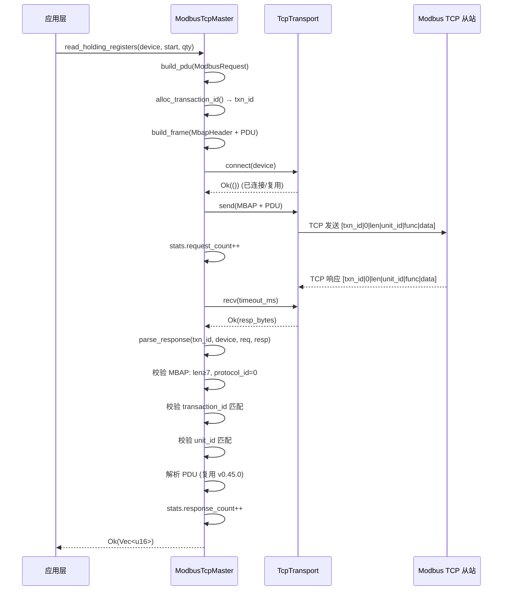
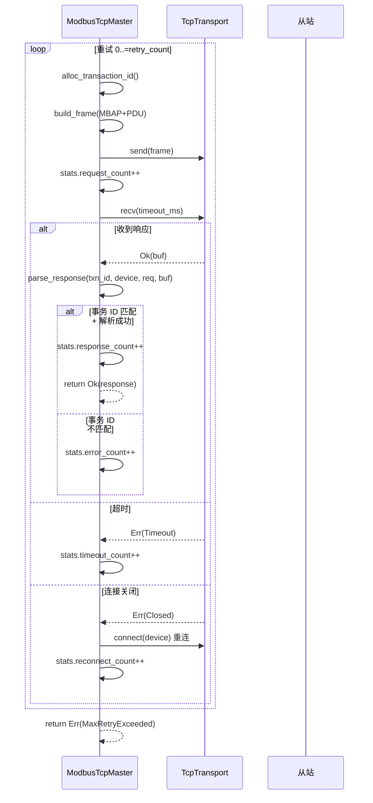
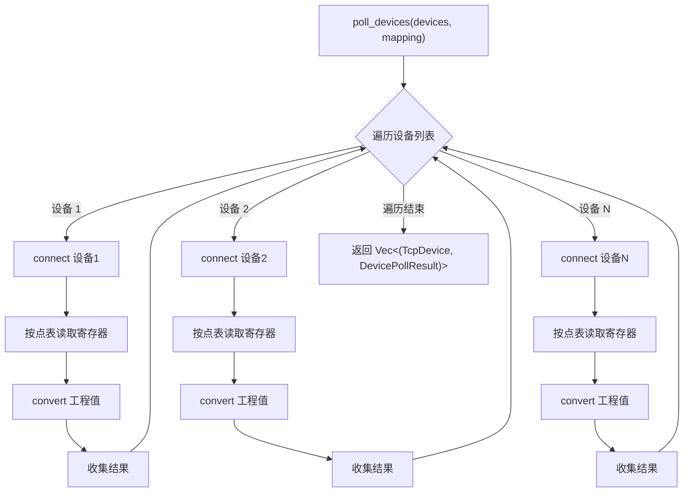

# Modbus TCP 主站设计文档（v0.46.0）

> **版本**：v0.46.0
> **蓝图参考**：`蓝图/phase1.md` §8204-8389
> **前置版本**：v0.29.0（Socket 抽象层）、v0.45.0（Modbus RTU 应用层）
> **后续版本**：v0.48.0（IEC 104）、v0.51.0（协议抽象层）
> **最后更新**：2026-07-15

---

## 1. 版本目标

基于 v0.29.0 Socket 抽象层与 v0.45.0 Modbus RTU 应用层（`ModbusRequest`/`ModbusResponse`/`FunctionCode`/`ExceptionCode`/`PointMapping`/`RegToPoint`）实现 Modbus TCP 主站协议栈，用 MBAP 头替代 RTU 的从站地址 + CRC，支持功能码 03/06/10 与多设备轮询。

- **一句话目标**：实现 Modbus TCP 主站协议栈，支持功能码 03（读保持寄存器）/06（写单个寄存器）/10（写多个寄存器），提供 MBAP 头编解码、事务 ID 配对、连接管理与多设备轮询。
- **架构定位**：P1-F 设备协议栈第四层——Modbus 的网络化版本，位于 v0.29.0 Socket 传输层之上、应用层（Agent/业务）之下。
- **前置依赖**：
  - v0.29.0 Socket 抽象层（TCP 连接管理）
  - v0.45.0 Modbus 应用层（功能码/请求响应/点表映射，复用不修改）
- **设计原则关联**：协议复用（应用层与 RTU 共享，D3）、网络化（基于 v0.29.0 Socket 层）、解耦（`TcpTransport` trait，D1）、最小改动（不修改 v0.45.0 类型，D2）。

## 2. 前置依赖

| 依赖版本 | 依赖产出 | 用途 |
|---------|---------|------|
| v0.29.0 | Socket 抽象层（TCP 连接管理） | 底层传输层，承载 Modbus TCP 帧的网络收发 |
| v0.45.0 | `ModbusRequest`/`ModbusResponse`/`FunctionCode`/`ExceptionCode` | 应用层协议类型，PDU 构建与解析（复用不修改） |
| v0.45.0 | `PointMapping`/`RegToPoint`/`ModbusDataType`/`AccessMode` | 点表映射，多设备轮询时转换为工程值 |
| v0.45.0 | `ModbusError` 错误枚举 | 应用层错误，被 `ModbusTcpError` 包装（D2） |

> **依赖关系说明**：v0.45.0 的 `ModbusRequest` 中 `slave_addr` 字段语义在 TCP 模式下复用为 `unit_id`（D3）——RTU 从站地址与 TCP 单元标识语义等价（均为设备标识），PDU 格式完全相同。本版本不修改 v0.45.0 任何代码，仅通过 `TcpTransport` trait（D1）与 `ModbusTcpError`（D2）做适配层。

## 3. 交付物清单

| 类型 | 交付物 | 路径 |
|------|--------|------|
| 代码 crate | `eneros-modbus-tcp` | `crates/protocols/modbus-tcp/`（D8） |
| 接口 | `ModbusTcpMaster` 主站对象 | `crates/protocols/modbus-tcp/src/master.rs` |
| 接口 | `MbapHeader` MBAP 头结构 | `crates/protocols/modbus-tcp/src/mbap.rs` |
| 接口 | `TcpDevice` 设备描述 | `crates/protocols/modbus-tcp/src/device.rs` |
| 接口 | `TcpTransport` trait（D1） | `crates/protocols/modbus-tcp/src/transport.rs` |
| 接口 | `ModbusTcpError` 错误枚举（D2） | `crates/protocols/modbus-tcp/src/error.rs` |
| 接口 | `TcpStats` 统计结构（D5） | `crates/protocols/modbus-tcp/src/stats.rs` |
| 测试桩 | `MockTcpTransport` | `crates/protocols/modbus-tcp/src/mock.rs` |
| 测试 | MBAP 编解码 + 主站收发 + 多设备轮询 + 事务 ID 配对 | 各模块单元/集成测试 |
| 文档 | 本设计文档 | `docs/protocols/modbus-tcp-master-design.md` |
| 配置 | workspace `Cargo.toml` | 版本 `0.45.0` → `0.46.0`，`members` 新增 `crates/protocols/modbus-tcp` |

## 4. 详细设计

### 4.1 MBAP 头结构

Modbus TCP 用 7 字节 MBAP 头（Modbus Application Protocol Header）替代 RTU 的从站地址（1 字节）+ CRC（2 字节）。结构为 `| TransactionId(2 BE) | ProtocolId(2 BE) | Length(2 BE) | UnitId(1) |`：

```rust
/// Modbus TCP MBAP 头（Modbus Application Protocol Header）
/// 7 字节固定长度，大端编码
/// | TransactionId(2) | ProtocolId(2) | Length(2) | UnitId(1) |
#[derive(Debug, Clone, Copy, PartialEq, Eq)]
pub struct MbapHeader {
    pub transaction_id: u16,  // 事务标识（请求/响应配对，主站分配）
    pub protocol_id: u16,     // 协议标识，Modbus = 0
    pub length: u16,          // 后续数据长度（含 UnitId + PDU）
    pub unit_id: u8,          // 单元标识（替代 RTU 从站地址，用于网关路由）
}

impl MbapHeader {
    /// 构造 MBAP 头
    /// data_len 为 PDU 长度，length 字段 = data_len + 1（含 UnitId）
    pub fn new(transaction_id: u16, unit_id: u8, data_len: u16) -> Self {
        Self {
            transaction_id,
            protocol_id: 0, // Modbus 协议
            length: data_len + 1, // +1 for UnitId
            unit_id,
        }
    }

    /// 编码为 7 字节大端字节流
    pub fn encode(&self) -> [u8; 7] {
        let mut buf = [0u8; 7];
        buf[0..2].copy_from_slice(&self.transaction_id.to_be_bytes());
        buf[2..4].copy_from_slice(&self.protocol_id.to_be_bytes());
        buf[4..6].copy_from_slice(&self.length.to_be_bytes());
        buf[6] = self.unit_id;
        buf
    }

    /// 从字节流解码（至少 7 字节）
    pub fn decode(buf: &[u8]) -> Result<Self, ModbusTcpError> {
        if buf.len() < 7 {
            return Err(ModbusTcpError::FrameTooShort);
        }
        Ok(Self {
            transaction_id: u16::from_be_bytes([buf[0], buf[1]]),
            protocol_id: u16::from_be_bytes([buf[2], buf[3]]),
            length: u16::from_be_bytes([buf[4], buf[5]]),
            unit_id: buf[6],
        })
    }
}
```

**字段说明**：

| 字段 | 长度 | 说明 |
|------|------|------|
| TransactionId | 2 字节 BE | 事务标识，主站递增分配，从站原样返回，用于请求/响应配对 |
| ProtocolId | 2 字节 BE | 协议标识，Modbus = `0x0000` |
| Length | 2 字节 BE | 后续数据长度（UnitId + PDU） |
| UnitId | 1 字节 | 单元标识，替代 RTU 从站地址，用于网关场景路由到串行总线从站 |

**编解码场景**：

| 场景 | 输入 | 输出 |
|------|------|------|
| 编码 | `MbapHeader::new(0x1234, 0x05, 5)` | `[0x12,0x34, 0x00,0x00, 0x00,0x06, 0x05]`（length=5+1=6） |
| 解码环回 | 上述编码字节 | `Ok(MbapHeader { transaction_id: 0x1234, protocol_id: 0, length: 6, unit_id: 5 })` |
| 解码过短 | `[0x01,0x02,0x03]`（3 字节） | `Err(FrameTooShort)` |

### 4.2 TcpDevice 设备描述

`TcpDevice` 描述 Modbus TCP 从站的网络位置与寻址参数。IPv4 地址使用 `[u8; 4]` 表示，不依赖 smoltcp 的 `Ipv4Addr`（D4，保持协议层与网络栈解耦）：

```rust
/// Modbus TCP 设备描述
#[derive(Debug, Clone, PartialEq, Eq)]
pub struct TcpDevice {
    /// IPv4 地址（4 字节，不依赖 smoltcp Ipv4Addr，D4）
    pub ip_addr: [u8; 4],
    /// TCP 端口，Modbus TCP 默认 502（IANA 分配）
    pub port: u16,
    /// 单元标识（替代 RTU 从站地址，D3）
    pub unit_id: u8,
    /// 响应超时（毫秒）
    pub timeout_ms: u32,
}

impl TcpDevice {
    /// 构造设备，端口默认 502，超时默认 1000ms
    pub fn new(ip_addr: [u8; 4], unit_id: u8) -> Self {
        Self {
            ip_addr,
            port: 502,
            unit_id,
            timeout_ms: 1000,
        }
    }

    /// 构造设备，自定义端口与超时
    pub fn with_port_timeout(
        ip_addr: [u8; 4],
        port: u16,
        unit_id: u8,
        timeout_ms: u32,
    ) -> Self {
        Self { ip_addr, port, unit_id, timeout_ms }
    }
}
```

**端口说明**：Modbus TCP 默认端口 502（IANA 分配），部分设备支持自定义端口（如 503/1502）。`unit_id` 在纯 TCP 设备中通常为 1 或 `0xFF`；在 Modbus TCP 网关（TCP-to-RTU）场景下用于路由到串行总线上的具体从站。

### 4.3 TcpTransport trait（D1）

蓝图假设 `ModbusTcpMaster` 直接持有 smoltcp `SocketHandle`，但协议层不应直接依赖具体网络栈。因此定义 `TcpTransport` trait 解耦主站与底层 socket 实现（D1，类比 v0.45.0 的 `RtuTransport`）：

```rust
use crate::device::TcpDevice;
use crate::error::ModbusTcpError;

/// TCP 传输层抽象（D1）
/// 解耦 ModbusTcpMaster 与 smoltcp socket 实现，支持 mock 测试
/// 连接管理（连接池/重连）由传输层实现负责（D6）
pub trait TcpTransport {
    /// 连接到指定设备（若已连接则复用，由实现决定连接池策略）
    fn connect(&mut self, device: &TcpDevice) -> Result<(), ModbusTcpError>;

    /// 发送字节流到当前连接的设备
    fn send(&mut self, data: &[u8]) -> Result<(), ModbusTcpError>;

    /// 接收字节流（阻塞至超时或收到完整帧）
    fn recv(&mut self, timeout_ms: u32) -> Result<alloc::vec::Vec<u8>, ModbusTcpError>;
}
```

**设计要点**：
- 主站持 `&mut dyn TcpTransport`，可在测试中替换为 `MockTcpTransport`。
- `connect()` 由传输层实现负责连接池/重连策略（D6），主站只负责协议逻辑。
- v0.29.0 的 Socket 抽象层可提供满足此 trait 的实现（适配层在传输层 crate，不在 modbus-tcp crate 内）。
- 该 trait 为后续 v0.51.0 协议抽象层预留扩展点（统一 `RtuTransport` 与 `TcpTransport`）。

### 4.4 ModbusTcpError 错误类型（D2）

蓝图引用 `ModbusError` 但未定义 TCP 特有错误。遵循 Surgical Changes 原则，不修改 v0.45.0 的 `ModbusError`，而是定义 `ModbusTcpError` 包装应用层错误 + TCP 特有变体（D2）：

```rust
use eneros_modbus_rtu::ModbusError;

/// Modbus TCP 错误类型（D2）
/// 包装 v0.45.0 的 ModbusError + TCP 特有变体，不修改原 ModbusError
#[derive(Debug)]
pub enum ModbusTcpError {
    /// 应用层错误（功能码/PDU/异常码等来自 v0.45.0）
    Modbus(ModbusError),
    /// 事务 ID 不匹配（响应 txn_id 与请求不符）
    TransactionMismatch,
    /// 连接失败（TCP 连接建立失败）
    ConnectionFailed,
    /// 未连接（发送/接收前未调用 connect）
    NotConnected,
    /// 接收超时
    Timeout,
    /// 连接已关闭（对端关闭或本地断开）
    Closed,
    /// 帧过短（MBAP 头不足 7 字节）
    FrameTooShort,
    /// 协议标识非 0（非 Modbus 协议）
    InvalidProtocolId,
    /// 重试耗尽
    MaxRetryExceeded,
}

impl From<ModbusError> for ModbusTcpError {
    fn from(e: ModbusError) -> Self {
        ModbusTcpError::Modbus(e)
    }
}
```

**错误映射场景**：

| 错误源 | ModbusTcpError 变体 | 说明 |
|--------|---------------------|------|
| v0.45.0 应用层（PDU 解析/异常码/数量校验） | `Modbus(ModbusError)` | 包装透传 |
| 响应 `transaction_id` ≠ 请求 | `TransactionMismatch` | TCP 特有，RTU 无此概念 |
| TCP 连接失败 | `ConnectionFailed` | 网络不可达/拒绝连接 |
| `recv` 超时 | `Timeout` | 超时重试 |
| 对端关闭连接 | `Closed` | 需重连 |
| 响应帧 < 7 字节 | `FrameTooShort` | MBAP 头不完整 |
| `protocol_id` ≠ 0 | `InvalidProtocolId` | 非 Modbus 协议帧 |

### 4.5 ModbusTcpMaster 主站

`ModbusTcpMaster` 是 Modbus TCP 主站对象，持有传输层引用与事务 ID 自增器，复用 v0.45.0 的应用层 PDU 构建与解析逻辑：

```rust
use alloc::vec::Vec;
use core::sync::atomic::{AtomicU16, Ordering};
use eneros_modbus_rtu::{
    ModbusError, ModbusRequest, ModbusResponse,
};
use crate::device::TcpDevice;
use crate::error::ModbusTcpError;
use crate::mbap::MbapHeader;
use crate::stats::TcpStats;
use crate::transport::TcpTransport;

/// Modbus TCP 主站
pub struct ModbusTcpMaster<'a> {
    /// 传输层抽象（D1）
    transport: &'a mut dyn TcpTransport,
    /// 事务 ID 自增器（原子操作，u16 自动回绕）
    next_transaction_id: AtomicU16,
    /// 默认重试次数
    retry_count: u8,
    /// 收发统计（D5）
    stats: TcpStats,
}

impl<'a> ModbusTcpMaster<'a> {
    /// 构造主站
    pub fn new(transport: &'a mut dyn TcpTransport, retry_count: u8) -> Self {
        Self {
            transport,
            next_transaction_id: AtomicU16::new(1), // 从 1 开始，0 保留
            retry_count,
            stats: TcpStats::default(),
        }
    }

    /// 分配下一个事务 ID（u16 回绕，D7 串行无需去重）
    fn alloc_transaction_id(&self) -> u16 {
        self.next_transaction_id.fetch_add(1, Ordering::Relaxed)
    }

    /// 读保持寄存器（功能码 0x03）
    pub fn read_holding_registers(
        &mut self,
        device: &TcpDevice,
        start_addr: u16,
        quantity: u16,
    ) -> Result<Vec<u16>, ModbusTcpError> {
        let request = ModbusRequest::ReadHoldingRegisters {
            slave_addr: device.unit_id, // D3: slave_addr 复用为 unit_id
            start_addr,
            quantity,
        };
        let response = self.send_request_with_retry(device, &request)?;
        match response {
            ModbusResponse::ReadHoldingRegisters(regs) => Ok(regs),
            _ => Err(ModbusTcpError::Modbus(ModbusError::UnexpectedResponse)),
        }
    }

    /// 写单个寄存器（功能码 0x06）
    pub fn write_single_register(
        &mut self,
        device: &TcpDevice,
        reg_addr: u16,
        value: u16,
    ) -> Result<(), ModbusTcpError> {
        let request = ModbusRequest::WriteSingleRegister {
            slave_addr: device.unit_id,
            reg_addr,
            value,
        };
        let _ = self.send_request_with_retry(device, &request)?;
        Ok(())
    }

    /// 写多个寄存器（功能码 0x10）
    pub fn write_multiple_registers(
        &mut self,
        device: &TcpDevice,
        start_addr: u16,
        values: &[u16],
    ) -> Result<(), ModbusTcpError> {
        let request = ModbusRequest::WriteMultipleRegisters {
            slave_addr: device.unit_id,
            start_addr,
            values: values.to_vec(),
        };
        let _ = self.send_request_with_retry(device, &request)?;
        Ok(())
    }
}
```

**核心方法**：

| 方法 | 签名 | 说明 |
|------|------|------|
| `new` | `(transport, retry_count) -> Self` | 构造主站 |
| `alloc_transaction_id` | `() -> u16` | 分配事务 ID（u16 回绕） |
| `build_pdu` | `(&ModbusRequest) -> Vec<u8>` | 复用 v0.45.0 构建 PDU（无 CRC） |
| `build_frame` | `(txn_id, &TcpDevice, &ModbusRequest) -> Vec<u8>` | 构建 MBAP + PDU 完整帧 |
| `parse_response` | `(txn_id, &TcpDevice, &ModbusRequest, &frame) -> Result<ModbusResponse, ModbusTcpError>` | 解码 MBAP + PDU，校验事务 ID |
| `send_request_with_retry` | `(device, &request) -> Result<ModbusResponse, ModbusTcpError>` | 带重试的收发 |

**`build_frame()` 实现**：
1. 调用 v0.45.0 的 PDU 构建函数（`build_read_pdu` / `build_write_single_pdu` / `build_write_multiple_pdu`）构建 PDU（无 CRC，TCP 模式无 CRC）
2. `txn_id = alloc_transaction_id()`
3. `header = MbapHeader::new(txn_id, device.unit_id, pdu.len() as u16)`
4. `frame = header.encode().to_vec() ++ pdu`

**`parse_response()` 实现**：
1. `MbapHeader::decode(&frame)` 校验长度 ≥7 → 否则 `Err(FrameTooShort)`
2. 校验 `protocol_id == 0` → 否则 `Err(InvalidProtocolId)`
3. 校验 `transaction_id == 请求 txn_id` → 否则 `Err(TransactionMismatch)`
4. 校验 `unit_id == device.unit_id` → 否则 `Err(Modbus(AddrMismatch))`
5. 提取 PDU = `&frame[7..]`，调用 v0.45.0 的 PDU 解析函数解析为 `ModbusResponse`

**`send_request_with_retry()` 流程**：
1. `transport.connect(device)` → 失败 `Err(ConnectionFailed)`，`stats.reconnect_count++`
2. 循环 `0..=retry_count` 次：
   - `txn_id = alloc_transaction_id()`
   - `frame = build_frame(txn_id, device, &request)`
   - `transport.send(&frame)` → `stats.request_count++`
   - `transport.recv(device.timeout_ms)`：
     - `Ok(buf)` → `parse_response(txn_id, device, &request, &buf)` → 成功返回，`stats.response_count++`
     - `Err(Timeout)` → `stats.timeout_count++`，继续重试
     - `Err(Closed)` → `transport.connect(device)` 重连，`stats.reconnect_count++`，继续重试
   - 重试耗尽 → `Err(MaxRetryExceeded)`

### 4.6 TcpStats 统计（D5）

蓝图引用 `TcpStats` 但未定义。TCP 模式需独立统计（含重连次数，区别于 v0.45.0 的 `ModbusStats`，D5）：

```rust
/// Modbus TCP 收发统计（D5）
#[derive(Debug, Clone, Default)]
pub struct TcpStats {
    /// 发送请求计数
    pub request_count: u32,
    /// 接收响应计数
    pub response_count: u32,
    /// 错误响应计数（异常码/解析失败）
    pub error_count: u32,
    /// 超时计数
    pub timeout_count: u32,
    /// 重连计数（TCP 特有）
    pub reconnect_count: u32,
}

impl TcpStats {
    /// 错误率（error_count / request_count）
    pub fn error_rate(&self) -> f64 {
        if self.request_count == 0 {
            0.0
        } else {
            self.error_count as f64 / self.request_count as f64
        }
    }
}
```

**统计字段说明**：

| 字段 | 递增时机 | 用途 |
|------|---------|------|
| `request_count` | 每次 `transport.send()` 后 | 请求总量 |
| `response_count` | 每次 `parse_response()` 成功后 | 响应总量，与 request 比对计算丢包率 |
| `error_count` | 异常码响应或解析失败 | 协议错误率 |
| `timeout_count` | `recv()` 超时 | 网络质量指标 |
| `reconnect_count` | 每次 `connect()` 重连 | 连接稳定性指标（TCP 特有） |

### 4.7 poll_devices 多设备轮询（D7）

`poll_devices()` 串行遍历设备列表，对每个设备执行点表轮询（D7，MVP 简化；真并发需多连接+多线程，后置到 v0.51.0）：

```rust
use alloc::vec::Vec;
use eneros_modbus_rtu::{PointMapping, RegToPoint};
use crate::device::TcpDevice;
use crate::error::ModbusTcpError;

/// 单设备轮询结果：Vec<(point_id, 工程值或错误)>
pub type DevicePollResult = Vec<(u32, Result<f64, ModbusTcpError>)>;

impl<'a> ModbusTcpMaster<'a> {
    /// 多设备批量轮询点表（D7: 串行遍历）
    /// 对每个设备：连接 → 按点表读取寄存器 → 转换工程值 → 返回结果
    pub fn poll_devices(
        &mut self,
        devices: &[TcpDevice],
        mapping: &PointMapping,
    ) -> Vec<(TcpDevice, DevicePollResult)> {
        devices
            .iter()
            .map(|dev| {
                let result = self.poll_single_device(dev, mapping);
                (dev.clone(), result)
            })
            .collect()
    }

    /// 单设备点表轮询（复用 v0.45.0 的 group_by_slave 逻辑，slave_addr 即 unit_id）
    fn poll_single_device(
        &mut self,
        device: &TcpDevice,
        mapping: &PointMapping,
    ) -> DevicePollResult {
        // 1. 筛选属于该设备的点位（按 unit_id 匹配，D3）
        // 2. 按寄存器地址排序，合并连续区间
        // 3. 调用 read_holding_registers 读取
        // 4. 对每个点位调用 RegToPoint::convert() 转换为工程值
        // 5. 返回 Vec<(point_id, Result<f64, ModbusTcpError>)>
        // （实现复用 v0.45.0 poll_points 逻辑，此处略）
        todo!()
    }
}
```

**D7 串行遍历说明**：
- Modbus 是请求-响应模式，单 TCP 连接不支持并发请求
- 真并发需每个设备独立连接 + 多线程，复杂度高，后置到 v0.51.0 协议抽象层
- MVP 串行遍历满足功能正确性，性能由设备数 × 单次读写延迟决定（10 设备 < 200ms）

## 5. 收发流程

### 5.1 单次读写时序



### 5.2 超时重连流程



### 5.3 多设备轮询流程（D7）



## 6. 偏差声明（D1~D8）

> 以下偏差与 `.trae/specs/develop-v0460-modbus-tcp-master/spec.md` §偏差声明一致。

| 偏差 | 蓝图假设 | 实际情况 | 处理方案 |
|------|---------|---------|---------|
| **D1** | `ModbusTcpMaster` 持有 smoltcp `SocketHandle` | 协议层不应直接依赖具体网络栈 | 定义 `TcpTransport` trait（`send`/`recv`/`connect`），主站持 `&mut dyn TcpTransport`，支持 mock 测试（类比 v0.45.0 的 `RtuTransport`） |
| **D2** | `ModbusError` 枚举被引用但无 TCP 特有变体 | v0.45.0 的 `ModbusError` 无 `TransactionMismatch`/`ConnectionFailed` 等 TCP 变体 | 定义 `ModbusTcpError` 枚举，包装 `Modbus(ModbusError)` + TCP 特有变体；不修改 v0.45.0 的 `ModbusError`（遵循 Surgical Changes 原则） |
| **D3** | 蓝图未明确 `slave_addr` 与 `unit_id` 的关系 | RTU `slave_addr` 与 TCP `unit_id` 语义等价（均为设备标识），PDU 格式相同 | 复用 v0.45.0 的 `ModbusRequest`，`slave_addr` 字段语义复用为 `unit_id`，避免重复定义类型 |
| **D4** | 蓝图假设 `TcpDevice` 使用 smoltcp `Ipv4Addr` | 直接依赖 smoltcp 使协议层与网络栈耦合 | `TcpDevice` 使用 `[u8; 4]` 表示 IPv4 地址，不依赖 smoltcp，保持协议层与网络栈解耦 |
| **D5** | `TcpStats` 被引用但未定义 | 蓝图未给出定义 | 定义 `TcpStats`：`request_count`/`response_count`/`error_count`/`timeout_count`/`reconnect_count` + `Default`（含重连次数，区别于 v0.45.0 的 `ModbusStats`） |
| **D6** | 蓝图假设主站持有连接池 `BTreeMap<IpAddr, TcpConnection>` | 连接池管理增加主站复杂度 | 连接管理委托给 `TcpTransport::connect()`，主站不持有连接池；遵循 Simplicity First，连接池/重连策略由传输层实现负责 |
| **D7** | 蓝图称"多设备并发轮询" | 单 TCP 连接不支持并发请求，真并发需多连接+多线程 | `poll_devices()` 串行遍历设备（非真并发）；MVP 简化，真并发后置到 v0.51.0 协议抽象层 |
| **D8** | crate 名 `modbus-tcp-master` 放于不确定位置 | §2.3.1 要求所有 crate 放 `crates/<subsystem>/` | 放入 `crates/protocols/modbus-tcp/`（crate 名 `eneros-modbus-tcp`）；与 modbus-rtu 同属 protocols 子系统 |

## 7. 测试计划

### 7.1 单元测试

| 模块 | 测试内容 | 测试向量 |
|------|---------|---------|
| `mbap.rs` | `encode()` 编码 | `MbapHeader::new(0x1234, 0x05, 5)` → `[0x12,0x34, 0x00,0x00, 0x00,0x06, 0x05]` |
| `mbap.rs` | `decode()` 环回 | 上述编码字节解码还原原始 header |
| `mbap.rs` | `decode()` 帧过短 | `[0x01,0x02,0x03]`（3 字节）→ `Err(FrameTooShort)` |
| `mbap.rs` | `length` 字段计算 | `data_len=5` → `length=6`（含 UnitId） |
| `mbap.rs` | `protocol_id` 固定为 0 | 编码后字节 `[2..4]` = `0x00,0x00` |
| `device.rs` | `TcpDevice::new` 默认值 | 端口=502，timeout=1000ms |
| `device.rs` | `with_port_timeout` 自定义 | 端口=1502，timeout=500ms |
| `error.rs` | `From<ModbusError>` 转换 | `ModbusError::CrcMismatch` → `ModbusTcpError::Modbus(...)` |
| `master.rs` | `alloc_transaction_id` 递增 | 连续调用返回 1, 2, 3... |
| `master.rs` | `alloc_transaction_id` 回绕 | 从 0xFFFF 回绕到 0 |
| `master.rs` | `build_frame` MBAP+PDU | 7 + PDU 长度，MBAP 字段正确 |
| `master.rs` | `parse_response` 事务 ID 匹配 | 匹配 → Ok；不匹配 → `Err(TransactionMismatch)` |
| `master.rs` | `parse_response` protocol_id 校验 | `protocol_id=1` → `Err(InvalidProtocolId)` |
| `master.rs` | `parse_response` 异常响应 | PDU 功能码 `0x83` → `Err(Modbus(Exception(...)))` |
| `stats.rs` | `TcpStats::default` | 全字段为 0 |
| `stats.rs` | `error_rate` 计算 | request=10, error=2 → 0.2 |

### 7.2 集成测试（MockTcpTransport）

| 测试 | 描述 | 预期 |
|------|------|------|
| 读保持寄存器成功 | `MockTcpTransport` 预填充合法 MBAP+PDU 响应（quantity=2） | `Ok(vec![u16; 2])`；`request_count`/`response_count` 各+1 |
| 写单个寄存器 | `MockTcpTransport` 预填充回显响应 | `Ok(())`；统计递增 |
| 写多个寄存器 | `MockTcpTransport` 预填充回显响应 | `Ok(())`；统计递增 |
| 事务 ID 不匹配 | 预填充响应 `transaction_id` 与请求不符 | `Err(TransactionMismatch)` |
| 事务 ID 回绕 | 连续请求 > 65535 次 | 事务 ID 正确回绕，无重复配对失败 |
| 超时重试 | `set_recv_timeout(true)`，`retry_count=2` | `Err(MaxRetryExceeded)`；`timeout_count` +3 |
| 连接失败 | `connect()` 返回 `ConnectionFailed` | `Err(ConnectionFailed)` |
| 连接关闭重连 | 第 1 次 `recv()` 返回 `Closed`，重连后成功 | 第 2 次成功；`reconnect_count` +1 |
| 异常码响应 | 预填充异常 PDU（`0x83, 0x02`） | `Err(Modbus(Exception(IllegalDataAddress)))` |
| protocol_id 错误 | 预填充 `protocol_id=1` | `Err(InvalidProtocolId)` |
| 多设备轮询（3 设备） | `poll_devices()` 收到 3 设备 + 点表 | 返回 `Vec` 长度 3，每设备含点表结果 |
| 多设备轮询单设备失败 | 设备 2 连接失败 | 设备 2 结果为错误，设备 1/3 正常 |

### 7.3 性能基准

| 基准 | 目标 | 测试方法 |
|------|------|---------|
| 单次读保持寄存器 | <20ms（局域网） | `MockTcpTransport` 模拟时序 |
| 单次写单个寄存器 | <20ms（局域网） | 同上 |
| 10 设备轮询 | <200ms | `MockTcpTransport` + 10 设备串行 |
| MBAP 编解码 | <10μs | 主机侧基准测试 |
| 事务 ID 分配 | <1μs | 原子操作基准 |

**局域网时序估算**：
- TCP 往返延迟 <1ms（LAN）
- 从站处理 + 响应 ≈ 5-15ms
- 单次读写总时间 < 20ms，满足目标
- 10 设备串行轮询 < 200ms

### 7.4 边界测试

| 边界场景 | 输入 | 预期 |
|---------|------|------|
| 事务 ID 回绕 | 连续请求 65536 次 | 第 65536 次事务 ID = 0，无配对冲突 |
| 事务 ID 不匹配 | 响应 `txn_id` ≠ 请求 | `Err(TransactionMismatch)` |
| 响应帧过短 | 响应仅 3 字节 | `Err(FrameTooShort)` |
| protocol_id 非 0 | `protocol_id=1` | `Err(InvalidProtocolId)` |
| 连接断开重连 | `recv()` 返回 `Closed` | 自动 `connect()` 重连，`reconnect_count++` |
| 重试耗尽 | `retry_count=0` + 超时 | `Err(MaxRetryExceeded)` |
| 异常码 0x02 | 从站返回 `IllegalDataAddress` | `Err(Modbus(Exception(IllegalDataAddress)))` |
| 无效数量 | `quantity=126`（>125） | `Err(Modbus(InvalidQuantity))` |
| 写多寄存器超限 | `values.len() > 123` | `Err(Modbus(InvalidQuantity))` |

## 8. 验收标准

- [ ] MBAP 头编解码正确：`encode()`/`decode()` 环回一致，`length = data_len + 1`
- [ ] `protocol_id` 固定为 0，非 0 响应返回 `Err(InvalidProtocolId)`
- [ ] 能通过 TCP 读写 Modbus TCP 从站（功能码 03/06/10）
- [ ] 事务 ID 配对验证：响应 `transaction_id` 与请求不符返回 `Err(TransactionMismatch)`
- [ ] 事务 ID 回绕正确：u16 溢出后从 0 继续，无配对冲突
- [ ] 支持多设备轮询（≥3 设备），`poll_devices()` 返回每设备点表结果
- [ ] 连接断开后自动重连，`reconnect_count` 递增
- [ ] 超时重试机制工作正常：`retry_count` 次后返回 `MaxRetryExceeded`
- [ ] 异常码响应正确映射为 `ModbusTcpError::Modbus(ModbusError::Exception(...))`
- [ ] `TcpStats` 统计字段正确递增（request/response/error/timeout/reconnect）
- [ ] `TcpTransport` trait（D1）解耦主站与 socket 实现，`MockTcpTransport` 可注入测试
- [ ] `ModbusTcpError`（D2）包装 `ModbusError` + TCP 特有变体，不修改 v0.45.0 类型
- [ ] 复用 v0.45.0 应用层（D3）：`ModbusRequest`/`ModbusResponse`/`PointMapping` 不重复定义
- [ ] `TcpDevice` 使用 `[u8; 4]` 表示 IPv4（D4），不依赖 smoltcp
- [ ] crate 位于 `crates/protocols/modbus-tcp/`（D8 目录规范）
- [ ] 单次读写延迟 <20ms（局域网模拟）
- [ ] no_std 合规：仅使用 `alloc`/`core`，无 `std::*`

## 9. 风险与注意事项

| # | 风险 | 缓解措施 |
|---|------|---------|
| 9.1 | 网络延迟不可控：LAN <1ms，WAN 可能 >100ms | `timeout_ms` 参数化（默认 1000ms）；`retry_count` 应对偶发超时；WAN 场景调大超时 |
| 9.2 | 连接管理复杂：TCP keep-alive、断线重连、连接池上限 | D6：连接管理委托 `TcpTransport::connect()`，由传输层实现负责重连策略与连接池上限 |
| 9.3 | 并发安全：多线程访问主站需加锁 | 主站持 `&mut dyn TcpTransport`，单实例非线程安全；多线程场景由上层封装 `spin::Mutex`（no_std 自旋锁） |
| 9.4 | 事务 ID 溢出回绕：u16 最大 65535 | `alloc_transaction_id()` 使用 `AtomicU16::fetch_add` 自动回绕；D7 串行轮询无需去重；并发场景需配对验证 |
| 9.5 | 部分 Modbus TCP 设备不支持长连接 | `TcpTransport::connect()` 实现可配置连接策略（每次请求新建 vs 复用）；`recv()` 返回 `Closed` 触发重连 |
| 9.6 | Modbus TCP 网关（TCP-to-RTU）场景 `unit_id` 路由 | `unit_id` 字段正确填充到 MBAP 头，网关负责路由到串行总线从站 |
| 9.7 | 单连接不支持并发请求 | D7：`poll_devices()` 串行遍历；真并发需多连接+多线程，后置到 v0.51.0 |
| 9.8 | protocol_id 非 0 帧混入 | `parse_response()` 强制校验 `protocol_id == 0`，否则 `Err(InvalidProtocolId)` |
| 9.9 | 网络安全：Modbus TCP 明文传输 | 后续版本支持 Modbus Security（TLS，见 §10.7 可扩展）；当前版本依赖网络隔离/防火墙 |
| 9.10 | 功能码 03 读取数量 ≤125 个寄存器 | 复用 v0.45.0 校验，超限返回 `Err(Modbus(InvalidQuantity))` |

## 10. 多角度要求

| 维度 | 要求 | 实现 |
|------|------|------|
| 10.1 功能 | MBAP 头编解码、功能码 03/06/10、多设备轮询 | ✅ `MbapHeader` + 复用 v0.45.0 `ModbusRequest`/`ModbusResponse` + `poll_devices()`（D7） |
| 10.2 性能 | 单次 <20ms（LAN），10 设备 <200ms | ✅ LAN 时序估算 <20ms；串行轮询 10 设备 <200ms |
| 10.3 安全 | 连接白名单、端口控制、protocol_id 校验 | ✅ `InvalidProtocolId` 校验；后续支持 TLS（Modbus Security） |
| 10.4 可靠 | 断线重连、超时重试、事务 ID 配对 | ✅ `retry_count` + `MaxRetryExceeded` + `TransactionMismatch` + 自动重连（D6） |
| 10.5 可维护 | 设备列表配置、易扩展 | ✅ `TcpDevice` 字段化；后续版本支持 JSON 设备列表加载 |
| 10.6 可观测 | 连接状态/读写统计/重连统计 | ✅ `TcpStats` 5 字段（request/response/error/timeout/reconnect）（D5） |
| 10.7 可扩展 | 支持 Modbus Security（TLS）、真并发轮询 | ✅ `TcpTransport` trait（D1）可替换为 TLS 实现；`poll_devices()` 可扩展为并发（v0.51.0） |

## 11. 架构图

```
┌──────────────────────────────────────────────────┐
│              应用层（Agent / 业务）                │
│         poll_devices() / read / write            │
└──────────────────┬───────────────────────────────┘
                   │ ModbusRequest / ModbusResponse (复用 v0.45.0)
                   ▼
┌──────────────────────────────────────────────────┐
│           v0.46.0 Modbus TCP 主站                 │
│           (eneros-modbus-tcp)                     │
│  ┌─────────────────────────────────────────────┐ │
│  │ ModbusTcpMaster                             │ │
│  │  ├── build_pdu() / build_frame()            │ │
│  │  ├── parse_response() (事务 ID 配对)        │ │
│  │  ├── send_request_with_retry()              │ │
│  │  ├── poll_devices() (D7 串行)               │ │
│  │  ├── alloc_transaction_id() (u16 回绕)      │ │
│  │  └── TcpStats (D5)                          │ │
│  └─────────────┬───────────────────────────────┘ │
│                │ TcpTransport trait (D1)           │
│  ┌─────────────┴───────────────────────────────┐ │
│  │ MbapHeader(7) | TcpDevice | ModbusTcpError(D2)│ │
│  └─────────────────────────────────────────────┘ │
└──────────────────┬───────────────────────────────┘
                   │ connect() / send() / recv()
                   ▼
┌──────────────────────────────────────────────────┐
│           v0.29.0 Socket 抽象层                   │
│  ┌─────────────────────────────────────────────┐ │
│  │ TcpTransport 实现 (smoltcp 适配)            │ │
│  │  ├── connect(TcpDevice) → 连接池/重连 (D6)  │ │
│  │  ├── send(&[u8]) → TCP 发送                 │ │
│  │  └── recv(timeout_ms) → TCP 接收            │ │
│  └─────────────┬───────────────────────────────┘ │
│                │ smoltcp TcpSocket                │
└────────────────┼─────────────────────────────────┘
                 ▼
┌──────────────────────────────────────────────────┐
│           网络硬件（以太网/WiFi）                  │
│  └── Modbus TCP 从站（BMS/PCS/电表/逆变器）       │
└──────────────────────────────────────────────────┘
```

**数据流说明**：

1. 应用层调用 `ModbusTcpMaster::poll_devices(&devices, &mapping)` 或具体读写方法
2. 主站构造 `ModbusRequest`（复用 v0.45.0，D3），分配事务 ID
3. `build_frame()` 编码 MBAP 头（7 字节）+ PDU（无 CRC，TCP 模式无 CRC）
4. 帧经 `TcpTransport` trait（D1）传递给底层 socket 实现
5. socket 实现通过 smoltcp 发送 TCP 报文到从站
6. 从站响应经网络 → socket → `recv()` → 主站 `parse_response()` 解码
7. 主站校验事务 ID 配对，解析 PDU（复用 v0.45.0），返回 `ModbusResponse`

**关键解耦点**：
- **D1 `TcpTransport` trait**：主站不直接依赖 smoltcp，便于 mock 测试与未来 TLS 替换
- **D2 `ModbusTcpError`**：包装 `ModbusError`，不修改 v0.45.0 类型（Surgical Changes）
- **D3 应用层复用**：`ModbusRequest`/`ModbusResponse`/`PointMapping` 完全复用，`slave_addr` 语义复用为 `unit_id`
- **D6 连接管理外移**：主站不持有连接池，由传输层实现负责

---

> **后续演进**：
> - **v0.48.0 IEC 104**：与本版本共同构成 P1-F 设备协议栈的多协议支持，点表映射将统一抽象。
> - **v0.51.0 协议抽象层**：将 `RtuTransport`（v0.45.0）与 `TcpTransport`（v0.46.0）统一为 `ProtocolTransport` trait，支持多协议并发轮询（真并发，解决 D7 串行限制）。
> - **v0.50.0 统一点表**：使用本版本的 `poll_devices()` 与 v0.45.0 的 `PointMapping` 作为数据源，整合 Modbus RTU/TCP、IEC 104、CAN 等多协议点表。
