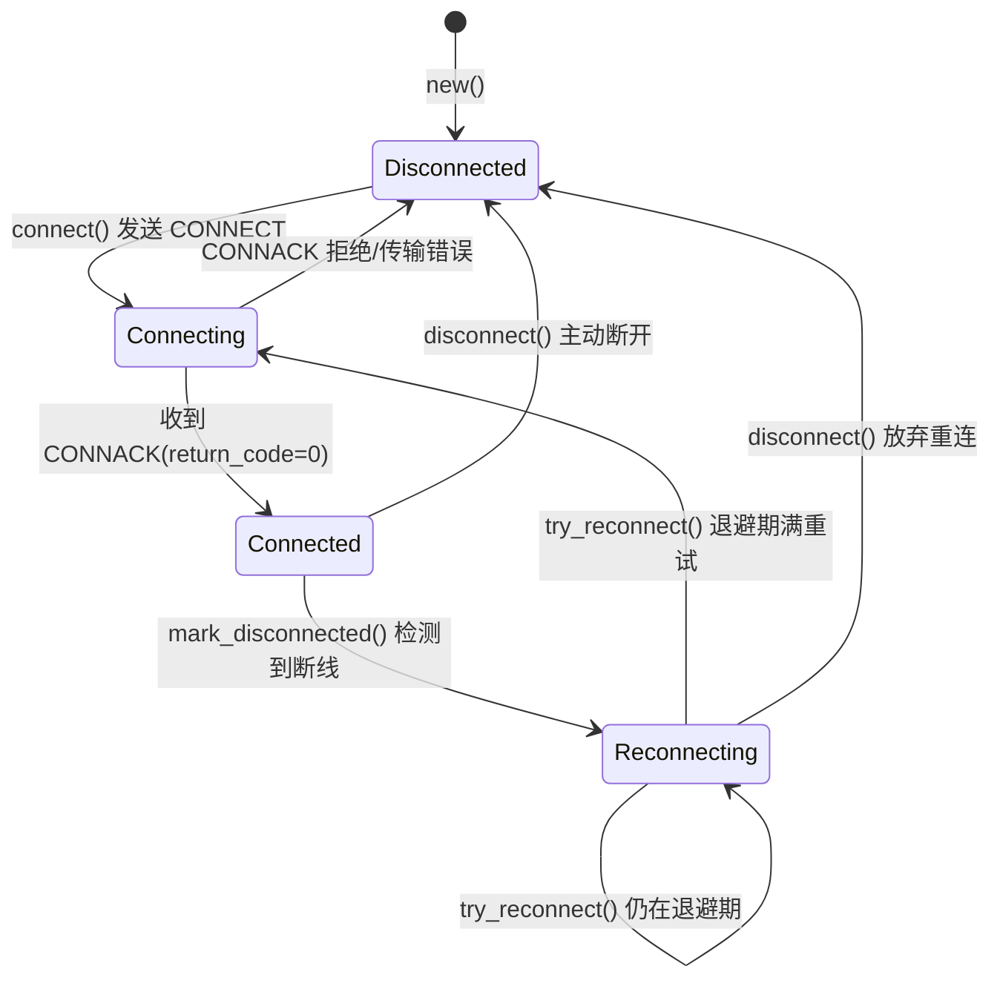
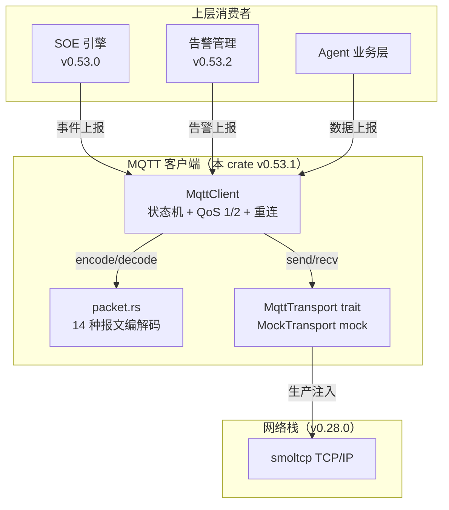
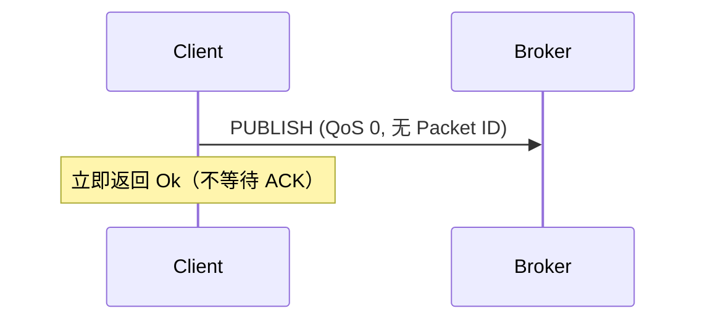
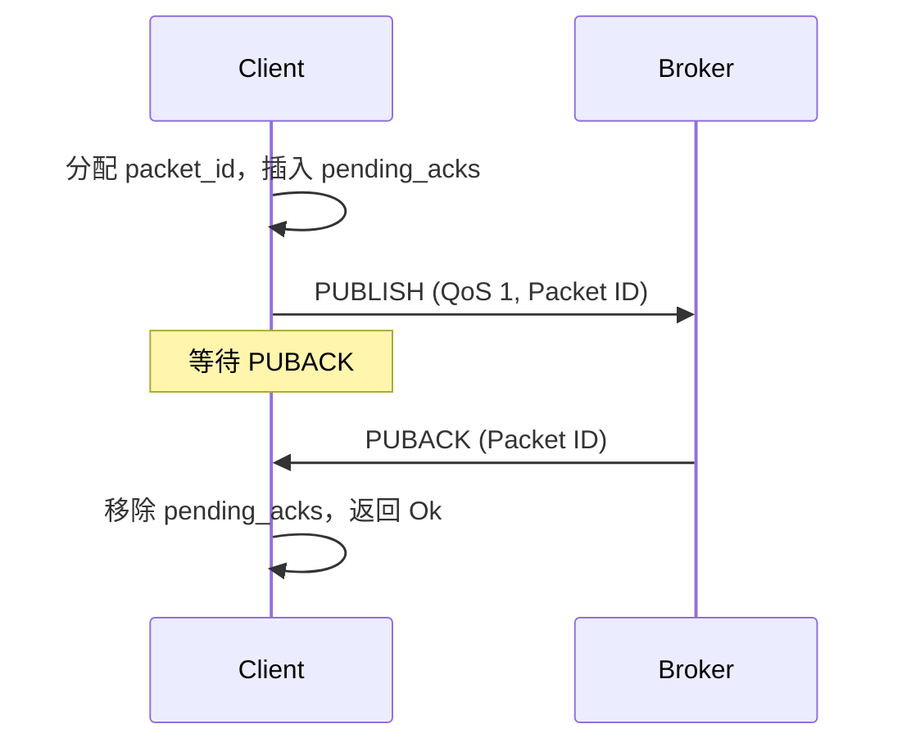
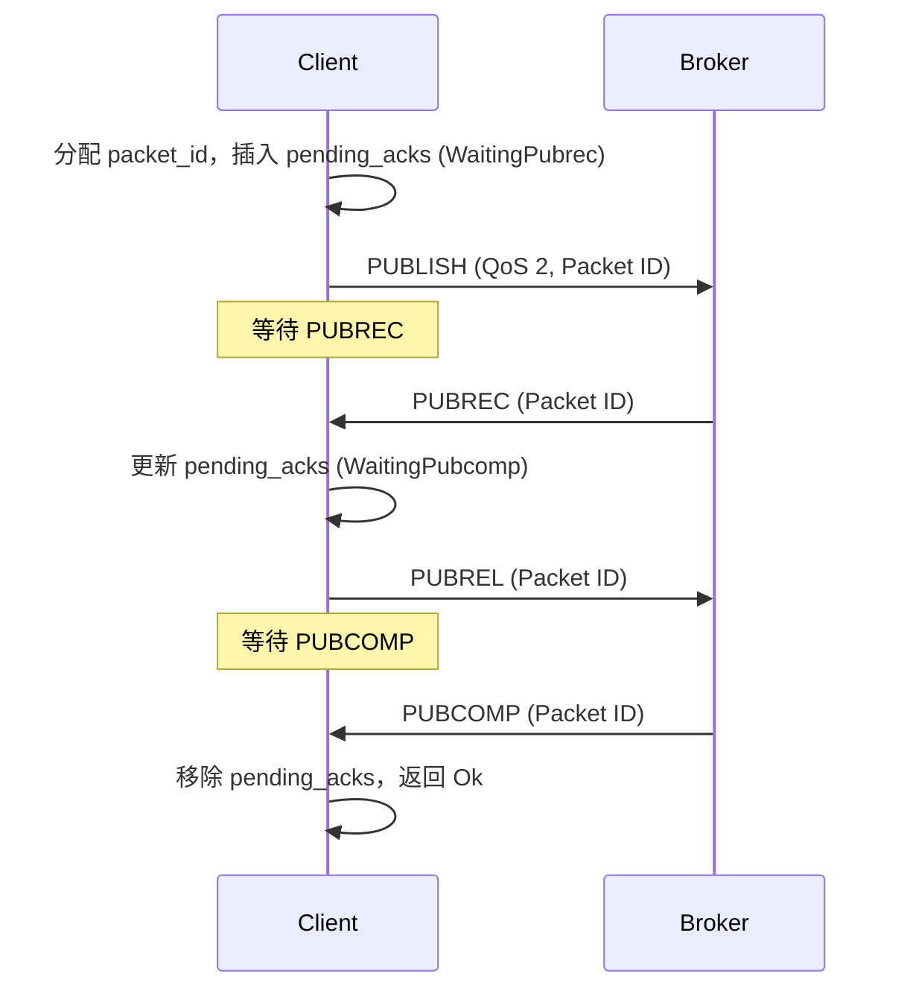
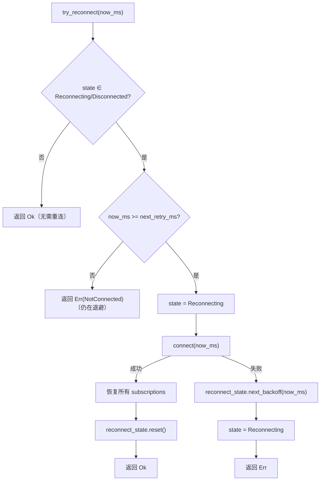

# EnerOS MQTT v3.1.1 客户端设计文档（v0.53.1）

> **版本**：v0.53.1
> **crate**：`eneros-mqtt`（`crates/protocols/mqtt/`）
> **依赖**：`eneros-upa-model`（v0.50.0）
> **状态**：设计稿（MQTT v3.1.1 客户端，QoS 0/1/2 + 遗嘱 + 重连）
> **覆盖版本**：v0.53.1
> **最后更新**：2026-07-15
> **蓝图参考**：`蓝图/phase1.md` §v0.53.1

---

## 目录

1. [概述](#1-概述)
2. [架构](#2-架构)
3. [MQTT 协议](#3-mqtt-协议)
4. [报文编解码](#4-报文编解码)
5. [QoS 状态机](#5-qos-状态机)
6. [MqttTransport 抽象](#6-mqtttransport-抽象)
7. [断线重连](#7-断线重连)
8. [遗嘱消息](#8-遗嘱消息)
9. [Topic 通配](#9-topic-通配)
10. [no_std 合规](#10-no_std-合规)
11. [测试策略](#11-测试策略)
12. [偏差声明](#12-偏差声明)

---

## 1. 概述

### 1.1 版本背景

MQTT（Message Queuing Telemetry Transport）是物联网标准轻量协议，
适合储能终端弱网场景下的数据上报。本版本（v0.53.1）在 v0.53.0 SOE 事件引擎之上，
实现 MQTT v3.1.1 客户端，将运行数据（SOC/功率/告警/SOE 事件）上报至云端运维平台
或 SCADA 主站，为远程监控与数据汇聚提供标准物联网通道。

### 1.2 设计目标

| 目标 | 说明 |
|------|------|
| **协议合规** | 实现 MQTT v3.1.1 14 种控制报文编解码 |
| **QoS 分级** | 支持 QoS 0/1/2，QoS 1 等待 PUBACK，QoS 2 四次握手 |
| **可靠重连** | 断线指数退避重连（初始 1s，最大 30s），重连后自动恢复订阅 |
| **遗嘱机制** | 支持 Last Will，异常断开时由 Broker 自动发布 |
| **Topic 通配** | 支持 `+` 单层与 `#` 多层通配符 |
| **解耦** | 传输层通过 `MqttTransport` trait 抽象，不直接依赖 smoltcp |
| **no_std 合规** | 全 crate `#![cfg_attr(not(test), no_std)]`，仅依赖 `alloc` |

### 1.3 架构定位

- **P1-G 物联网协议层**：远程上报通道
- **协议栈位置**：位于 SOE 事件引擎（v0.53.0）之上、Agent 业务层之下
- **数据来源**：SOE 事件、四遥数据、告警（v0.53.2）

### 1.4 前置依赖

| 依赖版本 | 依赖产出 | 用途 |
|---------|---------|------|
| **v0.50.0** | `eneros-upa-model`（`DataPoint`/`PointId`） | 数据点类型（未来桥接 DataPoint → MQTT payload） |
| v0.28.0 | smoltcp TCP/IP 栈 | 生产环境传输层（通过 `MqttTransport` trait 注入） |
| v0.12.0 | 系统时钟（RTC + 单调时钟） | 时间戳来源（通过 `u64` 毫秒参数注入，D16） |

### 1.5 交付物清单

| 类型 | 交付物 | 描述 |
|------|--------|------|
| 代码模块 | `mqtt` crate | MQTT v3.1.1 客户端 |
| 接口 | `MqttClient` | 客户端状态机（connect/publish/subscribe/disconnect/poll/try_reconnect） |
| 接口 | `MqttPacket` | 14 种控制报文枚举 |
| 接口 | `QoS` | QoS 等级（0/1/2） |
| 接口 | `LastWill` | 遗嘱消息 |
| 接口 | `TopicFilter` | Topic 过滤器（+ 和 # 通配） |
| 接口 | `MqttTransport` trait | 传输层抽象 + `MockTransport` mock |
| 接口 | `ReconnectState` | 指数退避重连状态 |
| 测试 | 15 个集成测试 | 覆盖报文编解码 + 客户端状态机 + 重连 |
| 文档 | 本设计文档 | 架构 / 状态机 / 偏差声明 |

---

## 2. 架构

### 2.1 客户端状态机



### 2.2 模块组成

| 模块 | 职责 |
|------|------|
| `qos.rs` | QoS 等级枚举（AtMostOnce/AtLeastOnce/ExactlyOnce） |
| `error.rs` | 错误类型 `MqttError`（10 变体） |
| `will.rs` | 遗嘱消息 `LastWill` |
| `topic.rs` | Topic 过滤器 `TopicFilter`（+ 和 # 通配） |
| `packet.rs` | 报文编解码（14 种控制报文 + 变长剩余长度） |
| `transport.rs` | 传输层 trait + `MockTransport` |
| `client.rs` | 客户端状态机 + QoS 1/2 状态跟踪 + 重连 |

### 2.3 协议栈分层



---

## 3. MQTT 协议

### 3.1 协议版本

本实现严格遵循 **MQTT v3.1.1**（OASIS Standard，2014），不支持 MQTT 5（D13）。

### 3.2 14 种控制报文

| 类型码 | 报文 | 方向 | 说明 |
|--------|------|------|------|
| 1 | CONNECT | C→S | 连接请求（含 ClientID/Will/Credentials） |
| 2 | CONNACK | S→C | 连接确认（return_code=0 接受） |
| 3 | PUBLISH | 双向 | 发布消息（QoS 0/1/2，含 DUP/Retain 标志） |
| 4 | PUBACK | 双向 | QoS 1 第 2 步：发布确认 |
| 5 | PUBREC | 双向 | QoS 2 第 2 步：发布收到 |
| 6 | PUBREL | 双向 | QoS 2 第 3 步：发布释放（标志位固定 0b0010） |
| 7 | PUBCOMP | 双向 | QoS 2 第 4 步：发布完成 |
| 8 | SUBSCRIBE | C→S | 订阅请求（标志位固定 0b0010） |
| 9 | SUBACK | S→C | 订阅确认（return_code 0~2=接受，128=拒绝） |
| 10 | UNSUBSCRIBE | C→S | 取消订阅（标志位固定 0b0010） |
| 11 | UNSUBACK | S→C | 取消订阅确认 |
| 12 | PINGREQ | C→S | 心跳请求 |
| 13 | PINGRESP | S→C | 心跳响应 |
| 14 | DISCONNECT | C→S | 主动断开 |

### 3.3 报文结构

每个 MQTT 控制报文由三部分组成：

```
+----------------+----------------+----------------+
| 固定头（1+ 字节）| 可变头（可选）  | 负载（可选）    |
+----------------+----------------+----------------+
```

**固定头**：
- 字节 1：高 4 位 = 报文类型，低 4 位 = 标志
- 字节 2~5：剩余长度（变长整数编码，1~4 字节）

**剩余长度编码**（变长整数）：
- 每字节低 7 位为值，最高位为继续标志
- 最大 4 字节，最大值 268,435,455（256MB）

---

## 4. 报文编解码

### 4.1 编码 API

```rust
pub fn encode(packet: &MqttPacket) -> Vec<u8>;
```

编码流程：
1. 根据 `MqttPacket` 变体确定报文类型与标志字节
2. 编码可变头 + 负载为字节流
3. 编码剩余长度（变长整数）
4. 拼接：固定头 + 剩余长度 + 可变头 + 负载

### 4.2 解码 API

```rust
pub fn decode(bytes: &[u8]) -> Result<MqttPacket, MqttError>;
```

解码流程：
1. 读取第 1 字节，提取类型（高 4 位）与标志（低 4 位）
2. 解码剩余长度（变长整数）
3. 校验报文完整性（`payload_start + rem_len <= bytes.len()`）
4. 按类型分派到子解码器

### 4.3 子报文结构

#### CONNECT

```
可变头：
  Protocol Name: "MQTT"（长度前缀）
  Protocol Level: 0x04
  Connect Flags: 1 字节
    bit 1: Clean Session
    bit 2: Will Flag
    bit 3-4: Will QoS
    bit 5: Will Retain
    bit 6: Password Flag
    bit 7: User Name Flag
  Keep Alive: 2 字节（秒）
负载：
  ClientID（长度前缀字符串）
  Will Topic + Will Payload（若 Will Flag）
  Username（若 User Name Flag）
  Password（若 Password Flag）
```

#### PUBLISH

```
固定头标志：
  bit 0: Retain
  bit 1-2: QoS
  bit 3: DUP
可变头：
  Topic Name（长度前缀字符串）
  Packet Identifier（2 字节，仅 QoS 1/2）
负载：
  应用消息（任意字节）
```

### 4.4 变长整数辅助

```rust
pub fn encode_remaining_length(len: usize) -> Vec<u8>;
pub fn decode_remaining_length(bytes: &[u8]) -> Result<(usize, usize), MqttError>;
```

返回 (长度, 消耗字节数)。最多 4 字节，超过返回 `PacketDecodeError`。

---

## 5. QoS 状态机

### 5.1 QoS 0：至多一次（火忘）



### 5.2 QoS 1：至少一次（PUBLISH → PUBACK）



### 5.3 QoS 2：恰好一次（四次握手）



### 5.4 PendingAck 状态

```rust
pub enum PendingAck {
    WaitingPuback,
    WaitingPubrec { packet_id: u16 },
    WaitingPubcomp { packet_id: u16 },
}
```

`pending_acks: BTreeMap<u16, PendingAck>` 跟踪所有在途 QoS 1/2 消息。
`poll()` 收到 PUBACK/PUBREC/PUBCOMP 时自动移除对应条目。

---

## 6. MqttTransport 抽象

### 6.1 设计动机

no_std 环境下不直接依赖 smoltcp TCP/IP 栈（v0.28.0），通过 trait 抽象解耦（D12），
与 v0.46.0/v0.49.0 transport trait 模式一致。生产环境注入 smoltcp 实现，
测试环境使用 `MockTransport`。

### 6.2 trait 定义

```rust
pub trait MqttTransport {
    fn connect(&mut self, host: &str, port: u16) -> Result<(), MqttError>;
    fn send(&mut self, data: &[u8]) -> Result<(), MqttError>;
    fn recv(&mut self) -> Result<Vec<u8>, MqttError>;
    fn close(&mut self) -> Result<(), MqttError>;
    fn is_connected(&self) -> bool;
}
```

不要求 `Send + Sync`（D17：no_std 单线程）。

### 6.3 MockTransport

内存 mock 实现：
- `sent_packets: Vec<Vec<u8>>` — 记录所有已发送报文
- `recv_queue: VecDeque<Vec<u8>>` — 预置入站报文队列（`enqueue_recv()` 预加载）
- `connected: bool` — 连接状态（`set_connected()` 切换）
- 未连接时 `send()` 返回 `TransportError`，`recv()` 返回 `NotConnected`

---

## 7. 断线重连

### 7.1 指数退避策略（D15）

| 参数 | 值 | 说明 |
|------|----|------|
| 初始退避 | 1000 ms | D15：初始 1s |
| 退避倍增 | ×2 | 每次失败后倍增 |
| 最大退避 | 30000 ms | 封顶 30s |
| 退避期间 | 返回 `Err(NotConnected)` | `try_reconnect()` 检查 `next_retry_ms` |

### 7.2 ReconnectState

```rust
pub struct ReconnectState {
    pub attempt_count: u32,
    pub next_retry_ms: u64,
    pub backoff_ms: u32,
}
```

`next_backoff(now_ms)` 流程：
1. `attempt_count += 1`
2. 返回当前 `backoff_ms`（用于本次等待）
3. `backoff_ms = min(backoff_ms * 2, 30000)`
4. `next_retry_ms = now_ms + backoff_ms`

### 7.3 try_reconnect 流程



### 7.4 订阅恢复

重连成功后，`try_reconnect()` 自动遍历 `subscriptions: Vec<(String, QoS)>`，
对每个订阅调用 `subscribe()` 重新订阅。`subscriptions` 在 `subscribe()` 时记录，
在 `unsubscribe()` 时移除。

---

## 8. 遗嘱消息

### 8.1 LastWill 结构

```rust
pub struct LastWill {
    pub topic: String,
    pub payload: Vec<u8>,
    pub qos: QoS,
    pub retain: bool,
}
```

### 8.2 工作机制

1. `MqttClient::set_will(will)` 在 `connect()` 前设置
2. `connect()` 时将 Will 编码进 CONNECT 报文的 Connect Flags + Payload
3. 客户端异常断开（未发送 DISCONNECT）时，Broker 自动发布遗嘱消息
4. 主动 `disconnect()` 不触发遗嘱

### 8.3 Connect Flags 编码

| 位 | 字段 | 说明 |
|----|------|------|
| 1 | Clean Session | 清除会话 |
| 2 | Will Flag | 遗嘱使能 |
| 3-4 | Will QoS | 遗嘱 QoS |
| 5 | Will Retain | 遗嘱保留 |
| 6 | Password Flag | 密码使能 |
| 7 | User Name Flag | 用户名使能 |

---

## 9. Topic 通配

### 9.1 TopicFilter

```rust
pub struct TopicFilter {
    pub pattern: String,
}

impl TopicFilter {
    pub fn new(pattern: &str) -> Self;
    pub fn matches(&self, topic: &str) -> bool;
}
```

### 9.2 通配符规则（MQTT v3.1.1 §4.7）

| 通配符 | 含义 | 示例 |
|--------|------|------|
| `+` | 单层通配符 | `sensor/+` 匹配 `sensor/temp`，不匹配 `sensor/room/temp` |
| `#` | 多层通配符（必须末尾） | `sensor/#` 匹配 `sensor/`、`sensor/temp`、`sensor/room/temp` |

### 9.3 匹配算法

逐字节比较 pattern 与 topic：
- `#`：必须是 pattern 最后一个字符，匹配剩余所有内容
- `+`：跳过 topic 当前层（到下一个 `/` 或末尾），pattern 中 `+` 必须是完整一层
- 普通字符：精确比较
- pattern 走完后，topic 也必须走完

**保守处理**：`sensor/#` 不匹配 `sensor`（无 `/`），与多数 Broker 实现一致。

---

## 10. no_std 合规

### 10.1 合规声明

本 crate `#![cfg_attr(not(test), no_std)]` + `extern crate alloc`。
仅使用 `alloc::*` 与 `core::*`，不使用任何 `std::*`。

### 10.2 依赖链

```
eneros-mqtt
└── eneros-upa-model（纯数据模型，no_std）
```

### 10.3 alloc 使用

| 用途 | 类型 |
|------|------|
| 客户端 ID/Broker/Topic | `alloc::string::String` |
| 报文字节流/Payload | `alloc::vec::Vec` |
| 在途 ACK 跟踪 | `alloc::collections::BTreeMap` |
| 入站报文队列 | `alloc::collections::VecDeque` |
| 传输层 trait 对象 | `alloc::boxed::Box` |
| 字符串构造 | `alloc::format!` / `alloc::vec!` |

### 10.4 禁用项

- ❌ `use std::*`
- ❌ `panic!` / `todo!` / `unimplemented!`（workspace clippy 禁止）
- ❌ `Send + Sync` 约束（D17）
- ❌ `std::net::TcpStream`（用 `MqttTransport` trait 抽象）
- ❌ TLS（D14，留待与 v0.31.0 国密集成）

---

## 11. 测试策略

### 11.1 测试覆盖

15 个集成测试（T1~T15），覆盖全链路：

| 测试 | 范围 | 说明 |
|------|------|------|
| T1 | QoS | 枚举值（0/1/2）+ from_u8 往返 |
| T2 | LastWill | 构造与字段访问 |
| T3 | TopicFilter | 精确匹配 |
| T4 | TopicFilter | `+` 单层通配符 |
| T5 | TopicFilter | `#` 多层通配符 |
| T6 | CONNECT 编码 | 第一字节 0x10 + 协议名 "MQTT" |
| T7 | CONNACK 解码 | 字节流 → ConnackPacket |
| T8 | PUBLISH QoS 0 | 编解码往返 |
| T9 | PUBLISH QoS 1 | 编解码往返（含 packet_id） |
| T10 | SUBSCRIBE 编码 | 类型字节 0x82 |
| T11 | PINGREQ/PINGRESP | 编解码往返 |
| T12 | MqttClient | connect + publish QoS 0（MockTransport） |
| T13 | MqttClient | subscribe（预置 SUBACK） |
| T14 | MqttClient | publish QoS 1 等待 PUBACK |
| T15 | MqttClient | 指数退避重连（backoff 翻倍验证） |

### 11.2 测试规范

- 使用 `MockTransport` 预置入站报文（CONNACK/SUBACK/PUBACK）
- `assert!(matches!(...))` 用于 Result 类型断言
- `assert_eq!` 用于数值/字节比较
- 不使用 `panic!` / `todo!` / `unimplemented!`

### 11.3 模块内部测试

除 15 个集成测试外，各模块还包含内部单元测试：
- `packet::tests` — 剩余长度编解码、各报文编解码往返
- `topic::tests` — 通配符匹配边界情况
- `transport::tests` — MockTransport 行为
- `client::tests` — ReconnectState 退避、broker 解析、packet_id 回绕

---

## 12. 偏差声明

### 12.1 D11~D18 偏差表

| 偏差 | 说明 |
|------|------|
| **D11** | crate 放入 `crates/protocols/mqtt/`（P1-G 物联网协议层） |
| **D12** | TCP 传输抽象为 `MqttTransport` trait + `MockTransport` 实现（不直接依赖 smoltcp；与 v0.46.0/v0.49.0 transport trait 模式一致） |
| **D13** | 仅支持 MQTT v3.1.1（不支持 MQTT 5；蓝图 §5 技术交底明确"MVP 不需要复杂特性"） |
| **D14** | 不实现 TLS（MVP；蓝图 §8 注明"凭证安全：与 v0.31.0 国密联动"留待后续集成） |
| **D15** | QoS 1/2 未确认消息仅在内存（不持久化；蓝图 §5 提及"需持久化"但 MVP 简化） |
| **D16** | 时间戳/超时使用 `u64` 毫秒参数注入（与 D1 一致） |
| **D17** | 不要求 `Send + Sync`（no_std 单线程；与 v0.51.0 D2 一致） |
| **D18** | 凭证使用 `String` 明文（不加密；加密留待与 v0.31.0 国密集成） |

### 12.2 偏差理由

- **D12**：trait 抽象是 EnerOS 协议栈一贯模式（v0.49.0 transport trait），
  解耦 smoltcp TCP 实现，便于测试与未来替换（如 TLS 通道）。
- **D13**：MQTT 5 引入大量新特性（共享订阅/消息过期/内容类型），
  MVP 不需要，且 Broker 兼容性更广。
- **D14**：TLS 需要密码学库（v0.31.0 国密），MVP 阶段凭证明文，
  生产环境通过 `MqttTransport` 注入 TLS 通道。
- **D15**：QoS 1/2 持久化需要文件系统（v0.24.0），
  MVP 简化为内存跟踪，重启后丢失未确认消息。
- **D17**：no_std 单线程环境无需线程安全约束，
  `&mut self` 方法保证独占访问，简化实现（Simplicity First）。
- **D18**：凭证加密需要国密 SM4（v0.31.0），
  MVP 阶段明文存储，生产环境通过 v0.31.0 加密后注入。

---

> **使用方式**：本 crate 为 v0.53.2 告警管理与 Agent 业务层提供上报通道。
> 生产环境注入 smoltcp-backed `MqttTransport` 实现，
> 通过 `MqttClient::publish()` 上报 SOE 事件/四遥数据/告警。
