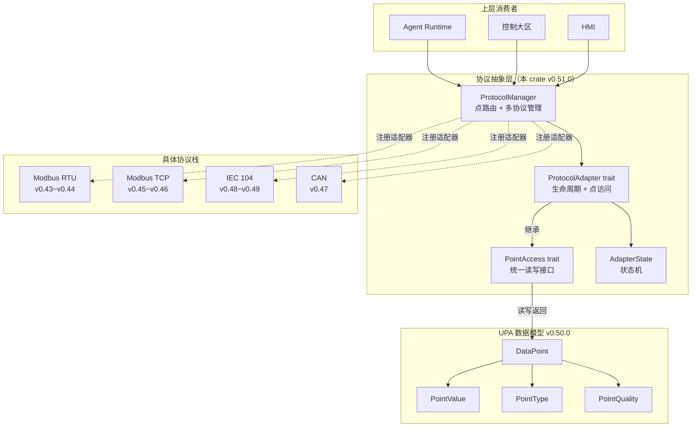
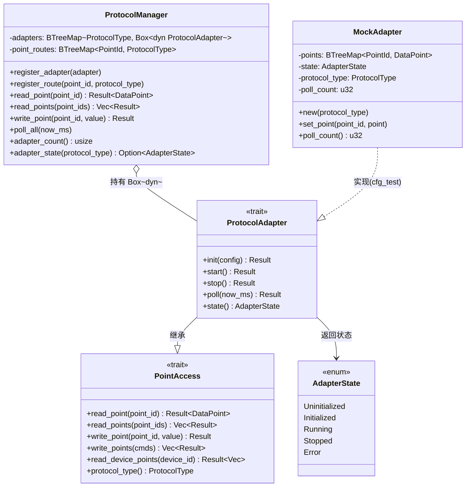

# EnerOS 协议抽象层设计文档（v0.51.0）

> **版本**：v0.51.0
> **crate**：`eneros-protocol-abstract`（`crates/protocols/protocol-abstract/`）
> **依赖**：`eneros-upa-model`（v0.50.0）
> **状态**：已实现（trait + MockAdapter + ProtocolManager）
> **覆盖版本**：v0.51.0
> **最后更新**：2026-07-15

---

## 目录

1. [概述](#1-概述)
2. [架构](#2-架构)
3. [核心类型](#3-核心类型)
4. [PointAccess](#4-pointaccess)
5. [ProtocolAdapter](#5-protocoladapter)
6. [ProtocolManager](#6-protocolmanager)
7. [地址模型](#7-地址模型)
8. [点映射](#8-点映射)
9. [配置](#9-配置)
10. [no_std 合规](#10-no_std-合规)
11. [测试策略](#11-测试策略)
12. [偏差声明](#12-偏差声明)

---

## 1. 概述

### 1.1 设计目标

协议抽象层（Protocol Abstraction Layer）是 EnerOS 协议栈的最上一层，为上层
（Agent Runtime / 控制大区）提供**协议无关**的统一数据点访问接口。它将
Modbus RTU/TCP、IEC 60870-5-104、CAN 三种异构协议栈抽象为统一的
`PointAccess` / `ProtocolAdapter` trait，并由 `ProtocolManager` 统一管理
多协议适配器与点路由。

### 1.2 设计原则

- **Simplicity First**：本版本仅定义 trait + mock 适配器 + ProtocolManager，
  不直接依赖具体协议实现（D1）。具体协议适配器为后续版本任务。
- **协议无关**：上层通过 `PointId` 访问数据点，无需感知底层协议类型。
  `ProtocolManager` 通过点路由表自动分发到对应适配器。
- **no_std 合规**：全 crate `#![cfg_attr(not(test), no_std)]`，仅使用
  `alloc::*` / `core::*`，外部依赖仅 `eneros-upa-model`。

### 1.3 在协议栈中的位置

协议抽象层位于协议栈最顶层，向下对接三种具体协议栈，向上对接 UPA 点表
模型与 Agent Runtime：

```
┌─────────────────────────────────────────┐
│  Agent Runtime / 控制大区 / HMI          │  上层消费者
├─────────────────────────────────────────┤
│  ProtocolManager（点路由 + 多协议管理）   │  ← 本 crate
├─────────────────────────────────────────┤
│  ProtocolAdapter trait（统一适配器抽象）  │  ← 本 crate
├──────────┬──────────┬───────────────────┤
│ Modbus   │ IEC 104  │ CAN               │  具体协议栈
│ RTU/TCP  │          │                   │  (v0.43~v0.49)
├──────────┴──────────┴───────────────────┤
│  UPA Model（DataPoint / PointValue）     │  v0.50.0
├─────────────────────────────────────────┤
│  HAL / 驱动层（UART / TCP / CAN）        │  v0.3~v0.39
└─────────────────────────────────────────┘
```

---

## 2. 架构

### 2.1 协议栈分层架构图



### 2.2 Trait 关系图



### 2.3 模块组织

```
crates/protocols/protocol-abstract/
├── Cargo.toml          # 包配置（依赖 eneros-upa-model）
└── src/
    ├── lib.rs          # crate 入口 + 偏差声明 + 集成测试
    ├── error.rs        # ProtocolError（9 变体）
    ├── address.rs      # ProtocolAddress（三协议统一地址）
    ├── mapping.rs      # ProtocolPointMapping（点映射 + 工程量变换）
    ├── config.rs       # ProtocolType / DeviceConfig / AdapterConfig
    ├── access.rs       # PointAccess trait
    ├── adapter.rs      # ProtocolAdapter trait + AdapterState
    ├── manager.rs      # ProtocolManager
    └── mock.rs         # MockAdapter（#[cfg(test)]）
```

---

## 3. 核心类型

### 3.1 ProtocolError

协议抽象层统一错误枚举，覆盖 9 类错误场景：

| 变体 | 含义 | 触发场景 |
|------|------|---------|
| `PointNotFound` | 点未找到 | 适配器点表无此 point_id |
| `AdapterNotFound` | 适配器未找到 | 协议类型未注册或路由缺失 |
| `AddrTypeMismatch` | 地址类型不匹配 | 对 IEC 104 地址执行 Modbus 操作 |
| `ReadFailed` | 读操作失败 | 协议层返回错误 |
| `WriteFailed` | 写操作失败 | 协议层返回错误 |
| `ProtocolInit` | 初始化失败 | config 无效或资源不足 |
| `ProtocolNotStarted` | 协议未启动 | start() 前执行读写 |
| `InvalidConfig` | 配置无效 | 字段缺失或取值非法 |
| `Unsupported` | 不支持的操作 | 对只读点写值 |

派生 `Debug`/`Clone`/`PartialEq`/`Eq`，便于测试精确匹配。

### 3.2 AdapterState

适配器状态机，5 个状态：

```
Uninitialized → init() → Initialized → start() → Running → stop() → Stopped
                                                                  ↓
                                                            任意失败 → Error
```

派生 `Debug`/`Clone`/`Copy`/`PartialEq`/`Eq`，可作值比较与传递。

---

## 4. PointAccess

### 4.1 接口定义

`PointAccess` 是协议抽象层最底层的访问 trait，定义单点/批量/按设备的读写能力：

```rust
pub trait PointAccess {
    fn read_point(&mut self, point_id: PointId) -> Result<DataPoint, ProtocolError>;
    fn read_points(&mut self, point_ids: &[PointId]) -> Vec<Result<DataPoint, ProtocolError>>;
    fn write_point(&mut self, point_id: PointId, value: PointValue) -> Result<(), ProtocolError>;
    fn write_points(&mut self, cmds: &[(PointId, PointValue)]) -> Vec<Result<(), ProtocolError>>;
    fn read_device_points(&mut self, device_id: DeviceId) -> Result<Vec<DataPoint>, ProtocolError>;
    fn protocol_type(&self) -> ProtocolType;
}
```

### 4.2 设计要点

- **不要求 `Send + Sync`**（D2）：no_std 单线程无需该约束，蓝图原 `PointAccess: Send + Sync` 为 std 约束。
- **不实现 `subscribe`/`unsubscribe`**（D3）：`Box<dyn Fn>` 在 no_std 无 `std::sync` 时复杂；变更上报改为 `poll()` 主动查询。
- **批量操作容错**：`read_points`/`write_points` 逐点执行，单点失败以 `Err` 返回，不影响其他点。
- **`protocol_type()` 用于路由**：`ProtocolManager` 通过该方法索引适配器。

---

## 5. ProtocolAdapter

### 5.1 接口定义

`ProtocolAdapter` 继承 `PointAccess`，增加生命周期管理：

```rust
pub trait ProtocolAdapter: PointAccess {
    fn init(&mut self, config: &AdapterConfig) -> Result<(), ProtocolError>;
    fn start(&mut self) -> Result<(), ProtocolError>;
    fn stop(&mut self) -> Result<(), ProtocolError>;
    fn poll(&mut self, now_ms: u64) -> Result<(), ProtocolError>;
    fn state(&self) -> AdapterState;
}
```

### 5.2 生命周期

```
new() → Uninitialized
  ↓ init(config)
Initialized
  ↓ start()
Running ←──── poll(now_ms) 循环
  ↓ stop()
Stopped
```

### 5.3 设计要点

- **`poll(now_ms)` 时间注入**（D5）：时间戳通过 `u64` 毫秒参数注入，与 v0.50.0 D1 一致，不依赖系统时钟。
- **trait object 兼容**：所有方法 `&mut self` / `&self`，返回具体类型，可作为 `Box<dyn ProtocolAdapter>`。
- **状态查询**：`state()` 返回 `AdapterState`，便于 `ProtocolManager` 监控。

---

## 6. ProtocolManager

### 6.1 结构

```rust
pub struct ProtocolManager {
    adapters: BTreeMap<ProtocolType, Box<dyn ProtocolAdapter>>,
    point_routes: BTreeMap<PointId, ProtocolType>,
}
```

### 6.2 路由机制

`ProtocolManager` 维护两张表：

1. **适配器表** `adapters`：`ProtocolType → Box<dyn ProtocolAdapter>`
   - 每种协议类型最多一个适配器实例
   - 注册时通过 `adapter.protocol_type()` 自动索引
2. **点路由表** `point_routes`：`PointId → ProtocolType`
   - 上层通过 `PointId` 访问，Manager 查路由表确定目标协议
   - 路由缺失返回 `AdapterNotFound`

```
read_point(point_id=42)
  ↓ 查 point_routes[42] → ModbusTcp
  ↓ 查 adapters[ModbusTcp] → adapter
  ↓ adapter.read_point(42) → DataPoint
```

### 6.3 设计要点

- **使用 `BTreeMap` 而非 `HashMap`**（D4）：no_std 友好、有序、key 可推导。
- **不使用 `Arc<RwLock<...>>`**（D4）：no_std 单线程无需，直接持有 `Box<dyn ProtocolAdapter>`。
- **`poll_all` 容错**：单个适配器 poll 失败不影响其他适配器（错误被忽略）。

---

## 7. 地址模型

### 7.1 ProtocolAddress

将三种协议的异构地址结构归一化为单一枚举：

```rust
pub enum ProtocolAddress {
    Modbus { slave_addr: u8, reg_addr: u16, func_code: u8 },
    Iec104 { common_addr: u16, ioa: u16, type_id: u8 },
    Can { can_id: u32, start_byte: u8, length: u8 },
}
```

### 7.2 字段说明

| 协议 | 字段 | 类型 | 说明 |
|------|------|------|------|
| Modbus | slave_addr | u8 | 从站地址（1~247） |
| Modbus | reg_addr | u16 | 寄存器地址（0~65535） |
| Modbus | func_code | u8 | 功能码（1/2/3/4/5/6/15/16） |
| IEC 104 | common_addr | u16 | ASDU 公共地址 |
| IEC 104 | ioa | u16 | 信息对象地址（IOA） |
| IEC 104 | type_id | u8 | 类型标识（TypeId） |
| CAN | can_id | u32 | CAN 标识符（11/29 位） |
| CAN | start_byte | u8 | 数据帧起始字节偏移 |
| CAN | length | u8 | 数据长度（字节数） |

派生 `Debug`/`Clone`/`PartialEq`/`Eq`，可在映射表中精确比较。

---

## 8. 点映射

### 8.1 ProtocolPointMapping

描述一个 UPA 点与底层协议地址的绑定关系，并提供线性工程量变换：

```rust
pub struct ProtocolPointMapping {
    pub point_id: PointId,
    pub device_id: DeviceId,
    pub protocol_addr: ProtocolAddress,
    pub data_type: PointType,
    pub scale: f64,
    pub offset: f64,
}
```

### 8.2 工程量变换

线性变换公式：

- `to_engineering(raw)` = `raw as f64 * scale + offset`
- `from_engineering(value)` = `((value - offset) / scale) as i64`

示例（scale=0.1, offset=10.0）：
- raw=100 → engineering = 100 × 0.1 + 10.0 = 20.0
- engineering=20.0 → raw = (20.0 - 10.0) / 0.1 = 100

### 8.3 设计要点

- 仅派生 `Debug`/`Clone`（含 `f64` 字段，不派生 `Eq`）。
- `scale` 为 0 时 `from_engineering` 会得到 `inf`/`NaN`，调用方应确保 `scale != 0`。

---

## 9. 配置

### 9.1 ProtocolType

协议类型枚举，可作 `BTreeMap` key：

```rust
#[derive(Debug, Clone, Copy, PartialEq, Eq, Hash, PartialOrd, Ord)]
pub enum ProtocolType {
    ModbusRtu,
    ModbusTcp,
    Iec104,
    Can,
    Internal,
}
```

派生 `Ord` 以便作为 `BTreeMap<ProtocolType, _>` 的 key（ProtocolManager 按协议类型索引适配器）。

### 9.2 DeviceConfig / AdapterConfig

```rust
pub struct DeviceConfig {
    pub device_id: DeviceId,
    pub name: String,
    pub address: ProtocolAddress,
}

pub struct AdapterConfig {
    pub name: String,
    pub protocol_type: ProtocolType,
    pub device_configs: Vec<DeviceConfig>,
}
```

`AdapterConfig` 作为 `ProtocolAdapter::init()` 的入参，描述一组同协议设备。

---

## 10. no_std 合规

### 10.1 合规声明

本 crate 严格遵循 EnerOS no_std 规范（蓝图 §43.1）：

| 项目 | 合规情况 |
|------|---------|
| `#![cfg_attr(not(test), no_std)]` | ✅ |
| `extern crate alloc` | ✅ |
| 仅用 `alloc::*` / `core::*` | ✅ |
| 无 `use std::*` | ✅ |
| 无 `panic!` / `todo!` / `unimplemented!` | ✅ |
| 子模块不重复 `no_std` 属性 | ✅（继承自 lib.rs） |
| 交叉编译 `aarch64-unknown-none` | ✅ 验证通过 |

### 10.2 依赖

- **`eneros-upa-model`**（path 依赖）：提供 `DataPoint`/`PointId`/`DeviceId`/`PointValue`/`PointType` 等类型。
- **零外部第三方依赖**：仅使用 `alloc`/`core`。

### 10.3 测试模式

- 测试代码（`#[cfg(test)]`）使用 std（由 `cfg_attr(not(test), no_std)` 控制）。
- `MockAdapter` 仅在 `#[cfg(test)]` 下编译，不污染生产构建。

---

## 11. 测试策略

### 11.1 测试覆盖

共 15 个测试（12 个核心 T1~T12 + 3 个附加），全部通过：

| 测试 | 覆盖点 |
|------|--------|
| T1 | MockAdapter read_point 正常 |
| T2 | MockAdapter read_point 点不存在 → PointNotFound |
| T3 | MockAdapter write_point 更新点值 |
| T4 | MockAdapter read_points 批量读取（含失败项） |
| T5 | MockAdapter read_device_points 按设备过滤 |
| T6 | ProtocolManager 注册适配器 + 路由 + 状态查询 |
| T7 | ProtocolManager read_point 按路由转发（含路由缺失） |
| T8 | ProtocolManager poll_all 轮询所有适配器 |
| T9 | ProtocolAdapter 生命周期（init→start→poll→stop） |
| T10 | ProtocolAddress 三变体构造与匹配 |
| T11 | ProtocolPointMapping 工程量转换（raw↔engineering 往返） |
| T12 | 多协议共存（ModbusRtu + Iec104 双适配器） |
| 附加1 | write_points 批量写入（含失败项） |
| 附加2 | ProtocolManager Default trait |
| 附加3 | protocol_type() 访问器 |

### 11.2 验证命令

```bash
cargo metadata --format-version 1                          # workspace 解析 ✅
cargo build -p eneros-protocol-abstract                    # 主机构建 ✅
cargo test -p eneros-protocol-abstract                     # 单元测试 ✅ (15 passed)
cargo build -p eneros-protocol-abstract --target aarch64-unknown-none \
    -Z build-std=core,alloc -Z build-std-features=compiler-builtins-mem  # 交叉编译 ✅
cargo fmt -p eneros-protocol-abstract -- --check           # 格式检查 ✅
cargo clippy -p eneros-protocol-abstract --all-targets -- -D warnings    # lint ✅
```

---

## 12. 偏差声明

| 偏差 | 说明 | 依据 |
|------|------|------|
| **D1** | 不直接依赖 `eneros-modbus-*`/`eneros-iec104-*`/`eneros-can`（适配器实现为后续版本任务；本版本仅定义 trait + mock 适配器 + ProtocolManager） | Karpathy Simplicity First |
| **D2** | 不实现 `Send + Sync` 约束（蓝图 `PointAccess: Send + Sync` 为 std 约束；no_std 单线程无需） | no_std 合规 |
| **D3** | 不实现 `subscribe`/`unsubscribe` 回调（蓝图含此项，但 `Box<dyn Fn>` 在 no_std 无 `std::sync` 时复杂；变更上报改为 `poll()` 主动查询，订阅机制后置） | Karpathy Simplicity First |
| **D4** | 不使用 `Arc<RwLock<PointDatabase>>`（蓝图含此项；no_std 无 Arc/RwLock；ProtocolManager 持有 `BTreeMap<ProtocolType, Box<dyn ProtocolAdapter>>`） | no_std 合规 |
| **D5** | 时间戳用 `u64` 毫秒参数注入（与 v0.50.0 D1 一致） | 时间注入模式 |
| **D6** | crate 放入 `crates/protocols/protocol-abstract/`（P1-F 协议栈最上一层） | 仓库目录规范 §2.3 |
| **D7** | 不实现 `DeviceDriver` trait（协议抽象层非设备驱动，与 v0.48.0~v0.50.0 一致） | 分层职责 |

---

## 附录：与上下游版本的关系

| 版本 | 关系 | 说明 |
|------|------|------|
| v0.50.0 | 上游依赖 | `eneros-upa-model` 提供 DataPoint/PointValue 等类型 |
| v0.43~v0.49 | 下游（未来） | Modbus/IEC 104/CAN 协议栈将实现 `ProtocolAdapter` trait |
| v0.52.0 | 下游（未来） | 四遥模型将基于本 crate 的 `PointAccess` 访问数据点 |
