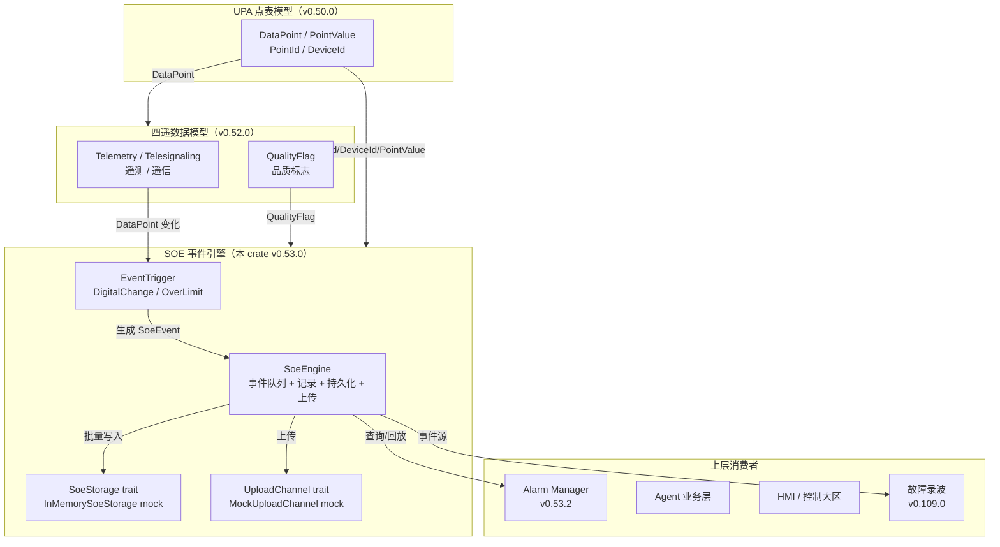
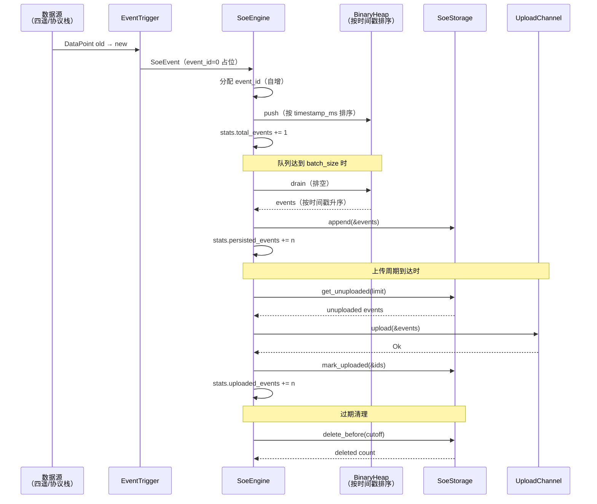

# EnerOS SOE 事件顺序记录引擎设计文档（v0.53.0）

> **版本**：v0.53.0
> **crate**：`eneros-soe-engine`（`crates/protocols/soe-engine/`）
> **依赖**：`eneros-upa-model`（v0.50.0）+ `eneros-telemetry-model`（v0.52.0）
> **状态**：设计稿（事件顺序记录层，事件队列 + 触发器 + 持久化 + 上传）
> **覆盖版本**：v0.53.0
> **最后更新**：2026-07-15
> **蓝图参考**：`蓝图/phase1.md` §v0.53.0

---

## 目录

1. [概述](#1-概述)
2. [架构](#2-架构)
3. [SoeEvent 数据模型](#3-soeevent-数据模型)
4. [事件类型与优先级](#4-事件类型与优先级)
5. [SoeStorage 抽象](#5-soestorage-抽象)
6. [UploadChannel 抽象](#6-uploadchannel-抽象)
7. [EventTrigger 触发器](#7-eventtrigger-触发器)
8. [SoeEngine 引擎](#8-soeengine-引擎)
9. [事件不乱序机制](#9-事件不乱序机制)
10. [no_std 合规](#10-no_std-合规)
11. [测试策略](#11-测试策略)
12. [偏差声明](#12-偏差声明)

---

## 1. 概述

### 1.1 版本背景

SOE（Sequence of Events，事件顺序记录）是电力系统故障分析的关键功能，
记录事件发生的精确时间顺序（ms 级分辨率）。当多个事件在极短时间内发生
（如继电保护动作序列），SOE 确保事件按真实发生时间排序，不因采集顺序而乱序。

本版本（v0.53.0）在 v0.50.0 统一点表模型（UPA）与 v0.52.0 四遥数据模型之上，
实现 SOE 事件队列、时标对齐、持久化存储和上传机制，为 v0.109.0 故障录波
与 Agent 业务层提供精确的事件回放序列。

### 1.2 设计目标

| 目标 | 说明 |
|------|------|
| **时序精确** | ms 级时标，事件按时间戳排序不乱序 |
| **可靠不丢** | 事件队列 + 批量持久化，确保事件不丢失 |
| **可追溯** | 故障后按时间顺序回放事件序列，分析故障原因 |
| **可扩展** | 触发器 trait 抽象，支持自定义事件触发规则 |
| **解耦** | 持久化/上传通过 trait 抽象，不直接耦合 TSDB/网络栈 |
| **no_std 合规** | 全 crate `#![cfg_attr(not(test), no_std)]`，仅依赖 `alloc` |

### 1.3 架构定位

- **P1-G 四遥与 SOE 第二层**：事件记录与故障分析层（v0.52.0 四遥模型 → v0.53.0 SOE 引擎）
- **协议栈位置**：位于四遥数据模型（v0.52.0）之上、Agent 业务层与告警管理（v0.53.2）之下
- **数据来源**：通过 `DataPoint` 变化驱动事件触发器，生成 `SoeEvent`

### 1.4 前置依赖

| 依赖版本 | 依赖产出 | 用途 |
|---------|---------|------|
| **v0.50.0** | `eneros-upa-model`（`DataPoint`/`PointId`/`DeviceId`/`PointValue`/`PointType`/`PointQuality`） | SOE 复用 UPA 的点 ID、设备 ID、点值类型 |
| **v0.52.0** | `eneros-telemetry-model`（`QualityFlag`） | 事件品质标志复用四遥品质枚举 |
| v0.12.0 | 系统时钟（RTC + 单调时钟） | 时标来源（通过 `u64` 毫秒参数注入，D1） |

### 1.5 交付物清单

| 类型 | 交付物 | 描述 |
|------|--------|------|
| 代码模块 | `soe-engine` crate | SOE 事件引擎 |
| 接口 | `SoeEvent` | 事件结构（11 字段） |
| 接口 | `SoeEventType` | 事件类型枚举（11 变体） |
| 接口 | `EventPriority` | 事件优先级枚举（4 级） |
| 接口 | `SoeEngine` | 事件引擎（队列/记录/持久化/上传/清理） |
| 接口 | `SoeStorage` trait | 持久化存储抽象 + `InMemorySoeStorage` mock |
| 接口 | `UploadChannel` trait | 上传通道抽象 + `MockUploadChannel` mock |
| 接口 | `EventTrigger` trait | 事件触发器抽象 + 2 个内置触发器 |
| 测试 | 20 个集成测试 | 覆盖事件/存储/上传/触发器/引擎全链路 |
| 文档 | 本设计文档 | 架构 / 不乱序机制 / 偏差声明 |

---

## 2. 架构

### 2.1 协议栈分层架构图



### 2.2 事件流程图



### 2.3 模块组成

| 模块 | 职责 |
|------|------|
| `event.rs` | 事件数据模型：`SoeEvent`/`SoeEventType`/`EventPriority` |
| `config.rs` | 引擎配置与统计：`SoeConfig`/`SoeStats` |
| `error.rs` | 错误类型：`SoeError` |
| `storage.rs` | 持久化抽象：`SoeStorage` trait + `InMemorySoeStorage` |
| `upload.rs` | 上传抽象：`UploadChannel` trait + `MockUploadChannel` |
| `trigger.rs` | 触发器抽象：`EventTrigger` trait + 2 个内置触发器 |
| `engine.rs` | 核心引擎：`SoeEngine`（队列/记录/持久化/上传/清理） |

---

## 3. SoeEvent 数据模型

### 3.1 结构定义

```rust
pub struct SoeEvent {
    pub event_id: u64,           // 事件 ID（全局唯一，由引擎分配）
    pub timestamp_ms: u64,       // 事件时标（ms 级，单调时钟，D1）
    pub system_time_ms: u64,     // 系统时间（用于显示与同步，D9）
    pub point_id: PointId,       // 关联点 ID
    pub device_id: DeviceId,     // 关联设备 ID
    pub event_type: SoeEventType,// 事件类型
    pub old_value: PointValue,   // 事件前值
    pub new_value: PointValue,   // 事件后值
    pub quality: QualityFlag,    // 事件品质
    pub priority: EventPriority, // 事件优先级
    pub description: String,     // 事件描述
}
```

### 3.2 字段说明

| 字段 | 类型 | 说明 |
|------|------|------|
| `event_id` | `u64` | 全局唯一递增 ID，由引擎在 `record_event()` 分配；构造时置 0 占位 |
| `timestamp_ms` | `u64` | 事件发生时标（ms 级），用于排序与查询（D1：u64 替代 `MonotonicTime`） |
| `system_time_ms` | `u64` | 系统时间，用于显示与 NTP 同步（D9：u64 替代 `SystemTime::now()`） |
| `point_id` | `PointId`（u32） | 关联数据点 ID，复用 UPA |
| `device_id` | `DeviceId`（u16） | 关联设备 ID，复用 UPA |
| `event_type` | `SoeEventType` | 事件类型（11 变体） |
| `old_value` | `PointValue` | 事件前值，复用 UPA |
| `new_value` | `PointValue` | 事件后值，复用 UPA |
| `quality` | `QualityFlag` | 事件品质，复用四遥模型 |
| `priority` | `EventPriority` | 事件优先级（4 级） |
| `description` | `String` | 人类可读描述 |

### 3.3 构造方法

`SoeEvent::new()` 接收点 ID、设备 ID、事件类型、前后值、品质、优先级、描述与时间戳，
构造事件（`event_id` 置 0，由引擎后续分配）。`is_critical()` 判断是否为紧急事件。

---

## 4. 事件类型与优先级

### 4.1 SoeEventType（11 变体）

| 变体 | 说明 | 典型触发器 |
|------|------|------------|
| `DigitalChange` | 遥信变位（开关状态变化） | `DigitalChangeTrigger` |
| `AnalogOverLimit` | 遥测越限（超过上限/下限） | `OverLimitTrigger` |
| `AnalogRecovery` | 遥测恢复（越限恢复） | `OverLimitTrigger` |
| `QualityChange` | 品质变化（Good→Invalid 等） | 自定义触发器 |
| `ControlExecute` | 遥控执行 | 自定义触发器 |
| `ControlDone` | 遥控完成 | 自定义触发器 |
| `ControlFailed` | 遥控失败 | 自定义触发器 |
| `ManualSet` | 人工置数 | 自定义触发器 |
| `CommLost` | 设备通信中断 | 自定义触发器 |
| `CommRestore` | 设备通信恢复 | 自定义触发器 |
| `Custom(u16)` | 自定义事件 | 自定义触发器 |

### 4.2 EventPriority（4 级）

| 级别 | 值 | 说明 | 典型场景 |
|------|----|------|---------|
| `Critical` | 0 | 紧急 | 保护动作/严重故障 |
| `High` | 1 | 高 | 告警/越限 |
| `Medium` | 2 | 中 | 状态变化/恢复 |
| `Low` | 3 | 低 | 品质变化/信息 |

派生 `PartialOrd`/`Ord`，值越小优先级越高，可用于事件过滤与排序。

---

## 5. SoeStorage 抽象

### 5.1 设计动机

SOE 事件需要持久化存储以支持故障后回放。但 no_std 环境下不直接依赖 v0.25.0
TSDB（时序数据库），而是通过 trait 抽象解耦（D4），与 v0.49.0 transport trait
模式一致。生产环境注入 TSDB 实现，测试环境使用 `InMemorySoeStorage` mock。

### 5.2 trait 定义

```rust
pub trait SoeStorage {
    fn append(&mut self, events: &[SoeEvent]) -> Result<(), SoeError>;
    fn query_by_time(&self, start_ms: u64, end_ms: u64) -> Result<Vec<SoeEvent>, SoeError>;
    fn query_by_device(&self, device_id: DeviceId, limit: usize) -> Result<Vec<SoeEvent>, SoeError>;
    fn get_latest(&self, count: usize) -> Vec<SoeEvent>;
    fn get_unuploaded(&self, limit: usize) -> Result<Vec<SoeEvent>, SoeError>;
    fn mark_uploaded(&mut self, event_ids: &[u64]) -> Result<(), SoeError>;
    fn delete_before(&mut self, cutoff_ms: u64) -> Result<usize, SoeError>;
}
```

### 5.3 InMemorySoeStorage

内存 mock 实现，用于测试与开发：
- `events: Vec<SoeEvent>` — 按 timestamp_ms 升序存储
- `uploaded_ids: BTreeSet<u64>` — 已上传事件 ID 集合
- 所有方法基于线性扫描实现，适合小规模测试数据

---

## 6. UploadChannel 抽象

### 6.1 设计动机

SOE 事件需上传到云端运维平台/SCADA 主站。但 no_std 环境下不直接依赖网络栈
（v0.28.0 smoltcp），而是通过 trait 抽象解耦（D5）。生产环境注入 MQTT（v0.53.1）
或其他传输实现，测试环境使用 `MockUploadChannel` mock。

### 6.2 trait 定义

```rust
pub trait UploadChannel {
    fn upload(&mut self, events: &[SoeEvent]) -> Result<(), SoeError>;
    fn is_connected(&self) -> bool;
}
```

### 6.3 MockUploadChannel

内存 mock 实现：
- `upload_count: u32` — 上传调用次数
- `uploaded_events: Vec<SoeEvent>` — 已上传事件列表
- `connected: bool` — 连接状态（可通过 `set_connected()` 设置）
- 未连接时 `upload()` 返回 `Err(UploadError)`

---

## 7. EventTrigger 触发器

### 7.1 trait 定义

```rust
pub trait EventTrigger {
    fn check(&self, old: &DataPoint, new: &DataPoint, now_ms: u64) -> Option<SoeEvent>;
}
```

不要求 `Send + Sync`（D7/D10：no_std 单线程）。`now_ms` 参数注入时间戳（D1/D9）。

### 7.2 DigitalChangeTrigger

遥信变位触发器：
- **触发条件**：`old.point_type == Digital` 且 `old.value != new.value`
- **生成事件**：`SoeEventType::DigitalChange`，`EventPriority::Medium`
- **描述格式**：`"{name}: {old:?} -> {new:?}"`

### 7.3 OverLimitTrigger

遥测越限触发器：
- **配置**：`BTreeMap<PointId, (high_limit, low_limit)>`，通过 `add_limit()` 配置
- **触发条件**：`new.point_type == Analog`，值为 `PointValue::Float`
- **越限检测**：
  - 旧值在限内（含 Null 首次读取）且新值越限 → `AnalogOverLimit` / `High`
  - 旧值越限且新值在限内 → `AnalogRecovery` / `Medium`
  - 其他情况不触发
- **越限判定**：`value > high || value < low`
- **Null 处理**：旧值为 `Null`（首次读取）视为"在限内"

### 7.4 品质映射

`PointQuality`（UPA 的 7 位标志组合）通过 `point_quality_to_flag()` 映射为
主导 `QualityFlag`（四遥单选枚举），优先级：Invalid > Questionable > Substituted
> Blocked > Overflow > Outdated > Good。

---

## 8. SoeEngine 引擎

### 8.1 结构

```rust
pub struct SoeEngine {
    event_queue: BinaryHeap<EventByTimestamp>,  // 按时间戳升序出队（D6）
    next_event_id: u64,                          // 事件 ID 自增器（D8：非 AtomicU64）
    triggers: Vec<Box<dyn EventTrigger>>,        // 触发器列表
    storage: Box<dyn SoeStorage>,                // 持久化存储
    upload_channel: Option<Box<dyn UploadChannel>>,// 上传通道
    config: SoeConfig,                           // 引擎配置
    stats: SoeStats,                             // 运行时统计
}
```

### 8.2 核心方法

| 方法 | 说明 |
|------|------|
| `new(config, storage)` | 构造引擎 |
| `add_trigger(trigger)` | 添加事件触发器 |
| `set_upload_channel(channel)` | 设置上传通道 |
| `record_event(event)` | 记录事件：分配 ID、入队、统计；达到 batch_size 自动持久化 |
| `process_point_change(old, new, now_ms)` | 处理数据点变化：遍历触发器，记录每个触发的事件 |
| `persist_events()` | 批量持久化：排空队列，按时间戳排序后写入存储 |
| `query_by_time(start, end)` | 按时间范围查询（委托 storage） |
| `query_by_device(device_id, limit)` | 按设备查询（委托 storage） |
| `get_latest(count)` | 获取最新事件（委托 storage） |
| `upload_events()` | 上传未上传事件，返回上传条数 |
| `cleanup_expired(now_ms)` | 清理过期事件（按 retention_days 计算 cutoff） |
| `stats()` | 返回运行时统计 |

### 8.3 record_event 流程

1. 分配 `event_id = next_event_id`，自增 `next_event_id`
2. 事件入队（`BinaryHeap` 按 `timestamp_ms` 排序）
3. `stats.total_events += 1`
4. 若队列长度 ≥ `config.persist_batch_size`，调用 `persist_events()`
5. 返回 `event_id`

### 8.4 upload_events 流程

1. 若上传通道为 None 或未连接，返回 `Ok(0)`
2. 从 storage 获取未上传事件（limit = `persist_batch_size`）
3. 调用 `upload_channel.upload(&events)`
4. 调用 `storage.mark_uploaded(&ids)`
5. `stats.uploaded_events += count`
6. 返回上传条数

### 8.5 cleanup_expired 流程

1. 计算 `cutoff = now_ms - retention_days * 86400000`（saturating_sub 防下溢）
2. 调用 `storage.delete_before(cutoff)`
3. 返回删除条数

---

## 9. 事件不乱序机制

### 9.1 问题

电力系统中，多个事件可能在极短时间内发生（如继电保护动作序列）。由于采集延迟，
先发生的事件可能后到达，导致事件乱序。SOE 必须确保事件按真实发生时间排序。

### 9.2 解决方案

使用 `alloc::collections::BinaryHeap`（D6：no_std 友好）作为事件优先队列：

1. **入队**：事件按 `timestamp_ms` 入堆
2. **逆序 Ord**：`EventByTimestamp` 包装实现逆序 `Ord`——时间戳越大排得越"小"，
   使最大堆弹出最小时间戳事件
3. **持久化排序**：`persist_events()` 排空堆后按 `timestamp_ms` 稳定排序，
   双重保证不乱序

### 9.3 EventByTimestamp 实现

```rust
struct EventByTimestamp(SoeEvent);

impl Ord for EventByTimestamp {
    fn cmp(&self, other: &Self) -> Ordering {
        // 逆序：时间戳越大排得越"小"，最大堆弹出最小时间戳
        other.0.timestamp_ms.cmp(&self.0.timestamp_ms)
    }
}
```

由于 `SoeEvent` 包含 `PointValue::Float(f64)`，不实现 `Eq`，因此 `EventByTimestamp`
手动实现 `PartialEq`/`Eq`/`PartialOrd`/`Ord`，仅比较 `timestamp_ms`。

### 9.4 验证

T17 测试验证：三个事件以 t=300、t=100、t=200 乱序入队，持久化后查询顺序为
t=100 → t=200 → t=300（升序）。

---

## 10. no_std 合规

### 10.1 合规声明

本 crate `#![cfg_attr(not(test), no_std)]` + `extern crate alloc`。
仅使用 `alloc::*` 与 `core::*`，不使用任何 `std::*`。

### 10.2 依赖链

```
eneros-soe-engine
├── eneros-upa-model（纯数据模型，no_std）
└── eneros-telemetry-model（纯数据模型，no_std）
```

### 10.3 alloc 使用

| 用途 | 类型 |
|------|------|
| 事件描述 | `alloc::string::String` |
| 事件队列 | `alloc::collections::BinaryHeap` |
| 越限配置 | `alloc::collections::BTreeMap` |
| 已上传集合 | `alloc::collections::BTreeSet` |
| 事件列表 | `alloc::vec::Vec` |
| trait 对象 | `alloc::boxed::Box` |
| 格式化描述 | `alloc::format!` |

### 10.4 禁用项

- ❌ `use std::*`
- ❌ `panic!` / `todo!` / `unimplemented!`（workspace clippy 禁止）
- ❌ `Send + Sync` 约束（D7/D10）
- ❌ `AtomicU64`（D8：单线程用 `u64` 自增）

---

## 11. 测试策略

### 11.1 测试覆盖

20 个集成测试（T1~T20），覆盖全链路：

| 测试 | 范围 | 说明 |
|------|------|------|
| T1 | SoeEvent | 构造与 is_critical |
| T2 | SoeEventType | 11 变体覆盖 |
| T3 | EventPriority | 排序（Critical < High < Medium < Low） |
| T4 | SoeConfig | 默认值 |
| T5 | InMemorySoeStorage | append + query_by_time |
| T6 | InMemorySoeStorage | query_by_device |
| T7 | InMemorySoeStorage | get_latest |
| T8 | InMemorySoeStorage | mark_uploaded + get_unuploaded |
| T9 | InMemorySoeStorage | delete_before |
| T10 | MockUploadChannel | 上传统计 |
| T11 | DigitalChangeTrigger | 检测变位 |
| T12 | DigitalChangeTrigger | 同值不触发 |
| T13 | OverLimitTrigger | 越上限触发 |
| T14 | OverLimitTrigger | 越下限触发 |
| T15 | OverLimitTrigger | 恢复事件触发 |
| T16 | SoeEngine | record_event 分配 event_id 递增 |
| T17 | SoeEngine | 事件不乱序 |
| T18 | SoeEngine | process_point_change 触发多事件 |
| T19 | SoeEngine | upload_events 流程 |
| T20 | SoeEngine | cleanup_expired 清理过期事件 |

### 11.2 测试规范

- `SoeEvent` 不派生 `PartialEq`（因 `PointValue` 含 `f64`），Result 类型断言
  使用 `assert!(matches!(...))` 而非 `assert_eq!`
- 数值字段（`event_id`/`timestamp_ms` 等）使用 `assert_eq!`
- 测试辅助函数 `make_digital_point()` / `make_analog_point()` 构造 `DataPoint`

---

## 12. 偏差声明

### 12.1 D1~D10 偏差表

| 偏差 | 说明 |
|------|------|
| **D1** | 时间戳用 `u64` 毫秒参数注入（蓝图 `MonotonicTime`/`SystemTime` 在 no_std 不存在；与 v0.50.0~v0.52.0 D1 一致） |
| **D2** | crate 放入 `crates/protocols/soe-engine/`（P1-G 四遥与 SOE，与 upa-model/telemetry-model 同级） |
| **D3** | 仅依赖 `eneros-upa-model` + `eneros-telemetry-model`（复用 PointId/DeviceId/PointValue/QualityFlag） |
| **D4** | 持久化抽象为 `SoeStorage` trait + `InMemorySoeStorage` mock 实现（不直接依赖 v0.25.0 TSDB） |
| **D5** | 上传抽象为 `UploadChannel` trait + `MockUploadChannel` mock 实现（不直接依赖网络栈） |
| **D6** | 优先队列使用 `alloc::collections::BinaryHeap`（no_std 友好；蓝图 `PriorityQueue` 无标准实现） |
| **D7** | 不要求 `Send + Sync`（no_std 单线程；与 v0.51.0 D2 一致） |
| **D8** | 不使用 `AtomicU64`（no_std 单线程，`next_event_id: u64` 自增；蓝图 `AtomicU64` 改为 `u64`） |
| **D9** | `SystemTime::now()` 改为 `now_ms: u64` 参数注入（与 D1 一致） |
| **D10** | 不实现 `EventTrigger: Send + Sync`（与 D7 一致） |

### 12.2 偏差理由

- **D1/D9**：no_std 无 `SystemTime`/`MonotonicTime`，时间戳通过 `u64` 毫秒参数注入，
  由调用方（RTC/单调时钟服务）提供，与 v0.50.0~v0.52.0 全项目一致。
- **D4/D5**：trait 抽象是 EnerOS 协议栈一贯模式（v0.49.0 transport trait），
  解耦底层实现，便于测试与未来替换。
- **D6**：`BinaryHeap` 是 `alloc` 提供的标准优先队列，no_std 友好。
- **D7/D8/D10**：no_std 单线程环境无需原子操作与线程安全约束，
  `&mut self` 方法保证独占访问，简化实现（Simplicity First）。

---

> **使用方式**：本 crate 为 v0.53.2 告警管理与 v0.109.0 故障录波提供事件源。
> 生产环境注入 TSDB-backed `SoeStorage` 与 MQTT-backed `UploadChannel` 实现。
