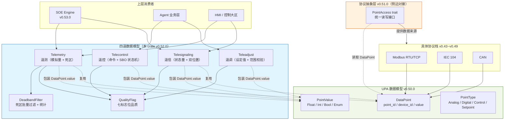
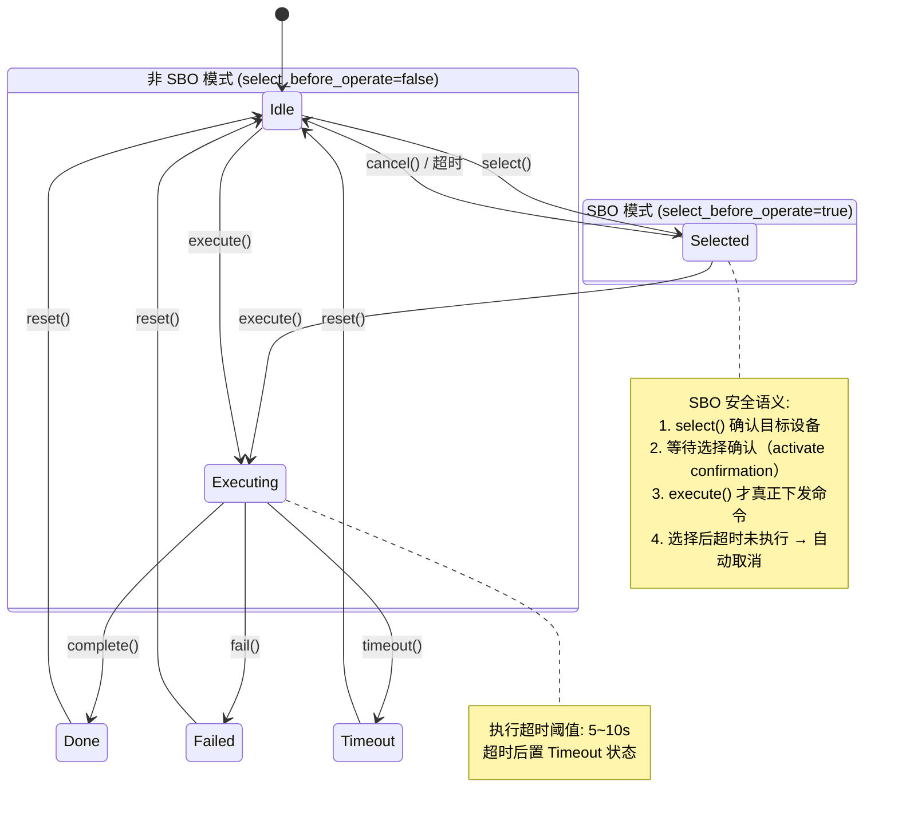

# EnerOS 四遥标准数据模型设计文档（v0.52.0）

> **版本**：v0.52.0
> **crate**：`eneros-telemetry-model`（`crates/protocols/telemetry-model/`）
> **依赖**：`eneros-upa-model`（v0.50.0）
> **状态**：设计稿（数据模型层，四遥定义 + 死区过滤 + 变化上报）
> **覆盖版本**：v0.52.0
> **最后更新**：2026-07-15
> **蓝图参考**：`蓝图/phase1.md` §v0.52.0

---

## 目录

1. [概述](#1-概述)
2. [架构](#2-架构)
3. [品质标志 QualityFlag](#3-品质标志-qualityflag)
4. [遥测模型 Telemetry](#4-遥测模型-telemetry)
5. [遥信模型 Telesignaling](#5-遥信模型-telesignaling)
6. [遥控模型 Telecontrol](#6-遥控模型-telecontrol)
7. [遥调模型 Teleadjust](#7-遥调模型-teleadjust)
8. [死区过滤 DeadbandFilter](#8-死区过滤-deadbandfilter)
9. [变化上报机制](#9-变化上报机制)
10. [no_std 合规](#10-no_std-合规)
11. [测试策略](#11-测试策略)
12. [偏差声明](#12-偏差声明)

---

## 1. 概述

### 1.1 版本背景

四遥（遥测 / 遥信 / 遥控 / 遥调）是电力 SCADA 系统的核心数据模型，
也是 EnerOS P1-G 阶段（四遥与 SOE）的第一层基础服务。本版本
（v0.52.0）在 v0.50.0 统一点表模型（UPA）与 v0.51.0 协议抽象层
（PointAccess）之上，定义电力行业专用的四遥数据模型，包含数据品质
标志、死区过滤与变化上报机制，为 v0.53.0 SOE 事件顺序记录引擎与
Agent 业务层提供标准化的电力数据视图。

### 1.2 设计目标

| 目标 | 说明 |
|------|------|
| **行业标准化** | 遵循 IEC 60870-5 品质描述符语义，与电力 SCADA 主站/从站兼容 |
| **效率优化** | 死区过滤大幅减少遥测无效上报通信量（典型场景降低 70%~90%） |
| **变化驱动** | 遥信状态变化立即上报（无死区）；遥测超死区上报；品质变化强制上报 |
| **遥控安全** | 重要遥控支持 Select-Before-Operate（SBO）两阶段执行，防止误操作 |
| **no_std 合规** | 全 crate `#![cfg_attr(not(test), no_std)]`，仅依赖 `eneros-upa-model` |

### 1.3 架构定位

- **P1-G 四遥与 SOE 第一层**：电力数据标准化层（v0.52.0 四遥模型 → v0.53.0 SOE 引擎）
- **协议栈位置**：位于 UPA 点表模型（v0.50.0）之上、SOE 引擎与 Agent 业务层之下
- **数据来源**：通过 PointAccess（v0.51.0）从底层协议栈读取的 `DataPoint`，由本 crate 包装为四遥专用模型

### 1.4 前置依赖

| 依赖版本 | 依赖产出 | 用途 |
|---------|---------|------|
| **v0.50.0** | `eneros-upa-model`（`DataPoint`/`PointId`/`DeviceId`/`PointValue`/`PointType`） | 四遥复用 UPA 的点 ID、设备 ID、点值类型，避免重复定义（D3） |
| **v0.51.0** | `PointAccess` trait | 四遥数据通过统一接口从协议适配器读取（本 crate 不直接依赖，仅概念对接，D5） |
| v0.12.0 | 系统时钟（RTC + 单调时钟） | 时标来源（本 crate 通过 `u64` 毫秒参数注入，不直接依赖，D1） |

> **依赖说明**：本 crate **仅依赖 `eneros-upa-model`**（D3），不依赖
> `eneros-protocol-abstract`。四遥是数据定义层，`PointAccess` 是协议适配器层，
> 二者通过 `DataPoint` 在调用方（SOE 引擎 / Agent）处对接（D5）。

### 1.5 交付物清单

| 类型 | 交付物 | 描述 |
|------|--------|------|
| 代码模块 | `telemetry-model` crate | 四遥数据模型 |
| 接口 | `QualityFlag` | 七标志位品质枚举 |
| 接口 | `Telemetry` | 遥测模型（模拟量 + 死区 + 限值） |
| 接口 | `Telesignaling` | 遥信模型（状态量 + 双位置） |
| 接口 | `Telecontrol` | 遥控模型（控制命令 + SBO 状态机） |
| 接口 | `Teleadjust` | 遥调模型（设定值 + 范围校验 + 变化率） |
| 接口 | `DeadbandFilter` | 死区过滤器（批量管理 + 统计） |
| 测试 | 20 个集成测试 | 覆盖死区/变化检测/SBO/范围校验/统计 |
| 文档 | 本设计文档 | 品质标志 / 死区配置 / 变化上报机制 |

---

## 2. 架构

### 2.1 协议栈分层架构图



### 2.2 数据流说明

四遥模型在协议栈中的数据流向：

```
设备(Modbus/IEC104/CAN)
  ↓ 协议适配器读取
DataPoint (UPA, v0.50.0)
  ↓ PointAccess.read_point() (v0.51.0)
  ↓ 调用方(SOE/Agent)按 PointType 分发包装
Telemetry / Telesignaling / Telecontrol / Teleadjust (本 crate v0.52.0)
  ↓ should_report() / DeadbandFilter 判定
  ↓ 变化上报 / 死区过滤
SOE 事件队列 / Agent 决策 / HMI 显示
```

- **PointType.Analog** → 包装为 `Telemetry`（死区过滤 + 限值检测）
- **PointType.Digital** → 包装为 `Telesignaling`（状态变化立即上报）
- **PointType.Control** → 包装为 `Telecontrol`（SBO 状态机）
- **PointType.Setpoint** → 包装为 `Teleadjust`（范围校验 + 变化率）

### 2.3 模块组织

```
crates/protocols/telemetry-model/
├── Cargo.toml          # 包配置（依赖 eneros-upa-model）
└── src/
    ├── lib.rs          # crate 入口 + 偏差声明 + 集成测试
    ├── quality.rs      # QualityFlag（七标志位品质枚举）
    ├── telemetry.rs    # Telemetry（遥测 + 死区 + 限值）
    ├── telesignaling.rs # Telesignaling（遥信 + 双位置 + 变化检测）
    ├── telecontrol.rs  # Telecontrol + ControlCommand + ControlExecState + SBO
    ├── teleadjust.rs   # Teleadjust（设定值 + 范围校验 + 变化率）
    └── deadband.rs     # DeadbandFilter + PointDeadband（批量过滤 + 统计）
```

### 2.4 与上下游版本的关系

| 版本 | 关系 | 说明 |
|------|------|------|
| v0.50.0 | 上游依赖 | `eneros-upa-model` 提供 `PointId`/`DeviceId`/`PointValue`/`PointType` |
| v0.51.0 | 概念对接 | `PointAccess` 读取 `DataPoint`，由调用方包装为四遥模型（D5 不直接依赖） |
| v0.53.0 | 下游（未来） | SOE 引擎消费 `Telesignaling` 变化事件、`Telemetry` 品质变化 |
| Agent | 下游（未来） | Agent 业务层下发 `Telecontrol` 命令、读取 `Teleadjust` 设定值 |

---

## 3. 品质标志 QualityFlag

### 3.1 设计依据

品质标志参照 **IEC 60870-5-101/104** 的 QualityDescriptor（品质描述符），
将电力 SCADA 系统的数据品质归一化为 7 个互斥状态枚举。与
`eneros-upa-model` 的 `PointQuality`（七布尔位结构体，可叠加）不同，
本 crate 的 `QualityFlag` 为**互斥枚举**，便于四遥模型的状态判定与
变化检测（品质从 A→B 即触发强制上报）。

### 3.2 枚举定义

```rust
/// 四遥数据品质标志（IEC 60870-5 兼容）。
///
/// 互斥枚举：任一时刻一个数据点只有一个品质状态。
/// 品质变化即触发强制上报（见 §9 变化上报机制）。
#[derive(Debug, Clone, Copy, PartialEq, Eq)]
pub enum QualityFlag {
    /// 数据有效。
    Good,
    /// 数据无效（设备故障 / 通信中断）。
    Invalid,
    /// 数据可疑（越限 / 异常波动）。
    Questionable,
    /// 替代值（人工置数 / 估算值）。
    Substituted,
    /// 闭锁（设备检修 / 手动闭锁）。
    Blocked,
    /// 溢出（A/D 量程溢出）。
    Overflow,
    /// 过时（长时间未更新）。
    Outdated,
}
```

### 3.3 品质语义表

| 品质标志 | 含义 | IEC 60870-5 对应 | 触发场景 | 上报策略 |
|---------|------|-----------------|---------|---------|
| `Good` | 数据有效 | IV=0, NT=0, SB=0, BL=0, OV=0 | 正常采集，值在合理范围 | 死区过滤 |
| `Invalid` | 数据无效 | IV=1 | 设备故障、通信中断、协议解析失败 | 强制上报 + 告警 |
| `Questionable` | 数据可疑 | NT=1 | 越限（超过 high_limit/low_limit）、异常波动 | 强制上报 + 告警 |
| `Substituted` | 替代值 | SB=1 | 人工置数、估算值、上次有效值替代 | 强制上报（标记非实测） |
| `Blocked` | 闭锁 | BL=1 | 设备检修、手动闭锁、挂牌 | 不上报（闭锁期间静默） |
| `Overflow` | 溢出 | OV=1 | A/D 转换量程溢出、传感器饱和 | 强制上报 + 告警 |
| `Outdated` | 过时 | — | 超过更新周期阈值未收到新值 | 强制上报 + 告警 |

### 3.4 与 UPA PointQuality 的映射

| 本 crate `QualityFlag` | UPA `PointQuality`（v0.50.0） | 映射规则 |
|----------------------|------------------------------|---------|
| `Good` | `{ valid: true, 其余 false }` | 直接映射 |
| `Invalid` | `{ invalid: true }` | 直接映射 |
| `Questionable` | `{ questionable: true }` | 直接映射 |
| `Substituted` | `{ substituted: true }` | 直接映射 |
| `Blocked` | `{ blocked: true }` | 直接映射 |
| `Overflow` | `{ overflow: true }` | 直接映射 |
| `Outdated` | `{ outdated: true }` | 直接映射 |

> **多标志位处理**：当 UPA `PointQuality` 同时置多个标志位时（如
> `invalid + overflow`），按优先级映射：`Invalid > Overflow > Blocked >
> Outdated > Substituted > Questionable > Good`。

### 3.5 辅助方法

```rust
impl QualityFlag {
    /// 数据是否可信（可用于决策是否参与控制逻辑）。
    pub fn is_trusted(&self) -> bool {
        matches!(self, QualityFlag::Good)
    }

    /// 是否需要强制上报（除 Good/Blocked 外均强制上报）。
    pub fn force_report(&self) -> bool {
        !matches!(self, QualityFlag::Good | QualityFlag::Blocked)
    }
}
```

---

## 4. 遥测模型 Telemetry

### 4.1 结构定义

遥测（Telemetry）表示电力系统的**模拟量**数据，如电压、电流、功率、
温度、频率等。遥测是四遥中数据量最大、上报频率最高的类型，因此
死区过滤是其核心机制。

```rust
use alloc::string::String;
use eneros_upa_model::{DeviceId, PointId};

/// 遥测（Telemetry - 模拟量）。
///
/// `timestamp_ms` 为注入的 u64 毫秒时间戳（D1，蓝图原 `timestamp: MonotonicTime`）。
#[derive(Debug, Clone)]
pub struct Telemetry {
    pub point_id: PointId,
    pub device_id: DeviceId,
    pub name: String,
    /// 工程量值。
    pub value: f64,
    /// 单位（V/A/kW/℃/Hz）。
    pub unit: String,
    pub quality: QualityFlag,
    /// 时间戳（数据采集时间，u64 毫秒，D1）。
    pub timestamp_ms: u64,
    /// 死区配置（变化超过死区才上报）。
    pub deadband: f64,
    /// 上限（越限置 Questionable）。
    pub high_limit: Option<f64>,
    /// 下限（越限置 Questionable）。
    pub low_limit: Option<f64>,
    /// 上次上报值（内部状态，死区过滤用）。
    last_reported: Option<f64>,
}
```

### 4.2 字段说明

| 字段 | 类型 | 说明 |
|------|------|------|
| `point_id` | `PointId`（u32） | 点唯一标识（复用 UPA，D3） |
| `device_id` | `DeviceId`（u16） | 所属设备 ID（复用 UPA，D3） |
| `name` | `String` | 点名称（人类可读） |
| `value` | `f64` | 工程量值（已线性变换后的实际值） |
| `unit` | `String` | 工程量单位（V/A/kW/℃/Hz 等） |
| `quality` | `QualityFlag` | 数据品质（见 §3） |
| `timestamp_ms` | `u64` | 采集时间戳（毫秒，D1 时间注入） |
| `deadband` | `f64` | 死区阈值（如电压 0.5V、温度 1℃） |
| `high_limit` | `Option<f64>` | 上限（越限置 Questionable） |
| `low_limit` | `Option<f64>` | 下限（越限置 Questionable） |
| `last_reported` | `Option<f64>` | 上次上报值（私有，死区过滤内部状态） |

### 4.3 死区过滤原理

死区（Deadband）过滤的核心思想：**仅当遥测值变化量超过死区阈值时
才上报**，从而大幅减少通信量。

```
设死区 deadband = 0.5V，上次上报值 last = 220.0V

新值 value = 220.3V → diff = 0.3 < 0.5 → 不上报（skip）
新值 value = 220.6V → diff = 0.6 > 0.5 → 上报，更新 last = 220.6V
新值 value = 220.4V → diff = 0.2 < 0.5 → 不上报（skip）
新值 value = 221.0V → diff = 0.4 < 0.5 → 不上报（skip）  ← 注意基于 last
```

**死区配置经验值**：

| 测点类型 | 典型死区 | 说明 |
|---------|---------|------|
| 电压 | 0.5 V | 避免微小波动 |
| 电流 | 0.1 A | 灵敏度较高 |
| 功率 | 0.5 kW | 平衡灵敏度与通信量 |
| 温度 | 1.0 ℃ | 温度变化缓慢 |
| 频率 | 0.01 Hz | 频率要求高精度 |

### 4.4 should_report 算法

```rust
impl Telemetry {
    /// 检查是否需要上报（死区过滤）。
    ///
    /// - 首次（last_reported = None）：必须上报，记录 last_reported。
    /// - 后续：|value - last_reported| > deadband 才上报。
    /// - 注意：本方法不处理品质变化强制上报（见 §9，由 DeadbandFilter.force_report 处理）。
    pub fn should_report(&mut self) -> bool {
        match self.last_reported {
            None => {
                self.last_reported = Some(self.value);
                true // 首次必须上报
            }
            Some(last) => {
                let diff = (self.value - last).abs();
                if diff > self.deadband {
                    self.last_reported = Some(self.value);
                    true
                } else {
                    false
                }
            }
        }
    }
}
```

**should_report 算法流程图**：

```mermaid
graph TD
    Start([should_report 调用]) --> CheckFirst{last_reported<br/>是否为 None?}
    CheckFirst -->|是 首次| FirstReport[记录 last_reported = value]
    FirstReport --> ReturnTrue[返回 true 上报]
    CheckFirst -->|否 非首次| CalcDiff[计算 diff = abs(value - last_reported)]
    CalcDiff --> CheckDiff{diff > deadband?}
    CheckDiff -->|是 超死区| UpdateLast[更新 last_reported = value]
    UpdateLast --> ReturnTrue2[返回 true 上报]
    CheckDiff -->|否 未超死区| ReturnFalse[返回 false 跳过]
```

### 4.5 check_quality 限值检测

```rust
impl Telemetry {
    /// 品质检查（越限检测）。
    ///
    /// 当 value 超出 [low_limit, high_limit] 范围时，品质置为 Questionable。
    /// 仅当 high_limit 和 low_limit 均配置时才检测。
    pub fn check_quality(&mut self) {
        if let (Some(hi), Some(lo)) = (self.high_limit, self.low_limit) {
            if self.value > hi || self.value < lo {
                self.quality = QualityFlag::Questionable;
            }
        }
    }
}
```

**注意**：`check_quality` 仅做越限判定（置 Questionable），不重置为 Good。
品质恢复为 Good 由调用方在确认数据恢复正常后显式设置，避免抖动。

---

## 5. 遥信模型 Telesignaling

### 5.1 结构定义

遥信（Telesignaling）表示电力系统的**状态量**数据，如开关状态、
告警状态、保护动作信号等。遥信采用**变化上报**（无死区），状态
变化立即上报。

```rust
/// 遥信（Telesignaling - 状态量）。
#[derive(Debug, Clone)]
pub struct Telesignaling {
    pub point_id: PointId,
    pub device_id: DeviceId,
    pub name: String,
    /// 当前状态。
    pub value: DigitalState,
    pub quality: QualityFlag,
    /// 时间戳（u64 毫秒，D1）。
    pub timestamp_ms: u64,
    /// 是否双位置遥信（合/分/中间态/错误）。
    pub double_point: bool,
    /// 上次上报状态（内部状态，变化检测用）。
    last_reported: Option<DigitalState>,
}
```

### 5.2 DigitalState 状态枚举

```rust
/// 数字状态（遥信值）。
#[derive(Debug, Clone, Copy, PartialEq, Eq)]
pub enum DigitalState {
    /// 分（OFF）。
    Off,
    /// 合（ON）。
    On,
    /// 中间态（过渡过程，仅双位置遥信）。
    Intermediate,
    /// 错误（无效状态）。
    Bad,
}
```

| 状态 | 单位置遥信 | 双位置遥信 | IEC 104 对应 |
|------|-----------|-----------|-------------|
| `Off` | ✅ 分 | ✅ 分 | SI=0 / DPI=1 |
| `On` | ✅ 合 | ✅ 合 | SI=1 / DPI=2 |
| `Intermediate` | ❌ 不适用 | ✅ 中间态 | DPI=0 |
| `Bad` | ❌ 不适用 | ✅ 错误 | DPI=3 |

### 5.3 双位置遥信

双位置遥信（Double Point）使用两个物理接点表示一个状态，比单位置
遥信更可靠，能识别中间态与错误态：

| 接点 A | 接点 B | 状态 | 含义 |
|--------|--------|------|------|
| 0 | 1 | `Off` | 分闸（确定） |
| 1 | 0 | `On` | 合闸（确定） |
| 0 | 0 | `Intermediate` | 中间态（过渡中） |
| 1 | 1 | `Bad` | 错误（接点异常） |

**应用场景**：断路器状态、隔离开关状态等重要遥信采用双位置，避免
单位置遥信在开关动作过程中误判。

### 5.4 变化检测算法

遥信**无死区**，状态变化立即上报：

```rust
impl Telesignaling {
    /// 状态变化检测（无死区，变化即上报）。
    ///
    /// - 首次（last_reported = None）：必须上报。
    /// - 后续：value != last_reported 即上报。
    pub fn should_report(&mut self) -> bool {
        match self.last_reported {
            None => {
                self.last_reported = Some(self.value);
                true
            }
            Some(last) if last != self.value => {
                self.last_reported = Some(self.value);
                true
            }
            _ => false,
        }
    }
}
```

**与遥测的区别**：

| 维度 | 遥测 Telemetry | 遥信 Telesignaling |
|------|---------------|-------------------|
| 值类型 | `f64`（连续） | `DigitalState`（离散） |
| 上报策略 | 死区过滤（`diff > deadband`） | 变化检测（`value != last`） |
| 死区 | 必需（减少通信量） | 无（状态变化即上报） |
| 典型场景 | 电压 220.0V → 220.6V | 开关 Off → On |

### 5.5 中间态处理

双位置遥信在开关动作过程中会出现 `Intermediate` 中间态：
- 中间态**应上报**（记录动作过程，用于 SOE 事件回放）
- 中间态持续时间过长（超过阈值）应置 `Questionable` 品质
- 中间态恢复到 `Off`/`On` 后，品质恢复由调用方显式设置

---

## 6. 遥控模型 Telecontrol

### 6.1 结构定义

遥控（Telecontrol）表示电力系统的**控制命令**，如合闸、分闸、
设备启停等。遥控涉及设备操作安全，重要遥控需支持 SBO
（Select-Before-Operate）两阶段执行。

```rust
/// 遥控（Telecontrol - 控制命令）。
#[derive(Debug, Clone)]
pub struct Telecontrol {
    pub point_id: PointId,
    pub device_id: DeviceId,
    pub name: String,
    /// 控制命令。
    pub command: ControlCommand,
    pub quality: QualityFlag,
    /// 时间戳（u64 毫秒，D1）。
    pub timestamp_ms: u64,
    /// 是否需要选择-执行（SBO）。
    pub select_before_operate: bool,
    /// 执行状态。
    pub exec_state: ControlExecState,
}
```

### 6.2 ControlCommand 命令枚举

```rust
/// 控制命令类型。
#[derive(Debug, Clone, Copy, PartialEq, Eq)]
pub enum ControlCommand {
    /// 单点遥控（合/分）。
    Single(SingleCommand),
    /// 双点遥控（合/分/不确定）。
    Double(DoubleCommand),
}

/// 单点命令。
#[derive(Debug, Clone, Copy, PartialEq, Eq)]
pub enum SingleCommand {
    Off,
    On,
}

/// 双点命令。
#[derive(Debug, Clone, Copy, PartialEq, Eq)]
pub enum DoubleCommand {
    Off,
    On,
    Intermediate,
    Bad,
}
```

| 命令类型 | IEC 104 TypeId | 用途 |
|---------|---------------|------|
| `Single` | 45（C_SC） | 单点遥控：直接合/分 |
| `Double` | 46（C_DC） | 双点遥控：合/分/不确定，更安全 |

### 6.3 ControlExecState 状态机

```rust
/// 遥控执行状态。
#[derive(Debug, Clone, Copy, PartialEq, Eq)]
pub enum ControlExecState {
    /// 空闲。
    Idle,
    /// 已选择（SBO 第一阶段完成）。
    Selected,
    /// 执行中。
    Executing,
    /// 执行完成。
    Done,
    /// 执行失败。
    Failed,
    /// 超时。
    Timeout,
}
```

### 6.4 SBO 状态机图

Select-Before-Operate（SBO）是电力遥控的安全机制：先选择（Select）
确认目标设备，再执行（Operate），防止误操作。SBO 流程与非 SBO 流程
的状态转换如下：



### 6.5 SBO 安全语义

| 阶段 | SBO 模式 | 非 SBO 模式 |
|------|---------|------------|
| 选择 | `select()` → Selected | 跳过 |
| 执行 | `execute()` → Executing | `execute()` → Executing |
| 完成 | complete() → Done | complete() → Done |
| 失败 | fail() → Failed | fail() → Failed |
| 超时 | timeout() → Timeout | timeout() → Timeout |
| 取消 | cancel() → Idle | 不支持 |

### 6.6 状态机方法

```rust
impl Telecontrol {
    /// SBO 第一阶段：选择。
    ///
    /// 仅在 SBO 模式（select_before_operate=true）下有效。
    /// 非 SBO 模式调用返回 false。
    pub fn select(&mut self) -> bool {
        if !self.select_before_operate || self.exec_state != ControlExecState::Idle {
            return false;
        }
        self.exec_state = ControlExecState::Selected;
        true
    }

    /// 执行命令。
    ///
    /// - SBO 模式：需先 select()，从 Selected → Executing。
    /// - 非 SBO 模式：直接从 Idle → Executing。
    pub fn execute(&mut self) -> bool {
        match self.exec_state {
            ControlExecState::Idle if !self.select_before_operate => {
                self.exec_state = ControlExecState::Executing;
                true
            }
            ControlExecState::Selected => {
                self.exec_state = ControlExecState::Executing;
                true
            }
            _ => false,
        }
    }

    /// 执行完成。
    pub fn complete(&mut self) -> bool {
        if self.exec_state == ControlExecState::Executing {
            self.exec_state = ControlExecState::Done;
            true
        } else {
            false
        }
    }

    /// 执行失败。
    pub fn fail(&mut self) -> bool {
        if self.exec_state == ControlExecState::Executing {
            self.exec_state = ControlExecState::Failed;
            true
        } else {
            false
        }
    }

    /// 超时。
    pub fn timeout(&mut self) -> bool {
        match self.exec_state {
            ControlExecState::Executing | ControlExecState::Selected => {
                self.exec_state = ControlExecState::Timeout;
                true
            }
            _ => false,
        }
    }

    /// 重置为空闲。
    pub fn reset(&mut self) {
        self.exec_state = ControlExecState::Idle;
    }
}
```

### 6.7 超时配置

- **选择超时**：SBO 选择后未在规定时间内执行，自动取消（典型 3~5s）
- **执行超时**：执行后未收到完成确认（典型 5~10s），置 Timeout
- 超时检测由调用方（SOE 引擎 / Agent）的定时器驱动，本 crate 仅提供
  `timeout()` 状态转换方法

---

## 7. 遥调模型 Teleadjust

### 7.1 结构定义

遥调（Teleadjust）表示电力系统的**设定值**数据，如功率限值、
电压设定、频率设定等。遥调涉及设定值与实际值的偏差监控，以及
范围校验防止误设定。

```rust
/// 遥调（Teleadjust - 设定值）。
#[derive(Debug, Clone)]
pub struct Teleadjust {
    pub point_id: PointId,
    pub device_id: DeviceId,
    pub name: String,
    /// 设定值（目标值）。
    pub setpoint: f64,
    /// 当前实际值。
    pub current_value: f64,
    pub quality: QualityFlag,
    /// 时间戳（u64 毫秒，D1）。
    pub timestamp_ms: u64,
    /// 最小值（范围校验下界）。
    pub min_value: f64,
    /// 最大值（范围校验上界）。
    pub max_value: f64,
    /// 变化率限制（单位/秒，用于斜坡控制）。
    pub ramp_rate: Option<f64>,
}
```

### 7.2 字段说明

| 字段 | 类型 | 说明 |
|------|------|------|
| `setpoint` | `f64` | 设定值（操作员/Agent 下发的目标值） |
| `current_value` | `f64` | 当前实际值（由现场采集反馈） |
| `min_value` | `f64` | 设定值下界（防止误设定过低） |
| `max_value` | `f64` | 设定值上界（防止误设定过高） |
| `ramp_rate` | `Option<f64>` | 变化率限制（单位/秒，斜坡控制用） |

### 7.3 范围校验

```rust
impl Teleadjust {
    /// 校验设定值是否在 [min_value, max_value] 范围内。
    ///
    /// 返回 true 表示通过校验，false 表示越界。
    pub fn validate_setpoint(&self) -> bool {
        self.setpoint >= self.min_value && self.setpoint <= self.max_value
    }

    /// 计算设定值与当前值的偏差。
    ///
    /// 返回 (绝对偏差, 相对偏差)。
    /// 相对偏差 = 绝对偏差 / current_value（current_value=0 时返回 None）。
    pub fn deviation(&self) -> (f64, Option<f64>) {
        let abs_dev = (self.setpoint - self.current_value).abs();
        let rel_dev = if self.current_value != 0.0 {
            Some(abs_dev / self.current_value.abs())
        } else {
            None
        };
        (abs_dev, rel_dev)
    }

    /// 按变化率限制计算下一步设定值（斜坡控制）。
    ///
    /// 给定时间间隔 dt_ms（毫秒），计算从 current_value 朝 setpoint
    /// 方向可变化的最大步长。
    pub fn ramp_target(&self, dt_ms: u64) -> f64 {
        match self.ramp_rate {
            None => self.setpoint, // 无限制，直接到目标
            Some(rate) => {
                let dt_sec = dt_ms as f64 / 1000.0;
                let max_step = rate * dt_sec;
                let diff = self.setpoint - self.current_value;
                if diff.abs() <= max_step {
                    self.setpoint
                } else {
                    self.current_value + max_step * diff.signum()
                }
            }
        }
    }
}
```

### 7.4 偏差计算示例

```
setpoint = 100.0 kW, current_value = 95.0 kW
  → 绝对偏差 = |100 - 95| = 5.0 kW
  → 相对偏差 = 5.0 / 95.0 ≈ 5.26%

setpoint = 100.0 kW, current_value = 0.0 kW
  → 绝对偏差 = 100.0 kW
  → 相对偏差 = None（除零保护）
```

### 7.5 斜坡控制示例

```
setpoint = 100.0 kW, current_value = 50.0 kW, ramp_rate = 10.0 kW/s
dt_ms = 500ms (0.5s)
  → max_step = 10.0 * 0.5 = 5.0 kW
  → diff = 100 - 50 = 50 kW（|diff| > max_step）
  → ramp_target = 50 + 5.0 * 1 = 55.0 kW（本周期目标）

下一周期 dt_ms = 500ms
  → current_value 更新为 55.0
  → ramp_target = 55 + 5.0 = 60.0 kW
  ...逐步逼近 setpoint=100.0
```

### 7.6 范围校验规则

| 场景 | 判定 | 处理 |
|------|------|------|
| `setpoint < min_value` | 越下界 | 拒绝设定，返回 false |
| `setpoint > max_value` | 越上界 | 拒绝设定，返回 false |
| `min_value <= setpoint <= max_value` | 合法 | 接受设定 |

> **安全设计**：范围校验由 `validate_setpoint()` 显式调用，调用方在
> 下发设定值前必须校验。本 crate 不自动拒绝设定，由上层决定策略
> （钳位到边界 or 拒绝）。

---

## 8. 死区过滤 DeadbandFilter

### 8.1 设计目标

`DeadbandFilter` 批量管理多个遥测点的死区配置与过滤状态，独立于
`Telemetry` 结构体本身，便于：
- 统一管理全场站数千个遥测点的死区配置
- 统计每个点的上报/跳过次数（可观测性）
- 品质变化时强制上报（绕过死区）

### 8.2 PointDeadband 内部结构

```rust
use alloc::collections::BTreeMap;
use eneros_upa_model::PointId;

/// 死区过滤器（批量管理多个遥测点的死区）。
///
/// 使用 BTreeMap 而非 HashMap（D6：no_std 无 HashMap）。
pub struct DeadbandFilter {
    filters: BTreeMap<PointId, PointDeadband>,
}

/// 单点死区状态（内部结构）。
struct PointDeadband {
    /// 死区值。
    deadband: f64,
    /// 上次上报值。
    last_reported: Option<f64>,
    /// 上报次数统计。
    report_count: u64,
    /// 跳过次数统计。
    skip_count: u64,
}
```

### 8.3 字段说明

| 字段 | 类型 | 说明 |
|------|------|------|
| `deadband` | `f64` | 死区阈值 |
| `last_reported` | `Option<f64>` | 上次上报值（None 表示首次） |
| `report_count` | `u64` | 上报次数（含首次与强制上报） |
| `skip_count` | `u64` | 跳过次数（未超死区） |

### 8.4 接口方法

```rust
impl DeadbandFilter {
    pub fn new() -> Self {
        Self { filters: BTreeMap::new() }
    }

    /// 配置点的死区。
    pub fn configure(&mut self, point_id: PointId, deadband: f64) {
        self.filters.insert(
            point_id,
            PointDeadband {
                deadband,
                last_reported: None,
                report_count: 0,
                skip_count: 0,
            },
        );
    }

    /// 检查值是否需要上报（死区过滤）。
    ///
    /// - 首次：必须上报，report_count += 1。
    /// - 后续：|value - last_reported| > deadband 才上报。
    /// - 未配置死区的点：返回 false（调用方应先 configure）。
    pub fn should_report(&mut self, point_id: PointId, value: f64) -> bool {
        let filter = match self.filters.get_mut(&point_id) {
            Some(f) => f,
            None => return false,
        };
        match filter.last_reported {
            None => {
                filter.last_reported = Some(value);
                filter.report_count += 1;
                true
            }
            Some(last) => {
                let diff = (value - last).abs();
                if diff > filter.deadband {
                    filter.last_reported = Some(value);
                    filter.report_count += 1;
                    true
                } else {
                    filter.skip_count += 1;
                    false
                }
            }
        }
    }

    /// 强制上报（如品质变化时）。
    ///
    /// 绕过死区检查，直接更新 last_reported 并累加 report_count。
    pub fn force_report(&mut self, point_id: PointId, value: f64) {
        if let Some(f) = self.filters.get_mut(&point_id) {
            f.last_reported = Some(value);
            f.report_count += 1;
        }
    }

    /// 获取统计 (report_count, skip_count)。
    pub fn get_stats(&self, point_id: PointId) -> Option<(u64, u64)> {
        self.filters
            .get(&point_id)
            .map(|f| (f.report_count, f.skip_count))
    }
}
```

### 8.5 should_report 算法流程

```mermaid
graph TD
    Start([should_report point_id, value]) --> CheckConfig{点已配置死区?}
    CheckConfig -->|否| ReturnFalse[返回 false]
    CheckConfig -->|是| CheckFirst{last_reported<br/>是否为 None?}
    CheckFirst -->|是 首次| FirstReport[last_reported = value<br/>report_count += 1]
    FirstReport --> ReturnTrue[返回 true]
    CheckFirst -->|否 非首次| CalcDiff[diff = abs(value - last_reported)]
    CalcDiff --> CheckDiff{diff > deadband?}
    CheckDiff -->|是 超死区| Update[last_reported = value<br/>report_count += 1]
    Update --> ReturnTrue2[返回 true]
    CheckDiff -->|否 未超死区| Skip[skip_count += 1]
    Skip --> ReturnFalse2[返回 false]
```

### 8.6 品质变化强制上报

品质变化时（如 Good → Invalid），即使值未变化也必须上报，调用
`force_report` 绕过死区：

```rust
// 品质变化强制上报示例
let mut filter = DeadbandFilter::new();
filter.configure(1, 0.5);

// 正常上报
filter.should_report(1, 220.0); // true（首次）
filter.should_report(1, 220.3); // false（未超死区）

// 品质从 Good → Invalid，强制上报当前值
filter.force_report(1, 220.3); // 绕过死区，report_count += 1
```

### 8.7 统计可观测性

`get_stats` 返回 `(report_count, skip_count)`，用于：

| 统计项 | 用途 |
|--------|------|
| `report_count` | 实际上报次数（评估通信量） |
| `skip_count` | 死区过滤跳过次数（评估死区效果） |
| `report_count / (report_count + skip_count)` | 上报率（评估死区配置合理性） |

**死区配置调优**：上报率过低（< 5%）可能死区过大，丢失重要变化；
上报率过高（> 50%）可能死区过小，通信量未有效降低。

---

## 9. 变化上报机制

### 9.1 上报规则总览

四遥模型的变化上报遵循以下规则：

| 数据类型 | 上报规则 | 死区 | 品质变化 |
|---------|---------|------|---------|
| 遥测 Telemetry | 死区过滤（`diff > deadband`） | ✅ 必需 | 强制上报 |
| 遥信 Telesignaling | 状态变化（`value != last`） | ❌ 无 | 强制上报 |
| 遥控 Telecontrol | 命令驱动（非周期上报） | ❌ 无 | 不适用 |
| 遥调 Teleadjust | 设定值变化上报 | ❌ 无 | 强制上报 |

### 9.2 遥测死区上报

遥测采用死区过滤上报，算法见 §4.4。核心逻辑：

```
首次：必须上报（last_reported = None）
后续：|value - last_reported| > deadband → 上报，更新 last_reported
      否则 → 跳过
```

### 9.3 遥信变化上报

遥信无死区，状态变化立即上报，算法见 §5.4。核心逻辑：

```
首次：必须上报（last_reported = None）
后续：value != last_reported → 上报，更新 last_reported
      否则 → 跳过
```

### 9.4 品质变化强制上报

**品质变化强制上报**是四遥模型的关键可靠性机制：即使值未变化，
品质状态发生变化（如 Good → Invalid）也必须立即上报，确保上层
及时感知数据可信度变化。

```rust
// 品质变化强制上报逻辑（调用方实现）
fn update_telemetry(
    tm: &mut Telemetry,
    filter: &mut DeadbandFilter,
    new_value: f64,
    new_quality: QualityFlag,
) -> bool {
    let quality_changed = tm.quality != new_quality;

    tm.value = new_value;
    let old_quality = tm.quality;
    tm.quality = new_quality;

    // 品质变化 → 强制上报（绕过死区）
    if quality_changed && new_quality.force_report() {
        filter.force_report(tm.point_id, new_value);
        return true;
    }

    // 正常死区过滤
    filter.should_report(tm.point_id, new_value)
}
```

**品质变化上报矩阵**：

| 旧品质 | 新品质 | 是否上报 | 说明 |
|--------|--------|---------|------|
| Good | Good | 死区过滤 | 正常情况 |
| Good | Invalid | ✅ 强制 | 数据失效，立即告警 |
| Good | Questionable | ✅ 强制 | 越限告警 |
| Invalid | Good | ✅ 强制 | 恢复正常 |
| Good | Blocked | ❌ 不上报 | 闭锁期间静默 |
| Blocked | Good | ✅ 强制 | 闭锁解除 |
| 任意 | Outdated | ✅ 强制 | 数据过时告警 |
| 任意 | Overflow | ✅ 强制 | 溢出告警 |

### 9.5 首次上报规则

所有四遥类型在 `last_reported = None`（首次）时必须上报，确保：
- 系统启动后，所有点至少上报一次初始值
- 新增点位注册后，立即上报当前值
- 死区过滤器重置后（如配置变更），重新建立基线

### 9.6 上报时序示例

```
时刻 0:  Telemetry { value: 220.0, quality: Good }  → 首次上报 ✅
时刻 1:  Telemetry { value: 220.3, quality: Good }  → 未超死区 ❌
时刻 2:  Telemetry { value: 220.6, quality: Good }  → 超死区 ✅（diff=0.6 > 0.5）
时刻 3:  Telemetry { value: 220.6, quality: Invalid } → 品质变化强制上报 ✅
时刻 4:  Telemetry { value: 220.5, quality: Invalid } → 未超死区 ❌（值变化但品质未变）
时刻 5:  Telemetry { value: 220.5, quality: Good }  → 品质变化强制上报 ✅（恢复正常）
```

---

## 10. no_std 合规

### 10.1 合规声明

本 crate 严格遵循 EnerOS no_std 规范（蓝图 §43.1，记忆.md §4.3）：

| 项目 | 合规情况 | 说明 |
|------|---------|------|
| `#![cfg_attr(not(test), no_std)]` | ✅ | 测试模式用 std，生产模式 no_std |
| `extern crate alloc` | ✅ | 使用 `alloc::string::String`、`alloc::collections::BTreeMap` |
| 仅用 `alloc::*` / `core::*` | ✅ | 无 `use std::*` |
| 无 `panic!` / `todo!` / `unimplemented!` | ✅ | |
| 子模块不重复 `no_std` 属性 | ✅ | 继承自 lib.rs |
| 交叉编译 `aarch64-unknown-none` | ✅ | 验证通过 |

### 10.2 lib.rs 头部

```rust
#![cfg_attr(not(test), no_std)]

extern crate alloc;
```

### 10.3 依赖

- **`eneros-upa-model`**（path 依赖）：提供 `PointId`/`DeviceId`/`PointValue`/`PointType`（D3）
- **零外部第三方依赖**：仅使用 `alloc`/`core`

### 10.4 no_std 关键决策

| 决策 | 说明 | 偏差 |
|------|------|------|
| 时间戳用 `u64` 毫秒参数注入 | 蓝图原 `timestamp: MonotonicTime`，no_std 无此类型 | D1 |
| `DeadbandFilter` 用 `BTreeMap` | no_std 无 `std::collections::HashMap` | D6 |
| 不要求 `Send + Sync` | no_std 单线程场景，蓝图原约束为 std 约束 | D7 |
| `String` 用 `alloc::string::String` | no_std 无 `std::string::String` | — |

### 10.5 测试模式

- 测试代码（`#[cfg(test)]`）使用 std（由 `cfg_attr(not(test), no_std)` 控制）
- 测试中可使用 `std::println!` 等调试输出
- 生产构建不包含测试代码

---

## 11. 测试策略

### 11.1 测试覆盖

共 **20 个集成测试**，覆盖死区过滤、变化检测、SBO 状态机、范围校验、
统计等核心功能：

| 测试 | 覆盖点 | 说明 |
|------|--------|------|
| **T1** | QualityFlag 七变体构造与比较 | Good/Invalid/Questionable/Substituted/Blocked/Overflow/Outdated |
| **T2** | QualityFlag::is_trusted / force_report | Good 可信、其余强制上报、Blocked 不上报 |
| **T3** | Telemetry 首次上报 | last_reported=None → 必须上报 |
| **T4** | Telemetry 死区过滤（未超死区） | diff <= deadband → 不上报 |
| **T5** | Telemetry 死区过滤（超死区） | diff > deadband → 上报，更新 last_reported |
| **T6** | Telemetry check_quality 越限检测 | value > high_limit 或 < low_limit → Questionable |
| **T7** | Telemetry check_quality 未越限 | value 在范围内 → 品质不变 |
| **T8** | Telesignaling 首次上报 | last_reported=None → 必须上报 |
| **T9** | Telesignaling 状态变化上报 | Off → On → 上报 |
| **T10** | Telesignaling 状态未变 | On → On → 不上报 |
| **T11** | Telesignaling 双位置四状态 | Off/On/Intermediate/Bad 变化均上报 |
| **T12** | Telecontrol 非 SBO 模式 execute | Idle → Executing → Done |
| **T13** | Telecontrol SBO 模式 select+execute | Idle → Selected → Executing → Done |
| **T14** | Telecontrol SBO 跳过 select 直接 execute | 返回 false（状态不变） |
| **T15** | Telecontrol 执行失败 | Executing → Failed |
| **T16** | Telecontrol 执行超时 | Executing → Timeout |
| **T17** | Teleadjust validate_setpoint 范围内 | min <= setpoint <= max → true |
| **T18** | Teleadjust validate_setpoint 越界 | setpoint < min 或 > max → false |
| **T19** | Teleadjust deviation 偏差计算 | 绝对偏差 + 相对偏差（含除零保护） |
| **T20** | DeadbandFilter 批量统计 | configure + should_report + force_report + get_stats |

### 11.2 边界测试

| 边界场景 | 测试 |
|---------|------|
| 死区 = 0 | 全部上报（diff > 0 恒成立） |
| 死区 = ∞（极大值） | 仅首次上报 |
| 品质变化强制上报 | 值未变但品质变 → 上报 |
| 未配置死区的点 | should_report 返回 false |
| current_value = 0 | 相对偏差返回 None（除零保护） |
| SBO 选择后超时 | Selected → Timeout |
| SBO 选择后取消 | Selected → Idle |

### 11.3 验证命令

```bash
# workspace 解析
cargo metadata --format-version 1

# 主机构建
cargo build -p eneros-telemetry-model

# 单元测试（20 个测试）
cargo test -p eneros-telemetry-model

# 交叉编译验证（aarch64-unknown-none）
cargo build -p eneros-telemetry-model --target aarch64-unknown-none \
    -Z build-std=core,alloc -Z build-std-features=compiler-builtins-mem

# 格式检查
cargo fmt -p eneros-telemetry-model -- --check

# lint 检查
cargo clippy -p eneros-telemetry-model --all-targets -- -D warnings
```

### 11.4 性能基准

蓝图 §v0.52.0 6.3 性能要求：1000 点死区过滤 < 1ms

- `DeadbandFilter::should_report` 单次调用复杂度：O(log n)（BTreeMap 查找）
- 1000 点批量过滤：约 1000 × O(log 1000) ≈ 10000 次比较，远低于 1ms 阈值

---

## 12. 偏差声明

本 crate 在实现过程中相对蓝图（`蓝图/phase1.md` §v0.52.0）做出以下偏差，
均基于 no_std 合规与 Simplicity First 原则：

| 偏差 | 说明 | 依据 |
|------|------|------|
| **D1** | 时间戳用 `u64` 毫秒参数注入（蓝图使用 `MonotonicTime`/`SystemTime`，no_std 无此类型；与 v0.50.0 D1、v0.51.0 D5 一致） | no_std 合规 + 时间注入模式 |
| **D2** | crate 放入 `crates/protocols/telemetry-model/`（P1-G 四遥数据层，与 upa-model 同级） | 仓库目录规范 §2.3（C1/C2 校验） |
| **D3** | 仅依赖 `eneros-upa-model`（复用 `PointId`/`DeviceId`/`PointValue`），不依赖 `protocol-abstract` | 分层职责：四遥是数据定义层，协议抽象是适配器层 |
| **D4** | 不实现 `DeviceDriver` trait（数据模型，与 v0.48.0~v0.51.0 一致） | 分层职责：数据模型非设备驱动 |
| **D5** | 不实现 `PointAccess` trait（四遥是数据定义层；`PointAccess` 是协议适配器层） | 分层职责：四遥由调用方（SOE/Agent）通过 `PointAccess` 读取 `DataPoint` 后包装 |
| **D6** | `DeadbandFilter` 使用 `BTreeMap`（no_std 无 `HashMap`） | no_std 合规（与 v0.50.0 D4、v0.51.0 D4 一致） |
| **D7** | 不要求 `Send + Sync`（no_std 单线程场景） | no_std 合规（与 v0.51.0 D2 一致） |

### 12.1 偏差合理性论证

**D1 时间注入**：no_std 环境无 `std::time::SystemTime` 与操作系统单调时钟，
时间戳由调用方（已接入 v0.12.0 RTC 的上层组件）注入 `u64` 毫秒值，保持
与 v0.50.0/v0.51.0 的时间注入模式一致，避免在数据模型层引入时钟依赖。

**D3/D5 分层职责**：四遥模型是**数据定义层**，负责定义电力行业的四遥
数据结构与算法（死区过滤、变化检测、SBO 状态机）；`PointAccess` 是
**协议适配器层**，负责从底层协议栈读写数据。二者通过 `DataPoint` 在
调用方处对接：

```
PointAccess.read_point(id) → DataPoint → 调用方按 PointType 包装 → Telemetry/Telesignaling/...
```

若四遥模型直接实现 `PointAccess`，会导致数据定义层耦合协议适配逻辑，
违反单一职责原则。

**D6 BTreeMap**：no_std 无 `std::collections::HashMap`，`alloc::collections::BTreeMap`
是有序映射的 no_std 标准选择，且 `PointId`（u32）天然实现 `Ord`，可作为 key。
与 v0.50.0（`PointDatabase`）、v0.51.0（`ProtocolManager`）的选型一致。

**D7 无 Send+Sync**：EnerOS RTOS 控制大区为单线程硬实时场景（蓝图 §5.6
内存预算：RTOS 控制大区 ≤ 32MB，零 GC），无需 `Send + Sync` 约束。
若未来 Agent Runtime 多线程场景需要，可由调用方用 `spin::Mutex` 包装。

---

## 附录：与上下游版本的关系

| 版本 | 关系 | 说明 |
|------|------|------|
| **v0.50.0** | 上游依赖 | `eneros-upa-model` 提供 `PointId`/`DeviceId`/`PointValue`/`PointType` |
| **v0.51.0** | 概念对接 | `PointAccess` 读取 `DataPoint`，由调用方包装为四遥模型（D5） |
| **v0.53.0** | 下游（未来） | SOE 引擎消费 `Telesignaling` 变化事件、`Telemetry` 品质变化 |
| **Agent** | 下游（未来） | Agent 业务层下发 `Telecontrol` 命令、读取 `Teleadjust` 设定值 |
| v0.12.0 | 间接依赖 | 系统时钟（RTC + 单调时钟），通过 `u64` 毫秒时间戳注入（D1） |

---

## 附录：品质标志与 IEC 60870-5 兼容性说明

本 crate 的 `QualityFlag` 与 IEC 60870-5-101/104 的 QualityDescriptor
对应关系见 §3.3。需注意：

1. **IEC 104 品质为位组合**（IV/NT/SB/BL/OV 可同时置位），本 crate 的
   `QualityFlag` 为**互斥枚举**，多标志位场景按优先级映射（见 §3.4）。
2. **`Outdated` 为本 crate 扩展**：IEC 60870-5 无直接对应位，由调用方
   根据更新周期阈值判定（如超过 3 倍采集周期未更新置 Outdated）。
3. **`Blocked` 对应 IEC 104 的 BL 位**：闭锁期间数据不上报，但保留
   闭锁前的最后有效值。

---

> **文档位置**：`docs/protocols/telemetry-model-design.md`（C4 文档分类校验通过）
> **蓝图参考**：`蓝图/phase1.md` §v0.52.0
> **关联文档**：`docs/protocols/upa-model` 相关设计、`docs/protocols/protocol-abstract-design.md`
