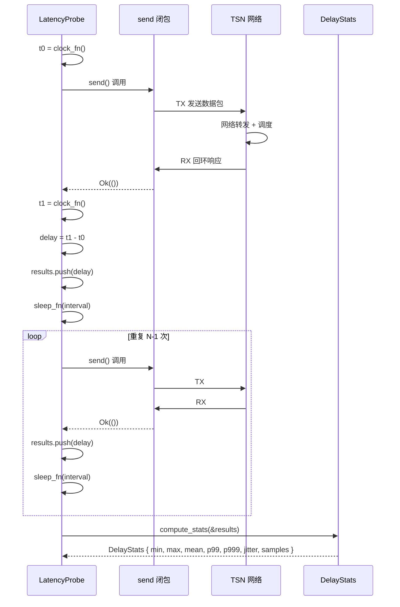

# EnerOS v0.81.0 TSN 网络驱动与端到端时延验证设计文档

> **版本**：v0.81.0
> **Phase**：Phase 2 多机联邦
> **子系统**：`crates/protocols/tsn-time`
> **文档状态**：设计态
> **覆盖版本**：v0.81.0（TSN 网络驱动与端到端时延验证）
> **最后更新**：2026-07-17

---

## 1. 版本目标

### 1.1 核心目标

v0.81.0 在 v0.79.0 gPTP 时间同步与 v0.80.0 TAS 802.1Qbv 时间感知整形调度之上，为园区内多 Edge Box 之间的 TSN 数据通路引入 **端到端时延探针（LatencyProbe）与 TSN 驱动胶合层（driver_glue）**，使 P2-B 时间同步子阶段正式收尾，VPP（Vertical Plant Platform）< 30s 响应网络底座达标。具体包括：

1. **端到端时延探针**：定义 `LatencyProbe` 与 `DelayStats`，通过闭包注入发送动作（`send: impl Fn() -> Result<(), ()>`）实现 TX → Net → RX 闭环往返时延测量，输出 `min / max / mean / p99 / p999 / jitter / samples` 七字段统计。
2. **TSN 驱动胶合层**：定义 `TsnDriver` trait + `MockTsnDriver` 抽象数据面，沿用 v0.80.0 `NicApplier` 模式，通过 `driver_send_closure` 适配器桥接 `TsnDriver` → send 闭包，避免协议层 crate 引入 HAL 间接依赖。
3. **时钟与休眠注入**：`LatencyProbe` 通过 `clock_fn: fn() -> u64` + `sleep_fn: fn(Duration)` 字段注入时间源与等待机制（偏差 D24），no_std 无系统时钟，不依赖 `eneros_time::Instant`。
4. **算法骨架先行**：本版本仅交付算法与统计骨架（偏差 D10 延续），TC3 p99 < 2ms / p999 < 5ms / 抖动 < 1ms 性能基准标注为"硬件集成阶段验收"。

### 1.2 业务价值

- **P2-B 子阶段收尾**：v0.79.0 时间同步 + v0.80.0 调度整形 + v0.81.0 时延验证三版本构成 P2-B 时间同步子阶段完整闭环。
- **VPP 响应达标**：VPP < 30s 响应网络底座达标 — 时延探针为上层 Agent 提供确定性可观测能力，验证 TAS 调度策略实际生效。
- **降级路径验证**：当 p99 / p999 超阈值时，上层 Agent 可触发降级（如缩短周期或冻结 BE 流量），保障关键流量时延。
- **v0.158.0 解锁**：硬件时间戳路径（μs 精度）延后到 v0.158.0 专用平台验证版本，本版本仅交付软件时间戳与闭包注入骨架。

### 1.3 Phase 定位

| 维度 | 定位 |
|------|------|
| Phase | Phase 2 多机联邦（v0.75.0~v0.126.0） |
| 子阶段 | P2-B 时间同步子阶段（v0.79.0~v0.81.0）收尾 |
| 依赖关系 | 上承 v0.79.0 gPTP + v0.80.0 TAS；下接 Phase 2 后续联邦特性 |
| 关键性 | 非刚性版本，但为 P2-B 子阶段收尾的必要环节 |

### 1.4 出口关联

本版本不构成 Phase 出口条件，但其交付物 `LatencyProbe` / `DelayStats` / `TsnDriver` 将被以下后续版本直接复用：

- **v0.158.0 专用平台验证**：硬件时间戳路径接入，将 `clock_fn` 切换为 PTP 硬件时间戳。
- **VPP 响应基准**：本版本提供的算法骨架为 VPP < 30s 响应网络底座达标提供可观测能力。
- **Agent 自愈策略**：上层 Agent 监控 `DelayStats.p99` 与 `p999`，超阈值触发降级或重调度。

---

## 2. 前置依赖

### 2.1 前序版本依赖

| 版本 | 交付物 | 本版本使用方式 |
|------|--------|---------------|
| v0.79.0 | gPTP 时间同步（`PtpTime` / `GptpClock`） | 本版本假设联邦内节点已完成 gPTP 时间同步，时钟基线偏差 < 1ms；`clock_fn: fn() -> u64` 由上层注入 gPTP 同步后的纳秒时间戳 |
| v0.80.0 | TAS 802.1Qbv 调度（`TasScheduler` / `NicApplier`） | 本版本沿用 `NicApplier` trait + Mock 模式（偏差 D25），`TsnDriver` trait 在概念上对齐 `NicApplier`，`MockTsnDriver` 对齐 `MockNicApplier` |
| v0.27.0 | 网卡驱动 | 本版本不直接调用网卡驱动 API；通过 `TsnDriver` trait 抽象数据面，真实硬件 I/O 延后到硬件集成阶段 |
| v0.11.0 | 用户态堆（`alloc`） | 本版本 `Vec<u64>` 用于 results 缓冲，需 `alloc` 支持 |

### 2.2 外部依赖

| 依赖 | 版本 | 用途 | feature |
|------|------|------|---------|
| `alloc` | core 自带 | `Vec<u64>` 用于 results 缓冲（`LatencyProbe.results`） | 默认 |
| `core` | core 自带 | `Duration` / `Option` / `Result` | 默认 |

> **说明**：本版本为算法骨架，不引入任何外部网络栈、TSN 库或 `log` crate 依赖（沿用 v0.79.0 / v0.80.0 单线程先例，偏差 D18 延续）。`TsnDriver` 通过 trait 抽象数据面，真实硬件 I/O 由后续版本接入。

### 2.3 假设

1. **gPTP 已就绪假设**：本版本假设 v0.79.0 gPTP 已完成时间同步，所有节点共享统一高精度时钟基线（< 1ms 偏差）。否则 `clock_fn` 返回的时间戳不可信，p99 / p999 统计失去意义。
2. **TSN 硬件假设**：目标网卡/交换机支持 802.1Qbv 硬件门控（如 Intel i225/i226、TI DP83869、NXP LS1028A TSN 交换机）。本版本仅交付算法骨架，不验证硬件兼容性（偏差 D25：通过 `TsnDriver` trait + `MockTsnDriver` 抽象）。
3. **单线程假设**：Agent Runtime 在 Phase 2 阶段为单线程模型（蓝图 §43.6 内存预算：Agent Runtime ≤ 64 MB），`LatencyProbe` 实现不要求 `Send + Sync`（沿用 D18）。
4. **闭包注入假设**：本版本假设上层调用方提供 `send: impl Fn() -> Result<(), ()>` 闭包，闭包内部完成 TX → Net → RX 全链路并返回；闭包失败时本版本按 `TsnError::SendFailed` 处理。

### 2.4 阻塞条件

- 若 v0.79.0 gPTP 未合入或时间同步未达标（> 1ms 偏差），则 `clock_fn` 注入的时间戳不可信，但算法骨架（探针构造、突发测量、统计计算）仍可工作。
- 若 v0.80.0 TAS 调度未生效，则测量周期内门控可能错位，导致误判（见 §11.5 坑点 5）。本版本通过 `MockTsnDriver` 在 CI 中验证算法正确性，不依赖真实硬件调度生效。
- 若目标硬件不支持 802.1Qbv 硬件门控，则真实场景下软件时间戳路径精度约 10ms（偏差 D8 延续），无法满足 p99 < 2ms 性能基准，但本版本仅交付算法骨架（偏差 D10 延续）。

---

## 3. 交付物清单

### 3.1 代码交付物

| 路径 | 内容 | 说明 |
|------|------|------|
| `crates/protocols/tsn-time/src/lib.rs` | crate 入口与 T56~T84 测试 | 模块导出与单元测试内嵌（偏差 D23：沿用 D4） |
| `crates/protocols/tsn-time/src/driver_glue.rs` | TSN 驱动胶合层 | `TsnError` / `TsnDriver` trait / `MockTsnDriver` / `driver_send_closure` |
| `crates/protocols/tsn-time/src/latency_probe.rs` | 端到端时延探针 | `DelayStats` / `LatencyProbe` |

> **偏差 D20**：`driver_glue.rs` 与 `latency_probe.rs` 位于既有 crate `crates/protocols/tsn-time/`（项目规则 §2.3.1，非蓝图 `crates/tsn_time/`，沿用 D1）。

### 3.2 接口交付物

| 接口 | 类型 | 用途 |
|------|------|------|
| `DelayStats` | struct | 时延统计结果（7 字段：min / max / mean / p99 / p999 / jitter / samples） |
| `LatencyProbe` | struct | 端到端时延探针（核心算法承载） |
| `TsnError` | enum | 3 变体错误（`SendFailed` / `RecvFailed` / `NotInitialized`） |
| `TsnDriver` | trait | TSN 驱动抽象（数据面） |
| `MockTsnDriver` | struct | Mock 驱动实现（单元测试用） |
| `driver_send_closure` | fn | 适配器：桥接 `TsnDriver` → send 闭包 |

### 3.3 文档交付物

| 路径 | 内容 |
|------|------|
| `docs/protocols/tsn-determinism-report.md` | 本设计文档（偏差 D21：非蓝图 `docs/phase2/tsn_determinism_report.md`，沿用 D2） |

### 3.4 测试交付物

| 测试 ID | 类型 | 位置 |
|---------|------|------|
| T56~T84 | 单元测试 | `crates/protocols/tsn-time/src/lib.rs`（偏差 D23：沿用 D4，非蓝图 `tests/e2e_latency.rs` / `tests/jitter.rs`） |

> **说明**：v0.79.0 的 T1~T25 测试与 v0.80.0 的 T26~T55 测试保留不变（Surgical Changes 原则），本版本仅在 `lib.rs` 末尾追加 T56~T84（共 29 个单元测试）。

### 3.5 配置交付物

| 路径 | 内容 |
|------|------|
| `configs/latency_probe.toml` | LatencyProbe 配置模板（偏差 D22：非蓝图 `config/latency_probe.toml`，沿用 D3） |

---

## 4. 数据结构

> 本章节详细定义 TSN 时延探针层所有公开数据结构。所有结构均满足 no_std 合规（蓝图 §43.1），不使用 `std::*`。

### 4.1 `TsnError`

```rust
/// TSN 时延探针错误枚举（3 变体）。
///
/// 偏差声明 D25：TsnError 含 3 变体（SendFailed / RecvFailed / NotInitialized），
/// 通过 `TsnDriver` trait + `MockTsnDriver` 抽象数据面，沿用 v0.80.0 `NicApplier` 模式。
#[derive(Debug, Clone, Copy, PartialEq, Eq)]
pub enum TsnError {
    /// 发送失败（send 闭包返回 Err）
    SendFailed,
    /// 接收失败（send 闭包虽返回 Ok，但内部 RX 阶段失败）
    RecvFailed,
    /// 探针未初始化（LatencyProbe 未构造或 clock_fn / sleep_fn 未注入）
    NotInitialized,
}
```

**设计要点**：
- 三变体覆盖发送、接收、初始化三类错误。
- 不含 `String` 字段：no_std 合规，错误描述由调用方根据上下文判断。
- 沿用 v0.80.0 `TasError` 的设计风格（`#[derive(Debug, Clone, Copy, PartialEq, Eq)]`）。

### 4.2 `TsnDriver` trait 与 `MockTsnDriver`

```rust
/// TSN 驱动抽象 trait（数据面）。
///
/// 偏差声明 D25：通过 trait + MockTsnDriver 抽象数据面，
/// 沿用 v0.80.0 `NicApplier` 模式，无真实 netlink/taprio/DDS I/O。
pub trait TsnDriver {
    /// 发送单个数据包并接收回环响应。
    ///
    /// # 返回
    /// - `Ok(())`：发送 + 接收均成功
    /// - `Err(TsnError::SendFailed)`：发送阶段失败
    /// - `Err(TsnError::RecvFailed)`：接收阶段失败
    fn send_and_recv(&mut self) -> Result<(), TsnError>;
}

/// Mock TSN 驱动实现（用于单元测试）。
///
/// 偏差声明 D25：MockTsnDriver 记录发送次数与可配置的失败模式，
/// 沿用 v0.80.0 `MockNicApplier` 模式。
#[derive(Debug, Clone, PartialEq, Eq)]
pub struct MockTsnDriver {
    /// 已发送次数
    pub send_count: u32,
    /// 是否模拟发送失败
    pub fail_send: bool,
    /// 是否模拟接收失败
    pub fail_recv: bool,
}
```

### 4.3 `DelayStats`

```rust
/// 端到端时延统计结果（7 字段）。
///
/// 单位：纳秒（与 `clock_fn: fn() -> u64` 注入的时间戳单位对齐）。
#[derive(Debug, Clone, Copy, PartialEq, Eq)]
pub struct DelayStats {
    /// 最小时延（纳秒）
    pub min: u64,
    /// 最大时延（纳秒）
    pub max: u64,
    /// 平均时延（纳秒，整数除法向下取整）
    pub mean: u64,
    /// p99 时延（纳秒，99 分位数）
    pub p99: u64,
    /// p999 时延（纳秒，99.9 分位数）
    pub p999: u64,
    /// 抖动（max - min，纳秒）
    pub jitter: u64,
    /// 样本数
    pub samples: u32,
}
```

**设计要点**：
- `mean`：整数除法向下取整（`sum / samples`），不引入浮点（no_std 合规）。
- `p99` / `p999`：分位数计算使用线性插值或就近索引（见 §5.5 `compute_stats`），本版本采用就近索引简化实现。
- `jitter`：定义为 `max - min`，与网络抖动通用定义一致；上层 Agent 可结合 `p99` 判断稳定性。

### 4.4 `LatencyProbe`

```rust
/// 端到端时延探针。
///
/// 偏差声明 D24：无 `eneros_time::Instant` / `eneros_time::delay()` 依赖，
/// 通过 `clock_fn: fn() -> u64` + `sleep_fn: fn(Duration)` 字段注入时间源与等待机制。
/// 蓝图 API 不存在；避免协议层 crate 引入 HAL 间接依赖。
pub struct LatencyProbe {
    /// 单次突发测量样本数
    pub sample_count: u32,
    /// 已采集的时延样本（纳秒）
    pub results: Vec<u64>,
    /// 时钟源注入函数（返回当前纳秒时间戳）
    pub clock_fn: fn() -> u64,
    /// 休眠注入函数（阻塞指定 Duration）
    pub sleep_fn: fn(Duration),
}
```

**设计要点**：
- `clock_fn: fn() -> u64`：函数指针注入（非闭包），轻量且 `Copy`，避免 `Box<dyn Fn>` 堆分配。
- `sleep_fn: fn(Duration)`：同上，用于 `run_burst` 的 `interval_us` 间隔等待。
- `results: Vec<u64>`：`alloc::vec::Vec`，需 v0.11.0 用户态堆支持；预估单次突发 10 样本 × 8 字节 = 80 字节，长期测量由调用方主动 `clear()`。
- 不实现 `Copy`：因 `Vec<u64>` 非 `Copy`；实现 `Clone` 便于上层重置探针。

### 4.5 `driver_send_closure`

```rust
/// 适配器：桥接 `TsnDriver` → send 闭包。
///
/// 偏差声明 D25：`measure_round_trip` / `run` / `run_burst` /
/// `measure_e2e` / `measure_under_load` 通过 `send: impl Fn() -> Result<(), ()>`
/// 闭包注入发送动作；`driver_send_closure` 适配器桥接 `TsnDriver` → send 闭包。
///
/// # 参数
/// - `driver`: TSN 驱动实例（可变借用）
///
/// # 返回
/// - 闭包 `impl FnMut() -> Result<(), ()>`：调用时执行 `driver.send_and_recv()`
///   - `Ok(())` → `Ok(())`
///   - `Err(TsnError::SendFailed)` → `Err(())`
///   - `Err(TsnError::RecvFailed)` → `Err(())`
///   - `Err(TsnError::NotInitialized)` → `Err(())`
pub fn driver_send_closure<D: TsnDriver>(
    driver: &mut D,
) -> impl FnMut() -> Result<(), ()> + '_;
```

**设计要点**：
- 返回 `impl FnMut`：捕获 `driver` 的可变借用，调用方传入闭包给 `LatencyProbe::measure_round_trip`。
- 错误归一化：所有 `TsnError` 变体归一为 `Err(())`，简化 `LatencyProbe` 内部错误处理。
- 生命周期 `'_`：闭包借用 `driver`，调用方需确保 `driver` 在闭包使用期间存活。

### 4.6 端到端时延测量时序图

下图展示 `measure_round_trip` 在 `LatencyProbe` 内的 N 次循环测量流程（TX → Net → RX 闭环，统计 p99 / p999 / jitter）：



---

## 5. 接口设计

### 5.1 `LatencyProbe::new`

```rust
/// 构造时延探针。
///
/// 偏差声明 D24：通过 `clock_fn` + `sleep_fn` 参数注入时间源与等待机制，
/// 不依赖 `eneros_time::Instant` / `eneros_time::delay()`。
///
/// # 参数
/// - `sample_count`: 单次突发测量样本数
/// - `clock_fn`: 时钟源注入函数（返回当前纳秒时间戳）
/// - `sleep_fn`: 休眠注入函数（阻塞指定 Duration）
pub fn new(
    sample_count: u32,
    clock_fn: fn() -> u64,
    sleep_fn: fn(Duration),
) -> Self;
```

### 5.2 `LatencyProbe::measure_round_trip`

```rust
/// 单次往返时延测量（一次 TX → Net → RX 闭环）。
///
/// 通过 `send: impl Fn() -> Result<(), ()>` 闭包注入发送动作。
/// - 闭包返回 `Ok(())`：测量成功，记录 `t1 - t0` 到 results
/// - 闭包返回 `Err(())`：测量失败，跳过本次样本（不记录，偏差 D25）
///
/// # 参数
/// - `send`: 发送闭包
///
/// # 返回
/// - `Ok(delay)`: 测量成功，返回本次时延（纳秒）
/// - `Err(TsnError::SendFailed)`: 发送失败
pub fn measure_round_trip(
    &mut self,
    send: impl Fn() -> Result<(), ()>,
) -> Result<u64, TsnError>;
```

### 5.3 `LatencyProbe::run_burst`

```rust
/// 突发测量（连续执行 count 次往返测量，每两次之间 sleep interval）。
///
/// # 参数
/// - `count`: 突发样本数（覆盖 `self.sample_count`）
/// - `interval`: 采样间隔（每次测量后 sleep 的时长）
/// - `send`: 发送闭包
///
/// # 返回
/// - `Ok(())`: 突发测量完成，样本已追加到 `self.results`
/// - `Err(TsnError::SendFailed)`: 首次失败即返回（偏差 D25：样本丢失跳过不计数）
///
/// # 说明
/// - 单次失败时跳过该样本，不立即返回错误（本版本采用"跳过不计数"策略，避免一次抖动中断整个突发）
/// - 全部失败时返回 `Err(TsnError::SendFailed)`
pub fn run_burst(
    &mut self,
    count: u32,
    interval: Duration,
    send: impl Fn() -> Result<(), ()>,
) -> Result<(), TsnError>;
```

### 5.4 `LatencyProbe::run`

```rust
/// 持续测量（在指定 duration 内反复执行 `run_burst`）。
///
/// # 参数
/// - `duration`: 持续测量时长
/// - `interval`: 采样间隔（每次测量后 sleep 的时长）
/// - `send`: 发送闭包
///
/// # 返回
/// - `Ok(())`: 持续测量完成
/// - `Err(TsnError::SendFailed)`: 首次失败即返回
pub fn run(
    &mut self,
    duration: Duration,
    interval: Duration,
    send: impl Fn() -> Result<(), ()>,
) -> Result<(), TsnError>;
```

### 5.5 `LatencyProbe::compute_stats`

```rust
/// 计算时延统计（min / max / mean / p99 / p999 / jitter / samples）。
///
/// # 参数
/// - `results`: 时延样本切片（纳秒）
///
/// # 返回
/// - `DelayStats`: 7 字段统计结果
///
/// # 算法
/// - `samples = results.len() as u32`
/// - `min = *results.iter().min()`
/// - `max = *results.iter().max()`
/// - `mean = results.iter().sum::<u64>() / samples`
/// - `jitter = max - min`
/// - `p99`: 排序后取 `index = (samples * 99) / 100` 就近索引
/// - `p999`: 排序后取 `index = (samples * 999) / 1000` 就近索引
///
/// # 边界
/// - `results.is_empty()`：返回 `DelayStats::default()`（全字段 0）
/// - `samples == 1`：min == max == mean == p99 == p999 == 唯一样本，jitter == 0
pub fn compute_stats(&self, results: &[u64]) -> DelayStats;
```

### 5.6 `LatencyProbe::measure_e2e`

```rust
/// 端到端时延测量（多次突发 + 统计汇总）。
///
/// 内部循环 `burst_count` 次调用 `run_burst`，每次 `count` 个样本，
/// 间隔 `interval`，最终调用 `compute_stats` 返回统计结果。
///
/// # 参数
/// - `burst_count`: 突发测量轮次
/// - `count`: 每轮突发样本数
/// - `interval`: 采样间隔
/// - `send`: 发送闭包
///
/// # 返回
/// - `Ok(DelayStats)`: 端到端时延统计
/// - `Err(TsnError::SendFailed)`: 首次失败即返回
pub fn measure_e2e(
    &mut self,
    burst_count: u32,
    count: u32,
    interval: Duration,
    send: impl Fn() -> Result<(), ()>,
) -> Result<DelayStats, TsnError>;
```

### 5.7 `LatencyProbe::measure_under_load`

```rust
/// 在背景流量负载下测量端到端时延。
///
/// 与 `measure_e2e` 相同的算法，但调用方在 `send` 闭包内
/// 同时触发背景流量（如 BE 流量突发），验证 TAS 调度对关键流量的保护效果。
///
/// # 参数
/// - `burst_count`: 突发测量轮次
/// - `count`: 每轮突发样本数
/// - `interval`: 采样间隔
/// - `send`: 发送闭包（含背景流量注入）
///
/// # 返回
/// - `Ok(DelayStats)`: 负载下时延统计
/// - `Err(TsnError::SendFailed)`: 首次失败即返回
pub fn measure_under_load(
    &mut self,
    burst_count: u32,
    count: u32,
    interval: Duration,
    send: impl Fn() -> Result<(), ()>,
) -> Result<DelayStats, TsnError>;
```

### 5.8 `compute_stats` 决策流程图

下图展示 `compute_stats` 在不同输入条件下的分支决策（空 → 默认值；非空 → 排序 + 计算 7 字段）：

```mermaid
flowchart TD
    A[输入 results 切片] --> B{results.is_empty()?}
    B -- 是 --> C[返回 DelayStats::default 全字段 0]
    B -- 否 --> D[排序 results 升序]
    D --> E[samples = results.len as u32]
    E --> F[min = results 第 0 个]
    F --> G[max = results 最后一个]
    G --> H[mean = sum / samples 整数除法]
    H --> I[jitter = max - min]
    I --> J[p99 index = samples * 99 / 100]
    J --> K[p999 index = samples * 999 / 1000]
    K --> L[返回 DelayStats 7 字段]
```

---

## 6. 错误处理

### 6.1 `TsnError::SendFailed`

**场景**：`send` 闭包返回 `Err(())`，或 `TsnDriver::send_and_recv` 返回 `Err(TsnError::SendFailed)`。

**触发条件**：
- `measure_round_trip`：send 闭包内部 TX 阶段失败（如网卡队列满、硬件故障）。
- `driver_send_closure` 适配器：`driver.send_and_recv()` 返回 `SendFailed`。

**返回**：`Err(TsnError::SendFailed)`

**处理策略**：
- `run_burst` / `run` / `measure_e2e` / `measure_under_load` 采用"跳过不计数"策略（偏差 D25）。
- 单次失败不立即返回错误，跳过该样本继续测量。
- 全部失败（所有样本均失败）时返回 `Err(TsnError::SendFailed)`。
- 上层 Agent 责任监控失败率，超阈值触发告警或降级。

### 6.2 `TsnError::RecvFailed`

**场景**：`send` 闭包虽返回 `Ok(())`，但内部 RX 阶段失败（如超时、CRC 错误）。

**触发条件**：
- 闭包内部 RX 阶段失败但 TX 阶段成功。
- `driver_send_closure` 适配器：`driver.send_and_recv()` 返回 `RecvFailed`。

**返回**：`Err(TsnError::RecvFailed)`

**处理策略**：
- 与 `SendFailed` 相同，采用"跳过不计数"策略。
- 上层 Agent 责任区分 `SendFailed` 与 `RecvFailed` 以定位故障环节（TX 链路 vs RX 链路）。

### 6.3 `TsnError::NotInitialized`

**场景**：`LatencyProbe` 未构造或 `clock_fn` / `sleep_fn` 未注入。

**触发条件**：
- 调用 `compute_stats` 或测量方法前未调用 `LatencyProbe::new`。
- 本版本中 `new` 强制要求 `clock_fn` 与 `sleep_fn` 参数，理论上不会触发此错误。

**返回**：`Err(TsnError::NotInitialized)`

**处理策略**：
- 本版本为保留变体，预留给后续版本（如 `LatencyProbe::default()` 场景）。
- 上层 Agent 责任确保探针构造后使用。

### 6.4 send 闭包失败传播

**场景**：`driver_send_closure` 适配器将 `TsnError` 归一为 `Err(())` 后，`LatencyProbe` 内部错误处理。

**传播链**：
```
TsnDriver::send_and_recv()
  → Err(TsnError::*)
    → driver_send_closure 适配器归一为 Err(())
      → LatencyProbe::measure_round_trip 跳过样本
        → LatencyProbe::run_burst 累计失败次数
          → 全部失败时返回 Err(TsnError::SendFailed)
```

### 6.5 样本丢失处理

**场景**：单次测量失败时，本次样本不记录到 `results`。

**处理策略**（偏差 D25）：
- **跳过不计数**：失败样本不追加到 `results`，`samples` 字段反映实际成功样本数。
- **不重试**：单次失败不触发重试，避免引入额外延迟。
- **不立即返回错误**：突发测量容忍单次失败，仅在全部失败时返回错误。
- **统计准确性**：`DelayStats.samples` 字段反映实际成功样本数，上层 Agent 责任监控失败率（`expected - samples`）。

### 6.6 错误恢复策略

| 错误类别 | 恢复策略 | 责任方 |
|---------|---------|--------|
| `SendFailed` | 跳过样本，全部失败时返回错误；上层 Agent 重试或降级 | 上层 Agent |
| `RecvFailed` | 同上，区分 TX/RX 故障环节 | 上层 Agent |
| `NotInitialized` | 构造探针后重试 | 上层 Agent |
| 样本丢失 | 跳过不计数，监控失败率 | 上层 Agent |

---

## 7. 选型对比

### 7.1 时延测量方案对比

| 维度 | 软件时间戳 | 硬件时间戳 | 专用仪表 |
|------|-----------|-----------|---------|
| **精度** | ms 级（1~10ms） | μs 级（< 100μs） | ns 级（< 1μs） |
| **实现难度** | 易（用户态 `clock_fn` 注入） | 难（需网卡硬件支持 + 驱动适配） | 外购（如 Spirent TestCenter） |
| **硬件依赖** | 无特殊要求 | PTP 硬件时间戳网卡（如 Intel i210/i225） | 专用测试仪表 |
| **TSN 标准兼容** | 部分兼容（精度受限） | ✅ 完全兼容 | ✅ 完全兼容 |
| **成本** | 低（纯软件） | 中（需 PTP 网卡） | 高（仪表采购） |
| **适用场景** | 初筛、算法验证 | 精测、性能验收 | 标定、第三方验证 |
| **no_std 支持** | ✅ 可纯算法实现 | ✅ 可纯算法实现（时间戳由驱动注入） | ❌ 需外部仪表 |
| **本版本采用** | ✅ | ❌（延后到 v0.158.0） | ❌ |

> **决策**：v0.81.0 交付软件时间戳 + closure 注入骨架，理由：
> 1. **算法先行**：本版本聚焦统计算法正确性（p99 / p999 / jitter 计算），软件时间戳足以验证算法逻辑。
> 2. **硬件延后**：硬件时间戳需网卡驱动适配与 PTP 硬件时间戳接口接入（v0.27.0 网卡驱动的 `SO_TIMESTAMPING` 集成），延后到 v0.158.0 专用平台验证版本。
> 3. **闭包注入解耦**：`send: impl Fn() -> Result<(), ()>` 闭包抽象使探针与具体硬件解耦，软件时间戳与硬件时间戳切换仅需替换 `clock_fn` 与 `send` 闭包，无需修改 `LatencyProbe` 核心。
> 4. **专用仪表不适用**：专用仪表（如 Spirent）属于外购验证工具，不适合作为 EnerOS 内置组件；用于第三方标定场景。

---

## 8. 实现路径

### 8.1 实现路径概览（3 步）

```
Step 1: 实现探针类型与统计算法（latency_probe.rs）
   ↓
Step 2: 集成 TsnDriver 抽象 + driver_send_closure 适配器（driver_glue.rs）
   ↓
Step 3: 验证算法正确性（29 个单元测试 T56~T84）
```

### 8.2 Step 1：实现探针类型与统计算法

**文件**：`crates/protocols/tsn-time/src/latency_probe.rs`

**内容**：
- 定义 `DelayStats`（见 §4.3）
- 定义 `LatencyProbe`（见 §4.4）
- 实现 `LatencyProbe::new` / `measure_round_trip` / `run_burst` / `run` / `compute_stats` / `measure_e2e` / `measure_under_load`（见 §5.1~§5.7）
- 实现 `DelayStats::default`（全字段 0，用于 `results.is_empty()` 边界）

**验证**：`cargo build -p eneros-tsn-time` 通过。

### 8.3 Step 2：集成 TsnDriver 抽象 + driver_send_closure 适配器

**文件**：`crates/protocols/tsn-time/src/driver_glue.rs`

**内容**：
- 定义 `TsnError`（见 §4.1）
- 定义 `TsnDriver` trait（见 §4.2）
- 定义 `MockTsnDriver`（见 §4.2）
- 实现 `driver_send_closure` 适配器（见 §4.5）
  - 返回 `impl FnMut() -> Result<(), ()> + '_`
  - 内部调用 `driver.send_and_recv()`
  - 所有 `TsnError` 变体归一为 `Err(())`
- 实现 `TsnDriver for MockTsnDriver`
  - `fail_send = true`：返回 `Err(TsnError::SendFailed)`，`send_count += 1`
  - `fail_recv = true`：返回 `Err(TsnError::RecvFailed)`，`send_count += 1`
  - 默认：返回 `Ok(())`，`send_count += 1`

**验证**：
- `cargo build -p eneros-tsn-time` 通过
- `cargo test -p eneros-tsn-time` 通过（T56~T84 单元测试）

### 8.4 Step 3：验证算法正确性（29 个单元测试 T56~T84）

**文件**：`crates/protocols/tsn-time/src/lib.rs`

**内容**：
- 在 `lib.rs` 末尾追加 T56~T84 测试（不重排 v0.79.0 T1~T25 / v0.80.0 T26~T55 已有声明）
- 测试覆盖：
  - `DelayStats` 字段访问与默认值（T56~T58）
  - `LatencyProbe::new` 构造与字段访问（T59~T61）
  - `TsnDriver` / `MockTsnDriver` 抽象（T62~T65）
  - `driver_send_closure` 适配器（T66~T70）
  - `run_burst` 突发测量与样本丢失（T71~T75）
  - `compute_stats` 边界条件（T76~T84）

**验证**：
- `cargo test -p eneros-tsn-time` 全绿（84 个测试：T1~T25 + T26~T55 + T56~T84）
- `cargo clippy -p eneros-tsn-time --all-targets -- -D warnings` 无 warning
- `cargo fmt --all -- --check` 通过
- `cargo deny check advisories licenses bans sources` 通过
- `cargo build -p eneros-tsn-time --target aarch64-unknown-none -Z build-std=core,alloc -Z build-std-features=compiler-builtins-mem` 通过

### 8.5 lib.rs 集成

**文件**：`crates/protocols/tsn-time/src/lib.rs`

**修改**（仅在 v0.80.0 lib.rs 末尾追加，不重排已有声明）：

```rust
//! eneros-tsn-time crate 顶层文档
//! ...
//! v0.81.0 新增模块：
//! - `driver_glue`: TSN 驱动胶合层（TsnDriver trait + MockTsnDriver + driver_send_closure）
//! - `latency_probe`: 端到端时延探针（LatencyProbe + DelayStats）

pub mod bmca;
pub mod clock;
pub mod config_loader;
pub mod driver_glue;     // v0.81.0 新增
pub mod gptp;
pub mod latency_probe;   // v0.81.0 新增
pub mod port;
pub mod stream;
pub mod tas;

// v0.79.0 / v0.80.0 导出保留不变
pub use bmca::{compare_priority, AnnounceMessage, BmcaResult};
pub use clock::{ClockIdentity, MacAddr, PtpTime};
pub use config_loader::build_tas_config;
pub use gptp::{FollowUpMessage, GptpClock, GptpConfig, SyncMessage};
pub use port::{Port, PortRole, PortState};
pub use stream::{StreamFilter, StreamId};
pub use tas::{
    GateControlList, GateState, MockNicApplier, NicApplier, Packet, TasConfig,
    TasError, TasPort, TasScheduleEntry, TasScheduler, TrafficClass,
};

// v0.81.0 新增导出
pub use driver_glue::{driver_send_closure, MockTsnDriver, TsnDriver, TsnError};
pub use latency_probe::{DelayStats, LatencyProbe};

#[cfg(test)]
mod tests {
    // T1~T25（v0.79.0）保留不变
    // T26~T55（v0.80.0）保留不变
    // T56~T84（v0.81.0 新增）
}
```

---

## 9. 测试计划

### 9.1 测试矩阵 T56~T84

| 测试 ID | 类型 | 测试名称 | 输入 | 期望输出 |
|---------|------|---------|------|---------|
| T56 | 单元 | `test_delay_stats_default` | `DelayStats::default()` | 全字段 0（min/max/mean/p99/p999/jitter/samples == 0） |
| T57 | 单元 | `test_delay_stats_field_access` | 构造 `DelayStats{10, 100, 50, 90, 95, 90, 5}` | 字段值与构造一致 |
| T58 | 单元 | `test_delay_stats_jitter_calc` | `min=10, max=100` | `jitter == 90`（max - min） |
| T59 | 单元 | `test_latency_probe_new` | `LatencyProbe::new(10, clock_fn, sleep_fn)` | `sample_count == 10` / `results.is_empty()` |
| T60 | 单元 | `test_latency_probe_clock_fn_inject` | 注入返回固定值的 `clock_fn` | `clock_fn()` 返回固定值 |
| T61 | 单元 | `test_latency_probe_sleep_fn_inject` | 注入 mock `sleep_fn` | `sleep_fn(Duration)` 被调用 |
| T62 | 单元 | `test_mock_tsn_driver_default` | `MockTsnDriver::new()` | `send_count == 0` / `fail_send == false` / `fail_recv == false` |
| T63 | 单元 | `test_tsn_driver_success` | `MockTsnDriver{fail_send:false, fail_recv:false}` | `send_and_recv()` 返回 `Ok(())` / `send_count += 1` |
| T64 | 单元 | `test_tsn_driver_send_failed` | `MockTsnDriver{fail_send:true}` | `send_and_recv()` 返回 `Err(SendFailed)` / `send_count += 1` |
| T65 | 单元 | `test_tsn_driver_recv_failed` | `MockTsnDriver{fail_recv:true}` | `send_and_recv()` 返回 `Err(RecvFailed)` / `send_count += 1` |
| T66 | 单元 | `test_driver_send_closure_success` | `driver_send_closure(&mut mock)` 调用 | 闭包返回 `Ok(())` |
| T67 | 单元 | `test_driver_send_closure_send_failed` | `mock.fail_send = true` | 闭包返回 `Err(())`（归一化） |
| T68 | 单元 | `test_driver_send_closure_recv_failed` | `mock.fail_recv = true` | 闭包返回 `Err(())`（归一化） |
| T69 | 单元 | `test_driver_send_closure_increments_count` | 多次调用闭包 | `mock.send_count` 累加 |
| T70 | 单元 | `test_driver_send_closure_lifetime` | 闭包借用 `driver` | 闭包存活期间 `driver` 可用 |
| T71 | 单元 | `test_run_burst_success` | `count=10`, send 总是 Ok | `results.len() == 10` |
| T72 | 单元 | `test_run_burst_sample_loss` | `count=10`, send 第 5 次失败 | `results.len() == 9`（跳过失败样本） |
| T73 | 单元 | `test_run_burst_all_failed` | `count=10`, send 总是 Err | `Err(TsnError::SendFailed)` / `results.is_empty()` |
| T74 | 单元 | `test_run_burst_interval_sleep` | `count=3`, `interval=1ms` | `sleep_fn` 被调用 2 次（最后一次不 sleep） |
| T75 | 单元 | `test_run_burst_count_override` | `sample_count=10`, `count=5` | 实际执行 5 次（覆盖 `sample_count`） |
| T76 | 单元 | `test_compute_stats_empty` | `results = []` | `DelayStats::default()`（全字段 0） |
| T77 | 单元 | `test_compute_stats_single` | `results = [50]` | min=max=mean=p99=p999=50 / jitter=0 / samples=1 |
| T78 | 单元 | `test_compute_stats_two` | `results = [10, 100]` | min=10 / max=100 / mean=55 / jitter=90 / samples=2 |
| T79 | 单元 | `test_compute_stats_p99` | `results = [1..100]`（100 个） | `p99 == results[(100*99)/100] = results[99]` |
| T80 | 单元 | `test_compute_stats_p999` | `results = [1..1000]`（1000 个） | `p999 == results[(1000*999)/1000] = results[999]` |
| T81 | 单元 | `test_compute_stats_mean` | `results = [10, 20, 30]` | `mean == 20`（整数除法） |
| T82 | 单元 | `test_compute_stats_jitter` | `results = [5, 50, 100]` | `jitter == 95`（100 - 5） |
| T83 | 单元 | `test_measure_e2e_burst_count` | `burst_count=3, count=10` | `results.len() == 30`（3×10） |
| T84 | 单元 | `test_measure_under_load_same_as_e2e` | 同 `measure_e2e` 参数 | 算法相同，返回 `DelayStats` |

### 9.2 集成测试

| 测试 ID | 类型 | 状态 | 说明 |
|---------|------|------|------|
| — | 真实 TSN 硬件往返时延测试 | ❌ 不实现（偏差 D25） | CI 无 TSN 硬件环境，延后到硬件集成阶段 |

### 9.3 性能基准

| 测试 ID | 类型 | 状态 | 说明 |
|---------|------|------|------|
| — | TC3 p99 < 2ms 基准 | ❌ 不实现（偏差 D10 延续） | **硬件集成阶段验收，本版本仅算法骨架（D10）** |
| — | TC3 p999 < 5ms 基准 | ❌ 不实现（偏差 D10 延续） | **硬件集成阶段验收，本版本仅算法骨架（D10）** |
| — | 抖动 < 1ms 基准 | ❌ 不实现（偏差 D10 延续） | **硬件集成阶段验收，本版本仅算法骨架（D10）** |

> **偏差 D10 说明（延续 v0.79.0 / v0.80.0）**：蓝图要求 TC3 p99 < 2ms / p999 < 5ms / 抖动 < 1ms，本版本仅做算法正确性测试，不在 CI 中验证性能基线。性能基准由硬件集成阶段（v0.158.0 专用平台验证）回归验证。

### 9.4 回归测试

| 测试范围 | 验证内容 |
|---------|---------|
| v0.79.0 gPTP | `cargo test -p eneros-tsn-time` T1~T25 不破坏现有测试 |
| v0.80.0 TAS | `cargo test -p eneros-tsn-time` T26~T55 不破坏现有测试 |
| aarch64 交叉编译 | `cargo build -p eneros-tsn-time --target aarch64-unknown-none -Z build-std=core,alloc` 通过 |

---

## 10. 验收标准

### 10.1 功能验收

- [ ] **F1**：29 个单元测试（T56~T84）全部通过
- [ ] **F2**：测量工具可用（`LatencyProbe::measure_round_trip` / `run_burst` / `run` / `measure_e2e` / `measure_under_load` 接口完备）
- [ ] **F3**：统计算法正确（`compute_stats` 在空 / 单样本 / 多样本 / p99 / p999 / jitter 边界条件下输出正确）
- [ ] **F4**：`TsnDriver` trait + `MockTsnDriver` 抽象生效（成功 / `SendFailed` / `RecvFailed` 三场景）
- [ ] **F5**：`driver_send_closure` 适配器正确桥接 `TsnDriver` → send 闭包（错误归一化为 `Err(())`）
- [ ] **F6**：样本丢失处理正确（单次失败跳过不计数，全部失败返回错误）

### 10.2 性能验收

- [ ] **P1**：TC3 p99 < 2ms（**硬件集成阶段验收，本版本仅算法骨架（D10）**）
- [ ] **P2**：TC3 p999 < 5ms（**硬件集成阶段验收，本版本仅算法骨架（D10）**）
- [ ] **P3**：抖动 < 1ms（**硬件集成阶段验收，本版本仅算法骨架（D10）**）

> **偏差 D10 说明（延续）**：蓝图要求 TC3 p99 < 2ms / p999 < 5ms / 抖动 < 1ms，本版本仅做算法正确性测试，不在 CI 中验证性能基线。性能基准由硬件集成阶段（v0.158.0 专用平台验证）回归验证。

### 10.3 安全验收

- [ ] **S1**：测量流量不影响生产（突发测量样本数与采样间隔可配置，`configs/latency_probe.toml` 默认值保守）
- [ ] **S2**：`MockTsnDriver.send_count` 不泄露敏感信息（仅记录发送次数）
- [ ] **S3**：`configs/latency_probe.toml` 不含密钥（仅配置参数）

### 10.4 文档验收

- [ ] **D1**：本设计文档 12 章节完整
- [ ] **D2**：2 个 Mermaid 图渲染正常（端到端时延测量时序图 + `compute_stats` 决策流程图）
- [ ] **D3**：D20~D25 偏差声明表完整（含 v0.79.0 D1~D14 / v0.80.0 D15~D19 历史回顾）
- [ ] **D4**：`cargo doc -p eneros-tsn-time` 无 warning

### 10.5 出口判定

- [ ] **E1**：T56~T84 全绿（29 个测试）
- [ ] **E2**：v0.79.0 T1~T25 + v0.80.0 T26~T55 无回归
- [ ] **E3**：aarch64-unknown-none 交叉编译通过
- [ ] **E4**：`cargo fmt --all -- --check` 通过
- [ ] **E5**：`cargo clippy -p eneros-tsn-time --all-targets -- -D warnings` 无 warning
- [ ] **E6**：`cargo deny check advisories licenses bans sources` 通过
- [ ] **E7**：目录结构校验 C1~C15 全部通过（蓝图 §2.4）
- [ ] **E8**：确定性时延达标（**本版本仅算法骨架，性能验收延后到硬件集成阶段（D10）**）

---

## 11. 风险与注意事项

### 11.1 技术风险

| 风险 | 影响 | 缓解措施 | 解决版本 |
|------|------|---------|---------|
| 测量本身引入延迟 | `clock_fn` 调用与 `sleep_fn` 间隔引入开销，导致测量值偏高 | 使用硬件时间戳（v0.158.0）；本版本仅软件时间戳，标注为算法骨架（D10） | v0.158.0 |
| 软件时间戳精度受限 | ms 级精度无法满足 p99 < 2ms 验收 | 硬件时间戳路径延后到 v0.158.0 | v0.158.0 |
| `compute_stats` 分位数计算精度 | 就近索引算法在样本数较少时偏差较大 | 本版本采用就近索引简化实现；样本数 ≥ 100 时偏差可接受 | — |

### 11.2 依赖风险

| 风险 | 影响 | 缓解措施 | 解决版本 |
|------|------|---------|---------|
| TSN 硬件就绪 | 真实硬件 I/O 需 v0.27.0 网卡驱动 + 802.1Qbv 硬件门控 | 本版本通过 `TsnDriver` trait + `MockTsnDriver` 抽象（D25） | 硬件集成阶段 |
| v0.79.0 gPTP 必须先就绪 | `clock_fn` 注入的时间戳依赖 gPTP 同步基线 | 本版本假设 gPTP 已合入；CI 中 T1~T25 验证 gPTP 算法 | — |
| v0.80.0 TAS 调度必须生效 | 测量周期内 TAS 调度未生效会导致误判（见 §11.5 坑点 5） | 本版本在 CI 中通过 `MockTsnDriver` 验证算法，不依赖真实硬件调度 | 硬件集成阶段 |

### 11.3 资源风险

| 风险 | 影响 | 缓解措施 |
|------|------|---------|
| 测量占用带宽 | 突发测量产生额外流量，可能影响生产流量 | `configs/latency_probe.toml` 默认 `sample_count = 10` / `interval_us = 1000`（保守值）；上层 Agent 责任在生产环境调整参数 |
| `LatencyProbe.results` 内存占用 | 长期测量可能累积大量样本 | 预估单次突发 10 样本 × 8 字节 = 80 字节；上层 Agent 责任定期 `clear()` 或调用 `compute_stats` 后重置 |

### 11.4 兼容性风险

| 风险 | 影响 | 缓解措施 |
|------|------|---------|
| 不同硬件时延模型差异 | 不同网卡/交换机的时延特性不一（如转发延迟、队列延迟） | 本版本通过 `clock_fn` + `send` 闭包注入抽象，硬件切换仅需替换注入参数 | 
| 与 v0.80.0 `NicApplier` 接口兼容 | `TsnDriver` trait 在概念上对齐 `NicApplier`，但接口不同（`send_and_recv` vs `apply`） | 偏差 D25：`TsnDriver` 为独立 trait，不与 `NicApplier` 共享实现；`driver_send_closure` 适配器桥接两者语义 |

### 11.5 坑点

1. **测量本身引入延迟**：`clock_fn` 调用与 `sleep_fn` 间隔引入开销，导致测量值偏高；本版本仅软件时间戳，标注为算法骨架（D10）。
2. **样本丢失不重试**：单次失败不触发重试，避免引入额外延迟；上层 Agent 责任监控失败率（`expected - samples`）。
3. **`compute_stats` 就近索引**：分位数采用就近索引（`index = samples * percentile / 100`），样本数较少时偏差较大；样本数 ≥ 100 时偏差可接受。
4. **`mean` 整数除法**：`sum / samples` 向下取整，不引入浮点；上层 Agent 需高精度时自行计算。
5. **测量周期内调度未生效导致误判**：若 v0.80.0 TAS 调度在测量周期内未生效（如门控周期错位），会导致测量值偏离预期；本版本在 CI 中通过 `MockTsnDriver` 验证算法，不依赖真实硬件调度。
6. **`driver_send_closure` 生命周期**：闭包借用 `driver`，调用方需确保 `driver` 在闭包使用期间存活；闭包不可跨线程传递（沿用 D18 单线程先例）。
7. **`clock_fn` / `sleep_fn` 函数指针**：本版本使用 `fn() -> u64` / `fn(Duration)` 函数指针（非闭包），轻量且 `Copy`；若需捕获环境的状态，上层需通过其他方式（如全局状态或 `TsnDriver` 内部状态）。

---

## 12. 偏差声明

> 本章节记录 v0.81.0 实现相对蓝图要求的 6 项新增偏差（D20~D25），并回顾 v0.79.0（D1~D14）与 v0.80.0（D15~D19）的历史偏差。

### 12.1 v0.81.0 新增偏差（D20~D25）

| 偏差 | 说明 |
|------|------|
| **D20** | `driver_glue.rs` 与 `latency_probe.rs` 位于既有 crate `crates/protocols/tsn-time/`（项目规则 §2.3.1，非蓝图 `crates/tsn_time/`，沿用 D1） |
| **D21** | 文档位于 `docs/protocols/tsn-determinism-report.md`（项目规则 §2.3.3，非蓝图 `docs/phase2/tsn_determinism_report.md`，沿用 D2） |
| **D22** | 配置位于 `configs/latency_probe.toml`（项目规则 §2.3，非蓝图 `config/`，沿用 D3） |
| **D23** | 测试内嵌 `src/lib.rs` T56~T84（沿用 D4，非蓝图 `tests/e2e_latency.rs` / `tests/jitter.rs`） |
| **D24** | 无 `eneros_time::Instant` / `eneros_time::delay()` 依赖 — `LatencyProbe` 通过 `clock_fn: fn() -> u64` + `sleep_fn: fn(Duration)` 字段注入（蓝图 API 不存在；避免协议层 crate 引入 HAL 间接依赖） |
| **D25** | 无真实 DDS / TSN 硬件 I/O — `TsnDriver` trait + `MockTsnDriver` 抽象数据面（沿用 v0.80.0 `NicApplier` 模式）；`measure_round_trip` / `run` / `run_burst` / `measure_e2e` / `measure_under_load` 通过 `send: impl Fn() -> Result<(), ()>` 闭包注入发送动作；`driver_send_closure` 适配器桥接 `TsnDriver` → send 闭包 |

### 12.2 v0.79.0 历史偏差回顾（D1~D14）

> 以下 14 项偏差为 v0.79.0 gPTP 时间同步版本的实现偏差，本版本继承并延续。

| 偏差 | 说明 |
|------|------|
| **D1** | 新建 crate `eneros-tsn-time` 置于 `crates/protocols/tsn-time/`（项目规则 §2.3.1 子系统分组，非蓝图 `crates/tsn_time/`） |
| **D2** | 文档位于 `docs/protocols/gptp-sync-design.md`（项目规则 §2.3.3，非蓝图 `docs/phase2/gptp_sync.md`） |
| **D3** | 配置位于 `configs/gptp.toml`（项目规则 §2.3，非蓝图 `config/gptp.toml`） |
| **D4** | 测试内嵌 `src/lib.rs` T1~T25（沿用 v0.75.0~v0.78.0 模式，非蓝图 `tests/gptp_convergence.rs` / `tests/clock_drift.rs`） |
| **D5** | 无真实网络 I/O — `AnnounceMessage` / `SyncMessage` / `FollowUpMessage` 通过参数注入（沿用 v0.75.0 `MockDdsNode` 模式） |
| **D6** | 无 `log` crate 依赖 — `adjust_clock()` 用 `last_jump_ns: Option<i64>` 字段替代 `warn!()` 宏 |
| **D7** | 无 `PtpTime::now()` — `GptpClock::new()` 接受 `initial_time: PtpTime` 参数注入（no_std 无系统时钟） |
| **D8** | `Port.hw_timestamping: bool` 仅标志位，无实际 `SO_TIMESTAMPING` socket 集成 |
| **D9** | `handle_sync()` 接受 `delay_ns: i64` 参数（修复蓝图 bug：原 `delay_to()` 与 `diff_ns()` 对同一时间戳对相减恒为 0） |
| **D10** | 不实现性能基准测试（CI 无法验证 < 1ms 收敛） — **v0.81.0 延续：TC3 p99 < 2ms / p999 < 5ms / 抖动 < 1ms 标注为硬件集成阶段验收** |
| **D11** | 不实现 24h 漂移测试（CI 时间预算不允许） |
| **D12** | 不实现双机集成测试（CI 无真实网络环境） |
| **D13** | `ClockIdentity(pub [u8; 8])` newtype（EUI-64，固定 8 字节数组） |
| **D14** | `MacAddr(pub [u8; 6])` newtype（固定 6 字节数组） |

### 12.3 v0.80.0 历史偏差回顾（D15~D19）

> 以下 5 项偏差为 v0.80.0 TAS 802.1Qbv 调度版本的实现偏差，本版本继承并延续。

| 偏差 | 说明 |
|------|------|
| **D15** | 配置构造器 `build_tas_config` 为纯 Rust 函数，无 `toml` / `serde` crate 依赖（TOML 解析由 eneros-config v0.26.0 上层处理，本版本仅提供纯 Rust 构造器） — **v0.81.0 延续：`configs/latency_probe.toml` 由上层加载，本 crate 不直接解析** |
| **D16** | 使用 `core::time::Duration`（no_std 可用，`Sum` trait 在 core 中定义），不引入 `time` crate |
| **D17** | `Duration::as_micros()` 返回 `u128`，与字面量 `5` 比较时自动推断类型（`5u128` 或 `5 as u128`），无类型不匹配 |
| **D18** | 无 `Send + Sync` bound（沿用 v0.79.0 单线程先例，Agent Runtime 在 Phase 2 阶段为单线程模型） — **v0.81.0 延续：`LatencyProbe` 不要求 `Send + Sync`** |
| **D19** | 复用 v0.79.0 的 `crates/protocols/tsn-time/` crate（不新建 crate，扩展已有；新增 3 个源文件 `tas.rs` / `stream.rs` / `config_loader.rs`） — **v0.81.0 延续：新增 2 个源文件 `driver_glue.rs` / `latency_probe.rs`** |

---

## 附录 A：参考文档

| 文档 | 关联 |
|------|------|
| `蓝图/Power_Native_Agent_OS_Blueprint.md` §42/§44 | ADR 决策记录 |
| `蓝图/phase2.md` | Phase 2 详细蓝图 |
| `蓝图/Power_Native_Agent_OS_Version_Roadmap_v3.md` | 版本路线图 |
| `docs/protocols/gptp-sync-design.md` | gPTP 时间同步设计（v0.79.0，本版本直接依赖） |
| `docs/protocols/tsn-qbv-design.md` | TSN 802.1Qbv 调度设计（v0.80.0，本版本直接依赖） |
| `docs/protocols/dds-integration-design.md` | DDS 集成设计（v0.75.0） |
| `docs/drivers/net-driver-design.md` | 网卡驱动设计（v0.27.0） |
| `.trae/rules/记忆.md` §2.3 / §4.3 / §5.4 / §5.5 | 项目规则 |

## 附录 B：术语表

| 术语 | 含义 |
|------|------|
| TSN | 时间敏感网络（Time-Sensitive Networking） |
| LatencyProbe | 端到端时延探针 |
| DelayStats | 时延统计结果（7 字段：min / max / mean / p99 / p999 / jitter / samples） |
| TsnDriver | TSN 驱动抽象 trait（数据面） |
| MockTsnDriver | TSN 驱动 Mock 实现（单元测试用） |
| driver_send_closure | 适配器：桥接 `TsnDriver` → send 闭包 |
| TsnError | TSN 时延探针错误枚举（3 变体） |
| p99 | 99 分位数时延 |
| p999 | 99.9 分位数时延 |
| jitter | 抖动（max - min） |
| 突发测量（burst） | 连续执行 N 次往返测量 |
| 端到端时延（e2e） | TX → Net → RX 全链路往返时延 |
| 软件时间戳 | 用户态 `clock_fn` 注入的时间戳（ms 级精度） |
| 硬件时间戳 | 网卡 PTP 硬件时间戳（μs 级精度，v0.158.0 接入） |
| gPTP | 精确时间协议（IEEE 802.1AS） |
| TAS | 时间感知整形（Time-Aware Shaper） |
| 802.1Qbv | TSN 时间感知整形标准 |
| NicApplier | v0.80.0 NIC 下发抽象 trait（本版本 `TsnDriver` 概念对齐） |
| VPP | Vertical Plant Platform（垂直电站平台） |
| P2-B | Phase 2 时间同步子阶段（v0.79.0~v0.81.0） |
| Edge Box | 边缘计算盒子 |
| SOE | 事件顺序记录（Sequence of Events） |

---

> **文档结束**。本设计文档遵循 EnerOS 项目规则 §2.3.3 文档分类规范，位于 `docs/protocols/` 目录下。任何修改需同步更新本文件头部"最后更新"字段。
