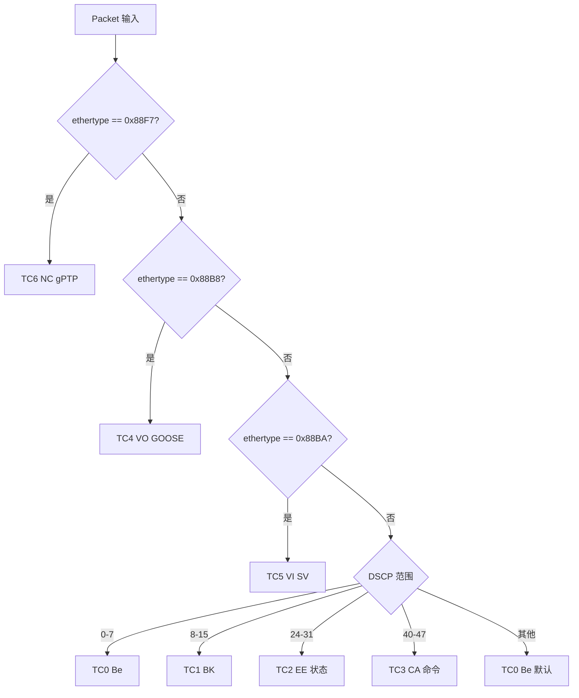

# EnerOS v0.80.0 TSN 网络配置（IEEE 802.1Qbv）设计文档

> **版本**：v0.80.0
> **Phase**：Phase 2 多机联邦
> **子系统**：`crates/protocols/tsn-time`
> **文档状态**：设计态
> **覆盖版本**：v0.80.0（TSN 802.1Qbv 时间感知整形）
> **最后更新**：2026-07-17

---

## 1. 版本目标

### 1.1 核心目标

v0.80.0 在 v0.79.0 gPTP 跨节点时间同步之上，为园区内多 Edge Box 之间的关键流量引入 **IEEE 802.1Qbv 时间感知整形（Time-Aware Shaper, TAS）调度层**，为 Agent 控制命令、GOOSE 跳闸、SV 采样等关键流量预留确定性时隙，确保端到端时延可预测、抖动可控。具体包括：

1. **门控列表（GCL）模型**：定义 `GateState` / `GateControlList` / `TasScheduleEntry`，按周期逐 entry 开关 8 个 TC（Traffic Class）门控，实现确定性的时隙划分。
2. **流量分类**：定义 `TrafficClass`（8 变体，对应 802.1Q PCP 等级）与 `Packet` 描述符（含 `ethertype` / `dscp` / `pcp`），通过 ethertype 识别 PTP/GOOSE/SV，否则按 DSCP 分段映射到 TC。
3. **调度器**：`TasScheduler` 提供 `validate_schedule`（闭合与时长校验）/ `classify_packet`（分类决策）/ `next_gate_window`（下一窗口偏移计算）/ `apply_to_nic`（下发抽象）。
4. **NIC 下发抽象**：通过 `NicApplier` trait + `MockNicApplier` 注入方式，验证门控列表闭合性、流量分类、下一窗口计算逻辑，**不依赖真实 netlink/taprio 下发**（偏差 D6）。
5. **流过滤骨架**：提供 `StreamId` / `StreamFilter` 纯数据类型，为后续 802.1Qci per-stream 过滤预留扩展点（偏差 D14）。

### 1.2 业务价值

- **确定性时延**：为 TC3（Agent 命令）/ TC4（GOOSE 跳闸）预留独占时隙，确保关键流量在 < 1ms 周期内必然获得发送机会，端到端时延可预测。
- **抖动隔离**：通过门控周期划分，将 Best Effort 流量与关键流量在时间维度上隔离，避免 BE 流量挤占关键流量带宽。
- **gPTP 价值落地**：v0.79.0 gPTP 提供的时间基线被 TAS 调度直接消费（`base_time_s` 起始对齐），形成"时间同步 → 时间感知整形"完整链路。
- **v0.81.0 解锁**：本版本交付纯算法骨架，为 v0.81.0 端到端时延验证与真实网卡下发奠定基础。

### 1.3 Phase 定位

| 维度 | 定位 |
|------|------|
| Phase | Phase 2 多机联邦（v0.75.0~v0.126.0） |
| 子阶段 | P2-B 时间同步子阶段（v0.79.0~v0.80.0） |
| 依赖关系 | 上承 v0.79.0 gPTP 时间同步；下接 v0.81.0 TSN 端到端时延验证 |
| 关键性 | 非刚性版本，但为 v0.81.0 端到端时延验证的必要前置 |

### 1.4 出口关联

本版本不构成 Phase 出口条件，但其交付物 `TasScheduler` / `TrafficClass` / `GateControlList` 将被以下后续版本直接复用：

- **v0.81.0** TSN 网络驱动与端到端时延验证：基于本版本的 `NicApplier` trait 接入真实 netlink/taprio 下发，并在硬件环境验证 TC3/TC4 时延 < 1ms。
- **v0.79.0 gPTP**：本版本的 `base_time_s` 字段直接消费 gPTP 同步后的高精度时钟基线。
- **SOE 引擎**：TSN 调度时隙与 SOE 事件时间戳对齐，提升事件排序确定性。

---

## 2. 前置依赖

### 2.1 前序版本依赖

| 版本 | 交付物 | 本版本使用方式 |
|------|--------|---------------|
| v0.79.0 | gPTP 时间同步（`PtpTime` / `GptpClock`） | 本版本 `TasScheduler.base_time` 使用 `PtpTime::new(config.base_time_s, 0)` 构造（偏差 D7：不修改 v0.79.0 `clock.rs` 添加 `from_unix()`） |
| v0.28.0 | smoltcp TCP/IP 栈 | 本版本不直接调用 smoltcp，但 `Packet` 描述符的 `ethertype` / `dscp` / `pcp` 字段语义与 smoltcp 报文解析结果对齐 |
| v0.11.0 | 用户态堆（`alloc`） | 本版本 `Vec<GateState>` / `Vec<TasScheduleEntry>` / `Vec<TasPort>` 等需 `alloc` 支持 |

### 2.2 外部依赖

| 依赖 | 版本 | 用途 | feature |
|------|------|------|---------|
| `alloc` | core 自带 | `Vec` 用于 GCL entries / 端口表 / Mock 记录 | 默认 |
| `core` | core 自带 | `Duration` / `Option` / `Result` / `Display` | 默认 |

> **说明**：本版本为算法骨架，不引入任何外部 TSN/netlink/pcap 库依赖（偏差 D6：通过 `NicApplier` trait + `MockNicApplier` 抽象，无真实系统调用；偏差 D15：无 `toml` / `serde` crate 依赖）。本版本亦不引入 `log` crate（沿用 v0.79.0 单线程先例，偏差 D18）。

### 2.3 假设

1. **gPTP 已就绪假设**：本版本假设 v0.79.0 gPTP 已完成时间同步，所有节点共享统一高精度时钟基线（< 1ms 偏差）。否则 TAS 调度的 `base_time_s` 对齐将失效，门控周期可能错位。
2. **TSN 硬件假设**：目标网卡/交换机支持 802.1Qbv 硬件门控（如 Intel i225/i226、TI DP83869、NXP LS1028A TSN 交换机）。本版本仅交付算法骨架，不验证硬件兼容性（偏差 D6：通过 `NicApplier` trait 抽象，真实下发延后到 v0.81.0）。
3. **流量分类规则假设**：上层 Agent 已通过 PCP/DSCP/ethertype 标记流量等级。本版本仅负责按既定规则识别 TC，不负责打标。
4. **单线程假设**：Agent Runtime 在 Phase 2 阶段为单线程模型（蓝图 §43.6 内存预算：Agent Runtime ≤ 64 MB），`TasScheduler` 实现不要求 `Send + Sync`（偏差 D18）。
5. **配置只读假设**：`TasConfig` 一旦构造即只读，运行时不允许修改 GCL（避免调度错乱）。

### 2.4 阻塞条件

- 若 v0.79.0 gPTP 未合入或时间同步未达标（> 1ms 偏差），则本版本的 `base_time_s` 对齐失效，但算法骨架（闭合校验、分类、窗口计算）仍可工作。
- 若目标硬件不支持 802.1Qbv 硬件门控，则本版本退化为软件优先级调度（按 TC 排序发送），无法保证确定性时延，但 `MockNicApplier` 仍可验证算法逻辑。

---

## 3. 交付物清单

### 3.1 代码交付物

| 路径 | 内容 | 说明 |
|------|------|------|
| `crates/protocols/tsn-time/src/lib.rs` | crate 入口与 T1~T55 测试 | 模块导出与单元测试内嵌（偏差 D4） |
| `crates/protocols/tsn-time/src/tas.rs` | TAS 核心类型与调度算法 | `TrafficClass` / `Packet` / `GateState` / `GateControlList` / `TasPort` / `TasConfig` / `TasScheduleEntry` / `TasError` / `TasScheduler` / `NicApplier` / `MockNicApplier` |
| `crates/protocols/tsn-time/src/stream.rs` | Stream 过滤数据类型（最小骨架） | `StreamId` / `StreamFilter`（偏差 D14：纯数据，无过滤逻辑） |
| `crates/protocols/tsn-time/src/config_loader.rs` | 配置构造器 | `build_tas_config`（偏差 D15：无 TOML 解析） |

> **偏差 D1 / D19**：复用 v0.79.0 的 `crates/protocols/tsn-time/` crate（不新建 crate，扩展已有），位于 `crates/protocols/tsn-time/`（项目规则 §2.3.1 子系统分组）。

### 3.2 接口交付物

| 接口 | 类型 | 用途 |
|------|------|------|
| `TrafficClass` | enum | 8 变体流量分类（对应 802.1Q PCP） |
| `Packet` | struct | 数据包描述符（ethertype/dscp/pcp） |
| `GateState` / `GateControlList` | struct | 门控状态与门控列表 |
| `TasScheduleEntry` / `TasConfig` / `TasPort` | struct | 调度配置与端口 |
| `TasError` | enum | 4 变体错误 |
| `NicApplier` / `MockNicApplier` | trait / struct | 网卡下发抽象与 Mock 实现 |
| `TasScheduler` | struct | TAS 调度器（核心算法） |
| `StreamId` / `StreamFilter` | newtype / struct | 流过滤骨架 |
| `build_tas_config` | fn | 配置构造器 |

### 3.3 文档交付物

| 路径 | 内容 |
|------|------|
| `docs/protocols/tsn-qbv-design.md` | 本设计文档（偏差 D2：非蓝图 `docs/phase2/tsn_qbv.md`） |

### 3.4 测试交付物

| 测试 ID | 类型 | 位置 |
|---------|------|------|
| T26~T55 | 单元测试 | `crates/protocols/tsn-time/src/lib.rs`（偏差 D4：内嵌而非 `tests/tas_*.rs`） |

> **说明**：v0.79.0 的 T1~T25 测试保留不变（Surgical Changes 原则），本版本仅在 `lib.rs` 末尾追加 T26~T55。

### 3.5 配置交付物

| 路径 | 内容 |
|------|------|
| `configs/tas.toml` | TAS 门控列表配置模板（偏差 D3：非蓝图 `config/tas.toml`） |

---

## 4. 数据结构

> 本章节详细定义 TSN 802.1Qbv 调度层所有公开数据结构。所有结构均满足 no_std 合规（蓝图 §43.1），不使用 `std::*`。

### 4.1 `TrafficClass`

```rust
/// 流量分类枚举（8 变体，对应 802.1Q PCP 等级）。
///
/// 偏差声明 D13：使用 `#[repr(u8)]` + `Be = 0` 命名变体（Rust 惯例），
/// 非蓝图 `Be(0)` tuple 变体（tuple 变体需 `match` 时解构，命名变体更直观）。
#[derive(Debug, Clone, Copy, PartialEq, Eq, Hash)]
#[repr(u8)]
pub enum TrafficClass {
    Be = 0,  // Best Effort
    BK = 1,  // Background
    EE = 2,  // Energy Efficiency（Agent 状态）
    CA = 3,  // Critically Auth（Agent 命令）
    VO = 4,  // Voice（GOOSE）
    VI = 5,  // Video（SV）
    NC = 6,  // Network Control（gPTP）
    ST = 7,  // Strategic（保留）
}
```

**设计要点**：
- `#[repr(u8)]`：确保 `code()` 直接返回 `self as u8`，无运行时开销。
- 命名变体（`Be` 而非 `Be(0)`）：避免 match 时解构 tuple，提升可读性（偏差 D13）。
- 派生 `Hash`：可用于 `BTreeMap` / `HashMap` 键（虽然本版本不强制要求）。

### 4.2 `Packet`

```rust
/// 数据包描述符（最小数据集，无真实抓包）。
///
/// 偏差声明 D5：仅含 ethertype/dscp/pcp 三字段，
/// 不含真实抓包缓冲区（由上层构造，沿用 v0.75.0 `MockDdsNode` 模式）。
#[derive(Debug, Clone, Copy, PartialEq, Eq)]
pub struct Packet {
    /// 以太网类型（0x88F7 = PTP, 0x88B8 = GOOSE, 0x88BA = SV, 0x0800 = IPv4）
    pub ethertype: u16,
    /// IP DSCP 字段（6 位，0-63）
    pub dscp: u8,
    /// 802.1Q PCP 字段（3 位，0-7）
    pub pcp: u8,
}
```

**设计要点**：
- 三字段对齐 802.1Q / IPv4 报文头部关键字段。
- `Copy`：32 位数据，整体拷贝高效。
- 不含 payload：本版本仅做分类决策，不解析应用层（偏差 D5）。

### 4.3 `GateState` 与 `GateControlList`

```rust
/// 单条门控状态（duration 内保持 gates 掩码）。
#[derive(Debug, Clone, PartialEq, Eq)]
pub struct GateState {
    /// 持续时长
    pub duration: Duration,
    /// 8 位门控掩码（bit i = 1 表示 TCi 开放）
    pub gates: u8,
}

/// 门控列表（Gate Control List）。
#[derive(Debug, Clone, PartialEq, Eq)]
pub struct GateControlList {
    /// GCL 条目序列（按周期内时间顺序排列）
    pub entries: Vec<GateState>,
    /// 周期计数（每完成一个周期自增 1）
    pub cycle_count: u32,
}
```

**设计要点**：
- `gates: u8`：8 位掩码对应 8 个 TC，`gates >> tc.code() & 1 == 1` 判断 TC 是否开放。
- `cycle_count`：跟踪调度器运行的周期数，用于诊断与统计。
- `Vec<GateState>`：周期内 entry 数量可变（典型 5~10 条），用 `alloc::vec::Vec`。

### 4.4 `TasScheduleEntry` / `TasConfig` / `TasPort`

```rust
/// TAS 调度条目（配置层，从 TOML 加载的原始字段）。
#[derive(Debug, Clone, Copy, PartialEq, Eq)]
pub struct TasScheduleEntry {
    /// 持续时长（微秒）
    pub duration_us: u64,
    /// 8 位门控掩码
    pub gate_mask: u8,
}

/// TAS 配置（整体调度参数）。
///
/// 偏差声明 D8：显式定义 TasConfig 结构体
/// （蓝图未完整定义，本版本补全字段：cycle_us / base_time_s / schedule / port_count）。
#[derive(Debug, Clone, PartialEq, Eq)]
pub struct TasConfig {
    /// 调度周期（微秒），1ms = 1000us
    pub cycle_us: u64,
    /// 基准时间（秒，Unix epoch），0 表示从下一个周期边界开始
    pub base_time_s: u64,
    /// 门控列表（每条 entry 含 duration_us + gate_mask）
    pub schedule: Vec<TasScheduleEntry>,
    /// 端口数量
    pub port_count: u8,
}

/// TAS 端口状态。
///
/// 偏差声明 D10：简化为 `port_id + applied`，
/// 消除蓝图 `TasPort.gate_states` + `GateControlList.entries` 冗余
/// （gate_states 与 GCL entries 重复存储同一信息）。
#[derive(Debug, Clone, PartialEq, Eq)]
pub struct TasPort {
    /// 端口 ID
    pub port_id: u8,
    /// 是否已下发 GCL
    pub applied: bool,
}
```

**设计要点**：
- `TasScheduleEntry` 与 `GateState` 字段不同：前者是配置层（`duration_us: u64`），后者是运行时（`duration: Duration`），由 `TasScheduler::new` 转换。
- `TasConfig::default()`：`cycle_us = 1_000_000`（1ms 周期）/ `base_time_s = 0` / `schedule = Vec::new()` / `port_count = 1`。
- `TasPort` 不存储 GCL：GCL 统一在 `TasScheduler.config` 中，端口仅记录 `applied` 标志（偏差 D10）。

### 4.5 `TasError`

```rust
/// TAS 错误枚举（4 变体）。
///
/// 偏差声明 D9：TasError 含 4 变体（蓝图只描述 ScheduleGap + TooShort 2 个），
/// 本版本补全 NicApplyFailed（Mock 失败）+ InvalidConfig（保留变体，配置非法）。
#[derive(Debug, Clone, Copy, PartialEq, Eq)]
pub enum TasError {
    /// 调度不闭合（总 duration != cycle_time）
    ScheduleGap { expected: Duration, actual: Duration },
    /// 门控时间 < 5µs（硬件限制）
    TooShort(Duration),
    /// 网卡下发失败（Mock 模式 fail=true）
    NicApplyFailed,
    /// 配置非法（保留变体）
    InvalidConfig,
}
```

### 4.6 `NicApplier` trait 与 `MockNicApplier`

```rust
/// NIC 下发抽象 trait。
///
/// 偏差声明 D6：通过 trait + MockNicApplier 抽象，
/// 无真实 netlink/taprio 下发（真实集成延后到 v0.81.0）。
pub trait NicApplier {
    /// 将 GCL 下发到指定网卡接口。
    ///
    /// # 参数
    /// - `iface`: 网卡接口名（如 "eth0"）
    /// - `config`: 门控列表
    ///
    /// # 返回
    /// - `Ok(())`：下发成功
    /// - `Err(TasError::NicApplyFailed)`：下发失败
    fn apply(&mut self, iface: &str, config: &GateControlList) -> Result<(), TasError>;
}

/// Mock NIC 下发实现（用于单元测试）。
#[derive(Debug, Clone, PartialEq, Eq)]
pub struct MockNicApplier {
    /// 已下发的记录：(iface, entry_count)
    pub applied: Vec<(String, u32)>,
    /// 是否模拟下发失败
    pub fail: bool,
}
```

### 4.7 `TasScheduler`

```rust
/// TAS 调度器（核心算法承载）。
#[derive(Debug, Clone, PartialEq, Eq)]
pub struct TasScheduler {
    /// 端口列表（每个端口独立应用同一 GCL）
    pub ports: Vec<TasPort>,
    /// 基准时间（gPTP 同步后的调度起始时刻）
    pub base_time: PtpTime,
    /// 调度周期
    pub cycle_time: Duration,
    /// 门控列表（运行时形态）
    pub config: GateControlList,
}
```

**设计要点**：
- `base_time: PtpTime`：复用 v0.79.0 的 `PtpTime` 类型，由 `PtpTime::new(config.base_time_s, 0)` 构造（偏差 D7）。
- `cycle_time: Duration`：从 `TasConfig.cycle_us` 转换为 `Duration::from_micros(cycle_us)`。
- `config: GateControlList`：从 `TasConfig.schedule` 转换为运行时形态（`duration_us` → `Duration`）。

### 4.8 `StreamId` 与 `StreamFilter`

```rust
/// 流标识符（newtype）。
///
/// 偏差声明 D14：纯数据类型，无真实 802.1Qci per-stream 过滤逻辑
/// （延后到后续版本）。
#[derive(Debug, Clone, Copy, PartialEq, Eq, Hash)]
pub struct StreamId(pub u32);

/// 流过滤器（最小骨架）。
#[derive(Debug, Clone, PartialEq, Eq)]
pub struct StreamFilter {
    /// 流标识符
    pub stream_id: StreamId,
    /// 门控 ID
    pub gate_id: u8,
    /// 优先级
    pub priority: u8,
}
```

### 4.9 802.1Qbv 门控周期甘特图

下图展示 `configs/tas.toml` 中 1ms 周期的门控时隙划分（5 条 entry）：

```mermaid
gantt
    title 802.1Qbv 门控周期（1ms = 1000µs）
    dateFormat X
    axisFormat %L
    section TC6(gPTP)
    开放 :0, 50
    section TC4(GOOSE)
    开放 :50, 100
    section TC3(命令)
    开放 :150, 100
    section TC2(状态)
    开放 :250, 250
    section TC0(BE)
    开放 :500, 500
```



---

## 5. 接口设计

### 5.1 `TrafficClass::code` / `from_code`

```rust
/// 返回流量分类编码（0-7）。
pub fn code(&self) -> u8;

/// 反编码（0-7 → Some，8+ → None）。
pub fn from_code(code: u8) -> Option<Self>;
```

### 5.2 `Packet::is_ptp` / `is_goose` / `is_sv`

```rust
/// 是否为 PTP 数据包（ethertype == 0x88F7）。
pub fn is_ptp(&self) -> bool;

/// 是否为 GOOSE 数据包（ethertype == 0x88B8）。
pub fn is_goose(&self) -> bool;

/// 是否为 SV 数据包（ethertype == 0x88BA）。
pub fn is_sv(&self) -> bool;
```

### 5.3 `GateControlList::new` / `increment_cycle`

```rust
/// 构造 GCL（cycle_count = 0 初始）。
pub fn new(entries: Vec<GateState>) -> Self;

/// 周期计数自增 1。
pub fn increment_cycle(&mut self);
```

### 5.4 `TasConfig::default`

```rust
/// 默认配置：cycle_us = 1_000_000 / base_time_s = 0 / schedule = Vec::new() / port_count = 1。
impl Default for TasConfig {
    fn default() -> Self;
}
```

### 5.5 `TasPort::new`

```rust
/// 构造端口（applied = false 初始）。
pub fn new(port_id: u8) -> Self;
```

### 5.6 `TasScheduler::new`

```rust
/// 构造调度器。
///
/// 偏差声明 D7：使用 `PtpTime::new(config.base_time_s, 0)`，
/// 不修改 v0.79.0 `clock.rs` 添加 `from_unix()`。
pub fn new(config: &TasConfig) -> Self;
```

### 5.7 `TasScheduler::validate_schedule`

```rust
/// 校验调度闭合性与时长。
///
/// - 所有 entry duration 之和 == cycle_time（否则 `ScheduleGap`）
/// - 任一 entry duration < 5µs（否则 `TooShort`）
pub fn validate_schedule(&self) -> Result<(), TasError>;
```

### 5.8 `TasScheduler::classify_packet`

```rust
/// 数据包分类决策。
///
/// 偏差声明 D12：通过 `pkt.ethertype` 识别 PTP/GOOSE/SV；
/// 否则 DSCP 分段映射（0-7 → BE、8-15 → BK、24-31 → EE、40-47 → CA、其他 → BE）。
pub fn classify_packet(&self, pkt: &Packet) -> TrafficClass;
```

### 5.9 `TasScheduler::next_gate_window`

```rust
/// 计算下一窗口偏移。
///
/// 偏差声明 D11：遍历 GCL 找首个 `gates >> tc.code() & 1 == 1` 的 entry，
/// 返回从周期起点到该 entry 的累计 duration；
/// 若 TC 永未开放，返回 `cycle_time`（全周期等待）。
pub fn next_gate_window(&self, tc: TrafficClass) -> Duration;
```

### 5.10 `TasScheduler::apply_to_nic`

```rust
/// 将 GCL 下发到网卡。
///
/// 先调用 `validate_schedule()`，再调用 `applier.apply(iface, &self.config)`；
/// 任一端口下发失败 → `NicApplyFailed`。
pub fn apply_to_nic(
    &mut self,
    applier: &mut dyn NicApplier,
    iface: &str,
) -> Result<(), TasError>;
```

### 5.11 `NicApplier::apply`

```rust
/// 将 GCL 下发到指定网卡接口（trait 方法）。
fn apply(&mut self, iface: &str, config: &GateControlList) -> Result<(), TasError>;
```

### 5.12 `MockNicApplier::new`

```rust
/// 构造 Mock（applied = Vec::new(), fail = false）。
pub fn new() -> Self;
```

### 5.13 `StreamId::new` / `StreamFilter::new`

```rust
/// 构造流标识符。
pub fn new(id: u32) -> Self;

/// 构造流过滤器。
///
/// 偏差声明 D14：纯数据类型，无真实 802.1Qci per-stream 过滤逻辑。
pub fn new(stream_id: StreamId, gate_id: u8, priority: u8) -> Self;
```

### 5.14 `build_tas_config`

```rust
/// 配置构造器（纯 Rust 函数，无 TOML 解析）。
///
/// 偏差声明 D15：TOML 解析由 eneros-config v0.26.0 上层处理，
/// 本版本仅提供纯 Rust 构造器。
pub fn build_tas_config(
    cycle_us: u64,
    base_time_s: u64,
    entries: Vec<TasScheduleEntry>,
    port_count: u8,
) -> TasConfig;
```

### 5.15 `classify_packet` 决策流程图

下图展示 `classify_packet` 的分类决策逻辑（ethertype 优先，DSCP 分段兜底）：



---

## 6. 错误处理

### 6.1 `TasError::ScheduleGap`

**场景**：`validate_schedule` 检测到 GCL 所有 entry 的 `duration` 之和 != `cycle_time`。

**触发条件**：
- `configs/tas.toml` 中所有 `[[schedule]]` 的 `duration_us` 之和 != `cycle_us`。
- 例：`cycle_us = 1000`，但 entries 总和 = 800（缺 200µs）。

**返回**：`Err(TasError::ScheduleGap { expected: 1000µs, actual: 800µs })`

**处理策略**：
- `apply_to_nic` 在 `validate_schedule` 失败时立即返回错误，**不下发到网卡**（`mock.applied.is_empty()`）。
- 上层 Agent 责任修正配置后重试。

### 6.2 `TasError::TooShort`

**场景**：`validate_schedule` 检测到任一 entry 的 `duration` < 5µs。

**触发条件**：
- 任一 `[[schedule]]` 的 `duration_us` < 5。
- 硬件限制：802.1Qbv 门控切换最小粒度为 5µs（Intel i225 参考值）。

**返回**：`Err(TasError::TooShort(3µs))`

**处理策略**：
- 同 ScheduleGap，`apply_to_nic` 立即返回错误，不下发。
- 上层 Agent 责任合并过短的 entry 或调整周期。

### 6.3 `TasError::NicApplyFailed`

**场景**：`MockNicApplier.fail = true` 或真实网卡下发失败。

**触发条件**：
- 单元测试：手动设置 `mock.fail = true`。
- 真实环境（v0.81.0）：netlink/taprio 调用返回错误。

**返回**：`Err(TasError::NicApplyFailed)`

**处理策略**：
- `apply_to_nic` 调用 `applier.apply()` 失败时立即返回，标记 `port.applied = false`。
- 上层 Agent 责任重试或降级到软件优先级调度。

### 6.4 `TasError::InvalidConfig`

**场景**：配置非法（保留变体）。

**触发条件**：
- 本版本不主动返回此错误（保留变体，预留给后续版本）。
- 潜在场景：`port_count = 0` / `cycle_us = 0` / `base_time_s` 溢出等。

**返回**：`Err(TasError::InvalidConfig)`

**处理策略**：
- 本版本仅在枚举中声明，不实现触发逻辑。
- 后续版本按需补充校验规则。

### 6.5 错误恢复策略

| 错误类别 | 恢复策略 | 责任方 |
|---------|---------|--------|
| ScheduleGap | 修正配置（合并/拆分 entry 使总和 = cycle_us） | 上层 Agent |
| TooShort | 合并过短 entry 或调整周期 | 上层 Agent |
| NicApplyFailed | 重试或降级到软件优先级调度 | 上层 Agent |
| InvalidConfig | 修正配置后重启调度器 | 上层 Agent |

---

## 7. 选型对比

### 7.1 TAS 整形方案对比

| 维度 | 802.1Qbv TAS | 802.1Qav CBS | 严格优先级 | DRR/WRR |
|------|--------------|--------------|-----------|---------|
| **调度模型** | 时间感知（基于时钟的门控开关） | 信用积分（基于带宽的令牌桶） | 优先级排队（按 PCP 排序） | 轮询调度（按权重循环） |
| **时延保证** | ✅ 确定性（时隙预留） | ❌ 概率性（受信用积分影响） | ❌ 概率性（高优先级抢占） | ❌ 公平性（无时延保证） |
| **抖动控制** | ✅ 极低（时隙边界对齐） | 中（信用积分平滑） | 高（高优先级突发） | 中（轮询周期） |
| **硬件要求** | 802.1Qbv 硬件门控 | 802.1Qav CBS 硬件 | 普通网卡 | 普通网卡 |
| **配置复杂度** | 高（需 GCL 设计 + 时钟同步） | 中（需带宽配额） | 低 | 中 |
| **TSN 标准兼容** | ✅ 是 | ✅ 是 | ❌ 否 | ❌ 否 |
| **gPTP 依赖** | ✅ 必须（时隙对齐） | ❌ 不依赖 | ❌ 不依赖 | ❌ 不依赖 |
| **本版本采用** | ✅ | ❌ | ❌（降级路径） | ❌ |

> **决策**：本版本采用 802.1Qbv TAS 作为主调度方案，理由：
> 1. **确定性时延**：TAS 是唯一能提供硬实时时延保证的整形方案，满足能源 Agent 控制命令 < 1ms 的需求。
> 2. **gPTP 协同**：v0.79.0 gPTP 已提供时间基线，TAS 直接消费，形成"时间同步 → 时间感知整形"完整链路。
> 3. **TSN 标准兼容**：与目标硬件（Intel i225/i226、NXP LS1028A）的 802.1Qbv 实现兼容。
> 4. **降级路径**：若硬件不支持 802.1Qbv，可退化为严格优先级调度（按 TC 排序），虽失去确定性但保证基本可用性。

---

## 8. 实现路径

### 8.1 实现路径概览（3 步）

```
Step 1: 定义调度数据结构（tas.rs / stream.rs / config_loader.rs）
   ↓
Step 2: 实现分类与调度验证（TasScheduler::classify_packet / validate_schedule / next_gate_window）
   ↓
Step 3: 通过 NicApplier trait 下发到网卡（Mock 实现，真实集成延后到 v0.81.0）
```

### 8.2 Step 1：定义调度数据结构

**文件**：
- `crates/protocols/tsn-time/src/tas.rs`：`TrafficClass` / `Packet` / `GateState` / `GateControlList` / `TasScheduleEntry` / `TasConfig` / `TasPort` / `TasError` / `NicApplier` / `MockNicApplier` / `TasScheduler`
- `crates/protocols/tsn-time/src/stream.rs`：`StreamId` / `StreamFilter`
- `crates/protocols/tsn-time/src/config_loader.rs`：`build_tas_config`

**内容**：
- 按本章节 §4 数据结构定义所有类型。
- 派生 `Debug, Clone, Copy, PartialEq, Eq` 等标准 trait。
- 实现构造方法（`new` / `default`）。

**验证**：`cargo build -p eneros-tsn-time` 通过。

### 8.3 Step 2：实现分类与调度验证

**文件**：`crates/protocols/tsn-time/src/tas.rs`

**内容**：
- 实现 `TrafficClass::code` / `from_code`（按 §5.1）
- 实现 `Packet::is_ptp` / `is_goose` / `is_sv`（按 §5.2）
- 实现 `GateControlList::new` / `increment_cycle`（按 §5.3）
- 实现 `TasScheduler::new` / `validate_schedule` / `classify_packet` / `next_gate_window`（按 §5.6~§5.9）
- `validate_schedule`：遍历 GCL entries 累加 duration，与 cycle_time 比较；同时检查每条 duration >= 5µs。
- `classify_packet`：ethertype 优先（0x88F7 → NC / 0x88B8 → VO / 0x88BA → VI），否则 DSCP 分段（0-7 → BE / 8-15 → BK / 24-31 → EE / 40-47 → CA / 其他 → BE）。
- `next_gate_window`：遍历 GCL 找首个匹配 entry，累加前序 duration 作为偏移。

**验证**：
- `cargo build -p eneros-tsn-time` 通过
- `cargo test -p eneros-tsn-time` 通过（T26~T49 单元测试）

### 8.4 Step 3：通过 NicApplier trait 下发到网卡

**文件**：`crates/protocols/tsn-time/src/tas.rs`

**内容**：
- 实现 `NicApplier` trait（按 §5.11）
- 实现 `MockNicApplier::new` + `NicApplier for MockNicApplier`（按 §5.12）
  - `fail = false`：追加 `(iface.to_string(), config.entries.len() as u32)` 到 `applied`，返回 `Ok(())`
  - `fail = true`：返回 `Err(TasError::NicApplyFailed)`
- 实现 `TasScheduler::apply_to_nic`（按 §5.10）
  - 先调用 `validate_schedule()`，失败则立即返回错误（不下发）
  - 遍历 `self.ports`，对每个端口调用 `applier.apply(iface, &self.config)`
  - 任一端口失败 → `NicApplyFailed`，标记 `applied = false`
  - 全部成功 → 标记所有端口 `applied = true`，返回 `Ok(())`

**验证**：
- `cargo build -p eneros-tsn-time` 通过
- `cargo test -p eneros-tsn-time` 通过（T50~T55 单元测试）
- `cargo clippy -p eneros-tsn-time --all-targets -- -D warnings` 无 warning
- `cargo fmt --all -- --check` 通过
- `cargo deny check advisories licenses bans sources` 通过
- `cargo build -p eneros-tsn-time --target aarch64-unknown-none -Z build-std=core,alloc -Z build-std-features=compiler-builtins-mem` 通过

### 8.5 lib.rs 集成

**文件**：`crates/protocols/tsn-time/src/lib.rs`

**修改**（仅在 v0.79.0 lib.rs 末尾追加，不重排已有声明）：

```rust
//! eneros-tsn-time crate 顶层文档
//! ...
//! v0.80.0 新增模块：
//! - `tas`: TSN 802.1Qbv 时间感知整形（TAS）调度
//! - `stream`: 流过滤数据类型（最小骨架）
//! - `config_loader`: 配置构造器

pub mod bmca;
pub mod clock;
pub mod config_loader;  // v0.80.0 新增
pub mod gptp;
pub mod port;
pub mod stream;         // v0.80.0 新增
pub mod tas;            // v0.80.0 新增

// v0.79.0 导出保留不变
pub use bmca::{compare_priority, AnnounceMessage, BmcaResult};
pub use clock::{ClockIdentity, MacAddr, PtpTime};
pub use gptp::{FollowUpMessage, GptpClock, GptpConfig, SyncMessage};
pub use port::{Port, PortRole, PortState};

// v0.80.0 新增导出
pub use config_loader::build_tas_config;
pub use stream::{StreamFilter, StreamId};
pub use tas::{
    GateControlList, GateState, MockNicApplier, NicApplier, Packet, TasConfig,
    TasError, TasPort, TasScheduleEntry, TasScheduler, TrafficClass,
};

#[cfg(test)]
mod tests {
    // T1~T25（v0.79.0）保留不变
    // T26~T55（v0.80.0 新增）
}
```

---

## 9. 测试计划

### 9.1 测试矩阵 T26~T55

| 测试 ID | 类型 | 测试名称 | 输入 | 期望输出 |
|---------|------|---------|------|---------|
| T26 | 单元 | `test_traffic_class_code` | 8 变体 `code()` | 返回 0~7 |
| T27 | 单元 | `test_traffic_class_from_code` | `from_code(0~7)` / `from_code(8)` | 0~7 返回 Some，8 返回 None |
| T28 | 单元 | `test_packet_ethertype_identify` | `Packet{0x88F7,0,0}` / `Packet{0x88B8,0,0}` / `Packet{0x88BA,0,0}` | `is_ptp()` / `is_goose()` / `is_sv()` 返回 true |
| T29 | 单元 | `test_packet_field_access` | `Packet{0x0800,46,5}` | `ethertype == 0x0800` / `dscp == 46` / `pcp == 5` |
| T30 | 单元 | `test_gate_state_new` | `GateState{50µs, 0x40}` | 字段值与构造一致 |
| T31 | 单元 | `test_gate_control_list_new` | `GateControlList::new(entries)` | `cycle_count == 0` |
| T32 | 单元 | `test_gate_control_list_increment_cycle` | 调用 `increment_cycle()` 3 次 | `cycle_count == 3` |
| T33 | 单元 | `test_tas_config_default` | `TasConfig::default()` | `cycle_us == 1_000_000` / `port_count == 1` / `schedule.is_empty()` |
| T34 | 单元 | `test_tas_port_new` | `TasPort::new(1)` | `port_id == 1` / `applied == false` |
| T35 | 单元 | `test_tas_scheduler_new` | `TasScheduler::new(&config)` | `base_time == PtpTime::new(base_time_s, 0)` / `cycle_time == Duration::from_micros(cycle_us)` |
| T36 | 单元 | `test_validate_schedule_ok` | 闭合 GCL + 每条 >= 5µs | `Ok(())` |
| T37 | 单元 | `test_validate_schedule_gap` | entries 总和 = 800µs, cycle = 1000µs | `Err(ScheduleGap{expected:1000µs, actual:800µs})` |
| T38 | 单元 | `test_validate_schedule_too_short` | 任一 entry duration = 3µs | `Err(TooShort(3µs))` |
| T39 | 单元 | `test_classify_packet_ptp` | `Packet{0x88F7,0,0}` | `TrafficClass::NC` |
| T40 | 单元 | `test_classify_packet_goose` | `Packet{0x88B8,0,0}` | `TrafficClass::VO` |
| T41 | 单元 | `test_classify_packet_sv` | `Packet{0x88BA,0,0}` | `TrafficClass::VI` |
| T42 | 单元 | `test_classify_packet_dscp_be` | `Packet{0x0800,5,0}` | `TrafficClass::Be`（DSCP 0-7） |
| T43 | 单元 | `test_classify_packet_dscp_bk` | `Packet{0x0800,10,0}` | `TrafficClass::BK`（DSCP 8-15） |
| T44 | 单元 | `test_classify_packet_dscp_ee` | `Packet{0x0800,28,0}` | `TrafficClass::EE`（DSCP 24-31） |
| T45 | 单元 | `test_classify_packet_dscp_ca` | `Packet{0x0800,46,0}` | `TrafficClass::CA`（DSCP 40-47） |
| T46 | 单元 | `test_classify_packet_dscp_default` | `Packet{0x0800,48,0}` | `TrafficClass::Be`（默认分支） |
| T47 | 单元 | `test_next_gate_window_first` | GCL `[(50µs, 0x40), ...]`, tc=NC | `0µs`（首条即匹配） |
| T48 | 单元 | `test_next_gate_window_second` | GCL `[(50µs, 0x40), (200µs, 0x08), ...]`, tc=CA | `50µs`（第二窗口） |
| T49 | 单元 | `test_next_gate_window_never_open` | GCL 不含 TC7, tc=ST | `cycle_time`（全周期等待） |
| T50 | 单元 | `test_apply_to_nic_success` | `mock.fail = false` | `Ok(())` / `mock.applied.len() == 1` / `mock.applied[0].0 == "eth0"` |
| T51 | 单元 | `test_apply_to_nic_invalid_schedule` | 调度不闭合 | `Err(ScheduleGap{..})` / `mock.applied.is_empty()` |
| T52 | 单元 | `test_stream_id_new` | `StreamId::new(42)` | `format!("{}", stream_id)` 输出 `"42"` |
| T53 | 单元 | `test_stream_filter_new` | `StreamFilter::new(sid, 1, 5)` | 字段值与构造一致 |
| T54 | 单元 | `test_build_tas_config` | `build_tas_config(1000, 100, vec![], 2)` | 各字段与传入参数一致 |
| T55 | 单元 | `test_mock_nic_applier_fail` | `mock.fail = true` | `apply_to_nic` 返回 `Err(NicApplyFailed)` |

### 9.2 集成测试

| 测试 ID | 类型 | 状态 | 说明 |
|---------|------|------|------|
| — | 真实网卡下发集成测试 | ❌ 不实现（偏差 D6） | CI 无 TSN 硬件环境，延后到 v0.81.0 |

### 9.3 性能基准

| 测试 ID | 类型 | 状态 | 说明 |
|---------|------|------|------|
| — | TC3/TC4 时延 < 1ms 基准 | ❌ 不实现（偏差 D6） | 本版本仅算法骨架，真实时延验证延后到 v0.81.0 |

### 9.4 回归测试

| 测试范围 | 验证内容 |
|---------|---------|
| v0.79.0 gPTP | `cargo test -p eneros-tsn-time` T1~T25 不破坏现有测试 |
| v0.75.0~v0.78.0 Agent Bus DDS | `cargo test -p eneros-agent-bus-dds` 63 tests + 1 doctest 通过，无回归 |
| aarch64 交叉编译 | `cargo build -p eneros-tsn-time --target aarch64-unknown-none -Z build-std=core,alloc` 通过 |

---

## 10. 验收标准

### 10.1 功能验收

- [ ] **F1**：30 个单元测试（T26~T55）全部通过
- [ ] **F2**：门控调度闭合性校验生效（`validate_schedule` 检测 ScheduleGap / TooShort）
- [ ] **F3**：流量分类决策正确（PTP/GOOSE/SV ethertype 识别 + DSCP 分段映射）
- [ ] **F4**：下一窗口偏移计算正确（首窗口 / 第二窗口 / 永未开放三场景）
- [ ] **F5**：`apply_to_nic` 成功路径标记 `applied = true`，失败路径不下发
- [ ] **F6**：`MockNicApplier` 正确记录下发记录 `(iface, entry_count)`

### 10.2 性能验收

- [ ] **P1**：TC3（Agent 命令）/ TC4（GOOSE 跳闸）时延 < 1ms（本版本仅算法骨架，真实时延验证延后到 v0.81.0，偏差 D6）

> **偏差 D6 说明**：蓝图要求 TC3/TC4 时延 < 1ms，本版本仅做算法正确性测试，不在 CI 中验证时延基线。性能基准由 v0.81.0 硬件集成阶段回归验证。

### 10.3 安全验收

- [ ] **S1**：`TasConfig` 一旦构造即只读（运行时不允许修改 GCL，避免调度错乱）
- [ ] **S2**：`MockNicApplier.applied` 不泄露敏感信息（仅记录 iface 名与 entry 数量）
- [ ] **S3**：`configs/tas.toml` 不含密钥（仅配置参数）

### 10.4 文档验收

- [ ] **D1**：本设计文档 12 章节完整
- [ ] **D2**：2 个 Mermaid 图渲染正常（802.1Qbv 门控周期甘特图 + classify_packet 决策流程图）
- [ ] **D3**：D1~D19 偏差声明表完整（含 v0.79.0 继承的 D1~D14 + v0.80.0 新增 D15~D19）
- [ ] **D4**：`cargo doc -p eneros-tsn-time` 无 warning
- [ ] **D5**：TSN 配置指南（`configs/tas.toml` 注释完整，含流量分类规则参考）

### 10.5 出口判定

- [ ] **E1**：T26~T55 全绿（30 个测试）
- [ ] **E2**：v0.79.0 T1~T25 无回归
- [ ] **E3**：aarch64-unknown-none 交叉编译通过
- [ ] **E4**：`cargo fmt --all -- --check` 通过
- [ ] **E5**：`cargo clippy -p eneros-tsn-time --all-targets -- -D warnings` 无 warning
- [ ] **E6**：`cargo deny check advisories licenses bans sources` 通过
- [ ] **E7**：目录结构校验 C1~C15 全部通过（蓝图 §2.4）
- [ ] **E8**：门控调度验证通过（`validate_schedule` 在闭合 GCL 上返回 `Ok(())`）

---

## 11. 风险与注意事项

### 11.1 技术风险

| 风险 | 影响 | 缓解措施 | 解决版本 |
|------|------|---------|---------|
| TSN 硬件型号差异 | 不同网卡/交换机的 802.1Qbv 实现细节不一（门控粒度、GCL 长度上限、base_time 对齐方式） | 硬件兼容性矩阵（本版本通过 `NicApplier` trait 抽象，真实集成延后到 v0.81.0） | v0.81.0 |
| 调度周期与流量速率不匹配 | 若周期内预留时隙不足以承载峰值流量，会导致丢包（如 GOOSE 突发超过 100µs 时隙） | 上层 Agent 责任监控丢包率并调整 GCL | 后续版本 |
| `base_time_s` 对齐失效 | 若 gPTP 未同步或偏差 > 1ms，门控周期会错位，导致关键流量错过时隙 | v0.79.0 gPTP 已提供 < 1ms 同步；本版本假设 gPTP 已就绪 | — |

### 11.2 依赖风险

| 风险 | 影响 | 缓解措施 | 解决版本 |
|------|------|---------|---------|
| v0.79.0 gPTP 必须先就绪 | TAS 调度依赖 gPTP 时间基线，gPTP 未就绪则 base_time 对齐失效 | 本版本假设 gPTP 已合入；CI 中 T1~T25 验证 gPTP 算法 | — |
| 无 `log` crate 依赖 | 调度异常无法通过日志输出 | 沿用 v0.79.0 先例，通过 `TasError` 返回值暴露给上层（偏差 D18） | 后续版本按需引入 |

### 11.3 资源风险

| 风险 | 影响 | 缓解措施 |
|------|------|---------|
| TAS 调度器占用内存 | 预估 ~100KB（`TasScheduler` + GCL entries + 端口表） | 满足 Agent Runtime ≤ 64 MB 预算（蓝图 §43.6） |

### 11.4 兼容性风险

| 风险 | 影响 | 缓解措施 |
|------|------|---------|
| 与现有 QoS 共存 | 已有的严格优先级调度可能与 TAS 门控冲突 | 上层 Agent 责任确保同一网卡仅启用一种调度模式 |
| 与 v0.79.0 gPTP 接口兼容 | 本版本使用 `PtpTime::new(config.base_time_s, 0)`，不修改 v0.79.0 `clock.rs` | 偏差 D7：使用现有构造方法，无破坏性变更 |

### 11.5 坑点

1. **GCL 闭合校验必须通过**：所有 entry 的 `duration_us` 之和必须严格等于 `cycle_us`，否则 `validate_schedule` 返回 `ScheduleGap`。
2. **门控最小粒度 5µs**：硬件限制，任一 entry `duration_us < 5` 会触发 `TooShort` 错误。
3. **`apply_to_nic` 必须先 validate**：调度非法时不下发到网卡，避免硬件状态错乱。
4. **`classify_packet` 的 ethertype 优先**：PTP/GOOSE/SV 通过 ethertype 识别，DSCP 仅对 IPv4（0x0800）非 PTP/GOOSE/SV 流量生效。
5. **`next_gate_window` 的全周期等待语义**：TC 永未开放时返回 `cycle_time`（而非 0 或 panic），上层 Agent 责任检测此情况并降级。
6. **`TasConfig` 只读**：运行时不允许修改 GCL，避免调度错乱；如需调整需重建 `TasScheduler`。
7. **`MockNicApplier` 的 `applied` 记录**：仅记录 `(iface, entry_count)`，不记录 GCL 内容；测试断言时需注意。

---

## 12. 偏差声明

> 本章节记录 v0.80.0 实现相对蓝图要求的 19 项偏差。其中 D1~D14 为 v0.79.0 已有偏差（本版本继承，列出原文供参考），D15~D19 为 v0.80.0 新增偏差。

### 12.1 v0.79.0 继承偏差（D1~D14）

| 偏差 | 说明 |
|------|------|
| **D1** | 新建 crate `eneros-tsn-time` 置于 `crates/protocols/tsn-time/`（项目规则 §2.3.1 子系统分组，非蓝图 `crates/tsn_time/`） |
| **D2** | 文档位于 `docs/protocols/tsn-qbv-design.md`（项目规则 §2.3.3，非蓝图 `docs/phase2/tsn_qbv.md`） |
| **D3** | 配置位于 `configs/tas.toml`（项目规则 §2.3，非蓝图 `config/tas.toml`） |
| **D4** | 测试内嵌 `src/lib.rs` T26~T55（沿用 v0.75.0~v0.79.0 模式，非蓝图 `tests/tas_*.rs`） |
| **D5** | `Packet` 为最小数据集（含 `ethertype` / `dscp` / `pcp` 三字段，无真实抓包缓冲区，由上层构造） |
| **D6** | `apply_to_nic` 通过 `NicApplier` trait + `MockNicApplier` 抽象，无真实 netlink/taprio 下发（真实集成延后到 v0.81.0） |
| **D7** | 使用 `PtpTime::new(config.base_time_s, 0)`，不修改 v0.79.0 `clock.rs` 添加 `from_unix()` |
| **D8** | 显式定义 `TasConfig` 结构体（蓝图未完整定义，本版本补全字段：`cycle_us` / `base_time_s` / `schedule` / `port_count`） |
| **D9** | `TasError` enum 含 4 变体（蓝图只描述 `ScheduleGap` + `TooShort` 2 个，本版本补全 `NicApplyFailed` + `InvalidConfig`） |
| **D10** | `TasPort` 简化为 `port_id + applied`，消除蓝图 `TasPort.gate_states` + `GateControlList.entries` 冗余（gate_states 与 GCL entries 重复存储同一信息） |
| **D11** | `next_gate_window(tc) -> Duration` 遍历 GCL 找首匹配，无匹配返回 `cycle_time`（全周期等待语义） |
| **D12** | `classify_packet(pkt)` 通过 `pkt.ethertype` 识别 PTP/GOOSE/SV；否则 DSCP 分段映射（0-7 → BE / 8-15 → BK / 24-31 → EE / 40-47 → CA / 其他 → BE） |
| **D13** | `TrafficClass` 使用 `#[repr(u8)]` + `Be = 0` 命名变体（Rust 惯例），非蓝图 `Be(0)` tuple 变体（tuple 变体需 match 时解构，命名变体更直观） |
| **D14** | `StreamFilter` 为纯数据类型，无真实 802.1Qci per-stream 过滤逻辑（延后到后续版本） |

### 12.2 v0.80.0 新增偏差（D15~D19）

| 偏差 | 说明 |
|------|------|
| **D15** | 配置构造器 `build_tas_config` 为纯 Rust 函数，无 `toml` / `serde` crate 依赖（TOML 解析由 eneros-config v0.26.0 上层处理，本版本仅提供纯 Rust 构造器） |
| **D16** | 使用 `core::time::Duration`（no_std 可用，`Sum` trait 在 core 中定义），不引入 `time` crate |
| **D17** | `Duration::as_micros()` 返回 `u128`，与字面量 `5` 比较时自动推断类型（`5u128` 或 `5 as u128`），无类型不匹配 |
| **D18** | 无 `Send + Sync` bound（沿用 v0.79.0 单线程先例，Agent Runtime 在 Phase 2 阶段为单线程模型） |
| **D19** | 复用 v0.79.0 的 `crates/protocols/tsn-time/` crate（不新建 crate，扩展已有；新增 3 个源文件 `tas.rs` / `stream.rs` / `config_loader.rs`） |

---

## 附录 A：参考文档

| 文档 | 关联 |
|------|------|
| `蓝图/Power_Native_Agent_OS_Blueprint.md` §42/§44 | ADR 决策记录 |
| `蓝图/phase2.md` | Phase 2 详细蓝图 |
| `蓝图/Power_Native_Agent_OS_Version_Roadmap_v3.md` | 版本路线图 |
| `docs/protocols/gptp-sync-design.md` | gPTP 时间同步设计（v0.79.0，本版本直接依赖） |
| `docs/protocols/message-signing-design.md` | 消息签名层设计（v0.78.0） |
| `docs/protocols/dds-integration-design.md` | DDS 集成设计（v0.75.0） |
| `.trae/rules/记忆.md` §2.3 / §4.3 / §5.4 / §5.5 | 项目规则 |

## 附录 B：术语表

| 术语 | 含义 |
|------|------|
| TSN | 时间敏感网络（Time-Sensitive Networking） |
| TAS | 时间感知整形（Time-Aware Shaper） |
| 802.1Qbv | TSN 时间感知整形标准 |
| GCL | 门控列表（Gate Control List） |
| TC | 流量分类（Traffic Class，8 个等级） |
| PCP | 优先级代码点（Priority Code Point，802.1Q 3 位字段） |
| DSCP | 差分服务代码点（Differentiated Services Code Point，IPv4 6 位字段） |
| NC | Network Control（TC6，gPTP） |
| VI | Video（TC5，SV 采样） |
| VO | Voice（TC4，GOOSE 跳闸） |
| CA | Critically Auth（TC3，Agent 命令） |
| EE | Energy Efficiency（TC2，Agent 状态） |
| BK | Background（TC1，后台流量） |
| Be | Best Effort（TC0，尽力而为） |
| ST | Strategic（TC7，战略保留） |
| gPTP | 精确时间协议（IEEE 802.1AS） |
| PtpTime | PTP 时间戳（v0.79.0 定义） |
| NicApplier | NIC 下发抽象 trait |
| MockNicApplier | NIC 下发 Mock 实现（单元测试用） |
| SOE | 事件顺序记录（Sequence of Events） |
| Edge Box | 边缘计算盒子 |
| netlink | Linux 内核与用户空间通信机制 |
| taprio | Linux TAPRIO qdisc（802.1Qbv 用户态接口） |

---

> **文档结束**。本设计文档遵循 EnerOS 项目规则 §2.3.3 文档分类规范，位于 `docs/protocols/` 目录下。任何修改需同步更新本文件头部"最后更新"字段。
