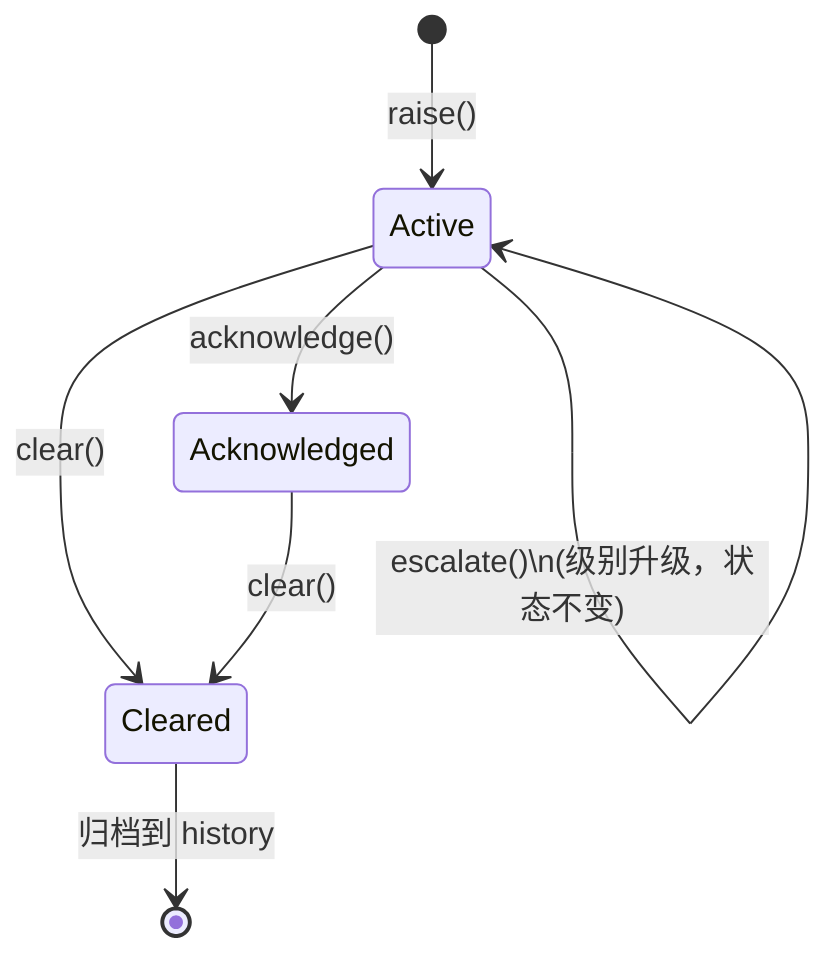
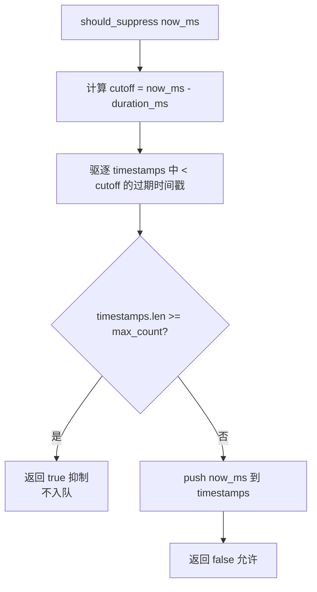
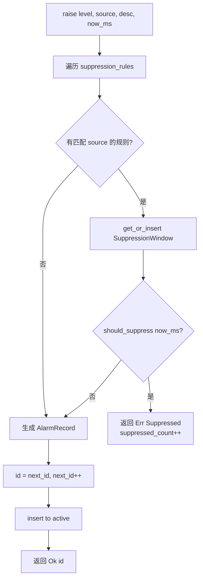

# EnerOS 告警管理体系设计文档（v0.53.2）

> **版本**：v0.53.2
> **crate**：`eneros-alarm`（`crates/agents/alarm/`）
> **依赖**：`eneros-upa-model`（v0.50.0）
> **状态**：设计稿（告警全生命周期管理：生成/抑制/确认/升级/清除）
> **覆盖版本**：v0.53.2
> **最后更新**：2026-07-15
> **蓝图参考**：`蓝图/phase1.md` §v0.53.2

---

## 目录

1. [概述](#1-概述)
2. [架构](#2-架构)
3. [告警数据模型](#3-告警数据模型)
4. [告警级别](#4-告警级别)
5. [生命周期](#5-生命周期)
6. [抑制策略](#6-抑制策略)
7. [升级策略](#7-升级策略)
8. [AlarmManager](#8-alarmmanager)
9. [与 SOE/MQTT 协同](#9-与-soemqtt-协同)
10. [no_std 合规](#10-no_std-合规)
11. [测试策略](#11-测试策略)
12. [偏差声明](#12-偏差声明)

---

## 1. 概述

### 1.1 版本背景

告警管理是储能系统运维与安全的关键功能。原始事件（SOE/四遥/Agent 心跳）量大
且无优先级，运维人员无法快速识别关键故障。告警体系对事件进行分级（Info/Warning/
Critical/Emergency）、抖动抑制（同源 N 秒内合并）、运维确认（ACK）、超时升级
（Escalation）与故障恢复清除（Clear），提供告警全生命周期管理。

本版本（v0.53.2）在 v0.53.0 SOE 事件引擎之上，实现告警生成、抑制、升级、确认、
清除完整链路，为 v0.57.0 降级规则与 v1.0.0 商用版运维监控提供基础。

### 1.2 设计目标

| 目标 | 说明 |
|------|------|
| **分级管理** | 4 级告警（Info/Warning/Critical/Emergency），运维按优先级响应 |
| **抖动抑制** | 同源 N 秒内重复告警合并，防止告警风暴淹没关键告警 |
| **超时升级** | Critical 告警未 ACK 超时升级 Emergency，触发紧急通知 |
| **全生命周期** | 生成/ACK/清除时间戳完整记录，可追溯 |
| **no_std** | 纯 `alloc` + `core`，不依赖 `std` |

### 1.3 出口标准关联

Phase 1 出口"autonomous 运行"要求告警可发现、可响应、可追溯。本版本提供告警
生成与生命周期管理能力，是自治运行的告警入口。

---

## 2. 架构

### 2.1 模块结构

```
crates/agents/alarm/
├── Cargo.toml          # 依赖 eneros-upa-model
└── src/
    ├── lib.rs          # 模块声明 + 重导出 + 集成测试
    ├── error.rs        # AlarmError 错误枚举
    ├── level.rs        # AlarmLevel 告警级别（4 级）
    ├── record.rs       # AlarmId/AlarmState/AlarmRecord 告警记录
    ├── suppression.rs  # SuppressionRule/SuppressionWindow 抑制
    ├── escalation.rs   # EscalationPolicy 升级策略
    └── manager.rs      # AlarmManager/AlarmStats 管理器
```

### 2.2 数据流

```
事件源（SOE/四遥/Agent）
        │
        ▼
   AlarmManager.raise()
        │
        ├─→ 抑制检查（SuppressionRule + SuppressionWindow）
        │     ├─ 抑制 → Err(Suppressed)
        │     └─ 允许 → 继续
        │
        ├─→ 生成 AlarmRecord（state=Active）
        │
        └─→ 存入 active 表
                │
                ├─→ acknowledge() → state=Acknowledged
                ├─→ escalate()   → level 升级
                ├─→ clear()      → state=Cleared，转入 history
                └─→ check_auto_escalate() → 批量超时升级
```

### 2.3 依赖关系

- **依赖**：`eneros-upa-model`（基础类型，D20）
- **不依赖**：`eneros-soe-engine`（避免循环依赖，告警源通过参数注入）
- **被依赖**：未来 v0.57.0 降级规则、v1.0.0 运维监控

---

## 3. 告警数据模型

### 3.1 AlarmId

```rust
pub type AlarmId = u64;
```

告警唯一标识，由 `AlarmManager` 内部自增分配（从 1 开始）。

### 3.2 AlarmState

```rust
pub enum AlarmState {
    Active,       // 活跃（已生成未确认）
    Acknowledged, // 已确认（运维已 ACK，停止升级）
    Cleared,      // 已清除（故障恢复，归档）
}
```

### 3.3 AlarmRecord

```rust
pub struct AlarmRecord {
    pub id: AlarmId,
    pub level: AlarmLevel,
    pub source: String,
    pub description: String,
    pub raised_at_ms: u64,              // 生成时间（D25）
    pub acknowledged_at_ms: Option<u64>, // 确认时间
    pub cleared_at_ms: Option<u64>,      // 清除时间
    pub escalated_from: Option<AlarmLevel>, // 升级前原始级别
    pub state: AlarmState,
}
```

全生命周期时间戳完整记录：`raised_at_ms`（生成）、`acknowledged_at_ms`（ACK）、
`cleared_at_ms`（清除），满足"可追溯"出口标准。

---

## 4. 告警级别

### 4.1 AlarmLevel 枚举

```rust
pub enum AlarmLevel {
    Info = 0,      // 信息（最低级）
    Warning = 1,   // 警告
    Critical = 2,  // 严重
    Emergency = 3, // 紧急（最高级）
}
```

派生 `PartialOrd`/`Ord`，支持级别比较：`Info < Warning < Critical < Emergency`。

### 4.2 级别语义

| 级别 | 语义 | 响应要求 | 示例 |
|------|------|---------|------|
| Info | 信息通知 | 无需响应 | 状态变位记录 |
| Warning | 警告 | 24h 内处理 | 参数接近限值 |
| Critical | 严重 | 1h 内 ACK | 温度越限、SOC 过低 |
| Emergency | 紧急 | 立即响应 | 紧急停机、火灾 |

### 4.3 转换方法

- `as_u8(&self) -> u8`：转为数值
- `from_u8(u8) -> Option<AlarmLevel>`：从数值转换（非法值返回 None）

---

## 5. 生命周期

### 5.1 状态机



### 5.2 状态转换规则

| 当前状态 | 操作 | 目标状态 | 说明 |
|---------|------|---------|------|
| Active | acknowledge | Acknowledged | 运维 ACK，停止升级 |
| Active | escalate | Active（级别升级） | 手动/自动升级，`escalated_from` 记录原级别 |
| Active | clear | Cleared | 故障恢复清除 |
| Acknowledged | clear | Cleared | 已确认告警清除 |
| Cleared | - | - | 终态，转入 history |

### 5.3 时间戳记录

- `raise()`：设置 `raised_at_ms`
- `acknowledge()`：设置 `acknowledged_at_ms`
- `clear()`：设置 `cleared_at_ms`，从 active 移除，转入 history
- `escalate()`：设置 `escalated_from = Some(原级别)`，更新 `level`

---

## 6. 抑制策略

### 6.1 SuppressionRule

```rust
pub struct SuppressionRule {
    pub source_pattern: String, // 源模式（精确匹配，D21）
    pub duration_ms: u64,       // 抑制窗口时长
    pub max_count: u32,         // 窗口内最大告警数
}
```

- `new(source, duration_ms)`：构造规则，`max_count = 1`（窗口内仅允许 1 条）
- `matches_source(source)`：精确字符串匹配（D21 简化，不支持正则）

### 6.2 SuppressionWindow

```rust
pub struct SuppressionWindow {
    timestamps: VecDeque<u64>, // 最近告警时间戳队列
    max_count: u32,
    duration_ms: u64,
}
```

### 6.3 滑动窗口算法



### 6.4 抑制示例

```
规则: source="temp", duration_ms=5000, max_count=1

t=0:    raise → window=[0],    len=0 < 1 → 允许, push → window=[0]
t=1000: raise → cutoff=0,      驱逐 <0 无,  len=1 >= 1 → 抑制
t=6000: raise → cutoff=1000,   驱逐 0(<1000), len=0 < 1 → 允许, push → window=[6000]
```

### 6.5 窗口重置

`clear()` 告警时调用 `SuppressionWindow::reset()`，清空时间戳队列，允许后续
告警重新进入窗口。这保证故障恢复后同源告警能正常生成。

---

## 7. 升级策略

### 7.1 EscalationPolicy

```rust
pub struct EscalationPolicy {
    pub from_level: AlarmLevel, // 源级别
    pub to_level: AlarmLevel,   // 目标级别
    pub timeout_ms: u64,        // 超时阈值
}
```

D22 简化为单级升级（如 Critical → Emergency），不实现多级升级阶梯。

### 7.2 check_escalation 逻辑

```mermaid
flowchart TD
    A[check_escalation record, now_ms] --> B{record.level == from_level?}
    B -->|否| Z[返回 None]
    B -->|是| C{record.state == Active?}
    C -->|否| Z
    C -->|是| D{acknowledged_at_ms.is_none()?}
    D -->|否| Z
    D -->|是| E{now_ms >= raised_at_ms + timeout_ms?}
    E -->|否| Z
    E -->|是| F[返回 Some to_level]
```

### 7.3 升级条件

告警必须同时满足以下条件才会被升级：
1. 当前级别 == 策略 `from_level`
2. 状态为 Active（Acknowledged 不升级）
3. 未被 ACK（`acknowledged_at_ms.is_none()`）
4. 已超时（`now_ms >= raised_at_ms + timeout_ms`）

### 7.4 升级效果

- `escalated_from = Some(原级别)`：记录升级前级别
- `level = 新级别`：更新当前级别
- 重复升级返回 `Err(AlreadyEscalated)`

---

## 8. AlarmManager

### 8.1 数据结构

```rust
pub struct AlarmManager {
    active: BTreeMap<AlarmId, AlarmRecord>,          // 活跃告警（D20）
    history: Vec<AlarmRecord>,                        // 历史告警
    suppression_rules: Vec<SuppressionRule>,          // 抑制规则
    escalation_policies: Vec<EscalationPolicy>,       // 升级策略
    suppression_windows: BTreeMap<String, SuppressionWindow>, // 抑制窗口
    next_id: AlarmId,                                 // 下一个 ID
    suppressed_count: u64,                            // 累计抑制数
    escalated_count: u64,                             // 累计升级数
}
```

### 8.2 核心方法

| 方法 | 说明 |
|------|------|
| `new()` | 构造管理器（next_id=1） |
| `add_suppression_rule(rule)` | 添加抑制规则 |
| `add_escalation_policy(policy)` | 添加升级策略 |
| `raise(level, source, desc, now_ms)` | 生成告警（先检查抑制） |
| `acknowledge(id, now_ms)` | 确认告警（Active→Acknowledged） |
| `clear(id, now_ms)` | 清除告警（→Cleared，转入 history） |
| `escalate(id, now_ms)` | 手动升级告警 |
| `check_auto_escalate(now_ms)` | 批量检查超时升级 |
| `query_active()` | 查询活跃告警（按 raised_at_ms 排序） |
| `query_history(start, end)` | 查询历史告警（时间范围） |
| `stats()` | 计算告警统计 |

### 8.3 raise 流程



### 8.4 check_auto_escalate 流程

1. 遍历 `active` 中所有告警
2. 对每条告警，遍历 `escalation_policies`，调用 `check_escalation`
3. 收集所有需升级的告警 ID
4. 逐个调用 `escalate()` 执行升级
5. 返回被升级的 ID 列表

---

## 9. 与 SOE/MQTT 协同

### 9.1 与 SOE 引擎协同

SOE 引擎（v0.53.0）提供事件源，告警管理消费事件并分级：

```
SOE 事件 → 告警规则匹配 → AlarmManager.raise()
```

本 crate 不直接依赖 `eneros-soe-engine`（D20，避免循环依赖），而是通过参数
注入方式接收事件信息（source/description/level 由调用方判定）。

### 9.2 与 MQTT 客户端协同

MQTT 客户端（v0.53.1）提供远程上报通道：

```
AlarmManager.query_active() → MQTT publish → 云端运维平台
```

告警生成后可通过 MQTT 上报到云端，实现远程监控。Emergency 告警可触发紧急通知。

### 9.3 数据链路

```
采集层（Modbus/IEC104/CAN）
    ↓
四遥模型（v0.52.0）
    ↓
SOE 引擎（v0.53.0）→ 事件记录
    ↓
告警管理（v0.53.2）→ 分级/抑制/升级
    ↓
MQTT 上报（v0.53.1）→ 云端运维
```

---

## 10. no_std 合规

### 10.1 no_std 声明

```rust
#![cfg_attr(not(test), no_std)]
extern crate alloc;
```

### 10.2 允许使用的 crate

| crate | 用途 |
|-------|------|
| `core` | 基础类型、trait |
| `alloc` | `String`/`Vec`/`BTreeMap`/`VecDeque` |

### 10.3 禁止使用的 crate

| crate | 原因 | 替代 |
|-------|------|------|
| `std` | no_std 不兼容 | `alloc` + `core` |
| `std::collections::HashMap` | no_std 无 | `alloc::collections::BTreeMap`（D20） |
| `std::time::Instant` | no_std 无 | `u64` 毫秒参数注入（D25） |
| `regex` | 重量级，no_std 不友好 | 精确字符串匹配（D21） |

### 10.4 Send + Sync

不要求 `Send + Sync`（D24）。no_std 单线程环境，`AlarmManager` 通过 `&mut self`
访问，无需同步原语。

---

## 11. 测试策略

### 11.1 测试覆盖（T1~T15）

| 测试 | 覆盖点 |
|------|--------|
| T1 | AlarmLevel 排序与 u8 转换 |
| T2 | AlarmRecord 构造（字段默认值） |
| T3 | AlarmState 状态转换（Active→Acknowledged→Cleared） |
| T4 | AlarmManager raise + query_active（排序） |
| T5 | AlarmManager acknowledge |
| T6 | AlarmManager clear 转入 history |
| T7 | 未知 ID acknowledge 返回 NotFound |
| T8 | 已清除再次 clear 返回 NotFound |
| T9 | SuppressionRule 同源窗口内抑制 |
| T10 | SuppressionRule 窗口过期后允许 |
| T11 | EscalationPolicy 超时升级检测 |
| T12 | AlarmManager escalate 手动升级 |
| T13 | AlarmManager check_auto_escalate 批量升级 |
| T14 | AlarmManager query_history 时间范围 |
| T15 | AlarmManager stats 统计 |

### 11.2 测试原则

- 使用 `assert!(matches!(...))` 验证 Result 类型
- 不使用 `panic!`/`todo!`/`unimplemented!`（workspace clippy 禁止）
- 时间戳使用绝对值（如 `0`/`1000`/`6000`），便于断言

---

## 12. 偏差声明

| 偏差 | 说明 |
|------|------|
| **D19** | crate 放入 `crates/agents/alarm/`（蓝图 §3 明确指定路径） |
| **D20** | 仅依赖 `eneros-upa-model`，活跃表使用 `BTreeMap`（no_std 无 HashMap；不直接依赖 soe-engine 避免循环依赖） |
| **D21** | 抑制策略使用滑动窗口计数（`VecDeque<u64>` 时间戳队列），不实现依赖抑制（蓝图 §4.3 提及但 MVP 简化） |
| **D22** | 升级策略简化为"超时升级一级"（Critical → Emergency），不实现多级升级阶梯 |
| **D23** | 配置以结构体注入（不解析 TOML；蓝图 `configs/alarm_rules.toml` 留待 v0.26.0 配置管理集成） |
| **D24** | 不要求 `Send + Sync`（no_std 单线程，与 v0.51.0 D2 一致） |
| **D25** | 时间戳使用 `u64` 毫秒参数注入（与 v0.50.0~v0.53.0 D1 一致） |
