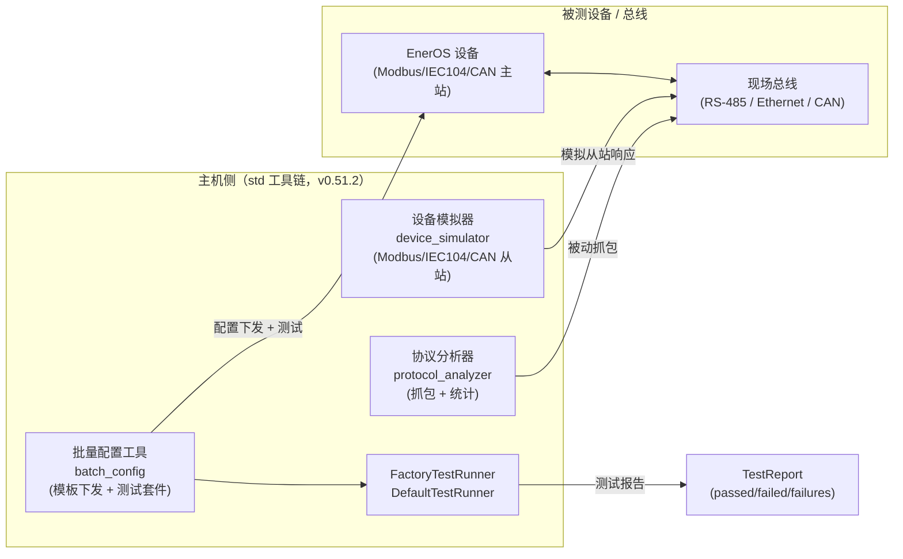

# EnerOS 工厂测试工具链设计（v0.51.2）

> **版本**：v0.51.2 — 调试与工厂测试工具链
> **覆盖范围**：`tools/device_simulator`、`tools/protocol_analyzer`、`tools/batch_config`
> **所属阶段**：Phase 1 单机 MVP（R7 调试与工厂测试工具链）
> **关联版本**：承接 v0.51.0（协议抽象层）、v0.51.1（计量校准）
> **文档位置**：`docs/runtime/factory-test-toolchain.md`（§2.3.3 文档分类：运行时/工具）
> **最后更新**：2026-07-15

---

## 1. 概述

### 1.1 背景

EnerOS 在工厂量产与现场运维阶段，需要一套**主机侧**调试工具链对被测设备
（DUT，Device Under Test）进行协议级验证：

- **设备模拟器**：在缺少真实设备时，模拟 Modbus RTU/TCP、IEC 104、CAN 从站，
  为主站协议栈（v0.45.0~v0.49.0）提供回归测试对象。
- **协议分析器**：抓取总线流量并按协议解码，用于故障定位与报文级诊断。
- **批量配置工具**：将配置模板批量下发到产线上一组设备，并对每台设备运行
  工厂测试套件，输出通过/失败报告。

### 1.2 目标

| 目标 | 说明 |
|------|------|
| 提供三件套独立可执行程序 | 设备模拟器 / 协议分析器 / 批量配置 |
| 定义工厂测试领域模型 | `TestSuite` / `TestItem` / `TestCategory` / `TestReport` / `TestFailure` |
| 定义可扩展的执行引擎 | `FactoryTestRunner` trait + `DefaultTestRunner` 实现 |
| 不污染产品代码 | 工具为 **std** 程序，独立于 no_std 产品 crate |

### 1.3 非目标（v0.51.2 范围外）

- 真实网络/串口抓包（当前 `capture` 为返回 0 包的骨架）。
- 真实设备 API 调用（当前 `run_item` 恒通过）。
- 配置模板文件格式定义与解析（当前仅占位 `--template` 路径）。
- 与 CI 的自动集成（后续版本通过 Makefile target 接入）。

---

## 2. 架构

### 2.1 总体架构

三个工具均为**独立 std 可执行程序**，互不依赖，分别位于 `tools/` 下各自子目录。
它们通过被测设备（DUT）与 EnerOS 产品侧协议栈（v0.45.0~v0.49.0）间接协作：
工具作为"对端"出现在总线另一侧。



### 2.2 模块拓扑

| 工具 | 入口 | 核心模块 | 关键类型 |
|------|------|---------|---------|
| device_simulator | `src/main.rs` | `src/sim.rs` | `SimConfig` / `SimHandle` / `SimError` |
| protocol_analyzer | `src/main.rs` | `src/capture.rs` | `Packet` / `PacketDirection` / `CaptureConfig` / `PacketCapture` / `CaptureStats` |
| batch_config | `src/main.rs` | `src/runner.rs` | `TestCategory` / `TestItem` / `TestSuite` / `TestFailure` / `TestReport` / `FactoryTestRunner` / `DefaultTestRunner` |

### 2.3 数据流

1. **模拟器路径**：`主机 main` → `SimHandle::start` →（总线请求）→
   `SimHandle::generate_response` →（响应回主站）→ `SimHandle::stop`。
2. **分析器路径**：`主机 main` → `PacketCapture::capture(duration)` →
   `PacketCapture::packets()` → `PacketCapture::analyze()` → `CaptureStats`。
3. **批量配置路径**：`主机 main` → 构造 `TestSuite` → `DefaultTestRunner::run_suite`
   → 逐项 `run_item` → 聚合 `TestReport` → `TestReport::summary()`。

---

## 3. 设备模拟器（device_simulator）

### 3.1 职责

在主机侧模拟一个或多个现场设备从站，回应主站协议栈的读写请求，用于：

- 协议主站 crate（v0.45.0 Modbus RTU / v0.46.0 Modbus TCP / v0.48.0 IEC104 从站 /
  v0.49.0 IEC104 主站 / v0.47.0 CAN）的回归测试。
- 产线缺料时的占位测试对象。

### 3.2 CLI

```
eneros-device-simulator [OPTIONS]
    --help                      打印帮助
    --config <file>             从文件加载模拟器配置
    --protocol <PROTOCOL>       模拟协议：modbus-rtu | modbus-tcp | iec104 | can
```

### 3.3 核心类型（`sim.rs`）

```text
SimConfig {
    protocol: String,      // modbus-rtu / modbus-tcp / iec104 / can
    port: u16,             // TCP 类协议端口
    slave_addr: u8,        // 从站/公共地址
    baud_rate: u32,        // 仅 RTU
    ip: String,            // 仅 TCP
    point_count: u16,      // 模拟点数
}

SimError = ConfigError(String) | NetworkError(String) | ProtocolError(String)

SimHandle {
    config: SimConfig,
    running: bool,
}
// 方法：new / start / stop / generate_response(&[u8]) -> Vec<u8>
```

### 3.4 当前实现状态

- `start`/`stop`：校验配置不变量（协议合法、`point_count > 0`）并翻转 `running`。
- `generate_response`：**骨架**，返回"协议标签 + 请求长度 + 回显请求"的占位响应。
- 真实协议解码与点表填充后置（后续版本接入 `eneros-protocol-abstract` 适配器）。

---

## 4. 协议分析器（protocol_analyzer）

### 4.1 职责

在指定网卡上抓取协议流量，按协议解码并产出统计，用于：

- 总线报文级故障定位（丢帧、错帧、超时）。
- 通信性能分析（rx/tx 计数、协议分布）。

### 4.2 CLI

```
eneros-protocol-analyzer [OPTIONS]
    --help                打印帮助
    --interface <if>      抓包网卡（如 eth0）
    --port <port>         端口过滤（0 = 全部）
    --protocol <PROTO>    解码协议：modbus | iec104 | can
```

### 4.3 核心类型（`capture.rs`）

```text
PacketDirection = Rx | Tx

Packet {
    timestamp_ms: u64,
    protocol: String,
    source: String,
    destination: String,
    data: Vec<u8>,
    direction: PacketDirection,
}

CaptureConfig { interface, port, protocol, max_packets }

PacketCapture { config: CaptureConfig, packets: Vec<Packet> }
// 方法：new / capture(duration_ms) -> Result<usize, String>
//       packets() -> &[Packet]
//       analyze() -> CaptureStats

CaptureStats { total_packets, rx_count, tx_count, protocol_breakdown: HashMap<String,u32> }
```

### 4.4 当前实现状态

- `capture`：**骨架**，始终返回 `Ok(0)`（不抓包）。
- `analyze`：完整实现，对 `packets` 缓冲区做 rx/tx/协议分布统计。
- 真实抓包（raw socket / pcap）后置。

---

## 5. 批量配置（batch_config）

### 5.1 职责

将配置模板批量下发到一组设备，并对每台设备运行工厂测试套件：

- 读取配置模板（`--template`）与设备清单（`--devices`）。
- 支持 `--dry-run` 仅校验输入、不触碰设备。
- 运行测试套件并输出报告。

### 5.2 CLI

```
eneros-batch-config [OPTIONS]
    --help              打印帮助
    --template <file>   配置模板文件
    --devices <file>    设备清单文件（每行一个地址）
    --dry-run           仅校验输入，不下发
```

### 5.3 当前实现状态

- CLI 解析完整，模板/设备文件解析后置。
- `main` 构造一个示例 `TestSuite` 并通过 `DefaultTestRunner` 运行，打印摘要。

---

## 6. 工厂测试套件（领域模型）

工厂测试领域模型定义于 `batch_config/src/runner.rs`，是工具链的核心抽象。

### 6.1 测试分类

```text
TestCategory = Functional | Communication | Performance | Safety
```

| 分类 | 含义 | 示例 |
|------|------|------|
| Functional | 功能正确性 | 点表读取、配置回读 |
| Communication | 通信链路 | Modbus/IEC104/CAN 往返 |
| Performance | 性能 | 延迟、吞吐 |
| Safety | 安全联锁 | 保护行为、急停 |

### 6.2 数据结构

```text
TestItem {
    name: String,
    category: TestCategory,
    passed: bool,
    failure_reason: Option<String>,
    duration_ms: u64,
}

TestSuite { name: String, items: Vec<TestItem> }

TestFailure { test_name: String, reason: String, timestamp: u64 }

TestReport {
    suite_name: String,
    total: u32, passed: u32, failed: u32,
    duration_ms: u64,
    failures: Vec<TestFailure>,
}
// 方法：summary() -> String
```

`TestReport::summary()` 返回单行可读摘要，例如：

```
TestReport[smoke]: total=2 passed=2 failed=0 (12ms, 0 failure(s))
```

---

## 7. TestRunner

### 7.1 trait 定义

```rust
pub trait FactoryTestRunner {
    fn run_suite(&mut self, suite: &TestSuite) -> TestReport;
    fn run_item(&mut self, item: &TestItem) -> TestItem;
}
```

### 7.2 DefaultTestRunner

`DefaultTestRunner { reports: Vec<TestReport> }` 实现 `FactoryTestRunner`：

- `run_suite`：遍历 `suite.items`，逐项调用 `run_item`，聚合通过/失败计数与
  失败明细，构造 `TestReport` 并压入 `reports` 历史。
- `run_item`：**骨架**，恒返回 `passed: true`。真实实现将通过协议适配器层
  （`eneros-protocol-abstract` v0.51.0）调用被测设备 API 并记录实际结果。

### 7.3 扩展点

第三方/后续版本可实现 `FactoryTestRunner` 提供真实执行引擎（如基于
`ProtocolManager::read_point` 的功能测试、基于时延测量的性能测试），
无需改动领域模型。

---

## 8. 使用流程

### 8.1 独立编译

工具非 workspace 成员（D14），需在各自目录下编译：

```bash
cd tools/device_simulator   && cargo build
cd tools/protocol_analyzer  && cargo build
cd tools/batch_config       && cargo build
```

### 8.2 典型工厂测试流程

1. 启动设备模拟器作为占位从站：
   `eneros-device-simulator --protocol modbus-tcp`
2. 启动协议分析器抓包：
   `eneros-protocol-analyzer --interface eth0 --protocol modbus --port 502`
3. 运行批量配置 + 测试套件：
   `eneros-batch-config --template tpl.toml --devices list.txt`
4. 检查 `TestReport` 摘要，失败项进入 `failures` 明细。

### 8.3 统一构建（可选）

若需在 workspace 顶层统一构建工具，通过 Makefile target 调用上述子目录命令，
不通过 workspace `members` 接入（D14）。

---

## 9. std 程序说明

### 9.1 为何使用 std

工具链运行在**主机侧**（工厂 PC / 开发机），不是目标设备上的产品代码。
蓝图明确"工具非产品代码"，因此不受 §43.1 no_std 约束（D11）。

使用 std 的便利：

- `std::env::args` 做 CLI 解析，无需第三方参数解析库。
- `std::process::ExitCode` 返回标准退出码。
- `std::collections::HashMap` 做协议分布统计。
- `std::time::SystemTime` 做测试时间戳。
- `std::process::Command`（未来）调用外部抓包/串口工具。

### 9.2 编译目标

工具以**主机三元组**编译（如 `x86_64-pc-windows-msvc` / `x86_64-unknown-linux-gnu`），
不走 `aarch64-unknown-none` 交叉编译路径。`.cargo/config.toml` 未设置默认 target，
主机侧工具（含 `ci` crate）按惯例在主机编译。

### 9.3 工具链一致性

工具仍使用仓库锁定的 `rust-toolchain.toml`（nightly-2026-04-04），保证全仓库
编译器版本一致；`build-std` 仅在交叉编译产品 crate 时显式启用，不影响主机 std 构建。

---

## 10. 与产品代码的关系

| 维度 | 工具链（v0.51.2） | 产品代码（no_std crate） |
|------|------------------|------------------------|
| 运行位置 | 主机 | 目标设备（aarch64） |
| std 约束 | std 程序（D11） | 严格 no_std（§43.1） |
| 目录归属 | `tools/`（D12） | `crates/<subsystem>/` |
| workspace | 独立 crate（D14） | workspace 成员 |
| 复用关系 | 未来通过 `eneros-protocol-abstract` 适配器调用产品侧 trait | 提供协议主站/点表实现 |

**关键约束**：工具链**不得**被产品 crate 依赖；工具链**可以**（在后续版本）依赖
产品侧的协议抽象 trait 库以复用点表/地址模型，但本版本保持零依赖骨架。

---

## 11. 测试策略

### 11.1 单元测试

每个工具在其核心模块内嵌 `#[cfg(test)] mod tests`：

| 工具 | 测试数 | 覆盖点 |
|------|-------|--------|
| device_simulator | 4 | 生命周期（start/stop/重复）、非法协议、零点数、响应非空 |
| protocol_analyzer | 3 | capture 骨架返回 0、空统计、多包统计（rx/tx/协议分布） |
| batch_config | 4 | suite 全通过、run_item 标记通过、summary 计数、TestCategory 显示 |

### 11.2 验证命令

```bash
cd tools/device_simulator   && cargo test
cd tools/protocol_analyzer  && cargo test
cd tools/batch_config       && cargo test
```

### 11.3 后置测试（未来版本）

- 真实抓包回归：用模拟器生成流量，分析器捕获并校验 `CaptureStats`。
- 真实设备测试：`DefaultTestRunner` 接入协议适配器，对真实 DUT 跑 `TestSuite`。
- CI 集成：通过 Makefile target 把工具构建纳入 `ci-local`。

---

## 12. 偏差声明

本工具链相对蓝图 R7 的偏差记录如下，与 spec `develop-v0510-protocol-abstract-calibration-toolchain`
中的 D11~D14 一致。

| 偏差 | 说明 | 理由 |
|------|------|------|
| **D11** | 工具链为主机侧 **std** 程序（蓝图明确"工具非产品代码"，不受 no_std 约束） | 主机侧运行，使用 std 的 env/process/collections/time 显著降低骨架复杂度 |
| **D12** | 工具放入 `tools/` 目录（非 `crates/`，因非产品代码） | §2.3.1 crate 分组规则仅约束产品 crate；工具按既有 `tools/` 约定放置 |
| **D13** | 设备模拟器/协议分析器/批量配置为独立可执行程序（各有 `main.rs`） | 三件套职责独立，独立可执行便于产线分别部署 |
| **D14** | 不入 workspace members（工具非 Rust crate 成员，独立编译） | 工具的 std 编译路径与产品 no_std 交叉编译路径冲突；独立 workspace 根（`[workspace]`）使各自 `cargo build` 自洽；若需统一构建用 Makefile target |

### 12.1 骨架范围说明

v0.51.2 为**骨架可用**交付（蓝图 §4.4 非瓶颈版本，trait/struct 签名可编译）：

- `SimHandle::generate_response`：占位回显，非真实协议解码。
- `PacketCapture::capture`：返回 0 包，非真实抓包。
- `DefaultTestRunner::run_item`：恒通过，非真实设备 API 调用。
- `--config` / `--template` / `--devices` 文件解析：仅占位参数，未实现格式。

真实实现由后续版本接入 `eneros-protocol-abstract`（v0.51.0）适配器层补全。

---

> **关联文档**：
> - `docs/protocols/protocol-abstract-design.md`（v0.51.0 协议抽象层）
> - `docs/drivers/meter-calibration-design.md`（v0.51.1 计量校准）
> - `蓝图/phase1-blueprint-v023-v074/` §v0.51.2（版本蓝图）
