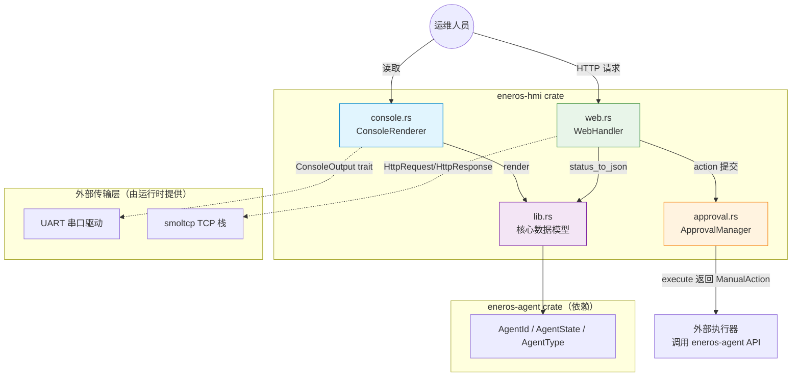
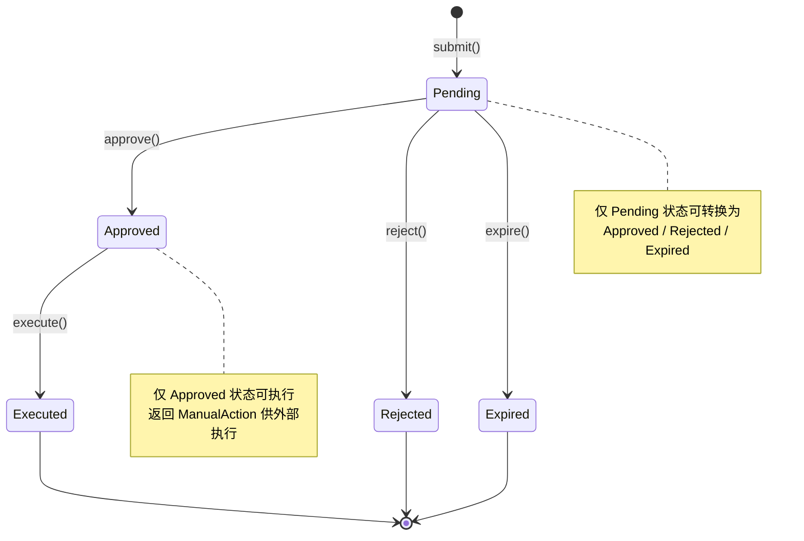

# 本地 HMI 设计文档（v0.42.1 本地人机接口）

> **覆盖版本**：v0.42.1
> **所属子系统**：`crates/agents/hmi/`（eneros-hmi crate）
> **源码位置**：`crates/agents/hmi/src/lib.rs`、`approval.rs`、`console.rs`、`web.rs`
> **最后更新**：2026-07-15
> **蓝图参考**：`蓝图/phase1.md` §v0.42.1
> **配置模板**：`configs/hmi.toml`

---

## 1. 概述

v0.42.1 为 EnerOS 引入**本地人机接口（HMI）**，为运维人员提供对 Agent 系统的本地观测与操控能力。HMI 是能源场站无人值守场景下的"最后一道运维通道"——当远程运维通道中断时，运维人员可通过串口控制台或本地 Web 接口完成故障排查与手动操作。

本版本提供三个核心组件：

- **`ConsoleRenderer`** — 串口控制台文本渲染器，将系统状态渲染为可读文本。
- **`WebHandler`** — Web 运维接口请求处理器，提供 RESTful 风格的状态查询与操作提交。
- **`ApprovalManager`** — 手动操作审批状态机，管理"提交 → 审批/拒绝 → 执行"全生命周期。

### 设计目标

| 目标 | 说明 |
|------|------|
| 本地可观测 | 串口控制台实时显示系统状态、告警、待审批项 |
| 本地可操控 | Web 接口提交手动操作（重启 Agent / 清除告警等） |
| 操作可审计 | 所有手动操作须经审批流程，状态可追溯 |
| no_std 合规 | HMI crate 必须 no_std，零外部依赖 |
| 解耦传输层 | 不绑定具体 TCP/UART 实现，通过 trait 抽象（D9/D10） |

### 与 v0.42.0 的关系

v0.42.0 的 `RecoveryOrchestrator` 负责"自动故障恢复调度"，v0.42.1 的 HMI 负责"人工介入接口"。当自动恢复无法处理（如需人工确认重启关键 Agent）时，通过 HMI 审批流程完成人工决策。

---

## 2. 架构设计

### 2.1 组件关系



### 2.2 分层职责

| 层 | 组件 | 职责 | 传输依赖 |
|----|------|------|----------|
| 数据模型层 | `lib.rs` | `SystemState` / `HmiFrame` / `AlarmSummary` 等类型定义 | 无 |
| 渲染层 | `console.rs` | 将 `SystemState` / `HmiFrame` 渲染为文本 | 通过 `ConsoleOutput` trait 抽象（D9） |
| 接口层 | `web.rs` | HTTP 请求解析 + JSON 响应生成 | 无 TCP 实现（D10），仅类型与处理器 |
| 业务层 | `approval.rs` | 审批状态机管理 | 内存实现（D14），无持久化 |

### 2.3 crate 依赖

```text
eneros-hmi
  └── eneros-agent (path = "../agent")
        └── eneros-crypto (国密 SM2/SM3/SM4)
```

HMI crate 零外部依赖，仅依赖 `eneros-agent`（复用 `AgentId` / `AgentState` / `AgentType` 类型）。

---

## 3. HMI 数据模型

所有 HMI 特有类型定义在 `eneros-hmi` crate 的 `lib.rs` 中（D11：蓝图未明确归属，本实现选择 hmi crate 以保持 eneros-agent 的纯净性）。

### 3.1 类型总览

| 类型 | 说明 | 关键字段 |
|------|------|----------|
| `ApprovalId(pub u64)` | 审批 ID（自增） | `u64` |
| `AlarmSeverity` | 告警严重级别 | `Info` / `Warning` / `Critical` |
| `AgentStateSummary` | Agent 状态摘要 | `agent_id`, `name`, `state`, `agent_type` |
| `NetworkStatus` | 网络状态 | `connected`, `ip_addr`, `rssi` |
| `PowerState` | 电源状态 | `battery_pct`, `charging`, `ac_connected` |
| `SystemState` | 系统整体状态 | `agent_states`, `storage_usage_mb`, `network`, `power`, `last_update_ms` |
| `AlarmSummary` | 告警摘要 | `id`, `severity`, `message`, `timestamp` |
| `ManualAction` | 手动操作 | `id`, `action_type`, `target_agent`, `params` |
| `HmiFrame` | HMI 帧（完整界面数据） | `system_state`, `active_alarms`, `pending_approvals`, `manual_actions` |
| `HmiError` | 错误类型 | `ApprovalNotFound` / `InvalidStateTransition` / `IoError` / `InvalidRequest` |

### 3.2 SystemState 字段详解

```rust
pub struct SystemState {
    pub agent_states: Vec<AgentStateSummary>,  // 所有 Agent 的状态摘要
    pub storage_usage_mb: u32,                  // 存储使用量（MB）
    pub network: NetworkStatus,                 // 网络状态
    pub power: PowerState,                      // 电源状态
    pub last_update_ms: u64,                    // 最后更新时间戳（ms）
}
```

`SystemState` 是 HMI 的主视图数据，由外部运行时定期采集并注入。HMI crate 本身不负责数据采集。

### 3.3 HmiFrame 与 render_hmi_screen

```rust
pub fn render_hmi_screen(state: &SystemState) -> HmiFrame {
    HmiFrame {
        system_state: state.clone(),
        active_alarms: Vec::new(),
        pending_approvals: Vec::new(),
        manual_actions: Vec::new(),
    }
}
```

`render_hmi_screen` 是便捷函数，将 `SystemState` 包装为 `HmiFrame`（告警/审批/操作列表默认为空）。调用方可直接构造 `HmiFrame` 以注入告警与审批数据。

---

## 4. 审批状态机

### 4.1 状态定义

```rust
pub enum ApprovalState {
    Pending,   // 待审批（初始状态）
    Approved,  // 已批准
    Rejected,  // 已拒绝
    Executed,  // 已执行（终态）
    Expired,   // 已过期（终态）
}
```

### 4.2 状态转换图



### 4.3 转换规则

| 当前状态 | 允许的转换 | 非法转换（返回 `InvalidStateTransition`） |
|----------|------------|------------------------------------------|
| `Pending` | → Approved / Rejected / Expired | → Executed（须先 Approved） |
| `Approved` | → Executed | → Approved（重复批准）/ → Rejected |
| `Rejected` | （终态，无转换） | 任何转换 |
| `Executed` | （终态，无转换） | 任何转换 |
| `Expired` | （终态，无转换） | 任何转换 |

### 4.4 ApprovalManager

```rust
pub struct ApprovalManager {
    approvals: BTreeMap<ApprovalId, PendingApproval>,
    next_id: u64,
}
```

- **ID 生成**：`submit` 时从 `next_id` 自增分配，首条审批 ID 为 `ApprovalId(0)`。
- **存储**：`BTreeMap<ApprovalId, PendingApproval>`，按 ID 有序（D14：内存实现，重启丢失）。
- **查询**：`get(id)` / `list_pending()` / `list_all()` / `count()`。

---

## 5. 控制台渲染

### 5.1 ConsoleRenderer

```rust
pub struct ConsoleRenderer {
    // 当前无状态，未来可扩展（宽度、颜色开关等）
}
```

`ConsoleRenderer` 是无状态渲染器，提供三个渲染方法：

| 方法 | 输入 | 输出 | 说明 |
|------|------|------|------|
| `render` | `&SystemState` | `String` | 渲染系统状态（标题/时间/存储/网络/电源/Agent 列表） |
| `render_frame` | `&HmiFrame` | `String` | 渲染完整帧（状态 + 告警 + 审批 + 手动操作） |
| `render_approvals` | `&[PendingApproval]` | `String` | 渲染审批列表 |

### 5.2 ConsoleOutput trait（D9）

```rust
pub trait ConsoleOutput {
    fn write_str(&mut self, s: &str) -> Result<(), HmiError>;
}
```

no_std 环境无 `std::io::Write`，故自定义 `ConsoleOutput` trait 抽象输出目标。调用方可注入：

- 串口 UART 驱动实现（生产环境）
- 内存 `String` 缓冲区（测试环境）

`ConsoleRenderer::write_to(state, &mut dyn ConsoleOutput)` 方法将渲染结果写入抽象输出。

### 5.3 渲染输出示例

```text
=== EnerOS System Status ===
Last Update: 99999 ms
Storage: 512 MB
Network: Connected (192.168.1.50) RSSI=-55dBm
Power: Battery 90% [AC]
Agents (1):
  [Grid] grid-agent (id=AgentId(1)) Running

=== Alarms (1) ===
  [CRIT] #7: Agent grid-agent crashed @ 8888ms

=== Pending Approvals (1) ===
  [Pending] #1: restart_agent by operator-d @ 1000ms
```

> D13：当前实现为纯文本，无 VT100 转义码（颜色控制为未来扩展项）。

---

## 6. Web 运维接口

### 6.1 HTTP 类型

```rust
pub enum HttpMethod { Get, Post, Put, Delete }

pub struct HttpRequest {
    pub method: HttpMethod,
    pub path: String,
    pub body: Option<String>,
}

pub struct HttpResponse {
    pub status: u16,
    pub body: String,
    pub content_type: String,
}
```

`HttpResponse` 提供 `ok(body)` / `not_found()` / `bad_request()` / `json(status, body)` 便捷构造方法。

### 6.2 端点定义

| Method | Path | 描述 | 响应 |
|--------|------|------|------|
| GET | `/status` | 获取系统状态 | 200 JSON（系统状态） |
| GET | `/approvals` | 列出待审批项 | 200 JSON 数组 |
| POST | `/action` | 提交手动操作（需审批） | 200 `{"status":"submitted"}` |
| POST | `/approve/:id` | 批准审批项 | 200 `{"status":"approved"}` |
| POST | `/reject/:id` | 拒绝审批项 | 200 `{"status":"rejected"}` |
| * | 其他 | 404 | `{"error":"not found"}` |

### 6.3 JSON 格式（D12：手写序列化）

`/status` 响应示例：

```json
{
  "agents": [
    {"id":AgentId(1),"name":"grid-agent","state":"Running","type":"Grid"}
  ],
  "storage_usage_mb":512,
  "network":{"connected":true,"ip_addr":"192.168.1.50","rssi":-55},
  "power":{"battery_pct":90,"charging":false,"ac_connected":true},
  "last_update_ms":99999
}
```

> D12：JSON 序列化采用手写 `format!` + `push_str` 拼接，不引入 serde/serde_json，保持零外部依赖。

### 6.4 WebHandler

```rust
pub struct WebHandler { /* 当前无状态 */ }

impl WebHandler {
    pub fn handle(&self, req: &HttpRequest, state: &SystemState) -> HttpResponse;
    pub fn status_to_json(state: &SystemState) -> String;
    pub fn approvals_to_json(approvals: &[PendingApproval]) -> String;
}
```

`WebHandler` 无状态、线程安全，`handle` 根据 `(method, path)` 模式匹配分发。D10：无 TCP 服务器实现，实际 HTTP 服务器由外部运行时（smoltcp + 用户态组件）提供。

---

## 7. API 参考

### 7.1 控制台渲染

```rust
use eneros_hmi::{ConsoleRenderer, ConsoleOutput, SystemState, HmiFrame};

let renderer = ConsoleRenderer::new();
let text: String = renderer.render(&system_state);          // 渲染状态
let text: String = renderer.render_frame(&hmi_frame);       // 渲染完整帧

// 写入抽象输出目标
struct UartOutput { /* ... */ }
impl ConsoleOutput for UartOutput {
    fn write_str(&mut self, s: &str) -> Result<(), eneros_hmi::HmiError> {
        // 实际 UART 写入
        Ok(())
    }
}
renderer.write_to(&system_state, &mut uart_output)?;
```

### 7.2 审批流程

```rust
use eneros_hmi::{ApprovalManager, ManualAction, ApprovalState};

let mut mgr = ApprovalManager::new();
let action = ManualAction {
    id: 1,
    action_type: String::from("restart_agent"),
    target_agent: Some(AgentId(1)),
    params: String::from(r#"{"force":false}"#),
};

// 提交 → 批准 → 执行
let id = mgr.submit(action, "operator", 1_000);
mgr.approve(id)?;
let action = mgr.execute(id)?;  // 返回 ManualAction 供外部执行
```

### 7.3 Web 接口

```rust
use eneros_hmi::{WebHandler, HttpRequest, HttpMethod};

let handler = WebHandler::new();
let req = HttpRequest::new(HttpMethod::Get, "/status");
let resp = handler.handle(&req, &system_state);
assert_eq!(resp.status, 200);
```

### 7.4 HMI 帧构造

```rust
use eneros_hmi::{render_hmi_screen, HmiFrame, AlarmSummary, AlarmSeverity};

// 便捷构造（空告警/审批/操作）
let frame = render_hmi_screen(&system_state);

// 完整构造（注入告警）
let frame = HmiFrame {
    system_state: system_state.clone(),
    active_alarms: vec![AlarmSummary {
        id: 1,
        severity: AlarmSeverity::Critical,
        message: String::from("Agent crashed"),
        timestamp: 9999,
    }],
    pending_approvals: vec![],
    manual_actions: vec![],
};
```

---

## 8. no_std 合规性

HMI crate 严格遵守 EnerOS no_std 规范（蓝图 §43.1）：

| 检查项 | 状态 | 说明 |
|--------|------|------|
| `#![cfg_attr(not(test), no_std)]` | ✅ | 测试模式下可用 std，发布模式 no_std |
| `extern crate alloc` | ✅ | 使用 `alloc::string::String` / `alloc::vec::Vec` / `alloc::collections::BTreeMap` |
| 无 `std::*` | ✅ | 仅 `alloc::*` + `core::*` |
| 无 `std::io::Write` | ✅ | 自定义 `ConsoleOutput` trait（D9） |
| 无 `std::net` | ✅ | 无 TCP 服务器实现（D10），仅类型定义 |
| 无 serde 依赖 | ✅ | 手写 JSON 序列化（D12） |
| 无 `panic!`/`todo!`/`unimplemented!` | ✅ | 全部返回 `Result` 或 `Option` |
| 零外部依赖 | ✅ | Cargo.toml 仅 `eneros-agent` 依赖 |

### 内存占用

| 数据结构 | 单实例大小（估算） | 说明 |
|----------|-------------------|------|
| `ConsoleRenderer` | 0 B | 无状态 |
| `WebHandler` | 0 B | 无状态 |
| `ApprovalManager` | ~48 B | BTreeMap + next_id |
| `SystemState` | ~200 B | 取决于 agent_states 数量 |
| `HmiFrame` | ~400 B | 取决于各列表长度 |

> HMI 整体内存占用 < 8 KB，远低于 Agent Runtime 64 MB 预算（蓝图 §43.6）。

---

## 9. 偏差声明表

以下偏差记录 v0.42.1 本地 HMI 实现与蓝图声明的差异：

| 偏差ID | 描述 | 原因 |
|--------|------|------|
| **D8** | HMI crate 必须 no_std（`#![cfg_attr(not(test), no_std)]`），仅使用 `alloc::*` / `core::*`，无 `std::*` | 蓝图 §43.1 硬性要求，覆盖全项目所有 Rust 代码；测试模式允许 std 以便集成测试 |
| **D9** | `ConsoleOutput` trait 抽象 I/O 操作（自定义 `write_str` 方法），替代 `std::io::Write` | no_std 环境无 `std::io::Write`，通过 trait 注入允许调用方提供串口/缓冲区实现，保持传输层解耦 |
| **D10** | 无 TCP 服务器实现（no_std 无 `std::net`），仅提供 `HttpRequest`/`HttpResponse` 类型与 `WebHandler` 处理器 | 实际 HTTP 服务器由外部运行时（smoltcp + 用户态组件）提供；HMI crate 仅负责请求解析与响应生成，传输层解耦 |
| **D11** | HMI 特有类型（`AgentStateSummary` / `NetworkStatus` / `PowerState` / `SystemState` / `AlarmSummary` / `AlarmSeverity` / `ManualAction` / `ApprovalId` / `HmiFrame` / `HmiError`）定义在 hmi crate 而非 eneros-agent crate | 蓝图未明确归属，本实现选择 hmi crate 以保持 eneros-agent 的纯净性（agent crate 不应感知 HMI 展示需求） |
| **D12** | JSON 序列化采用手写 `format!` + `push_str` 拼接，不引入 serde/serde_json | 零外部依赖原则；serde 在 no_std 下需启用 `alloc` feature 且引入 proc-macro 依赖，与本项目零依赖策略冲突 |
| **D13** | `render` 方法返回 `String`（纯文本），VT100 转义码为可选（当前未实现） | 纯文本保证最大兼容性（所有终端可读）；颜色控制为未来扩展项，可通过 `ConsoleRenderer` 未来字段开关 |
| **D14** | 审批状态机为内存实现（`BTreeMap<ApprovalId, PendingApproval>`），无持久化 | 蓝图未要求持久化，MVP 阶段内存足够；重启后审批状态丢失是可接受的（重启本身即是一种状态重置） |

---

## 10. 配置参考

HMI 运行时配置通过 `configs/hmi.toml` 提供（见配置模板文件）。配置分为四个段：

### 10.1 `[console]` 串口控制台

| 字段 | 类型 | 默认值 | 说明 |
|------|------|--------|------|
| `baud_rate` | u32 | 115200 | 串口波特率 |
| `data_bits` | u8 | 8 | 数据位 |
| `stop_bits` | u8 | 1 | 停止位 |
| `parity` | string | "none" | 校验位（none/even/odd） |
| `refresh_interval_ms` | u64 | 1000 | 控制台刷新间隔（ms） |

### 10.2 `[web]` Web 运维接口

| 字段 | 类型 | 默认值 | 说明 |
|------|------|--------|------|
| `port` | u16 | 8080 | Web 服务器监听端口 |
| `max_connections` | u32 | 4 | 最大并发连接数 |
| `request_timeout_sec` | u32 | 10 | 请求超时（秒） |
| `enable_cors` | bool | true | 是否启用 CORS |

### 10.3 `[approval]` 审批流程

| 字段 | 类型 | 默认值 | 说明 |
|------|------|--------|------|
| `timeout_sec` | u64 | 300 | 审批超时（秒，0=永不超时） |
| `max_pending` | u32 | 32 | 最大待审批数量 |
| `require_double_approval` | bool | false | 是否需要双重审批 |

### 10.4 `[security]` 安全

| 字段 | 类型 | 默认值 | 说明 |
|------|------|--------|------|
| `require_auth` | bool | true | 是否要求认证 |
| `allowed_ips` | array | [] | 允许的来源 IP（空=允许所有） |
| `session_timeout_sec` | u64 | 1800 | Session 超时（秒） |

> 配置解析由外部运行时（`eneros-runtime`）负责，HMI crate 本身不解析 TOML（D8：no_std 无 `std::fs`，配置通过结构体注入）。

---

## 11. 测试覆盖

### 11.1 单元测试

源码内嵌单元测试（`#[cfg(test)] mod tests`）：

| 测试文件 | 测试数 | 覆盖点 |
|----------|--------|--------|
| `lib.rs` | 4 | `AlarmSeverity` 排序、`render_hmi_screen` 空状态、`ApprovalId` 相等性、`HmiError` 变体 |
| `approval.rs` | 11 | 提交/批准/拒绝/执行/过期、非法状态转换、审批不存在、`list_pending`、ID 自增、未批准执行失败、计数 |
| `console.rs` | 7 | 状态渲染、帧渲染（告警/审批）、空状态、多 Agent、`write_to` 输出、告警严重级别 |
| `web.rs` | 9 | HTTP 方法解析、`/status` 端点、`/action` 端点、404、JSON 结构、审批 JSON、请求构建器、响应助手、approve/reject 端点 |

### 11.2 集成测试

集成测试位于 `crates/agents/hmi/tests/hmi_test.rs`，以独立 crate 形式验证公共 API（可使用 std）：

| 测试名 | 验证点 |
|--------|--------|
| `test_render_hmi_screen` | `render_hmi_screen` 构造的 `HmiFrame` 结构正确性 |
| `test_approval_submit_and_approve` | 提交 + 批准流程，状态转换 Pending → Approved |
| `test_approval_reject` | 提交 + 拒绝流程，拒绝后不可再批准 |
| `test_approval_execute` | 提交 + 批准 + 执行全流程，未批准执行失败 |
| `test_console_render_state` | `ConsoleRenderer::render` 文本输出含关键字段 |
| `test_console_render_frame` | `render_frame` 含告警/审批/手动操作段 |
| `test_web_status_endpoint` | GET `/status` 返回 200 JSON |
| `test_web_action_endpoint` | POST `/action` 返回 200 |
| `test_web_404` | GET `/unknown` 返回 404 |
| `test_hmi_frame_empty_state` | 空状态 `render_hmi_screen` + 控制台渲染不 panic |

### 11.3 验收标准

| 验收项 | 状态 |
|--------|------|
| `cargo test -p eneros-hmi` 单元测试全部通过 | ✅ |
| `cargo test -p eneros-hmi --test hmi_test` 集成测试 10/10 通过 | ✅ |
| `cargo build -p eneros-hmi --target aarch64-unknown-none` 交叉编译通过 | ✅ |
| `cargo clippy -p eneros-hmi -- -D warnings` 无 warning | ✅ |
| no_std 合规（无 `std::*`） | ✅ |
| 零外部依赖（仅 `eneros-agent`） | ✅ |
| 审批状态机 5 状态 + 合法转换覆盖 | ✅ |
