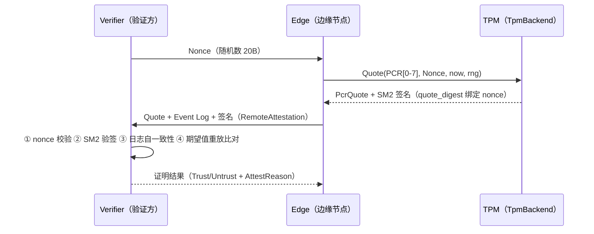
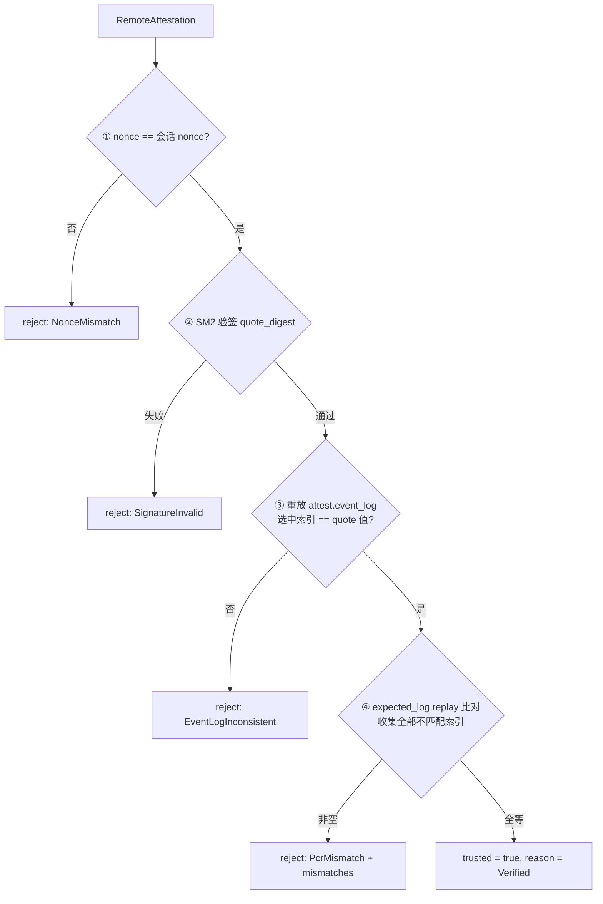

# EnerOS v0.114.0 测量启动与远程证明 设计文档

> 蓝图：`蓝图/phase2.md` §v0.114.0（P2-I 安全体系第 2 版）。
> 实现：[`crates/security/attestation/`](../../crates/security/attestation/src/lib.rs)（`eneros-attestation`，no_std + alloc，唯一依赖 eneros-crypto）。
> 上游：v0.113.0 Secure Boot（[secure-boot-design.md](secure-boot-design.md)）；下游：v0.115.0 mTLS。

---

## 1. 版本目标

**核心**：实现测量启动（Measured Boot）+ 远程证明（Remote Attestation），TPM PCR 寄存器度量值远程验证。
**业务价值**：远程可验证系统完整性，建立联邦信任基础（蓝图 §1）。
**Phase 定位**：P2-I 第 2 版。
**出口关联**：联邦可信验证（v0.97.0~v0.101.0 跨域场景）；v0.115.0 mTLS 以证明结果作为通道建立前置。

v0.113.0 落地 Secure Boot 信任链（启动时「验签」——防篡改镜像启动）；本版落地测量启动（启动时「度量存证」——PCR + 事件日志记录启动链）+ 远程证明（「远程可验证」——验证方凭 Quote + 日志远程判定完整性）。二者互补：Secure Boot 拒绝坏镜像本地启动，远程证明让远端发现已启动节点被篡改。

## 2. 前置依赖

- **前序**：v0.113.0 Secure Boot（概念上游：被度量的各级镜像即其验签对象）。
- **外部**：TPM 2.0 硬件或软件模拟器（蓝图 §2 阻塞项「无 TPM 则无法度量」→ SoftTpm 软件降级落地，D4）。
- **密码学基座**：v0.31.0/v0.32.0 国密 eneros-crypto（`sm3_hash`/`Sm3Hasher`、`sm2_sign`/`sm2_verify`、`Sm2KeyPair`/`Sm2PublicKey`/`Sm2Signature`、`CsRng`），path 依赖 `../crypto`。
- **假设**：TPM PCR 寄存器可用（或软件降级可用）；时间戳由集成层经 v0.12.0 RTC 供给（D8）。

## 3. 交付物清单

| 类型 | 路径 | 说明 |
|------|------|------|
| 代码 | [`crates/security/attestation/src/lib.rs`](../../crates/security/attestation/src/lib.rs) | `TpmError`（5 变体）/ `AttestError`（6 变体 + `From<TpmError>`）/ `AttestStats` / `AttestTransport` + `MockAttestTransport` |
| 代码 | [`crates/security/attestation/src/tpm.rs`](../../crates/security/attestation/src/tpm.rs) | `PcrBank` / `TpmBackend` / `SoftTpm` / `pcr_extend_value` / `quote_digest` |
| 代码 | [`crates/security/attestation/src/event_log.rs`](../../crates/security/attestation/src/event_log.rs) | `TcgEvent` / `TcgEventLog`（measure/replay） |
| 代码 | [`crates/security/attestation/src/attest.rs`](../../crates/security/attestation/src/attest.rs) | `PcrQuote` / `RemoteAttestation` / `AttestVerifier` / `AttestResult` / `AttestReason` |
| 测试 | src 内嵌 `#[cfg(test)]`（D3） | 22 个：TPM×6 + LOG×3 + ATT×8 + MOCK×2 + INT×2 + PERF×1 |
| 配置 | [`configs/attestation.toml`](../../configs/attestation.toml) | `[tpm]` / `[quote]` / `[verifier]` 三节模板 |
| 文档 | `docs/security/attestation-design.md`（本文，D2） | 12 章节 + 2 Mermaid |

## 4. 详细设计

### 4.1 数据结构

```rust
pub struct PcrBank { pub pcr_values: [[u8; 32]; 24] }        // SM3-only 单 bank（D9），复位态全零
pub struct TcgEvent { pub pcr_index: u8, pub event_type: u32,
                      pub digest: [u8; 32], pub event_data: Vec<u8> }
pub struct PcrQuote { pub pcr_select: Vec<u8>, pub pcr_values: Vec<[u8; 32]>,
                      pub nonce: [u8; 20], pub quote_time: u64 }   // nonce 内嵌（D10①）
pub struct RemoteAttestation { pub quote: PcrQuote, pub signature: [u8; 64],
                               pub event_log: Vec<TcgEvent> }      // 定长 64B 签名（D6）
pub struct AttestResult { pub trusted: bool, pub pcr_mismatches: Vec<u8>,
                          pub reason: AttestReason }               // reason 枚举（D11）
pub enum AttestReason { Verified, NonceMismatch, SignatureInvalid,
                        EventLogInconsistent, PcrMismatch, ServerRejected }
```

### 4.2 trait 接口

```rust
pub trait TpmBackend {                                        // sync，无 Send+Sync（D4）
    fn pcr_extend(&mut self, pcr_idx: u8, digest: &[u8; 32]) -> Result<(), TpmError>;
    fn pcr_read(&self, pcr_idx: u8) -> Result<[u8; 32], TpmError>;
    fn quote(&mut self, pcr_indices: &[u8], nonce: &[u8; 20], now: u64,
             rng: &mut CsRng) -> Result<(PcrQuote, [u8; 64]), TpmError>;  // 实现细化：rng 参数（SM2 签名必须随机数）
    fn attestation_pubkey(&self) -> Sm2PublicKey;
}
pub trait AttestTransport {                                   // sync（D5）
    fn verify_remote(&mut self, attest: &RemoteAttestation) -> Result<AttestResult, AttestError>;
}
```

### 4.3 quote_digest 规范编码

SM3 over：`pcr_count u8 ‖ 每 pcr_idx u8 ‖ 每 pcr_value 32B ‖ nonce 20B ‖ quote_time u64 LE`

| 段 | 长度 | 内容 |
|----|------|------|
| pcr_count | 1B | 选中 PCR 数量 |
| pcr_idx × N | N B | 选中索引列表 |
| pcr_value × N | 32N B | 对应 PCR 值 |
| nonce | 20B | 验证方随机数（签名绑定防重放，D6/D10） |
| quote_time | 8B LE | Quote 时间戳（D8 注入） |

### 4.4 证明时序（蓝图 §4.3）



### 4.5 verify 四步流水线



## 5. 技术交底

### 5.1 选型对比表（蓝图 §5.1）

| 方案 | 完整性 | 硬件 | 结论 |
|------|--------|------|------|
| TPM 2.0 PCR | 高 | TPM | ⭐ 采用（集成层真实 TPM2 适配器实现 `TpmBackend`） |
| 软件度量 | 中 | 无 | 降级方案（`SoftTpm` 一等实现，D4） |
| 无证明 | 无 | 无 | 不安全 |

### 5.2 TCG extend 语义（D7）

PCR extend 遵循 TCG PC Client 规范：`PCR_new = sm3(PCR_old ‖ digest)`。链式非幂等——同一 digest 重复 extend 结果不同，度量顺序敏感，启动链任一环节变化都会传播为最终 PCR 值变化。本 crate 以 [`pcr_extend_value`](../../crates/security/attestation/src/tpm.rs) 单一共享函数承载该语义，SoftTpm 本地 bank 更新 / `TcgEventLog::measure` / `TcgEventLog::replay` 三方共用，防实现分叉（v0.110.0 D11 CRC32 共享先例）。

### 5.3 关键技术

- TPM PCR 度量寄存器（24 个，SM3-only 单 bank，D9）。
- PCR Extend（哈希串联，见 §5.2）。
- 远程证明协议（Quote + Nonce，nonce 随 `quote_digest` 签名绑定防重放，D10①）。
- TCG Event Log 重放（验证方重算 PCR 比对期望值，蓝图 §4.4「PCR 重放不匹配 → 拒绝信任」）。

### 5.4 D4 软件降级论证

蓝图 §2 声明「无 TPM 则无法度量」为阻塞项，但 §4.4/§5.1 同时要求「TPM 不可用 → 软件度量降级」为错误处理路径、并将「软件度量」列为选型表第二方案。`SoftTpm` 即该降级方案的一等实现：与真实 TPM2 共用 `TpmBackend` trait，度量/Quote/签名语义完全一致（SM3 extend + SM2 AK 签名），仅信任根强度不同（软件密钥 vs 硬件熔断）。主机无 TPM 硬件可测、no_std 阶段无 C 库链接，故 crate 内不含 extern "C"/unsafe/NonNull（蓝图 FFI 代码移除）；真实 TPM2 FFI 适配器由集成层实现同一 trait（见 §11.3）。

### 5.5 实现路径与难点

1. TPM 抽象（`TpmBackend` + `SoftTpm`）→ 2. PCR 度量 + 事件日志（`measure`/`replay`）→ 3. 远程证明协议（`generate`/`verify`）。
难点：TPM 驱动兼容性（归集成层适配器）；事件日志完整性（由第 ③ 步自一致性检查保障，D11）。

### 5.6 交互与国产化

- 上游：v0.113.0 Secure Boot；下游：v0.115.0 mTLS。
- 国产化（蓝图 §5.6）：全程国密——SM3 度量/extend（替代 SHA-1/SHA-256，D9）、SM2 AK 签名/验签；信创 §5.6 全程国密要求满足。

## 6. 测试计划（22 个，src 内嵌 `#[cfg(test)]`，D3）

| 编号 | 名称 | 断言要点 | 结果 |
|------|------|---------|------|
| TPM1 | SoftTpm 初始 PCR 全零 | pcr_read(0..23) 全 [0u8;32] | ✅ |
| TPM2 | extend 确定性 | == sm3(0‖digest) | ✅ |
| TPM3 | extend 链式非幂等 | 两次 extend == sm3(sm3(0‖D)‖D) | ✅ |
| TPM4 | pcr_idx=24 越界 | Err(InvalidPcrIndex)；quote 空选择 Err(QuoteFailed) | ✅ |
| TPM5 | 故障注入 | inject_failure(1) → Err(TpmUnavailable)，后续恢复 | ✅ |
| TPM6 | quote 返回签名可验 | quote_digest + AK 公钥 sm2_verify == true；nonce/时间戳/选中值正确 | ✅ |
| LOG7 | measure 追加 + extend | 日志 1 事件且 tpm bank 更新；extend 失败不追挂 | ✅ |
| LOG8 | 空日志 replay 全零 | replay() == [[0u8;32];24] | ✅ |
| LOG9 | replay == SoftTpm bank | 同一串 measure 后 24 PCR 逐值相等 | ✅ |
| ATT10 | generate 组装 | quote 选中 [0..7] + 64B 签名 + 日志克隆 | ✅ |
| ATT11 | verify 快乐路径 | trusted + Verified + stats.trusted==1 | ✅ |
| ATT12 | nonce 不符 | untrusted + NonceMismatch | ✅ |
| ATT13 | 签名篡改 1 字节 | untrusted + SignatureInvalid | ✅ |
| ATT14 | 期望日志多一事件 | untrusted + PcrMismatch + mismatches==[1] | ✅ |
| ATT15 | 证明日志自一致性破坏 | untrusted + EventLogInconsistent | ✅ |
| ATT16 | 错误 AK 公钥 | untrusted + SignatureInvalid | ✅ |
| ATT17 | 空 pcr_indices | Err(EmptyPcrSelection) | ✅ |
| MOCK18 | Mock 返回预设结果 | result 一致 + calls==1 | ✅ |
| MOCK19 | 传输故障注入 | Err(TransportError) → 恢复，calls==2 | ✅ |
| INT20 | 端到端三级度量证明 | BL/Kernel/Runtime measure → generate → trusted | ✅ |
| INT21 | 端到端攻击：期望侧 Runtime 镜像被换 | untrusted + PcrMismatch（mismatches 含 2） | ✅ |
| PERF22 | quote 生成耗时打印/门禁 | release 打印；ENEROS_PERF_GATE=1 断言 < 100ms（D12） | ✅ |

GPU 规则（蓝图 §6.6）：不涉及 GPU。故障注入（§6.5）：TPM5 + MOCK19。回归（§6.4）：LOG9 PCR 值一致性。

## 7. 验收标准

- **功能（§7.1）**：远程证明可用——INT20 端到端可信通过；INT21 篡改拒绝。
- **性能量化（§7.2 「Quote < 100ms」）**：D12 口径——debug 仅打印；release 默认打印，`ENEROS_PERF_GATE=1` 时启用 < 100ms 断言门禁。主机纯 Rust SM2（eneros-crypto 仿射坐标 + EEA 模逆）签名耗时超 100ms 属预期（v0.113.0 D13 先例：验签实测 161~214ms），门禁面向目标硬件 SM2 加速 / 性能 CI 场景，实测耗时记录于版本汇报。
- **安全（§7.3）**：证明结果可信——nonce 绑定签名防重放（D10①）；验签/自一致性/期望值比对三重拒绝路径覆盖（ATT12~ATT16、INT21）。
- **文档（§7.4）**：本文档 12 章节 + 2 Mermaid。
- **出口判定（§7.5）**：远程证明通过验证（INT20/INT21 + 22 测试全过）。

## 8. 风险与注意事项

- **技术（§8.1）**：TPM 硬件兼容性——归集成层真实 TPM2 适配器；crate 以 `TpmBackend` trait 隔离。
- **依赖（§8.2）**：v0.113.0（概念上游）、v0.31.0/v0.32.0 eneros-crypto（path 依赖，零源码改动）。
- **资源（§8.3）**：TPM 资源（Quote 操作互斥由集成层调度；sync trait 单线程惯例）。
- **兼容（§8.4）**：TPM 版本（PCR 0~23 / SM3 bank 对齐 TCG PC Client；国密 TPM 支持 SM3）。
- **坑点（§8.5）**：PCR 重置限制——PCR 仅随复位清零，SoftTpm 仅随新实例复位；运行期无法清零/回退，集成层不得跨启动复用 PCR 状态。
- **CsRng 固定种子**：eneros-crypto 偏差声明 ①——测试需区分密钥时复用状态已推进的 rng（ATT16 先例）；生产环境接入硬件 TRNG。

## 9. 多角度要求

- **功能**：测量启动（`measure`）+ 远程证明（`generate`/`verify`）。
- **性能**：Quote < 100ms（D12 门禁口径，见 §7）。
- **安全**：TPM 硬件信任根（集成层）/ 软件降级（SoftTpm）；nonce 防重放；SM2 签名防篡改。
- **可靠**：软件降级（蓝图 §4.4）；故障注入演练（TPM5/MOCK19）。
- **可维护**：事件日志审计（`TcgEvent.event_data` 存证 + `events()` 只读访问器）。
- **可观测**：`AttestStats { quotes_verified, trusted, untrusted, last_reason }` 随 verify 更新（D11）。
- **可扩展**：支持多验证者——`AttestVerifier` 每实例持 AK 公钥，可任意多实例并行；`AttestTransport` 抽象支持任意远程通道实现。

## 10. 实现偏差（D1~D12，相对蓝图 §3/§4/§5/§6）

| 编号 | 偏差 | 理由 |
|------|------|------|
| **D1** | 蓝图 `crates/attestation/` → `crates/security/attestation/`（eneros-attestation） | 记忆 §2.3.1 强制：crate 归 `crates/<subsystem>/`；远程证明属安全体系，与 crypto/iec62351/secure-boot 同属 security 子系统 |
| **D2** | 蓝图 `docs/phase2/attestation.md` → `docs/security/attestation-design.md` | 记忆 §2.3.3 强制：文档按方向分类（docs/security/ 已有 secure-boot-design.md 等先例） |
| **D3** | 蓝图 `tests/attestation.rs` → src 内嵌 `#[cfg(test)]` | v0.87.0~v0.113.0 项目惯例，不新增 tests/ 文件 |
| **D4** | 蓝图 extern "C" TPM FFI（tpm2_initialize/pcr_extend/pcr_read/quote + NonNull + unsafe + Drop shutdown）→ `TpmBackend` sync trait + `SoftTpm` 软件 TPM | 主机无 TPM 硬件不可测；no_std 阶段无 C 库链接；蓝图 §4.4/§5.1 本就要求「软件度量降级」——SoftTpm 即该降级方案的一等实现；真实 TPM2 FFI 适配器在集成层实现同一 trait；无 unsafe/NonNull |
| **D5** | 蓝图 `async verify_remote(server_url)` + HttpClient + serde_json → `AttestTransport` sync trait（`verify_remote(&RemoteAttestation)`）+ `MockAttestTransport` | no_std 无 async runtime/无 std::net（v0.110.0 D4 / v0.111.0 D4 同先例）；线上格式/HTTP 归集成层；本地验证逻辑由 AttestVerifier 承载可独立测试 |
| **D6** | 蓝图 `quote()` 不返回签名、`RemoteAttestation.signature = Vec::new()`（注释「TPM 签名」）永不填充的 bug → `quote()` 返回 `(PcrQuote, [u8; 64])`，SoftTpm 用内置 AK（SM2 密钥对）对 `quote_digest` 签名；验签归 `AttestVerifier` | 无签名的 Quote 不可远程证明（核心功能缺失）；蓝图 `signature: Vec<u8>` 修复为定长 64B |
| **D7** | 蓝图 `sm3_hash_concat` 未定义 → `pcr_extend_value(current, digest) = sm3(current ‖ digest)` 共享函数 | TCG PC Client 标准 extend 语义；SoftTpm/measure/replay 三方共用同一函数防实现分叉（v0.110.0 D11 CRC32 共享先例） |
| **D8** | 蓝图 `current_time_ms()` / `load_event_log()` 未定义全局函数 → `now: u64` 参数注入 + `TcgEventLog` 显式持有传递 | no_std 无系统时间/无全局状态（v0.110.0 D7、v0.111.0 D8 同先例）；集成层由 v0.12.0 RTC 供给时间 |
| **D9** | 蓝图 `HashAlgorithm { Sha256, Sm3 }` + `selected_banks: Vec<HashAlgorithm>` → SM3-only 单 bank（删除枚举与 Vec） | eneros-crypto 纯国密无 SHA-256（信创 §5.6 全程国密）；v0.111.0 D6 RsaSha256 占位同先例——不支持即不建模 |
| **D10** | ① 蓝图 `nonce.try_into().unwrap_or([0u8; 20])` 静默回退 → nonce 固定 `[u8; 20]` 参数，嵌入 PcrQuote 随 quote_digest 签名绑定；② 蓝图 `pcr_read(idx).unwrap_or([0u8; 32])` 吞错 → 显式错误传播；③ 蓝图 quote mask 位移未校验 idx → pcr_idx ≥ 24 返回 InvalidPcrIndex | 安全关键路径禁止静默默认值与吞错（v0.111.0 D11 同原则）；nonce 嵌入 quote 使签名显式覆盖防重放 |
| **D11** | 蓝图 `AttestResult.reason: String` → `AttestReason` 6 变体枚举（Verified/NonceMismatch/SignatureInvalid/EventLogInconsistent/PcrMismatch/ServerRejected，Copy）；新增事件日志自一致性检查（重放 attest.event_log 比对 quote）；新增 `AttestStats`（quotes_verified/trusted/untrusted/last_reason）落地 §9 可观测 | no_std Copy 错误模型对齐 v0.111.0/v0.113.0 惯例；String 理由不利机器审计；自一致性检查防止证明方提交与 quote 不符的日志 |
| **D12** | 性能「Quote < 100ms」（§6.3/§7.2）落地为 release 模式打印 + `ENEROS_PERF_GATE=1` 环境变量断言门禁 | v0.113.0 D13 已确立先例：主机纯 Rust SM2 实测超目标硬件指标（验签 161~214ms），目标硬件 SM2 加速后方可达标；口径文档化于设计文档 §7 |

**实现细化（规格允许，非偏差）**：`TpmBackend::quote` 追加 `rng: &mut CsRng` 参数——SM2 签名必须随机数；真实 TPM2 适配器内部签名时可忽略该参数。

## 11. 集成指引

### 11.1 启动链度量（证明侧伪代码）

```rust
// 集成层：ROM → BL → Kernel → Runtime 逐级度量（配合 v0.113.0 验签后度量）
let mut tpm = SoftTpm::new(&mut rng);              // 或真实 TPM2 适配器
let mut log = TcgEventLog::new();
log.measure(&mut tpm, 0, EV_BL, bl_image)?;        // PCR0 ← BL 镜像
log.measure(&mut tpm, 1, EV_KERNEL, kernel_image)?; // PCR1 ← Kernel 镜像
log.measure(&mut tpm, 2, EV_RUNTIME, rt_image)?;    // PCR2 ← Runtime 镜像
// 收到验证方 Nonce 后生成证明（now 由 v0.12.0 RTC 供给，D8）
let attest = RemoteAttestation::generate(
    &mut tpm, &[0, 1, 2, 3, 4, 5, 6, 7], &nonce, rtc.now_ms(), &log, &mut rng,
)?;
// 经 AttestTransport 实现（集成层 HTTP/序列化）发送
transport.verify_remote(&attest)?;
```

### 11.2 验证方（verify 伪代码）

```rust
// 验证侧：预置证明方 AK 公钥（configs/attestation.toml [verifier].ak_pubkey_hex）
let mut verifier = AttestVerifier::new(ak_pubkey);
// 期望日志：以白名单镜像数据重放构造（与证明侧相同度量流程）
let expected_log = build_expected_log(&whitelist_images);
let result = verifier.verify(&attest, &expected_log, &session_nonce);
match result.reason {
    AttestReason::Verified => { /* 建立 mTLS 通道（v0.115.0 前置） */ }
    AttestReason::PcrMismatch => { /* 告警 + 拒绝信任，result.pcr_mismatches 定位篡改级 */ }
    _ => { /* 拒绝 + 记录 verifier.stats() */ }
}
```

### 11.3 真实 TPM2 适配器实现要点（集成层）

1. 实现 `TpmBackend` 四方法：`pcr_extend`/`pcr_read` 映射 TPM2_PCR_Extend/TPM2_PCR_Read（SM3 bank）；`quote` 映射 TPM2_Quote（AK 签名，可忽略 `rng` 参数——TPM 内部签名）；`attestation_pubkey` 返回烧录 AK 公钥。
2. C 返回码映射：`ExtendFailed`/`ReadFailed`/`QuoteFailed`（`TpmError` 保留变体即为此准备）；硬件不在位 → `TpmUnavailable`。
3. unsafe/extern "C" 仅存在于集成层适配器 crate，本 crate 保持零 unsafe。
4. PCR 复位语义：TPM2_PCR_Reset 仅限 PCR 16~23 且需 locality——遵循蓝图 §8.5，运行期不复位 PCR 0~7。

## 12. 参考资料

- 蓝图 `蓝图/phase2.md` §v0.114.0（版本目标/详细设计/测试计划/验收标准/风险）。
- TCG PC Client Platform Firmware Profile Specification（PCR 0~23、extend 语义）。
- GB/T 32905-2016 SM3、GB/T 32918.2-2017 SM2 数字签名（eneros-crypto 实现）。
- 上游设计文档：[secure-boot-design.md](secure-boot-design.md)（v0.113.0，PERF 门禁 D13 先例）。
- Spec：`.trae/specs/develop-v11400-attestation/spec.md`（D1~D12 偏差表、22 测试规划）。
