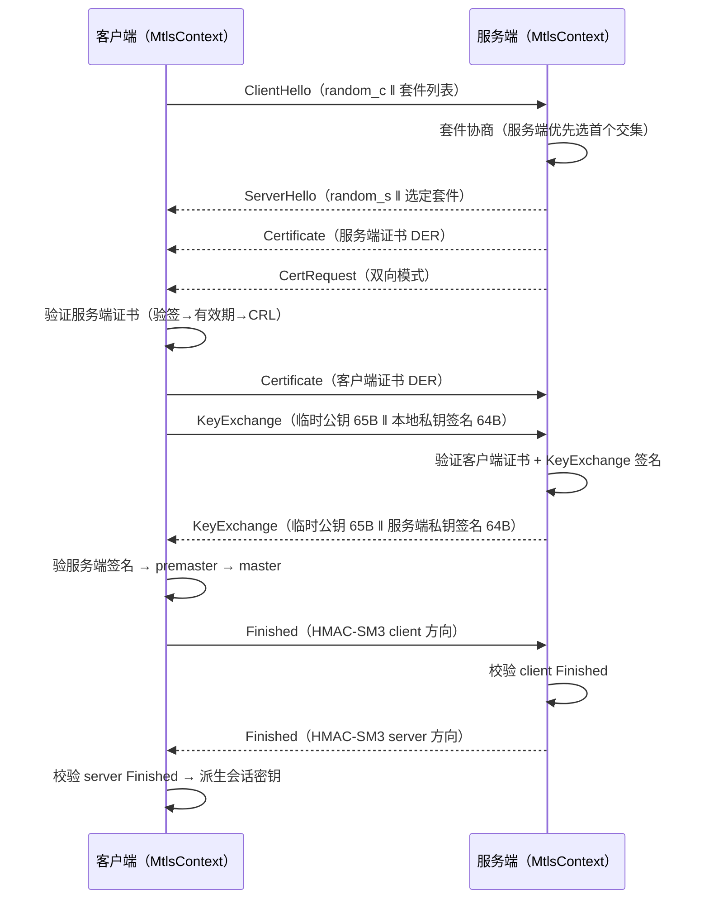
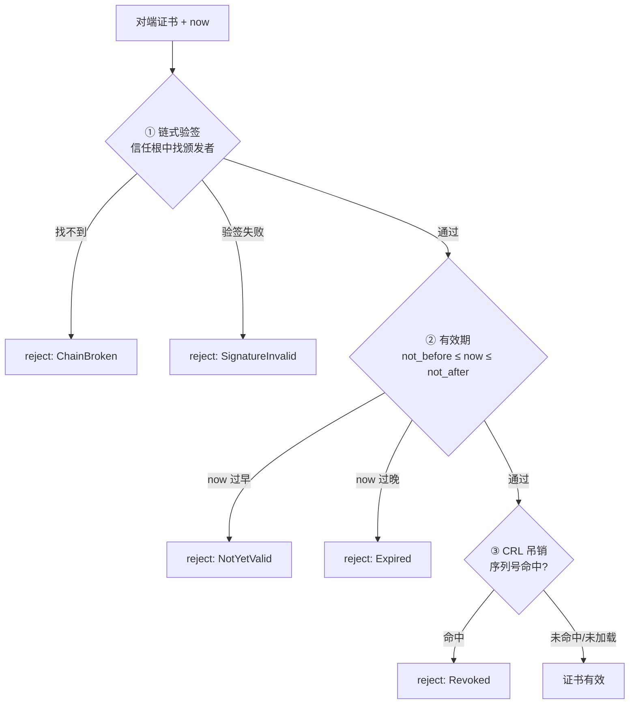

# EnerOS v0.115.0 mTLS 双向认证通信安全 设计文档

> 蓝图：`蓝图/phase2.md` §v0.115.0（P2-I 安全体系第 3 版）。
> 实现：[`crates/security/mtls/`](../../crates/security/mtls/src/lib.rs)（`eneros-mtls`，no_std + alloc，唯一依赖 eneros-crypto）。
> 上游：v0.114.0 测量启动与远程证明（[attestation-design.md](attestation-design.md)）、v0.98.0 跨域通信通道、v0.32.0 PKI 证书；下游：v0.116.0 模型签名。

---

## 1. 版本目标

**核心**：实现 mTLS 双向认证 + SM2/SM3/SM4 全国密通信加密（蓝图 §1）。
**业务价值**：联邦跨域通信缺乏双向身份认证与国密加密通道，存在中间人攻击与窃听风险；本版提供「抓包全加密」的安全通道底座。
**Phase 定位**：P2-I 第 3 版，联邦安全通信基石。
**出口关联**：联邦跨域通信加密出口判定（v0.98.0 通道的安全升级）；v0.116.0 模型签名复用本通道传输签名模型。

v0.114.0 落地远程证明（通道建立前的完整性前置）；本版落地通道本身——双向证书认证 + 国密套件协商 + 加密记录层，二者串联为「可信节点间的加密管道」。

## 2. 前置依赖

- **前序**：v0.98.0 跨域通信通道（场景上游）；v0.32.0 PKI 证书（eneros-crypto `pki` 模块：X509/CRL/签发/验签）；v0.31.0 国密（SM2/SM3/SM4）。
- **密码学基座**：eneros-crypto（`sm2_sign`/`sm2_verify`/`Sm2KeyPair`、`sm3_hash`/`Sm3Hasher`/`hmac_sm3`、`Sm4Gcm`/`Sm4Cbc`、`verify_signature`/`parse_der`/`to_der`、`Crl`、`CsRng`），path 依赖 `../crypto`，零源码改动。
- **假设**：节点证书/私钥/CA 根由集成层产线烧录（`configs/mtls.toml` 占位）；当前时间戳由集成层经 v0.12.0 RTC 注入（D8）；传输通道（TCP/串口）由集成层实现 `MtlsTransport` trait（D5）。

## 3. 交付物清单

| 类型 | 路径 | 说明 |
|------|------|------|
| 代码 | [`crates/security/mtls/src/lib.rs`](../../crates/security/mtls/src/lib.rs) | `TlsError`（8 变体）/ `CertError`（5 变体 + `From<CertError>`）/ `TlsStats` / `MtlsTransport` + `MockMtlsTransport` |
| 代码 | [`crates/security/mtls/src/cipher_suite.rs`](../../crates/security/mtls/src/cipher_suite.rs) | `KeyExchange` / `Cipher` / `MacAlgorithm` / `SmCipherSuite` / `negotiate` |
| 代码 | [`crates/security/mtls/src/cert_mgr.rs`](../../crates/security/mtls/src/cert_mgr.rs) | `CertManager`（verify_cert / check_revocation / load_crl） |
| 代码 | [`crates/security/mtls/src/handshake.rs`](../../crates/security/mtls/src/handshake.rs) | `MtlsContext` / `HandshakeOutcome`（双向握手状态机 + 密钥派生） |
| 代码 | [`crates/security/mtls/src/record.rs`](../../crates/security/mtls/src/record.rs) | `MtlsRecord`（seal / open + 64 位防重放窗口） |
| 测试 | src 内嵌 `#[cfg(test)]`（D3） | 21 个：SUITE×4 + CERT×5 + HS×5 + REC×4 + INT×2 + PERF×1 |
| 配置 | [`configs/mtls.toml`](../../configs/mtls.toml) | `[context]` / `[cipher]` / `[crl]` 三节模板 |
| 文档 | `docs/security/mtls-design.md`（本文，D2） | 12 章节 + 2 Mermaid |

## 4. 详细设计

### 4.1 数据结构

```rust
pub struct SmCipherSuite { pub key_exchange: KeyExchange,   // Sm2Dhe / EcdheSm2
                           pub cipher: Cipher,               // Sm4Gcm / Sm4Cbc
                           pub mac: MacAlgorithm }           // Sm3Hmac / None
pub struct MtlsContext { pub local_cert: X509Certificate, pub local_key: Sm2PrivateKey,
                         pub cert_mgr: CertManager,          // 信任根 + 可选 CRL（D6）
                         pub verify_peer: bool,              // 双向（默认）/ 单向
                         pub cipher_suites: Vec<SmCipherSuite>, pub stats: TlsStats }
pub struct HandshakeOutcome { pub session_key: [u8; 16],     // 会话主密钥
                              pub suite: SmCipherSuite,
                              pub peer_cert_fingerprint: [u8; 32] }  // 对端证书 SM3 摘要
pub struct MtlsRecord { /* enc_key 16B / mac_key 32B / send_seq / 防重放位图 */ }
```

### 4.2 线上帧格式与密钥派生

握手帧：`type(1) ‖ len(2 BE) ‖ payload`（6 类消息：ClientHello/ServerHello/Certificate/CertRequest/KeyExchange/Finished）。

| 段 | 内容 |
|----|------|
| premaster | `d_eph_local · P_eph_peer` 的 x 坐标（SM2 ECDH，32B） |
| master | `SM3(premaster ‖ random_c ‖ random_s)`（32B） |
| Finished | `HMAC-SM3(master, label ‖ random_c ‖ random_s)`，label 区分方向 |
| session_key | `SM3(master ‖ "session")` 前 16B |
| 记录层密钥 | `SM3(session_key ‖ "enc")` 前 16B / `SM3(session_key ‖ "mac")`（标签分离，D9） |

记录帧：`seq(8 BE) ‖ ciphertext ‖ tag`（GCM tag 16B / CBC SM3-HMAC 32B）；GCM nonce = `0x00000000 ‖ seq`，AAD = seq（绑定序列号防篡改）。

### 4.3 握手时序（蓝图 §4.3）



### 4.4 verify_cert 三步验证（顺序固定）



## 5. 技术交底

### 5.1 选型对比表（蓝图 §5.1）

| 方案 | 双向认证 | 国密 | 结论 |
|------|---------|------|------|
| GmSSL/Tongsuo C FFI | ✅ | ✅ | 蓝图 §4.5 原案 → 集成层适配器（D4，no_std 阶段不可链接 C 库） |
| 纯 Rust 国密握手（eneros-crypto） | ✅ | ✅ | ⭐ 采用（主机可测、零 unsafe、零 extern "C"） |
| 单向 TLS | ❌ | — | 不满足双向强制要求 |

### 5.2 关键技术

- SM2 临时密钥交换（ECDH，临时密钥对逐握手生成，前向安全）；线上临时公钥用本地证书私钥签名（证明私钥持有，防中间人）。
- SM3-HMAC Finished（双向 label 区分，绑定双方随机数，防降级/防重放握手）。
- SM4-GCM AEAD 记录加密（序列号构造 nonce + AAD 绑序列号）；SM4-CBC + SM3-HMAC（Encrypt-then-MAC）备选套件。
- 64 位防重放滑动窗口（位图语义对齐 IPsec 标准，v0.98.1 同先例）。
- 证书三步验证（验签 → 有效期 → CRL，顺序固定，错误显式传播）。

### 5.3 D4 纯 Rust 实现论证

蓝图 §4.5 为 GmSSL C FFI（`extern "C"` + `NonNull` + `std::net::TcpStream`）。按记忆 §4.3 全项目 no_std 硬性要求（禁 extern "C"/unsafe/NonNull）与 v0.113.0 D4/v0.114.0 D4 先例，FFI 移除：crate 内为纯 Rust 实现，复用 eneros-crypto 公开 API（禁重复造轮子，记忆 §5.5）；主机可测（std 线程 + mpsc 通道模拟双端）；真实 GmSSL/Tongsuo/OpenSSL 适配器由集成层实现同一 `MtlsTransport` + 线上帧格式（见 §11.3）。

### 5.4 实现路径与难点

1. 套件协商（`negotiate`）→ 2. 证书管理（`CertManager`）→ 3. 握手状态机（双端 9 步）→ 4. 记录层（seal/open + 防重放）。
难点：双端状态机帧序对齐（由 6 类消息 type 字节 + len 校验保障，错序即 `InvalidMessage`）；前向安全（临时密钥对逐握手生成，私钥不出 eneros-crypto）。

### 5.5 交互与国产化

- 上游：v0.114.0 远程证明（通道前置）；v0.98.0 跨域通信通道（场景上游）；下游：v0.116.0 模型签名。
- 国产化（蓝图 §5.6）：全程国密——SM2 证书/密钥交换/签名、SM3 派生/HMAC、SM4 记录加密；零 RSA/SHA/AES；信创 §5.6 全程国密要求满足。

## 6. 测试计划（21 个，src 内嵌 `#[cfg(test)]`，D3）

| 编号 | 名称 | 断言要点 | 结果 |
|------|------|---------|------|
| SUITE1 | 协商成功 | 双方交集 → 首个共同套件 | ✅ |
| SUITE2 | 无共同套件 | Err(NoCommonCipherSuite) | ✅ |
| SUITE3 | 服务端优先 | 客户端 [GCM,CBC] + 服务端 [CBC,GCM] → CBC（服务端序） | ✅ |
| SUITE3+ | 套件编解码往返 | to_bytes/from_bytes 全组合往返一致；非法字节 → None | ✅ |
| CERT4 | 有效证书通过 | verify_cert == Ok | ✅ |
| CERT5 | 过期拒绝 | Err(Expired) | ✅ |
| CERT6 | 未生效拒绝 | Err(NotYetValid) | ✅ |
| CERT7 | CRL 命中拒绝 | Err(Revoked)；check_revocation 独立命中 | ✅ |
| CERT8 | 坏签名拒绝 | Err(SignatureInvalid)；颁发者不在信任根 → ChainBroken | ✅ |
| HS9 | 双向认证成功 | 双方同 session_key/suite；互持对端证书指纹；stats 正确 | ✅ |
| HS10 | 服务端证书过期 | 客户端 Err(CertInvalid(Expired)) + rejected | ✅ |
| HS11 | 客户端证书吊销 | 服务端 Err(CertInvalid(Revoked)) + rejected | ✅ |
| HS12 | 单向模式 | verify_peer=false 成功；服务端侧对端指纹全零 | ✅ |
| HS13 | Finished 篡改 | Err(HandshakeFailed) + rejected + last_error | ✅ |
| REC14 | 加密往返 | open(seal(m)) == m；线上字节 ≠ 明文 | ✅ |
| REC15 | 篡改密文 | 任一字节翻转 → Err(DecryptFailed) | ✅ |
| REC16 | 重放拒绝 | 重复帧/窗口外旧帧 → Err(ReplayDetected) | ✅ |
| REC17 | 序列号单调 | nonce/IV 随 seq 递增，密文逐帧不同 | ✅ |
| INT18 | 端到端加密通信 | 握手 → 双向记录往返明文一致；线上不含明文；计数正确 | ✅ |
| INT19 | 中间人全线拒绝 | 篡改 ClientHello/ServerHello/Certificate/Finished 均失败；篡改记录 DecryptFailed；重放 ReplayDetected | ✅ |
| PERF20 | 握手耗时打印/门禁 | release 打印；ENEROS_PERF_GATE=1 断言 < 200ms（D7） | ✅ |

GPU 规则（蓝图 §6.6）：不涉及 GPU。故障注入（§6.5）：MockMtlsTransport fail_next_send/recv + INT19 中间人篡改注入。回归（§6.4）：HS9 双方密钥一致性 + INT18 双方向往返。

## 7. 验收标准

- **功能（§7.1）**：mTLS 通道可用——INT18 端到端加密通信通过；HS9 双方派生相同会话密钥。
- **性能量化（§7.2 「握手 < 200ms」）**：D7 口径——debug 仅打印；release 默认打印，`ENEROS_PERF_GATE=1` 时启用 < 200ms 断言门禁（`var(...).as_deref() == Ok("1")`，v0.114.0 修复口径）。门禁面向目标硬件 SM2 加速 / 性能 CI 场景，实测耗时记录于版本汇报。
- **安全（§7.3）**：中间人攻击全线拒绝——INT19 篡改任一握手帧/记录字节均失败；重放拒绝；HS10/HS11/HS13 证书与 Finished 拒绝路径覆盖。
- **文档（§7.4）**：本文档 12 章节 + 2 Mermaid。
- **出口判定（§7.5）**：抓包全加密（INT18 线上字节不含明文断言）+ 21 测试全过。

> **性能实测**（2026-07-21，主机 release，纯 Rust SM2 无硬件加速）：单次双向握手（含双向证书验签 + SM2 密钥交换双签名双验签 + ECDH + HMAC Finished）≈ **1.47s**，超 200ms 目标属预期（v0.113.0 D13 / v0.114.0 D12 同先例：主机纯软 SM2 实测均超目标硬件指标）；目标硬件 SM2 加速后方可达标，`ENEROS_PERF_GATE=1` 门禁面向性能 CI / 目标硬件场景。

## 8. 风险与注意事项

- **技术（§8.1）**：真实网络栈适配——归集成层 `MtlsTransport` 实现（TCP 流式切帧：本 crate 帧语义为「一次 send 一完整帧」）。
- **依赖（§8.2）**：v0.31.0/v0.32.0 eneros-crypto（path 依赖，零源码改动）；v0.114.0（概念上游）。
- **资源（§8.3）**：内存预算——单连接 MtlsContext + MtlsRecord ≈ 数 KB（证书 DER + 密钥 + 窗口位图），Agent Runtime 分区 ≤ 64MB 预算内（记忆 §5.6）。
- **兼容（§8.4）**：与标准 TLS 1.3 不互通——本实现为国密简化握手（蓝图 §4.3 自定义消息流）；跨域对端必须同为 EnerOS 节点或实现同一帧格式的集成层适配器。
- **坑点（§8.5）**：① 双端 `verify_peer` 配置必须一致（一端双向一端单向将帧序错位 → InvalidMessage）；② CRL 未加载时吊销检查静默通过（蓝图 §4.3 CRL 为可选加固项，生产必须配置 `configs/mtls.toml [crl]`）；③ 防重放窗口随 `MtlsRecord` 实例存亡，重建记录层（重握手）即重置——集成层不得跨会话复用序列号状态。
- **CsRng 固定种子**：eneros-crypto 偏差声明——`CsRng::from_seed` 仅限测试；生产接入硬件 TRNG。

## 9. 多角度要求

- **功能**：套件协商（`negotiate`）+ 证书管理（`CertManager`）+ 双向握手（`MtlsContext`）+ 记录层（`MtlsRecord`）。
- **性能**：握手 < 200ms（D7 门禁口径，见 §7）。
- **安全**：双向证书强制互验（默认）；前向安全临时密钥；Finished HMAC 防降级；AEAD + 防重放窗口；CRL 吊销加固。
- **可靠**：单向模式降级（`verify_peer=false`，蓝图 §4.3）；传输故障显式传播（TransportError 不吞错）。
- **可维护**：4 模块分层（套件/证书/握手/记录），每模块独立测试；MockMtlsTransport 支撑集成层联调。
- **可观测**：`TlsStats { handshakes, rejected, records_sent, records_recv, last_error }` 随握手更新（蓝图 §9）。
- **可扩展**：套件三字段开放组合（新算法 = 新枚举变体 + 编码字节）；`MtlsTransport` 抽象支持任意通道（TCP/串口/消息总线）。

## 10. 实现偏差（D1~D9，相对蓝图 §3/§4/§5/§6）

| 编号 | 偏差 | 理由 |
|------|------|------|
| **D1** | 蓝图 `crates/mtls/` → `crates/security/mtls/`（eneros-mtls） | 记忆 §2.3.1 强制：crate 归 `crates/<subsystem>/`；mTLS 属安全体系，与 crypto/iec62351/secure-boot/attestation 同属 security 子系统 |
| **D2** | 蓝图 `docs/phase2/mtls.md` → `docs/security/mtls-design.md` | 记忆 §2.3.3 强制：文档按方向分类（docs/security/ 已有 secure-boot/attestation 先例） |
| **D3** | 蓝图 `tests/mtls.rs` → src 内嵌 `#[cfg(test)]` | v0.87.0~v0.114.0 项目惯例，不新增 tests/ 文件 |
| **D4** | 蓝图 §4.5 GmSSL C FFI（extern "C" + NonNull + unsafe）→ 纯 Rust 实现（复用 eneros-crypto 公开 API） | 记忆 §4.3 no_std 硬性要求（禁 extern "C"/unsafe/NonNull）；主机无 GmSSL 库不可测；v0.113.0 D4/v0.114.0 D4 同先例；真实 GmSSL/Tongsuo 适配器在集成层实现同一 `MtlsTransport` + 帧格式 |
| **D5** | 蓝图 `std::net::TcpStream` 直连 → `MtlsTransport` 同步 trait（send/recv 完整帧）+ `MockMtlsTransport`（故障注入 + calls 计数） | no_std 无 std::net（v0.110.0 SyncTransport / v0.114.0 AttestTransport 同先例）；TCP 流式切帧归集成层 |
| **D6** | 蓝图 `MtlsContext.ca: CaCert` 单根字段 → `cert_mgr: CertManager`（信任根集合 + 可选 CRL） | HS11 客户端吊销拒绝场景要求服务端侧持 CRL；单根 CA 即 CertManager 中唯一信任根，语义等价且能力完备 |
| **D7** | 性能「握手 < 200ms」（§6.3/§7.2）落地为 release 打印 + `ENEROS_PERF_GATE=1` 环境变量断言门禁 | v0.113.0 D13/v0.114.0 D12 已确立先例：主机纯 Rust SM2 实测超目标硬件指标，目标硬件 SM2 加速后方可达标；口径见 §7 |
| **D8** | 蓝图握手内取系统时间 → `now: u64` 参数注入（证书有效期检查） | no_std 无系统时钟（v0.110.0 D7/v0.114.0 D8 同先例）；集成层由 v0.12.0 RTC 供给 |
| **D9** | 蓝图未规定 KDF 细节 → SM3 标签分离派生（`SM3(master‖"session")` → `SM3(session_key‖"enc"/"mac")`） | eneros-crypto 无 HKDF；SM3 散列 + 域分离标签为纯国密 no_std 落地（v0.108.0 会话密钥派生同思路） |

**实现细化（规格允许，非偏差）**：`EcdheSm2` 保留为 `Sm2Dhe` 同曲线语义别名（兼容蓝图套件命名）；握手帧增加 `len(2 BE)` 头（蓝图仅述消息流，长度前缀为帧完整性校验所需）。

## 11. 集成指引

### 11.1 通道建立（双端伪代码）

```rust
// 集成层：加载烧录的证书/私钥/CA 根（configs/mtls.toml [context]，D8 时间注入）
let mut ctx = MtlsContext::new(local_cert, local_key, vec![ca_root], true, suites);
ctx.cert_mgr.load_crl(crl);                    // 可选加固（[crl] 节）
// 服务端：accept 后构造 TCP 适配器（实现 MtlsTransport，流式切帧）
let outcome = ctx.handshake_server(&mut tcp_transport, &mut rng, rtc.now_secs())?;
// 客户端：connect 后同理
let outcome = ctx.handshake_client(&mut tcp_transport, &mut rng, rtc.now_secs())?;
let mut record = MtlsRecord::new(&outcome);
let wire = record.seal(payload);               // 发往对端
let plain = record.open(&wire)?;               // 收自对端
```

### 11.2 与 v0.114.0 远程证明串联

```rust
// 先证明后建链：验证侧 AttestReason::Verified → 才允许进入 mTLS 握手
match verifier.verify(&attest, &expected_log, &nonce).reason {
    AttestReason::Verified => { /* 放行 MtlsContext::handshake_* */ }
    _ => { /* 拒绝 + 告警 */ }
}
```

### 11.3 真实 GmSSL/Tongsuo 适配器实现要点（集成层）

1.  unsafe/extern "C" 仅存在于集成层适配器 crate，本 crate 保持零 unsafe（D4）。
2.  帧语义对齐：`type(1) ‖ len(2 BE) ‖ payload` 握手帧、`seq(8 BE) ‖ ct ‖ tag` 记录帧；GmSSL 通道仅作传输承载时直接实现 `MtlsTransport`；若用 GmSSL 自身 TLCP 栈替代握手，则本 crate 退化为证书管理（`CertManager`）+ 配置源，通道语义由适配器对齐。
3.  私钥不出安全存储：适配器内完成签名（HSM/SE 场景），本 crate `local_key` 路径仅用于非 HSM 场景。
4.  时间注入：`now` 由 v0.12.0 RTC 供给，禁止 `std::time::SystemTime`（D8）。

## 12. 参考资料

- 蓝图 `蓝图/phase2.md` §v0.115.0（版本目标/详细设计/测试计划/验收标准/风险）。
- GB/T 32918.2-2017 SM2 数字签名、GB/T 32905-2016 SM3、GB/T 32907-2016 SM4（eneros-crypto 实现）。
- RFC 5280（X.509 证书/CRL）；RFC 8446 TLS 1.3（握手语义参考，本实现为国密简化版）。
- 上游设计文档：[attestation-design.md](attestation-design.md)（v0.114.0，PERF 门禁 D12 先例）、[secure-boot-design.md](secure-boot-design.md)（v0.113.0）。
- Spec：`.trae/specs/develop-v11500-mtls/spec.md`（D1~D9 偏差表、20 测试规划）。
