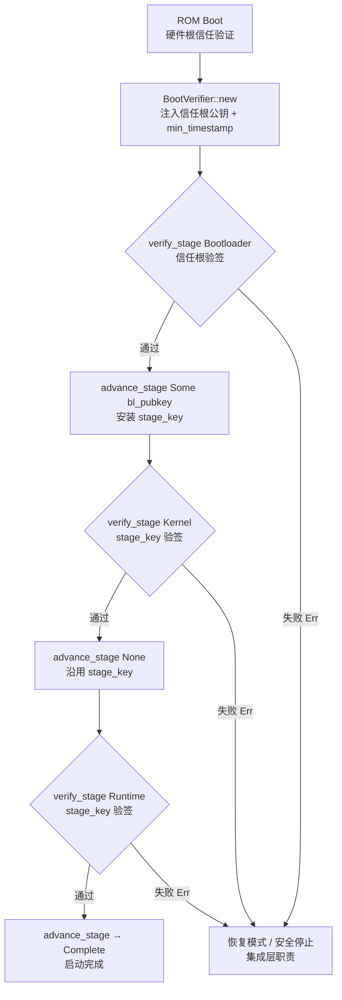

# EnerOS v0.113.0 Secure Boot 全链验证设计文档

> 蓝图：`蓝图/phase2.md` §v0.113.0（P2-I 安全体系第 1 版）
> Spec：`.trae/specs/develop-v11300-secure-boot/spec.md`
> Crate：[`crates/security/secure-boot/`](../../crates/security/secure-boot/src/lib.rs)（`eneros-secure-boot`，no_std）
> 依赖：eneros-crypto（v0.31.0/v0.32.0 国密 SM2/SM3，workspace 内 path 依赖，零外部依赖）

---

## 1. 版本目标

实现 Secure Boot 全链验证：ROM → Bootloader → 内核 → Runtime 逐级 SM2 签名校验（蓝图 §1）。

**业务价值**：防止篡改镜像启动，保障系统从源头可信。无签名验证则恶意镜像可启动（蓝图 §2 阻塞项）。

**Phase 定位**：P2-I 第 1 版，安全体系起点；为 v0.114.0 测量启动/远程证明与联邦安全启动奠基。

## 2. 前置依赖

- **前序版本**：v0.4.0 Rust 用户态组件、v0.31.0 国密 SM2/SM3（eneros-crypto）、v0.32.0 PKI 基座（证书链验证职责边界）。
- **外部**：ARM64 TrustZone / TPM 硬件根信任（ROM 级验证由硬件完成，蓝图 §4.5）。
- **本 crate 复用**：`sm3_hash` / `sm2_sign` / `sm2_verify` / `Sm2Signature` / `Sm2PublicKey` / `Sm2KeyPair` / `CsRng`（D9，禁重复造轮子）。

## 3. 交付物清单

| 交付物 | 路径 | 说明 |
|--------|------|------|
| crate 骨架 | `crates/security/secure-boot/Cargo.toml` | `eneros-secure-boot`，唯一依赖 `eneros-crypto = { path = "../crypto" }` |
| 库入口 | [`src/lib.rs`](../../crates/security/secure-boot/src/lib.rs) | `BootError`（10 变体）/ `BootStats` + 模块声明 + 重导出 + D1~D12 偏差表 |
| 签名头 | [`src/header.rs`](../../crates/security/secure-boot/src/header.rs) | `ImageSignature`（118B 固定字段）+ `encode_header` / `decode_header` |
| 信任链 | [`src/chain.rs`](../../crates/security/secure-boot/src/chain.rs) | `BootStage`（5 变体）+ `ChainOfTrust` |
| 验证器 | [`src/verifier.rs`](../../crates/security/secure-boot/src/verifier.rs) | `BootVerifier`（`new` / `verify_stage` / `advance_stage` / `current_stage` / `stats`） |
| 配置模板 | `configs/secure-boot.toml` | `[trust_root]` / `[anti_rollback]` / `[stages]` 三节（D12） |
| 设计文档 | `docs/security/secure-boot-design.md` | 本文档 |
| 测试 | src 内嵌 `#[cfg(test)]` | HDR×5 + 链初始×1 + VER×9 + CHN×3 + INT×2 + PERF×1（D3） |

## 4. 详细设计

### 4.1 数据结构

```rust
// 镜像签名头（全固定字段 118B，Copy，D7：删除蓝图 signer_cert 字段）
pub struct ImageSignature {
    pub magic: [u8; 4],       // "ESIG"
    pub version: u16,         // 当前仅 1
    pub image_size: u64,      // 镜像字节数（防截断，D10）
    pub image_hash: [u8; 32], // 镜像 SM3 哈希
    pub signature: [u8; 64],  // SM2 签名（r ‖ s）
    pub timestamp: u64,       // 签名时间戳（防降级，D8）
}

// 启动阶段（严格逐级）
pub enum BootStage { Rom, Bootloader, Kernel, Runtime, Complete }

// 信任链状态（字段私有，D5/D6：Sm2PublicKey 强类型替代蓝图 [u8;64]）
pub struct ChainOfTrust {
    root_key: Sm2PublicKey,          // 信任根（构造注入）
    stage_key: Option<Sm2PublicKey>, // 下级验签密钥（BL→Kernel 推进时安装）
    current_stage: BootStage,
}

// 启动验证器
pub struct BootVerifier {
    chain: ChainOfTrust,
    min_timestamp: u64, // 防降级下限（构造注入，熔丝/安全存储供给，D8）
    stats: BootStats,   // §9 可观测（D11）
}
```

### 4.2 接口定义

```rust
impl BootVerifier {
    pub fn new(root_key: Sm2PublicKey, min_timestamp: u64) -> Self;
    pub fn verify_stage(&mut self, stage: BootStage, image: &[u8], sig: &ImageSignature)
        -> Result<(), BootError>;
    pub fn advance_stage(&mut self, next_key: Option<Sm2PublicKey>)
        -> Result<BootStage, BootError>;
    pub fn current_stage(&self) -> BootStage;
    pub fn stats(&self) -> BootStats;
}

pub fn encode_header(sig: &ImageSignature) -> [u8; HEADER_LEN];       // 118B
pub fn decode_header(bytes: &[u8]) -> Result<ImageSignature, BootError>;
```

### 4.3 签名头帧布局（全小端，118B）

| 偏移 | 长度 | 字段 | 说明 |
|------|------|------|------|
| 0 | 4 | magic | 固定 `"ESIG"`，错误 → `InvalidMagic` |
| 4 | 2 | version | 帧格式版本，仅 1，否则 → `UnsupportedVersion` |
| 6 | 8 | image_size | 镜像字节数（u64 LE），与实际长度不符 → `SizeMismatch` |
| 14 | 32 | image_hash | 镜像 SM3 哈希，不符 → `HashMismatch` |
| 46 | 64 | signature | SM2 签名（r ‖ s），验签失败 → `SignatureInvalid` |
| 110 | 8 | timestamp | 签名时间戳（u64 LE），低于下限 → `StaleImage` |

解码期拦截：输入 < 118B → `InvalidHeader`；魔数/版本错误在 `decode_header` 期拦截，
`verify_stage` 期对直接构造的结构体同样复检（D10）。

### 4.4 信任链流程



### 4.5 单级验证时序

```mermaid
sequenceDiagram
    participant BL as 集成层 Bootloader
    participant V as BootVerifier
    participant C as eneros-crypto
    BL->>BL: decode_header(镜像头部 118B)
    BL->>V: verify_stage(stage, image, sig)
    V->>V: ① stage == current_stage?<br/>否则 WrongStage
    Note over V: Rom/Complete 直通 Ok（不计数）
    V->>V: ② magic/version/image_size 复检
    V->>C: ③ sm3_hash(image)
    C-->>V: [u8; 32]
    V->>V: ④ 哈希比对 + timestamp ≥ min_timestamp
    V->>V: ⑤ 选钥：Bootloader→root_key<br/>Kernel/Runtime→stage_key
    V->>C: ⑥ sm2_verify(hash, signature, key)
    C-->>V: Ok(true/false)
    alt 验签通过
        V-->>BL: Ok(())（verified_stages += 1）
        BL->>V: advance_stage(next_key)
        V-->>BL: Ok(下一 stage)
    else 任一校验失败
        V-->>BL: Err(BootError)（rejected += 1, last_error）
        BL->>BL: 进入恢复模式（集成层职责）
    end
```

### 4.6 verify_stage 校验流水线（严格按序）

1. `stage != current_stage` → `WrongStage`（强制逐级，D10）
2. `Rom | Complete` → `Ok(())`（硬件根信任/链完成语义，不计 `verified_stages`）
3. `magic != "ESIG"` → `InvalidMagic`
4. `version != 1` → `UnsupportedVersion`
5. `image.len() != image_size` → `SizeMismatch`（防截断镜像）
6. `sm3_hash(image) != image_hash` → `HashMismatch`
7. `timestamp < min_timestamp` → `StaleImage`（防降级）
8. 选钥：Bootloader → 信任根；Kernel/Runtime → stage_key（None → `MissingStageKey`）
9. `Sm2Signature::from_bytes` + `sm2_verify`：false/编码非法/内部错误 → `SignatureInvalid`
10. 通过：`verified_stages += 1`；所有失败路径：`rejected += 1` 且记录 `last_error`

### 4.7 advance_stage 推进规则

- `Complete` → `AlreadyComplete`
- `Bootloader → Kernel`：`next_key` 必须 `Some(bl_pubkey)`（None → `MissingStageKey`，stage 不变）；
  BL 公钥随已验签镜像体传递，完整性由哈希+签名覆盖传递可信（D6，修复蓝图 `bl_pubkey` 恒零 bug）
- `Kernel → Runtime`：None 沿用当前 stage_key（蓝图「同 BL key」语义），Some 则轮换
- `Rom → Bootloader`：忽略 `next_key`（Some 亦接受但不安装，BL 级固定用信任根验签）

## 5. 技术交底

### 5.1 选型对比表

| 方案 | 安全性 | 硬件依赖 | 国密合规 | 结论 |
|------|--------|---------|---------|------|
| SM2 签名链（eneros-crypto） | 高 | TPM/TrustZone（ROM 级） | ✅ 满足信创 | ⭐ 采用 |
| RSA 签名 | 高 | TPM | ❌ 非国密 | 排除 |
| 无验证 | 无 | 无 | — | 不安全，排除 |

### 5.2 关键技术

- **信任链逐级传递**：下级验签密钥随已验签镜像体传递（D6），完整性由哈希+签名覆盖传递可信。
- **SM2 签名 + SM3 哈希**：复用 eneros-crypto（常量时间/零化/Drop 已经安全评审，D9），签名消息为镜像 SM3 哈希 32B。
- **防降级攻击**：签名头时间戳 ≥ 构造注入的 `min_timestamp`（熔丝/安全存储供给，D8）。
- **二进制编解码零 serde**：全固定字段 118B 全小端（D7/D11，对齐 v0.111.0 D5 先例）。

### 5.3 实现路径

1. 镜像签名头格式（header.rs）→ 2. 信任链状态机（chain.rs）→ 3. 四级验证器（verifier.rs）→ 4. 失败恢复模式（集成层职责，见 §11）。

### 5.4 难点

- ROM 阶段代码极小（本 crate 不覆盖 ROM 实现，ROM 级直通语义由硬件承载）。
- **签名验证性能**：eneros-crypto 为纯 Rust 仿射坐标 + EEA 模逆实现，主机 release 单次
  SM2 验签实测 ~150ms（`target-cpu=native` 后 ~144ms），超出蓝图 §7.2「< 50ms」
  指标（该指标面向目标硬件 SM2 加速场景）。达标需优化 eneros-crypto 点运算
  （Jacobian 坐标/窗口法）或目标硬件加速——属 crypto crate 演进议题，超出本版边界
  （本版硬约束禁改 eneros-crypto）。PERF20 落地为：release 默认打印计时，设
  `ENEROS_PERF_GATE=1` 环境变量时启用 < 50ms 断言（D13），供目标硬件/性能 CI 门禁使用。

### 5.5 交互

- 上游：v0.4.0（用户态组件）、v0.31.0/v0.32.0（eneros-crypto 国密 + PKI）。
- 下游：v0.114.0 测量启动与远程证明（信任链基座）；v0.119.0 渗透测试（篡改镜像 100% 拒绝）。

### 5.6 国产化

全程国密 SM2/SM3，满足信创要求（蓝图 §5.6）。

## 6. 测试计划

20 个编号测试（src 内嵌 `#[cfg(test)]`，D3）+ 1 个信任链初始状态测试，共 21 个：

| 编号 | 名称 | 断言要点 |
|------|------|---------|
| HDR1 | 编解码往返 | 全字段 encode→decode 逐字段相等 |
| HDR2 | 坏 magic | Err(InvalidMagic) |
| HDR3 | version != 1 | Err(UnsupportedVersion) |
| HDR4 | 截断输入（117B / 空） | Err(InvalidHeader) |
| HDR5 | HEADER_LEN 常量 == 118 | 帧布局静态保证 |
| — | 信任链初始状态 | current_stage==Rom 且 stage_key==None |
| VER6 | Rom 阶段直接 Ok | 硬件根信任语义（蓝图 §4.5），verified_stages==0 |
| VER7 | Bootloader 真实签名验过 | Ok，verified_stages==1 |
| VER8 | 篡改镜像 1 字节 | Err(HashMismatch)，rejected==1，stage 不变 |
| VER9 | 错私钥签名 | Err(SignatureInvalid) |
| VER10 | 签名字段非法编码（全 0xFF） | Err(SignatureInvalid) |
| VER11 | 坏 magic / 坏 version / size 不符 | InvalidMagic / UnsupportedVersion / SizeMismatch |
| VER12 | timestamp < min_timestamp | Err(StaleImage) |
| VER13 | 跳级 verify（Rom→Kernel） | Err(WrongStage) |
| VER14 | 缺 stage_key 验 Kernel | Err(MissingStageKey)（直接构造场景） |
| CHN15 | advance 全流程 | Rom→Bootloader→Kernel→Runtime→Complete 依次推进 |
| CHN16 | BL→Kernel 缺密钥 | Err(MissingStageKey)，stage 不变 |
| CHN17 | Complete 后 advance | Err(AlreadyComplete) |
| INT18 | 全链快乐路径 | 两级密钥三镜像全过 → Complete，verified_stages==3，rejected==0 |
| INT19 | 链中途篡改拒绝后重验 | Kernel 篡改 → HashMismatch → 修正重验 → Ok → Complete |
| PERF20 | 单次 SM2 验签 < 50ms | release 计时打印；ENEROS_PERF_GATE=1 时断言（cfg(test) Instant 口径；debug 仅打印，D13） |

故障注入（蓝图 §6.5）：VER8/VER10/INT19 覆盖签名损坏与镜像篡改 → 集成层据 Err 进入恢复模式。
GPU 规则（蓝图 §6.6）：不涉及 GPU。

## 7. 验收标准

- **功能（§7.1）**：全链签名验证（INT18）；篡改镜像 100% 拒绝（VER8/VER9/VER10/INT19，§7.3）。
- **性能量化（§7.2）**：PERF20 单次验签 < 50ms（release 默认打印，`ENEROS_PERF_GATE=1`
  时断言，D13）。⚠️ 主机实测 ~150ms，见 §5.4——eneros-crypto 点运算性能议题，
  指标面向目标硬件加速场景。
- **文档（§7.4）**：本文档 + crate 文档注释（D1~D13 偏差表）。
- **出口判定（§7.5）**：篡改镜像拒绝启动验证通过（VER8/INT19）。
- **no_std**：`aarch64-unknown-none` 交叉编译通过；零外部依赖；零 unsafe；无 `panic!`/`todo!`/`unimplemented!`。

## 8. 风险与注意事项

| 风险 | 说明与对策 |
|------|-----------|
| ROM 阶段资源限制（§8.1） | 本 crate 面向 Bootloader 及以上层级；ROM 级由硬件根信任承载 |
| 硬件根信任依赖（§8.2） | 信任根公钥须经熔丝/安全存储烧录（TrustZone/TPM），软件自证无根 |
| 签名验证性能 | 主机实测超蓝图指标 3.5×（§5.4）；目标硬件需 SM2 加速或 crypto 优化 |
| 信任链断裂致系统不可启动（§8.5） | 任意级失败 → Err → 集成层恢复模式；恢复镜像须独立签名通道 |
| 旧镜像回滚（§8.4） | min_timestamp 单调递增防降级；维护期回滚需产线重置熔丝值流程 |
| 密钥管理（§9 可维护） | 信任根私钥产线 HSM 保管；BL 密钥对随版本发布轮换；密钥绝不入仓 |

## 9. 多角度要求

- **功能**：全链 Secure Boot（INT18 快乐路径 + INT19 拒绝恢复）。
- **性能**：< 50ms（蓝图口径；主机实测与差距见 §5.4）。
- **安全**：SM2+SM3 国密；强制逐级顺序（WrongStage）；防截断（SizeMismatch）；防降级（StaleImage）。
- **可靠**：恢复模式（集成层职责，§11）；拒绝不推进 stage，可恢复重试（INT19）。
- **可维护**：密钥管理（信任根熔丝烧录 + BL 密钥镜像体传递，D6/D12）。
- **可观测**：`BootStats { verified_stages, rejected, last_error }`（D11，启动日志数据源）。
- **可扩展**：多信任根预留——信任根为构造注入，多根场景由集成层选择注入值（§9 蓝图可扩展项）。

## 10. 实现偏差（D1~D13，相对蓝图 §3/§4/§5/§6）

| 编号 | 偏差 | 理由 |
|------|------|------|
| **D1** | 蓝图 `crates/secure_boot/` → `crates/security/secure-boot/`（eneros-secure-boot） | 记忆 §2.3.1 强制：crate 归 `crates/<subsystem>/`；Secure Boot 属安全体系，与 crypto/iec62351 同属 security 子系统 |
| **D2** | 蓝图 `docs/phase2/secure_boot.md` → `docs/security/secure-boot-design.md` | 记忆 §2.3.3 强制：文档按方向分类（docs/security/ 已有 pki-design.md/sm-crypto-design.md 先例） |
| **D3** | 蓝图 `tests/secure_boot.rs` → src 内嵌 `#[cfg(test)]` | v0.87.0~v0.111.0 项目惯例，不新增 tests/ 文件 |
| **D4** | 蓝图四文件 `rom_verify/bl_verify/kernel_verify/rt_verify.rs` → 单 `verifier.rs`（另拆 header.rs/chain.rs 承载数据结构与编解码） | 四级验证逻辑同构（仅验签密钥来源不同），四文件属重复建设（禁忌 14）；Karpathy 最小实现 |
| **D5** | 蓝图密钥 `[u8; 64]`（rom_root_key/bl_pubkey）→ `Sm2PublicKey` 强类型 | SM2 未压缩公钥为 65B（0x04‖x‖y），蓝图 64B 与 eneros-crypto `Sm2PublicKey::from_bytes/to_bytes_uncompressed` 格式不符；强类型编译期防错 |
| **D6** | ① 删除 `ChainOfTrust.kernel_sig/runtime_sig` 死字段（蓝图声明后从未使用）；② 修复 `bl_pubkey: [0u8;64]` 初始化后永不更新、Kernel/Runtime 验签恒用零密钥的蓝图 bug → `advance_stage(next_key: Option<Sm2PublicKey>)` 显式传递下级密钥，`Bootloader→Kernel` 强制 Some，否则 `Err(MissingStageKey)` | 蓝图代码逻辑错误必须修复；BL 公钥随已验签镜像体传递，完整性由哈希+签名覆盖传递可信；Kernel→Runtime 传 None 沿用「同 BL key」蓝图语义 |
| **D7** | 删除蓝图 `ImageSignature.signer_cert: Vec<u8>` 字段 | 信任锚为构造注入的信任根公钥；证书链验证归 v0.32.0 PKI 层职责，本版不做链式验证（v0.111.0 D11 同先例，Karpathy 最小实现）；结构体由此全固定字段 118B 可 Copy |
| **D8** | 蓝图 `get_min_timestamp` 恒返回 0（反降级空转）→ 构造注入 `min_timestamp: u64`，每级校验 `sig.timestamp >= min_timestamp` | 蓝图防降级机制无实际效果；熔丝/安全存储中的时间戳下限由集成层供给（no_std 无安全存储抽象，注入先例同 v0.111.0 D11） |
| **D9** | 蓝图 `sm3_hash`/`sm2_verify_sig` 未指明实现 → 复用 eneros-crypto（path 依赖 `../crypto`）：`sm3_hash(data) -> [u8;32]`、`sm2_verify(&hash, &Sm2Signature, &Sm2PublicKey)`、`Sm2Signature::from_bytes` | 记忆 §5.5/禁忌 14 禁止重复造轮子；国密实现已经安全评审（常量时间/零化/Drop），自研重引入风险 |
| **D10** | 补充蓝图缺失校验：`stage != current_stage` → `WrongStage`（强制逐级顺序）；`image.len() != sig.image_size` → `SizeMismatch`；`version != 1` → `UnsupportedVersion` | 蓝图 verify_stage 不校验 stage 顺序，可跳级验签；image_size 字段声明未用；version 字段同理 |
| **D11** | 错误模型 `BootError` = InvalidMagic / UnsupportedVersion / InvalidHeader / SizeMismatch / HashMismatch / SignatureInvalid / StaleImage / WrongStage / MissingStageKey / AlreadyComplete（10 变体，Copy 对齐 v0.111.0 OtaError 惯例）；新增 `BootStats { verified_stages, rejected, last_error }` 落地 §9 可观测；恢复模式（§4.4）为平台集成职责，crate 仅返回错误 | 蓝图引用 BootError 未定义；变体覆盖 §4.4 各失败面；no_std 无平台复位/恢复模式抽象，集成层据 Err 进入恢复 |
| **D12** | 信任根公钥配置（蓝图 §3「配置：信任根公钥配置」）落地为 `configs/secure-boot.toml` 模板（hex 占位符 + 注释），真实密钥由集成层烧录 | 密钥不入仓（记忆 §3.1 密钥禁忌）；配置模板先例同 v0.111.0 |
| **D13** | PERF20 蓝图 §7.2「< 50ms」release 断言 → release 默认仅打印计时，设 `ENEROS_PERF_GATE=1` 环境变量时启用 < 50ms 断言 | eneros-crypto 纯 Rust 仿射坐标 + EEA 模逆，主机 release 实测 ~150ms 超指标（§5.4）；50ms 面向目标硬件 SM2 加速场景；机器相关性能断言默认关闭避免主机/CI 误红，目标硬件/性能 CI 经 ENEROS_PERF_GATE=1 开启门禁；本版硬约束禁改 eneros-crypto，crypto 点运算优化（Jacobian/窗口法）为后续议题 |

## 11. 集成指引

### 11.1 Bootloader 集成伪代码

```rust
// 集成层职责：读取熔丝/安全存储中的信任根公钥与 min_timestamp（D8/D12），
// 构造验证器并逐级验签；任一 Err 进入恢复模式（crate 不提供恢复模式实现）。
fn boot_chain(root: Sm2PublicKey, fuse_min_ts: u64) -> ! {
    let mut v = BootVerifier::new(root, fuse_min_ts);

    // —— Bootloader 级（本函数即 BL 入口时，此级由 ROM 完成，从 Kernel 级开始）——
    let (bl_image, bl_header) = load_image_with_header(BL_SLOT);
    let bl_sig = match decode_header(&bl_header) {
        Ok(h) => h,
        Err(_) => enter_recovery_mode(), // 头无效 → 恢复模式
    };
    if v.verify_stage(BootStage::Bootloader, bl_image, &bl_sig).is_err() {
        enter_recovery_mode(); // 验签失败 → 恢复模式（Err 内含 BootError 审计）
    }
    // BL 公钥随已验签镜像体传递（D6）
    let bl_pubkey = extract_bl_pubkey(bl_image);
    v.advance_stage(Some(bl_pubkey)).ok();

    // —— Kernel / Runtime 级同构：decode_header → verify_stage → advance_stage ——
    // ...
}
```

### 11.2 集成要点

1. **恢复模式为集成层职责**（D11）：本 crate 仅返回 `BootError`，不执行平台复位/恢复。
   集成层据 Err 进入恢复模式或安全停止（蓝图 §4.4），恢复镜像须经独立签名通道。
2. **min_timestamp 由熔丝/安全存储供给**（D8）：每次固件升级成功后由集成层单调递增
   回写；禁止软件路径回退该值。
3. **密钥不入仓**（D12）：`configs/secure-boot.toml` 为占位模板，真实信任根公钥产线
   烧录；`root_pubkey_hex` 经 `Sm2PublicKey::from_bytes` 解析（65B 未压缩点）。
4. **错误审计**：`stats()` 快照（verified_stages/rejected/last_error）接入启动日志
   （蓝图 §9 可观测）。
5. **拒绝可重试**：`verify_stage` 失败不推进 stage（INT19 语义），集成层可切换备用
   槽位镜像重验。

## 12. 参考资料

- 蓝图 `蓝图/phase2.md` §v0.113.0（版本目标/交付物/验收）
- Spec `.trae/specs/develop-v11300-secure-boot/spec.md`（ADDED Requirements + D1~D12 + 测试规划）
- GB/T 32918.1~5-2017（SM2 椭圆曲线公钥密码算法）、GB/T 32905-2016（SM3 密码杂凑算法）
- eneros-crypto API：[`crates/security/crypto/src/lib.rs`](../../crates/security/crypto/src/lib.rs)
- 同风格先例：[`crates/agents/model-ota/src/signature.rs`](../../crates/agents/model-ota/src/signature.rs)（v0.111.0 SM2 验签编排）、[`docs/security/pki-design.md`](./pki-design.md)、[`docs/security/sm-crypto-design.md`](./sm-crypto-design.md)
