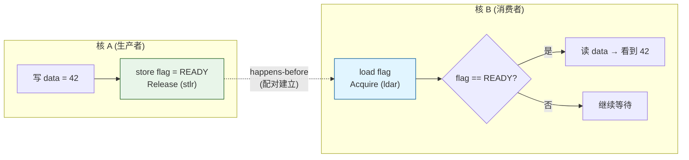
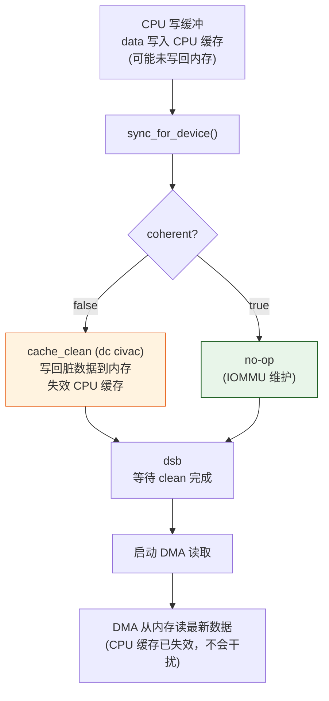
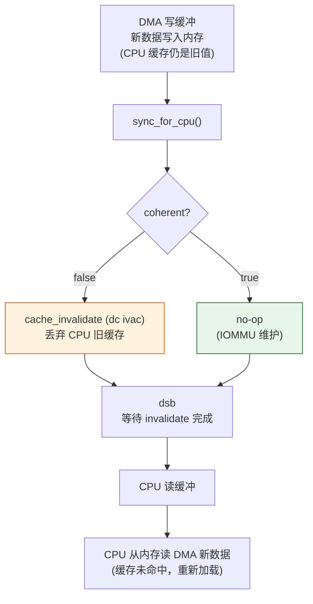

# ARMv8 内存模型技术文档

> 版本：v0.17.0 | 日期：2026-07-12 | 状态：技术参考
> 蓝图依据：`phase0.md §v0.17.0 §5`（技术交底）、`Power_Native_Agent_OS_Blueprint.md §6`（多核架构）
> 适用范围：EnerOS ARMv8 AArch64（aarch64-unknown-none）多核一致性基础理论

## 1. 概述

ARMv8 采用**弱内存模型**（weak memory model），与 x86 的强序模型（TSO）有本质
区别。在弱内存模型下，CPU 可以出于性能考虑重排内存访问顺序，导致多核程序中出现
反直觉的可见性行为。如果不显式使用内存屏障或正确的内存序，多核并发程序会产生
**难以复现的数据损坏 bug**。

EnerOS 的目标平台是 ARMv8 AArch64（`aarch64-unknown-none`），所有多核代码必须
正确处理弱内存模型。本文档作为 v0.17.0 多核内存一致性模块（`coherence.rs` /
`atomic_ops.rs` / `dma_coherent.rs`）的技术背景，解释：

- 为什么 ARMv8 是弱内存模型，与 x86 有何不同
- Rust `Ordering`（`Relaxed` / `Acquire` / `Release` / `SeqCst`）的底层指令映射
- `dmb` / `dsb` / `isb` 屏障指令的语义与使用场景
- cacheline / MESI / DMA 一致性的硬件背景
- EnerOS v0.17.0 中如何应用这些理论

本文档是**理论参考**，具体实现设计见 `docs/smp/memory-coherence-design.md`。

## 2. 弱内存模型

### 2.1 与 x86 强序模型（TSO）的对比

| 维度 | x86 TSO | ARMv8 弱内存模型 |
|------|---------|-----------------|
| Store→Load 重排 | 不允许（除 store buffer forwarding） | 允许 |
| Load→Load 重排 | 不允许 | 允许 |
| Store→Store 重排 | 不允许 | 允许 |
| Load→Store 重排 | 不允许 | 允许 |
| 可见性保证 | store 对其他核很快可见 | 不保证，需显式屏障 |
| 编程模型 | 较松，少屏障即可正确 | 严格，必须显式屏障 |
| 性能 | 较低（顺序约束多） | 较高（重排自由度大） |

x86 的 TSO（Total Store Order）允许 store buffer forwarding，但基本保证
load / store 的顺序。程序员在 x86 上常忽略内存序问题，代码「恰好正确」。
但同样的代码移植到 ARMv8 会暴露 bug。

### 2.2 ARMv8 允许的指令重排

ARMv8 允许以下重排（若无屏障）：

```
原始顺序          可能的重排
----------       ----------
Load A            Load B        ← Load-Load 可重排
Load B            Load A
----------       ----------
Load A            Store B       ← Load-Store 可重排
Store B            Load A
----------       ----------
Store A           Store B       ← Store-Store 可重排
Store B           Store A
----------       ----------
Store A           Load B        ← Store-Load 可重排（最危险）
Load B            Store A
```

**Store-Load 重排最危险**：经典的发布模式「写数据 → 写 flag」在 ARMv8 上可能
被重排为「写 flag → 写数据」，导致其他核看到 flag=ready 但读到旧数据。

### 2.3 不保证可见性

ARMv8 **不保证**核 A 的 store 立即对核 B 可见：

```
核 A:                      核 B:
store data = 42            while (flag != 1) { }   // 可能永远等不到
dmb()                      load data               // 可能读到旧值
store flag = 1
```

- 核 A 的 `store flag = 1` 不保证核 B 的 `load flag` 立即看到 1。
- 即使看到 `flag == 1`，不保证 `data` 的写也已可见（除非用 Acquire/Release
  或 dmb）。
- 缓存一致性协议（MESI）最终会传播，但「最终」不等于「立即」。

这就是 ARMv8 必须显式屏障的根本原因。

### 2.4 为什么 ARMv8 选择弱内存模型

弱内存模型让 CPU 实现有更大优化空间：

- **store buffer**：store 先入 buffer，CPU 不必等缓存写完成即可继续。
- **invalidate queue**：接收 invalidate 消息时入队，不必立即处理。
- **缓存预取**：load 可乱序执行以利用预取数据。
- **多级缓存**：跨簇 / NUMA 场景下，顺序约束代价高。

这些优化使 ARMv8 在能效比上优于强序模型，代价是程序员负担更重。

## 3. 内存序（Memory Ordering）

Rust 的 `core::sync::atomic::Ordering` 提供四种内存序，对应 ARMv8 不同指令。
EnerOS v0.17.0 使用前三种。

### 3.1 Relaxed — 仅保证原子性

```rust
self.value.fetch_add(1, Ordering::Relaxed)
```

- **保证**：操作本身原子（不撕裂，不丢计数）。
- **不保证**：与其他内存操作的顺序；对其他核的可见性时机。
- **ARMv8 指令**：`ldxr` / `stxr`（独占访问，无屏障）。
- **适用**：统计计数（如 `AtomicCounter::inc`），不读相关数据。

```rust
// 正确：仅统计调用次数
COUNTER.inc();

// 错误：依赖 inc 与 data 的顺序
COUNTER.inc();
let v = data.load();   // Relaxed 不保证 data 看到 inc 之前的写
```

### 3.2 Acquire — 保证后续读不被重排到前面

```rust
self.value.load(Ordering::Acquire)
```

- **保证**：`load` 之后的读 / 写操作不会被重排到 `load` 之前。
- **不保证**：`load` 之前的操作顺序；写可见性。
- **ARMv8 指令**：`ldar`（Load-Acquire）。
- **适用**：读 flag 后读数据，确保读到 flag=ready 后数据可见。

```rust
// 核 B：消费
if flag.load(Acquire) == READY {   // ldar
    let v = data.read();            // 保证看到发布方的写
}
```

### 3.3 Release — 保证前面写不被重排到后面

```rust
self.value.store(v, Ordering::Release)
```

- **保证**：`store` 之前的读 / 写操作不会被重排到 `store` 之后。
- **不保证**：`store` 之后的操作顺序。
- **ARMv8 指令**：`stlr`（Store-Release）。
- **适用**：写数据后写 flag，确保数据写在 flag 写之前完成。

```rust
// 核 A：发布
data.write(42);
flag.store(READY, Release);   // stlr：data 的写在 store 之前完成
```

### 3.4 Acquire / Release 配对

`store(Release)` 与 `load(Acquire)` 配对，建立 **happens-before** 关系：



**配对规则**：
- `store(Release)` ↔ `load(Acquire)` ✅ 建立 happens-before
- `store(Relaxed)` ↔ `load(Acquire)` ❌ 不建立（Relaxed 不保证前面写可见）
- `store(Release)` ↔ `load(Relaxed)` ❌ 不建立（Relaxed 不保证后面读顺序）
- `inc(Relaxed)` 不能替代 `store(Release)` ❌（inc 无 Release 语义）

### 3.5 SeqCst — 全序保证

```rust
self.value.load(Ordering::SeqCst)
```

- **保证**：所有 SeqCst 操作存在全局一致顺序（total order）。
- **最强序**：开销最大，含 `dmb ish` 效果。
- **ARMv8 指令**：`ldar` / `stlr` + `dmb ish`（SeqCst load 需额外屏障）。
- **适用**：需要全局一致顺序的场景（罕见，如某些锁算法）。

EnerOS v0.17.0 **不使用** SeqCst，因为 `Acquire` / `Release` 已满足需求且开销更小
（蓝图 §6.3 性能要求：原子 inc < 10ns，SeqCst 难以达到）。

## 4. 内存屏障指令

ARMv8 提供三个屏障指令，`coherence.rs` 全部封装。

### 4.1 DMB（Data Memory Barrier）

```
dmb ish
```

- **作用**：保证屏障**之前**的内存访问在屏障**之后**的内存访问之前完成（对指定
  Shareability 域内的所有核）。
- **不等待**：访问完成，仅禁止重排。
- **类比**：内存操作的「顺序栅栏」。

### 4.2 DSB（Data Synchronization Barrier）

```
dsb ish
```

- **作用**：等待屏障**之前**的所有内存访问**完成**后，才允许屏障**之后**的指令
  继续执行。
- **比 DMB 强**：不仅禁止重排，还等待完成。
- **类比**：内存操作的「同步点」。

| 屏障 | 顺序 | 完成等待 | 典型用途 |
|------|------|---------|---------|
| `dmb ish` | ✅ | ❌ | 发布数据可见性 |
| `dsb ish` | ✅ | ✅ | IPI 发送后、cache 维护后 |

### 4.3 ISB（Instruction Synchronization Barrier）

```
isb
```

- **作用**：刷新指令流水线，保证屏障之后取的指令反映屏障之前的内存写入。
- **不作用于数据**，只作用于指令。
- **用途**：代码 patching、JIT、修改系统寄存器后。

### 4.4 Shareability 域

屏障指令可指定作用域（Shareability domain）：

| 域 | 助记符 | 范围 | 开销 |
|----|--------|------|------|
| Non-shareable | `nsh` | 单核内 | 最小 |
| Outer Shareable | `osh` | 外部共享域（典型跨簇） | 中 |
| Inner Shareable | `ish` | 内部共享域（同簇 / 同 SoC） | 小 |
| Full System | `sy` | 全系统 | 最大 |

### 4.5 DMB ISH vs DMB SY

EnerOS v0.17.0 统一使用 `ish`（Inner Shareable）：

| 屏障 | 域 | 适用 |
|------|-----|------|
| `dmb ish` | Inner Shareable | 同 SoC 多核间（EnerOS 典型场景） |
| `dmb sy` | Full System | 跨 SoC / 与外设交互 |

**选 `ish` 的理由**：
- EnerOS 目标是单 SoC 多核（典型 4–8 核），所有核在同一个 Inner Shareable 域。
- `ish` 比 `sy` 开销小，蓝图 §6.3 性能要求（屏障 < 50ns）更易达成。
- 跨 SoC 场景（NUMA）留待真机多簇阶段再考虑 `sy`。

蓝图 §5.6 信创：标准 ARMv8 内存模型，`ish` 是合规选择。

## 5. 缓存一致性

### 5.1 Cacheline 结构

ARMv8 AArch64 标准 cacheline 大小为 **64 字节**：

```rust
pub const CACHELINE_SIZE: usize = 64;
```

cacheline 是缓存操作的最小单位。CPU 读写内存以 cacheline 为单位加载，缓存维护
指令（`dc`）也以 cacheline 为单位作用。

```
内存地址:    0x1000      0x1040      0x1080      0x10C0
             |           |           |           |
cacheline:   |  line 0   |  line 1   |  line 2   |  line 3   |
             |  64 字节   |  64 字节   |  64 字节   |  64 字节   |
```

### 5.2 MESI 协议

ARMv8 多核缓存一致性基于 MESI 协议（Modified / Exclusive / Shared / Invalid）：

| 状态 | 含义 | 可读 | 可写 | 是否独占 |
|------|------|------|------|---------|
| **M** (Modified) | 已修改，与内存不一致 | ✅ | ✅ | ✅ |
| **E** (Exclusive) | 独占，与内存一致 | ✅ | ✅ | ✅ |
| **S** (Shared) | 共享，与内存一致 | ✅ | ❌（需 invalidate 其他副本） | ❌ |
| **I** (Invalid) | 无效 | ❌ | ❌ | ❌ |

状态转换由缓存一致性协议自动维护，程序员通常不直接感知。但 DMA 等场景需手动
干预（见 §6）。

### 5.3 缓存维护指令

ARMv8 提供多种 `dc`（Data Cache）指令：

| 指令 | 全称 | 作用 | 是否写回 | 是否失效 |
|------|------|------|---------|---------|
| `dc cvac` | Clean by VA to PoC | 写回脏数据，保留缓存行 | ✅ | ❌ |
| `dc ivac` | Invalidate by VA to PoC | 丢弃缓存行（不写回） | ❌ | ✅ |
| `dc civac` | Clean + Invalidate by VA to PoC | 写回脏数据并失效 | ✅ | ✅ |
| `dc cvau` | Clean by VA to PoU | 清洗到统一性点（指令 / 数据统一） | ✅ | ❌ |
| `dc ivau` | Invalidate by VA to PoU | 失效到统一性点 | ❌ | ✅ |

**PoC vs PoU**：
- **PoC（Point of Coherency）**：所有观察者（CPU 核 + DMA）看到一致数据的点。
  用于 DMA 场景。
- **PoU（Point of Unification）**：指令 cache 与数据 cache 统一的点。
  用于代码 patching（JIT）。

### 5.4 EnerOS 的选择

EnerOS v0.17.0 使用：

- **`cache_clean`** → `dc civac`（clean + invalidate）
  - 写回脏数据 + 失效缓存行。
  - DMA 发送前调用：CPU 数据写回内存，缓存失效避免后续误读。
- **`cache_invalidate`** → `dc ivac`（invalidate only）
  - 丢弃缓存行（不写回）。
  - DMA 接收后调用：丢弃旧缓存，强制从内存重读。

**为什么 `cache_clean` 用 `civac` 而非 `cvac`**：
- DMA 场景下，clean 后 CPU 不再需要该缓存副本（缓冲已交给 DMA）。
- 同时 invalidate 避免后续 CPU 误读到旧缓存（clean 后缓存内容仍存在，只是已写回）。
- 这是有意的「clean + invalidate」组合，函数名 `cache_clean` 沿用蓝图命名。

### 5.5 对齐要求

缓存维护**必须**按 cacheline 边界对齐：

```rust
let line = CACHELINE_SIZE as u64;
let start = addr & !(line - 1);                                    // 向下对齐
let end = (addr + size as u64 + line - 1) & !(line - 1);            // 向上扩展
```

**不对齐的后果**：
- 若 `addr` 不在 cacheline 边界，`dc` 指令会作用于整条 line，误伤同 line 内
  相邻数据。
- 若 `addr + size` 不在边界，end 侧的 line 会被部分操作，可能导致相邻数据丢失。

详见 `docs/smp/memory-coherence-design.md` §4 的对齐算法验证。

## 6. DMA 与缓存

### 6.1 一致性 DMA

**一致性 DMA**（coherent DMA）：平台有 IOMMU / SMMU 或一致性 interconnect，
硬件自动维护 CPU 缓存与 DMA 之间的数据一致性。

- `DmaBuffer.coherent = true`
- `sync_for_device` / `sync_for_cpu` 为 no-op
- 程序员无需手动 clean / invalidate

**典型场景**：服务器级 SoC（带 SMMU）、PCIe 设备（通常一致）。

### 6.2 非一致性 DMA

**非一致性 DMA**（non-coherent DMA）：DMA 控制器绕过 CPU 缓存，直接访问内存。
CPU 缓存中的脏数据可能与内存不一致，需手动维护。

- `DmaBuffer.coherent = false`
- `sync_for_device`：`cache_clean`（写回脏数据）
- `sync_for_cpu`：`cache_invalidate`（丢弃旧缓存）

**典型场景**：嵌入式 SoC（无 IOMMU）、部分 AXI DMA、SD/MMC 控制器。

### 6.3 DMA 发送流程（CPU → DMA 读）



**关键点**：若不做 `cache_clean`，DMA 可能从内存读到旧值（CPU 缓存中的新数据
未写回）。

### 6.4 DMA 接收流程（DMA → CPU 读）



**关键点**：若不做 `cache_invalidate`，CPU 可能从缓存读到旧值（DMA 写的新数据
在内存但缓存未更新）。

### 6.5 完整 DMA 收发序列

```rust
let mut buf = DmaBuffer {
    phys: 0x4000_0000,
    virt: buffer_ptr,
    size: 4096,
    coherent: false,   // 非一致性
};

// === 发送：CPU → DMA ===
write_data(buf.virt, &payload);   // CPU 写缓冲
buf.sync_for_device();            // cache_clean：写回脏数据
start_dma_tx(buf.phys, buf.size); // 启动 DMA 发送
wait_dma_done();

// === 接收：DMA → CPU ===
start_dma_rx(buf.phys, buf.size); // 启动 DMA 接收
wait_dma_done();
buf.sync_for_cpu();                // cache_invalidate：丢弃旧缓存
let data = read_data(buf.virt);    // CPU 读新数据
```

## 7. 常见陷阱

### 7.1 Relaxed 不配对 Acquire/Release

**错误**：

```rust
// 核 A
data.write(42);
flag.store(1, Ordering::Relaxed);   // ❌ Relaxed 不保证 data 写可见

// 核 B
if flag.load(Ordering::Acquire) == 1 {   // 即使读到 1
    let v = data.read();                  // ❌ 可能读到旧值
}
```

**正确**：

```rust
// 核 A
data.write(42);
flag.store(1, Ordering::Release);   // ✅ Release 保证 data 写在 store 前

// 核 B
if flag.load(Ordering::Acquire) == 1 {   // ✅ Acquire 建立 happens-before
    let v = data.read();                  // ✅ 看到 42
}
```

蓝图 §8.5 坑点：`Relaxed` 顺序不保证可见性，需配对使用 Acquire/Release。

### 7.2 遗漏 DMB 导致多核数据损坏

**错误**：

```rust
// 核 A
shared_data.value = 42;
// ❌ 缺少 dmb()
flag.store(1, Ordering::Relaxed);   // 可能被重排到 value 写之前
```

**症状**：多核并发时偶发性数据损坏，**难复现**（蓝图 §8.1 风险：高 / 高）。
在 x86 上「恰好正确」（TSO 保证 Store-Store 不重排），移植到 ARMv8 暴露 bug。

**正确**：

```rust
shared_data.value = 42;
dmb();                                // ✅ 保证 value 写在 flag 写之前
flag.store(1, Ordering::Relaxed);
```

或用 `Release`：

```rust
shared_data.value = 42;
flag.store(1, Ordering::Release);     // ✅ Release 含 dmb 效果
```

### 7.3 部分 cacheline 操作导致数据不一致

**错误**：

```rust
// ❌ 地址未对齐到 cacheline 边界
dc civac, 0x1040   // 作用于整条 line 0x1000-0x103F
                    // 误伤同 line 内 0x1000-0x103F 的数据
```

**症状**：相邻数据被意外 invalidate 或 clean，导致数据丢失或读到旧值。

**正确**：按 cacheline 边界对齐（向下对齐 start，向上扩展 end）：

```rust
let line = 64;
let start = addr & !(line - 1);                              // ✅ 0x1000
let end = (addr + size + line - 1) & !(line - 1);             // ✅ 覆盖完整 line
```

### 7.4 DMA 缓冲未对齐到 cacheline

**错误**：

```rust
// ❌ 缓冲地址 0x1004，未对齐到 cacheline
let buf = DmaBuffer { phys: 0x1004, virt: 0x1004 as *mut u8, size: 100, ... };
```

**症状**：`cache_clean` / `cache_invalidate` 会扩展到完整 cacheline，误操作
相邻内存（0x1000-0x103F 的非 DMA 数据被 invalidate 丢失）。

**正确**：DMA 缓冲地址与大小都应对齐到 cacheline（64 字节）边界：

```rust
// ✅ 缓冲分配时即对齐
let buf = alloc_aligned(4096, 64);   // 4KB 缓冲，64 字节对齐
```

### 7.5 陷阱汇总

| 陷阱 | 后果 | 检测难度 | 预防 |
|------|------|---------|------|
| Relaxed 不配对 | 可见性问题 | 难（偶发） | 用 Acquire/Release 配对 |
| 遗漏 DMB | 数据损坏 | 难（偶发） | 发布模式显式 dmb |
| 部分 cacheline 操作 | 相邻数据丢失 | 中 | 按 cacheline 对齐 |
| DMA 缓冲未对齐 | 相邻内存误操作 | 中 | 缓冲 64 字节对齐 |
| invalidate 脏数据 | 丢失未写回的写 | 易（数据丢） | invalidate 前确保无脏数据 |

## 8. EnerOS 中的应用

### 8.1 v0.17.0 coherence.rs 的屏障封装

`coherence.rs` 提供三个屏障函数，对应本文档 §3、§4：

```rust
// crates/kernel/smp/src/coherence.rs
pub fn dmb()   // dmb ish — 内存顺序屏障（Inner Shareable）
pub fn dsb()   // dsb ish — 内存同步屏障（等待完成）
pub fn isb()   // isb — 指令流水线刷新
```

- 全部用 `ish` 域（§4.4），适合单 SoC 多核场景。
- `options(nostack, preserves_flags, readonly)` 让编译器有最大优化空间。
- host 侧 no-op（cfg gate），保证可测试。

### 8.2 v0.17.0 atomic_ops.rs 的内存序

`AtomicCounter` 使用本文档 §3 的内存序：

```rust
// crates/kernel/smp/src/atomic_ops.rs
pub fn inc(&self) -> u64 {
    self.value.fetch_add(1, Ordering::Relaxed) + 1   // §3.1 仅原子性
}
pub fn load(&self) -> u64 {
    self.value.load(Ordering::Acquire)                // §3.2 ldar
}
pub fn store(&self, v: u64) {
    self.value.store(v, Ordering::Release)            // §3.3 stlr
}
```

- `inc(Relaxed)` ↔ `load(Acquire)` 配对（§3.4），用于统计计数。
- `store(Release)` ↔ `load(Acquire)` 配对，用于发布模式。
- **不使用** SeqCst（§3.5），开销过大。

### 8.3 v0.17.0 dma_coherent.rs 的缓存策略

`DmaBuffer` 实现本文档 §6 的 DMA 一致性流程：

```rust
// crates/kernel/smp/src/dma_coherent.rs
pub fn sync_for_device(&self) {
    if !self.coherent {
        cache_clean(self.virt as u64, self.size);   // §6.3 dc civac
    }
}
pub fn sync_for_cpu(&self) {
    if !self.coherent {
        cache_invalidate(self.virt as u64, self.size);  // §6.4 dc ivac
    }
}
```

- `coherent=true` → no-op（§6.1 IOMMU）
- `coherent=false` → 手动 clean / invalidate（§6.2 嵌入式）

### 8.4 与 v0.15.0 IPI 的关系

`ipi.rs` 的 `ipi_send` 写 `icc_sgi1r_el1` 触发 SGI。按本文档 §4.2，SGI 写后
应加 `dsb` 确保中断信号已发出：

```rust
// 未来集成（v0.17.0 之后）
ipi_send(target, msg);
dsb();   // 确保 SGI 信号已发出
```

v0.15.0 暂未加 `dsb`（解耦考虑），v0.17.0 提供 `dsb()` 后可补齐。

### 8.5 与 v0.16.0 调度器自旋锁的关系

`eneros-sched` 的 `Spinlock`（`sched/src/percore.rs`）已使用正确内存序：

```rust
// crates/kernel/sched/src/percore.rs
lock:   compare_exchange_weak(false, true, Acquire, Relaxed)   // §3.2 ldar
unlock: store(false, Release)                                     // §3.3 stlr
```

`Release` unlock 保证临界区内的写在锁释放前完成（§3.3），
`Acquire` lock 保证后续读看到持锁者的写（§3.2）。

v0.17.0 不修改 `eneros-sched`，但 `coherence.rs` 的 `dmb()` 可作为自旋锁的
底层屏障替代（未来若需更细粒度控制）。蓝图 §3317「v0.16.0 调度依赖；
v0.17.0 一致性依赖」是逻辑依赖，非代码修改。

### 8.6 未来应用

| 版本 | 应用 | 依赖 |
|------|------|------|
| v0.18.0 线程抽象 | TCB 跨核迁移的 cache 同步 | `cache_clean` / `cache_invalidate` |
| v0.20.0 IPC | 共享内存消息可见性 | `dmb` / `dsb` |
| v0.21.0 SPSC ring | head / tail 指针原子操作 | `AtomicCounter`（Acquire/Release） |
| 未来 TLB shootdown | 页表更新后 TLB 刷新 | `dsb` + `tlbi` + `dsb` |

## 9. 参考资料

### 9.1 官方文档

| 文档 | 章节 | 内容 |
|------|------|------|
| ARM Architecture Reference Manual (ARMv8) | B2 | 内存模型概述 |
| ARM Architecture Reference Manual (ARMv8) | B3 | AArch64 内存模型细节 |
| ARM Architecture Reference Manual (ARMv8) | D5 | 内存屏障指令（dmb/dsb/isb） |
| ARM Architecture Reference Manual (ARMv8) | D6 | 缓存维护指令（dc/ic） |
| ARM Architecture Reference Manual (ARMv8) | D19 | GICv3（含 ICC_SGI1R_EL1） |
| ARM Cortex-A Series Programmer's Guide | Ch.10 | 多核与缓存一致性 |

### 9.2 Rust 参考

| 文档 | 内容 |
|------|------|
| Rust Reference — Atomic Operations | `core::sync::atomic::Ordering` 语义 |
| Rustonomicon — Atomics | 原子操作与内存模型 |
| Rust embedded book | `asm!` 与 inline assembly |

### 9.3 EnerOS 内部文档

| 文档 | 内容 |
|------|------|
| `docs/smp/memory-coherence-design.md` | v0.17.0 一致性设计（本文档的实现配套） |
| `docs/smp/multi-core-scheduler-design.md` | v0.16.0 调度器（自旋锁 Acquire/Release） |
| `docs/smp/ipi-mechanism.md` | v0.15.0 IPI（SGI 发送后需 dsb） |
| `docs/smp/smp-boot-design.md` | v0.15.0 多核启动 |
| `蓝图/phase0.md §v0.17.0 §5` | 技术交底（显式屏障 / Acquire-Release / 实现路径） |
| `蓝图/Power_Native_Agent_OS_Blueprint.md §6` | 多核架构 |
| `蓝图/Power_Native_Agent_OS_Blueprint.md §43.1` | no_std 合规 |

### 9.4 关键概念速查

| 概念 | ARMv8 实现 | EnerOS 封装 |
|------|-----------|-------------|
| Relaxed 原子 | `ldxr` / `stxr` | `AtomicCounter::inc` |
| Acquire 读 | `ldar` | `AtomicCounter::load` |
| Release 写 | `stlr` | `AtomicCounter::store` |
| 内存顺序屏障 | `dmb ish` | `coherence::dmb` |
| 内存同步屏障 | `dsb ish` | `coherence::dsb` |
| 指令屏障 | `isb` | `coherence::isb` |
| Cache clean+inv | `dc civac` | `coherence::cache_clean` |
| Cache invalidate | `dc ivac` | `coherence::cache_invalidate` |
| Cacheline 大小 | 64 字节 | `coherence::CACHELINE_SIZE` |
| DMA 一致性 | 软件或 IOMMU | `dma_coherent::DmaBuffer` |

---

> **相关文档**：
> - `docs/smp/memory-coherence-design.md` — v0.17.0 一致性实现设计（本文档的理论配套）
> - `docs/smp/multi-core-scheduler-design.md` — v0.16.0 调度器（自旋锁应用 Acquire/Release）
> - `docs/smp/ipi-mechanism.md` — v0.15.0 IPI（SGI 发送后需 dsb）
