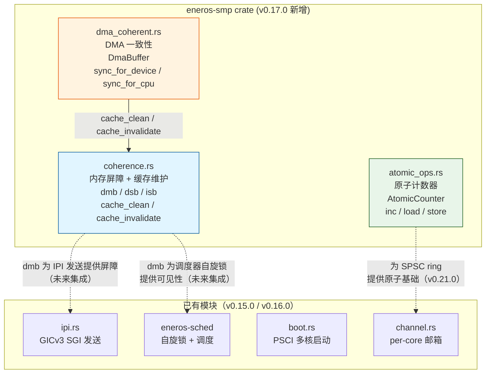
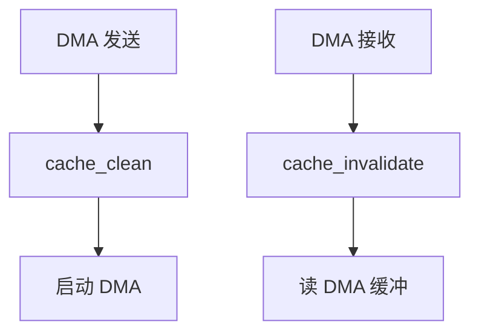
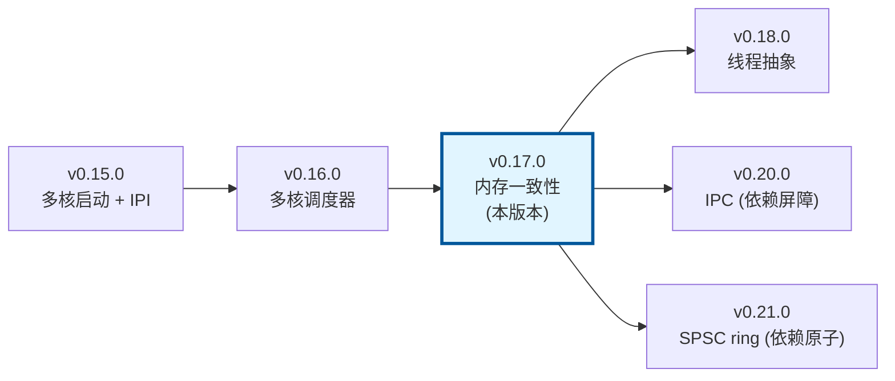

# EnerOS 多核内存一致性设计

> 版本：v0.17.0 | 日期：2026-07-12 | 状态：设计文档
> 蓝图依据：`phase0.md §v0.17.0`（多核内存一致性，蓝图第 3696–3891 行）、`Power_Native_Agent_OS_Blueprint.md §6`（多核架构）、§43.1（no_std 合规）、§43.2（瓶颈版本骨架可用）
> 实现位置：`crates/kernel/smp/src/` 下的 `coherence.rs` / `atomic_ops.rs` / `dma_coherent.rs`

## 1. 概述

EnerOS 多核内存一致性模块是 Phase 0 P0-E（多核 SMP）的**终点交付物**，使多核能力
形成闭环。在 v0.15.0（多核启动 + IPI）与 v0.16.0（多核调度器）解决了「核能跑起来」
与「任务能跨核调度」之后，v0.17.0 解决「核间数据看得见、读得对」这一正确性前提：
没有内存一致性，多核并发数据会损坏，前面两个版本的所有工作都会建立在沙地上。

v0.17.0 在 `eneros-smp` crate 中新增 3 个模块：

- **`coherence.rs`** — 内存屏障（`dmb` / `dsb` / `isb`）与缓存维护操作
  （`cache_clean` / `cache_invalidate`），对应蓝图 §4.5 关键代码片段。
- **`atomic_ops.rs`** — `AtomicCounter` 原子计数器，封装 `core::sync::atomic::AtomicU64`，
  提供 `Relaxed` 自增与 `Acquire` / `Release` 读写。
- **`dma_coherent.rs`** — `DmaBuffer` DMA 一致性管理，根据 `coherent` 标志决定
  是否手动 clean / invalidate 缓存。

本版本的目标与范围：

- **内存屏障语义**：在 ARMv8 弱内存模型下，提供 `dmb ish` / `dsb ish` / `isb` 的
  Rust 安全封装，保证多核间内存访问顺序与可见性。
- **缓存维护**：按 64 字节 cacheline 边界对齐，提供 `cache_clean`（`dc civac`）
  与 `cache_invalidate`（`dc ivac`），服务于 DMA 与未来 TLB shootdown。
- **原子计数器**：提供配对正确的 `inc(Relaxed)` / `load(Acquire)` / `store(Release)`
  原语，作为未来 v0.21.0 SPSC ring 的基础。
- **DMA 一致性**：在非一致性 DMA 平台上自动执行 clean / invalidate，在一致性平台
  （IOMMU）上 no-op，屏蔽硬件差异。

本版本**不**包含的能力（明确标注为「未来扩展」，见 §7）：

- TLB shootdown 的实际使用（依赖 v0.18.0+ MMU 虚拟化）
- 真机多核并发 stress test（host 侧仅验证逻辑不 panic，需 QEMU/真机）
- RISC-V 弱内存模型支持（仅 ARMv8）

crate 顶层属性 `#![cfg_attr(not(test), no_std)]` 遵循蓝图 §43.1；所有 `asm!` 调用
通过 `#[cfg(target_arch = "aarch64")]` 门控，host 侧为 no-op，保证可在 x86_64 host
上跑单元测试。详细内存模型背景另见 `docs/smp/armv8-memory-model.md`。

## 2. 架构设计

### 2.1 模块关系图

三个模块在 `eneros-smp` crate 中的依赖与职责关系如下：



### 2.2 分层职责

| 模块 | 层级 | 职责 | 依赖 |
|------|------|------|------|
| `coherence.rs` | 底层原语 | 直接 `asm!` 调用，零依赖 | `core::arch::asm` |
| `atomic_ops.rs` | 中层抽象 | 封装 `AtomicU64`，提供语义化 API | `core::sync::atomic` |
| `dma_coherent.rs` | 上层应用 | 组合 `coherence` 的缓存操作，管理 DMA 缓冲 | `crate::coherence` |

`dma_coherent.rs` 是唯一有内部依赖的模块（`use crate::coherence::{cache_clean, cache_invalidate}`），
`atomic_ops.rs` 完全独立，`coherence.rs` 是最底层。这种分层确保未来若要替换缓存实现
（如改用 `eneros-hal` 的 cache 接口），只需调整 `dma_coherent.rs` 的依赖指向。

### 2.3 与已有模块的解耦

三个新模块**不**修改 v0.15.0 / v0.16.0 的任何代码（蓝图 §6.4 回归要求）：
- 不修改 `ipi.rs`（IPI 发送后的 `dsb` 由调用方在未来版本补齐，见 §7.3）
- 不修改 `boot.rs` / `channel.rs`
- 不修改 `eneros-sched` 的 `Spinlock`

解耦的好处：v0.17.0 可以独立编译、独立测试、独立合入，不引入回归风险。

## 3. 内存屏障语义

ARMv8 是弱内存模型（weak memory model），CPU 可以重排内存访问以提升性能。屏障指令
用于在需要的点上禁止重排，保证多核间的可见性顺序。本节描述 `coherence.rs` 中
三个屏障函数的语义与使用场景。

### 3.1 DMB（Data Memory Barrier）— Inner Shareable

```rust
// crates/kernel/smp/src/coherence.rs
#[inline]
#[cfg(target_arch = "aarch64")]
pub fn dmb() {
    unsafe {
        core::arch::asm!("dmb ish", options(nostack, preserves_flags, readonly));
    }
}

#[inline]
#[cfg(not(target_arch = "aarch64"))]
pub fn dmb() {}
```

**语义**：`dmb ish`（Inner Shareable）保证屏障**之前**的所有内存访问（load/store）
在屏障**之后**的任何内存访问之前，对 Inner Shareable 域内的所有核可见。

- **不等待**访问完成，仅保证顺序。
- **ish 域**：覆盖同一个 Inner Shareable 域（典型为同一个簇 / 同一个 SoC 内的核），
  比 `dmb sy`（Full System）开销小。
- **`options`**：`nostack`（不修改栈）、`preserves_flags`（不修改条件标志）、
  `readonly`（不写内存），让编译器有最大优化空间。

**使用场景**：多核共享数据发布。例如先写数据，再 `dmb()`，再写就绪标志，
确保其他核看到就绪标志时也能看到数据。

```rust
// 发布模式：数据可见性
unsafe { (*shared_data).value = 42; }
dmb();                                  // 保证 value 写入先于 flag 写入
flag.store(1, Ordering::Relaxed);       // 发布
```

### 3.2 DSB（Data Synchronization Barrier）— Inner Shareable

```rust
#[inline]
#[cfg(target_arch = "aarch64")]
pub fn dsb() {
    unsafe {
        core::arch::asm!("dsb ish", options(nostack, preserves_flags, readonly));
    }
}
```

**语义**：`dsb ish` 等待屏障**之前**的所有内存访问**完成**后，才允许屏障**之后**
的指令继续执行。比 `dmb` 更强：

| 屏障 | 强度 | 行为 |
|------|------|------|
| `dmb ish` | 顺序保证 | 不等待完成，仅禁止重排 |
| `dsb ish` | 完成等待 | 等待之前所有访问完成 |

**使用场景**：
- **IPI 发送后**：写 `icc_sgi1r_el1` 触发 SGI 后，需要 `dsb` 确保中断信号已发出。
- **cache 维护后**：`cache_clean` / `cache_invalidate` 末尾调用 `dsb()`，确保
  cache 操作完成后再继续（见 §4）。
- **系统寄存器写后**：如配置 GIC Redistributor 后等待生效。

### 3.3 ISB（Instruction Synchronization Barrier）

```rust
#[inline]
#[cfg(target_arch = "aarch64")]
pub fn isb() {
    unsafe {
        core::arch::asm!("isb", options(nostack, preserves_flags, readonly));
    }
}
```

**语义**：`isb` 刷新指令流水线，保证屏障之后取的指令反映屏障之前的任何内存写入
（如代码 patching、修改指令后立即执行）。

- **不作用于数据**，只作用于指令。
- **典型场景**：JIT / 代码热更新后，确保 CPU 取到新指令；修改系统寄存器
  `sctlr_el1` 后刷新流水线。

```rust
// 代码更新后刷新流水线
update_code(addr, new_instr);
dmb();      // 数据屏障：保证写入对其他核可见
isb();      // 指令屏障：本核重新取指
```

### 3.4 屏障使用场景汇总

| 场景 | 屏障 | 理由 |
|------|------|------|
| 多核共享数据发布 | `dmb` | 保证数据写在 flag 写之前 |
| 自旋锁释放 | `store(Release)` | Release 语义含 dmb 效果 |
| IPI 发送后 | `dsb` | 确保中断信号已发出 |
| cache 维护后 | `dsb` | 等待 cache 操作完成 |
| 代码更新后 | `dmb` + `isb` | 数据可见 + 指令刷新 |
| MMU 页表更新后 | `dsb` + `tlbi` + `dsb` | 页表生效 + TLB 刷新（未来） |

## 4. 缓存维护操作

### 4.1 Cacheline 对齐策略

ARMv8 AArch64 标准 cacheline 大小为 **64 字节**。缓存维护操作必须按 cacheline 边界
对齐，否则会污染相邻数据。

```rust
/// Cacheline size in bytes (ARMv8 AArch64 standard).
pub const CACHELINE_SIZE: usize = 64;
```

`CACHELINE_SIZE` 通过 `lib.rs` re-export，供 `dma_coherent.rs` 及外部使用方引用。
对齐算法如下（向下对齐 start，向上扩展 end）：

```rust
let line = CACHELINE_SIZE as u64;          // 64
let start = addr & !(line - 1);            // 向下对齐到 cacheline 边界
let end = (addr + size as u64 + line - 1) & !(line - 1);  // 向上扩展到完整 cacheline
```

**算法说明**：

- `!(line - 1)` 生成掩码 `0xFFFF_FFFF_FFFF_FFC0`（低 6 位为 0）。
- `addr & !(line - 1)`：将 `addr` 向下取整到最近的 cacheline 起点。
  - 例：`addr = 0x1040`，`start = 0x1000`（覆盖 0x1000–0x103F 这条 line）。
- `(addr + size + line - 1) & !(line - 1)`：将 `addr + size` 向上取整到 cacheline 边界。
  - 例：`addr = 0x1040, size = 0x80`，`end = (0x1040 + 0x80 + 0x3F) & ~0x3F = 0x10C0`。
  - 覆盖 0x1000–0x10BF 共 3 条 cacheline。

**为什么必须整行操作**：`dc` 指令以 cacheline 为单位。若只对部分 line 操作，
会误伤同 line 内的相邻数据（cache 操作无法只作用于 line 内的若干字节）。

### 4.2 cache_clean（dc civac）

```rust
pub fn cache_clean(addr: u64, size: usize) {
    let line = CACHELINE_SIZE as u64;
    let start = addr & !(line - 1);
    let end = (addr + size as u64 + line - 1) & !(line - 1);
    let mut a = start;
    while a < end {
        clean_line(a);
        a += line;
    }
    dsb();
}

#[cfg(target_arch = "aarch64")]
#[inline]
fn clean_line(addr: u64) {
    unsafe {
        core::arch::asm!("dc civac, {}", in(reg) addr, options(nostack, preserves_flags, readonly));
    }
}
```

**指令**：`dc civac`（Data Cache Clean + Invalidate by VA to PoC）。

- **作用**：将该 cacheline 的脏数据写回内存，**并**使该 line 失效（丢弃缓存副本）。
- **PoC（Point of Coherency）**：清洗到一致性点，确保所有观察者（包括 DMA 控制器）
  能看到最新数据。
- **末尾 `dsb()`**：等待所有 clean 操作完成。
- **DMA 发送前调用**：CPU 写完缓冲后，`cache_clean` 把脏数据写回内存，DMA 控制器
  从内存读到最新数据。

> **实现说明**：函数名为 `cache_clean`，但底层用 `dc civac`（clean + invalidate），
> 而非纯 `dc cvac`（clean only）。这是 DMA 场景的有意选择：clean 后 CPU 不再需要
> 该缓存副本（缓冲已交给 DMA），同时 invalidate 避免后续 CPU 误读到旧缓存。
> 详见 `docs/smp/armv8-memory-model.md` §5 对 `cvac` / `ivac` / `civac` 的区分。

### 4.3 cache_invalidate（dc ivac）

```rust
pub fn cache_invalidate(addr: u64, size: usize) {
    let line = CACHELINE_SIZE as u64;
    let start = addr & !(line - 1);
    let end = (addr + size as u64 + line - 1) & !(line - 1);
    let mut a = start;
    while a < end {
        invalidate_line(a);
        a += line;
    }
    dsb();
}

#[cfg(target_arch = "aarch64")]
#[inline]
fn invalidate_line(addr: u64) {
    unsafe {
        core::arch::asm!("dc ivac, {}", in(reg) addr, options(nostack, preserves_flags, readonly));
    }
}
```

**指令**：`dc ivac`（Data Cache Invalidate by VA to PoC）。

- **作用**：丢弃该 cacheline 的缓存副本，不写回脏数据。
- **DMA 接收后调用**：DMA 控制器已把数据写入内存，但 CPU 缓存可能仍是旧值。
  `cache_invalidate` 强制 CPU 下次读时从内存重新加载。

> **注意**：`invalidate` 会丢弃缓存中的脏数据（未写回）。调用前必须确保缓存中
> 没有需要保留的脏数据。DMA 接收场景满足这一前提：缓冲已交给 DMA，CPU 不应
> 在此期间写它。

### 4.4 对齐算法验证

以 `addr=0x1040, size=0x80` 为例（横跨 3 条 cacheline）：

```
cacheline 边界:  0x1000      0x1040      0x1080      0x10C0
                 |-----------|-----------|-----------|
                 |  line 0   |  line 1   |  line 2   |
                 |           |<-- size -->|           |
                              ^addr

start = 0x1040 & ~0x3F = 0x1000       (向下对齐到 line 0 起点)
end   = (0x1040 + 0x80 + 0x3F) & ~0x3F = 0x10C0  (向上扩展到 line 2 终点)
覆盖: 0x1000 – 0x10BF (line 0, 1, 2)
```

主机测试 `test_cache_clean_host_noop` 与 `test_cache_invalidate_host_noop` 验证
此算法在 host 上不 panic（host 侧 `clean_line` / `invalidate_line` 为 no-op，
但循环与对齐逻辑仍执行）。

## 5. 原子计数器

### 5.1 AtomicCounter 封装

```rust
// crates/kernel/smp/src/atomic_ops.rs
use core::sync::atomic::{AtomicU64, Ordering};

#[derive(Debug)]
pub struct AtomicCounter {
    value: AtomicU64,
}

impl AtomicCounter {
    pub const fn new(v: u64) -> Self {
        Self { value: AtomicU64::new(v) }
    }
    pub fn inc(&self) -> u64 {
        self.value.fetch_add(1, Ordering::Relaxed) + 1
    }
    pub fn load(&self) -> u64 {
        self.value.load(Ordering::Acquire)
    }
    pub fn store(&self, v: u64) {
        self.value.store(v, Ordering::Release);
    }
}
```

`AtomicCounter` 是 `AtomicU64` 的薄封装，提供语义化的 `inc` / `load` / `store`
接口。在 aarch64 上，`AtomicU64` 的 `fetch_add` 使用 `ldxr` / `stxr` 独占访问，
`load(Acquire)` / `store(Release)` 使用 `ldar` / `stlr` 指令。

### 5.2 内存序选择

| 操作 | Ordering | 语义 | 指令 | 适用场景 |
|------|----------|------|------|---------|
| `inc` | `Relaxed` | 仅保证原子性，无顺序 / 可见性 | `ldxr` / `stxr` | 统计计数（不读相关数据） |
| `load` | `Acquire` | 后续读操作不被重排到前面 | `ldar` | 读取共享状态 |
| `store` | `Release` | 前面写操作不被重排到后面 | `stlr` | 发布共享状态 |

**`inc` 用 `Relaxed` 的理由**：

- 计数器自增本身只需原子性（不丢计数），不需要与其他内存操作建立顺序。
- `Relaxed` 开销最小（蓝图 §6.3 性能要求：原子 inc < 10ns）。
- 若需要读取计数器后的相关数据，应配对 `load(Acquire)`，而非依赖 `inc` 的顺序。

**`load` 用 `Acquire` 的理由**：

- 保证 `load` 之后的读操作不会被重排到 `load` 之前。
- 典型场景：读 flag 后读数据，`Acquire` 确保读到 flag=ready 后，数据读取看到
  发布方的写。

**`store` 用 `Release` 的理由**：

- 保证 `store` 之前的写操作不会被重排到 `store` 之后。
- 典型场景：写数据后写 flag=ready，`Release` 确保数据写在 flag 写之前完成。

### 5.3 配对规则：store(Release) ↔ load(Acquire)

```rust
// 核 A：发布
data.write(42);
counter.store(1);      // Release：data 的写在 store 之前完成

// 核 B：消费
if counter.load() == 1 {   // Acquire：load 之后的读看到 store 之前的数据
    let v = data.read();   // 保证看到 42
}
```

**配对规则**：

- `store(Release)` 与 `load(Acquire)` 是配对的，建立 happens-before 关系。
- **不能**用 `store(Relaxed)` 配对 `load(Acquire)`：`Relaxed` store 不保证前面
  写的可见性，`Acquire` load 也无法建立 happens-before。
- **不能**用 `inc(Relaxed)` 替代 `store(Release)`：`inc` 不提供 Release 语义，
  若需发布应显式 `store`。

详见蓝图 §8.5 坑点：`Relaxed` 顺序不保证可见性，需配对使用 Acquire / Release。
内存序的完整背景见 `docs/smp/armv8-memory-model.md` §3。

### 5.4 const fn 与零依赖

`AtomicCounter::new` 是 `const fn`，可在 `static` 上下文中使用：

```rust
use eneros_smp::AtomicCounter;

static GLOBAL_COUNTER: AtomicCounter = AtomicCounter::new(0);

fn handler() {
    GLOBAL_COUNTER.inc();
}
```

`atomic_ops.rs` 仅依赖 `core::sync::atomic`，零外部依赖，符合 `eneros-smp` 的
D2 设计决策（与 `eneros-sched` 一致）。

## 6. DMA 一致性流程

### 6.1 DmaBuffer 结构

```rust
// crates/kernel/smp/src/dma_coherent.rs
use crate::coherence::{cache_clean, cache_invalidate};

#[derive(Debug)]
pub struct DmaBuffer {
    pub phys: u64,        // 物理地址（DMA 控制器编程用）
    pub virt: *mut u8,    // 虚拟地址（CPU 访问用）
    pub size: usize,      // 缓冲大小
    pub coherent: bool,   // 平台是否硬件维护一致性
}
```

`DmaBuffer` 持有 raw pointer（`*mut u8`），**不是** `Send` / `Sync`，跨核传递的
安全性由调用方负责（蓝图 §4.1 注释明确）。这是有意的：DMA 缓冲的跨核共享涉及
所有权语义，未来在 v0.18.0 线程抽象后再封装安全的传递接口。

### 6.2 coherent 标志

| `coherent` | 平台特性 | sync 操作 |
|------------|---------|-----------|
| `true` | 硬件 IOMMU / 一致性 interconnect | no-op（硬件自动维护） |
| `false` | 非一致性 DMA（典型嵌入式 SoC） | 手动 `cache_clean` / `cache_invalidate` |

调用方在构造 `DmaBuffer` 时根据 SoC 能力设置 `coherent`。典型 ARMv8 边缘设备
（无 IOMMU）应设 `false`；带 SMMU 的服务器级 SoC 可设 `true`。

### 6.3 sync_for_device（CPU → DMA）

```rust
impl DmaBuffer {
    pub fn sync_for_device(&self) {
        if !self.coherent {
            cache_clean(self.virt as u64, self.size);
        }
    }
}
```

**语义**：CPU 写完缓冲后，DMA 读前调用。`cache_clean` 把 CPU 缓存中的脏数据
写回内存，使 DMA 控制器从内存读到最新数据。

### 6.4 sync_for_cpu（DMA → CPU）

```rust
impl DmaBuffer {
    pub fn sync_for_cpu(&self) {
        if !self.coherent {
            cache_invalidate(self.virt as u64, self.size);
        }
    }
}
```

**语义**：DMA 写完缓冲后，CPU 读前调用。`cache_invalidate` 丢弃 CPU 缓存中的
旧副本，使 CPU 下次读时从内存重新加载 DMA 写入的新数据。

### 6.5 完整流程图

```mermaid
flowchart TD
    subgraph "DMA 发送流程 (CPU → DMA 读)"
        A1[CPU 写缓冲数据] --> A2["DmaBuffer.sync_for_device()"]
        A2 --> A3{"coherent?"}
        A3 -->|false| A4["cache_clean (dc civac)<br/>写回脏数据 + 失效缓存"]
        A3 -->|true| A5["no-op (IOMMU 维护)"]
        A4 --> A6["dsb (在 cache_clean 内)"]
        A5 --> A6
        A6 --> A7[启动 DMA 读取]
        A7 --> A8[DMA 从内存读最新数据]
    end

    subgraph "DMA 接收流程 (DMA → CPU 读)"
        B1[DMA 写缓冲数据到内存] --> B2["DmaBuffer.sync_for_cpu()"]
        B2 --> B3{"coherent?"}
        B3 -->|false| B4["cache_invalidate (dc ivac)<br/>丢弃 CPU 旧缓存"]
        B3 -->|true| B5["no-op (IOMMU 维护)"]
        B4 --> B6["dsb (在 cache_invalidate 内)"]
        B5 --> B6
        B6 --> B7[CPU 读缓冲]
        B7 --> B8[CPU 从内存读 DMA 新数据]
    end

    style A4 fill:#fff3e0,stroke:#e65100
    style B4 fill:#fff3e0,stroke:#e65100
    style A5 fill:#e8f5e9,stroke:#1b5e20
    style B5 fill:#e8f5e9,stroke:#1b5e20
```



### 6.6 与蓝图 §4.3 流程图对齐

蓝图 §4.3 给出的核心流程与本节一致：



实现将 `cache_flush` 细化为 `cache_clean`（蓝图接口名为 `cache_flush`，实现
命名为 `cache_clean` 以更准确反映 `dc civac` 语义，蓝图 §4.5 注释「clean+invalidate」）。

## 7. 与调度器 / IPI 的关系

### 7.1 v0.16.0 调度器自旋锁

`eneros-sched` 的 `Spinlock`（`sched/src/percore.rs`）已使用 `Acquire` / `Release`
序：

- `lock`：`compare_exchange_weak(false, true, Acquire, Relaxed)`
- `unlock`：`store(false, Release)`

`Release` unlock 保证临界区内的写在锁释放前完成，`Acquire` lock 保证后续读看到
持锁者的写。**v0.17.0 不修改 `eneros-sched`**，但 `coherence.rs` 的 `dmb()` 可作为
`Spinlock` 的底层屏障替代（未来若需更细粒度控制）。蓝图 §3317 提到
「v0.16.0 多核调度依赖；v0.17.0 一致性依赖」，此处依赖是逻辑上的，非代码修改。

### 7.2 v0.15.0 IPI 发送

`ipi.rs` 的 `ipi_send` 通过写 `icc_sgi1r_el1` 触发 SGI。蓝图 §5.3 与 ARM ARM
建议 SGI 写后加 `dsb` 确保中断信号已发出。**v0.15.0 未加 `dsb`**（解耦考虑），
v0.17.0 提供 `dsb()` 函数后，未来集成版本可补齐：

```rust
// 未来集成（v0.17.0 之后）
ipi_send(target, msg);
dsb();   // 确保中断信号已发出
```

本版本不直接修改 `ipi.rs`，保持 §6.4 回归要求（v0.16.0 调度不退化）。

### 7.3 未来 v0.20.0 IPC 依赖屏障

蓝图 §5.5 提到「v0.20.0 IPC 依赖屏障」。IPC 共享内存通信（如 mailbox、ring buffer）
需要 `dmb` / `dsb` 保证核间消息可见性。`coherence.rs` 的 `dmb()` / `dsb()` 已就绪，
为 v0.20.0 提供基础。

### 7.4 未来 v0.21.0 SPSC ring 依赖原子操作

蓝图 §5.5 提到「v0.21.0 SPSC ring 依赖原子操作」。SPSC（Single-Producer
Single-Consumer）ring buffer 的 head / tail 指针需要 `Acquire` / `Release`
原子操作。`atomic_ops.rs` 的 `AtomicCounter` 提供配对正确的原子原语，
为 v0.21.0 提供基础。

### 7.5 依赖关系总结



## 8. Host 侧测试策略

### 8.1 cfg gate 设计

所有 aarch64 inline asm 通过 `#[cfg(target_arch = "aarch64")]` 门控，host 侧
（x86_64）提供 no-op 替代实现：

```rust
#[cfg(target_arch = "aarch64")]
pub fn dmb() { /* asm!("dmb ish") */ }

#[cfg(not(target_arch = "aarch64"))]
pub fn dmb() {}  // host no-op
```

这保证 crate 在 host 上能编译、能跑测试，遵循 `eneros-smp` 的一致策略
（见 `smp/src/lib.rs` 注释）。

### 8.2 测试覆盖

| 测试 | 文件 | 验证内容 |
|------|------|---------|
| `test_dmb_dsb_isb_host_noop` | coherence.rs | 屏障在 host 上不 panic |
| `test_cache_clean_host_noop` | coherence.rs | cache_clean 在 host 上不 panic |
| `test_cache_invalidate_host_noop` | coherence.rs | cache_invalidate 在 host 上不 panic |
| `test_cache_clean_zero_size` | coherence.rs | size=0 时循环零迭代不 panic |
| `test_cacheline_size` | coherence.rs | CACHELINE_SIZE == 64 |
| `test_atomic_counter_new` | atomic_ops.rs | 初始化与 load 配对 |
| `test_atomic_counter_inc` | atomic_ops.rs | inc 返回新值 |
| `test_atomic_counter_multiple_inc` | atomic_ops.rs | 100 次 inc 后 load == 100 |
| `test_atomic_counter_store_load` | atomic_ops.rs | store(Release) ↔ load(Acquire) |
| `test_dma_buffer_coherent_noop` | dma_coherent.rs | coherent=true 时 no-op |
| `test_dma_buffer_non_coherent_no_panic` | dma_coherent.rs | coherent=false size=0 不 panic |
| `test_dma_buffer_construction` | dma_coherent.rs | 字段构造正确 |

### 8.3 测试串行化

所有测试用 `static TEST_LOCK: std::sync::Mutex<()>` 串行化，避免共享全局状态的
测试互相干扰（与 `eneros-sched` 测试策略一致）。

### 8.4 多核并发验证（需 QEMU / 真机）

蓝图 §6.2 要求「多核并发 100 万次 inc，结果正确」，host 单核无法验证真并发。
此测试留待 QEMU `-smp 4` 或真机阶段，文档标注：

- **host 侧**：仅验证逻辑流程不 panic，`inc` / `load` / `store` 配对正确。
- **QEMU / 真机**：起 4 核并发 `inc` 100 万次，验证 `load == 4000000`（蓝图 §7.1）。
- **故障注入**（蓝图 §6.5）：移除 `dmb` 验证数据损坏，需真机 stress test。

蓝图 §8.1 风险：弱内存模型 bug 难复现 → stress test + LITMUS 工具。

## 9. 蓝图对齐

### 9.1 蓝图章节对应

| 蓝图章节 | 内容 | 本文档章节 |
|---------|------|-----------|
| §1 版本目标 | P0-E 终点，多核能力闭环 | §1 概述 |
| §2 前置依赖 | v0.16.0 调度器，ARMv8 内存模型 | §7 与调度器/IPI 的关系 |
| §3 交付物清单 | 3 个模块 ~470 行 | §2 架构设计 |
| §4.1 数据结构 | AtomicCounter / DmaBuffer | §5、§6 |
| §4.2 接口定义 | dmb / dsb / isb / cache_* | §3、§4 |
| §4.3 核心算法 | mermaid 流程图 | §6.5 流程图 |
| §4.4 错误处理 | 地址对齐 | §4.1 对齐算法 |
| §4.5 关键代码片段 | coherence / atomic / dma 代码 | §3、§4、§5、§6（完整采用） |
| §5 技术交底 | 显式屏障、Acquire/Release | §3、§5 |
| §6 测试计划 | 单元 / 集成 / 性能 / 回归 | §8 |
| §7 验收标准 | 并发正确、DMA 一致、<10ns | §8.4、§9.2 |
| §8 风险 | 弱内存模型 bug | §8.4 |

### 9.2 验收标准对齐

蓝图 §7 验收标准：

- **7.1 多核并发原子计数器结果正确** — host 单元测试验证配对；多核并发需 QEMU
  （§8.4）。
- **7.2 DMA 缓冲一致性正确** — `dma_coherent.rs` 实现 clean / invalidate 流程
  （§6）；非一致性分支已覆盖。
- **7.3 原子 inc < 10ns** — 需真机测量，host 无法测（§8.4）。
- **7.4 文档齐全** — 本文档 + `docs/smp/armv8-memory-model.md`。
- **7.5 出口判定** — 多核一致性就绪，P0-E 多核出口标准达成
  （蓝图 §5189：v0.15.0 / v0.16.0 / v0.17.0 三版本闭环）。

### 9.3 蓝图 §4.5 代码片段采用

蓝图 §4.5 给出的关键代码片段在本实现中**完整采用**，仅有以下命名调整
（保持语义不变）：

| 蓝图命名 | 实现命名 | 说明 |
|---------|---------|------|
| `asm!("dmb ish" :::: "memory")` | `asm!("dmb ish", options(...))` | 用 stable `options` 替代 `memory` clobber |
| `cache_flush` | `cache_clean` | 更准确反映 `dc civac` 语义 |
| `dma_sync_for_device` | `DmaBuffer::sync_for_device` | 方法化封装 |

蓝图 §4.5 的 `AtomicCounter` 接口（`new` / `inc` / `load` / `store`）与实现
**完全一致**，包括 `Relaxed` / `Acquire` / `Release` 选择。`DmaBuffer` 结构体
字段（`phys` / `virt` / `size` / `coherent`）与蓝图 §4.1 **完全一致**。

### 9.4 no_std 合规

crate 顶层 `#![cfg_attr(not(test), no_std)]`，生产代码仅用 `core::*`：

- `coherence.rs`：`core::arch::asm`
- `atomic_ops.rs`：`core::sync::atomic`
- `dma_coherent.rs`：`crate::coherence`（无 `alloc` / `std`）

符合蓝图 §43.1 全项目 no_std 要求。测试代码（`#[cfg(test)]`）可用 `std::sync::Mutex`
串行化，不影响生产二进制。

### 9.5 后续版本衔接

| 后续版本 | 依赖本版本的什么 | 集成点 |
|---------|----------------|--------|
| v0.18.0 线程抽象 | 多核一致性（蓝图 §3902） | TCB 跨核迁移需 cache 同步 |
| v0.20.0 IPC | `dmb` / `dsb` 屏障 | 共享内存消息可见性 |
| v0.21.0 SPSC ring | `AtomicCounter` 原子操作 | head / tail 指针 |
| 未来 TLB shootdown | `dsb` + `cache_invalidate` | 页表更新后 TLB 刷新 |

---

> **相关文档**：
> - `docs/smp/armv8-memory-model.md` — ARMv8 内存模型技术背景
> - `docs/smp/multi-core-scheduler-design.md` — v0.16.0 调度器（自旋锁 Acquire/Release）
> - `docs/smp/ipi-mechanism.md` — v0.15.0 IPI（SGI 发送后需 dsb）
> - `docs/smp/smp-boot-design.md` — v0.15.0 多核启动
