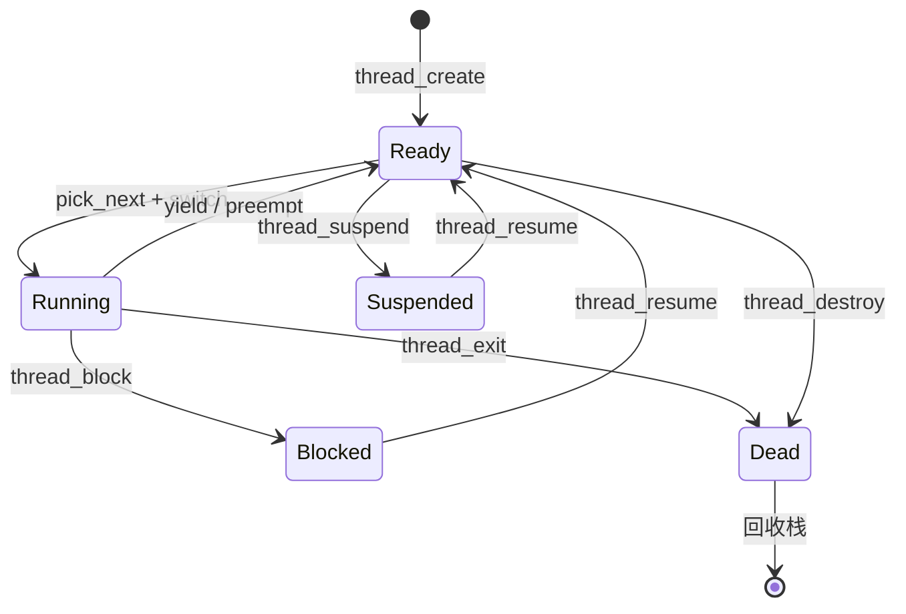

# EnerOS 线程/任务抽象设计

> 版本：v0.18.0 | 日期：2026-07-12 | 状态：设计文档
> 蓝图依据：`phase0.md §v0.18.0`（线程/任务抽象，蓝图第 3893–4111 行）、`Power_Native_Agent_OS_Blueprint.md §4`（调度算法）、§6.3（性能要求，单次切换 < 2μs）、§43.1（no_std 合规）、§43.2（非瓶颈版本，trait/struct 签名必须可编译）
> 实现位置：`crates/kernel/sched/src/` 下的 `tcb.rs` / `switch.rs` / `priority.rs`

## 1. 概述

EnerOS 线程/任务抽象是 Phase 0 P0-F（调度器）的起点版本。v0.16.0 多核调度器为系统
提供了 per-core 运行队列、核亲和性、RTOS 核独占与负载均衡能力，但其中调度单位仅以
`Tid`（一个 `u32` 包装类型）作为标识，缺少真正的线程数据结构、上下文与生命周期管理。

v0.18.0 在 `eneros-sched` crate 中引入 **TCB（Thread Control Block）** 作为调度的
基本单位，并配套实现五态状态机、ARM64 上下文切换与基本优先级调度。本版本是
v0.19.0 分区调度器的数据结构基础——分区调度器将基于 TCB 的 `partition` 字段
实现安全/非安全分区隔离调度。

本版本交付三个模块：

- **`tcb.rs`**（~250 行）— TCB 结构体、ThreadState 枚举、状态转换、全局线程表与
  生命周期 API（`thread_create / thread_destroy / thread_block / thread_resume /
  thread_exit / thread_yield / thread_state`）。
- **`switch.rs`**（~180 行）— ARM64 naked 函数 `context_switch`、`init_stack_frame`、
  `thread_switch` 包装函数。详细原理另见 `docs/smp/context-switch-guide.md`。
- **`priority.rs`**（~120 行）— `select_next_by_priority` 优先级选择算法与可选
  `PriorityQueue` 结构。

本版本**不**包含的能力（明确标注为「未来扩展」，见 §12）：

- 抢占式调度（时间片中断触发 `thread_yield`）—— v0.19.0+
- 分区调度（基于 `partition` 字段的隔离调度）—— v0.19.0
- 用户态线程与 EL0/EL1 模式切换 —— 未来版本
- 浮点/SIMD 上下文保存 —— 按需添加
- 协程/纤程（cooperative userspace fibers）—— Phase 1+

crate 顶层属性 `#![cfg_attr(not(test), no_std)]` 遵循蓝图 §43.1；本版本引入
`alloc` crate（Rust 内置，D2 决策），用于 `Box<Tcb>` 分配与栈的动态分配，
依赖 v0.10.0 `eneros-heap` 提供的全局分配器。

## 2. 背景

### 2.1 v0.16.0 调度器回顾

v0.16.0 多核调度器提供了以下数据结构与 API（详见
`docs/smp/multi-core-scheduler-design.md`）：

| 组件 | 类型/函数 | 位置 |
|------|-----------|------|
| 线程标识 | `pub struct Tid(pub u32)` | `sched/src/percore.rs` |
| 核亲和性掩码 | `pub struct CoreMask(pub u64)` | `sched/src/affinity.rs` |
| 自旋锁 | `pub struct Spinlock<T>` | `sched/src/percore.rs` |
| Per-core 运行队列 | `pub struct PerCoreRq { rq: [Option<Tid>; 64], lock: Spinlock<()> }` | `sched/src/percore.rs` |
| 调度器入口 | `pub fn sched_init(core_count: usize)` | `sched/src/lib.rs` |
| 入队 | `pub fn enqueue(tid: Tid, core: usize)` | `sched/src/lib.rs` |
| 选下一个 | `pub fn pick_next(core: usize) -> Option<Tid>` | `sched/src/lib.rs` |

调度器以 `Tid` 作为运行队列中的唯一标识，但 `Tid` 本身仅是一个数字包装类型，
**不携带任何线程上下文信息**（栈指针、入口、优先级、状态等）。这意味着：

1. `pick_next` 返回 `Tid` 后，调用方无法知道该线程的入口地址或栈指针，
   无法真正执行上下文切换。
2. 线程状态（Ready/Running/Blocked）没有显式表示，调度器无法判断一个 `Tid`
   是否有效、是否可调度。
3. 没有 `thread_create / thread_destroy` API，调用方必须自行管理线程的创建与销毁，
   容易出错。

### 2.2 v0.18.0 的角色

v0.18.0 的核心工作就是**填补 v0.16.0 调度器与真实可调度线程之间的空缺**：

- 引入 `Tcb` 结构体，将 `Tid` 与线程上下文（sp/pc/stack/priority/state）绑定。
- 引入 `ThreadState` 状态机，使调度器能正确判断线程是否可调度。
- 提供 `thread_create / thread_destroy / thread_block / thread_resume / thread_exit /
  thread_yield` 生命周期 API，封装线程的创建、销毁、阻塞、恢复与让出。
- 提供 ARM64 `context_switch` 实现，使 `pick_next` 返回的 `Tid` 真正能被切换执行。

本版本与 v0.16.0 的关系是「填充」而非「替代」：`Tid` / `CoreMask` / `Spinlock`
类型全部复用 v0.16.0 定义，本版本不重定义；`PerCoreRq` 仍存储 `Option<Tid>`，
但每个 `Tid` 现在能通过全局线程表（§4.3）查到对应的 `Tcb`。

## 3. 设计目标

本版本的设计目标如下：

| # | 目标 | 验收方式 |
|---|------|---------|
| G1 | 实现 `Tcb` 结构体与五态状态机 | 单元测试覆盖所有合法/非法转换 |
| G2 | 实现 ARM64 上下文切换（naked 函数） | QEMU 上两线程交替打印 |
| G3 | 实现基本优先级调度 | `select_next_by_priority` 选最小 priority |
| G4 | 提供线程生命周期 API | `thread_create → block → resume → exit` 流程 |
| G5 | 单次上下文切换 < 2μs | QEMU cortex-a57 测量 |
| G6 | no_std 合规（蓝图 §43.1） | `cargo build --target aarch64-unknown-none` 通过 |
| G7 | 测试覆盖率 ≥ 80% | `cargo tarpaulin`（host 侧可测部分） |

非目标（明确排除）：

- 抢占式调度（时间片中断）
- 分区调度（v0.19.0）
- 用户态线程（EL0）
- 浮点/SIMD 上下文保存

## 4. 数据结构设计

### 4.1 ThreadState 枚举

```rust
// crates/kernel/sched/src/tcb.rs
#[derive(Clone, Copy, PartialEq, Eq, Debug)]
pub enum ThreadState {
    /// 可调度，等待被选中运行
    Ready,
    /// 正在某个核上运行
    Running,
    /// 因等待资源（信号量/IPC/IO）而阻塞，不可调度
    Blocked,
    /// 被显式挂起（suspend），不可调度，可被 resume 唤醒
    Suspended,
    /// 已终止，TCB 槽位可回收
    Dead,
}
```

状态机转换图：



ASCII 版本（便于在终端查看）：

```
                  thread_create
                       │
                       ▼
                   ┌───────┐
        ┌─────────▶│ Ready │◀──────────┐
        │          └───┬───┘           │
        │              │               │
        │   pick_next  │   yield       │ resume
        │     +switch  ▼               │
        │          ┌─────────┐         │
        │          │ Running │         │
        │          └────┬────┘         │
        │   block       │              │
        │     ┌─────────┘              │
        │     ▼                        │
        │  ┌─────────┐  resume  ┌─────┴──────┐
        └──│ Blocked │─────────▶│   Ready     │
           └─────────┘          └─────────────┘
                                  ▲ suspend
                                  │
                              ┌───┴──────┐
                              │Suspended │
                              └──────────┘

  Running ──thread_exit──▶  Dead  ──回收──▶  [*]
  Ready   ──thread_destroy──▶  Dead
```

### 4.2 Tcb 结构体

```rust
// crates/kernel/sched/src/tcb.rs
use crate::percore::{Tid, CoreMask};

/// 线程控制块（Thread Control Block）
///
/// 一个 Tcb 实例代表一个可调度的内核态线程。
/// 字段含裸指针（stack/stack_top），因此 Tcb 不 impl Send/Sync（D5 决策），
/// 跨核访问必须通过全局线程表 + Spinlock。
pub struct Tcb {
    /// 线程标识（与 v0.16.0 `Tid` 同类型，复用）
    pub tid: Tid,
    /// 当前线程状态
    pub state: ThreadState,
    /// 优先级（0 最高，255 最低；同优先级 FIFO）
    pub priority: u8,
    /// 栈底指针（分配时的起始地址，用于销毁时 dealloc）
    pub stack: *mut u8,
    /// 栈顶指针（stack + stack_size，初始 sp 位置）
    pub stack_top: *mut u8,
    /// 栈大小（字节，必须 16 字节对齐）
    pub stack_size: usize,
    /// 保存的栈指针（上下文切换时存取）
    pub sp: u64,
    /// 保存的程序计数器（初始为 entry 地址）
    pub pc: u64,
    /// 线程入口函数（`fn() -> !`，永不返回）
    pub entry: fn() -> !,
    /// 核亲和性掩码（复用 v0.16.0 CoreMask）
    pub affinity: CoreMask,
    /// 所属分区 ID（0 = 默认分区；v0.19.0 分区调度器使用）
    pub partition: u32,
}
```

字段说明：

| 字段 | 类型 | 含义 | 初始值 |
|------|------|------|--------|
| `tid` | `Tid` | 全局唯一线程标识，索引全局线程表 | 由 `thread_create` 分配（索引+1） |
| `state` | `ThreadState` | 五态状态机当前状态 | `Ready` |
| `priority` | `u8` | 优先级，0 最高 | `thread_create` 参数 |
| `stack` | `*mut u8` | 栈底（分配起始地址） | `alloc::alloc::alloc` 返回值 |
| `stack_top` | `*mut u8` | 栈顶（`stack.add(stack_size)`） | `stack + stack_size` |
| `stack_size` | `usize` | 栈大小 | `thread_create` 参数 |
| `sp` | `u64` | 保存的栈指针，切换时存取 | `init_stack_frame(stack_top, entry)` |
| `pc` | `u64` | 保存的程序计数器 | `entry as u64` |
| `entry` | `fn() -> !` | 线程入口函数 | `thread_create` 参数 |
| `affinity` | `CoreMask` | 核亲和性掩码 | `CoreMask::all()`（v0.16.0 API） |
| `partition` | `u32` | 分区 ID | `0`（默认分区，v0.19.0 使用） |

### 4.3 全局线程表

```rust
// crates/kernel/sched/src/tcb.rs
use crate::percore::Spinlock;
use alloc::boxed::Box;
use core::mem::MaybeUninit;

/// 全局线程表最大容量
pub const MAX_THREADS: usize = 256;

/// 全局线程表：固定数组 + Spinlock 保护
///
/// 索引 i 对应 Tid(i+1)；Tid(0) 保留为「无效」。
/// 使用 MaybeUninit 避免对 Box<Tcb> 的默认初始化（Box 无 const fn new）。
pub static THREAD_TABLE: Spinlock<[Option<Box<Tcb>>; MAX_THREADS]> = {
    // const fn 初始化数组（依赖 v0.16.0 Spinlock 的 const fn new）
    const NONE: Option<Box<Tcb>> = None;
    Spinlock::new([NONE; MAX_THREADS])
};
```

设计要点：

- **固定数组 256 槽**：避免动态 Vec 带来的分配失败风险，上限足够 Phase 0 使用。
- **Tid(0) 保留为无效**：`thread_create` 失败时返回 `Tid(0)`，调用方可判空。
- **索引 i ↔ Tid(i+1) 映射**：`Tid` 是 `u32` 包装，便于跨核传递。
- **Spinlock 保护**：复用 v0.16.0 自定义 Spinlock（`const fn new`，D1 决策）。
- **`Option<Box<Tcb>>`**：`Box` 由 alloc crate 提供（D2 决策），销毁时 `drop` 自动回收栈。

## 5. 状态机设计

### 5.1 合法转换矩阵

下表列出所有合法的状态转换。空格表示非法转换（`transition()` 返回 `Err`）。

| 当前 \ 目标 | Ready | Running | Blocked | Suspended | Dead |
|------------|-------|---------|--------|----------|------|
| **Ready** | — | ✅ pick_next | | ✅ suspend | ✅ destroy |
| **Running** | ✅ yield | — | ✅ block | | ✅ exit |
| **Blocked** | ✅ resume | | — | | |
| **Suspended** | ✅ resume | | | — | |
| **Dead** | | | | | — |

合法转换共 8 条：

| # | 转换 | 触发 API | 说明 |
|---|------|----------|------|
| 1 | Ready → Running | `pick_next` + `thread_switch` | 被调度器选中 |
| 2 | Running → Ready | `thread_yield` | 主动让出 CPU |
| 3 | Running → Blocked | `thread_block` | 等待资源 |
| 4 | Blocked → Ready | `thread_resume` | 资源就绪 |
| 5 | Ready → Suspended | `thread_suspend`（未来） | 显式挂起 |
| 6 | Suspended → Ready | `thread_resume` | 显式恢复 |
| 7 | Running → Dead | `thread_exit` | 线程主动退出 |
| 8 | Ready → Dead | `thread_destroy` | 被外部销毁 |

### 5.2 非法转换示例

以下转换会被 `transition()` 拒绝并返回 `Err("invalid transition")`：

| 非法转换 | 原因 |
|---------|------|
| Ready → Blocked | 未运行无法阻塞（应先 suspend） |
| Blocked → Running | 必须先经过 Ready（由调度器选中） |
| Dead → Ready | 已死亡的线程不能复活（必须重新 create） |
| Dead → Running | 同上 |
| Suspended → Blocked | 必须先 resume 到 Ready |
| Running → Suspended | 运行中的线程应先 yield 到 Ready 再 suspend |

### 5.3 transition 方法

```rust
impl Tcb {
    /// 状态转换：合法则更新 state，非法返回 Err
    pub fn transition(&mut self, next: ThreadState) -> Result<(), &'static str> {
        use ThreadState::*;
        let ok = matches!(
            (self.state, next),
            (Ready, Running)
                | (Running, Ready)
                | (Running, Blocked)
                | (Blocked, Ready)
                | (Ready, Suspended)
                | (Suspended, Ready)
                | (Running, Dead)
                | (Ready, Dead)
        );
        if ok {
            self.state = next;
            Ok(())
        } else {
            Err("invalid transition")
        }
    }
}
```

实现说明：

- 用 `matches!` 宏替代蓝图中的 `match` + `true/false` 写法，更简洁且编译器可验证穷尽性。
- 错误类型用 `&'static str`（no_std 友好，无需 `alloc::string::String`）。
- 方法接受 `&mut self`，调用方需持有 `THREAD_TABLE` 锁。

## 6. 生命周期 API 设计

### 6.1 thread_create

```rust
/// 创建新线程
///
/// 分配 Tcb（Box）与栈（alloc::alloc），初始化栈帧，插入全局线程表。
///
/// # 参数
/// - `entry`: 线程入口函数（`fn() -> !`，永不返回）
/// - `stack_size`: 栈大小（字节，建议 ≥ 4096，必须 16 字节对齐）
/// - `priority`: 优先级（0 最高）
///
/// # 返回
/// - 成功：`Tid(index + 1)`，index 为全局线程表中的槽位
/// - 失败：`Tid(0)`（表满或栈分配失败）
pub fn thread_create(entry: fn() -> !, stack_size: usize, priority: u8) -> Tid {
    // 1. 锁定全局线程表，查找空闲槽
    let mut table = THREAD_TABLE.lock();
    let idx = match table.iter().position(|slot| slot.is_none()) {
        Some(i) => i,
        None => return Tid(0),  // 表满
    };

    // 2. 分配栈（16 字节对齐）
    let layout = match core::alloc::Layout::from_size_align(stack_size, 16) {
        Ok(l) => l,
        Err(_) => return Tid(0),
    };
    let stack = unsafe { alloc::alloc::alloc(layout) };
    if stack.is_null() {
        return Tid(0);  // 栈分配失败
    }

    // 3. 构造 Tcb，初始化栈帧
    let tid = Tid(idx as u32 + 1);
    let tcb = Tcb::new(tid, entry, stack, stack_size, priority);

    // 4. 存入全局线程表
    table[idx] = Some(Box::new(tcb));
    tid
}
```

### 6.2 thread_destroy

```rust
/// 销毁线程（外部调用）
///
/// Running 状态拒绝销毁（必须先切换再回收），其他状态置 Dead 并回收栈。
///
/// # 返回
/// - `Ok(())`: 成功销毁
/// - `Err("cannot destroy running thread")`: 当前正在运行
/// - `Err("invalid tid")`: Tid 无效或槽位为空
pub fn thread_destroy(tid: Tid) -> Result<(), &'static str> {
    let idx = match tid_to_idx(tid) {
        Some(i) => i,
        None => return Err("invalid tid"),
    };
    let mut table = THREAD_TABLE.lock();
    if let Some(tcb) = table[idx].as_mut() {
        if tcb.state == ThreadState::Running {
            return Err("cannot destroy running thread");
        }
        // 回收栈
        let layout = core::alloc::Layout::from_size_align(tcb.stack_size, 16).unwrap();
        unsafe { alloc::alloc::dealloc(tcb.stack, layout) };
        // 置 Dead 并移除槽位
        tcb.state = ThreadState::Dead;
    }
    table[idx] = None;  // drop Box<Tcb> 自动回收 Tcb 结构体
    Ok(())
}
```

### 6.3 thread_block / thread_resume

```rust
/// 阻塞线程（Running → Blocked）
///
/// 典型场景：线程等待信号量/IPC/IO。
/// 调用后应立即触发调度切换（thread_yield 或 pick_next）。
pub fn thread_block(tid: Tid) -> Result<(), &'static str> {
    let idx = tid_to_idx(tid).ok_or("invalid tid")?;
    let mut table = THREAD_TABLE.lock();
    let tcb = table[idx].as_mut().ok_or("slot empty")?;
    tcb.transition(ThreadState::Blocked)
}

/// 恢复线程（Blocked/Suspended → Ready）
pub fn thread_resume(tid: Tid) -> Result<(), &'static str> {
    let idx = tid_to_idx(tid).ok_or("invalid tid")?;
    let mut table = THREAD_TABLE.lock();
    let tcb = table[idx].as_mut().ok_or("slot empty")?;
    match tcb.state {
        ThreadState::Blocked | ThreadState::Suspended => {
            tcb.transition(ThreadState::Ready)
        }
        _ => Err("can only resume Blocked/Suspended"),
    }
}
```

### 6.4 thread_exit

```rust
/// 线程主动退出（Running → Dead）
///
/// 置 Dead，回收栈，切换到下一个线程。
/// 该函数永不返回（`-> !`）。
///
/// # 安全性
/// 仅可由当前正在运行的线程调用，外部调用危险。
pub fn thread_exit(tid: Tid) -> ! {
    {
        let mut table = THREAD_TABLE.lock();
        let idx = tid_to_idx(tid).expect("thread_exit: invalid tid");
        if let Some(tcb) = table[idx].as_mut() {
            tcb.transition(ThreadState::Dead)
                .expect("thread_exit: state must be Running");
            // 回收栈
            let layout = core::alloc::Layout::from_size_align(tcb.stack_size, 16).unwrap();
            unsafe { alloc::alloc::dealloc(tcb.stack, layout) };
        }
        table[idx] = None;  // drop Box<Tcb>
    }
    // 切换到下一个线程（永不返回）
    // 实际实现需配合调度器：current_tid = None; schedule_next();
    loop {
        core::hint::spin_loop();
    }
}
```

### 6.5 thread_yield

```rust
/// 当前线程主动让出 CPU（Running → Ready）
///
/// 调用后立即触发调度切换。
pub fn thread_yield() {
    // 1. 当前线程 → Ready
    // 2. pick_next 选下一个线程
    // 3. thread_switch 切换
    // 注：实际实现需配合「当前运行线程」per-core 变量
}
```

### 6.6 thread_state

```rust
/// 查询线程状态
pub fn thread_state(tid: Tid) -> Option<ThreadState> {
    let idx = tid_to_idx(tid)?;
    let table = THREAD_TABLE.lock();
    table[idx].as_ref().map(|tcb| tcb.state)
}

/// Tid → 全局线程表索引（内部辅助）
fn tid_to_idx(tid: Tid) -> Option<usize> {
    if tid.0 == 0 || tid.0 as usize > MAX_THREADS {
        return None;
    }
    Some(tid.0 as usize - 1)
}
```

## 7. 与 v0.16.0 调度器的关系

### 7.1 复用而非重定义

v0.18.0 **复用** v0.16.0 已有的以下类型与 API，**不重定义**：

| 类型/API | 来源 | 复用方式 |
|---------|------|---------|
| `Tid(pub u32)` | `crates/kernel/sched/src/percore.rs` | `use crate::percore::Tid` |
| `CoreMask` | `crates/kernel/sched/src/affinity.rs` | `use crate::affinity::CoreMask` |
| `Spinlock<T>` | `crates/kernel/sched/src/percore.rs` | 用于 `THREAD_TABLE` 保护 |
| `PerCoreRq` | `crates/kernel/sched/src/percore.rs` | 仍存储 `Option<Tid>`，不变 |
| `sched_init / enqueue / pick_next` | `crates/kernel/sched/src/lib.rs` | 不修改 |

### 7.2 填充而非替代

v0.16.0 的 `PerCoreRq` 仍存储 `Option<Tid>`，但每个 `Tid` 现在通过全局线程表
`THREAD_TABLE` 能查到对应的 `Tcb`。调度流程变为：

```text
v0.16.0:  pick_next(core) -> Tid  ──(无法切换)──▶  ???
v0.18.0:  pick_next(core) -> Tid  ──(查表)──▶  Tcb  ──(thread_switch)──▶  执行
```

具体流程：

1. `pick_next(core)` 返回 `Some(Tid)`（v0.16.0 API，不变）
2. `THREAD_TABLE.lock()` 查 `Tcb`（v0.18.0 新增）
3. `thread_switch(&mut current, &next)`（v0.18.0 新增）

### 7.3 为 v0.19.0 分区调度器铺路

v0.19.0 分区调度器将基于 TCB 的 `partition` 字段实现：

- 每个 `Tcb.partition` 标记所属分区（0 = 默认，1 = 安全分区，2 = 非安全分区）
- 分区调度器在 `pick_next` 时按 `partition` 过滤
- 分区间的隔离由 `partition` 字段 + 核亲和性共同保证

v0.18.0 的 `partition` 字段默认为 0，不参与调度决策，仅作为数据结构预留。

## 8. 优先级调度设计

### 8.1 优先级语义

- `priority: u8`，**0 最高，255 最低**
- `thread_create` 时由参数指定
- 同优先级线程按 FIFO 顺序调度（先入队先执行）

### 8.2 select_next_by_priority

```rust
// crates/kernel/sched/src/priority.rs
use crate::tcb::{THREAD_TABLE, ThreadState, Tcb};
use crate::percore::Tid;

/// 在所有 Ready 线程中选择优先级最高（priority 值最小）的
///
/// 同优先级按 Tid 升序（FIFO 近似）
pub fn select_next_by_priority() -> Option<Tid> {
    let table = THREAD_TABLE.lock();
    let mut best: Option<(u8, Tid)> = None;
    for slot in table.iter() {
        if let Some(tcb) = slot {
            if tcb.state == ThreadState::Ready {
                match best {
                    None => best = Some((tcb.priority, tcb.tid)),
                    Some((bp, _)) if tcb.priority < bp => {
                        best = Some((tcb.priority, tcb.tid))
                    }
                    _ => {}
                }
            }
        }
    }
    best.map(|(_, tid)| tid)
}
```

### 8.3 可选 PriorityQueue 结构

为未来扩展预留（本版本不实现，仅定义接口）：

```rust
// 未来扩展：基于 BinaryHeap 的优先级队列
// 当前版本使用线性扫描（256 槽足够快）
pub struct PriorityQueue {
    // heap: BinaryHeap<Reverse<(u8, Tid)>>,
}
```

设计决策：本版本先用线性扫描（O(n)），原因：

1. 全局线程表固定 256 槽，扫描成本可接受（< 1μs）
2. 避免引入 `alloc::collections::BinaryHeap` 带来的动态分配
3. v0.19.0 分区调度器会改为 per-core 优先级队列

## 9. 内存管理

### 9.1 Tcb 分配

- 用 `alloc::boxed::Box`（Rust 内置 alloc crate，D2 决策）
- `Box::new(tcb)` 在堆上分配 Tcb 结构体
- 依赖 v0.10.0 `eneros-heap` 提供的全局分配器（`#[global_allocator]`）

```rust
// crates/kernel/sched/Cargo.toml
[dependencies]
eneros-heap = { path = "../../kernel/heap" }  # 间接提供全局分配器
# 注：alloc crate 由 Rust 工具链内置，不需在 Cargo.toml 声明
```

### 9.2 栈分配

- 用 `alloc::alloc::alloc(layout)` 分配原始内存
- `Layout::from_size_align(stack_size, 16)` 保证 16 字节对齐（ARM64 SP 要求）
- 销毁时用 `alloc::alloc::dealloc(stack, layout)` 回收

```rust
// 分配
let layout = core::alloc::Layout::from_size_align(stack_size, 16)?;
let stack = unsafe { alloc::alloc::alloc(layout) };
assert!(!stack.is_null());

// 回收
unsafe { alloc::alloc::dealloc(stack, layout) };
```

### 9.3 销毁流程

`thread_destroy / thread_exit` 的回收顺序：

1. 回收栈内存（`dealloc`）
2. 置 `state = Dead`
3. `table[idx] = None` —— 触发 `Box<Tcb>` 的 `drop`，回收 Tcb 结构体

注意：必须先回收栈，再 drop Tcb，否则 Tcb 中的 `stack` 指针会悬垂。

## 10. 设计决策

| # | 决策 | 理由 |
|---|------|------|
| **D1** | `Tid` / `CoreMask` / `Spinlock` 复用 v0.16.0 定义，不重定义 | 避免类型不一致；v0.16.0 已 `const fn` 友好 |
| **D2** | 引入 `alloc` crate（Rust 内置），不引入 `spin` / `heapless` | 保持零外部依赖精神；alloc crate 由 Rust 工具链提供，非第三方 |
| **D3** | naked 函数用 `#[cfg(target_arch = "aarch64")]` 门控，host 侧 stub | 保证 host 可编译测试（蓝图 §43.2） |
| **D4** | 全局线程表用 `Spinlock<[Option<Box<Tcb>>; 256]>` | 固定数组避免动态分配；Spinlock 复用 v0.16.0 |
| **D5** | `Tcb` 不 impl `Send` / `Sync`（含裸指针 `*mut u8`） | 跨核访问必须经 `THREAD_TABLE` + Spinlock，强制安全 |
| **D6** | `priority.rs` 自行设计，不复用外部优先级队列 crate | 零依赖；256 槽线性扫描足够 |
| **D7** | 非瓶颈版本（蓝图 §43.2）：代码骨架可用，trait/struct 签名可编译 | v0.18.0 非瓶颈版本，允许部分实现细节用伪代码 |

## 11. 测试策略

### 11.1 测试矩阵

| 测试类别 | 测试内容 | 运行环境 | 可测性 |
|---------|---------|---------|--------|
| 状态机 | 所有合法转换 → Ok | host (x86_64) | ✅ 完全可测 |
| 状态机 | 所有非法转换 → Err | host (x86_64) | ✅ 完全可测 |
| 栈帧初始化 | `init_stack_frame` 写入正确偏移 | aarch64 only | ✅ QEMU |
| `context_switch` | naked 函数编译通过 | host | ✅ 仅测编译 |
| `context_switch` | 两线程交替打印 | aarch64 | ✅ QEMU |
| 全局 API | `thread_create / block / resume / destroy` | host (std 分配器) | ✅ 完全可测 |
| 优先级选择 | `select_next_by_priority` 选最小 | host | ✅ 完全可测 |
| 性能 | 单次切换 < 2μs | aarch64 QEMU | ✅ 测量 |

### 11.2 host 侧测试要点

host 侧（x86_64）测试时：

- 使用 `std` 提供的全局分配器（不需 `eneros-heap`）
- `context_switch` 用 cfg gate 切换为 stub（`panic!("aarch64 only")`）
- 仅测 API 签名与状态机逻辑，不测真实切换

```rust
#[cfg(test)]
mod tests {
    use super::*;

    #[test]
    fn test_state_transitions() {
        let mut tcb = Tcb::new(Tid(1), test_entry, dummy_stack(), 4096, 0);
        assert_eq!(tcb.state, ThreadState::Ready);

        assert!(tcb.transition(ThreadState::Running).is_ok());
        assert!(tcb.transition(ThreadState::Blocked).is_ok());
        assert!(tcb.transition(ThreadState::Ready).is_ok());
        assert!(tcb.transition(ThreadState::Dead).is_ok());

        // 非法转换
        let mut tcb2 = Tcb::new(Tid(2), test_entry, dummy_stack(), 4096, 0);
        assert!(tcb2.transition(ThreadState::Blocked).is_err());  // Ready → Blocked 非法
    }
}
```

### 11.3 覆盖率目标

- 状态机转换：100%（合法 + 非法全覆盖）
- 全局 API：≥ 80%（create/destroy/block/resume/state 主路径）
- `init_stack_frame`：aarch64 only，QEMU 验证
- `context_switch`：仅测编译，不测执行
- 整体 ≥ 80%（蓝图 §6.1）

## 12. 未来扩展

| 版本 | 扩展内容 | 依赖 |
|------|---------|------|
| v0.19.0 | 分区调度器（基于 `partition` 字段隔离调度） | 本版本 TCB |
| v0.19.0+ | 抢占式调度（时间片中断触发 `thread_yield`） | 本版本 + v0.12.0 定时器 |
| Phase 1+ | 协程/纤程（cooperative userspace fibers） | 本版本 + 用户态切换 |
| 未来 | 用户态线程模式切换（EL0/EL1） | 本版本 + MMU 虚拟化 |
| 未来 | 浮点/SIMD 上下文保存 | 按需添加 `fpsimd` 寄存器保存 |
| 未来 | 栈溢出防护（guard page） | 本版本 + MMU |

## 13. 参考资料

- `蓝图/phase0.md §v0.18.0`（第 3893–4111 行）—— 本版本蓝图
- `蓝图/Power_Native_Agent_OS_Blueprint.md §4`—— 调度算法
- `蓝图/Power_Native_Agent_OS_Blueprint.md §6.3`—— 性能要求（切换 < 2μs）
- `蓝图/Power_Native_Agent_OS_Blueprint.md §43.1`—— no_std 合规
- `docs/smp/multi-core-scheduler-design.md`—— v0.16.0 调度器设计（前置依赖）
- `docs/smp/memory-coherence-design.md`—— v0.17.0 多核一致性（前置依赖）
- `docs/smp/context-switch-guide.md`—— 上下文切换详解（配套文档）
- ARM Architecture Reference Manual (ARMv8) —— §C5（异常模型）、§D1（寄存器）
